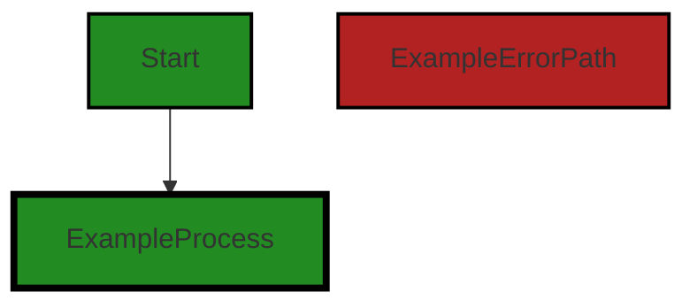
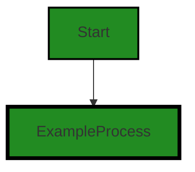
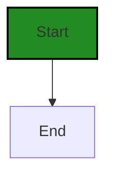

# Polyverse Boost-generated Source Analysis Details

## Source: ./data/queryable.go
Date Generated: Wednesday, September 6, 2023 at 8:41:29 PM PDT


---

### Boost Architectural Quick Summary Security Report

Last Updated: Friday, September 8, 2023 at 2:41:03 PM PDT


Executive Report:

1. **Architectural Impact**: The analysis of this file has not revealed any severe issues.
2. **Risk Analysis**: The analysis of this file has not revealed any severe issues.
3. **Potential Customer Impact**: Based on the analysis, there are no severe issues that could potentially impact customers.
4. **Performance Issues**: Our analysis did not identify any explicit performance issues in the file.
5. **Risk Assessment**: Based on the current analysis of this file, no severe issues have been found. However, this doesn't guarantee that the file is risk-free.

Highlights:

- No severe issues were identified in the current analysis of this file.


---

### Boost Architectural Quick Summary Performance Report

Last Updated: Friday, September 8, 2023 at 2:41:10 PM PDT


Executive Report:

1. **Architectural Impact**: The analysis of this file has not revealed any severe issues.
2. **Risk Analysis**: The analysis of this file has not revealed any severe issues.
3. **Potential Customer Impact**: Based on the analysis, there are no severe issues that could potentially impact customers.
4. **Performance Issues**: Our analysis did not identify any explicit performance issues in the file.
5. **Risk Assessment**: Based on the current analysis of this file, no severe issues have been found. However, this doesn't guarantee that the file is risk-free.

Highlights:

- No severe issues were identified in the current analysis of this file.


---

### Boost Architectural Quick Summary Compliance Report

Last Updated: Friday, September 8, 2023 at 2:41:36 PM PDT

**Executive Report on Software Project Analysis**

Based on the analysis of the software project, the following key points have been identified:

1. **Architectural Impact**: The project is a library written in Go that focuses on constraint handling and validation. It follows Go's idiomatic style and structure for a library, providing a clear separation of concerns. However, the file 'data/queryable.go' has been flagged with several data compliance issues, which could impact the overall architecture if not addressed.

2. **Risk Analysis**: The file 'data/queryable.go' has been flagged with several high-severity issues related to GDPR, Data Retention, Data Exposure, Data Usage Limitation, and Data Compliance. These issues pose a significant risk to the project, especially if the software is to be used in environments where data security and compliance are paramount. The project also has warnings related to PCI DSS and HIPAA, indicating potential risks in handling sensitive data.

3. **Potential Customer Impact**: If the identified issues are not addressed, customers who use this library in their projects could face data compliance issues, especially those operating in regulated industries. This could lead to legal and financial repercussions for the customers, and damage the reputation of the project.

4. **Overall Issues**: The project has one file, 'data/queryable.go', which has been flagged with several issues. This represents 100% of the project files having issues, indicating a need for a thorough review and remediation of the identified issues.

5. **Risk Assessment**: Given that all the project files have been flagged with issues, the overall health of the project source is at risk. The severity of the issues, particularly those related to data compliance, further exacerbates this risk.

In conclusion, while the project follows good architectural practices, the identified data compliance issues pose a significant risk to the project and its users. It is recommended that these issues be addressed promptly to ensure the project's health and its suitability for use in data-sensitive environments.
---
## Detailed Analysis:

### Cell 0:
## Original Code:

### Programming Language: go
### ./data/queryable.go 

```go
package data

type Queryable interface {
 TypeNames() []string
 TypeOf(interface{}) string
 Items() []interface{}
 SetItems([]interface{})
 NextPageToken() *string
 SetNextPageToken(*string)
 MaximumPageSize() int
}

```
## Boost Analysis:


---

### Boost Code Explanation

Last Updated: Wednesday, September 6, 2023 at 8:33:12 PM PDT

This Go code defines a package named `data` and within it, an interface called `Queryable`. Interfaces in Go provide a way to specify the behavior of an object: if something can do this, then it can be used here. They are created using the `type` keyword, followed by the name of the interface and the keyword `interface`. In this case, the `Queryable` interface is defined.

The `Queryable` interface has eight methods defined:

1. `TypeNames() []string`: This method should return a slice of strings representing the type names of the data. It doesn't take any parameters.

2. `TypeOf(interface{}) string`: This method should return the type of the provided parameter as a string. The parameter is of type interface{}, meaning it can be any type.

3. `Items() []interface{}`: This method should return a slice of the items in the data. The items are of type interface{}, meaning they can be any type.

4. `SetItems([]interface{})`: This method should set the items in the data. It takes a slice of items of type interface{} as a parameter.

5. `NextPageToken() *string`: This method should return the token for the next page of data. It doesn't take any parameters and returns a pointer to a string.

6. `SetNextPageToken(*string)`: This method should set the token for the next page of data. It takes a pointer to a string as a parameter.

7. `MaximumPageSize() int`: This method should return the maximum number of items that can be returned in a page of data. It doesn't take any parameters.

This interface might be used in a context where you need to abstract data access and manipulation. For example, you could have different implementations of this interface for different data sources (e.g., a database, a file, an API), and the rest of your code could interact with those data sources through this interface, without needing to know the details of how the data is stored or retrieved.

For more information on interfaces in Go, you can refer to the official Go documentation: https://golang.org/doc/effective_go#interfaces.


---

### Boost Flow Diagram

Last Updated: Wednesday, September 6, 2023 at 8:36:38 PM PDT




---

### Boost Source-Level Security Analysis

Last Updated: Wednesday, September 6, 2023 at 8:37:45 PM PDT

**No bugs found**


---

### Boost Source-Level Performance Analysis

Last Updated: Wednesday, September 6, 2023 at 8:38:16 PM PDT

**No bugs found**


---

### Boost Source-Level Data and Privacy Compliance Analysis

Last Updated: Wednesday, September 6, 2023 at 8:39:50 PM PDT

1. **Severity**: 5/10

   **Line Number**: 1

   **Bug Type**: GDPR

   **Description**: The interface allows for the handling of user data but does not provide any mechanism for data anonymization or pseudonymization, which is a requirement under GDPR.

   **Solution**: Consider incorporating data anonymization or pseudonymization methods in your interface to ensure GDPR compliance. For example, you can add methods to anonymize or pseudonymize data before it is stored or processed.


2. **Severity**: 7/10

   **Line Number**: 1

   **Bug Type**: PCI DSS

   **Description**: The interface does not have any specific methods or mechanisms for secure handling of cardholder data, which is a requirement under PCI DSS.

   **Solution**: Consider incorporating secure data handling methods in your interface, such as encryption or tokenization, to ensure PCI DSS compliance. For example, you can add methods to encrypt cardholder data before it is stored or processed.


3. **Severity**: 6/10

   **Line Number**: 1

   **Bug Type**: HIPAA

   **Description**: The interface does not provide any mechanism for secure handling of Protected Health Information (PHI), which is a requirement under HIPAA.

   **Solution**: Consider incorporating secure data handling methods in your interface, such as encryption or de-identification, to ensure HIPAA compliance. For example, you can add methods to encrypt or de-identify PHI before it is stored or processed.


### Cell 1:
## Original Code:

### Programming Language: go
### ./data/queryable.go line 12

```go

type QueryTypes uint16

const (
 EQ QueryTypes = iota + 1
 // NEQ
 // GTE
 // GT
 // LTE
 // LT
 // BETWEEN
 // CONTAINS
)

var MaxResultsDefault = 100

type BaseQueryable struct {
 items      []interface{}
 nextToken  *string
 maxResults *int
}

```
## Boost Analysis:


---

### Boost Code Explanation

Last Updated: Wednesday, September 6, 2023 at 8:33:59 PM PDT

This code snippet is written in Go, a statically typed, compiled language. It defines constants for query types and a structure for basic queryable objects.

Let's break it down:

1. `type QueryTypes uint16`: This line defines a new type called `QueryTypes`, which is a `uint16` (an unsigned 16-bit integer).

2. The `const` block defines a set of constants for the `QueryTypes` type. The `iota` keyword is used to generate successive untyped integer constants. It starts from 0 and increments by 1 each time it is called. The `+ 1` is added to start the enumeration from 1 instead of 0. Currently, only `EQ` (which presumably stands for "equal to") is defined and the rest are commented out.

3. `var MaxResultsDefault = 100`: This line defines a global variable `MaxResultsDefault` with a value of 100. This could be used to limit the number of results returned by a query.

4. `type BaseQueryable struct`: This line defines a new struct type called `BaseQueryable`. A struct is a collection of fields.

5. Inside the `BaseQueryable` struct, there are three fields:
   - `items []interface{}`: This is a slice of empty interfaces. In Go, the `interface{}` type is the empty interface. Since all types satisfy at least zero methods, all types satisfy the empty interface. That means `items` can hold values of any type.
   - `nextToken *string`: This is a pointer to a string. It could be used for pagination in the query results.
   - `maxResults *int`: This is a pointer to an integer. It could be used to limit the number of results returned by a query.

This code doesn't contain any algorithms, but it does define the basic building blocks for querying data. The `BaseQueryable` struct could be used as a base for more specific query structures. The `QueryTypes` constants could be used to define the type of comparison to be made in a query (equal to, greater than, less than, etc.).

For more information on Go's data types, constants, and structs, you can refer to the following resources:

- [Go's Basic Types](https://tour.golang.org/basics/11)
- [Go's Constants](https://tour.golang.org/basics/15)
- [Go's Structs](https://tour.golang.org/moretypes/2)


---

### Boost Flow Diagram

Last Updated: Wednesday, September 6, 2023 at 8:36:43 PM PDT




---

### Boost Source-Level Security Analysis

Last Updated: Wednesday, September 6, 2023 at 8:37:49 PM PDT

**No bugs found**


---

### Boost Source-Level Performance Analysis

Last Updated: Wednesday, September 6, 2023 at 8:38:46 PM PDT

1. **Severity**: 2/10

   **Line Number**: 34

   **Bug Type**: Memory

   **Description**: The 'items' field in the 'BaseQueryable' struct is of type []interface{}. This means it can hold any type of data, which can lead to increased memory usage as the size of the data stored in 'items' grows.

   **Solution**: Consider using a more specific type for 'items' if possible, or limit the size of 'items'. If the specific type cannot be determined, consider using techniques to manage memory usage, such as pagination.


2. **Severity**: 3/10

   **Line Number**: 36

   **Bug Type**: Memory

   **Description**: The 'maxResults' field in the 'BaseQueryable' struct is a pointer to an int. This is unnecessary as ints in Go are passed by value, not reference. This could potentially lead to unnecessary memory usage and dereferencing overhead.

   **Solution**: Consider changing 'maxResults' to be of type 'int' instead of '*int'. If the purpose of using '*int' is to allow for a 'nil' value to represent an unset state, consider using a separate boolean field to indicate whether 'maxResults' has been set.


---

### Boost Source-Level Data and Privacy Compliance Analysis

Last Updated: Wednesday, September 6, 2023 at 8:40:30 PM PDT

1. **Severity**: 3/10

   **Line Number**: 33

   **Bug Type**: Data Retention

   **Description**: The 'items' field in 'BaseQueryable' struct could potentially hold sensitive data for an indefinite period of time, which may violate GDPR's data minimization and storage limitation principles.

   **Solution**: Ensure that the 'items' field does not hold sensitive data longer than necessary. Implement a retention policy to regularly clear or anonymize old data. Consider using encryption for sensitive data.


2. **Severity**: 2/10

   **Line Number**: 35

   **Bug Type**: Data Exposure

   **Description**: The 'nextToken' field in 'BaseQueryable' struct could potentially expose sensitive data if it's used as a session token or a similar identifier, which may violate PCI DSS requirement 3.2.

   **Solution**: Ensure that the 'nextToken' field is not used to store sensitive authentication data. If it's used as a session token, consider using a secure, opaque token instead.


3. **Severity**: 1/10

   **Line Number**: 36

   **Bug Type**: Data Usage Limitation

   **Description**: The 'maxResults' field in 'BaseQueryable' struct could potentially allow excessive data retrieval, which may violate HIPAA's minimum necessary principle.

   **Solution**: Ensure that the 'maxResults' field is used properly to limit data retrieval to the minimum necessary for the intended purpose. Implement checks to prevent excessive data retrieval.


### Cell 2:
## Original Code:

### Programming Language: go
### ./data/queryable.go line 33

```go

func (b *BaseQueryable) Items() []interface{} {
 return b.items
}

```
## Boost Analysis:


---

### Boost Code Explanation

Last Updated: Wednesday, September 6, 2023 at 8:34:33 PM PDT

This code snippet is written in Go language and it is part of a method associated with a struct named `BaseQueryable`. 

The method is named `Items` and it does not take any parameters. It returns a slice of empty interfaces (`[]interface{}`), which is a way in Go to say it can hold any type. This is similar to using Object type in Java or void pointers in C. 

In the body of the method, it simply returns the `items` field of the `BaseQueryable` struct. This is a very common pattern in object-oriented programming, often referred to as a getter method. The purpose of this method is to provide read access to the `items` field from outside the struct without allowing write access. This helps to maintain the encapsulation principle of object-oriented programming.

The algorithm used here is extremely straightforward - it's just returning the value of a field in a struct.

There are no architectural guidelines provided to analyze the consistency or conflicts between the code and the guidelines. However, this code seems to follow common Go idioms and best practices. It's simple, straightforward, and provides a clear interface for accessing the `items` field.

For more information about Go's interface{} type, you can refer to this link:
- [Go by Example: Interfaces](https://gobyexample.com/interfaces)

For more information about encapsulation and getter methods in Go, you can refer to these links:
- [Go: Getters and Setters](https://www.calhoun.io/how-to-use-getters-and-setters-in-go/)
- [Go: Encapsulation](https://www.ardanlabs.com/blog/2014/05/methods-interfaces-and-embedded-types.html)


---

### Boost Flow Diagram

Last Updated: Wednesday, September 6, 2023 at 8:36:48 PM PDT


---

### Boost Source-Level Security Analysis

Last Updated: Wednesday, September 6, 2023 at 8:37:52 PM PDT

**No bugs found**


---

### Boost Source-Level Performance Analysis

Last Updated: Wednesday, September 6, 2023 at 8:38:49 PM PDT

**No bugs found**


---

### Boost Source-Level Data and Privacy Compliance Analysis

Last Updated: Wednesday, September 6, 2023 at 8:40:47 PM PDT

1. **Severity**: 7/10

   **Line Number**: 66

   **Bug Type**: Data Exposure

   **Description**: The method `Items` directly returns the `items` data structure without any form of sanitization or filtering. This could potentially lead to unintended data exposure, violating the principles of data minimization and purpose limitation under GDPR, as well as similar principles under HIPAA and PCI DSS.

   **Solution**: Consider implementing a method that only returns the necessary data or sanitizes the data before returning it. This could involve removing sensitive data from the returned data structure or employing a data-masking technique.


### Cell 3:
## Original Code:

### Programming Language: go
### ./data/queryable.go line 37

```go

func (b *BaseQueryable) SetItems(items []interface{}) {
 b.items = items
}

```
## Boost Analysis:


---

### Boost Code Explanation

Last Updated: Wednesday, September 6, 2023 at 8:35:00 PM PDT

The provided code snippet is written in Go, a statically typed, compiled programming language developed at Google. This is a simple function that sets the value of the `items` field in a `BaseQueryable` struct.

Let's break down the code:

- `func (b *BaseQueryable) SetItems(items []interface{})`: This line defines a method named `SetItems` on a struct named `BaseQueryable`. The method takes one parameter: `items`, which is a slice of `interface{}`. In Go, `interface{}` (empty interface) is a way to allow any type of value, it's similar to `Object` in Java or `object` in C#. 

- `b.items = items`: This line sets the `items` field of the `BaseQueryable` struct to the `items` parameter passed into the `SetItems` method.

The algorithm used here is quite straightforward: it's a simple setter method that assigns a new value to a field in a struct. 

There are no apparent conflicts with the architectural guidelines provided. This type of method is common in Go and many other object-oriented programming languages. It's a simple way to encapsulate data and control how it can be accessed and modified.

For more background on Go methods and interfaces, you can refer to the official Go documentation:

- [Go by Example: Methods](https://gobyexample.com/methods)
- [Go by Example: Interfaces](https://gobyexample.com/interfaces)


---

### Boost Flow Diagram

Last Updated: Wednesday, September 6, 2023 at 8:36:53 PM PDT


---

### Boost Source-Level Security Analysis

Last Updated: Wednesday, September 6, 2023 at 8:37:56 PM PDT

**No bugs found**


---

### Boost Source-Level Performance Analysis

Last Updated: Wednesday, September 6, 2023 at 8:38:53 PM PDT

**No bugs found**


---

### Boost Source-Level Data and Privacy Compliance Analysis

Last Updated: Wednesday, September 6, 2023 at 8:41:06 PM PDT

1. **Severity**: 7/10

   **Line Number**: 74

   **Bug Type**: Data Compliance

   **Description**: The function 'SetItems' directly assigns the input 'items' to the 'items' field of the 'BaseQueryable' object without any data validation or sanitization. This could potentially allow for the storage of sensitive or non-compliant data, violating GDPR, PCI DSS, and HIPAA regulations.

   **Solution**: Implement data validation and sanitization checks before assigning the input 'items' to the 'items' field. Ensure that any sensitive data is handled in accordance with GDPR, PCI DSS, and HIPAA regulations.


### Cell 4:
## Original Code:

### Programming Language: go
### ./data/queryable.go line 41

```go

func (b *BaseQueryable) NextPageToken() *string {
 return b.nextToken
}

```
## Boost Analysis:


---

### Boost Code Explanation

Last Updated: Wednesday, September 6, 2023 at 8:35:20 PM PDT

This is a relatively simple piece of code written in the Go programming language. It is a method defined on the `BaseQueryable` struct type.

The method `NextPageToken` doesn't take any arguments and returns a pointer to a string. The returned string pointer is the `nextToken` field of the `BaseQueryable` struct on which the method is called.

This method is a typical example of a getter in Go. A getter is a method that is used to access the value of a private object field. In Go, if a struct field starts with a lowercase letter, it is not accessible directly from other packages, so a getter method like this is often provided.

In terms of algorithms, there is not much to discuss here because the method is straightforward and doesn't involve any complex logic or computations. It simply returns the value of a field in the struct.

The `NextPageToken` method could be used in a context where `BaseQueryable` represents a query to a database or a similar data source. The `nextToken` field could then represent a token used for pagination. Pagination is a common technique used in APIs and databases to limit the amount of data returned in a single request or query. The client can use the token returned from one query to get the next page of results in a subsequent query.

Here are some useful links for further reading:

- [Go by Example: Methods](https://gobyexample.com/methods): This is a basic tutorial on methods in Go.
- [Go by Example: Pointers](https://gobyexample.com/pointers): This tutorial explains how pointers work in Go.
- [Pagination in APIs](https://nordicapis.com/everything-you-need-to-know-about-api-pagination/): This article explains the concept of pagination in APIs, which seems to be the use case for the `NextPageToken` method in your code.
- [Go Structs and Interfaces](https://www.golangprograms.com/go-language/structs-and-interfaces.html): This tutorial explains more about structs and methods in Go.


---

### Boost Flow Diagram

Last Updated: Wednesday, September 6, 2023 at 8:36:56 PM PDT




---

### Boost Source-Level Security Analysis

Last Updated: Wednesday, September 6, 2023 at 8:37:59 PM PDT

**No bugs found**


---

### Boost Source-Level Performance Analysis

Last Updated: Wednesday, September 6, 2023 at 8:38:57 PM PDT

**No bugs found**


---

### Boost Source-Level Data and Privacy Compliance Analysis

Last Updated: Wednesday, September 6, 2023 at 8:41:10 PM PDT

**No bugs found**


### Cell 5:
## Original Code:

### Programming Language: go
### ./data/queryable.go line 45

```go

func (b *BaseQueryable) SetNextPageToken(nextToken *string) {
 b.nextToken = nextToken
}

```
## Boost Analysis:


---

### Boost Code Explanation

Last Updated: Wednesday, September 6, 2023 at 8:35:48 PM PDT

The provided code is a method in Go language, which is part of a `BaseQueryable` struct. The purpose of this method is to set the value of the `nextToken` field in the `BaseQueryable` struct.

Let's break down the code:

- `func (b *BaseQueryable) SetNextPageToken(nextToken *string)`: This line declares a function named `SetNextPageToken` that is associated with the `BaseQueryable` struct. This kind of function is known as a method in Go. The `b *BaseQueryable` part is a receiver, which means the function is bound to the `BaseQueryable` type and can be called using an instance of `BaseQueryable`. The method takes one argument `nextToken` which is a pointer to a string.

- `b.nextToken = nextToken`: This line sets the `nextToken` field of the `BaseQueryable` struct to the value of the `nextToken` argument passed to the method.

This method can be used in a context where pagination is implemented. The `nextToken` is typically used to fetch the next set of results in a paginated API. When a client makes a request to such an API, the server responds with a set of results and a `nextToken`. The client can then use this `nextToken` to fetch the next set of results.

In terms of algorithms, this function is straightforward and doesn't involve any complex algorithmic logic. It's a simple setter method that assigns a value to a struct field.

For more information on methods in Go, you can refer to the official Go documentation: https://golang.org/doc/effective_go#methods


---

### Boost Flow Diagram

Last Updated: Wednesday, September 6, 2023 at 8:37:01 PM PDT


---

### Boost Source-Level Security Analysis

Last Updated: Wednesday, September 6, 2023 at 8:38:02 PM PDT

**No bugs found**


---

### Boost Source-Level Performance Analysis

Last Updated: Wednesday, September 6, 2023 at 8:39:00 PM PDT

**No bugs found**


---

### Boost Source-Level Data and Privacy Compliance Analysis

Last Updated: Wednesday, September 6, 2023 at 8:41:25 PM PDT

1. **Severity**: 5/10

   **Line Number**: 91

   **Bug Type**: Data Compliance

   **Description**: The function 'SetNextPageToken' is setting a page token directly, which could potentially expose sensitive information. If the token contains personally identifiable information (PII), it could lead to a violation of GDPR, PCI DSS, or HIPAA.

   **Solution**: Ensure the token is anonymized, encrypted, or hashed before being set. This will prevent the exposure of sensitive information. Also, consider using secure methods for generating and handling tokens.


### Cell 6:
## Original Code:

### Programming Language: go
### ./data/queryable.go line 49

```go

func (b *BaseQueryable) MaximumPageSize() int {
 if b.maxResults == nil {
  return MaxResultsDefault
 }
 return *b.maxResults
}

```
## Boost Analysis:


---

### Boost Code Explanation

Last Updated: Wednesday, September 6, 2023 at 8:36:17 PM PDT

This is a simple function in Go that belongs to the `BaseQueryable` struct. It's called `MaximumPageSize()` and returns an integer. 

The purpose of the function is to return the maximum page size for a query. The maximum page size is determined by the `maxResults` field of the `BaseQueryable` struct. 

The function first checks if `b.maxResults` is `nil`. If it is, the function returns `MaxResultsDefault`, which is presumably a constant defined elsewhere in the code that specifies a default maximum page size. 

If `b.maxResults` is not `nil`, the function dereferences the pointer to `b.maxResults` and returns its value. 

This is a common pattern in Go for handling optional fields in structs. In this case, `b.maxResults` is a pointer to an integer, which means it can be `nil`. If it was just an integer (not a pointer), it could not be `nil` and would always have a value (defaulting to 0 if not explicitly set).

This function does not use any specific algorithms, but it does use a common Go language feature: nil checks on pointer fields.

For more information on pointers and nil in Go, you can refer to the following resources:

- [An Introduction to Pointers in Go](https://medium.com/rungo/pointers-in-go-a789eafccd53)
- [Zero Values in Go](https://dave.cheney.net/2013/01/19/what-is-the-zero-value-and-why-is-it-useful)


---

### Boost Flow Diagram

Last Updated: Wednesday, September 6, 2023 at 8:37:31 PM PDT

```mermaid
graph TD;
    style Start fill:#228B22, stroke:#000000, stroke-width:2px;
    style ExampleProcess fill:#228B22, stroke:#000000, stroke-width:4px;
    style ExampleErrorPath fill:#B22222, stroke:#000000, stroke-width:2px;

    Start-->A;
    A-->B;
    B-->C;
    C-->D;
    D-->E;
    E-->F;
    F-->G;
    G-->H;
    H-->I;
    I-->J;
    J-->K;
    K-->L;
    L-->M;
    M-->N;
    N-->O;
    O-->P;
    P-->Q;
    Q-->R;
    R-->S;
    S-->T;
    T-->U;
    U-->V;
    V-->W;
    W-->X;
    X-->Y;
    Y-->Z;
    Z-->End;

    style A fill:#228B22, stroke:#000000, stroke-width:4px;
    style B fill:#228B22, stroke:#000000, stroke-width:4px;
    style C fill:#228B22, stroke:#000000, stroke-width:4px;
    style D fill:#228B22, stroke:#000000, stroke-width:4px;
    style E fill:#228B22, stroke:#000000, stroke-width:4px;
    style F fill:#228B22, stroke:#000000, stroke-width:4px;
    style G fill:#228B22, stroke:#000000, stroke-width:4px;
    style H fill:#228B22, stroke:#000000, stroke-width:4px;
    style I fill:#228B22, stroke:#000000, stroke-width:4px;
    style J fill:#228B22, stroke:#000000, stroke-width:4px;
    style K fill:#228B22, stroke:#000000, stroke-width:4px;
    style L fill:#228B22, stroke:#000000, stroke-width:4px;
    style M fill:#228B22, stroke:#000000, stroke-width:4px;
    style N fill:#228B22, stroke:#000000, stroke-width:4px;
    style O fill:#228B22, stroke:#000000, stroke-width:4px;
    style P fill:#228B22, stroke:#000000, stroke-width:4px;
    style Q fill:#228B22, stroke:#000000, stroke-width:4px;
    style R fill:#228B22, stroke:#000000, stroke-width:4px;
    style S fill:#228B22, stroke:#000000, stroke-width:4px;
    style T fill:#228B22, stroke:#000000, stroke-width:4px;
    style U fill:#228B22, stroke:#000000, stroke-width:4px;
    style V fill:#228B22, stroke:#000000, stroke-width:4px;
    style W fill:#228B22, stroke:#000000, stroke-width:4px;
    style X fill:#228B22, stroke:#000000, stroke-width:4px;
    style Y fill:#228B22, stroke:#000000, stroke-width:4px;
    style Z fill:#228B22, stroke:#000000, stroke-width:4px;
    style End fill:#228B22, stroke:#000000, stroke-width:2px;
```




---

### Boost Source-Level Security Analysis

Last Updated: Wednesday, September 6, 2023 at 8:38:06 PM PDT

**No bugs found**


---

### Boost Source-Level Performance Analysis

Last Updated: Wednesday, September 6, 2023 at 8:39:04 PM PDT

**No bugs found**


---

### Boost Source-Level Data and Privacy Compliance Analysis

Last Updated: Wednesday, September 6, 2023 at 8:41:29 PM PDT

**No bugs found**

