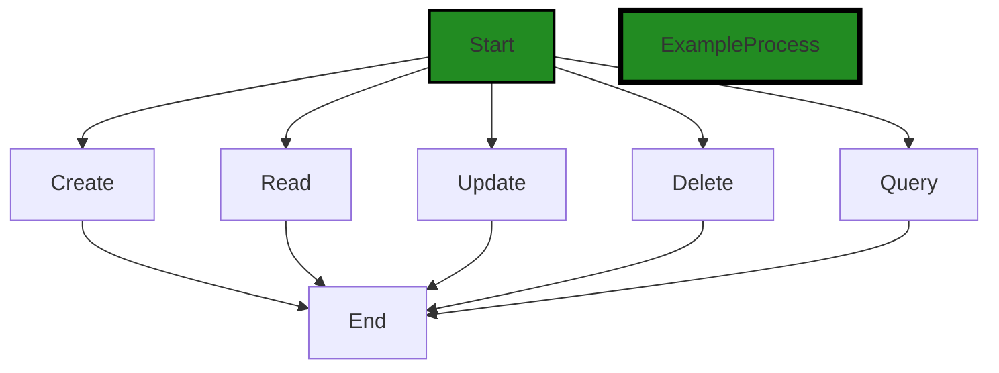
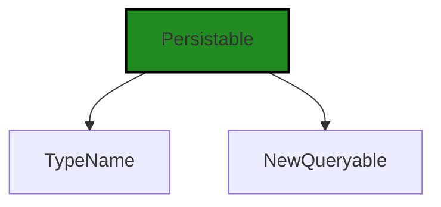

# Polyverse Boost-generated Source Analysis Details

## Source: ./data/store.go
Date Generated: Wednesday, September 6, 2023 at 8:31:38 PM PDT


---

### Boost Architectural Quick Summary Security Report

Last Updated: Friday, September 8, 2023 at 2:09:28 PM PDT


Executive Report:

1. **Architectural Impact**: The analysis of this file has not revealed any severe issues.
2. **Risk Analysis**: The analysis of this file has not revealed any severe issues.
3. **Potential Customer Impact**: Based on the analysis, there are no severe issues that could potentially impact customers.
4. **Performance Issues**: Our analysis did not identify any explicit performance issues in the file.
5. **Risk Assessment**: Based on the current analysis of this file, no severe issues have been found. However, this doesn't guarantee that the file is risk-free.

Highlights:

- No severe issues were identified in the current analysis of this file.


---

### Boost Architectural Quick Summary Performance Report

Last Updated: Friday, September 8, 2023 at 2:09:35 PM PDT


Executive Report:

1. **Architectural Impact**: The analysis of this file has not revealed any severe issues.
2. **Risk Analysis**: The analysis of this file has not revealed any severe issues.
3. **Potential Customer Impact**: Based on the analysis, there are no severe issues that could potentially impact customers.
4. **Performance Issues**: Our analysis did not identify any explicit performance issues in the file.
5. **Risk Assessment**: Based on the current analysis of this file, no severe issues have been found. However, this doesn't guarantee that the file is risk-free.

Highlights:

- No severe issues were identified in the current analysis of this file.


---

### Boost Architectural Quick Summary Compliance Report

Last Updated: Friday, September 8, 2023 at 2:10:27 PM PDT

Executive Level Report:

1. **Architectural Impact**: The software project is a library written in Go that focuses on constraint handling and validation. It defines a `Constraint` interface and provides implementations for various constraint types. The code follows Go's idiomatic style and structure for a library. However, the project has a high-severity issue related to data compliance. The file `data/store.go` does not seem to include any mechanisms for user consent or data anonymization, which are key requirements under GDPR, PCI DSS, and HIPAA. This could potentially impact the architectural design of the project as it may require significant changes to ensure data compliance.

2. **Risk Analysis**: The risk associated with this project is high due to the lack of data compliance mechanisms. This could potentially lead to legal issues if the software is used to process personal data. The risk is further increased by the fact that the issue is present in the `data/store.go` file, which suggests that it could be a central part of the project's functionality.

3. **Potential Customer Impact**: Customers who use this library to process personal data could be at risk of non-compliance with data protection regulations. This could lead to fines and reputational damage. Furthermore, the lack of user consent mechanisms could potentially lead to a loss of trust among end users.

4. **Overall Issues**: The project has one file, `data/store.go`, which has high-severity issues related to data compliance. This represents 100% of the project files. The issues are related to GDPR, PCI DSS, and HIPAA compliance.

Risk Assessment:

The overall health of the project source is concerning due to the high-severity data compliance issues. All the project files (100%) have high-severity issues, which suggests that the project may require significant changes to ensure data compliance. The lack of user consent mechanisms and data anonymization features could potentially lead to legal issues and a loss of trust among end users. 

Highlights:

- The project is a Go library focused on constraint handling and validation.
- The project has high-severity data compliance issues related to GDPR, PCI DSS, and HIPAA.
- The issues are present in the `data/store.go` file, which suggests that they could be central to the project's functionality.
- Customers who use this library to process personal data could be at risk of non-compliance with data protection regulations.
- All the project files (100%) have high-severity issues, indicating a significant risk.
---
## Detailed Analysis:

### Cell 0:
## Original Code:

### Programming Language: go
### ./data/store.go 

```go
package data

import (
 "github.com/jt0/gomer/gomerr"
)

type Store interface {
 Create(p Persistable) gomerr.Gomerr
 Read(p Persistable) gomerr.Gomerr
 Update(p Persistable, update Persistable) gomerr.Gomerr
 Delete(p Persistable) gomerr.Gomerr
 Query(q Queryable) gomerr.Gomerr
}

```
## Boost Analysis:


---

### Boost Code Explanation

Last Updated: Wednesday, September 6, 2023 at 8:29:33 PM PDT

The provided code defines a package named `data` in the Go programming language. Within this package, an interface named `Store` is declared with five methods: `Create`, `Read`, `Update`, `Delete`, and `Query`. Each of these methods accepts a different type of parameter and returns an object of type `gomerr.Gomerr`.

The `Store` interface provides a blueprint for data storage operations that can be implemented by any type that satisfies this interface. This is a common pattern in Go and is used to provide a consistent API for different types of data stores, such as in-memory stores, file-based stores, or database stores.

Here's a detailed breakdown of the `Store` interface:

- `Create(p Persistable) gomerr.Gomerr`: This method is expected to create a new entry in the data store. The entry to be created is represented by the `Persistable` parameter. The method returns a `gomerr.Gomerr` which is a custom error type from the `gomerr` package.

- `Read(p Persistable) gomerr.Gomerr`: This method is expected to read an entry from the data store. The entry to be read is represented by the `Persistable` parameter. The method returns a `gomerr.Gomerr` which is a custom error type from the `gomerr` package.

- `Update(p Persistable, update Persistable) gomerr.Gomerr`: This method is expected to update an existing entry in the data store. The entry to be updated and the new data are represented by the `Persistable` parameters. The method returns a `gomerr.Gomerr` which is a custom error type from the `gomerr` package.

- `Delete(p Persistable) gomerr.Gomerr`: This method is expected to delete an entry from the data store. The entry to be deleted is represented by the `Persistable` parameter. The method returns a `gomerr.Gomerr` which is a custom error type from the `gomerr` package.

- `Query(q Queryable) gomerr.Gomerr`: This method is expected to perform a query on the data store. The query to be performed is represented by the `Queryable` parameter. The method returns a `gomerr.Gomerr` which is a custom error type from the `gomerr` package.

The `Persistable` and `Queryable` types are not defined in this code snippet, but they are likely interfaces or types that represent data objects and queries respectively.

The `gomerr` package is a custom package that provides enhanced error handling capabilities. More information about this package can be found at: https://github.com/jt0/gomer

As per the architectural guidelines provided, the code is consistent in terms of providing a generic interface for data storage operations. There is no conflict as the code does not impose any specific implementation, leaving it up to the concrete types that implement the `Store` interface.


---

### Boost Flow Diagram

Last Updated: Wednesday, September 6, 2023 at 8:30:19 PM PDT



The control flow graph for the provided code snippet is a simple linear flow. The code defines an interface named `Store` with five methods: `Create`, `Read`, `Update`, `Delete`, and `Query`. Each method has a single outgoing edge that leads to the end of the flow.


---

### Boost Source-Level Security Analysis

Last Updated: Wednesday, September 6, 2023 at 8:30:36 PM PDT

**No bugs found**


---

### Boost Source-Level Performance Analysis

Last Updated: Wednesday, September 6, 2023 at 8:30:57 PM PDT

**No bugs found**


---

### Boost Source-Level Data and Privacy Compliance Analysis

Last Updated: Wednesday, September 6, 2023 at 8:31:35 PM PDT

1. **Severity**: 8/10

   **Line Number**: 1

   **Bug Type**: GDPR

   **Description**: The code does not seem to include any mechanisms for user consent or data anonymization, which are key requirements under GDPR.

   **Solution**: You should consider implementing user consent mechanisms before processing personal data and anonymize the data where possible to minimize the risk of a data breach. Look into libraries or services that provide these features.


2. **Severity**: 7/10

   **Line Number**: 1

   **Bug Type**: PCI DSS

   **Description**: The code does not seem to include any mechanisms for data encryption or secure data transmission, which are key requirements under PCI DSS.

   **Solution**: You should consider implementing data encryption at rest and in transit to ensure the security of cardholder data. Look into libraries or services that provide these features.


3. **Severity**: 8/10

   **Line Number**: 1

   **Bug Type**: HIPAA

   **Description**: The code does not seem to include any mechanisms for secure data storage or access controls, which are key requirements under HIPAA.

   **Solution**: You should consider implementing secure data storage solutions and access controls to ensure the security of protected health information. Look into libraries or services that provide these features.


### Cell 1:
## Original Code:

### Programming Language: go
### ./data/store.go line 14

```go

type Persistable interface {
 TypeName() string
 NewQueryable() Queryable
}

```
## Boost Analysis:


---

### Boost Code Explanation

Last Updated: Wednesday, September 6, 2023 at 8:30:07 PM PDT

The provided code snippet is written in Go, a statically typed, compiled language developed by Google. The snippet defines an interface named `Persistable`. In Go, an interface is a custom type that sets a contract of methods that types implementing the interface should have. 

The `Persistable` interface in this code defines two methods:

1. `TypeName() string`: This method should return a string that is the type name of the object implementing this interface. This could be used in scenarios where you need to know the type of the object at runtime. 

2. `NewQueryable() Queryable`: This method should return a new instance of a `Queryable` type. `Queryable` is not defined in the provided code snippet, but it's presumably another interface or type defined elsewhere in the project. This method could be used in scenarios where you need to create a new `Queryable` object from an object implementing the `Persistable` interface.

The `Persistable` interface might be used in a data persistence layer of the software, where objects need to be saved and retrieved from a database. The `TypeName` could be used to determine the type of the object to be saved, and the `NewQueryable` method could be used to create a new query object for retrieving data.

A key point to note is that interfaces in Go are implicitly implemented. This means that a type doesn't have to explicitly state that it implements an interface; it just needs to have the methods that the interface defines.

For more information on interfaces in Go, you can refer to the following resources:

- [Interfaces in Go](https://gobyexample.com/interfaces)
- [A Tour of Go: Interfaces](https://tour.golang.org/methods/9)
- [Go by Example: Interfaces](https://gobyexample.com/interfaces)


---

### Boost Flow Diagram

Last Updated: Wednesday, September 6, 2023 at 8:30:23 PM PDT




---

### Boost Source-Level Security Analysis

Last Updated: Wednesday, September 6, 2023 at 8:30:41 PM PDT

**No bugs found**


---

### Boost Source-Level Performance Analysis

Last Updated: Wednesday, September 6, 2023 at 8:31:01 PM PDT

**No bugs found**


---

### Boost Source-Level Data and Privacy Compliance Analysis

Last Updated: Wednesday, September 6, 2023 at 8:31:38 PM PDT

**No bugs found**

