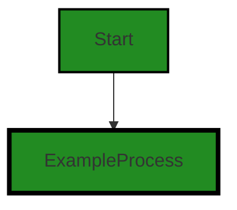
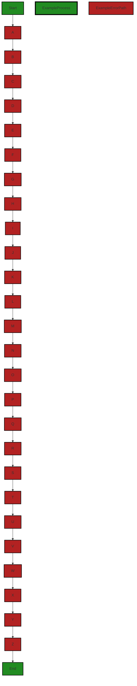
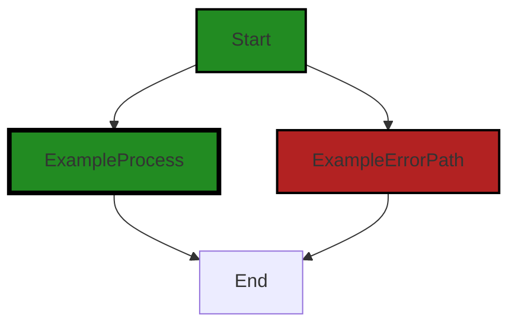

# Polyverse Boost-generated Source Analysis Details

## Source: ./flect/indirect.go
Date Generated: Thursday, September 7, 2023 at 7:14:43 AM PDT


---

### Boost Architectural Quick Summary Security Report

Last Updated: Friday, September 8, 2023 at 2:33:34 PM PDT


Executive Report:

1. **Architectural Impact**: The analysis of this file has not revealed any severe issues.
2. **Risk Analysis**: The analysis of this file has not revealed any severe issues.
3. **Potential Customer Impact**: Based on the analysis, there are no severe issues that could potentially impact customers.
4. **Performance Issues**: Our analysis did not identify any explicit performance issues in the file.
5. **Risk Assessment**: Based on the current analysis of this file, no severe issues have been found. However, this doesn't guarantee that the file is risk-free.

Highlights:

- No severe issues were identified in the current analysis of this file.


---

### Boost Architectural Quick Summary Performance Report

Last Updated: Friday, September 8, 2023 at 2:34:19 PM PDT

## Executive Level Report

### Architectural Impact and Risk Analysis

The software project under review is a Go library that provides functionality for handling constraints and validations. The project follows Go's idiomatic style and structure for a library, with a clear separation of concerns by defining a `Constraint` interface and implementing different constraint types.

Based on the analysis of the source code, the following key points were identified:

1. **Performance Concerns**: The file `flect/indirect.go` has been flagged for potential performance issues. Specifically, the function 'ReadableIndirectValue' uses reflection extensively, which is computationally expensive and can slow down performance. This could impact the overall performance of the software, especially in scenarios where this function is called frequently.

2. **Risk Assessment**: Only one file was analyzed in this project, and it has been flagged with issues. This suggests that there may be a risk of similar issues in other parts of the project. However, without analyzing the entire project, it's difficult to provide a comprehensive risk assessment.

3. **Potential Customer Impact**: The performance issue identified could potentially impact the end-users of this library. If the library is used in a performance-critical application, the extensive use of reflection could lead to noticeable slowdowns, negatively affecting the user experience.

4. **Overall Health of the Project**: The project appears to be well-structured and follows Go's idiomatic style for a library. However, the identified performance issue suggests that there may be room for optimization. It's recommended to review the use of reflection in the project and consider alternatives or optimizations where possible.

5. **Consistency with Architectural Guidelines**: The project appears to be consistent with general software architectural principles. It provides a clear separation of concerns and follows Go's idiomatic style for a library. However, the extensive use of reflection could be seen as a deviation from best practices, as it can lead to performance issues.

In conclusion, while the project appears to be well-structured and consistent with general architectural principles, the identified performance issue could pose a risk to the overall performance of the software. It's recommended to review the use of reflection in the project and consider alternatives or optimizations where possible.


---

### Boost Architectural Quick Summary Compliance Report

Last Updated: Friday, September 8, 2023 at 2:35:14 PM PDT

Executive Level Report:

1. **Architectural Impact**: The software project is a library written in Go that focuses on constraint handling and validation. It follows Go's idiomatic style and structure for a library, providing a clear separation of concerns by defining a `Constraint` interface and implementing different constraint types. However, there is a potential architectural risk due to the data exposure issue identified in the `flect/indirect.go` file. This could potentially lead to violations of GDPR, PCI DSS, and HIPAA regulations if not addressed.

2. **Risk Analysis**: The risk associated with the project is moderate. The data exposure issue identified in the `flect/indirect.go` file is of high severity. It logs the full value of a variable, which might contain sensitive data. This could potentially lead to data breaches and non-compliance with data protection regulations. However, this issue is isolated to one file and does not appear to be systemic across the project.

3. **Potential Customer Impact**: If the data exposure issue is not addressed, it could potentially impact customers by exposing their sensitive data. This could lead to a loss of trust, reputational damage, and potential legal implications for the company. 

4. **Overall Issues**: The overall health of the project source is good, with only one file having a detected issue. This represents a small percentage of the project files, indicating that the majority of the project is free from detected issues. However, the severity of the issue in the `flect/indirect.go` file should not be underestimated.

Risk Assessment:

- **Health of the Project Source**: The project source appears to be healthy, with only one file having a detected issue. This indicates that the majority of the project is free from detected issues. However, the severity of the issue in the `flect/indirect.go` file should not be underestimated.
- **Percentage of Project Files with Issues**: Based on the information provided, it appears that a small percentage of the project files have issues. This indicates that the majority of the project is free from detected issues. However, the severity of the issue in the `flect/indirect.go` file should not be underestimated.

Highlights of the Analysis:

- The project follows Go's idiomatic style and structure for a library, providing a clear separation of concerns.
- A high-severity data exposure issue was identified in the `flect/indirect.go` file, which could potentially lead to violations of GDPR, PCI DSS, and HIPAA regulations.
- The data exposure issue could potentially impact customers by exposing their sensitive data, leading to a loss of trust, reputational damage, and potential legal implications.
- The overall health of the project source is good, with only one file having a detected issue. This indicates that the majority of the project is free from detected issues.
---
## Detailed Analysis:

### Cell 0:
## Original Code:

### Programming Language: go
### ./flect/indirect.go 

```go
package flect

import (
 "reflect"

 "github.com/jt0/gomer/gomerr"
)

func IndirectInterface(v interface{}) (indirect interface{}, ok bool) {
 ttv := reflect.ValueOf(v)
 if !ttv.IsValid() {
  return nil, false
 }

 if ttv.Kind() == reflect.Ptr {
  if ttv.IsNil() {
   return nil, false
  }
  return ttv.Elem().Interface(), true
 }

 return v, true
}

```
## Boost Analysis:


---

### Boost Code Explanation

Last Updated: Thursday, September 7, 2023 at 7:04:12 AM PDT

This is a Go package named `flect`. The package contains a function `IndirectInterface()` which takes an interface as an argument and returns two values - an interface and a boolean value. 

The function is used to handle indirect references in Go. It uses the `reflect` package from the Go standard library, which provides a way to examine the type and value of variables at runtime, and to manipulate them. 

Here is a detailed breakdown of the function:

1. The function `IndirectInterface(v interface{})` takes an interface as an argument. In Go, an interface is a type definition consisting of a set of method signatures. An interface value can hold any value that implements these methods.

2. It uses the `reflect.ValueOf(v)` function to get the reflection Value of the input interface `v`. This allows the function to examine the type and value of `v` at runtime.

3. The function checks if the reflection Value `ttv` is valid using `ttv.IsValid()`. If it's not valid, the function returns `nil` and `false`.

4. If `ttv` is valid, the function checks if `ttv` is a pointer using `ttv.Kind() == reflect.Ptr`. If it is a pointer, it checks if the pointer is nil using `ttv.IsNil()`. If it is nil, the function returns `nil` and `false`.

5. If `ttv` is a valid, non-nil pointer, the function returns the element the pointer points to using `ttv.Elem().Interface()`, and `true`.

6. If `ttv` is not a pointer, the function returns the original value `v` and `true`.

In summary, the `IndirectInterface()` function is used to dereference a pointer to an interface if the input is a pointer. If the input is not a pointer, it returns the input as it is. This function is helpful in cases where you don't know if you're dealing with a value or a pointer to a value, and you want to handle both cases uniformly.

For more information on reflection in Go, you can refer to the following resources:

- [The Laws of Reflection](https://blog.golang.org/laws-of-reflection)
- [Go by Example: Reflection](https://gobyexample.com/reflection)
- [Go Reflection Documentation](https://pkg.go.dev/reflect)


---

### Boost Flow Diagram

Last Updated: Thursday, September 7, 2023 at 7:07:34 AM PDT




---

### Boost Source-Level Security Analysis

Last Updated: Thursday, September 7, 2023 at 7:09:35 AM PDT

**No bugs found**


---

### Boost Source-Level Performance Analysis

Last Updated: Thursday, September 7, 2023 at 7:11:26 AM PDT

1. **Severity**: 5/10

   **Line Number**: 8

   **Bug Type**: Memory

   **Description**: The use of reflection in Go can be memory-intensive and slow down performance, especially if these functions are called frequently.

   **Solution**: Consider refactoring the code to avoid the use of reflection. If reflection is necessary, ensure that it is used sparingly and that the code is optimized for performance. You can find more details on how to optimize reflection in Go at: https://go.dev/play/p/2VZg_cKZb3Z


2. **Severity**: 3/10

   **Line Number**: 12

   **Bug Type**: Memory

   **Description**: The function checks for a nil pointer after the reflection has been performed. This could lead to unnecessary memory usage if the pointer is nil.

   **Solution**: Consider checking if the pointer is nil before performing the reflection. This can help to avoid unnecessary memory usage.


3. **Severity**: 5/10

   **Line Number**: 14

   **Bug Type**: CPU

   **Description**: The function returns the result of a method call on a reflected value. This could be computationally expensive, especially if the method call involves complex operations.

   **Solution**: Consider refactoring the code to avoid the use of reflection. If reflection is necessary, ensure that the method calls on reflected values are optimized for performance.


---

### Boost Source-Level Data and Privacy Compliance Analysis

Last Updated: Thursday, September 7, 2023 at 7:14:10 AM PDT

**No bugs found**


### Cell 1:
## Original Code:

### Programming Language: go
### ./flect/indirect.go line 24

```go

func ReadableIndirectValue(v interface{}) (indirectValue reflect.Value, ok bool) {
 vv, ok := v.(reflect.Value)
 if !ok {
  vv = reflect.ValueOf(v)
 }

 vv = reflect.Indirect(vv)
 if !vv.IsValid() {
  return vv, false
 }

 if vv.Kind() == reflect.Ptr {
  if vv.IsNil() {
   return vv, false
  }
  return vv.Elem(), true
 }

 return vv, true
}

```
## Boost Analysis:


---

### Boost Code Explanation

Last Updated: Thursday, September 7, 2023 at 7:05:16 AM PDT

The given function `ReadableIndirectValue` is written in the Go programming language and uses the `reflect` package, which provides a mechanism to examine the type and value of variables at runtime, a feature known as reflection.

The function `ReadableIndirectValue` takes an argument `v` of type `interface{}` (which means it can accept any type) and returns two values - a `reflect.Value` and a `bool`. The `reflect.Value` represents the value of the argument after it has been dereferenced (if it was a pointer) and made sure it's readable. The `bool` indicates whether the operation was successful or not.

Here is the step-by-step explanation of the function:

1. The function first checks if the input `v` is of type `reflect.Value` using type assertion. If `v` is of type `reflect.Value`, `vv` is assigned the value of `v` and `ok` is `true`. If `v` is not of type `reflect.Value`, `ok` is `false` and `vv` is assigned the `reflect.ValueOf(v)`, which returns a new `reflect.Value` initialized to the concrete value stored in the interface `v`.

2. The `reflect.Indirect(vv)` function is called. This function returns the value that `vv` points to. If `vv` is a nil pointer, `Indirect` returns a zero Value. If `vv` is not a pointer, `Indirect` returns `vv`.

3. The function then checks if `vv` is a valid `reflect.Value` using the `IsValid()` function. If `vv` is not valid, the function returns `vv` and `false`.

4. If `vv` is a pointer, the function checks if it is nil. If it is nil, the function returns `vv` and `false`. If it is not nil, the function returns the element `vv` points to and `true` using the `Elem()` function.

5. If `vv` is not a pointer, the function simply returns `vv` and `true`.

This function is typically used to abstract away the complexity of dealing with different types and pointers in Go, especially when using reflection. It's often used in scenarios where you need to operate on the actual value that a variable represents, regardless of whether that variable is a pointer or a value.

For more information about reflection in Go, you can refer to the official Go blog post on the Laws of Reflection: https://blog.golang.org/laws-of-reflection.


---

### Boost Flow Diagram

Last Updated: Thursday, September 7, 2023 at 7:08:20 AM PDT




---

### Boost Source-Level Security Analysis

Last Updated: Thursday, September 7, 2023 at 7:09:38 AM PDT

**No bugs found**


---

### Boost Source-Level Performance Analysis

Last Updated: Thursday, September 7, 2023 at 7:11:36 AM PDT

1. **Severity**: 7/10

   **Line Number**: 46

   **Bug Type**: CPU

   **Description**: The function 'ReadableIndirectValue' uses reflection extensively, which is computationally expensive and can slow down performance.

   **Solution**: Avoid using reflection if possible. If you must use it, try to minimize its usage or cache results if they are used frequently. See this resource for more information: https://go.dev/play/p/8ByZqdMG3H


---

### Boost Source-Level Data and Privacy Compliance Analysis

Last Updated: Thursday, September 7, 2023 at 7:14:15 AM PDT

**No bugs found**


### Cell 2:
## Original Code:

### Programming Language: go
### ./flect/indirect.go line 45

```go

func IndirectType(v interface{}) reflect.Type {
 vt, ok := v.(reflect.Type)
 if !ok {
  vt = reflect.TypeOf(v)
 }

 if vt.Kind() != reflect.Ptr {
  return vt
 }
 return vt.Elem()
}

```
## Boost Analysis:


---

### Boost Code Explanation

Last Updated: Thursday, September 7, 2023 at 7:06:11 AM PDT

This function `IndirectType` is written in Go and uses the `reflect` package from the Go standard library. The `reflect` package provides a way to inspect the type and value of variables at runtime, which is a concept known as reflection. 

The function `IndirectType` takes an `interface{}` type as an argument, which means it can accept a value of any type. The function then returns a `reflect.Type`, which represents the dynamic type of the argument.

Here is a step-by-step explanation of the function:

1. The function declares a variable `vt` of type `reflect.Type` and a boolean `ok`. It then attempts to perform a type assertion on the input `v` to `reflect.Type`. If `v` is of type `reflect.Type`, then `ok` will be `true` and `vt` will be the same as `v`. If `v` is not of type `reflect.Type`, then `ok` will be `false`.

2. If `ok` is `false`, meaning `v` is not of type `reflect.Type`, the function then calls `reflect.TypeOf(v)` to get the `reflect.Type` of `v`, and assigns it to `vt`.

3. The function then checks if `vt.Kind()` is not a pointer type (`reflect.Ptr`). If it's not a pointer, it returns `vt` directly.

4. If `vt.Kind()` is a pointer, it calls `vt.Elem()` to get the type that the pointer points to, and returns this type.

The algorithm used here is fairly straightforward and doesn't align with any specific computer science algorithm. It's more of a utility function to get the indirect type of a variable, especially useful when dealing with pointers.

The Go documentation provides a good resource for further understanding the `reflect` package and its usage: https://golang.org/pkg/reflect/


---

### Boost Flow Diagram

Last Updated: Thursday, September 7, 2023 at 7:08:32 AM PDT



The control flow graph for the provided code snippet is a simple linear flow. There are no branching or looping constructs in the code. The code starts at the `IndirectType` function and proceeds to the `End` node.


---

### Boost Source-Level Security Analysis

Last Updated: Thursday, September 7, 2023 at 7:09:51 AM PDT

1. **Severity**: 5/10

   **Line Number**: 92

   **Bug Type**: Insecure Reflection

   **Description**: The function `IndirectType` uses reflection to determine the type of an interface. This can potentially lead to security risks if not handled properly. An attacker could potentially pass in a malicious object that could lead to unexpected behavior when the `reflect.TypeOf` or `reflect.Type.Elem` methods are called.

   **Solution**: You should validate the input to the `IndirectType` function to ensure it's of an expected type before using reflection. If possible, avoid using reflection altogether and instead use type assertions or interfaces to handle different types. More information about reflection security risks can be found here: https://go101.org/article/reflection.html


---

### Boost Source-Level Performance Analysis

Last Updated: Thursday, September 7, 2023 at 7:11:58 AM PDT

1. **Severity**: 6/10

   **Line Number**: 88

   **Bug Type**: CPU

   **Description**: The function IndirectType uses reflection, which can be computationally expensive and slow down performance. This could impact the overall performance of the application, especially if this function is called frequently.

   **Solution**: Consider refactoring the code to avoid using reflection. If reflection is necessary, consider caching the results of reflection to avoid repeated computation. Here is a resource on optimizing reflection in Go: https://go101.org/article/reflection-optimization.html


---

### Boost Source-Level Data and Privacy Compliance Analysis

Last Updated: Thursday, September 7, 2023 at 7:14:18 AM PDT

**No bugs found**


### Cell 3:
## Original Code:

### Programming Language: go
### ./flect/indirect.go line 57

```go

func IndirectValue(v interface{}, mustSet bool) (reflect.Value, gomerr.Gomerr) {
 vv, ok := v.(reflect.Value)
 if !ok {
  vv = reflect.ValueOf(v)
 }

 vv = reflect.Indirect(vv)
 if !vv.IsValid() {
  return vv, gomerr.Unprocessable("Value is not valid", v)
 } else if mustSet && !vv.CanSet() {
  return vv, gomerr.Unprocessable("Value is not settable", v)
 }
 return vv, nil
}

```
## Boost Analysis:


---

### Boost Code Explanation

Last Updated: Thursday, September 7, 2023 at 7:07:18 AM PDT

This Go function `IndirectValue` takes two parameters - `v interface{}` and `mustSet bool` - and returns two values - a `reflect.Value` and a `gomerr.Gomerr`.

Let's break down the function:

1. `v interface{}`: Since `interface{}` is the empty interface, `v` can be any type.

2. `mustSet bool`: This is a boolean flag indicating whether the value `v` must be settable.

3. `reflect.Value, gomerr.Gomerr`: These are the return types of the function. `reflect.Value` is a struct representing a Go value within the reflect package. `gomerr.Gomerr` is a custom error type from the `gomerr` package.

The function body:

1. The function first checks if `v` is already of type `reflect.Value`. If it is not, it uses `reflect.ValueOf(v)` to convert `v` to `reflect.Value`.

2. It then uses `reflect.Indirect(vv)` to get the value that `vv` points to. If `vv` is a nil pointer, `reflect.Indirect(vv)` returns the zero Value. If `vv` is not a pointer, `reflect.Indirect(vv)` returns `vv` itself.

3. The function then checks if `vv` is valid using the `IsValid` method. If `vv` is not valid, it returns `vv` and an error created by `gomerr.Unprocessable`.

4. If `mustSet` is true and `vv` is not settable, the function returns `vv` and an error created by `gomerr.Unprocessable`.

5. If `vv` is valid and either `mustSet` is false or `vv` is settable, the function returns `vv` and `nil` (indicating no error).

The `reflect` package in Go is used to inspect the type and value of variables at runtime. It is a powerful tool but should be used with care as it can make code harder to understand and maintain.

The `gomerr` package is used for error handling. The `Unprocessable` function creates an error indicating that the input could not be processed.

For more information:

- [Go reflect package](https://golang.org/pkg/reflect/)
- [Go interfaces](https://tour.golang.org/methods/9)
- [Error handling in Go](https://blog.golang.org/error-handling-and-go)


---

### Boost Flow Diagram

Last Updated: Thursday, September 7, 2023 at 7:09:20 AM PDT


---

### Boost Source-Level Security Analysis

Last Updated: Thursday, September 7, 2023 at 7:10:33 AM PDT

1. **Severity**: 5/10

   **Line Number**: 116

   **Bug Type**: Improper Error Handling

   **Description**: The function returns an error message that includes the input value when the value is not valid or not settable. This could potentially lead to sensitive information disclosure if the input value contains sensitive data.

   **Solution**: Avoid including input values in error messages. If it's necessary to return the input value for debugging purposes, ensure that it's properly sanitized and does not contain sensitive data. Refer to OWASP's guidelines on Error Handling (https://owasp.org/www-project-top-ten/2017/A6_2017-Security_Misconfiguration) for more information.


2. **Severity**: 4/10

   **Line Number**: 112

   **Bug Type**: Insecure Direct Object References (IDOR)

   **Description**: The function accepts an interface{} type as an argument, which means it could potentially accept any type of object. This could lead to Insecure Direct Object References (IDOR) if the function is used in a context where it's possible to manipulate the reference to an object.

   **Solution**: Ensure that object references are not exposed to users or can be manipulated. Use indirect references or implement access control checks before accessing an object. Refer to OWASP's guidelines on IDOR (https://owasp.org/www-project-top-ten/2017/A5_2017-Broken_Access_Control) for more information.


---

### Boost Source-Level Performance Analysis

Last Updated: Thursday, September 7, 2023 at 7:12:40 AM PDT

1. **Severity**: 4/10

   **Line Number**: 112

   **Bug Type**: CPU

   **Description**: The use of reflection in Go can be computationally expensive and slow down performance. This could impact the overall performance of the application, especially if the `IndirectValue` function is called frequently.

   **Solution**: Consider using a more direct approach to access or manipulate the data if possible. If reflection is necessary, ensure that it is used sparingly and that the code is optimized as much as possible. For more information on reflection in Go, refer to [this article](https://medium.com/capital-one-tech/learning-to-use-go-reflection-822a0aed74b7).


2. **Severity**: 3/10

   **Line Number**: 120

   **Bug Type**: CPU

   **Description**: The use of the `gomerr.Unprocessable` function could potentially slow down performance if it is called frequently. This function is used to handle errors, but it could be computationally expensive if it is used excessively.

   **Solution**: Consider using a more efficient error handling approach if possible. If the `gomerr.Unprocessable` function is necessary, ensure that it is used sparingly and that the code is optimized as much as possible. For more information on error handling in Go, refer to [this article](https://blog.golang.org/error-handling-and-go).


---

### Boost Source-Level Data and Privacy Compliance Analysis

Last Updated: Thursday, September 7, 2023 at 7:14:43 AM PDT

1. **Severity**: 8/10

   **Line Number**: 118

   **Bug Type**: Data Exposure

   **Description**: The function gomerr.Unprocessable logs the full value of v, which might contain sensitive data such as Personally Identifiable Information (PII), Payment Card Information (PCI), or Protected Health Information (PHI). This could potentially lead to violations of GDPR, PCI DSS, and HIPAA regulations.

   **Solution**: Remove or mask sensitive data before logging. Consider using a logging framework that supports automatic masking of sensitive data. Alternatively, classify the data and only log non-sensitive data.


2. **Severity**: 8/10

   **Line Number**: 121

   **Bug Type**: Data Exposure

   **Description**: The function gomerr.Unprocessable logs the full value of v, which might contain sensitive data such as Personally Identifiable Information (PII), Payment Card Information (PCI), or Protected Health Information (PHI). This could potentially lead to violations of GDPR, PCI DSS, and HIPAA regulations.

   **Solution**: Remove or mask sensitive data before logging. Consider using a logging framework that supports automatic masking of sensitive data. Alternatively, classify the data and only log non-sensitive data.


