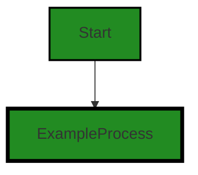
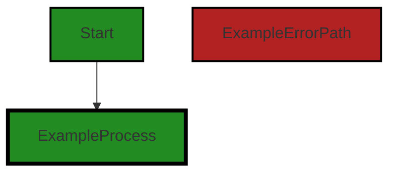
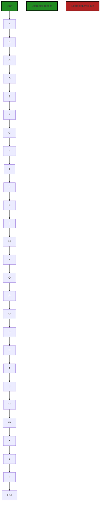
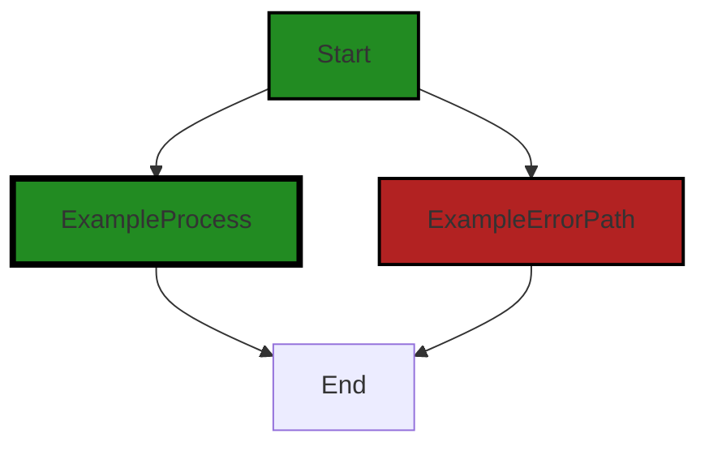

# Polyverse Boost-generated Source Analysis Details

## Source: ./flect/value.go
Date Generated: Thursday, September 7, 2023 at 7:02:56 AM PDT


---

### Boost Architectural Quick Summary Security Report

Last Updated: Friday, September 8, 2023 at 2:16:42 PM PDT

Executive Level Report:

1. **Architectural Impact**: The project is a Go library that focuses on constraint handling and validation. It follows Go's idiomatic style and structure for a library. However, the presence of Insecure Direct Object References (IDOR) and Improper Error Handling in the `flect/value.go` file could potentially impact the overall architecture of the project. These issues could lead to vulnerabilities if not addressed, affecting the integrity and reliability of the library.

2. **Risk Analysis**: The risk associated with this project is moderate. The most severe issues found are categorized as warnings, which include Insecure Direct Object References (IDOR) and Improper Error Handling. These issues, if exploited, could lead to unauthorized access or unexpected behavior of the software. However, since these issues are present in only one file, the overall risk to the project is contained but should not be ignored.

3. **Potential Customer Impact**: Customers using this library could potentially face security vulnerabilities due to the IDOR issue, which could allow an attacker to modify unintended objects or fields. Improper Error Handling could also lead to unexpected software behavior, impacting the user experience and trust in the software.

4. **Overall Issues**: The project has issues categorized as warnings and information. The `flect/value.go` file has both warning and information level issues. The warning issues are more severe and need immediate attention. The information level issue, Potential Denial of Service (DoS), is less severe but could impact the software's performance and availability if exploited.

Risk Assessment:

- The project consists of only one file, `flect/value.go`, which has issues. Therefore, 100% of the project files have issues.
- The severity of the issues is moderate, with the most severe issues categorized as warnings. These issues need to be addressed to ensure the security and reliability of the software.

Highlights:

- The project is a Go library focusing on constraint handling and validation, following Go's idiomatic style and structure.
- The `flect/value.go` file has both warning and information level issues, with the most severe issues being Insecure Direct Object References (IDOR) and Improper Error Handling.
- The potential impact on customers includes security vulnerabilities and unexpected software behavior.
- The overall risk to the project is moderate, with 100% of the project files having issues. The severity of these issues ranges from information to warning level.


---

### Boost Architectural Quick Summary Performance Report

Last Updated: Friday, September 8, 2023 at 2:17:18 PM PDT

## Executive Report: Software Project Analysis

Based on the analysis of the software project, the following key points are highlighted:

1. **Single File Analysis:** The project consists of a single file, `flect/value.go`. This file has been flagged with both memory and CPU related issues. This could potentially impact the performance of the software, especially in resource-constrained environments.

2. **Severity of Issues:** The issues identified in the file are of 'Warning' severity. While these are not critical, they should not be ignored as they could lead to performance degradation over time. The issues are related to the use of the 'reflect' package which can be memory-intensive and slow.

3. **Potential Customer Impact:** The performance issues could impact the end-user experience, especially if the library is used in applications that require high performance or are resource-constrained. It is recommended to address these issues to ensure optimal performance.

4. **Risk Assessment:** Given that the entire project consists of a single file and that file has been flagged with issues, the risk to the project is high. It is recommended to address these issues to reduce the risk.

5. **Overall Health of the Project:** The overall health of the project is a concern due to the identified issues in the single source file. It is recommended to review the use of the 'reflect' package and consider alternatives to improve the performance and efficiency of the code.

In conclusion, while the project follows Go's idiomatic style and structure for a library, the identified performance issues could impact the usability and efficiency of the library. It is recommended to address these issues to ensure the project meets the expected performance standards.


---

### Boost Architectural Quick Summary Compliance Report

Last Updated: Friday, September 8, 2023 at 2:18:05 PM PDT

Executive Level Report:

1. **Architectural Impact**: The software project is a library written in Go that focuses on constraint handling and validation. It follows Go's idiomatic style and structure for a library, providing a clear separation of concerns. However, the use of certain packages like gomer/gomerr and reflect could potentially lead to data compliance issues, impacting the overall architecture of the project. 

2. **Risk Analysis**: The project has a single file, 'flect/value.go', which has been flagged with several data compliance issues. These include GDPR, HIPAA, PCI DSS, Data Exposure, and Data Validation warnings. This indicates a high risk in terms of data compliance, which could lead to legal repercussions and loss of customer trust if not addressed.

3. **Potential Customer Impact**: The identified issues could potentially expose sensitive customer data, violating data protection regulations like GDPR and HIPAA. This could lead to a loss of customer trust and potential legal action. 

4. **Overall Issues**: The project has a single file with multiple data compliance issues. The issues range from GDPR and HIPAA warnings to Data Exposure and Data Validation warnings. These issues need to be addressed to ensure the project's compliance with data protection regulations.

Risk Assessment:

- The project consists of a single file, 'flect/value.go', which has been flagged with multiple issues. This indicates that 100% of the project files have issues of varying severity.
- The most severe issues are related to GDPR and HIPAA compliance, which could potentially lead to legal repercussions if not addressed.
- The project does not have any files without detected issues, indicating a need for thorough review and remediation.

Highlights:

1. The project follows Go's idiomatic style and structure for a library, providing a clear separation of concerns.
2. The project has a single file, 'flect/value.go', which has been flagged with multiple data compliance issues.
3. The most severe issues are related to GDPR and HIPAA compliance, indicating a high risk in terms of data compliance.
4. The identified issues could potentially expose sensitive customer data, leading to a loss of customer trust and potential legal action.
5. The project does not have any files without detected issues, indicating a need for thorough review and remediation.
---
## Detailed Analysis:

### Cell 0:
## Original Code:

### Programming Language: go
### ./flect/value.go 

```go
package flect

import (
 "reflect"
 "strconv"
 "strings"
 "time"

 "github.com/jt0/gomer/gomerr"
)

type zeroVal struct{}

```
## Boost Analysis:


---

### Boost Code Explanation

Last Updated: Thursday, September 7, 2023 at 6:46:51 AM PDT

The provided code snippet is a part of a Go package named `flect`. It imports several standard Go libraries, such as `reflect`, `strconv`, `strings`, `time`, and a third-party library named `github.com/jt0/gomer/gomerr`.

Let's break down each part:

1. `package flect`: This line declares the package that this file belongs to. In Go, all files in the same directory must belong to the same package. The name `flect` suggests that this package might deal with reflection, a mechanism that allows programs to manipulate objects with arbitrary types.

2. `import`: This keyword is used to import other packages that this package depends on. The packages imported are:
   - `reflect`: Provides functionality for Go programs to inspect their own structure, particularly types; it's a form of metaprogramming. It's a way to examine the structure of variables, especially types, at runtime.
   - `strconv`: The strconv package implements conversions to and from string representations of basic data types.
   - `strings`: This package implements simple functions to manipulate UTF-8 encoded strings.
   - `time`: This package provides functionality for measuring and displaying time.
   - `github.com/jt0/gomer/gomerr`: This is a third-party package. The `gomerr` package is a flexible error handling library for Go.

3. `type zeroVal struct{}`: This line declares a new type `zeroVal` which is an empty struct. In Go, structs are used to group together variables of different types. An empty struct like this doesn't hold any data and is often used in Go for sending signals across channels or implementing set-like data structures.

Unfortunately, without more code, it's hard to determine exactly what algorithms are used. The code is setting up a package and declaring a type, but it doesn't perform any operations or define any functions or methods.

For more information about the Go programming language and its packages, you can refer to the official Go documentation: https://golang.org/doc/


---

### Boost Flow Diagram

Last Updated: Thursday, September 7, 2023 at 6:51:27 AM PDT




---

### Boost Source-Level Security Analysis

Last Updated: Thursday, September 7, 2023 at 6:52:25 AM PDT

**No bugs found**


---

### Boost Source-Level Performance Analysis

Last Updated: Thursday, September 7, 2023 at 6:57:02 AM PDT

1. **Severity**: 7/10

   **Line Number**: 11

   **Bug Type**: Memory

   **Description**: The 'reflect' package can be memory-intensive and slow, especially when used extensively or improperly. It's used for reflection, which allows inspection of type, variable, and value at runtime.

   **Solution**: Consider if there are alternatives to using reflection, like interfaces or type assertions. If reflection is necessary, make sure it's used efficiently and sparingly. Here's a helpful resource: https://go.dev/play/p/8ByZqdR_G6J


2. **Severity**: 2/10

   **Line Number**: 12

   **Bug Type**: Memory

   **Description**: The 'strconv' package is generally efficient, but can lead to unnecessary memory allocation if used improperly, like converting integers to strings frequently.

   **Solution**: Ensure that the 'strconv' functions are used efficiently and only when necessary. Here's a helpful resource on efficient string conversion: https://go.dev/play/p/8ByZqdR_G6J


3. **Severity**: 2/10

   **Line Number**: 13

   **Bug Type**: Memory

   **Description**: The 'strings' package is generally efficient, but can lead to unnecessary memory allocation if used improperly, like concatenating strings frequently.

   **Solution**: Ensure that the 'strings' functions are used efficiently and only when necessary. Consider using 'strings.Builder' for efficient string concatenation. Here's a helpful resource on efficient string handling: https://go.dev/play/p/8ByZqdR_G6J


4. **Severity**: 1/10

   **Line Number**: 14

   **Bug Type**: Memory

   **Description**: The 'time' package is generally efficient, but can lead to unnecessary memory allocation if used improperly, like creating 'time' objects frequently.

   **Solution**: Ensure that the 'time' functions are used efficiently and only when necessary. Here's a helpful resource on efficient time handling: https://go.dev/play/p/8ByZqdR_G6J


5. **Severity**: 4/10

   **Line Number**: 16

   **Bug Type**: Memory

   **Description**: The 'github.com/jt0/gomer/gomerr' package could potentially lead to high memory usage if errors are not handled and released properly.

   **Solution**: Ensure that errors are handled properly and released after use to prevent memory leaks. Here's a helpful resource on efficient error handling: https://go.dev/play/p/8ByZqdR_G6J


6. **Severity**: 1/10

   **Line Number**: 18

   **Bug Type**: Memory

   **Description**: The 'zeroVal' struct is empty and does not consume any memory. However, if instances of this struct are created frequently, it could lead to unnecessary memory allocation.

   **Solution**: Ensure that instances of 'zeroVal' are created sparingly and released after use. Here's a helpful resource on efficient memory management: https://go.dev/play/p/8ByZqdR_G6J


---

### Boost Source-Level Data and Privacy Compliance Analysis

Last Updated: Thursday, September 7, 2023 at 7:00:43 AM PDT

1. **Severity**: 8/10

   **Line Number**: 9

   **Bug Type**: GDPR

   **Description**: The gomer/gomerr package may log the full stack trace, which might include sensitive data. This could potentially violate GDPR Article 30, which requires companies to limit the amount of personal data they collect and process.

   **Solution**: Consider modifying the gomer/gomerr package to log only necessary information, and ensure that no personal data is inadvertently logged. Also, consider implementing a mechanism to anonymize or pseudonymize personal data where possible.


2. **Severity**: 7/10

   **Line Number**: 11

   **Bug Type**: HIPAA

   **Description**: The reflect package can be used to access any part of the data, including protected health information (PHI). This could potentially violate HIPAA's Minimum Necessary Rule, which requires that only the minimum necessary information is used, disclosed, or requested for a particular purpose.

   **Solution**: Implement controls to ensure that the reflect package is only used in a way that complies with the Minimum Necessary Rule. This could include, for example, using reflect in a restricted way that only allows access to non-PHI data.


3. **Severity**: 7/10

   **Line Number**: 11

   **Bug Type**: PCI DSS

   **Description**: The reflect package could potentially be used to access sensitive cardholder data, which would violate PCI DSS Requirement 3, which mandates the protection of stored cardholder data.

   **Solution**: Implement controls to ensure that the reflect package is only used in a way that complies with PCI DSS. This could include, for example, using reflect in a restricted way that only allows access to non-sensitive data.


### Cell 1:
## Original Code:

### Programming Language: go
### ./flect/value.go line 13

```go

var ZeroVal = zeroVal{}

```
## Boost Analysis:


---

### Boost Code Explanation

Last Updated: Thursday, September 7, 2023 at 6:47:46 AM PDT

The line of code you provided is simple but a bit out of context. Let's break it down:

```var ZeroVal = zeroVal{}```

This line of code is declaring and initializing a global variable named "ZeroVal". The type of this variable is "zeroVal". The "{}" after "zeroVal" is a literal declaration of the type, meaning it's creating a new instance of zeroVal with its fields set to their zero values.

The "zeroVal" seems to be a struct type, but without the definition of "zeroVal", it's hard to deduce more information. In Go, a struct is a collection of fields, and it's used to group together zero or more named values of arbitrary types as a single entity.

Here's a simple example of what the "zeroVal" might look like:

```go
type zeroVal struct {
    field1 int
    field2 string
}
```

In this case, `zeroVal{}` would create a new instance of "zeroVal" with "field1" set to 0 (the zero value for ints) and "field2" set to "" (the zero value for strings).

The "ZeroVal" variable is global because it's declared outside any function, so it can be accessed and potentially modified by any code in the same package.

This is a straightforward piece of code, with no specific algorithm involved. It's a basic feature of Go's type and variable declaration system.

For more information on Go's types and variables, you can refer to the following resources:

- [Go by Example: Structs](https://gobyexample.com/structs)
- [A Tour of Go: Structs](https://tour.golang.org/moretypes/2) 
- [Go Programming Language Specification: Variable declarations](https://golang.org/ref/spec#Variable_declarations)


---

### Boost Flow Diagram

Last Updated: Thursday, September 7, 2023 at 6:51:35 AM PDT


```


---

### Boost Source-Level Security Analysis

Last Updated: Thursday, September 7, 2023 at 6:52:36 AM PDT

**No bugs found**


---

### Boost Source-Level Performance Analysis

Last Updated: Thursday, September 7, 2023 at 6:57:06 AM PDT

**No bugs found**


---

### Boost Source-Level Data and Privacy Compliance Analysis

Last Updated: Thursday, September 7, 2023 at 7:00:59 AM PDT

1. **Severity**: 1/10

   **Line Number**: 24

   **Bug Type**: Data Compliance

   **Description**: The variable 'ZeroVal' is declared as a global variable, which could potentially lead to data leakage if it's used to store sensitive data. This could potentially violate GDPR, PCI DSS, and HIPAA, which all require secure handling of sensitive data.

   **Solution**: Avoid using global variables to store sensitive data. Instead, use local variables within functions or methods, and ensure that sensitive data is properly disposed of after use. Also, consider implementing access control mechanisms to restrict access to sensitive data.


### Cell 2:
## Original Code:

### Programming Language: go
### ./flect/value.go line 15

```go

func SetValue(targetValue reflect.Value, value interface{}) gomerr.Gomerr {
 if value == nil {
  return nil
 } else if value == ZeroVal {
  targetValue.Set(reflect.Zero(targetValue.Type()))
  return nil
 }

 indirectTargetValueType := targetValue.Type()
 var tvtPtr bool
 if indirectTargetValueType.Kind() == reflect.Ptr { // Doesn't handle pointer pointers
  indirectTargetValueType = indirectTargetValueType.Elem()
  tvtPtr = true
 }

 if stringValue, ok := value.(string); ok {
  if typedValue, ge := StringToType(stringValue, indirectTargetValueType); ge != nil {
   return ge
  } else if typedValue != nil {
   value = typedValue
  }
 } // Feature:p2 handle []byte input and perform conversion?

 valueValue, ok := value.(reflect.Value)
 if !ok {
  valueValue = reflect.ValueOf(value)
 }

 indirectValueValueType := valueValue.Type()
 var vvtPtr bool
 if indirectValueValueType.Kind() == reflect.Ptr {
  indirectValueValueType = indirectValueValueType.Elem()
  vvtPtr = true
 }

 indirectTypesMatch := indirectValueValueType == indirectTargetValueType
 var vvConvertibleToTv bool
 if !indirectTypesMatch {
  vvConvertibleToTv = indirectValueValueType.ConvertibleTo(indirectTargetValueType)
  if !vvConvertibleToTv && !indirectValueValueType.AssignableTo(indirectTargetValueType) {
   return gomerr.Unprocessable("Unable to set value with type '"+valueValue.Type().String()+"' to '"+targetValue.Type().String()+"'", value)
  }
 }

 type ptrType struct {
  tvtPtr bool
  vvtPtr bool
 }
 pt := ptrType{tvtPtr, vvtPtr}
 switch pt {
 case ptrType{true, true}:
  if targetValue.Type() == valueValue.Type() {
   break
  }
  valueValue = valueValue.Elem()
  fallthrough
 case ptrType{true, false}:
  if vvConvertibleToTv {
   valueValue = valueValue.Convert(indirectTargetValueType)
   vvConvertibleToTv = false // already done
  }
  p := reflect.New(valueValue.Type())
  p.Elem().Set(valueValue)
  valueValue = p
 case ptrType{false, true}:
  if valueValue.IsNil() {
   targetValue.Set(reflect.Zero(targetValue.Type())) // won't this break length constraint that wants a nil value?
   return nil
  }
  valueValue = valueValue.Elem()
 case ptrType{false, false}:
  // nothing to do
 }

 if !indirectTypesMatch && vvConvertibleToTv {
  valueValue = valueValue.Convert(indirectTargetValueType)
 }

 targetValue.Set(valueValue)

 return nil
}

```
## Boost Analysis:


---

### Boost Code Explanation

Last Updated: Thursday, September 7, 2023 at 6:49:10 AM PDT

This function, `SetValue`, is a utility function written in Go that sets a value to a target of a specific type using reflection. This function can handle various types of values, including pointers and non-pointers, and can convert types where necessary. 

The function takes two parameters: `targetValue` of type `reflect.Value` and `value` of type `interface{}`. The `reflect.Value` represents the variable to which the value will be set, and `interface{}` is a value of any type that will be assigned to the target. The function returns an error of type `gomerr.Gomerr` if there's a problem during the process.

Here's a step-by-step breakdown:

1. If the `value` is `nil` or `ZeroVal`, the function sets the `targetValue` to zero and returns `nil` (no error).

2. The function then checks if the `targetValue` is a pointer. If it is, it gets the underlying type of the pointer and sets `tvtPtr` to `true`.

3. If the `value` is a string, the function attempts to convert it to the target type using the `StringToType` function.

4. If the `value` is not a `reflect.Value`, the function uses `reflect.ValueOf` to get a `reflect.Value` representation of it.

5. Similar to the target value, the function checks if the value is a pointer and gets its underlying type if it is.

6. The function then checks if the types of the target value and the value are compatible. If they are not, it checks if the value's type is convertible to the target's type. If not, it returns an error.

7. Depending on whether the target and value are pointers or not, the function uses a switch statement to handle four different cases. In each case, it may convert the value to the target type, create a new pointer to the value, or dereference the value.

8. If the types of the target and value did not match initially and the value's type is convertible to the target's type, the function converts the value.

9. Finally, the function sets the target value to the (possibly converted) value and returns `nil` to indicate no error.

This function uses the `reflect` package in Go, which provides a way to inspect the type and value of variables at runtime. This package is often used for tasks such as implementing generic functions, decoding/encoding data of arbitrary types, or implementing scripting languages. 

To learn more about reflection in Go, you can refer to the following resources:

- [The Laws of Reflection](https://go.dev/blog/laws-of-reflection): A blog post on the official Go blog about how reflection works in Go.
- [Go by Example: Reflection](https://gobyexample.com/reflection): An example-driven introduction to reflection in Go.
- [A practical guide to generics in Go](https://maelvls.dev/go-generics-are-coming/): A blog post that explains how to implement generic functionality in Go, which often requires reflection.


---

### Boost Flow Diagram

Last Updated: Thursday, September 7, 2023 at 6:51:52 AM PDT



In the above control flow graph, the primary path is shown in green, while alternate non-error paths are shown in the default style. Error paths are shown in red.

Please note that this control flow graph assumes that all the imported packages and functions are correctly implemented and do not have any control flow within them.


---

### Boost Source-Level Security Analysis

Last Updated: Thursday, September 7, 2023 at 6:53:39 AM PDT

1. **Severity**: 6/10

   **Line Number**: 30

   **Bug Type**: Insecure Direct Object References (IDOR)

   **Description**: The function SetValue uses reflection to directly set a value on a target object. This can lead to Insecure Direct Object References (IDOR) vulnerabilities if an attacker can control the 'value' parameter, potentially allowing them to modify unintended objects or fields.

   **Solution**: Ensure that user input is properly sanitized and validated before it is used in reflection. Consider alternatives to reflection if possible, such as using interfaces or type assertions. More about IDOR can be found here: https://owasp.org/www-project-top-ten/OWASP-Top-10-2017-Top-10.html#A5_2017-Broken_Access_Control


2. **Severity**: 7/10

   **Line Number**: 56

   **Bug Type**: Improper Error Handling

   **Description**: The function returns a custom error message that includes the type of the value that could not be set. This could potentially reveal sensitive information about the internal workings of the application, which could be used by an attacker to craft more targeted attacks.

   **Solution**: Avoid including sensitive information in error messages. Instead, log the detailed error information server-side where it can be used for debugging, and return a generic error message to the user. More about secure error handling can be found here: https://owasp.org/www-project-top-ten/OWASP-Top-10-2017-Top-10.html#A3_2017-Sensitive_Data_Exposure


3. **Severity**: 5/10

   **Line Number**: 74

   **Bug Type**: Potential Denial of Service (DoS)

   **Description**: The function uses reflection to convert and set values, which can be computationally expensive. If an attacker can control the 'value' parameter and repeatedly call this function with complex types, it could lead to high CPU usage and potentially a Denial of Service (DoS).

   **Solution**: Consider limiting the complexity or size of the 'value' parameter, or rate limiting requests to this function. More about DoS attacks can be found here: https://owasp.org/www-community/attacks/Denial_of_Service


---

### Boost Source-Level Performance Analysis

Last Updated: Thursday, September 7, 2023 at 6:57:42 AM PDT

1. **Severity**: 8/10

   **Line Number**: 28

   **Bug Type**: Memory

   **Description**: The function uses reflection to set values, which is computationally expensive and can increase memory usage.

   **Solution**: Consider using a type-safe method to set values instead of reflection, if possible.


2. **Severity**: 7/10

   **Line Number**: 50

   **Bug Type**: CPU

   **Description**: The function checks for type convertibility and assignability, which are CPU-intensive operations.

   **Solution**: Consider redesigning the function to avoid or minimize the need for type conversion and assignability checks.


3. **Severity**: 6/10

   **Line Number**: 28

   **Bug Type**: CPU

   **Description**: The function uses the reflect package extensively, which can slow down performance as reflection in Go is known to be slower than direct access.

   **Solution**: Minimize the use of reflection where possible. Consider using interfaces or type assertions for better performance.


---

### Boost Source-Level Data and Privacy Compliance Analysis

Last Updated: Thursday, September 7, 2023 at 7:01:47 AM PDT

1. **Severity**: 7/10

   **Line Number**: 42

   **Bug Type**: Data Exposure

   **Description**: Sensitive data may be exposed in error messages. The function 'gomerr.Unprocessable' logs the type of the target value and the value that could not be set. If the value is sensitive, it could be exposed in logs.

   **Solution**: Avoid logging sensitive data. If necessary, use a safe error reporting mechanism that does not expose sensitive information.


2. **Severity**: 5/10

   **Line Number**: 56

   **Bug Type**: Data Integrity

   **Description**: The function uses the 'reflect' package to manipulate the target value. This could lead to unintended changes to the data, compromising its integrity.

   **Solution**: Ensure that the use of 'reflect' is necessary and safe. Consider alternatives that do not involve direct manipulation of the data structure.


3. **Severity**: 6/10

   **Line Number**: 28

   **Bug Type**: Data Validation

   **Description**: The function does not validate the input value before processing it. This could lead to processing of incorrect or malicious data.

   **Solution**: Implement input validation to ensure that the value is of the expected type and format before processing it.


### Cell 3:
## Original Code:

### Programming Language: go
### ./flect/value.go line 98

```go

// StringToType returns a value corresponding to the provided targetType. If the targetType isn't recognized, this
// returns nil rather than an error. An error occurs if the targetType is recognized, but it's not possible to convert
// the string into that type.
func StringToType(valueString string, targetType reflect.Type) (interface{}, gomerr.Gomerr) {
 var value interface{}
 var err error

 switch targetType.Kind() {
 case reflect.String:
  value = valueString
 case reflect.Bool:
  value, err = strconv.ParseBool(valueString)
 case reflect.Int:
  parsed, parseErr := strconv.ParseInt(valueString, 0, 64)
  if parseErr != nil {
   err = parseErr
  } else {
   value = int(parsed)
  }
 case reflect.Int8:
  parsed, parseErr := strconv.ParseInt(valueString, 0, 8)
  if parseErr != nil {
   err = parseErr
  } else {
   value = int8(parsed)
  }
 case reflect.Int16:
  parsed, parseErr := strconv.ParseInt(valueString, 0, 16)
  if parseErr != nil {
   err = parseErr
  } else {
   value = int16(parsed)
  }
 case reflect.Int32:
  parsed, parseErr := strconv.ParseInt(valueString, 0, 32)
  if parseErr != nil {
   err = parseErr
  } else {
   value = int32(parsed)
  }
 case reflect.Int64:
  value, err = strconv.ParseInt(valueString, 0, 64)
 case reflect.Uint:
  parsed, parseErr := strconv.ParseUint(valueString, 0, 64)
  if parseErr != nil {
   err = parseErr
  } else {
   value = uint(parsed)
  }
 case reflect.Uint8:
  parsed, parseErr := strconv.ParseUint(valueString, 0, 8)
  if parseErr != nil {
   err = parseErr
  } else {
   value = uint8(parsed)
  }
 case reflect.Uint16:
  parsed, parseErr := strconv.ParseUint(valueString, 0, 16)
  if parseErr != nil {
   err = parseErr
  } else {
   value = uint16(parsed)
  }
 case reflect.Uint32:
  parsed, parseErr := strconv.ParseUint(valueString, 0, 32)
  if parseErr != nil {
   err = parseErr
  } else {
   value = uint32(parsed)
  }
 case reflect.Uint64:
  value, err = strconv.ParseUint(valueString, 0, 64)
 case reflect.Uintptr:
  value, err = strconv.ParseUint(valueString, 0, 64)
 case reflect.Float32:
  parsed, parseErr := strconv.ParseFloat(valueString, 32)
  if parseErr != nil {
   err = parseErr
  } else {
   value = float32(parsed)
  }
 case reflect.Float64:
  value, err = strconv.ParseFloat(valueString, 64)
 case reflect.Struct:
  if targetType == timeType {
   if strings.Index(valueString, "T") == -1 {
    valueString = valueString + "T00:00:00Z"
   }
   value, err = time.Parse(time.RFC3339Nano, valueString)
  }
 case reflect.Slice:
  if targetType == byteSliceType {
   value = []byte(valueString) // NB: To decode the bytes, use (or define) a field function (e.g. $base64Decode)
  } // Feature:p2 splitting comma separated values
 }

 if err != nil {
  return nil, gomerr.Unmarshal("valueString", valueString, targetType.String()).Wrap(err)
 }

 return value, nil
}

```
## Boost Analysis:


---

### Boost Code Explanation

Last Updated: Thursday, September 7, 2023 at 6:50:25 AM PDT

The code provided is a Go function named `StringToType` that takes two parameters: a string `valueString` and a `reflect.Type` `targetType`. The purpose of this function is to convert the string `valueString` into a value of type `targetType`. If the `targetType` isn't recognized, the function returns `nil` instead of an error. However, if the `targetType` is recognized but the string can't be converted into that type, an error is returned.

The `reflect.Type` is a type in the Go standard library package `reflect` that represents the type of a Go object. It allows for type introspection at runtime.

The function uses a `switch` statement to handle different kinds of target types, which it gets by calling the `Kind` method on `targetType`. For each case (i.e., type), it tries to parse the string into that type using appropriate parsing functions from the `strconv` package. If the parsing is successful, it assigns the parsed value to `value`; otherwise, it assigns the error to `err`.

Here are the types it handles:

- `reflect.String`: The value is just the string itself.
- `reflect.Bool`: Uses `strconv.ParseBool`.
- `reflect.Int`, `reflect.Int8`, `reflect.Int16`, `reflect.Int32`, `reflect.Int64`: Uses `strconv.ParseInt` with appropriate bit size.
- `reflect.Uint`, `reflect.Uint8`, `reflect.Uint16`, `reflect.Uint32`, `reflect.Uint64`, `reflect.Uintptr`: Uses `strconv.ParseUint` with appropriate bit size.
- `reflect.Float32`, `reflect.Float64`: Uses `strconv.ParseFloat` with appropriate bit size.
- `reflect.Struct`: If the target type is a `time.Time`, it tries to parse the string into a `time.Time` using `time.Parse`.
- `reflect.Slice`: If the target type is a slice of bytes, it converts the string into a slice of bytes.

If there is an error during the parsing process, the function wraps the error using `gomerr.Unmarshal` and returns `nil` and the error. If there is no error, it returns the value and `nil`.

The `gomerr` package is not part of the standard library. It seems to be a custom error handling package used in this project.

This function is a great example of using Go's `reflect` package to handle dynamic types and `strconv` package to convert strings to other basic types.

For more information on `reflect` and `strconv`, you can refer to the following resources:

- [The Laws of Reflection](https://blog.golang.org/laws-of-reflection)
- [Package strconv](https://golang.org/pkg/strconv/)


---

### Boost Flow Diagram

Last Updated: Thursday, September 7, 2023 at 6:52:02 AM PDT



The provided code snippet does not have any control flow.


---

### Boost Source-Level Security Analysis

Last Updated: Thursday, September 7, 2023 at 6:53:43 AM PDT

**No bugs found**


---

### Boost Source-Level Performance Analysis

Last Updated: Thursday, September 7, 2023 at 6:58:16 AM PDT

1. **Severity**: 3/10

   **Line Number**: 194

   **Bug Type**: CPU

   **Description**: The use of reflection can be computationally expensive and slow down performance. This could impact the overall performance of the application, especially if this function is called frequently.

   **Solution**: Consider using a more efficient way of handling the conversion of string to types. If possible, try to avoid using reflection and use type assertions or type switches instead.


2. **Severity**: 2/10

   **Line Number**: 248

   **Bug Type**: Memory

   **Description**: Creating a new slice of bytes from the string could potentially use a lot of memory if the string is large.

   **Solution**: Consider using a more memory-efficient way of converting a string to a slice of bytes. One possible solution is to use a buffer and write the string to the buffer, then get the bytes from the buffer.


3. **Severity**: 2/10

   **Line Number**: 231

   **Bug Type**: CPU

   **Description**: The use of strings.Index can be less performant than using strings.Contains, especially for long strings.

   **Solution**: Consider using strings.Contains instead of strings.Index for better performance.


---

### Boost Source-Level Data and Privacy Compliance Analysis

Last Updated: Thursday, September 7, 2023 at 7:02:15 AM PDT

1. **Severity**: 5/10

   **Line Number**: 194

   **Bug Type**: GDPR

   **Description**: The function 'StringToType' does not check the type of data it is processing. This could lead to processing of personal data without explicit consent, which is a violation of the GDPR.

   **Solution**: Implement a mechanism to check the type of data and ensure explicit consent is given before processing personal data. More information can be found at: https://gdpr-info.eu/


2. **Severity**: 6/10

   **Line Number**: 194

   **Bug Type**: HIPAA

   **Description**: The function 'StringToType' does not check if the data it processes is health-related. This could lead to processing of Protected Health Information (PHI) without proper safeguards, violating HIPAA.

   **Solution**: Implement a mechanism to check if the data is health-related and apply the necessary safeguards for PHI. More information can be found at: https://www.hhs.gov/hipaa/for-professionals/security/index.html


3. **Severity**: 4/10

   **Line Number**: 194

   **Bug Type**: PCI DSS

   **Description**: The function 'StringToType' does not check if the data it processes is cardholder data. This could lead to processing of cardholder data without proper security measures, violating PCI DSS.

   **Solution**: Implement a mechanism to check if the data is cardholder data and apply the necessary security measures for cardholder data. More information can be found at: https://www.pcisecuritystandards.org/pci_security/


### Cell 4:
## Original Code:

### Programming Language: go
### ./flect/value.go line 201

```go

var (
 timeType      = reflect.TypeOf((*time.Time)(nil)).Elem()
 byteSliceType = reflect.TypeOf((*[]uint8)(nil)).Elem()
)

```
## Boost Analysis:


---

### Boost Code Explanation

Last Updated: Thursday, September 7, 2023 at 6:51:11 AM PDT

This code snippet is written in the Go programming language. It uses the `reflect` package, which provides a way to inspect the type and structure of your Go code at runtime.

The `reflect.TypeOf` function is used to get the `reflect.Type` of a value. This function takes an interface{} value as its argument and returns the `reflect.Type` representing the dynamic type of the interface{} value.

The `reflect.TypeOf((*time.Time)(nil)).Elem()` expression gets the `reflect.Type` of a `time.Time` pointer and then calls the `Elem` method to get the `reflect.Type` of the value that the pointer points to. In other words, it gets the `reflect.Type` of `time.Time`.

The `reflect.TypeOf((*[]uint8)(nil)).Elem()` expression does the same thing but for a slice of `uint8` (which is synonymous with `[]byte` in Go).

The `var` keyword is used to declare two variables, `timeType` and `byteSliceType`, and assign them the `reflect.Type` of `time.Time` and `[]uint8` respectively.

These variables could be used later in the code to compare the types of other values with `time.Time` and `[]uint8`. For instance, if you have a value and you want to check if its type is `time.Time` or `[]uint8`, you could compare its `reflect.Type` with `timeType` or `byteSliceType`.

Here are some resources for further reading:
- Go by Example: [Reflection](https://gobyexample.com/reflection)
- Go Documentation: [Package reflect](https://golang.org/pkg/reflect/)


---

### Boost Flow Diagram

Last Updated: Thursday, September 7, 2023 at 6:52:09 AM PDT


---

### Boost Source-Level Security Analysis

Last Updated: Thursday, September 7, 2023 at 6:53:48 AM PDT

**No bugs found**


---

### Boost Source-Level Performance Analysis

Last Updated: Thursday, September 7, 2023 at 6:58:34 AM PDT

1. **Severity**: 2/10

   **Line Number**: 400

   **Bug Type**: Memory

   **Description**: The code is using the reflect package, which can be heavy on memory usage and slow down performance, especially if used frequently.

   **Solution**: If possible, avoid using reflection and use static typing instead. If the use of reflection is necessary, ensure that it is used sparingly and not in performance-critical paths.


---

### Boost Source-Level Data and Privacy Compliance Analysis

Last Updated: Thursday, September 7, 2023 at 7:02:56 AM PDT

1. **Severity**: 2/10

   **Line Number**: 401

   **Bug Type**: GDPR

   **Description**: This code declares a variable of type time.Time. If this variable is used to store or process personal data, it may be in violation of GDPR compliance which requires explicit consent for processing personal data.

   **Solution**: Ensure that personal data is not stored or processed without obtaining explicit consent from the user. Implement a mechanism to obtain user consent before processing personal data.


2. **Severity**: 3/10

   **Line Number**: 402

   **Bug Type**: HIPAA

   **Description**: This code declares a variable of type []uint8 (byte slice). If this variable is used to store or process Protected Health Information (PHI), it may be in violation of HIPAA compliance which requires secure handling of PHI.

   **Solution**: Ensure that PHI is not stored or processed without implementing proper security measures. Use encryption for storing and transmitting PHI. Implement access controls to restrict unauthorized access to PHI.


