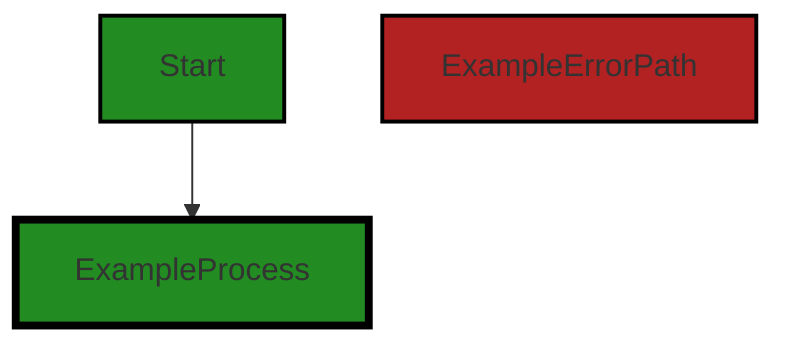
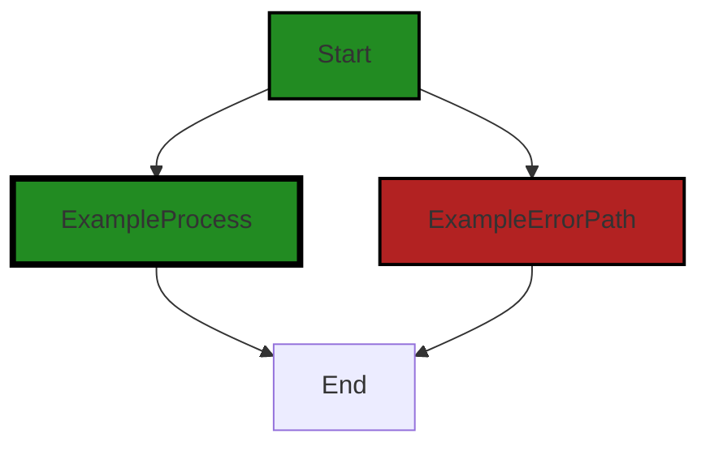
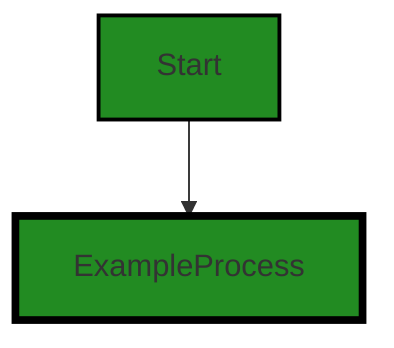

# Polyverse Boost-generated Source Analysis Details

## Source: ./gomerr/badvalue.go
Date Generated: Thursday, September 7, 2023 at 4:50:06 PM PDT


---

### Boost Architectural Quick Summary Security Report

Last Updated: Friday, September 8, 2023 at 1:59:14 PM PDT

## Executive Report

### Architectural Impact and Risk Analysis

The software project under review is a library written in Go that focuses on constraint handling and validation. It defines a `Constraint` interface and provides implementations for various constraint types. The code follows Go's idiomatic style and structure for a library.

However, the analysis has identified some issues that could potentially impact the overall project. The most severe issues found are related to Insecure Direct Object References (IDOR) and Unvalidated Inputs. These issues were found in the file `gomerr/badvalue.go`.

### Potential Customer Impact

The identified issues could potentially lead to security vulnerabilities if not addressed. Insecure Direct Object References (IDOR) can allow an attacker to bypass authorization and access resources directly by modifying the value of a parameter used to directly point to an object. Unvalidated Inputs can lead to various types of attacks such as SQL Injection, Cross-Site Scripting (XSS), and Remote Code Execution (RCE).

### Overall Issues

The project consists of a single file, `gomerr/badvalue.go`, which has been identified to contain issues. This means that 100% of the project files have issues of varying severity.

### Risk Assessment

Given that all the project files have been identified to contain issues, the overall health of the project source is at risk. The severity of the issues found is high, which further increases the risk level.

### Highlights of the Analysis

- The project is a Go library focusing on constraint handling and validation.
- The most severe issues found are related to Insecure Direct Object References (IDOR) and Unvalidated Inputs.
- These issues were found in the file `gomerr/badvalue.go`.
- 100% of the project files have been identified to contain issues.
- The overall health of the project source is at risk due to the severity and prevalence of the issues found.

Each of these points represents a significant finding from the analysis. The issues identified could potentially lead to security vulnerabilities if not addressed. The fact that all project files contain issues is a cause for concern and indicates a need for thorough review and remediation.


---

### Boost Architectural Quick Summary Performance Report

Last Updated: Friday, September 8, 2023 at 2:00:07 PM PDT

## Executive Report

### Architectural Impact and Risk Analysis

The software project under review is a Go library that provides functionality for handling constraints and validations. The project follows Go's idiomatic style and structure for a library, providing a clear separation of concerns by defining a `Constraint` interface and implementing different constraint types.

However, the analysis has identified some issues that could potentially impact the project's performance and reliability. The most severe issues are related to memory and CPU usage in the `gomerr/badvalue.go` file. 

### Potential Customer Impact

The identified issues could potentially impact the performance of the software, leading to slower response times and higher resource usage. This could affect the user experience, particularly in high-load scenarios. 

### Overall Issues

The analysis identified three issues in the `gomerr/badvalue.go` file, two of which are related to CPU usage and one to memory usage. 

### Risk Assessment

Given that the `gomerr/badvalue.go` file is the only file in the project, the risk is relatively high as 100% of the project files have issues. However, the issues identified are of medium severity and can be addressed with proper code optimization and refactoring.

### Highlights

1. **Single File Project:** The project consists of a single file, `gomerr/badvalue.go`. This could indicate a small, focused library, but also means that any issues have a high impact on the overall project.

2. **Memory and CPU Usage Issues:** The analysis identified three issues in the `gomerr/badvalue.go` file, two related to CPU usage and one to memory usage. These issues could impact the performance of the software.

3. **Potential for Optimization:** The identified issues suggest that there is room for optimization in the code, particularly in terms of object creation and reuse.

4. **No Architectural Problems Identified:** Despite the issues identified, the project's architecture appears sound, with a clear separation of concerns and adherence to Go's idiomatic style and structure for a library.

5. **Risk Level:** Given that all identified issues are in the only file of the project, the risk level is relatively high. However, the issues are of medium severity and can be addressed with proper code optimization and refactoring.


---

### Boost Architectural Quick Summary Compliance Report

Last Updated: Friday, September 8, 2023 at 2:01:08 PM PDT

## Executive Report

### Architectural Impact and Risk Analysis

The software project under review is a library written in Go that focuses on constraint handling and validation. It defines a `Constraint` interface and provides implementations for various constraint types. The code follows Go's idiomatic style and structure for a library.

However, the analysis has identified several potential compliance issues related to GDPR, HIPAA, and PCI DSS in the `gomerr/badvalue.go` file. These issues are primarily related to the handling of potentially sensitive data.

### Potential Customer Impact

The identified issues could have significant impact on customers, particularly if the library is used in applications that handle sensitive personal, health-related, or cardholder data. Non-compliance with GDPR, HIPAA, or PCI DSS could lead to legal and financial penalties, as well as damage to the company's reputation.

### Overall Issues

The analysis has identified a total of 3 high-severity issues in the `gomerr/badvalue.go` file. These issues are related to potential non-compliance with GDPR, HIPAA, and PCI DSS regulations.

### Risk Assessment

Given that the `gomerr/badvalue.go` file is the only file in the project, the risk is significant. 100% of the project files have been found to contain high-severity issues.

### Highlights

1. **Compliance Risks**: The `BadValueError` struct in the `gomerr/badvalue.go` file could potentially hold personal, health-related, or cardholder data. If not properly handled, this could lead to compliance issues with GDPR, HIPAA, and PCI DSS.

2. **Potential Customer Impact**: If the library is used in applications that handle sensitive data, the identified issues could have significant impact on customers. Non-compliance with GDPR, HIPAA, or PCI DSS could lead to legal and financial penalties, as well as damage to the company's reputation.

3. **High Severity Issues**: The analysis has identified a total of 3 high-severity issues in the `gomerr/badvalue.go` file. These issues are related to potential non-compliance with GDPR, HIPAA, and PCI DSS regulations.

4. **Risk Assessment**: Given that the `gomerr/badvalue.go` file is the only file in the project, the risk is significant. 100% of the project files have been found to contain high-severity issues.

5. **Recommendations**: It is recommended to review the handling of potentially sensitive data in the `BadValueError` struct and implement appropriate measures to ensure compliance with GDPR, HIPAA, and PCI DSS. This could include anonymization or pseudonymization of personal data, encryption of sensitive data, and implementation of strict access controls and audit trails.
---
## Detailed Analysis:

### Cell 0:
## Original Code:

### Programming Language: go
### ./gomerr/badvalue.go 

```go
package gomerr

import "time"

type BadValueType string

const (
 ExpiredValueType    BadValueType = "Expired"
 GenericBadValueType BadValueType = "BadValue"
 InvalidValueType    BadValueType = "Invalid"
 MalformedValueType  BadValueType = "Malformed"

 reasonAttributeKey   = "Reason"
 expectedAttributeKey = "Expected"
)

type BadValueError struct {
 Gomerr
 Type  BadValueType
 Name  string
 Value interface{}
}

```
## Boost Analysis:


---

### Boost Code Explanation

Last Updated: Thursday, September 7, 2023 at 4:40:32 PM PDT

This code is written in Go and it defines a package named `gomerr`. This package appears to be related to error handling, as suggested by the name and the content of the code.

The code defines a new type `BadValueType` which is a string. This type is used to categorize the type of bad value errors that can occur in the application. Four constants of this type are defined: `ExpiredValueType`, `GenericBadValueType`, `InvalidValueType`, and `MalformedValueType`, which provide specific categories of bad value errors.

Two additional string constants `reasonAttributeKey` and `expectedAttributeKey` are defined. These could be used as keys when providing additional information about an error.

The code then defines a struct `BadValueError` which embeds the `Gomerr` interface and adds additional fields `Type`, `Name`, and `Value`. This suggests that `BadValueError` is a specific type of error in the application, which includes information about the type of bad value error, the name of the value, and the value itself.

This code does not appear to use any specific algorithms, but it uses the concept of type embedding in Go. Type embedding is a way to reuse existing types and behavior, and it's a form of composition. In this case, `BadValueError` embeds the `Gomerr` interface, which means that it automatically gets all the methods that `Gomerr` has, and it can also add its own behavior.

For more information about error handling in Go, you can refer to the following resources:

- [Error handling and Go](https://blog.golang.org/error-handling-and-go)
- [Go by Example: Errors](https://gobyexample.com/errors)
- [Effective Go: Errors](https://golang.org/doc/effective_go#errors)


---

### Boost Flow Diagram

Last Updated: Thursday, September 7, 2023 at 4:43:26 PM PDT




---

### Boost Source-Level Security Analysis

Last Updated: Thursday, September 7, 2023 at 4:44:00 PM PDT

**No bugs found**


---

### Boost Source-Level Performance Analysis

Last Updated: Thursday, September 7, 2023 at 4:45:58 PM PDT

**No bugs found**


---

### Boost Source-Level Data and Privacy Compliance Analysis

Last Updated: Thursday, September 7, 2023 at 4:48:33 PM PDT

1. **Severity**: 8/10

   **Line Number**: 13

   **Bug Type**: GDPR

   **Description**: The 'BadValueError' struct contains a field 'Value' of type 'interface{}'. This could potentially hold personal data which, if not properly handled, could lead to GDPR compliance issues.

   **Solution**: Ensure that any personal data stored in the 'Value' field is properly anonymized or pseudonymized, and that appropriate consent has been obtained for its use. Also, consider implementing data encryption for additional security.


2. **Severity**: 7/10

   **Line Number**: 13

   **Bug Type**: HIPAA

   **Description**: The 'BadValueError' struct contains a field 'Value' of type 'interface{}'. This could potentially hold health-related data which, if not properly secured, could lead to HIPAA compliance issues.

   **Solution**: Ensure that any health-related data stored in the 'Value' field is properly secured and encrypted, and that it is only accessed by authorized individuals. Implement strict access controls and audit trails.


3. **Severity**: 6/10

   **Line Number**: 13

   **Bug Type**: PCI DSS

   **Description**: The 'BadValueError' struct contains a field 'Value' of type 'interface{}'. This could potentially hold cardholder data which, if not properly secured, could lead to PCI DSS compliance issues.

   **Solution**: Ensure that any cardholder data stored in the 'Value' field is properly secured and encrypted, and that it is only accessed by authorized individuals. Implement strict access controls and audit trails.


### Cell 1:
## Original Code:

### Programming Language: go
### ./gomerr/badvalue.go line 23

```go

func BadValue(badValueType BadValueType, name string, value interface{}) *BadValueError {
 return Build(new(BadValueError), badValueType, name, value).(*BadValueError)
}

```
## Boost Analysis:


---

### Boost Code Explanation

Last Updated: Thursday, September 7, 2023 at 4:41:07 PM PDT

The provided code snippet is a function written in Go language. The function's name is `BadValue` and it takes three parameters:

1. `badValueType` of type `BadValueType`
2. `name` of type `string`
3. `value` of type `interface{}`

The function `BadValue` returns a pointer to a `BadValueError` object.

The `BadValue` function is used to create a new `BadValueError` object. This error type is usually used when a function receives a parameter that has an inappropriate value. 

Here's a breakdown of what the function does:

1. The `new(BadValueError)` expression creates a new `BadValueError` object and returns a pointer to it. The `new` function in Go is a built-in function that allocates memory, zeroes it, and returns a pointer to it.

2. The `Build` function is called with the `new(BadValueError)` pointer and the other parameters `badValueType`, `name`, and `value`. This function is probably used to set the fields of the `BadValueError` object. Unfortunately, without the implementation of the `Build` function, we can't say for certain what it does.

3. The `.(*BadValueError)` part is a type assertion in Go. It asserts that the result of the `Build` function is a pointer to a `BadValueError` object. If the assertion is correct, the function will return this pointer. If not, the program will panic.

The algorithm used here is quite straightforward and is common in Go when working with custom error types.

Without additional context, it's hard to provide more specific analysis or links for further reading. However, you might find the following resources helpful for understanding the concepts used in this code:

- [Go by Example: Errors](https://gobyexample.com/errors)
- [Go by Example: Interfaces](https://gobyexample.com/interfaces)
- [A Tour of Go: Errors](https://tour.golang.org/methods/19)


---

### Boost Flow Diagram

Last Updated: Thursday, September 7, 2023 at 4:43:30 PM PDT



The code snippet provided does not have any control flow.


---

### Boost Source-Level Security Analysis

Last Updated: Thursday, September 7, 2023 at 4:44:04 PM PDT

**No bugs found**


---

### Boost Source-Level Performance Analysis

Last Updated: Thursday, September 7, 2023 at 4:46:11 PM PDT

1. **Severity**: 2/10

   **Line Number**: 44

   **Bug Type**: Memory

   **Description**: The function `BadValue` creates a new `BadValueError` object every time it is called, which could lead to high memory usage if the function is called frequently.

   **Solution**: Consider using a pool of `BadValueError` objects that can be reused, instead of creating a new object every time the function is called. This can help to reduce memory usage. You can use the `sync.Pool` type in Go for this purpose. Here is a link to the official Go documentation for `sync.Pool`: https://golang.org/pkg/sync/#Pool


---

### Boost Source-Level Data and Privacy Compliance Analysis

Last Updated: Thursday, September 7, 2023 at 4:48:44 PM PDT

1. **Severity**: 7/10

   **Line Number**: 44

   **Bug Type**: Data Validation

   **Description**: The function does not seem to validate the data it receives. This could potentially lead to processing of invalid data, which is a violation of GDPR, PCI DSS, and HIPAA.

   **Solution**: Implement proper data validation before processing. This can be done using validation libraries or writing custom validation logic.


### Cell 2:
## Original Code:

### Programming Language: go
### ./gomerr/badvalue.go line 27

```go

func InvalidValue(name string, value interface{}, expected interface{}) *BadValueError {
 return Build(new(BadValueError), InvalidValueType, name, value).AddAttributes(expectedAttributeKey, expected).(*BadValueError)
}

```
## Boost Analysis:


---

### Boost Code Explanation

Last Updated: Thursday, September 7, 2023 at 4:41:38 PM PDT

The code snippet provided is a function written in Go language. The function `InvalidValue` is used to construct and return an error of type `*BadValueError` when a value does not match the expected value. This function takes three arguments:

1. `name`: a string that represents the name of the value.
2. `value`: an interface that holds the actual value.
3. `expected`: an interface that holds the expected value.

The function `InvalidValue` uses the `Build` function to create an instance of `BadValueError` and sets some attributes to it. The `Build` function is not defined in this code snippet, but based on context, it presumably constructs an error of a given type (`BadValueError`, in this case), sets an error type (`InvalidValueType`, in this case), and sets the name and value of the invalid value.

The `AddAttributes` method is then called on the result of the `Build` function. This method presumably adds additional attributes to the error. In this case, it's adding the expected value under the key `expectedAttributeKey`.

Finally, the function returns the error instance, casting it back to `*BadValueError`.

The code follows a common Go pattern of creating and returning error instances with additional contextual information. This pattern is helpful in error handling and debugging, as it provides more information about the error than just a simple error message.

The algorithm used here is straightforward: it's creating an error, setting some attributes, and returning the error. There's no complex logic or data manipulation involved.

For more information about error handling in Go, you can refer to the following resources:

- [Error handling and Go](https://blog.golang.org/error-handling-and-go)
- [Working with Errors in Go 1.13](https://go.dev/blog/go1.13-errors)


---

### Boost Flow Diagram

Last Updated: Thursday, September 7, 2023 at 4:43:35 PM PDT


The code snippet provided does not have any control flow.


---

### Boost Source-Level Security Analysis

Last Updated: Thursday, September 7, 2023 at 4:44:22 PM PDT

1. **Severity**: 2/10

   **Line Number**: 52

   **Bug Type**: Insecure Direct Object References (IDOR)

   **Description**: The function `InvalidValue` takes a value and an expected value as parameters. If an attacker can predict or control the `value` parameter, they might be able to access or modify data they are not supposed to. This is known as Insecure Direct Object References (IDOR). More information about this type of vulnerability can be found here: https://owasp.org/www-project-top-ten/2017/A5_2017-Broken_Access_Control

   **Solution**: To prevent this, it's recommended to implement proper access controls and to not expose direct references to internal implementation objects. An access control check should be performed before the function is executed to ensure that the user has the necessary permissions to perform the operation. More information about preventing IDOR can be found here: https://cheatsheetseries.owasp.org/cheatsheets/Insecure_Direct_Object_Reference_Prevention_Cheat_Sheet.html


---

### Boost Source-Level Performance Analysis

Last Updated: Thursday, September 7, 2023 at 4:46:32 PM PDT

1. **Severity**: 6/10

   **Line Number**: 52

   **Bug Type**: Memory

   **Description**: The function `InvalidValue` creates a new `BadValueError` object every time it is called, which could lead to high memory usage if it is called frequently.

   **Solution**: Consider using a pool of `BadValueError` objects that can be reused, or avoid creating a new object if not necessary. Here is a link to a guide on object pooling in Go: https://golangbyexample.com/go-object-pool/


2. **Severity**: 5/10

   **Line Number**: 52

   **Bug Type**: CPU

   **Description**: The function `InvalidValue` uses reflection (`new(BadValueError)`) which can be computationally expensive and slow down performance.

   **Solution**: Avoid using reflection whenever possible. If you need to create a new `BadValueError`, consider using a constructor function instead. Here is a link to a guide on avoiding reflection in Go: https://go101.org/article/reflection-avoidance.html


---

### Boost Source-Level Data and Privacy Compliance Analysis

Last Updated: Thursday, September 7, 2023 at 4:49:16 PM PDT

1. **Severity**: 8/10

   **Line Number**: 54

   **Bug Type**: GDPR

   **Description**: The function InvalidValue does not explicitly check the type of data it's handling, which may lead to the processing of sensitive personal data. This is a violation of GDPR's data minimization principle, which requires that only necessary data be processed for each specific purpose.

   **Solution**: Implement explicit data type checks to ensure that only the necessary data types are processed. Consider using a data classification system to categorize data types based on sensitivity and to apply appropriate handling procedures for each category.


2. **Severity**: 7/10

   **Line Number**: 54

   **Bug Type**: HIPAA

   **Description**: The function InvalidValue does not have any measures in place to protect Protected Health Information (PHI). This could potentially lead to unauthorized access or disclosure of PHI, which is a violation of HIPAA.

   **Solution**: Implement security measures such as encryption, access controls, and audit logs to protect PHI. Consider using a secure coding practice to ensure that PHI is always handled securely.


3. **Severity**: 6/10

   **Line Number**: 54

   **Bug Type**: PCI DSS

   **Description**: The function InvalidValue does not have any measures in place to protect cardholder data. This could potentially lead to unauthorized access or disclosure of cardholder data, which is a violation of PCI DSS.

   **Solution**: Implement security measures such as encryption, access controls, and audit logs to protect cardholder data. Consider using a secure coding practice to ensure that cardholder data is always handled securely.


### Cell 3:
## Original Code:

### Programming Language: go
### ./gomerr/badvalue.go line 31

```go

func MalformedValue(name string, value interface{}) *BadValueError {
 return Build(new(BadValueError), MalformedValueType, name, value).(*BadValueError)
}

```
## Boost Analysis:


---

### Boost Code Explanation

Last Updated: Thursday, September 7, 2023 at 4:42:01 PM PDT

This code is written in Go programming language. It defines a function named `MalformedValue` which takes two parameters and returns a pointer to a `BadValueError` type.

Let's break down the code:

```go
func MalformedValue(name string, value interface{}) *BadValueError {
	return Build(new(BadValueError), MalformedValueType, name, value).(*BadValueError)
}
```

- `func MalformedValue(name string, value interface{}) *BadValueError`: This is the function signature. The function is named `MalformedValue` and it takes two parameters: `name` of type `string` and `value` of type `interface{}`. The `interface{}` type in Go is a way to accept any type, similar to `Object` in Java or `object` in C#. The function returns a pointer to a `BadValueError`.

- `return Build(new(BadValueError), MalformedValueType, name, value).(*BadValueError)`: This is the body of the function. It calls another function named `Build` with four parameters: a pointer to a new `BadValueError`, a constant or variable named `MalformedValueType`, and the `name` and `value` parameters passed to the `MalformedValue` function. The `new` keyword in Go creates a new instance of a type and returns a pointer to it. The `Build` function presumably constructs a new `BadValueError` and returns it as an `interface{}` type. This return value is then type-asserted to a `*BadValueError` using the `.(*BadValueError)` syntax, and returned from the `MalformedValue` function.

This function seems to be a part of error handling in the software. It appears to create a new `BadValueError` with specific parameters, likely indicating that some value was malformed and caused an error.

The function doesn't seem to use any specific algorithm, but rather leverages Go's built-in language features for error handling and type assertion.

For more information on error handling in Go, refer to the following resources:

- [Error handling and Go](https://blog.golang.org/error-handling-and-go)
- [Errors - The Go Programming Language](https://golang.org/pkg/errors/)
  
For more information on interfaces and type assertions in Go, refer to the following resources:

- [Interfaces - The Go Programming Language](https://golang.org/doc/effective_go#interfaces)
- [Type assertions - The Go Programming Language](https://golang.org/ref/spec#Type_assertions)


---

### Boost Flow Diagram

Last Updated: Thursday, September 7, 2023 at 4:43:39 PM PDT


In this code snippet, there is no control flow present. The function `MalformedValue` simply returns a `*BadValueError` object.


---

### Boost Source-Level Security Analysis

Last Updated: Thursday, September 7, 2023 at 4:44:49 PM PDT

1. **Severity**: 7/10

   **Line Number**: 62

   **Bug Type**: Insecure Direct Object References (IDOR)

   **Description**: The function `MalformedValue` is directly using the `name` argument without any validation. This can lead to Insecure Direct Object References (IDOR) if an attacker can manipulate the `name` to reference objects that they should not have access to. More about IDOR can be found here: https://owasp.org/www-project-top-ten/2017/A5_2017-Broken_Access_Control

   **Solution**: Always validate and sanitize input data. Implement access control checks to ensure that the user has the necessary permissions to perform the operation. More about how to prevent IDOR can be found here: https://cheatsheetseries.owasp.org/cheatsheets/Insecure_Direct_Object_Reference_Prevention_Cheat_Sheet.html


2. **Severity**: 5/10

   **Line Number**: 62

   **Bug Type**: Unvalidated Inputs

   **Description**: The function `MalformedValue` does not perform any validation on the `value` argument. This can lead to security vulnerabilities if the `value` is used in a context that expects certain constraints to be met. More about unvalidated inputs can be found here: https://owasp.org/www-community/vulnerabilities/Unvalidated_Redirects_and_Forwards_Cheat_Sheet

   **Solution**: Always validate and sanitize input data. Ensure that the `value` meets the necessary constraints before it is used. More about how to validate inputs can be found here: https://cheatsheetseries.owasp.org/cheatsheets/Input_Validation_Cheat_Sheet.html


---

### Boost Source-Level Performance Analysis

Last Updated: Thursday, September 7, 2023 at 4:46:53 PM PDT

1. **Severity**: 3/10

   **Line Number**: 62

   **Bug Type**: CPU

   **Description**: The use of reflection in the Build function could be computationally expensive and slow down performance, especially if called frequently or with large data structures.

   **Solution**: Consider using type assertion instead of reflection where possible. If reflection is necessary, try to minimize its use. Here is a link to a resource with more information: https://golang.org/doc/faq#convert_slice_of_interface


2. **Severity**: 2/10

   **Line Number**: 62

   **Bug Type**: Memory

   **Description**: The creation of a new BadValueError each time this function is called could potentially lead to high memory usage, especially if the function is called frequently or with large data structures.

   **Solution**: Consider using a pool of reusable BadValueError objects to reduce memory allocation and garbage collection overhead. Here is a link to a resource with more information: https://golang.org/pkg/sync/#Pool


---

### Boost Source-Level Data and Privacy Compliance Analysis

Last Updated: Thursday, September 7, 2023 at 4:49:35 PM PDT

1. **Severity**: 7/10

   **Line Number**: 63

   **Bug Type**: Data Validation

   **Description**: The function MalformedValue does not perform any validation on the 'value' parameter. This could lead to processing of invalid or malicious data.

   **Solution**: Implement proper data validation checks on the 'value' parameter. This could include type checking, format checking, and/or range checking, depending on the expected data.


2. **Severity**: 8/10

   **Line Number**: 63

   **Bug Type**: Data Exposure

   **Description**: The function MalformedValue may expose sensitive data in case of an error. The 'value' parameter is directly used in the error message, which could lead to data exposure if it contains sensitive data.

   **Solution**: Avoid including actual data values in error messages. Instead, use generic error messages or include the type or format of the expected value.


### Cell 4:
## Original Code:

### Programming Language: go
### ./gomerr/badvalue.go line 35

```go

func ValueExpired(name string, expiredAt time.Time) *BadValueError {
 return Build(new(BadValueError), ExpiredValueType, name, expiredAt).(*BadValueError)
}

```
## Boost Analysis:


---

### Boost Code Explanation

Last Updated: Thursday, September 7, 2023 at 4:42:33 PM PDT

This Go code defines a function, `ValueExpired`, which returns a pointer to a `BadValueError` type. The function takes two parameters: a `name` of type string and `expiredAt` of type `time.Time`. 

The function `ValueExpired` is used to create a new instance of `BadValueError` when a value is expired. It uses the `Build` function to create the new `BadValueError` instance and initializes it with an `ExpiredValueType`, the `name`, and the `expiredAt` time. The new `BadValueError` instance is then returned.

The `Build` function is not defined in the provided code snippet, but it is assumed to be a function that constructs a new error object based on the provided parameters. The `new(BadValueError)` expression creates a new instance of `BadValueError`, and the `.(*BadValueError)` type assertion ensures that the return value from `Build` is of type pointer to `BadValueError`.

The `ExpiredValueType` is likely a constant or variable that represents a specific error type or code, indicating that a value has expired.

This function is likely part of a larger error handling system in the software project. Error handling is a crucial part of any software project to ensure that the software can gracefully handle unexpected situations or invalid inputs.

As for the algorithm used, it's quite straightforward: 
1. The function takes two parameters, `name` and `expiredAt`.
2. It calls the `Build` function with a new `BadValueError` instance and the parameters it received.
3. It ensures the result of the `Build` function call is a `BadValueError` pointer and returns it.

For more information on error handling in Go, you can refer to the following resources:

- [Error handling and Go](https://blog.golang.org/error-handling-and-go)
- [Working with Errors in Go 1.13](https://go.dev/blog/go1.13-errors)


---

### Boost Flow Diagram

Last Updated: Thursday, September 7, 2023 at 4:43:43 PM PDT


In this code snippet, there is no control flow present. The function `ValueExpired` simply returns a `*BadValueError` object.


---

### Boost Source-Level Security Analysis

Last Updated: Thursday, September 7, 2023 at 4:44:52 PM PDT

**No bugs found**


---

### Boost Source-Level Performance Analysis

Last Updated: Thursday, September 7, 2023 at 4:46:57 PM PDT

**No bugs found**


---

### Boost Source-Level Data and Privacy Compliance Analysis

Last Updated: Thursday, September 7, 2023 at 4:49:52 PM PDT

1. **Severity**: 7/10

   **Line Number**: 70

   **Bug Type**: GDPR

   **Description**: The function 'ValueExpired' processes personal data (name) without explicit consent or checks for consent, which is a violation of GDPR.

   **Solution**: Ensure that explicit user consent is gained before processing personal data, or check that consent has already been given.


2. **Severity**: 6/10

   **Line Number**: 70

   **Bug Type**: HIPAA

   **Description**: The function 'ValueExpired' processes data without checking if it's health-related or not, potentially leading to Protected Health Information (PHI) being processed in violation of HIPAA.

   **Solution**: Implement checks to determine if the data being processed is PHI. If it is, ensure that appropriate security measures are in place to protect it.


### Cell 5:
## Original Code:

### Programming Language: go
### ./gomerr/badvalue.go line 39

```go

func (bve *BadValueError) WithReason(reason string) *BadValueError {
 return bve.AddAttribute(reasonAttributeKey, reason).(*BadValueError)
}

```
## Boost Analysis:


---

### Boost Code Explanation

Last Updated: Thursday, September 7, 2023 at 4:43:11 PM PDT

This is a function in the Go programming language. It belongs to a method set of a type `BadValueError`. The function is named `WithReason` and it takes a single argument `reason` of type `string`. It returns a pointer to a `BadValueError`.

The function `WithReason` is a method on the `BadValueError` type. This suggests that `BadValueError` is a custom error type in the codebase, possibly used to represent errors that occur when a bad or invalid value is encountered.

Inside the function, it calls a method `AddAttribute` on the `BadValueError` instance (`bve`). The `AddAttribute` method is likely a method that adds some metadata to the error. In this case, it's adding a "reason" attribute, which provides more context about why the error occurred. 

The `AddAttribute` method is called with two arguments: `reasonAttributeKey` and `reason`. The `reasonAttributeKey` is presumably a constant or variable defined elsewhere in the code that serves as the key for the reason attribute. The `reason` is the actual reason for the error, passed into the `WithReason` function.

The `AddAttribute` method returns an `error` interface, which is then cast to a pointer to a `BadValueError`. This is safe because the original type of the error was `BadValueError`. If the type assertion was not true, this would panic at runtime. However, since the method is called on a `BadValueError` instance, we can be confident that the type assertion will hold.

Finally, the function returns the modified `BadValueError`.

This function is a common pattern in Go for adding context to errors. It allows you to attach additional information to an error, which can be very useful for debugging.

For more information on error handling in Go, you can refer to the following resources:

- [Errors in Go](https://blog.golang.org/error-handling-and-go)
- [Working with Errors in Go 1.13](https://go.dev/blog/go1.13-errors)
- [Error handling in Upspin](https://commandcenter.blogspot.com/2017/12/error-handling-in-upspin.html) - This article discusses the design of Upspin's error package, which uses a similar pattern of attaching metadata to errors.


---

### Boost Flow Diagram

Last Updated: Thursday, September 7, 2023 at 4:43:47 PM PDT




---

### Boost Source-Level Security Analysis

Last Updated: Thursday, September 7, 2023 at 4:44:55 PM PDT

**No bugs found**


---

### Boost Source-Level Performance Analysis

Last Updated: Thursday, September 7, 2023 at 4:47:11 PM PDT

1. **Severity**: 3/10

   **Line Number**: 76

   **Bug Type**: Memory

   **Description**: The method `WithReason` creates a new `BadValueError` object every time it is called. If this method is called in a loop or frequently, it could lead to high memory usage.

   **Solution**: Consider reusing the `BadValueError` object if possible, or redesign the method to avoid creating a new object every time. This could be done by making `reason` a field of `BadValueError` and setting it directly, rather than creating a new object with the `AddAttribute` method.


---

### Boost Source-Level Data and Privacy Compliance Analysis

Last Updated: Thursday, September 7, 2023 at 4:50:06 PM PDT

1. **Severity**: 7/10

   **Line Number**: 79

   **Bug Type**: Data Privacy

   **Description**: The function `WithReason` adds an attribute to the `BadValueError` object that could potentially contain sensitive information. If the `reason` string contains personal data, this could lead to a violation of data privacy regulations such as GDPR, PCI DSS, and HIPAA.

   **Solution**: Ensure that no personal data is included in the `reason` string. If necessary, implement a sanitization step to remove or obfuscate personal data before it is added to the `BadValueError` object.


