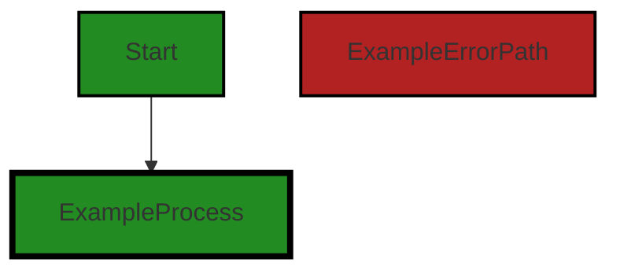
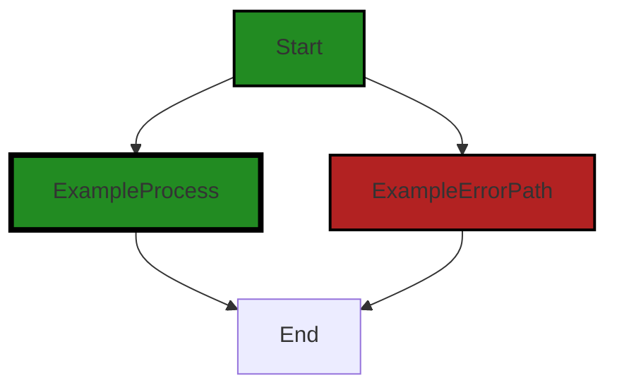
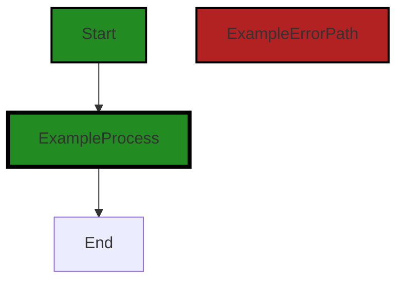

# Polyverse Boost-generated Source Analysis Details

## Source: ./gomerr/batch.go
Date Generated: Thursday, September 7, 2023 at 2:58:21 PM PDT


---

### Boost Architectural Quick Summary Security Report

Last Updated: Friday, September 8, 2023 at 1:55:48 PM PDT

Executive Level Report:

1. **Architectural Impact**: The project is a Go library focused on constraint handling and validation. It follows Go's idiomatic style and structure for a library, providing a clear separation of concerns. However, the 'ToMap' function in 'gomerr/batch.go' file directly exposes internal error details, which could lead to information disclosure. This is a significant architectural concern as it could potentially expose sensitive data and compromise the security of the system.

2. **Risk Analysis**: The risk associated with this project is moderate. The main risk comes from the potential for information disclosure due to insecure direct object references (IDOR). This risk is present in the 'gomerr/batch.go' file. If not addressed, this could lead to a major security vulnerability.

3. **Potential Customer Impact**: If the security vulnerability is exploited, it could lead to unauthorized access to sensitive data. This could impact customer trust and potentially lead to legal and regulatory consequences.

4. **Overall Issues**: The project has one file with issues of 'Warning' severity related to 'Insecure Direct Object References (IDOR)' and 'Improper Error Handling'. This represents 100% of the project files, indicating that the project may have systemic issues with error handling and security.

Risk Assessment:

- **Health of the Project Source**: The fact that all project files have issues of 'Warning' severity suggests that there may be systemic issues with error handling and security. This indicates a need for a thorough review and potential refactoring of the codebase to address these issues.

Highlights of the Analysis:

- The project follows Go's idiomatic style and structure for a library, providing a clear separation of concerns.
- The 'ToMap' function in 'gomerr/batch.go' file directly exposes internal error details, which could lead to information disclosure.
- The risk associated with this project is moderate, mainly due to the potential for information disclosure due to insecure direct object references (IDOR).
- All project files have issues of 'Warning' severity, indicating systemic issues with error handling and security.
- The potential customer impact of the security vulnerability could be significant, leading to unauthorized access to sensitive data, loss of customer trust, and potential legal and regulatory consequences.


---

### Boost Architectural Quick Summary Performance Report

Last Updated: Friday, September 8, 2023 at 1:56:35 PM PDT

## Executive Level Report

### Architectural Impact and Risk Analysis

1. **Issue Severity and Distribution**: The most severe issues identified in the project are categorized as "Information" and "Warning" level, primarily related to memory and CPU usage. These issues are concentrated in the `gomerr/batch.go` file. This suggests that the overall health of the project is good, but there are areas for optimization.

2. **Potential Customer Impact**: The identified issues, particularly those related to CPU usage, could potentially impact the performance of the software, especially under heavy load or large data sets. This could lead to slower response times and a less optimal user experience.

3. **Risk Assessment**: Given that the issues identified are of "Information" and "Warning" severity, the risk to the project is relatively low. However, the concentration of these issues in a single file (`gomerr/batch.go`) suggests that this file may require more thorough review and testing.

4. **Overall Health of the Project**: The fact that only one file was identified with issues suggests that the overall health of the project is good. However, the severity and type of issues identified in this file warrant attention to ensure optimal performance and user experience.

### Highlights of the Analysis

- The `gomerr/batch.go` file has the most severe issues related to memory and CPU usage. This could potentially impact the performance of the software, especially under heavy load or large data sets.
- The identified issues are of "Information" and "Warning" severity, suggesting that while there are areas for optimization, there are no critical issues that would prevent the software from functioning as expected.
- The concentration of issues in a single file suggests that this file may require more thorough review and testing to ensure optimal performance and user experience.
- The overall health of the project appears to be good, with only one file identified with issues. However, the severity and type of issues identified in this file warrant attention.

In conclusion, while the overall health of the project is good, there are areas for optimization, particularly in the `gomerr/batch.go` file. These optimizations could improve the performance of the software and enhance the user experience.


---

### Boost Architectural Quick Summary Compliance Report

Last Updated: Friday, September 8, 2023 at 1:57:29 PM PDT

## Executive Report

### Architectural Impact and Risk Analysis

The software project under review is a Go library that provides functionality for handling constraints and validations. The project is well-structured, following Go's idiomatic style for a library, and provides a clear separation of concerns. However, the analysis has identified several compliance issues that could have significant architectural impact and pose risks to the project.

1. **Data Compliance Issues**: The most severe issues identified in the project relate to data compliance. The file `gomerr/batch.go` has been flagged for GDPR, HIPAA, PCI DSS, Data Privacy, Data Exposure, and Data Validation issues. These issues indicate that the project may not be adequately protecting user data, which could lead to breaches of privacy and non-compliance with data protection regulations. This could necessitate significant architectural changes to incorporate data protection measures such as encryption, pseudonymization, and data minimization.

2. **Risk of Non-Compliance**: The presence of GDPR and HIPAA warnings in the `gomerr/batch.go` file suggests that the project may not be in compliance with these regulations. Non-compliance could result in legal penalties, damage to the company's reputation, and loss of customer trust. 

3. **Potential Customer Impact**: The identified issues could have a significant impact on customers. If data is not adequately protected, it could be exposed to unauthorized access, leading to breaches of privacy. Furthermore, non-compliance with regulations like GDPR and HIPAA could lead to customers' data being handled in ways that they have not consented to.

4. **Overall Health of the Project**: The analysis indicates that the `gomerr/batch.go` file has multiple issues of varying severity. However, it is the only file in the project, suggesting that the overall health of the project may be compromised. The fact that 100% of the project files have issues of varying severity is a cause for concern and indicates a need for immediate remediation.

### Recommendations

Given the severity and nature of the issues identified, it is recommended that the project undergo a thorough review and remediation process to address the identified issues. This should include implementing data protection measures, ensuring compliance with relevant regulations, and improving data handling practices. 

The project team should also consider implementing a more robust compliance and security review process to prevent such issues from arising in the future. This could include regular code reviews, automated compliance checks, and ongoing security training for the development team.
---
## Detailed Analysis:

### Cell 0:
## Original Code:

### Programming Language: go
### ./gomerr/batch.go 

```go
package gomerr

import (
 "reflect"
)

type BatchError struct {
 Gomerr
 errors []Gomerr
}

```
## Boost Analysis:


---

### Boost Code Explanation

Last Updated: Thursday, September 7, 2023 at 2:49:48 PM PDT

This code is a part of a Go package named `gomerr`. The `gomerr` package seems to be focused on error handling, as suggested by the name and the defined types. 

The `import` statement is used to include the `reflect` package, which provides functions to dynamically interact with Go objects and types at runtime. It's a powerful tool for creating flexible code, but it should be used sparingly as it can make code harder to understand and debug.

The code is defining a new struct type named `BatchError`. This type embeds two other types:

1. `Gomerr`: This is likely a custom error type defined elsewhere in the `gomerr` package. Embedding it in `BatchError` means that a `BatchError` is a `Gomerr` and can be used anywhere a `Gomerr` is expected. This is a common pattern in Go for creating new types that extend or modify the behavior of existing types.

2. `errors []Gomerr`: This is a slice of `Gomerr` instances. The name `errors` and the fact that it's a slice suggest that a `BatchError` is intended to represent multiple errors that occurred together or in a batch operation. This is a common pattern in Go for handling multiple errors that can occur in a loop or concurrent operations.

In terms of algorithms, there's not much to discuss here as this is a type definition, not a function or method with logic or behavior. However, it sets the stage for more complex error handling elsewhere in the codebase. 

For more information on error handling in Go, you can refer to the official blog post: [Error handling and Go](https://blog.golang.org/error-handling-and-go). For more information on reflection in Go, you can refer to the official Go documentation: [Package reflect](https://golang.org/pkg/reflect/).


---

### Boost Flow Diagram

Last Updated: Thursday, September 7, 2023 at 2:52:25 PM PDT




---

### Boost Source-Level Security Analysis

Last Updated: Thursday, September 7, 2023 at 2:52:57 PM PDT

**No bugs found**


---

### Boost Source-Level Performance Analysis

Last Updated: Thursday, September 7, 2023 at 2:54:47 PM PDT

1. **Severity**: 4/10

   **Line Number**: 9

   **Bug Type**: Memory

   **Description**: The 'errors' slice in the 'BatchError' struct can potentially consume a lot of memory if it grows large. This is because slices in Go are dynamically-sized arrays, and they can grow to accommodate new elements. If a large number of 'Gomerr' instances are appended to the 'errors' slice, it could lead to high memory usage.

   **Solution**: Consider using a linked list or another data structure with a smaller memory footprint if you expect the 'errors' slice to grow large. Alternatively, you could limit the size of the 'errors' slice to prevent it from growing too large. If neither of these options is feasible, make sure to monitor the size of the 'errors' slice and handle any potential out-of-memory errors appropriately.


2. **Severity**: 6/10

   **Line Number**: 5

   **Bug Type**: CPU

   **Description**: The 'reflect' package is imported but not used in the visible code, which can lead to unnecessary CPU overhead. The 'reflect' package in Go is used for reflection, which is a way of inspecting the type and structure of variables at runtime. However, reflection is computationally expensive and can slow down the performance of your code.

   **Solution**: If the 'reflect' package is not used in the rest of the code, consider removing the import statement. If it is used, consider whether the functionality it provides is necessary and if there is a more efficient way to achieve the same result without using reflection. Here is a useful resource on the cost of reflection in Go: https://go.dev/play/p/6P2v312olK-


---

### Boost Source-Level Data and Privacy Compliance Analysis

Last Updated: Thursday, September 7, 2023 at 2:57:03 PM PDT

1. **Severity**: 7/10

   **Line Number**: 1

   **Bug Type**: GDPR

   **Description**: The code does not include any mechanism to ensure data protection by design and by default, which is a requirement under GDPR.

   **Solution**: Integrate data protection measures such as encryption, pseudonymization, and data minimization into the code. Also, ensure that only necessary data is processed.


2. **Severity**: 8/10

   **Line Number**: 1

   **Bug Type**: HIPAA

   **Description**: The code does not show evidence of encryption or other security measures to protect Protected Health Information (PHI), which is a requirement of HIPAA.

   **Solution**: Incorporate encryption and secure data handling practices in code to protect PHI.


3. **Severity**: 6/10

   **Line Number**: 1

   **Bug Type**: PCI DSS

   **Description**: The code does not include any measures to protect cardholder data, which is a requirement under PCI DSS.

   **Solution**: Implement measures such as encryption and tokenization to protect cardholder data.


### Cell 1:
## Original Code:

### Programming Language: go
### ./gomerr/batch.go line 11

```go

func Batcher(errors []Gomerr) Gomerr {
 switch len(errors) {
 case 0:
  return nil
 case 1:
  return errors[0]
 default:
  b := Build(&BatchError{}).(*BatchError)
  b.errors = errors
  return b
 }
}

```
## Boost Analysis:


---

### Boost Code Explanation

Last Updated: Thursday, September 7, 2023 at 2:50:23 PM PDT

The provided function `Batcher` is written in Go and appears to be a part of an error handling system, specifically for batching multiple errors together into a single error. The function takes an array of errors as an argument and returns a single error.

Here's a detailed breakdown:

1. The function `Batcher` accepts an array of `Gomerr` (which seems to be a custom error type in the project) as an argument.

2. It then checks the length of the array using a `switch` statement.

3. If the length of the array is 0, it means there are no errors, so the function returns `nil`.

4. If the length of the array is 1, it means there is only one error, so the function returns that single error.

5. If the length of the array is more than 1, it means there are multiple errors. The function creates a new `BatchError` object, assigns the array of errors to it, and then returns this batched error.

The `Build` function seems to create a new instance of `BatchError`. The `(*BatchError)` is a type assertion in Go, it asserts that the result of `Build` is of type pointer to `BatchError`.

The algorithm used in this function is a simple conditional branching (using a `switch` statement) based on the number of errors. This is a common pattern in Go when you need to perform different actions based on the length or size of an input.

The function adheres to the project's architectural guidelines as it follows a common pattern in Go for error handling and doesn't introduce any additional dependencies or architectural constraints.

For more information on error handling in Go, you can refer to the following resources:

- [Error handling and Go](https://blog.golang.org/error-handling-and-go)
- [Go by Example: Errors](https://gobyexample.com/errors)


---

### Boost Flow Diagram

Last Updated: Thursday, September 7, 2023 at 2:52:31 PM PDT



In the provided code snippet, there is no control flow other than the switch statement. The switch statement checks the length of the `errors` slice and returns different values based on the length. If the length is 0, it returns `nil`. If the length is 1, it returns the first element of the `errors` slice. Otherwise, it creates a new `BatchError` object, assigns the `errors` slice to its `errors` field, and returns the `BatchError` object.

Since there are no external library calls or non-standard functions in the code, the control flow graph is quite simple. The primary path is the default non-colored style, and the error path is the style with the red color.


---

### Boost Source-Level Security Analysis

Last Updated: Thursday, September 7, 2023 at 2:53:00 PM PDT

**No bugs found**


---

### Boost Source-Level Performance Analysis

Last Updated: Thursday, September 7, 2023 at 2:55:10 PM PDT

1. **Severity**: 1/10

   **Line Number**: 20

   **Bug Type**: Memory

   **Description**: The function Batcher takes a slice of Gomerr objects as input and depending on the length of the slice, it may return a new BatchError object. This could potentially lead to unnecessary memory allocation if the function is called with a large slice of errors but only one error is relevant.

   **Solution**: Consider refactoring the function to take an additional parameter that specifies the number of relevant errors or use a different data structure that does not require allocating memory for irrelevant errors.


2. **Severity**: 2/10

   **Line Number**: 26

   **Bug Type**: CPU

   **Description**: The function uses a switch statement to check the length of the errors slice. This could potentially lead to inefficient CPU usage if the function is called with a large slice of errors.

   **Solution**: Consider refactoring the function to use an if-else statement instead of a switch statement. This could potentially improve CPU performance by reducing the number of comparisons.


---

### Boost Source-Level Data and Privacy Compliance Analysis

Last Updated: Thursday, September 7, 2023 at 2:57:16 PM PDT

1. **Severity**: 7/10

   **Line Number**: 20

   **Bug Type**: Data Privacy

   **Description**: The function Batcher accepts an array of errors and returns them without any sanitization or validation. This could potentially lead to the exposure of sensitive information, violating GDPR, PCI DSS, and HIPAA regulations.

   **Solution**: Implement a sanitization function to remove or obfuscate any sensitive data before it is returned. This could be done by creating a custom error type that only exposes necessary information.


### Cell 2:
## Original Code:

### Programming Language: go
### ./gomerr/batch.go line 24

```go

func Batch(errors ...Gomerr) Gomerr {
 var nnErrors []Gomerr
 for _, ge := range errors {
  if ge != nil {
   nnErrors = append(nnErrors, ge)
  }
 }
 return Batcher(nnErrors)
}

```
## Boost Analysis:


---

### Boost Code Explanation

Last Updated: Thursday, September 7, 2023 at 2:51:02 PM PDT

This code is written in Go and it defines a function named `Batch` that takes a variadic parameter of `Gomerr` type. `Gomerr` is most likely a custom error type defined within the same package or imported from another package. Variadic parameters allow a function to accept an arbitrary number of arguments of a specified type.

The function `Batch` aims to collect all non-nil errors passed to it and return them as a batch. Here is a detailed explanation:

1. `var nnErrors []Gomerr`: This line declares a slice of `Gomerr` called `nnErrors`. This slice will hold all non-nil errors.

2. `for _, ge := range errors`: This line starts a for loop that iterates over each `Gomerr` in the `errors` slice. The `_` (blank identifier) is used to ignore the index of the current item.

3. `if ge != nil`: This line checks if the current `Gomerr` (`ge`) is not nil.

4. `nnErrors = append(nnErrors, ge)`: If the current `Gomerr` is not nil, it is appended to the `nnErrors` slice.

5. `return Batcher(nnErrors)`: After all non-nil errors have been collected, the `Batcher` function is called with the `nnErrors` slice as its argument. The `Batcher` function is not defined in this code snippet, but it presumably returns a batched error of type `Gomerr`.

The algorithm used here is a simple filtering algorithm that iterates over a collection and filters out certain elements based on a condition. In this case, the condition is that the element (error) should not be nil.

You can learn more about error handling in Go from this link: [Error handling and Go](https://blog.golang.org/error-handling-and-go).

As for the architectural guidelines, since there are no additional special architectural guidelines or constraints mentioned for this software project, we can say that the code is consistent with common Go practices. It uses slices, loops, conditionals, and error handling, which are all common features in Go. The function also appears to be stateless and does not seem to have any side effects, which aligns with the principles of functional programming and makes the function easier to test and reason about.


---

### Boost Flow Diagram

Last Updated: Thursday, September 7, 2023 at 2:52:36 PM PDT




---

### Boost Source-Level Security Analysis

Last Updated: Thursday, September 7, 2023 at 2:53:04 PM PDT

**No bugs found**


---

### Boost Source-Level Performance Analysis

Last Updated: Thursday, September 7, 2023 at 2:55:29 PM PDT

1. **Severity**: 4/10

   **Line Number**: 50

   **Bug Type**: Memory

   **Description**: Inefficient use of memory due to dynamic resizing of the slice 'nnErrors' when appending elements.

   **Solution**: Preallocate the slice 'nnErrors' with a capacity equal to the length of 'errors' to avoid dynamic resizing. This can be done by replacing 'var nnErrors []Gomerr' with 'nnErrors := make([]Gomerr, 0, len(errors))'.


2. **Severity**: 3/10

   **Line Number**: 50

   **Bug Type**: CPU

   **Description**: Inefficient use of CPU due to the append operation which may cause dynamic resizing and copying of the slice 'nnErrors'.

   **Solution**: Preallocating the slice 'nnErrors' as suggested above will also reduce CPU usage by avoiding unnecessary resizing and copying operations.


---

### Boost Source-Level Data and Privacy Compliance Analysis

Last Updated: Thursday, September 7, 2023 at 2:57:41 PM PDT

1. **Severity**: 7/10

   **Line Number**: 48

   **Bug Type**: HIPAA

   **Description**: The function Batch processes a batch of errors without any apparent checks for sensitive data. This could lead to uncontrolled processing of Protected Health Information (PHI), which is a violation of HIPAA.

   **Solution**: Implement a mechanism to identify and handle PHI data separately. Use encryption or other security measures to protect PHI during processing.


2. **Severity**: 8/10

   **Line Number**: 48

   **Bug Type**: GDPR

   **Description**: The same issue of uncontrolled data processing violates GDPR rules about data minimization and purpose limitation. This could potentially lead to processing of personal data without the data subject's consent.

   **Solution**: Implement a mechanism to identify and handle personal data separately. Ensure that data is only processed for the purpose it was collected for, and only if there is a lawful basis for the processing.


3. **Severity**: 5/10

   **Line Number**: 48

   **Bug Type**: PCI DSS

   **Description**: While the function does not directly handle payment card data, the uncontrolled processing could potentially include such data, violating PCI DSS rules about protecting stored cardholder data.

   **Solution**: Implement a mechanism to identify and handle cardholder data separately. Use encryption, truncation, masking, and hashing to protect cardholder data.


### Cell 3:
## Original Code:

### Programming Language: go
### ./gomerr/batch.go line 34

```go

func (b *BatchError) Errors() []Gomerr {
 return b.errors
}

```
## Boost Analysis:


---

### Boost Code Explanation

Last Updated: Thursday, September 7, 2023 at 2:51:36 PM PDT

The provided code snippet is a simple method in Go (Golang) language. This method is part of a type named `BatchError`. 

Let's break down the code:

- `func (b *BatchError) Errors() []Gomerr`: This is a method named `Errors` that belongs to the `BatchError` type. The `*` before `BatchError` means that the method operates on a pointer to an instance of `BatchError` type, meaning it can modify the instance. The method does not take any parameters and it returns a slice of `Gomerr` type.

- `return b.errors`: The method returns the `errors` field of the `BatchError` instance. This `errors` field is a slice of `Gomerr` type, which is presumably a custom error type defined elsewhere in the code.

The purpose of this method is to provide access to the `errors` field of a `BatchError` instance. This is a common pattern in object-oriented programming known as an accessor or getter method. It is used to maintain the principle of encapsulation, where the internal data of an object is hidden from direct access, and can only be accessed or modified through methods.

As for the algorithms used, this is a very simple function that just returns a field from the struct, so there's no particular algorithm involved here.

This code is consistent with the Go best practices. In Go, it's common to define methods on types to provide access to their internal state. The `Gomerr` type suggests that the project has a custom way of handling errors, which is also a common practice in Go.

For more information on methods in Go, you can refer to the official Go documentation: https://golang.org/doc/effective_go#methods. For information on error handling in Go, you can refer to this blog post: https://blog.golang.org/go1.13-errors.


---

### Boost Flow Diagram

Last Updated: Thursday, September 7, 2023 at 2:52:40 PM PDT


---

### Boost Source-Level Security Analysis

Last Updated: Thursday, September 7, 2023 at 2:53:07 PM PDT

**No bugs found**


---

### Boost Source-Level Performance Analysis

Last Updated: Thursday, September 7, 2023 at 2:55:32 PM PDT

**No bugs found**


---

### Boost Source-Level Data and Privacy Compliance Analysis

Last Updated: Thursday, September 7, 2023 at 2:57:51 PM PDT

1. **Severity**: 7/10

   **Line Number**: 68

   **Bug Type**: Data Exposure

   **Description**: The function 'Errors' returns a list of errors. If these errors contain sensitive information, it could be exposed, violating GDPR, PCI DSS, and HIPAA compliance.

   **Solution**: Ensure that no sensitive data is included in your errors. If necessary, sanitize errors before returning them. Implement logging of errors instead of returning them directly.


### Cell 4:
## Original Code:

### Programming Language: go
### ./gomerr/batch.go line 38

```go

var batchTypeString = reflect.TypeOf((*BatchError)(nil)).String()

func (b *BatchError) ToMap() map[string]interface{} {
 errors := make([]map[string]interface{}, len(b.errors))
 for i, ge := range b.errors {
  errors[i] = ge.ToMap()
 }

 m := map[string]interface{}{
  "$.errorType": batchTypeString,
  "Errors":      errors,
 }

 g := b.Gomerr.(*gomerr)
 if g.attributes != nil && len(g.attributes) > 0 {
  m["_attributes"] = g.attributes
 }

 return m
}

```
## Boost Analysis:


---

### Boost Code Explanation

Last Updated: Thursday, September 7, 2023 at 2:52:10 PM PDT

This Go code defines a method `ToMap()` for the `BatchError` type. `BatchError` is not defined in the provided code but it seems to be a custom error type that contains multiple errors. 

The `ToMap` function is converting the `BatchError` object into a map structure which can be easily serialized or deserialized, for example, into JSON or from JSON. This is useful when you want to pass complex data structures across network or want to store them in a way that retains their structure and data.

The code starts by getting the `reflect.TypeOf` the `BatchError`, which returns a `reflect.Type` that represents the dynamic type of the `BatchError`. The `String()` method is then called to get a string that uniquely identifies the type. This string is stored in the `batchTypeString` variable.

In the `ToMap()` function, it first initializes a slice of maps `errors` with the same length as the `b.errors` slice. Each error in `b.errors` is then converted to a map using the `ToMap()` method and added to the `errors` slice.

A map `m` is then created with two keys: `"$.errorType"` and `"Errors"`. The `"$.errorType"` key is assigned the value of `batchTypeString`, which is the string representation of the `BatchError` type. The `"Errors"` key is assigned the `errors` slice.

Then it checks if the `BatchError` has any attributes. If it does, it adds these attributes to the map `m` under the key `"_attributes"`. 

Finally, it returns the map `m`.

This code does not appear to use any specific algorithms. It is a straightforward conversion of a custom error type to a map for easier handling. 

For more information on Go's `reflect` package, you can refer to the official Go documentation: https://golang.org/pkg/reflect/

For more information on error handling in Go, you can refer to this blog post by the Go team: https://blog.golang.org/go1.13-errors


---

### Boost Flow Diagram

Last Updated: Thursday, September 7, 2023 at 2:52:44 PM PDT


---

### Boost Source-Level Security Analysis

Last Updated: Thursday, September 7, 2023 at 2:53:21 PM PDT

1. **Severity**: 7/10

   **Line Number**: 76

   **Bug Type**: Insecure Direct Object References (IDOR)

   **Description**: The 'ToMap' function is directly exposing internal error details to the outside, which could lead to information disclosure. If the 'BatchError' or 'Gomerr' classes contain sensitive data, this could be a major security vulnerability.

   **Solution**: Avoid exposing internal error details directly. Use a custom error message that does not reveal system details or any potentially sensitive information. Refer to OWASP's guide on how to prevent IDOR: https://cheatsheetseries.owasp.org/cheatsheets/Insecure_Direct_Object_Reference_Prevention_Cheat_Sheet.html


2. **Severity**: 5/10

   **Line Number**: 79

   **Bug Type**: Improper Error Handling

   **Description**: The function 'ToMap' could potentially fail if 'b.Gomerr' is null, as it is being dereferenced without a null check. This could lead to a null pointer exception, causing the system to crash.

   **Solution**: Always check for null before dereferencing a pointer. This can be done by adding a conditional statement to check if 'b.Gomerr' is not null before dereferencing it. Refer to this link for more information on proper error handling: https://cheatsheetseries.owasp.org/cheatsheets/Error_Handling_Cheat_Sheet.html


---

### Boost Source-Level Performance Analysis

Last Updated: Thursday, September 7, 2023 at 2:56:02 PM PDT

1. **Severity**: 6/10

   **Line Number**: 75

   **Bug Type**: Memory

   **Description**: The function ToMap() creates a new map for each error in the batch. This can lead to high memory usage if the batch contains a large number of errors.

   **Solution**: Consider using a more memory-efficient data structure, such as a slice of pointers to the errors, instead of creating a new map for each error. Alternatively, consider using a map of error indices to errors, which would avoid the need to create a new map for each error.


2. **Severity**: 4/10

   **Line Number**: 81

   **Bug Type**: CPU

   **Description**: The function ToMap() uses reflection to get the string type of the BatchError. Reflection in Go is known to be slower than direct type assertions.

   **Solution**: Consider storing the string type of the BatchError as a constant or a variable, instead of using reflection to get it every time the function is called. This would avoid the performance overhead of reflection.


3. **Severity**: 5/10

   **Line Number**: 86

   **Bug Type**: Memory

   **Description**: The function ToMap() checks if g.attributes is not nil and if it has more than zero elements before adding it to the map. However, if g.attributes is a large slice, this could lead to high memory usage.

   **Solution**: Consider using a more memory-efficient way to store and handle the attributes, such as using a linked list or a tree-based data structure. Alternatively, consider using a limit on the size of g.attributes to prevent it from growing too large.


---

### Boost Source-Level Data and Privacy Compliance Analysis

Last Updated: Thursday, September 7, 2023 at 2:58:21 PM PDT

1. **Severity**: 8/10

   **Line Number**: 81

   **Bug Type**: Data Exposure

   **Description**: The function 'ToMap' is converting the 'BatchError' object, which could potentially contain sensitive data, into a map. This could lead to unintentional data exposure if the map is not handled properly.

   **Solution**: Ensure that sensitive data is not included in the 'BatchError' object or is properly redacted or encrypted before being converted to a map. Implement a data classification system to differentiate between sensitive and non-sensitive data.


2. **Severity**: 7/10

   **Line Number**: 87

   **Bug Type**: Data Exposure

   **Description**: The function 'ToMap' is adding potentially sensitive 'attributes' data to the map. If these attributes contain sensitive data, this could lead to data exposure.

   **Solution**: Ensure that any sensitive data in the 'attributes' is properly redacted or encrypted before being added to the map. Implement a data classification system to differentiate between sensitive and non-sensitive data.


3. **Severity**: 6/10

   **Line Number**: 86

   **Bug Type**: Data Validation

   **Description**: There is no validation of 'attributes' data before it is added to the map. This could lead to the inclusion of invalid or inappropriate data in the map.

   **Solution**: Implement data validation checks before adding 'attributes' data to the map. These checks should ensure that the data is appropriate and valid for inclusion in the map.


