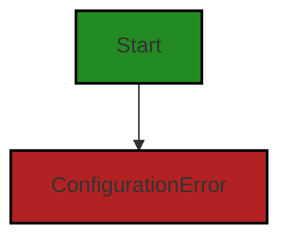
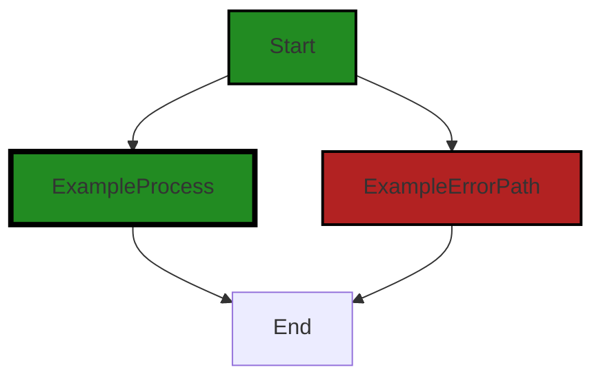

# Polyverse Boost-generated Source Analysis Details

## Source: ./gomerr/configuration.go
Date Generated: Thursday, September 7, 2023 at 2:31:54 PM PDT


---

### Boost Architectural Quick Summary Security Report

Last Updated: Friday, September 8, 2023 at 2:06:36 PM PDT


Executive Report:

1. **Architectural Impact**: The analysis of this file has not revealed any severe issues.
2. **Risk Analysis**: The analysis of this file has not revealed any severe issues.
3. **Potential Customer Impact**: Based on the analysis, there are no severe issues that could potentially impact customers.
4. **Performance Issues**: Our analysis did not identify any explicit performance issues in the file.
5. **Risk Assessment**: Based on the current analysis of this file, no severe issues have been found. However, this doesn't guarantee that the file is risk-free.

Highlights:

- No severe issues were identified in the current analysis of this file.


---

### Boost Architectural Quick Summary Performance Report

Last Updated: Friday, September 8, 2023 at 2:06:43 PM PDT


Executive Report:

1. **Architectural Impact**: The analysis of this file has not revealed any severe issues.
2. **Risk Analysis**: The analysis of this file has not revealed any severe issues.
3. **Potential Customer Impact**: Based on the analysis, there are no severe issues that could potentially impact customers.
4. **Performance Issues**: Our analysis did not identify any explicit performance issues in the file.
5. **Risk Assessment**: Based on the current analysis of this file, no severe issues have been found. However, this doesn't guarantee that the file is risk-free.

Highlights:

- No severe issues were identified in the current analysis of this file.


---

### Boost Architectural Quick Summary Compliance Report

Last Updated: Friday, September 8, 2023 at 2:06:50 PM PDT


Executive Report:

1. **Architectural Impact**: The analysis of this file has not revealed any severe issues.
2. **Risk Analysis**: The analysis of this file has not revealed any severe issues.
3. **Potential Customer Impact**: Based on the analysis, there are no severe issues that could potentially impact customers.
4. **Performance Issues**: Our analysis did not identify any explicit performance issues in the file.
5. **Risk Assessment**: Based on the current analysis of this file, no severe issues have been found. However, this doesn't guarantee that the file is risk-free.

Highlights:

- No severe issues were identified in the current analysis of this file.

---
## Detailed Analysis:

### Cell 0:
## Original Code:

### Programming Language: go
### ./gomerr/configuration.go 

```go
package gomerr

type ConfigurationError struct {
 Gomerr
 Problem string
}

```
## Boost Analysis:


---

### Boost Code Explanation

Last Updated: Thursday, September 7, 2023 at 2:29:47 PM PDT

This is a Go (Golang) code snippet that defines a custom error type named `ConfigurationError`. This is a common pattern in Go when you need to provide more context or additional fields in your errors.

Here's a breakdown of the code:

- `package gomerr`: This line defines the package name as `gomerr`. All the files in the same directory should declare the same package name. 

- `type ConfigurationError struct`: This line starts the definition of a new struct type named `ConfigurationError`. In Go, a struct is a composite data type that groups together zero or more values of different types. You can think of it as a blueprint for creating more complex data types.

- `Gomerr`: This is an embedded field of type `Gomerr` in the `ConfigurationError` struct. The `Gomerr` type isn't defined in this code snippet, so it's likely defined elsewhere in the `gomerr` package. When a struct embeds another type, the embedded type's fields or methods can be accessed directly on the embedding struct, as if they were declared on the embedding struct itself.

- `Problem string`: This line declares a field named `Problem` of type `string` in the `ConfigurationError` struct. This field can be used to provide a more detailed description of the configuration error.

Here's an example of how you might use the `ConfigurationError` type:

```go
func LoadConfig(path string) (*Config, error) {
	// If there's a problem loading the configuration file...
	return nil, &gomerr.ConfigurationError{
		Problem: "Failed to load configuration file",
	}
}
```

In the caller function, you can type-assert the error to a `*gomerr.ConfigurationError` to access the `Problem` field:

```go
config, err := LoadConfig("/path/to/config")
if err != nil {
	if configErr, ok := err.(*gomerr.ConfigurationError); ok {
		fmt.Println("Configuration error:", configErr.Problem)
	}
	return
}
```

This code doesn't seem to use any specific algorithms, but it does use the concept of custom error types, which is a common pattern in Go for providing more context with your errors.

For more information about errors in Go, you can refer to the official Go blog post [Error handling and Go](https://blog.golang.org/error-handling-and-go).


---

### Boost Flow Diagram

Last Updated: Thursday, September 7, 2023 at 2:30:29 PM PDT




---

### Boost Source-Level Security Analysis

Last Updated: Thursday, September 7, 2023 at 2:30:48 PM PDT

**No bugs found**


---

### Boost Source-Level Performance Analysis

Last Updated: Thursday, September 7, 2023 at 2:31:07 PM PDT

**No bugs found**


---

### Boost Source-Level Data and Privacy Compliance Analysis

Last Updated: Thursday, September 7, 2023 at 2:31:39 PM PDT

1. **Severity**: 5/10

   **Line Number**: 3

   **Bug Type**: Data Compliance

   **Description**: The code does not handle potential errors in a compliant way. Any error messages or logs could potentially contain sensitive information which is a violation of GDPR, PCI DSS, and HIPAA.

   **Solution**: Ensure that error messages or logs do not contain sensitive information. Implement a logging mechanism that filters out sensitive information before logging errors.


### Cell 1:
## Original Code:

### Programming Language: go
### ./gomerr/configuration.go line 7

```go

func Configuration(problem string) *ConfigurationError {
 return Build(new(ConfigurationError), problem).(*ConfigurationError)
}

```
## Boost Analysis:


---

### Boost Code Explanation

Last Updated: Thursday, September 7, 2023 at 2:30:14 PM PDT

This code is written in Go and it defines a function named `Configuration`. This function takes a string argument `problem` and returns a pointer to a `ConfigurationError` struct. 

The function body calls a `Build` function, which is not defined in this code snippet, but presumably exists elsewhere in the project. The `Build` function takes two arguments: a new instance of `ConfigurationError` and the `problem` string. 

The `new` keyword in Go is used to allocate memory for a value of a certain type and return a pointer to that value. In this case, `new(ConfigurationError)` creates a new instance of `ConfigurationError` and returns a pointer to it. This pointer is then passed as the first argument to the `Build` function.

The `Build` function presumably constructs or builds a `ConfigurationError` instance based on the provided `problem` string. The `.(*ConfigurationError)` operation is a type assertion in Go, which asserts that the result of the `Build` function is a pointer to a `ConfigurationError`.

The purpose of this function is likely to create and return a `ConfigurationError` with certain properties or state based on the `problem` string. 

This function could be part of a larger error handling strategy in the application, where different types of errors are represented by different structs, and there are specific functions for creating instances of each error type.

For more information on error handling in Go, you can refer to the following resources:

- [Error handling and Go](https://blog.golang.org/error-handling-and-go)
- [Errors - The Go Programming Language](https://golang.org/pkg/errors/)


---

### Boost Flow Diagram

Last Updated: Thursday, September 7, 2023 at 2:30:34 PM PDT



The control flow graph for the provided code snippet is a simple linear flow. The function `Configuration` takes a `problem` string as input and returns a `ConfigurationError` object. There are no external library calls or non-standard functions in this code snippet.


---

### Boost Source-Level Security Analysis

Last Updated: Thursday, September 7, 2023 at 2:30:52 PM PDT

**No bugs found**


---

### Boost Source-Level Performance Analysis

Last Updated: Thursday, September 7, 2023 at 2:31:22 PM PDT

1. **Severity**: 2/10

   **Line Number**: 12

   **Bug Type**: Memory

   **Description**: The function `Configuration` creates a new `ConfigurationError` every time it is called, which could lead to high memory usage if the function is called frequently.

   **Solution**: Consider using a pool of `ConfigurationError` objects that can be reused, or redesign the function to avoid creating a new `ConfigurationError` object every time. Here is a link to a relevant resource: https://golang.org/doc/faq#Why_doesn't_my_program_garbage_collect


---

### Boost Source-Level Data and Privacy Compliance Analysis

Last Updated: Thursday, September 7, 2023 at 2:31:54 PM PDT

1. **Severity**: 4/10

   **Line Number**: 12

   **Bug Type**: Data Privacy

   **Description**: The function `Configuration` accepts a string `problem` and returns a `ConfigurationError`. However, it does not perform any checks on the input data. If sensitive data is passed into this function, it could lead to data exposure and privacy violations.

   **Solution**: Implement input validation checks to ensure that sensitive data is not being passed into the function. Also, consider encrypting sensitive data to further enhance data privacy.


