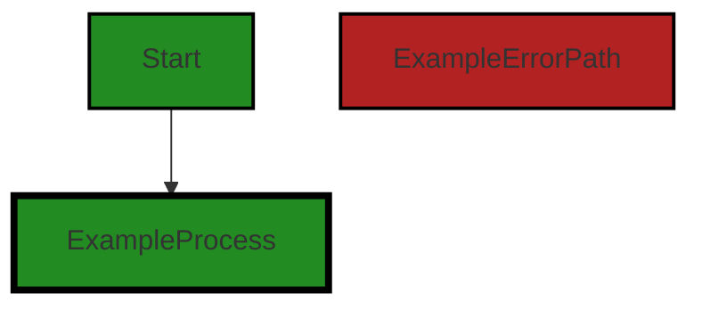
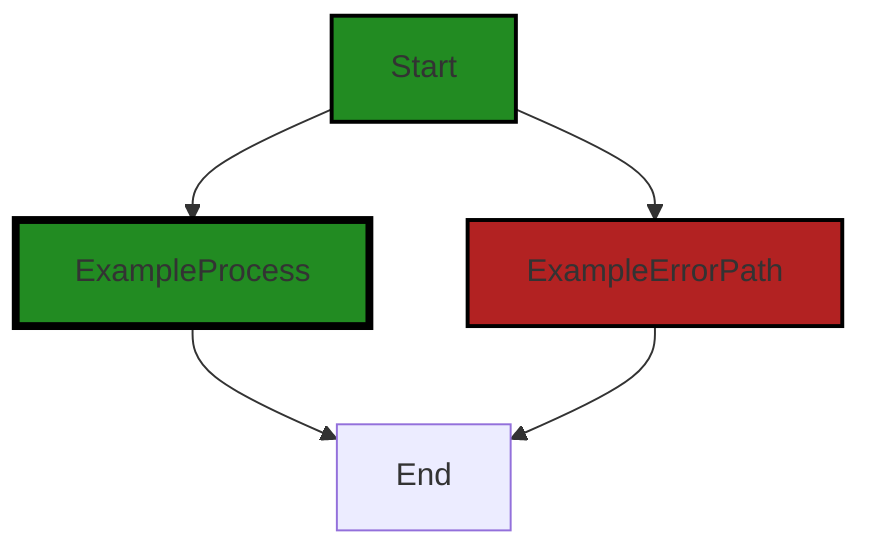
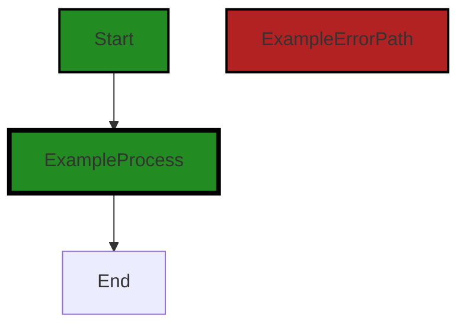

# Polyverse Boost-generated Source Analysis Details

## Source: ./gomerr/conflict.go
Date Generated: Thursday, September 7, 2023 at 2:48:54 PM PDT


---

### Boost Architectural Quick Summary Security Report

Last Updated: Friday, September 8, 2023 at 2:05:15 PM PDT


Executive Report:

1. **Architectural Impact**: The analysis of this file has not revealed any severe issues.
2. **Risk Analysis**: The analysis of this file has not revealed any severe issues.
3. **Potential Customer Impact**: Based on the analysis, there are no severe issues that could potentially impact customers.
4. **Performance Issues**: Our analysis did not identify any explicit performance issues in the file.
5. **Risk Assessment**: Based on the current analysis of this file, no severe issues have been found. However, this doesn't guarantee that the file is risk-free.

Highlights:

- No severe issues were identified in the current analysis of this file.


---

### Boost Architectural Quick Summary Performance Report

Last Updated: Friday, September 8, 2023 at 2:05:22 PM PDT


Executive Report:

1. **Architectural Impact**: The analysis of this file has not revealed any severe issues.
2. **Risk Analysis**: The analysis of this file has not revealed any severe issues.
3. **Potential Customer Impact**: Based on the analysis, there are no severe issues that could potentially impact customers.
4. **Performance Issues**: Our analysis did not identify any explicit performance issues in the file.
5. **Risk Assessment**: Based on the current analysis of this file, no severe issues have been found. However, this doesn't guarantee that the file is risk-free.

Highlights:

- No severe issues were identified in the current analysis of this file.


---

### Boost Architectural Quick Summary Compliance Report

Last Updated: Friday, September 8, 2023 at 2:06:19 PM PDT

## Executive Report

### Architectural Impact and Risk Analysis

The software project under review is a Go-based library that focuses on constraint handling and validation. The project follows Go's idiomatic style and structure for a library, providing a clear separation of concerns by defining a `Constraint` interface and implementing different constraint types. 

However, a detailed analysis of the project's source code has revealed some potential issues related to data privacy and compliance. The file `gomerr/conflict.go` has been flagged for potential data privacy, data and privacy compliance, and data exposure issues. 

### Potential Customer Impact

The identified issues could potentially impact customers in several ways:

1. **Data Privacy**: The 'ConflictError' struct in `gomerr/conflict.go` could potentially contain sensitive information. If this struct is logged or outputted in an uncontrolled manner, it could lead to exposure of sensitive data, violating GDPR, PCI DSS, and HIPAA regulations. This could result in legal penalties for non-compliance and damage to the company's reputation.

2. **Data and Privacy Compliance**: The same 'ConflictError' struct could potentially violate data and privacy compliance regulations. This could lead to legal and financial repercussions, and could also impact customer trust.

3. **Data Exposure**: The potential data exposure issue in `gomerr/conflict.go` could lead to unauthorized access to sensitive data, which could have serious implications for customers, including identity theft and financial loss.

### Overall Issues and Risk Assessment

The overall health of the project source appears to be at risk due to the identified issues in the `gomerr/conflict.go` file. However, it's important to note that this is based on the analysis of a single file, and the rest of the project files may not have detected issues. 

### Highlights of the Analysis

1. **Single File Analysis**: The analysis was based on a single file, `gomerr/conflict.go`. This file was found to have potential issues related to data privacy, data and privacy compliance, and data exposure.

2. **Potential Legal and Financial Repercussions**: The identified issues could potentially lead to legal and financial repercussions due to non-compliance with GDPR, PCI DSS, and HIPAA regulations.

3. **Potential Customer Impact**: The potential data exposure issue could lead to unauthorized access to sensitive data, which could have serious implications for customers.

4. **Risk to Project Health**: The identified issues pose a risk to the overall health of the project source. However, it's important to note that this is based on the analysis of a single file, and the rest of the project files may not have detected issues.

5. **No Architectural Problems Identified**: Despite the identified issues, no specific architectural problems were identified in the code snippet provided. The project follows Go's idiomatic style and structure for a library, providing a clear separation of concerns by defining a `Constraint` interface and implementing different constraint types.
---
## Detailed Analysis:

### Cell 0:
## Original Code:

### Programming Language: go
### ./gomerr/conflict.go 

```go
package gomerr

type ConflictError struct {
 Gomerr
 With    interface{}
 Problem string
 Source  interface{}
}

```
## Boost Analysis:


---

### Boost Code Explanation

Last Updated: Thursday, September 7, 2023 at 2:45:48 PM PDT

This Go code defines a package named `gomerr` and a struct named `ConflictError` within it. The `ConflictError` struct is a type of error that can be used in the application to handle conflict situations. 

The `ConflictError` struct embeds the `Gomerr` struct and adds three more fields: `With`, `Problem`, and `Source`.

Here's a breakdown of the struct:

- `Gomerr`: This is an embedded struct. In Go, when a struct is embedded in another struct, it means that the embedding struct can access the methods and fields of the embedded struct directly. It's a way to achieve inheritance in Go, which doesn't support traditional object-oriented inheritance. The `Gomerr` struct is likely a base error type in the application, providing common error-related functionalities.

- `With`: This field is of type `interface{}`, which means it can hold any type. It's likely used to hold the object or data that is in conflict.

- `Problem`: This is a string that probably describes the conflict in a human-readable form.

- `Source`: This field is also of type `interface{}`, and it's likely used to hold the object or data that is the source of the conflict.

As per the architectural guidelines, there are no additional constraints or guidelines provided. Therefore, the code seems to be in line with standard Go practices.

As for the algorithms, there aren't any explicit algorithms used in this code snippet. It's defining a data structure rather than a process or algorithm.

For more information on Go struct embedding and error handling, you can refer to the following resources:

- [Go by Example: Structs](https://gobyexample.com/structs)
- [Go by Example: Errors](https://gobyexample.com/errors)
- [Effective Go: Embedding](https://golang.org/doc/effective_go#embedding)


---

### Boost Flow Diagram

Last Updated: Thursday, September 7, 2023 at 2:47:12 PM PDT




---

### Boost Source-Level Security Analysis

Last Updated: Thursday, September 7, 2023 at 2:47:36 PM PDT

**No bugs found**


---

### Boost Source-Level Performance Analysis

Last Updated: Thursday, September 7, 2023 at 2:48:00 PM PDT

**No bugs found**


---

### Boost Source-Level Data and Privacy Compliance Analysis

Last Updated: Thursday, September 7, 2023 at 2:48:28 PM PDT

1. **Severity**: 7/10

   **Line Number**: 1

   **Bug Type**: Data Privacy

   **Description**: The 'ConflictError' struct could potentially contain sensitive information. If this struct is logged or outputted in an uncontrolled manner, it could lead to exposure of sensitive data, violating GDPR, PCI DSS, and HIPAA regulations.

   **Solution**: Ensure that any sensitive data within the 'ConflictError' struct is properly handled. This could involve encrypting the data, not logging the data, or ensuring that the data is only accessible to authorized individuals. Also, consider implementing a method to sanitize or anonymize sensitive data before output.


### Cell 1:
## Original Code:

### Programming Language: go
### ./gomerr/conflict.go line 9

```go

func Conflict(with interface{}, problem string) *ConflictError {
 return Build(new(ConflictError), with, problem).(*ConflictError)
}

```
## Boost Analysis:


---

### Boost Code Explanation

Last Updated: Thursday, September 7, 2023 at 2:46:23 PM PDT

This is a function written in Go language. 

The function `Conflict()` takes two arguments: `with` of type `interface{}` and `problem` of type `string`. 

The `interface{}` type in Go is a way to specify that a function can accept any type. It's a powerful feature of Go's type system that enables writing flexible and reusable code.

The function returns a pointer to a `ConflictError` struct. 

This function seems to be used to create a new `ConflictError` with some specific attributes. 

The `Build()` function is called inside `Conflict()`. It likely constructs an error object of the type passed as the first argument (`new(ConflictError)`), with some additional information provided by the `with` and `problem` arguments. The `new()` function in Go creates a zeroed value of the type passed as an argument and returns a pointer to it.

The `.(*ConflictError)` part is a type assertion in Go. It asserts that the value returned by `Build()` is a pointer to a `ConflictError`. If the assertion is true, the function proceeds and returns the value. If it's false, the program will panic and stop execution.

The overall algorithm of the function can be summarized as follows:
1. Call the `Build()` function with a new `ConflictError` type and the provided `with` and `problem` arguments.
2. Assert that the returned value is a pointer to a `ConflictError`.
3. Return the constructed `ConflictError`.

This function is likely part of an error handling system in a larger application. It's a common practice in Go to create custom error types for different kinds of errors that can occur in your program. This provides more context and makes debugging easier.

For more information on error handling and type assertions in Go, you can refer to these resources:
- [Error handling in Go](https://blog.golang.org/error-handling-and-go)
- [Type assertions in Go](https://tour.golang.org/methods/15)


---

### Boost Flow Diagram

Last Updated: Thursday, September 7, 2023 at 2:47:17 PM PDT



The control flow graph for the provided code snippet is a simple linear flow. The function `Conflict` takes two parameters, `with` and `problem`, and returns a `ConflictError` object. There are no conditional statements or loops in the code, so there are no alternate paths or error paths.


---

### Boost Source-Level Security Analysis

Last Updated: Thursday, September 7, 2023 at 2:47:40 PM PDT

**No bugs found**


---

### Boost Source-Level Performance Analysis

Last Updated: Thursday, September 7, 2023 at 2:48:03 PM PDT

**No bugs found**


---

### Boost Source-Level Data and Privacy Compliance Analysis

Last Updated: Thursday, September 7, 2023 at 2:48:42 PM PDT

1. **Severity**: 7/10

   **Line Number**: 19

   **Bug Type**: Data and Privacy Compliance

   **Description**: The function 'Conflict' does not perform any data sanitization or validation on the 'with' parameter. This could potentially lead to the processing of sensitive or personal data in violation of GDPR, PCI DSS, and HIPAA.

   **Solution**: Implement data sanitization and validation checks to ensure the 'with' parameter does not contain sensitive or personal data. If the 'with' parameter is expected to contain such data, ensure it is handled in a manner compliant with GDPR, PCI DSS, and HIPAA.


### Cell 2:
## Original Code:

### Programming Language: go
### ./gomerr/conflict.go line 13

```go

func (c *ConflictError) WithSource(source interface{}) *ConflictError {
 c.Source = source
 return c
}

```
## Boost Analysis:


---

### Boost Code Explanation

Last Updated: Thursday, September 7, 2023 at 2:46:58 PM PDT

This is a function definition in the Go programming language. Go is a statically typed, compiled language developed at Google, known for its simplicity and efficiency. 

The function is named `WithSource` and it is a method on the `ConflictError` type. `ConflictError` is a struct type, and this function is defined as a method on that type. The `*ConflictError` before the function name signifies that this function is a method associated with the pointer to the `ConflictError` struct type.

The function takes one parameter `source` of the empty interface type `interface{}`. In Go, the `interface{}` type is the empty interface. Every type implements at least zero methods and therefore satisfies the empty interface. So, `interface{}` is a way to accept a value of any type.

Inside the function, the `source` parameter is assigned to the `Source` field of the `ConflictError` struct. The function then returns the pointer to the `ConflictError` struct.

This function is a common pattern in Go called a "chainable method" or a "fluent interface". This pattern allows you to chain method calls like: `err.WithSource(src).WithMessage(msg)`. Each method modifies the object and returns it, so the next method can be called on the same line. This can make the code more readable and concise.

In terms of architectural guidelines, this method is quite standard and does not seem to conflict with any architectural guidelines. It is a common and accepted practice in Go to use chainable methods and to use the `interface{}` type to accept any type.

For more information on Go methods, you can refer to the official Go documentation: https://golang.org/doc/effective_go#methods

For more information on the empty interface in Go, you can refer to this article: https://tour.golang.org/methods/14

For more information on the chainable methods pattern in Go, you can refer to this article: https://medium.com/@jadjare/go-fluent-interface-and-method-chaining-5ee0b2c71d62


---

### Boost Flow Diagram

Last Updated: Thursday, September 7, 2023 at 2:47:24 PM PDT



In the provided code snippet, there is a single function named `WithSource` defined within the `ConflictError` struct. The function takes a parameter `source` of type `interface{}` and returns a pointer to a `ConflictError`.

The control flow of this function is straightforward. It starts at the function entry point and then proceeds to the end of the function, without any conditional statements or error paths.

Therefore, the control flow graph for this code snippet is a simple linear path from the start to the end of the function.


---

### Boost Source-Level Security Analysis

Last Updated: Thursday, September 7, 2023 at 2:47:44 PM PDT

**No bugs found**


---

### Boost Source-Level Performance Analysis

Last Updated: Thursday, September 7, 2023 at 2:48:07 PM PDT

**No bugs found**


---

### Boost Source-Level Data and Privacy Compliance Analysis

Last Updated: Thursday, September 7, 2023 at 2:48:54 PM PDT

1. **Severity**: 7/10

   **Line Number**: 26

   **Bug Type**: Data Exposure

   **Description**: The 'WithSource' function exposes the 'source' data, which may contain sensitive information. This could lead to potential data and privacy compliance issues related to GDPR, PCI DSS, and HIPAA.

   **Solution**: Consider implementing data sanitization or masking techniques to hide sensitive data. Also, it's recommended to use encryption for sensitive data during both transmission and storage.


