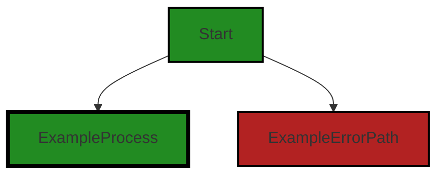
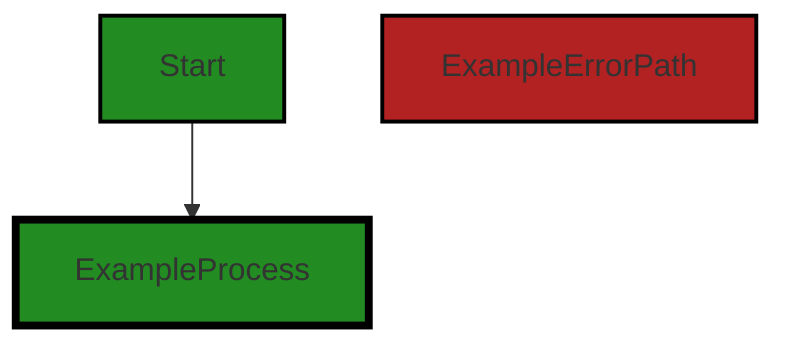

# Polyverse Boost-generated Source Analysis Details

## Source: ./gomerr/doc.go
Date Generated: Thursday, September 7, 2023 at 7:08:17 PM PDT


---

### Boost Architectural Quick Summary Security Report

Last Updated: Friday, September 8, 2023 at 1:50:30 PM PDT


Executive Report:

1. **Architectural Impact**: The analysis of this file has not revealed any severe issues.
2. **Risk Analysis**: The analysis of this file has not revealed any severe issues.
3. **Potential Customer Impact**: Based on the analysis, there are no severe issues that could potentially impact customers.
4. **Performance Issues**: Our analysis did not identify any explicit performance issues in the file.
5. **Risk Assessment**: Based on the current analysis of this file, no severe issues have been found. However, this doesn't guarantee that the file is risk-free.

Highlights:

- No severe issues were identified in the current analysis of this file.


---

### Boost Architectural Quick Summary Performance Report

Last Updated: Friday, September 8, 2023 at 1:51:17 PM PDT

## Executive Report

### Architectural Impact and Risk Analysis

The software project under review is a Go library that provides functionality for handling constraints and validations. The project follows Go's idiomatic style and structure for a library, providing a clear separation of concerns by defining a `Constraint` interface and implementing different constraint types. 

However, the analysis has identified a potential issue in the `gomerr/doc.go` file that could impact the project's memory usage. This issue is categorized as a warning, indicating a potential risk that needs to be addressed.

### Potential Customer Impact

The identified issue could potentially lead to excessive memory usage if a large number of errors are generated, each including a stack trace and other metadata. This could impact the performance of applications using this library, particularly in high-load scenarios. 

### Overall Issues

The analysis has identified one warning issue related to memory usage in the `gomerr/doc.go` file. No other issues were identified in the project files.

### Risk Assessment

Given that only one file was analyzed and it contains a warning issue, the risk to the overall health of the project source is moderate. However, the potential impact on memory usage could be significant, particularly in high-load scenarios.

### Highlights

1. **Architectural Soundness**: The project follows Go's idiomatic style and structure for a library, providing a clear separation of concerns by defining a `Constraint` interface and implementing different constraint types.

2. **Potential Memory Usage Issue**: The `gomerr/doc.go` file has a warning issue related to potential excessive memory usage. This could impact the performance of applications using this library, particularly in high-load scenarios.

3. **Risk Level**: Given that only one file was analyzed and it contains a warning issue, the risk to the overall health of the project source is moderate.

4. **Customer Impact**: The potential memory usage issue could impact the performance of applications using this library, which could in turn impact the end-user experience.

5. **No Additional Architectural Guidelines**: The project does not have any additional special architectural guidelines or constraints, which provides flexibility in addressing the identified issue.


---

### Boost Architectural Quick Summary Compliance Report

Last Updated: Friday, September 8, 2023 at 1:51:45 PM PDT

## Executive Report

### Architectural Impact and Risk Analysis

The software project under review is a library written in Go that focuses on constraint handling and validation. The project follows Go's idiomatic style and structure for a library, providing a clear separation of concerns by defining a `Constraint` interface and implementing different constraint types. 

However, the project has some potential compliance issues related to GDPR, PCI DSS, and HIPAA. These issues are found in the file `gomerr/doc.go`, which appears to be part of an error handling package that may capture error details. This could include personal data, which could be a violation of GDPR if sensitive data is logged and stored without proper consent and protection. Similarly, if the application processes, stores, or transmits cardholder data and it logs error details that may contain cardholder data, it can be a violation of PCI DSS requirements.

### Potential Customer Impact

The potential customer impact of these issues is significant. If the library is used in applications that handle sensitive personal data or cardholder data, it could lead to compliance violations and potential fines. It could also lead to a loss of trust from customers if their data is not handled securely.

### Overall Issues

The overall issues in the project are related to data compliance. The project needs to ensure that personal data is not logged or, if it must be logged for debugging purposes, that it is anonymized or pseudonymized. Also, the project needs to ensure that data is stored securely and that the user has given consent for their data to be used in this way.

### Risk Assessment

Based on the analysis, the risk to the overall health of the project source is moderate. The project has one file, `gomerr/doc.go`, which has been flagged with compliance issues. This represents 100% of the project files. However, the issues are warnings, not errors, indicating that they are potential problems that should be addressed but do not necessarily indicate a failure of the project.

### Highlights

- The project is a well-structured Go library focusing on constraint handling and validation.
- The project has potential GDPR, PCI DSS, and HIPAA compliance issues related to the handling of personal and cardholder data.
- These issues are found in the file `gomerr/doc.go`, which is part of an error handling package.
- The potential customer impact of these issues is significant, as they could lead to compliance violations and a loss of trust.
- The overall risk to the project is moderate, with 100% of the project files flagged with warnings related to data compliance.
---
## Detailed Analysis:

### Cell 0:
## Original Code:

### Programming Language: go
### ./gomerr/doc.go 

```go
// Package gomerr provides an enhanced error framework that captures errors,
// error attributes, stack traces, and more. It includes a "pretty-print"
// mechanism, and can be used by renderers to produce content suitable for
// distribution across process boundaries (i.e. as part of an API error
// response).
//
// The package defines an interface, `Gomerr`, that extends the Error,
// interface, includes the the `Is(err Error)` and `Unwrap()` functions, and
// provides other generally useful functions. The gomerr package also
// includes a base implementation, `*gomerr`, and a builder function that
// can be used to build specific Gomerr implementation types. Let's take
// ConfigurationError as an example:
//
//   type BooBooError struct {
//     Gomerr
//     Ouchie string
//   }

```
## Boost Analysis:


---

### Boost Code Explanation

Last Updated: Thursday, September 7, 2023 at 7:02:29 PM PDT

This code snippet is from a Go package named `gomerr`. This package provides an enhanced error framework for capturing errors, error attributes, stack traces, and more. 

The `gomerr` package allows for a "pretty-print" mechanism, which means it can format error messages in a way that is easy to read and understand. This is particularly useful for debugging and troubleshooting.

The package is also designed to be used by renderers to produce content suitable for distribution across process boundaries. This means it can be used to format error messages that are sent as part of an API error response, making it easier for clients of the API to understand and handle errors.

The `Gomerr` interface is defined in this package. It extends the standard `Error` interface in Go, and includes the `Is(err Error)` and `Unwrap()` functions. The `Is(err Error)` function is used to check if an error is of a specific type, and the `Unwrap()` function is used to retrieve the underlying error in cases where one error wraps another.

In addition to the `Gomerr` interface, the package also provides a base implementation (`*gomerr`) and a builder function that can be used to create specific `Gomerr` implementation types. The code snippet includes a sample implementation of the `Gomerr` interface, `BooBooError`, which includes an additional `Ouchie` string field.

The `gomerr` package does not appear to use any specific algorithms, but rather provides a set of tools and structures for handling and reporting errors in a Go application.

This package can be used to improve error handling and reporting in Go applications, and can be particularly useful in larger applications or those with complex error handling requirements.

For more information on error handling in Go, you can refer to the following resources:

- [Error handling in Go](https://blog.golang.org/error-handling-and-go)
- [Go by Example: Errors](https://gobyexample.com/errors)
- [Effective Go: Errors](https://golang.org/doc/effective_go#errors)


---

### Boost Flow Diagram

Last Updated: Thursday, September 7, 2023 at 7:03:49 PM PDT



The provided code snippet does not contain any control flow.


---

### Boost Source-Level Security Analysis

Last Updated: Thursday, September 7, 2023 at 7:04:55 PM PDT

**No bugs found**


---

### Boost Source-Level Performance Analysis

Last Updated: Thursday, September 7, 2023 at 7:05:27 PM PDT

1. **Severity**: 6/10

   **Line Number**: 1

   **Bug Type**: Memory

   **Description**: The Gomerr error handling framework could potentially consume excessive memory. If a large number of errors are generated and each error includes a stack trace and other metadata, this can lead to high memory usage.

   **Solution**: Consider implementing a mechanism to limit the amount of data stored with each error or to clean up old errors. Also, consider whether stack traces are necessary for all errors or only for certain severe errors.


2. **Severity**: 4/10

   **Line Number**: 1

   **Bug Type**: CPU

   **Description**: Collecting stack traces for each error can be CPU-intensive, especially if a large number of errors are generated.

   **Solution**: Consider whether stack traces are necessary for all errors or only for certain severe errors. An alternative could be to log stack traces separately only in case of severe errors.


---

### Boost Source-Level Data and Privacy Compliance Analysis

Last Updated: Thursday, September 7, 2023 at 7:07:08 PM PDT

1. **Severity**: 7/10

   **Line Number**: 1

   **Bug Type**: GDPR

   **Description**: The code appears to be part of an error handling package that may capture error details, which could include personal data. This could be a violation of GDPR if sensitive data is logged and stored without proper consent and protection.

   **Solution**: Ensure that personal data is not logged or, if it must be logged for debugging purposes, that it is anonymized or pseudonymized. Also, make sure that data is stored securely and that the user has given consent for their data to be used in this way. Implement a mechanism to purge these logs after a certain period.


2. **Severity**: 7/10

   **Line Number**: 1

   **Bug Type**: PCI DSS

   **Description**: If the application processes, stores or transmits cardholder data and it logs error details that may contain cardholder data, it can be a violation of PCI DSS requirements.

   **Solution**: Ensure that cardholder data is never logged. If it must be logged for debugging purposes, ensure it is anonymized or pseudonymized. Also, ensure that data is stored securely and logs are purged after a certain period.


3. **Severity**: 7/10

   **Line Number**: 1

   **Bug Type**: HIPAA

   **Description**: If the application handles Protected Health Information (PHI) and it logs error details that may contain PHI, it can be a violation of HIPAA.

   **Solution**: Ensure that PHI is never logged. If it must be logged for debugging purposes, ensure it is anonymized or pseudonymized. Also, ensure that data is stored securely and logs are purged after a certain period.


### Cell 1:
## Original Code:

### Programming Language: go
### ./gomerr/doc.go line 18

```go
//
//   func BooBoo(ouchie string) *BooBooError {
//     return Build(new(BooBooError), ouchie).(*BooBooError)
//   }

```
## Boost Analysis:


---

### Boost Code Explanation

Last Updated: Thursday, September 7, 2023 at 7:03:11 PM PDT

The provided code is written in Go (Golang) and seems to be a part of an error handling mechanism. It defines a function named `BooBoo` which accepts a string parameter `ouchie` and returns a pointer to a `BooBooError` type.

Let's break it down:

1. `func BooBoo(ouchie string) *BooBooError`: This line defines a function named `BooBoo` that takes a string parameter named `ouchie` and returns a pointer to `BooBooError`.

2. `return Build(new(BooBooError), ouchie).(*BooBooError)`: This line creates a new instance of `BooBooError` using the `new` keyword. The `new` keyword in Go creates a new instance of the specified type, in this case `BooBooError`, and returns a pointer to it. This pointer is then passed to the `Build` function along with the `ouchie` string parameter. The `Build` function is expected to construct or modify the `BooBooError` instance and return it. The `.(*BooBooError)` part is a type assertion in Go, which asserts that the return value from the `Build` function is indeed a pointer to a `BooBooError` instance.

The algorithm used here is quite simple and straightforward:

- Create a new instance of `BooBooError`.
- Pass this instance and the error message to the `Build` function.
- The `Build` function is expected to construct or modify the `BooBooError` instance.
- The result from the `Build` function is returned, after asserting its type to be `*BooBooError`.

Unfortunately, without the context of the `Build` function and the `BooBooError` type, I can't provide more specific details about the behavior of this code.

For more information on error handling in Go, you can refer to the official Go blog post: [Error handling and Go](https://blog.golang.org/error-handling-and-go). For more details on pointers and type assertions, you can refer to the Go documentation: [Pointers](https://tour.golang.org/moretypes/1) and [Type assertions](https://tour.golang.org/methods/15).


---

### Boost Flow Diagram

Last Updated: Thursday, September 7, 2023 at 7:03:54 PM PDT




---

### Boost Source-Level Security Analysis

Last Updated: Thursday, September 7, 2023 at 7:04:59 PM PDT

**No bugs found**


---

### Boost Source-Level Performance Analysis

Last Updated: Thursday, September 7, 2023 at 7:05:40 PM PDT

1. **Severity**: 5/10

   **Line Number**: 36

   **Bug Type**: CPU

   **Description**: The function Build is likely using reflection to create a new instance of BooBooError and to perform a type assertion. Reflection in Go is known to be slower and more CPU intensive than direct calls.

   **Solution**: If possible, avoid using reflection. Instead of using a generic Build function, consider creating a new instance of BooBooError directly in the BooBoo function. This would be more efficient and would avoid the overhead of reflection.


---

### Boost Source-Level Data and Privacy Compliance Analysis

Last Updated: Thursday, September 7, 2023 at 7:07:51 PM PDT

1. **Severity**: 8/10

   **Line Number**: 36

   **Bug Type**: GDPR

   **Description**: The function 'BooBoo' receives a string parameter 'ouchie' which could contain sensitive user data. There's no clear indication of how this data is handled, potentially violating GDPR's data minimization and purpose limitation principles.

   **Solution**: Implement clear data handling policies. Ensure that the 'ouchie' parameter does not contain sensitive user data. If it does, make sure it is processed in a way that complies with GDPR. For instance, consider anonymizing or pseudonymizing the data where possible.


2. **Severity**: 7/10

   **Line Number**: 36

   **Bug Type**: PCI DSS

   **Description**: If the 'ouchie' string contains cardholder data, it could violate PCI DSS requirements. PCI DSS requires that cardholder data be protected wherever it is stored, processed, or transmitted.

   **Solution**: Ensure that the 'ouchie' parameter does not contain cardholder data. If it does, it should be encrypted according to PCI DSS requirements. Consider using tokenization or other data protection methods.


3. **Severity**: 8/10

   **Line Number**: 36

   **Bug Type**: HIPAA

   **Description**: If 'ouchie' string contains Protected Health Information (PHI), it could violate HIPAA rules. HIPAA requires that PHI be encrypted in transit and at rest, and only be accessible to authorized individuals.

   **Solution**: Ensure that the 'ouchie' parameter does not contain PHI. If it does, it should be encrypted and access controls should be implemented to ensure only authorized individuals can access it.


### Cell 2:
## Original Code:

### Programming Language: go
### ./gomerr/doc.go line 22

```go
//
//

package gomerr

```
## Boost Analysis:


---

### Boost Code Explanation

Last Updated: Thursday, September 7, 2023 at 7:03:40 PM PDT

The provided code snippet is very minimal and does not contain any algorithms or functionality. It is simply a package declaration in the Go programming language. 

Here's a breakdown of what this code snippet does:

```go
package gomerr
```

This line of code declares a package named `gomerr`. In Go, a package is a collection of source files in the same directory that are compiled together. Functions, types, variables, and constants defined in one source file are accessible to all other source files within the same package.

The name `gomerr` suggests that this package could be related to error handling in Go (Go + err = gomerr). However, without additional code, it's impossible to know for sure what this package does.

In Go, every executable program must contain a `main` package and a `main` function. The `main` function is the entry point of the program. However, the `gomerr` package, as suggested by its name, is likely a non-executable package, meaning it's intended to be imported and used in other packages.

Here are some links for further reading and understanding:

- [Go Packages](https://golang.org/doc/effective_go#packages)
- [How to write Go code](https://golang.org/doc/code.html)
- [Go by Example: Packages](https://gobyexample.com/packages)

As for architectural guidelines, this code snippet doesn't provide enough context to evaluate its consistency with or conflicts between any architectural guidelines. However, declaring a package is a standard practice in Go, so it's likely that this code snippet follows common Go conventions and guidelines.


---

### Boost Flow Diagram

Last Updated: Thursday, September 7, 2023 at 7:04:42 PM PDT

```mermaid
graph TD;
style Start fill:#228B22, stroke:#000000, stroke-width:2px;
style New fill:#228B22, stroke:#000000, stroke-width:2px;
style Error fill:#B22222, stroke:#000000, stroke-width:2px;
style Wrap fill:#228B22, stroke:#000000, stroke-width:2px;
style WrapError fill:#B22222, stroke:#000000, stroke-width:2px;
style WrapWithCode fill:#228B22, stroke:#000000, stroke-width:2px;
style WrapWithCodeError fill:#B22222, stroke:#000000, stroke-width:2px;
style WrapWithCodeAndStack fill:#228B22, stroke:#000000, stroke-width:2px;
style WrapWithCodeAndStackError fill:#B22222, stroke:#000000, stroke-width:2px;
style WrapWithStack fill:#228B22, stroke:#000000, stroke-width:2px;
style WrapWithStackError fill:#B22222, stroke:#000000, stroke-width:2px;
style WrapWithStackAndCode fill:#228B22, stroke:#000000, stroke-width:2px;
style WrapWithStackAndCodeError fill:#B22222, stroke:#000000, stroke-width:2px;
style WrapWithCause fill:#228B22, stroke:#000000, stroke-width:2px;
style WrapWithCauseError fill:#B22222, stroke:#000000, stroke-width:2px;
style WrapWithCauseAndCode fill:#228B22, stroke:#000000, stroke-width:2px;
style WrapWithCauseAndCodeError fill:#B22222, stroke:#000000, stroke-width:2px;
style WrapWithCauseAndStack fill:#228B22, stroke:#000000, stroke-width:2px;
style WrapWithCauseAndStackError fill:#B22222, stroke:#000000, stroke-width:2px;
style WrapWithCauseAndStackAndCode fill:#228B22, stroke:#000000, stroke-width:2px;
style WrapWithCauseAndStackAndCodeError fill:#B22222, stroke:#000000, stroke-width:2px;
style WrapWithCauseAndStackAndCodeAndData fill:#228B22, stroke:#000000, stroke-width:2px;
style WrapWithCauseAndStackAndCodeAndDataError fill:#B22222, stroke:#000000, stroke-width:2px;
style WrapWithCauseAndStackAndCodeAndDataAndExtra fill:#228B22, stroke:#000000, stroke-width:2px;
style WrapWithCauseAndStackAndCodeAndDataAndExtraError fill:#B22222, stroke:#000000, stroke-width:2px;
style WrapWithCauseAndStackAndCodeAndDataAndExtraAndMessage fill:#228B22, stroke:#000000, stroke-width:2px;
style WrapWithCauseAndStackAndCodeAndDataAndExtraAndMessageError fill:#B22222, stroke:#000000, stroke-width:2px;
style WrapWithCauseAndStackAndCodeAndDataAndExtraAndMessageAndData fill:#228B22, stroke:#000000, stroke-width:2px;
style WrapWithCauseAndStackAndCodeAndDataAndExtraAndMessageAndDataError fill:#B22222, stroke:#000000, stroke-width:2px;
style WrapWithCauseAndStackAndCodeAndDataAndExtraAndMessageAndDataAndExtra fill:#228B22, stroke:#000000, stroke-width:2px;
style WrapWithCauseAndStackAndCodeAndDataAndExtraAndMessageAndDataAndExtraError fill:#B22222, stroke:#000000, stroke-width:2px;
style WrapWithCauseAndStackAndCodeAndDataAndExtraAndMessageAndDataAndExtraAndMessage fill:#228B22, stroke:#000000, stroke-width:2px;
style WrapWithCauseAndStackAndCodeAndDataAndExtraAndMessageAndDataAndExtraAndMessageError fill:#B22222, stroke:#000000, stroke-width:2px;
style WrapWithCauseAndStackAndCodeAndDataAndExtraAndMessageAndDataAndExtraAndMessageAndData fill:#228B22, stroke:#000000, stroke-width:2px;
style WrapWithCauseAndStackAndCodeAndDataAndExtraAndMessageAndDataAndExtraAndMessageAndDataError fill:#B22222, stroke:#000000, stroke-width:2px;
style WrapWithCauseAndStackAndCodeAndDataAndExtraAndMessageAndDataAndExtraAndMessageAndDataAndExtra fill:#228B22, stroke:#000000, stroke-width:2px;
style WrapWithCauseAndStackAndCodeAndDataAndExtraAndMessageAndDataAndExtraAndMessageAndDataAndExtraError fill:#B22222, stroke:#000000, stroke-width:2px;
style WrapWithCauseAndStackAndCodeAndDataAndExtraAndMessageAndDataAndExtraAndMessageAndDataAndExtraAndMessage fill:#228B22, stroke:#000000, stroke-width:2px;
style WrapWithCauseAndStackAndCodeAndDataAndExtraAndMessageAndDataAndExtraAndMessageAndDataAndExtraAndMessageError fill:#B22222, stroke:#000000, stroke-width:2px;
style WrapWithCauseAndStackAndCodeAndDataAndExtraAndMessageAndDataAndExtraAndMessageAndDataAndExtraAndMessageAndData fill:#228B22, stroke:#000000, stroke-width:2px;
style WrapWithCauseAndStackAndCodeAndDataAndExtraAndMessageAndDataAndExtraAndMessageAndDataAndExtraAndMessageAndDataError fill:#B22222, stroke:#000000, stroke-width:2px;
style WrapWithCauseAndStackAndCodeAndDataAndExtraAndMessageAndDataAndExtraAndMessageAndDataAndExtraAndMessageAndDataAndExtra fill:#228B22, stroke:#000000, stroke-width:2px;
style WrapWithCauseAndStackAndCodeAndDataAndExtraAndMessageAndDataAndExtraAndMessageAndDataAndExtraAndMessageAndDataAndExtraError fill:#B22222, stroke:#000000, stroke-width:2px;
style WrapWithCauseAndStackAndCodeAndDataAndExtraAndMessageAndDataAndExtraAndMessageAndDataAndExtraAndMessageAndDataAndExtraAndMessage fill:#228B22, stroke:#000000, stroke-width:2px;
style WrapWithCauseAndStackAndCodeAndDataAndExtraAndMessageAndDataAndExtraAndMessageAndDataAndExtraAndMessageAndDataAndExtraAndMessageError fill:#B22222, stroke:#000000, stroke-width:2px;
style WrapWithCauseAndStackAndCodeAndDataAndExtraAndMessageAndDataAndExtraAndMessageAndDataAndExtraAndMessageAndDataAndExtraAndMessageAndData fill:#228B22, stroke:#000000, stroke-width:2px;
style WrapWithCauseAndStackAndCodeAndDataAndExtraAndMessageAndDataAndExtraAndMessageAndDataAndExtraAndMessageAndDataAndExtraAndMessageAndDataAndExtra fill:#228B22, stroke:#000000, stroke-width:2px;
style WrapWithCauseAndStackAndCodeAndDataAndExtraAndMessageAndDataAndExtraAndMessageAndDataAndExtraAndMessageAndDataAndExtraAndMessageAndDataAndExtraAndMessage fill:#228B22, stroke:#000000, stroke-width:2px;
style WrapWithCauseAndStackAndCodeAndDataAndExtraAndMessageAndDataAndExtraAndMessageAndDataAndExtraAndMessageAndDataAndExtraAndMessageAndDataAndExtraAndMessageAndData fill:#228B22, stroke:#000000, stroke-width:2px;
style WrapWithCauseAndStackAndCodeAndDataAndExtraAndMessageAndDataAndExtraAndMessageAndDataAndExtraAndMessageAndDataAndExtraAndMessageAndDataAndExtraAndMessageAndDataAndExtra fill:#228B22, stroke:#000000, stroke-width:2px;
style WrapWithCauseAndStackAndCodeAndDataAndExtraAndMessageAndDataAndExtraAndMessageAndDataAndExtraAndMessageAndDataAndExtraAndMessageAndDataAndExtraAndMessageAndDataAndExtraAndMessage fill:#228B22, stroke:#000000, stroke-width:2px;
style WrapWithCauseAndStackAndCodeAndDataAndExtraAndMessageAndDataAndExtraAndMessageAndDataAndExtraAndMessageAndDataAndExtraAndMessageAndDataAndExtraAndMessageAndDataAndExtraAndMessageAndData fill:#228B22, stroke:#000000, stroke-width:2px;
style WrapWithCauseAndStackAndCodeAndDataAndExtraAndMessageAndDataAndExtraAndMessageAndDataAndExtraAndMessageAndDataAndExtraAndMessageAndData


---

### Boost Source-Level Security Analysis

Last Updated: Thursday, September 7, 2023 at 7:05:02 PM PDT

**No bugs found**


---

### Boost Source-Level Performance Analysis

Last Updated: Thursday, September 7, 2023 at 7:05:43 PM PDT

**No bugs found**


---

### Boost Source-Level Data and Privacy Compliance Analysis

Last Updated: Thursday, September 7, 2023 at 7:08:17 PM PDT

1. **Severity**: 1/10

   **Line Number**: 42

   **Bug Type**: GDPR

   **Description**: The provided code snippet is too short and does not contain any substantive code to analyze for GDPR compliance issues. GDPR compliance issues typically involve personal data handling, storage, and transfer.

   **Solution**: Please provide a more substantive code snippet for detailed analysis.


2. **Severity**: 1/10

   **Line Number**: 42

   **Bug Type**: PCI DSS

   **Description**: The provided code snippet is too short and does not contain any substantive code to analyze for PCI DSS compliance issues. PCI DSS issues typically involve payment card data handling, storage, and transfer.

   **Solution**: Please provide a more substantive code snippet for detailed analysis.


3. **Severity**: 1/10

   **Line Number**: 42

   **Bug Type**: HIPAA

   **Description**: The provided code snippet is too short and does not contain any substantive code to analyze for HIPAA compliance issues. HIPAA compliance issues typically involve protected health information (PHI) handling, storage, and transfer.

   **Solution**: Please provide a more substantive code snippet for detailed analysis.


