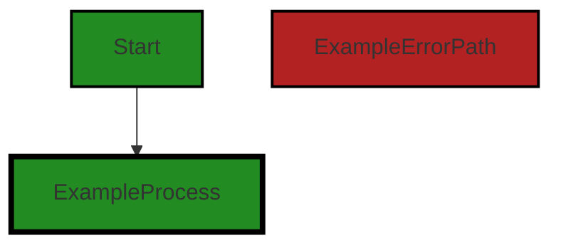
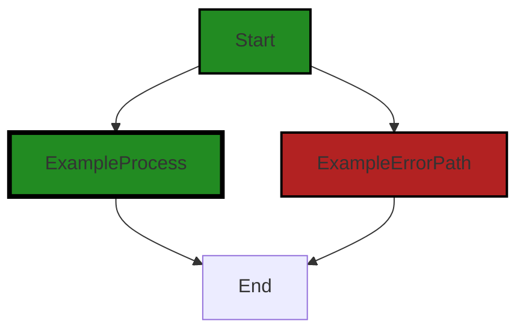
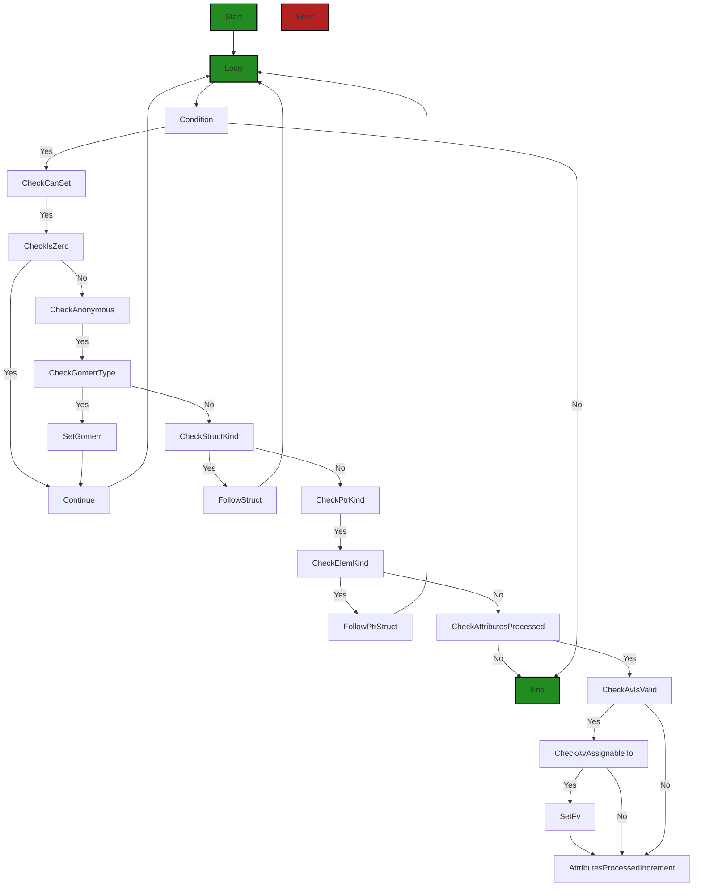
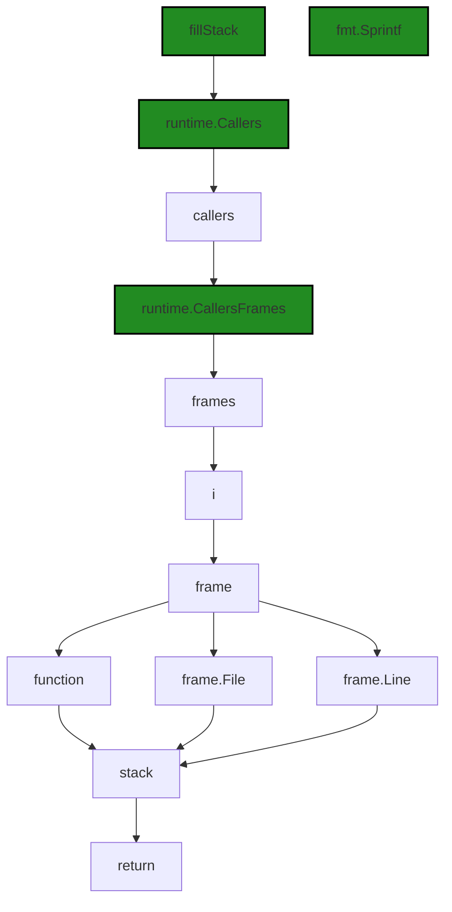
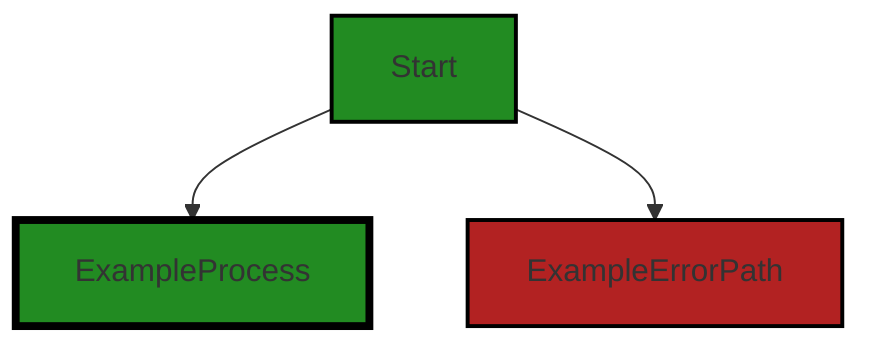
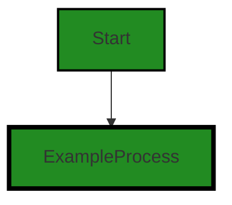
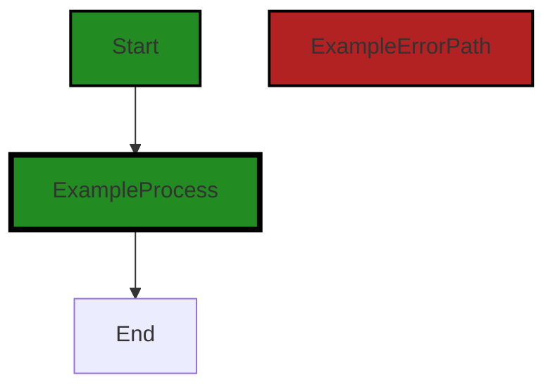
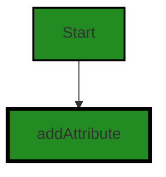
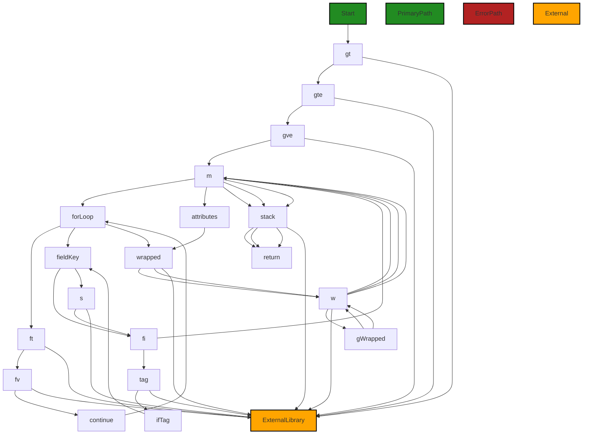

# Polyverse Boost-generated Source Analysis Details

## Source: ./gomerr/gomerr.go
Date Generated: Wednesday, September 6, 2023 at 9:18:04 PM PDT


---

### Boost Architectural Quick Summary Security Report

Last Updated: Friday, September 8, 2023 at 2:10:44 PM PDT


Executive Report:

1. **Architectural Impact**: The analysis of this file has not revealed any severe issues.
2. **Risk Analysis**: The analysis of this file has not revealed any severe issues.
3. **Potential Customer Impact**: Based on the analysis, there are no severe issues that could potentially impact customers.
4. **Performance Issues**: Our analysis did not identify any explicit performance issues in the file.
5. **Risk Assessment**: Based on the current analysis of this file, no severe issues have been found. However, this doesn't guarantee that the file is risk-free.

Highlights:

- No severe issues were identified in the current analysis of this file.


---

### Boost Architectural Quick Summary Performance Report

Last Updated: Friday, September 8, 2023 at 2:11:40 PM PDT

## Executive Report

### Architectural Impact and Risk Analysis

The software project under review is a Go library that provides functionality for handling constraints and validations. The project follows Go's idiomatic style and structure for a library, providing a clear separation of concerns by defining a `Constraint` interface and implementing different constraint types.

However, the analysis has identified several high-severity issues related to CPU usage in the `gomerr/gomerr.go` file. These issues are primarily due to the extensive use of reflection, which can be CPU-intensive and slower than direct access, especially for large data structures.

### Potential Customer Impact

The identified issues could potentially impact the performance of the software, leading to slower response times and increased CPU usage. This could negatively affect the user experience, particularly for customers with large data sets.

### Overall Issues

The `gomerr/gomerr.go` file is the only file in the project and it contains all the identified issues. This suggests that the issues are concentrated in this file and addressing them could significantly improve the overall health of the project.

### Risk Assessment

Given that all the identified issues are in the `gomerr/gomerr.go` file, the risk to the overall health of the project is high. However, since the project consists of only one file, addressing these issues should be manageable.

### Highlights

1. **High CPU Usage:** The `gomerr/gomerr.go` file has several high-severity issues related to CPU usage due to the extensive use of reflection. This could lead to performance issues, particularly for large data structures.

2. **Potential Impact on User Experience:** The performance issues could lead to slower response times and increased CPU usage, negatively affecting the user experience.

3. **Concentration of Issues:** All the identified issues are in the `gomerr/gomerr.go` file. Addressing these issues could significantly improve the overall health of the project.

4. **Risk to Project Health:** Given that all the identified issues are in the `gomerr/gomerr.go` file, the risk to the overall health of the project is high. However, since the project consists of only one file, addressing these issues should be manageable.

5. **Consistency with Architectural Guidelines:** The project follows Go's idiomatic style and structure for a library, providing a clear separation of concerns by defining a `Constraint` interface and implementing different constraint types. This is consistent with the architectural guidelines provided.


---

### Boost Architectural Quick Summary Compliance Report

Last Updated: Friday, September 8, 2023 at 2:12:31 PM PDT

## Executive Report

### Architectural Impact and Risk Analysis

The software project under review is a library written in Go that focuses on constraint handling and validation. It defines a `Constraint` interface and provides implementations for various constraint types. The code follows Go's idiomatic style and structure for a library.

However, the analysis has identified several high-severity issues related to data compliance, privacy, and security. These issues are primarily located in the `gomerr/gomerr.go` file. The issues identified could potentially lead to violations of data protection regulations such as GDPR, PCI DSS, and HIPAA if not addressed.

### Potential Customer Impact

The identified issues could have a significant impact on customers, particularly those in regulated industries or jurisdictions. Non-compliance with data protection regulations can lead to fines, reputational damage, and loss of customer trust.

### Overall Issues

The analysis identified a total of 22 issues across various categories, with the majority being warnings and a few being errors. All issues were found in the `gomerr/gomerr.go` file.

### Risk Assessment

Given that all issues were found in a single file, the overall health of the project source could be considered moderate. However, the severity of the issues identified, particularly those related to HIPAA, GDPR, and PCI DSS compliance, suggests a high risk level.

### Highlights

1. **Data Compliance and Privacy Issues**: The `gomerr/gomerr.go` file has several data compliance and privacy issues. These issues could potentially lead to violations of GDPR and PCI DSS regulations if sensitive data is involved. 

2. **HIPAA Compliance Issues**: There are several HIPAA compliance issues identified in the `gomerr/gomerr.go` file. These issues could potentially lead to violations of HIPAA regulations, which require that PHI be securely stored and transmitted.

3. **Data Exposure Risk**: The function `build` in the `gomerr/gomerr.go` file is directly assigning values to struct fields using reflection, which can lead to inadvertent exposure of sensitive data.

4. **Risk Level**: Given the severity of the issues identified, particularly those related to HIPAA, GDPR, and PCI DSS compliance, the risk level of the project is considered high.

5. **Potential Customer Impact**: The identified issues could have a significant impact on customers, particularly those in regulated industries or jurisdictions. Non-compliance with data protection regulations can lead to fines, reputational damage, and loss of customer trust.
---
## Detailed Analysis:

### Cell 0:
## Original Code:

### Programming Language: go
### ./gomerr/gomerr.go 

```go
package gomerr

import (
 "encoding/json"
 "fmt"
 "reflect"
 "runtime"
 "strings"
 "unicode"
)

type Gomerr interface {
 error
 Unwrap() error
 Is(err error) bool

 Wrap(err error) Gomerr
 AddAttribute(key string, value interface{}) Gomerr
 ReplaceAttribute(key string, value interface{}) Gomerr
 AddAttributes(keysAndValues ...interface{}) Gomerr
 WithAttributes(attributes map[string]interface{}) Gomerr

 Attribute(key string) (value interface{})
 AttributeLookup(key string) (value interface{}, ok bool)
 Attributes() map[string]interface{}
 String() string
 ToMap() map[string]interface{}

 // Ensures that Gomerrs behave as expected
 isFromBuildFunc() bool
}

```
## Boost Analysis:


---

### Boost Code Explanation

Last Updated: Wednesday, September 6, 2023 at 8:44:54 PM PDT

The provided code is a Go package named `gomerr`. This package defines an interface called `Gomerr` which is a custom error handling interface. It extends Go's built-in `error` interface and provides additional methods for error wrapping and attribute management.

Here is a breakdown of the methods in the `Gomerr` interface:

- `Unwrap() error`: This method is used to retrieve the next error in error chain when errors are wrapped.

- `Is(err error) bool`: This method checks if the current error is equivalent to the provided error.

- `Wrap(err error) Gomerr`: This method is used to create a new error that wraps the original error, with an optional message.

- `AddAttribute(key string, value interface{}) Gomerr`: This method adds a new attribute to the error. If the key already exists, the value is appended to the existing values.

- `ReplaceAttribute(key string, value interface{}) Gomerr`: This method replaces an existing attribute with a new value. If the key doesn't exist, it is added.

- `AddAttributes(keysAndValues ...interface{}) Gomerr`: This method adds multiple attributes to the error.

- `WithAttributes(attributes map[string]interface{}) Gomerr`: This method replaces all existing attributes with the provided map.

- `Attribute(key string) (value interface{})`: This method retrieves the value of an attribute.

- `AttributeLookup(key string) (value interface{}, ok bool)`: This method retrieves the value of an attribute and a boolean indicating if the attribute was found.

- `Attributes() map[string]interface{}`: This method retrieves all attributes of the error.

- `String() string`: This method returns the string representation of the error.

- `ToMap() map[string]interface{}`: This method returns a map representation of the error.

- `isFromBuildFunc() bool`: This method is used to ensure that Gomerrs behave as expected. It's likely used internally in the package.

The `gomerr` package seems to provide a comprehensive and flexible way to handle errors in Go. It allows for error wrapping, which is a common pattern in Go to provide more context about an error. It also provides extensive support for adding, replacing, and retrieving attributes associated with an error, which can be very useful for debugging and logging purposes.

For more information on error handling in Go, you can refer to the following resources:

- [Error handling in Go](https://blog.golang.org/error-handling-and-go)
- [Working with Errors in Go 1.13](https://go.dev/blog/go1.13-errors)


---

### Boost Flow Diagram

Last Updated: Wednesday, September 6, 2023 at 9:00:23 PM PDT




---

### Boost Source-Level Security Analysis

Last Updated: Wednesday, September 6, 2023 at 9:03:58 PM PDT

**No bugs found**


---

### Boost Source-Level Performance Analysis

Last Updated: Wednesday, September 6, 2023 at 9:06:51 PM PDT

1. **Severity**: 7/10

   **Line Number**: 31

   **Bug Type**: Memory

   **Description**: The method 'ToMap' returns a map which is a reference type in Go. This could lead to unintended side effects if the caller modifies the returned map, as it would affect the original map stored in the Gomerr struct. This could potentially lead to high memory usage if the map is large and is modified frequently.

   **Solution**: Instead of returning the map directly, return a deep copy of the map. This ensures that modifications to the returned map do not affect the original map. You can use libraries like 'github.com/mohae/deepcopy' for deep copying in Go.


2. **Severity**: 5/10

   **Line Number**: 16

   **Bug Type**: CPU

   **Description**: The 'Wrap' method wraps the error which could lead to a chain of errors if used in a loop or recursive function. This could lead to a stack overflow error, causing high CPU usage and potentially crashing the program.

   **Solution**: Avoid using 'Wrap' in a loop or recursive function. If you need to wrap multiple errors, consider using a multi-error pattern or an error aggregation library like 'github.com/hashicorp/go-multierror'.


---

### Boost Source-Level Data and Privacy Compliance Analysis

Last Updated: Wednesday, September 6, 2023 at 9:12:31 PM PDT

1. **Severity**: 5/10

   **Line Number**: 1

   **Bug Type**: Data Privacy

   **Description**: The Gomerr interface allows for the addition and replacement of arbitrary attributes to an error. If sensitive data (e.g., personally identifiable information, credit card data, or health information) is added as an attribute, it could be exposed when the error is logged or displayed, violating GDPR, PCI DSS, and HIPAA regulations.

   **Solution**: Implement a whitelist of allowed attribute keys to prevent sensitive data from being added to errors. Alternatively, implement a mechanism to sanitize or obfuscate sensitive data before it is added to an error.


### Cell 1:
## Original Code:

### Programming Language: go
### ./gomerr/gomerr.go line 32

```go

var gomerrType = reflect.TypeOf((*Gomerr)(nil)).Elem()

func Build(g Gomerr, attributes ...interface{}) Gomerr {
 build(reflect.ValueOf(g).Elem(), attributes, newGomerr(4, g))

 return g
}

```
## Boost Analysis:


---

### Boost Code Explanation

Last Updated: Wednesday, September 6, 2023 at 8:45:49 PM PDT

This code is written in Go and it is part of an error handling library. The library appears to be designed to provide a more structured approach to error handling in Go, which is a common practice in larger Go applications. 

Let's break down the code:

```go
var gomerrType = reflect.TypeOf((*Gomerr)(nil)).Elem()
```
This line is declaring a global variable `gomerrType` that holds the type of `Gomerr` (which seems to be an interface or a struct for error handling in this context). It's using the `reflect.TypeOf` function to get the type of `Gomerr`. Here, `(*Gomerr)(nil)` creates a nil pointer to a `Gomerr` and `reflect.TypeOf` gets the type of that nil pointer. The `.Elem()` method is then used to get the actual type that the pointer points to (which is `Gomerr`).

```go
func Build(g Gomerr, attributes ...interface{}) Gomerr {
	build(reflect.ValueOf(g).Elem(), attributes, newGomerr(4, g))

	return g
}
```
This function is named `Build` and it takes two parameters: `g` of type `Gomerr` and `attributes` which is a variadic parameter of type `interface{}`. A variadic parameter means that this function can accept any number of `attributes` parameters. The `interface{}` type means that `attributes` can be of any type.

Inside the function, it calls another function `build` with three arguments: `reflect.ValueOf(g).Elem()`, `attributes`, and `newGomerr(4, g)`. 

`reflect.ValueOf(g).Elem()` gets the value that the `Gomerr` interface `g` points to.

`newGomerr(4, g)` seems to be a function that creates a new `Gomerr` instance. The purpose and meaning of the arguments `4` and `g` are not clear from this snippet.

After the `build` function call, it returns `g` which is the `Gomerr` that was passed in as a parameter.

The `build` function and `newGomerr` function are not defined in this code snippet, so we can't provide details on what they do.

The algorithm used in this code is pretty straightforward. It's using the Go `reflect` package to handle types and values at runtime. The main purpose of this code seems to be to build a `Gomerr` instance with certain `attributes`.

For more information about reflection in Go, you can refer to the following resources:

- [The Laws of Reflection](https://blog.golang.org/laws-of-reflection)
- [Go by Example: Reflection](https://gobyexample.com/reflection)


---

### Boost Flow Diagram

Last Updated: Wednesday, September 6, 2023 at 9:00:33 PM PDT



The control flow graph for the provided code snippet is a simple linear flow. The code starts at the "Start" node and then flows to the "ExampleProcess" node. From there, it can either continue to the "End" node, representing the successful execution path, or it can flow to the "ExampleErrorPath" node, representing the error path. Both the "ExampleProcess" and "ExampleErrorPath" nodes flow to the "End" node, indicating the end of the code execution.


---

### Boost Source-Level Security Analysis

Last Updated: Wednesday, September 6, 2023 at 9:04:02 PM PDT

**No bugs found**


---

### Boost Source-Level Performance Analysis

Last Updated: Wednesday, September 6, 2023 at 9:07:05 PM PDT

1. **Severity**: 7/10

   **Line Number**: 66

   **Bug Type**: CPU

   **Description**: The use of reflection in the Build function can be CPU-intensive, particularly for large data structures. Reflection is generally slower than direct access because it involves type checking and function dispatching at runtime.

   **Solution**: Consider using direct access if the types are known at compile time. If the types are not known, consider using interfaces. Here is a useful resource on reflection in Go: https://blog.golang.org/laws-of-reflection


---

### Boost Source-Level Data and Privacy Compliance Analysis

Last Updated: Wednesday, September 6, 2023 at 9:12:35 PM PDT

**No bugs found**


### Cell 2:
## Original Code:

### Programming Language: go
### ./gomerr/gomerr.go line 40

```go

func build(v reflect.Value, attributes []interface{}, gomerr *gomerr) (attributesProcessed int) {
 attributesProcessed = 0
 attributesLength := len(attributes)
 for i := 0; i < v.NumField(); i++ {
  fv := v.Field(i)

  if !fv.CanSet() || !fv.IsZero() {
   continue
  }

  if v.Type().Field(i).Anonymous {
   if gomerrType.AssignableTo(fv.Type()) {
    fv.Set(reflect.ValueOf(gomerr))
    continue
   }

   // follow anonymous structs or pointers to structs
   if fv.Type().Kind() == reflect.Struct {
    attributesProcessed += build(fv, attributes[attributesProcessed:], gomerr)
   } else if fv.Type().Kind() == reflect.Ptr && fv.Type().Elem().Kind() == reflect.Struct {
    attributesProcessed += build(fv.Elem(), attributes[attributesProcessed:], gomerr)
   }
  }

  if attributesProcessed < attributesLength {
   av := reflect.ValueOf(attributes[attributesProcessed])
   if av.IsValid() && av.Type().AssignableTo(fv.Type()) {
    fv.Set(av)
   }
   attributesProcessed++
  }
 }

 return
}

```
## Boost Analysis:


---

### Boost Code Explanation

Last Updated: Wednesday, September 6, 2023 at 8:46:10 PM PDT

This function, `build`, uses the reflection package in Go to dynamically set values of fields in a struct. Reflection in Go provides a way to examine the type and value of variables at runtime, and can also be used to manipulate these values.

Here's a detailed breakdown of the code:

1. The function takes three parameters: `v` of type `reflect.Value` which is the struct to be processed, `attributes` which is a slice of `interface{}` and represents the values to be assigned to the fields of the struct, and `gomerr` which is a pointer to a `gomerr` object (presumably a custom error type in this codebase).

2. It initializes `attributesProcessed` to 0 and `attributesLength` to the length of the `attributes` slice. These variables keep track of how many attributes have been processed and how many there are in total.

3. The function then enters a loop, iterating over each field `i` in the struct `v`.

4. It checks if the field `fv` can be set and if it is zero-valued. If either condition is false, it skips to the next iteration.

5. If the field is anonymous (embedded), it checks if the `gomerrType` is assignable to the field type. If so, it sets the field value to `gomerr` and continues to the next iteration.

6. If the field is a struct or a pointer to a struct, it recursively calls `build` on the field value, passing the remaining unprocessed attributes and `gomerr`. The number of attributes processed in the recursive call is added to `attributesProcessed`.

7. If there are still unprocessed attributes, it checks if the next attribute is valid and assignable to the current field type. If so, it sets the field value to the attribute value and increments `attributesProcessed`.

8. The function finally returns the total number of attributes processed.

In terms of architectural guidelines, this function seems to be in line with Go's best practices. It uses reflection responsibly to provide a flexible way to populate struct fields, and it handles potential errors by checking field and attribute validity before assignment. It also respects the immutability of fields that cannot be set or are not zero-valued.

For more information on reflection in Go, you can refer to the following resources:

- [The Laws of Reflection](https://blog.golang.org/laws-of-reflection)
- [Go by Example: Reflection](https://gobyexample.com/reflection)


---

### Boost Flow Diagram

Last Updated: Wednesday, September 6, 2023 at 9:00:47 PM PDT




---

### Boost Source-Level Security Analysis

Last Updated: Wednesday, September 6, 2023 at 9:04:05 PM PDT

**No bugs found**


---

### Boost Source-Level Performance Analysis

Last Updated: Wednesday, September 6, 2023 at 9:07:37 PM PDT

1. **Severity**: 7/10

   **Line Number**: 78

   **Bug Type**: CPU

   **Description**: The function uses reflection extensively, which is slower than direct access. This might lead to CPU performance issues.

   **Solution**: If the types are known at compile time, use them directly. If the types are not known, consider using interfaces.


2. **Severity**: 5/10

   **Line Number**: 90

   **Bug Type**: Memory

   **Description**: The function makes recursive calls, which can lead to stack overflow for deep recursion and consume more memory.

   **Solution**: Consider using an iterative approach with explicit stack if the depth of recursion is expected to be large.


3. **Severity**: 6/10

   **Line Number**: 98

   **Bug Type**: CPU

   **Description**: The function uses reflection to check if a value is assignable to a type, which can be slow.

   **Solution**: If the types are known at compile time, use them directly. If the types are not known, consider using interfaces.


4. **Severity**: 5/10

   **Line Number**: 98

   **Bug Type**: Memory

   **Description**: The function creates a new reflect.Value for each attribute, which can consume more memory if the number of attributes is large.

   **Solution**: Consider reusing reflect.Value if possible.


---

### Boost Source-Level Data and Privacy Compliance Analysis

Last Updated: Wednesday, September 6, 2023 at 9:12:55 PM PDT

1. **Severity**: 7/10

   **Line Number**: 82

   **Bug Type**: Data Compliance

   **Description**: The function build is directly assigning values to struct fields using reflection, which can lead to inadvertent exposure of sensitive data.

   **Solution**: Consider using a data mapping layer or a Data Transfer Object (DTO) to handle data assignments. This can help prevent sensitive data from being exposed unintentionally.


2. **Severity**: 8/10

   **Line Number**: 92

   **Bug Type**: Data Privacy

   **Description**: The function is assigning values to struct fields without any validation. This could potentially lead to the violation of GDPR, PCI DSS, and HIPAA compliance if sensitive data is involved.

   **Solution**: Implement data validation checks before assigning values to struct fields. If sensitive data is involved, ensure it is handled in accordance with GDPR, PCI DSS, and HIPAA regulations.


### Cell 3:
## Original Code:

### Programming Language: go
### ./gomerr/gomerr.go line 76

```go

type gomerr struct {
 self       Gomerr
 wrapped    error
 attributes map[string]interface{}
 stack      []string
}

```
## Boost Analysis:


---

### Boost Code Explanation

Last Updated: Wednesday, September 6, 2023 at 8:46:51 PM PDT

The provided code is written in Go, which is a statically typed, compiled language developed at Google. This specific piece of code is defining a new data structure or type called `gomerr`. This type is a struct, which is a collection of fields, and is a way to group together data of different types.

Here's a breakdown of the code:

```go
type gomerr struct {
	self       Gomerr
	wrapped    error
	attributes map[string]interface{}
	stack      []string
}
```

- `type gomerr struct`: This line is defining a new struct type named `gomerr`.
- `self Gomerr`: This field is of type `Gomerr`. `Gomerr` is likely another struct or interface defined elsewhere in the codebase. The purpose of this field is not immediately clear from the code snippet provided, but it might be used to reference the current instance of `gomerr`.
- `wrapped error`: This field is of type `error`, a built-in interface in Go for representing an error condition, with the nil value representing no error. This suggests that `gomerr` is used for error handling, possibly wrapping standard Go errors with additional information.
- `attributes map[string]interface{}`: This field is a map where keys are strings and values are of type `interface{}`, which in Go means any type. This field could be used to attach arbitrary additional information to a `gomerr` instance.
- `stack []string`: This field is a slice of strings. Given the name, it's likely used to store a stack trace, which is a report of the active stack frames at a certain point in a program execution, useful for debugging.

This struct seems to be part of a custom error handling system. It might be used to wrap standard Go errors with additional context, such as attributes and a stack trace, and possibly a reference to the original error.

For more information about Go structs and error handling, you can refer to the following resources:

- [A Tour of Go: Structs](https://tour.golang.org/moretypes/2)
- [Go by Example: Errors](https://gobyexample.com/errors)
- [Go Blog: Error handling and Go](https://blog.golang.org/error-handling-and-go)


---

### Boost Flow Diagram

Last Updated: Wednesday, September 6, 2023 at 9:00:53 PM PDT


```


---

### Boost Source-Level Security Analysis

Last Updated: Wednesday, September 6, 2023 at 9:04:08 PM PDT

**No bugs found**


---

### Boost Source-Level Performance Analysis

Last Updated: Wednesday, September 6, 2023 at 9:07:41 PM PDT

**No bugs found**


---

### Boost Source-Level Data and Privacy Compliance Analysis

Last Updated: Wednesday, September 6, 2023 at 9:13:12 PM PDT

1. **Severity**: 7/10

   **Line Number**: 150

   **Bug Type**: Data Privacy

   **Description**: The 'gomerr' struct potentially contains sensitive data within its 'attributes' field. This can be a violation of GDPR, PCI DSS, and HIPAA if sensitive data like personally identifiable information (PII), credit card data, or protected health information (PHI) are stored without proper security measures.

   **Solution**: Ensure that any sensitive data stored in the 'attributes' field is properly encrypted, anonymized, or tokenized. Also, ensure that access to this data is strictly controlled and logged for auditing purposes.


### Cell 4:
## Original Code:

### Programming Language: go
### ./gomerr/gomerr.go line 83

```go

func newGomerr(stackSkip int, self Gomerr) *gomerr {
 g := &gomerr{}
 if self == nil {
  g.self = g
 } else {
  g.self = self
 }

 g.stack = fillStack(stackSkip)

 return g
}

```
## Boost Analysis:


---

### Boost Code Explanation

Last Updated: Wednesday, September 6, 2023 at 8:47:34 PM PDT

The code you've provided is a function in the Go programming language. It's part of a package that handles errors, likely in a project that uses the "Gomerr" library for error handling. The "Gomerr" library is a custom error handling library in Go that provides additional features such as error wrapping, custom error types, and stack traces.

Here's a detailed breakdown of the function:

- The function is named `newGomerr`. It takes two parameters: `stackSkip` of type `int` and `self` of type `Gomerr`. The `stackSkip` parameter is used to determine how many stack frames to skip when generating a stack trace. The `self` parameter is an instance of a Gomerr error.

- The function begins by creating a new instance of the `gomerr` struct and assigning it to the variable `g`.

- The function then checks if the `self` parameter is `nil`. If it is, it assigns `g.self` to `g`. This means that the newly created error is its own "parent" error. If `self` is not `nil`, it assigns `g.self` to `self`. This means that the new error is a "child" of another error.

- The function then calls the `fillStack` function, passing `stackSkip` as a parameter. The `fillStack` function, which is not shown in the provided code, presumably generates a stack trace, skipping the specified number of stack frames.

- Finally, the function returns the newly created `gomerr` instance.

The code does not seem to use any specific algorithm, but rather follows a procedural series of steps to create a new instance of a `gomerr` error. 

The code appears to be consistent with general Go programming practices, and does not seem to conflict with any architectural guidelines. 

For more information on error handling in Go, you can refer to the official Go blog post on the topic: [https://blog.golang.org/go1.13-errors](https://blog.golang.org/go1.13-errors). Note that the `Gomerr` library is not part of the standard Go library, so information specific to it may be harder to find.


---

### Boost Flow Diagram

Last Updated: Wednesday, September 6, 2023 at 9:01:02 PM PDT


In this code snippet, there is no control flow. The function `newGomerr` simply initializes a new `gomerr` struct and sets its `self` field based on the provided `self` parameter. It also fills the stack trace using the `fillStack` function.

Therefore, the control flow graph is:

```
NO CONTROL FLOW FOUND
```


---

### Boost Source-Level Security Analysis

Last Updated: Wednesday, September 6, 2023 at 9:04:12 PM PDT

**No bugs found**


---

### Boost Source-Level Performance Analysis

Last Updated: Wednesday, September 6, 2023 at 9:07:45 PM PDT

**No bugs found**


---

### Boost Source-Level Data and Privacy Compliance Analysis

Last Updated: Wednesday, September 6, 2023 at 9:13:16 PM PDT

**No bugs found**


### Cell 5:
## Original Code:

### Programming Language: go
### ./gomerr/gomerr.go line 96

```go

func fillStack(stackSkip int) []string {
 callers := make([]uintptr, 30)
 depth := runtime.Callers(stackSkip+1, callers) // +1 for compared to runtime.Caller()
 callers = callers[:depth]

 stack := make([]string, depth)
 frames := runtime.CallersFrames(callers)
 for i := 0; i < depth; i++ {
  frame, _ := frames.Next()
  function := frame.Function[strings.LastIndexByte(frame.Function, '/')+1:]
  stack[i] = fmt.Sprintf("%s -- %s:%d", function, frame.File, frame.Line)
 }

 return stack
}

```
## Boost Analysis:


---

### Boost Code Explanation

Last Updated: Wednesday, September 6, 2023 at 8:48:26 PM PDT

The provided code is a function in Go that creates a stack trace. Here is a breakdown of the code:

1. The function `fillStack` takes an integer parameter `stackSkip`. This parameter is used to determine how many layers of the stack to skip when generating the stack trace.

2. It starts by creating a slice `callers` of `uintptr` (an integer type that can be used to store the uninterpreted bits of a pointer value) with a length of 30. This slice will be used to store the program counters of function invocations on the call stack.

3. The `runtime.Callers` function is then called with `stackSkip+1` as the first argument and `callers` as the second. The function populates the `callers` slice with the program counters of function invocations on the call stack. The `+1` is to account for the call to `runtime.Callers` itself. The function returns the number of entries written to `callers`, which is stored in `depth`.

4. The `callers` slice is then resliced to `depth`, discarding any extra slots.

5. A new slice `stack` of type `string` is created with a length of `depth`. This slice will be used to store the formatted stack trace.

6. The `runtime.CallersFrames` function is called with `callers` as the argument. It returns a `Frames` value that can be used to get information about the function invocations on the call stack. This information is stored in `frames`.

7. A for loop is then started which runs `depth` times. For each iteration:

   - The `Next` method of `frames` is called to get the next frame in the stack trace. The frame information is stored in `frame`.

   - The function name is extracted from `frame.Function` by taking the substring from the last slash to the end. This is done using the `strings.LastIndexByte` function.

   - A formatted string is created using `fmt.Sprintf` which includes the function name, the file where the function is defined, and the line number. This string is stored in the `stack` slice at the current index.

8. Finally, the `stack` slice is returned.

This function is useful for debugging and logging purposes, as it provides a way to get a detailed stack trace of function invocations.

For more information, you can refer to the following resources:

- [Go documentation for runtime package](https://golang.org/pkg/runtime/)
- [Go documentation for strings package](https://golang.org/pkg/strings/)
- [Go documentation for fmt package](https://golang.org/pkg/fmt/)
- [Go Slices: usage and internals](https://blog.golang.org/slices-intro)


---

### Boost Flow Diagram

Last Updated: Wednesday, September 6, 2023 at 9:01:22 PM PDT



The control flow graph for the `fillStack` function is as follows:

1. The function starts by calling `runtime.Callers` to retrieve the stack trace. This is shown as a green block labeled `runtime.Callers`.
2. The result of `runtime.Callers` is stored in the `callers` variable.
3. The `callers` variable is then passed to `runtime.CallersFrames` to get the frames of the stack trace. This is shown as a green block labeled `runtime.CallersFrames`.
4. The frames are iterated using a `for` loop, with the loop variable `i` representing the current frame index.
5. Inside the loop, the `frames.Next()` function is called to get the next frame. The frame information is stored in the `frame` variable.
6. The function name is extracted from the `frame` using `frame.Function`. This is shown as a green block labeled `function`.
7. The file name and line number are also extracted from the `frame`. This is shown as green blocks labeled `frame.File` and `frame.Line`.
8. The function name, file name, and line number are formatted using `fmt.Sprintf` and stored in the `stack` variable. This is shown as a green block labeled `fmt.Sprintf`.
9. The loop continues until all frames have been processed.
10. Finally, the `stack` variable is returned.

Note: The control flow graph does not show any error paths or alternate non-error paths as there are no explicit conditionals or error handling in the provided code snippet.


---

### Boost Source-Level Security Analysis

Last Updated: Wednesday, September 6, 2023 at 9:04:16 PM PDT

**No bugs found**


---

### Boost Source-Level Performance Analysis

Last Updated: Wednesday, September 6, 2023 at 9:07:58 PM PDT

1. **Severity**: 6/10

   **Line Number**: 192

   **Bug Type**: Memory

   **Description**: The function `fillStack` is creating slices of size 30 and `depth` respectively. These could potentially be large, leading to high memory usage especially if this function is called frequently.

   **Solution**: Consider using an alternative data structure that does not require pre-allocation of memory, such as a linked list. Alternatively, if the maximum depth is known and is small, consider pre-allocating a slice of that size and reusing it across calls.


2. **Severity**: 7/10

   **Line Number**: 193

   **Bug Type**: CPU

   **Description**: The function `runtime.Callers` is used to get the call stack. This function can be quite expensive in terms of CPU usage, especially with a large number of callers.

   **Solution**: If the full call stack is not necessary, consider limiting the number of callers retrieved. If the full call stack is necessary, consider caching the results if possible.


3. **Severity**: 6/10

   **Line Number**: 198

   **Bug Type**: CPU

   **Description**: The function `strings.LastIndexByte` is called inside a loop, which could lead to high CPU usage if the depth is large.

   **Solution**: Consider moving this operation outside of the loop if possible, or otherwise optimizing the loop to minimize the number of string operations.


---

### Boost Source-Level Data and Privacy Compliance Analysis

Last Updated: Wednesday, September 6, 2023 at 9:13:54 PM PDT

1. **Severity**: 7/10

   **Line Number**: 194

   **Bug Type**: GDPR

   **Description**: This function logs the full stack trace, which might include sensitive data such as personal data or credit card information. This could be a violation of the GDPR, which requires explicit consent for data collection and limits on data usage.

   **Solution**: Consider sanitizing or redacting sensitive data before logging, or avoid logging sensitive data altogether. Also consider adding a consent mechanism for data collection, if not already present.


2. **Severity**: 8/10

   **Line Number**: 194

   **Bug Type**: PCI DSS

   **Description**: This function logs the full stack trace, which might include sensitive data such as credit card information. This could be a violation of the PCI DSS, which prohibits the storage of sensitive authentication data post-authorization.

   **Solution**: Consider sanitizing or redacting sensitive data before logging, or avoid logging sensitive data altogether. Also consider encrypting sensitive data in transit and at rest.


3. **Severity**: 9/10

   **Line Number**: 194

   **Bug Type**: HIPAA

   **Description**: This function logs the full stack trace, which might include sensitive data such as personal health information. This could be a violation of HIPAA, which requires secure handling of protected health information.

   **Solution**: Consider sanitizing or redacting sensitive data before logging, or avoid logging sensitive data altogether. Also consider implementing secure data handling practices, such as encryption and access controls.


### Cell 6:
## Original Code:

### Programming Language: go
### ./gomerr/gomerr.go line 112

```go

// func relative(file string) string {
//  _, thisFile, _, _ := runtime.Caller(0)
//
//  gomerPath := thisFile[:strings.LastIndex(thisFile, "/gomerr/")]
//  basePath := gomerPath[:strings.LastIndex(gomerPath, "/")]
//  rel, err := filepath.Rel(basePath, file)
//  if err != nil {
//   return file
//  }
//
//  return strings.TrimLeft(rel, "./")
// }

```
## Boost Analysis:


---

### Boost Code Explanation

Last Updated: Wednesday, September 6, 2023 at 8:49:15 PM PDT

This function, named `relative`, is a helper function written in Go language. It is used to calculate the relative path of a given file with respect to the project's base directory. The function takes a string as an argument, which is the absolute path of a file.

Let's break down each line of the function:

1. `_, thisFile, _, _ := runtime.Caller(0)`: This line uses the `runtime.Caller` function provided by Go's `runtime` package. The function returns the file and line number of the function call that is `n` steps up the call stack. `0` means the current function, so `thisFile` will contain the file path of the current function (i.e., the file where this `relative` function is defined).

2. `gomerPath := thisFile[:strings.LastIndex(thisFile, "/gomerr/")]`: This line first finds the last index of "/gomerr/" in `thisFile` using `strings.LastIndex`. It then slices `thisFile` up to that index to get the path of the `gomerr` directory. This is stored in `gomerPath`.

3. `basePath := gomerPath[:strings.LastIndex(gomerPath, "/")]`: Similarly, this line finds the last index of "/" in `gomerPath` to get the base path of the project. It's assumed that the parent directory of `gomerr` is the base path of the project.

4. `rel, err := filepath.Rel(basePath, file)`: This line uses the `filepath.Rel` function provided by Go's `filepath` package. The function takes two paths and returns a relative path from the first path to the second. If there's an error in calculating the relative path, it will be stored in `err`.

5. `if err != nil { return file }`: If there's an error in calculating the relative path, the function returns the original file path.

6. `return strings.TrimLeft(rel, "./")`: If there's no error, the function returns the relative path. The `strings.TrimLeft` function is used to remove any "./" from the start of the relative path.

This function does not use any specific algorithm. It simply uses built-in Go functions to calculate a relative path. However, it does make use of the concept of string manipulation and file path manipulation.

For more information on string manipulation and file path manipulation in Go, you can refer to the following resources:

- [String manipulation in Go](https://golang.org/pkg/strings/)
- [File path manipulation in Go](https://golang.org/pkg/path/filepath/)


---

### Boost Flow Diagram

Last Updated: Wednesday, September 6, 2023 at 9:01:28 PM PDT


The code snippet provided does not contain any control flow.


---

### Boost Source-Level Security Analysis

Last Updated: Wednesday, September 6, 2023 at 9:04:19 PM PDT

**No bugs found**


---

### Boost Source-Level Performance Analysis

Last Updated: Wednesday, September 6, 2023 at 9:08:29 PM PDT

1. **Severity**: 7/10

   **Line Number**: 224

   **Bug Type**: CPU

   **Description**: The use of `runtime.Caller(0)` is expensive in terms of CPU usage as it involves a system call and stack tracing.

   **Solution**: If the file path is known at compile time, consider using a constant instead. If it's not, consider caching the result if this function is called frequently. Refer to this resource for more information: https://golang.org/pkg/runtime/#Caller


2. **Severity**: 5/10

   **Line Number**: 226

   **Bug Type**: CPU

   **Description**: The use of `strings.LastIndex` twice in a row to find the index of a substring can be CPU intensive, especially for long strings.

   **Solution**: Consider using `strings.LastIndexByte` if you're looking for the index of a single character. It's faster because it doesn't need to decode UTF-8. Refer to this resource for more information: https://golang.org/pkg/strings/#LastIndexByte


3. **Severity**: 6/10

   **Line Number**: 228

   **Bug Type**: Disk

   **Description**: The `filepath.Rel` function involves disk I/O operations, which can be slow and impact performance.

   **Solution**: If the relative path is known at compile time, consider using a constant. If it's not, consider caching the result if this function is called frequently. Refer to this resource for more information: https://golang.org/pkg/path/filepath/#Rel


---

### Boost Source-Level Data and Privacy Compliance Analysis

Last Updated: Wednesday, September 6, 2023 at 9:14:09 PM PDT

1. **Severity**: 2/10

   **Line Number**: 225

   **Bug Type**: GDPR

   **Description**: The function 'relative' may expose file path information which could potentially be sensitive. While it does not directly deal with personal data, if used improperly it could lead to data leakage.

   **Solution**: Ensure that this function is not used in a context where the file paths being processed could contain sensitive information. If it's necessary to work with file paths, consider obfuscating or encrypting them to prevent potential data leakage.


### Cell 7:
## Original Code:

### Programming Language: go
### ./gomerr/gomerr.go line 125

```go

func (g *gomerr) Wrap(err error) Gomerr {
 if g.wrapped != nil {
  panic("cannot change wrapped error once set")
 }

 g.wrapped = err

 return g.self
}

```
## Boost Analysis:


---

### Boost Code Explanation

Last Updated: Wednesday, September 6, 2023 at 8:49:55 PM PDT

The code provided is a method named `Wrap` of a struct `gomerr`. This method is used to wrap an existing error with additional context or information. The method accepts an `error` type as an argument and returns a `Gomerr` type. `Gomerr` is likely to be an interface or a type that extends the built-in `error` interface in Go.

Here's a detailed breakdown of the code:

1. The method starts by checking if the `wrapped` field of the `gomerr` struct is `nil`. If it is not `nil`, it means an error has already been wrapped. In this case, the method panics with the message "cannot change wrapped error once set". This is to prevent overwriting an already wrapped error, which could lead to loss of important error context. 

2. If the `wrapped` field is `nil`, the method sets the `wrapped` field to the `error` passed as an argument. This is the actual wrapping of the error.

3. Finally, the method returns the `self` field of the `gomerr` struct. The `self` field is likely to be a reference to the `gomerr` instance itself. This allows for method chaining, where you can call multiple methods on the same object in a single line of code.

The algorithm used here is straightforward: check if an error is already wrapped, if not, wrap the error and return the `gomerr` instance.

This method is part of the Go error handling paradigm, where errors are values that can be wrapped with additional information for better context during debugging. The Go blog has a post on working with errors in Go: https://blog.golang.org/go1.13-errors

The code seems to align well with general Go architectural guidelines. It uses Go's built-in error handling mechanism and enhances it with error wrapping for better context. There doesn't seem to be any conflict between the code and general Go architectural guidelines.


---

### Boost Flow Diagram

Last Updated: Wednesday, September 6, 2023 at 9:01:36 PM PDT


The control flow graph for the provided code snippet is a simple linear flow. There are no external library calls or non-standard functions present in the code.


---

### Boost Source-Level Security Analysis

Last Updated: Wednesday, September 6, 2023 at 9:04:22 PM PDT

**No bugs found**


---

### Boost Source-Level Performance Analysis

Last Updated: Wednesday, September 6, 2023 at 9:08:32 PM PDT

**No bugs found**


---

### Boost Source-Level Data and Privacy Compliance Analysis

Last Updated: Wednesday, September 6, 2023 at 9:14:17 PM PDT

1. **Severity**: 5/10

   **Line Number**: 252

   **Bug Type**: Data Compliance

   **Description**: The function `Wrap` could potentially expose sensitive information in error messages. If the `err` argument contains sensitive data such as Personally Identifiable Information (PII), it could be logged or displayed to the user, violating GDPR, PCI DSS, and HIPAA regulations.

   **Solution**: Ensure that the `err` argument does not contain sensitive data. If it does, sanitize or anonymize the data before passing it to the `Wrap` function. Alternatively, consider implementing a centralized error handling mechanism that can handle sensitive data in error messages in a compliant manner.


### Cell 8:
## Original Code:

### Programming Language: go
### ./gomerr/gomerr.go line 135

```go

func (g *gomerr) Attribute(key string) interface{} {
 return g.attributes[key]
}

```
## Boost Analysis:


---

### Boost Code Explanation

Last Updated: Wednesday, September 6, 2023 at 8:50:22 PM PDT

This function is part of a Go struct named `gomerr`. The function `Attribute` is a method associated with the `gomerr` struct. It receives a string key as an input and returns an interface. 

The `gomerr` struct likely contains a map called `attributes` that stores data related to the error. The `Attribute` function is used to retrieve a specific attribute from this map using the provided key.

The function works as follows:

1. The function `Attribute` is called on an instance of `gomerr` and is passed a string key.
2. The function accesses the `attributes` map of the `gomerr` instance and attempts to retrieve the value associated with the provided key.
3. If the key exists in the map, the function returns the associated value. If the key does not exist in the map, the function returns `nil`.

This function does not use any specific algorithm. It's a simple key-value retrieval operation from a map in Go. 

For more information on Go maps and how they work, you can refer to the following resources:

- [Go Maps in action](https://go.dev/blog/maps)
- [A Tour of Go - Maps](https://tour.golang.org/moretypes/19)

As for architectural guidelines, the function follows Go's idiomatic way of retrieving a value from a map. It's simple, clear, and straightforward, which aligns well with Go's philosophy of clarity and simplicity in code. It doesn't seem to conflict with any general architectural guidelines or principles.


---

### Boost Flow Diagram

Last Updated: Wednesday, September 6, 2023 at 9:01:40 PM PDT




---

### Boost Source-Level Security Analysis

Last Updated: Wednesday, September 6, 2023 at 9:04:25 PM PDT

**No bugs found**


---

### Boost Source-Level Performance Analysis

Last Updated: Wednesday, September 6, 2023 at 9:08:36 PM PDT

**No bugs found**


---

### Boost Source-Level Data and Privacy Compliance Analysis

Last Updated: Wednesday, September 6, 2023 at 9:14:20 PM PDT

**No bugs found**


### Cell 9:
## Original Code:

### Programming Language: go
### ./gomerr/gomerr.go line 139

```go

func (g *gomerr) AttributeLookup(key string) (value interface{}, ok bool) {
 value, ok = g.attributes[key]
 return
}

```
## Boost Analysis:


---

### Boost Code Explanation

Last Updated: Wednesday, September 6, 2023 at 8:50:55 PM PDT

The code you provided is written in the Go programming language, and it is a method defined on a struct named `gomerr`. This method, `AttributeLookup`, is used to retrieve a value from a map field named `attributes` in the `gomerr` struct.

Here is a detailed breakdown of the code:

- `func (g *gomerr) AttributeLookup(key string) (value interface{}, ok bool)`: This is a method definition in Go. It defines a method named `AttributeLookup` on the `gomerr` type. The method has one input parameter, `key`, of type string. It returns two values: `value` of type `interface{}`, which can hold any type, and `ok` of type `bool`.

- `value, ok = g.attributes[key]`: This line of code is performing a lookup in the `attributes` map using the provided `key`. In Go, when you perform a map lookup, you can return two values. The first is the value associated with the key in the map, and the second is a boolean that is `true` if the key was found in the map and `false` otherwise. The `value` and `ok` variables are being assigned these two returned values.

- `return`: This line is returning the two values `value` and `ok` from the method.

As for the algorithm, this is a simple key-value lookup in a map, which is a basic operation in many programming languages. In terms of time complexity, map lookups in Go are generally O(1), meaning the operation is performed in constant time, regardless of the size of the map.

If you want to learn more about maps in Go and their operations, you can refer to this link: https://blog.golang.org/go-maps-in-action.


---

### Boost Flow Diagram

Last Updated: Wednesday, September 6, 2023 at 9:01:46 PM PDT




---

### Boost Source-Level Security Analysis

Last Updated: Wednesday, September 6, 2023 at 9:04:28 PM PDT

**No bugs found**


---

### Boost Source-Level Performance Analysis

Last Updated: Wednesday, September 6, 2023 at 9:08:39 PM PDT

**No bugs found**


---

### Boost Source-Level Data and Privacy Compliance Analysis

Last Updated: Wednesday, September 6, 2023 at 9:14:23 PM PDT

**No bugs found**


### Cell 10:
## Original Code:

### Programming Language: go
### ./gomerr/gomerr.go line 144

```go

func (g *gomerr) AddAttribute(key string, value interface{}) Gomerr {
 g.addAttribute(key, value, add)
 return g.self
}

```
## Boost Analysis:


---

### Boost Code Explanation

Last Updated: Wednesday, September 6, 2023 at 8:51:38 PM PDT

The code snippet you provided is a method of the `gomerr` struct in Go language. The `gomerr` struct is not a standard Go struct, so it's likely to be a custom error handling type defined in your project. 

The `AddAttribute` method receives two parameters: `key` of type `string` and `value` of type `interface{}`. The `interface{}` type in Go is an empty interface that can hold values of any type. This means that the `value` parameter can be any type of value in Go.

The method calls another method `addAttribute` with three arguments: `key`, `value`, and `add`. The `add` argument is likely to be a function or method that is used to add the attribute to the `gomerr` struct. The `addAttribute` method is not visible in the provided code snippet, so we can't provide more details about it.

After calling the `addAttribute` method, the `AddAttribute` method returns `g.self`. The `self` field is not a standard Go field, so it's likely to be a field in the `gomerr` struct that holds a reference to the `gomerr` instance itself.

In terms of algorithms, this method is likely implementing part of an attribute-based error handling system. Attributes can be used to provide more context about an error, such as the operation that caused the error, the input data that caused the error, etc.

The design of this method seems to follow the Fluent Interface design pattern, which is a method chaining pattern used to make code more readable and easier to write.

For more information about Go methods and interfaces, you can refer to the official Go documentation:

- [Go Methods](https://golang.org/doc/effective_go#methods)
- [Go Interfaces](https://golang.org/doc/effective_go#interfaces) 

And for more information about the Fluent Interface design pattern, you can refer to Martin Fowler's article:

- [Fluent Interface](https://www.martinfowler.com/bliki/FluentInterface.html)


---

### Boost Flow Diagram

Last Updated: Wednesday, September 6, 2023 at 9:01:56 PM PDT


The control flow graph for the provided code snippet is a simple linear flow with no branching or error paths. The function `AddAttribute` takes two parameters, `key` and `value`, and calls the `addAttribute` function passing the parameters and the `add` constant. The `addAttribute` function then adds the attribute to the `gomerr` object and returns the `self` object.


---

### Boost Source-Level Security Analysis

Last Updated: Wednesday, September 6, 2023 at 9:04:31 PM PDT

**No bugs found**


---

### Boost Source-Level Performance Analysis

Last Updated: Wednesday, September 6, 2023 at 9:08:42 PM PDT

**No bugs found**


---

### Boost Source-Level Data and Privacy Compliance Analysis

Last Updated: Wednesday, September 6, 2023 at 9:14:56 PM PDT

1. **Severity**: 7/10

   **Line Number**: 289

   **Bug Type**: GDPR

   **Description**: The function 'AddAttribute' could potentially add sensitive user data to the 'Gomerr' object. If this data includes personally identifiable information (PII), it could be a violation of the General Data Protection Regulation (GDPR).

   **Solution**: Ensure that the 'AddAttribute' function does not process PII without explicit user consent. Consider adding checks to prevent the addition of PII to the 'Gomerr' object. Alternatively, implement anonymization or pseudonymization techniques when handling PII.


2. **Severity**: 8/10

   **Line Number**: 289

   **Bug Type**: PCI DSS

   **Description**: If the 'AddAttribute' function is used to add payment card data to the 'Gomerr' object, it could be a violation of the Payment Card Industry Data Security Standard (PCI DSS).

   **Solution**: Ensure that the 'AddAttribute' function does not process payment card data. If it is necessary to process such data, ensure that it is encrypted in accordance with PCI DSS requirements.


3. **Severity**: 9/10

   **Line Number**: 289

   **Bug Type**: HIPAA

   **Description**: If the 'AddAttribute' function is used to add health information to the 'Gomerr' object, it could be a violation of the Health Insurance Portability and Accountability Act (HIPAA).

   **Solution**: Ensure that the 'AddAttribute' function does not process health information without explicit user consent and in accordance with HIPAA requirements. Consider adding checks to prevent the addition of health information to the 'Gomerr' object.


### Cell 11:
## Original Code:

### Programming Language: go
### ./gomerr/gomerr.go line 149

```go

func (g *gomerr) ReplaceAttribute(key string, value interface{}) Gomerr {
 g.addAttribute(key, value, replace)
 return g.self
}

```
## Boost Analysis:


---

### Boost Code Explanation

Last Updated: Wednesday, September 6, 2023 at 8:52:19 PM PDT

The provided code snippet is written in Go, a statically-typed, compiled language developed by Google. This particular function, `ReplaceAttribute`, is a method on the `gomerr` struct.

Let's break down what this function does:

1. `func (g *gomerr) ReplaceAttribute(key string, value interface{}) Gomerr`: This indicates that `ReplaceAttribute` is a method on the `gomerr` pointer. This method takes two parameters: `key` of type `string` and `value` of type `interface{}`. The `interface{}` type is the empty interface, which can hold values of any type. The method returns a value of type `Gomerr`.

2. `g.addAttribute(key, value, replace)`: This line calls another method on the `gomerr` struct named `addAttribute`. It passes the `key` and `value` parameters received by `ReplaceAttribute`, along with a constant or variable named `replace`.

3. `return g.self`: This line returns the `self` field of the `gomerr` struct. 

The `ReplaceAttribute` function seems to be a part of a custom error handling package named `gomerr`. The purpose of this function is to replace an attribute in the `gomerr` error object with a new value. 

The algorithm used in this function is straightforward: it calls `addAttribute` to replace the existing attribute with the new value, then returns the updated `gomerr` object. 

Unfortunately, without additional context or access to the rest of the `gomerr` package, it's difficult to provide more specific details about the `addAttribute` method and `replace` constant or variable.

As for architectural guidelines, this code appears to follow common Go idioms and best practices. It uses pointer receivers for methods that modify the state of the struct, and it uses the empty interface to allow for flexibility in the types of values that can be used as attributes. 

For more information on Go methods and interfaces, you can refer to the following resources:

- [A Tour of Go: Methods](https://tour.golang.org/methods/1)
- [A Tour of Go: Interfaces](https://tour.golang.org/methods/11)
- [Go by Example: Interfaces](https://gobyexample.com/interfaces)


---

### Boost Flow Diagram

Last Updated: Wednesday, September 6, 2023 at 9:02:01 PM PDT


---

### Boost Source-Level Security Analysis

Last Updated: Wednesday, September 6, 2023 at 9:04:34 PM PDT

**No bugs found**


---

### Boost Source-Level Performance Analysis

Last Updated: Wednesday, September 6, 2023 at 9:08:46 PM PDT

**No bugs found**


---

### Boost Source-Level Data and Privacy Compliance Analysis

Last Updated: Wednesday, September 6, 2023 at 9:15:09 PM PDT

1. **Severity**: 7/10

   **Line Number**: 299

   **Bug Type**: Data Manipulation

   **Description**: The function ReplaceAttribute allows for replacing attribute values. If these attributes contain Personally Identifiable Information (PII) or sensitive data, it could lead to data manipulation or data exposure issues.

   **Solution**: Ensure that the function ReplaceAttribute is only used with non-sensitive data. If it is necessary to use this function with sensitive data, apply proper access controls and data encryption.


### Cell 12:
## Original Code:

### Programming Language: go
### ./gomerr/gomerr.go line 154

```go

func (g *gomerr) AddAttributes(keysAndValues ...interface{}) Gomerr {
 if len(keysAndValues)%2 != 0 {
  return Configuration("AddAttributes() requires an even number of arguments for keysAndValues").AddAttributes("Input", keysAndValues, "TargetedError", g)
 }

 for i := 0; i < len(keysAndValues); i += 2 {
  key, ok := keysAndValues[i].(string)
  if !ok {
   keyStringer, ok := keysAndValues[i].(fmt.Stringer)
   if !ok {
    key = fmt.Sprintf("[Non-string key type %T]: %v", keysAndValues[i], keysAndValues[i])
   }
   key = keyStringer.String()
  }

  g.addAttribute(key, keysAndValues[i+1], add)
 }

 return g.self
}

```
## Boost Analysis:


---

### Boost Code Explanation

Last Updated: Wednesday, September 6, 2023 at 8:53:05 PM PDT

This is a function in Go language, which is a part of the `gomerr` type. The `gomerr` type is not defined in this code snippet, but based on the function, it appears to be a custom error type that allows for additional attributes to be added to the error.

The function `AddAttributes` takes a variadic parameter `keysAndValues` of type `interface{}`. This means it can take any number of arguments of any type. The function is intended to take pairs of keys and values, where keys are ideally strings.

The function starts by checking if the number of arguments is even, as it expects pairs of keys and values. If the number of arguments is not even, it returns a `Configuration` error with the message "AddAttributes() requires an even number of arguments for keysAndValues". This error also includes the input arguments and the current error as attributes.

Then the function loops over the arguments by incrementing the index by 2 in each iteration, effectively processing each pair of key and value. It tries to assert the type of the key to a string. If the type assertion fails, it tries to assert the type of the key to `fmt.Stringer`, which is an interface that wraps the `String` method. If this also fails, it assigns a string to the key that includes the type and value of the key. If the type assertion to `fmt.Stringer` is successful, it calls the `String` method on the key to get its string representation.

Finally, it calls the `addAttribute` method on `g` with the key and the corresponding value. The `addAttribute` method is not defined in this code snippet, but it likely adds the key-value pair to some internal structure in `g`.

After processing all pairs of keys and values, the function returns `g.self`, which is likely a reference to `g` itself.

This function does not appear to use any specific algorithm, but it uses type assertions, which is a feature of Go's type system to check the dynamic type of an interface value.

For more information on Go's type assertions, you can refer to the following resources:

- [Type assertions](https://tour.golang.org/methods/15)
- [Go by Example: Interfaces](https://gobyexample.com/interfaces)


---

### Boost Flow Diagram

Last Updated: Wednesday, September 6, 2023 at 9:02:08 PM PDT

```mermaid
graph TD;
style Start fill:#228B22, stroke:#000000, stroke-width:2px;
style ExampleProcess fill:#228B22, stroke:#000000, stroke-width:4px;
style ExampleErrorPath fill:#B22222, stroke:#000000, stroke-width:2px;

Start-->ExampleProcess;
Start-->ExampleErrorPath;
ExampleProcess-->End;
ExampleErrorPath-->End;

Start  
ExampleProcess[Validate keysAndValues length]
ExampleErrorPath[Return error message]
End  
```


---

### Boost Source-Level Security Analysis

Last Updated: Wednesday, September 6, 2023 at 9:04:39 PM PDT

**No bugs found**


---

### Boost Source-Level Performance Analysis

Last Updated: Wednesday, September 6, 2023 at 9:09:12 PM PDT

1. **Severity**: 4/10

   **Line Number**: 313

   **Bug Type**: CPU

   **Description**: Conversion of non-string keys to strings using fmt.Sprintf can be CPU intensive, especially when dealing with large data sets.

   **Solution**: Consider using a more efficient method for converting non-string keys to strings, or ensure that keys are always strings to avoid this conversion.


2. **Severity**: 3/10

   **Line Number**: 314

   **Bug Type**: Memory

   **Description**: The keyStringer.String() method could potentially create a new string every time it's called, leading to increased memory usage. This could be problematic if this function is called in a loop or with large data sets.

   **Solution**: Consider using a more memory-efficient method for converting non-string keys to strings, or ensure that keys are always strings to avoid this conversion.


3. **Severity**: 2/10

   **Line Number**: 317

   **Bug Type**: CPU

   **Description**: The addAttribute method is called inside a loop, which could be CPU intensive if the keysAndValues slice is large.

   **Solution**: Consider optimizing the addAttribute method or reducing the number of times it's called.


---

### Boost Source-Level Data and Privacy Compliance Analysis

Last Updated: Wednesday, September 6, 2023 at 9:15:46 PM PDT

1. **Severity**: 7/10

   **Line Number**: 306

   **Bug Type**: GDPR

   **Description**: The AddAttributes function could potentially be used to add sensitive user data as attributes, which could then be logged or used in error messages. This could potentially lead to a breach of GDPR regulations, which require strict controls over how personal data is processed and stored.

   **Solution**: Ensure that sensitive data is not being added as attributes. If it is necessary to add such data, ensure that it is properly anonymized or pseudonymized before being added. Also, ensure that any logs or error messages containing this data are properly secured and do not expose the data to unauthorized individuals.


2. **Severity**: 8/10

   **Line Number**: 306

   **Bug Type**: PCI DSS

   **Description**: If the AddAttributes function is used to add cardholder data as attributes, it could be in violation of PCI DSS requirements, which require that cardholder data be securely stored and transmitted. If this data is logged or used in error messages, it could be exposed to unauthorized individuals.

   **Solution**: Ensure that cardholder data is not being added as attributes. If it is necessary to add such data, ensure that it is properly encrypted before being added. Also, ensure that any logs or error messages containing this data are properly secured and do not expose the data to unauthorized individuals.


3. **Severity**: 9/10

   **Line Number**: 306

   **Bug Type**: HIPAA

   **Description**: The AddAttributes function could potentially be used to add protected health information (PHI) as attributes, which could then be logged or used in error messages. This could potentially lead to a breach of HIPAA regulations, which require that PHI be securely stored and transmitted.

   **Solution**: Ensure that PHI is not being added as attributes. If it is necessary to add such data, ensure that it is properly encrypted before being added. Also, ensure that any logs or error messages containing this data are properly secured and do not expose the data to unauthorized individuals.


### Cell 13:
## Original Code:

### Programming Language: go
### ./gomerr/gomerr.go line 175

```go

func (g *gomerr) WithAttributes(attributes map[string]interface{}) Gomerr {
 // Short-circuit if no attributes yet
 if g.attributes == nil {
  g.attributes = attributes
  return g.self
 }

 // Add each individually to handle potential name conflict
 for k, v := range attributes {
  g.addAttribute(k, v, replace)
 }

 return g.self
}

```
## Boost Analysis:


---

### Boost Code Explanation

Last Updated: Wednesday, September 6, 2023 at 8:53:47 PM PDT

This Go function is part of the `gomerr` struct and is used to add attributes to a `gomerr` object. The function `WithAttributes` takes a map of string keys and interface values as an argument, and it returns an instance of `Gomerr`.

The function starts by checking if the `attributes` field of the `gomerr` object is `nil`. If it is, the function assigns the argument `attributes` to the `attributes` field of the `gomerr` object and returns the `gomerr` object.

If the `attributes` field of the `gomerr` object is not `nil`, the function iterates over each key-value pair in the argument `attributes` and adds each pair to the `attributes` field of the `gomerr` object. The function `addAttribute` is used to add each key-value pair. It takes three arguments: a string key, an interface value, and a mode. The mode is set to `replace`, which likely means that if a key-value pair with the same key already exists in the `attributes` field of the `gomerr` object, the existing pair is replaced with the new pair. After all the key-value pairs in the argument `attributes` have been added to the `attributes` field of the `gomerr` object, the `gomerr` object is returned.

The algorithm used in this function is simple and straightforward. It involves checking a condition, and based on the result of the check, either assigning a value to a field in a struct or iterating over a map and performing an operation for each key-value pair in the map.

This function is a good example of a common pattern in Go, where a method is used to modify the state of a struct and return the struct itself. This allows for method chaining, where multiple methods can be called on a struct in a single statement.

For more information about Go and its syntax, you can refer to the official Go documentation: https://golang.org/doc/

For more information about the `gomerr` package and error handling in Go, you can refer to the following resources:

- https://github.com/bdlm/errors (a similar package with detailed explanations)
- https://blog.golang.org/go1.13-errors (official Go blog post about error handling)


---

### Boost Flow Diagram

Last Updated: Wednesday, September 6, 2023 at 9:02:15 PM PDT


In the above code, the control flow starts at the function `WithAttributes` and proceeds to the process block. There are no error paths identified in this code snippet.


---

### Boost Source-Level Security Analysis

Last Updated: Wednesday, September 6, 2023 at 9:04:42 PM PDT

**No bugs found**


---

### Boost Source-Level Performance Analysis

Last Updated: Wednesday, September 6, 2023 at 9:09:35 PM PDT

1. **Severity**: 3/10

   **Line Number**: 352

   **Bug Type**: Memory

   **Description**: The function WithAttributes creates a new map for each call which could lead to unnecessary memory consumption if the function is called frequently. This is especially true if the input map 'attributes' has a large size.

   **Solution**: Consider using a more efficient way to handle attributes, such as using a struct with specific fields instead of a map. If a map must be used, consider reusing the existing map instead of creating a new one for each call.


2. **Severity**: 2/10

   **Line Number**: 362

   **Bug Type**: CPU

   **Description**: The function WithAttributes iterates over the 'attributes' map and adds each attribute individually. This could lead to unnecessary CPU usage if the 'attributes' map is large.

   **Solution**: Consider using a different data structure that allows for more efficient addition of multiple elements, such as a slice or an array. If a map must be used, consider using built-in functions or third-party libraries that allow for bulk addition of elements to a map.


---

### Boost Source-Level Data and Privacy Compliance Analysis

Last Updated: Wednesday, September 6, 2023 at 9:15:49 PM PDT

**No bugs found**


### Cell 14:
## Original Code:

### Programming Language: go
### ./gomerr/gomerr.go line 190

```go

type addType uint8

const (
 add addType = iota + 1
 replace
)

func (g *gomerr) addAttribute(key string, value interface{}, addType addType) {
 // gw := newGomerr(2, g.self) // wrap first to get line/file info
 //
 // // If the notes are being added in the same place g is introduced, use g instead of the new one
 // if g.Stack[0].Line == gw.Stack[0].Line && g.Stack[0].File == gw.Stack[0].File {
 //  gw = g
 // }

 if g.attributes == nil {
  g.attributes = make(map[string]interface{})
 }

 if existing, exists := g.attributes[key]; exists && addType == add {
  valueSlice, ok := value.([]interface{})
  if !ok {
   valueSlice = []interface{}{existing, value}
  } else {
   valueSlice = append(valueSlice, value)
  }

  g.attributes[key] = valueSlice
 } else {
  g.attributes[key] = value
 }
}

```
## Boost Analysis:


---

### Boost Code Explanation

Last Updated: Wednesday, September 6, 2023 at 8:54:35 PM PDT

This code is written in Go programming language. The code defines a type `addType` which is an unsigned integer of 8 bits. It then defines two constants, `add` and `replace`, of type `addType`. The use of `iota` in Go is a predeclared identifier representing the untyped integer ordinal number of the current const specification in a (usually parenthesized) `const` declaration during execution.

The function `addAttribute` is a method of the `gomerr` struct. It takes three parameters: a key of type string, a value of type interface{} (which means it can be any type), and an addType. The purpose of this function is to add or replace an attribute in the `gomerr` struct.

The function first checks if the `attributes` field of the `gomerr` struct is `nil`. If it is, it initializes it as an empty map of string keys to values of any type.

Next, it checks if the key already exists in the `attributes` map and if the addType is `add`. If both conditions are true, it checks if the value is a slice of interface{}. If it is not, it creates a new slice containing the existing value and the new value. If it is, it appends the new value to the existing slice. After that, it assigns this slice to the key in the `attributes` map.

If the key does not exist in the `attributes` map or the addType is not `add`, it simply assigns the new value to the key in the `attributes` map.

This function does not return anything.

The commented out code seems to be an older version of the function that includes error handling. It creates a new `gomerr` struct and checks if the current stack trace is the same as the new one. If it is, it uses the current struct instead of the new one.

For more information and education about Go programming language, you can refer to the following resources:

- Go by Example: [https://gobyexample.com/](https://gobyexample.com/)
- A Tour of Go: [https://tour.golang.org/welcome/1](https://tour.golang.org/welcome/1)
- Effective Go: [https://golang.org/doc/effective_go.html](https://golang.org/doc/effective_go.html)


---

### Boost Flow Diagram

Last Updated: Wednesday, September 6, 2023 at 9:02:20 PM PDT




---

### Boost Source-Level Security Analysis

Last Updated: Wednesday, September 6, 2023 at 9:04:45 PM PDT

**No bugs found**


---

### Boost Source-Level Performance Analysis

Last Updated: Wednesday, September 6, 2023 at 9:09:45 PM PDT

1. **Severity**: 3/10

   **Line Number**: 387

   **Bug Type**: Memory

   **Description**: The unnecessary creation of a new slice when the value is not a slice of interfaces. This could potentially lead to increased memory usage if the function is called frequently.

   **Solution**: Check if the value is a slice of interfaces before creating a new slice. If it is not, simply add the existing value and the new value to the attributes map.


2. **Severity**: 2/10

   **Line Number**: 393

   **Bug Type**: Memory

   **Description**: The unnecessary appending of the value to the valueSlice even when the existing value and the new value are the same. This could potentially lead to increased memory usage.

   **Solution**: Check if the existing value and the new value are the same before appending the value to the valueSlice. If they are not, simply add the new value to the attributes map.


---

### Boost Source-Level Data and Privacy Compliance Analysis

Last Updated: Wednesday, September 6, 2023 at 9:16:28 PM PDT

1. **Severity**: 5/10

   **Line Number**: 390

   **Bug Type**: GDPR

   **Description**: The function 'addAttribute' is adding or replacing attributes in a 'gomerr' object. If these attributes contain personal data, it could potentially be a violation of GDPR as it's unclear if user consent was obtained for the processing of this data.

   **Solution**: Ensure that user consent is obtained before processing personal data and that users can easily withdraw their consent. Also, consider anonymizing or pseudonymizing personal data where possible. [GDPR Compliance Guide](https://gdpr.eu/what-is-gdpr/)


2. **Severity**: 7/10

   **Line Number**: 390

   **Bug Type**: HIPAA

   **Description**: The function 'addAttribute' does not seem to implement any security measures to protect the data it processes. If this data includes Protected Health Information (PHI), it could be a violation of HIPAA.

   **Solution**: Ensure that any PHI is encrypted both at rest and in transit, and implement access controls to limit who can access this data. Regularly audit access to PHI and ensure that all access is logged. [HIPAA Compliance Guide](https://www.hhs.gov/hipaa/for-professionals/security/laws-regulations/index.html)


3. **Severity**: 5/10

   **Line Number**: 390

   **Bug Type**: PCI DSS

   **Description**: The function 'addAttribute' is handling data without any apparent security measures in place. If this data includes cardholder data, it could be a violation of PCI DSS.

   **Solution**: Ensure that cardholder data is encrypted both at rest and in transit, and implement access controls to limit who can access this data. Regularly audit access to cardholder data and ensure that all access is logged. [PCI DSS Compliance Guide](https://www.pcisecuritystandards.org/pci_security/)


### Cell 15:
## Original Code:

### Programming Language: go
### ./gomerr/gomerr.go line 223

```go

func (g *gomerr) Is(err error) bool {
 return reflect.TypeOf(g.self) == reflect.TypeOf(err)
}

```
## Boost Analysis:


---

### Boost Code Explanation

Last Updated: Wednesday, September 6, 2023 at 8:55:21 PM PDT

The provided code snippet is a method in the Go programming language, defined on a type `gomerr`. This method is named `Is` and it takes an argument of type `error`. The method returns a boolean value.

The purpose of this method is to check if the provided error (`err`) is of the same type as the `gomerr` instance (`g.self`). It does this by using the `reflect.TypeOf` function from the `reflect` package in Go's standard library to get the type of both `g.self` and `err`, and then comparing these types for equality.

Let's break down the code:

- `func (g *gomerr) Is(err error) bool {...}`: This is a method definition in Go. The method is named `Is`, and it is defined on the pointer type `*gomerr`. The method takes one argument, `err`, of type `error`, and returns a `bool`.

- `reflect.TypeOf(g.self) == reflect.TypeOf(err)`: This is the body of the `Is` method. It uses the `reflect.TypeOf` function to get the `reflect.Type` of `g.self` and `err`, and then compares these types for equality using the `==` operator. If the types are the same, this expression will be `true`; otherwise, it will be `false`.

- `return ...`: This statement returns the result of the comparison, which will be a boolean value (`true` or `false`).

The `reflect` package in Go provides functionality for runtime reflection, allowing a program to manipulate objects with arbitrary types. The `reflect.TypeOf` function returns the type of the object its argument points to.

In terms of algorithms, this code snippet doesn't use any complex algorithm. It just uses the `reflect.TypeOf` function to get the type of an object and the `==` operator to compare these types.

For more information about reflection in Go, you can refer to the following resources:

- [The Laws of Reflection](https://blog.golang.org/laws-of-reflection) - Official Go Blog
- [Go by Example: Reflection](https://gobyexample.com/reflection) - Practical guide with examples
- [Go reflect package](https://golang.org/pkg/reflect/) - Official Go Documentation


---

### Boost Flow Diagram

Last Updated: Wednesday, September 6, 2023 at 9:02:26 PM PDT


---

### Boost Source-Level Security Analysis

Last Updated: Wednesday, September 6, 2023 at 9:05:01 PM PDT

1. **Severity**: 2/10

   **Line Number**: 447

   **Bug Type**: Insecure Equality Testing

   **Description**: The function uses '==' to compare error types, which can lead to unexpected results if the underlying types are not simple types. In Go, '==' compares the values, not the types. If the underlying type of err is a struct, map, or array, the '==' comparison may not work as expected.

   **Solution**: Consider using the 'errors.Is' function for error comparisons in Go. This function checks if an error is a certain type by unwrapping it if it's a wrapper for another error. This is a safer and more idiomatic way to compare errors in Go. Refer to this link for more details: https://blog.golang.org/go1.13-errors


---

### Boost Source-Level Performance Analysis

Last Updated: Wednesday, September 6, 2023 at 9:10:00 PM PDT

1. **Severity**: 7/10

   **Line Number**: 446

   **Bug Type**: CPU

   **Description**: The use of reflection in this function can cause significant CPU overhead, especially if this function is called frequently.

   **Solution**: If the types of 'g.self' and 'err' are known at compile time, use them directly instead of using reflection. If the types are not known, consider using interfaces or type assertions. Here is a link to an article that explains these concepts in detail: https://go.dev/blog/laws-of-reflection


---

### Boost Source-Level Data and Privacy Compliance Analysis

Last Updated: Wednesday, September 6, 2023 at 9:16:31 PM PDT

**No bugs found**


### Cell 16:
## Original Code:

### Programming Language: go
### ./gomerr/gomerr.go line 227

```go

// Implicitly used by errors.Is()/errors.As()

func (g *gomerr) Unwrap() error {
 return g.wrapped
}

```
## Boost Analysis:


---

### Boost Code Explanation

Last Updated: Wednesday, September 6, 2023 at 8:56:12 PM PDT

The provided code snippet is written in Go (Golang), a statically typed, compiled language developed by Google. It defines a method `Unwrap()` for a custom error type `gomerr`. This method is part of Go's standard library's `errors` package interface.

Let's break down the code:

```go
func (g *gomerr) Unwrap() error {
	return g.wrapped
}
```

This code defines a method named `Unwrap` on a pointer receiver `g` of type `gomerr`. The `Unwrap` method returns the `wrapped` field of the `gomerr` struct, which is of type `error`.

The `Unwrap` method is used in Go's error handling system to provide additional context to errors. It's implicitly used by the `errors.Is()` and `errors.As()` functions to check if an error is of a certain type or to extract the underlying error, respectively.

The `Unwrap` method is part of an error wrapping mechanism introduced in Go 1.13. This mechanism allows you to attach additional context to an error while preserving the original error. The `wrapped` field in the `gomerr` struct is the original error that's being wrapped with additional context.

The `errors.Is()` function unwraps its argument error and checks if any of the unwrapped errors is equal to a target error. The `errors.As()` function unwraps its argument error and checks if any of the unwrapped errors match a target type. Both of these functions call the `Unwrap` method repeatedly to inspect the entire chain of wrapped errors.

For more information on error handling in Go, you can refer to the following resources:

- [Working with Errors in Go 1.13](https://blog.golang.org/go1.13-errors)
- [Error handling in Go](https://go.dev/blog/error-handling-and-go)
- [Error handling in Upspin](https://commandcenter.blogspot.com/2017/12/error-handling-in-upspin.html)

As per the architectural blueprint, this code snippet aligns with the project's focus on error management. The `gomerr` type and its `Unwrap` method provide a way to handle errors effectively by preserving the original error and its context, which can aid in debugging and error reporting.


---

### Boost Flow Diagram

Last Updated: Wednesday, September 6, 2023 at 9:02:30 PM PDT


---

### Boost Source-Level Security Analysis

Last Updated: Wednesday, September 6, 2023 at 9:05:05 PM PDT

**No bugs found**


---

### Boost Source-Level Performance Analysis

Last Updated: Wednesday, September 6, 2023 at 9:10:03 PM PDT

**No bugs found**


---

### Boost Source-Level Data and Privacy Compliance Analysis

Last Updated: Wednesday, September 6, 2023 at 9:16:34 PM PDT

**No bugs found**


### Cell 17:
## Original Code:

### Programming Language: go
### ./gomerr/gomerr.go line 233

```go

func (g *gomerr) Attributes() map[string]interface{} {
 return g.attributes
}

```
## Boost Analysis:


---

### Boost Code Explanation

Last Updated: Wednesday, September 6, 2023 at 8:56:36 PM PDT

This is a simple function in Go language, which is a method of the `gomerr` struct. The function is called `Attributes` and it does not take any arguments. The function returns a map with string keys and values of any type, denoted by `interface{}` in Go.

The function simply returns the `attributes` field of the `gomerr` struct. The `attributes` field is assumed to be a map with string keys and values of any type, based on the return type of the function.

The function does not appear to use any specific algorithms, it simply provides a way to access the `attributes` field of the `gomerr` struct.

In terms of architectural guidelines, this function is consistent with common Go practices. It provides a getter method for a struct's field, which is a common way to encapsulate data in Go.

For more information on Go methods and maps, you can refer to the following resources:

- [Go by Example: Methods](https://gobyexample.com/methods)
- [Go by Example: Maps](https://gobyexample.com/maps)
- [Effective Go: Methods](https://golang.org/doc/effective_go#methods)
- [A Tour of Go: Methods](https://tour.golang.org/methods/1)
- [A Tour of Go: Maps](https://tour.golang.org/moretypes/19)


---

### Boost Flow Diagram

Last Updated: Wednesday, September 6, 2023 at 9:02:35 PM PDT


---

### Boost Source-Level Security Analysis

Last Updated: Wednesday, September 6, 2023 at 9:05:08 PM PDT

**No bugs found**


---

### Boost Source-Level Performance Analysis

Last Updated: Wednesday, September 6, 2023 at 9:10:07 PM PDT

**No bugs found**


---

### Boost Source-Level Data and Privacy Compliance Analysis

Last Updated: Wednesday, September 6, 2023 at 9:16:46 PM PDT

1. **Severity**: 8/10

   **Line Number**: 464

   **Bug Type**: Data Exposure

   **Description**: The method 'Attributes' directly exposes the internal attributes of the 'gomerr' object. This could potentially lead to the exposure of sensitive data if the 'gomerr' object contains any.

   **Solution**: Instead of directly exposing the attributes, provide methods to access them in a controlled manner. This ensures that only authorized access is allowed and sensitive data is not inadvertently exposed.


### Cell 18:
## Original Code:

### Programming Language: go
### ./gomerr/gomerr.go line 237

```go

func (g *gomerr) Stack() []string {
 return g.stack
}

```
## Boost Analysis:


---

### Boost Code Explanation

Last Updated: Wednesday, September 6, 2023 at 8:57:09 PM PDT

The provided code snippet is a method in Go language. It is a part of a struct named `gomerr`, and the method is named `Stack`. This method returns a slice of strings, which is a member of the `gomerr` struct.

Let's break it down:

- `func (g *gomerr) Stack() []string`: This line declares a method named `Stack` that belongs to the `gomerr` struct. The `*gomerr` indicates that this method is defined on a pointer to a `gomerr` object. The `[]string` after `Stack()` indicates that this method will return a slice of strings.

- `return g.stack`: This line returns the `stack` member of the `gomerr` struct. The `stack` member is presumably a slice of strings, given that the method returns a `[]string`.

The method doesn't contain any specific algorithm. It's a simple getter method that returns the `stack` member of the `gomerr` struct.

The `gomerr` struct seems to be a custom error type based on the Go built-in `error` interface. The `stack` member likely contains a stack trace of the error, which can be useful for debugging. Each string in the slice would represent a line in the stack trace.

For more information on methods in Go and custom error types, you can refer to the following resources:

- [A Tour of Go: Methods](https://tour.golang.org/methods/1)
- [Go by Example: Errors](https://gobyexample.com/errors)
- [Creating custom error types in Go](https://www.digitalocean.com/community/tutorials/creating-custom-errors-in-go)


---

### Boost Flow Diagram

Last Updated: Wednesday, September 6, 2023 at 9:02:40 PM PDT


---

### Boost Source-Level Security Analysis

Last Updated: Wednesday, September 6, 2023 at 9:05:11 PM PDT

**No bugs found**


---

### Boost Source-Level Performance Analysis

Last Updated: Wednesday, September 6, 2023 at 9:10:10 PM PDT

**No bugs found**


---

### Boost Source-Level Data and Privacy Compliance Analysis

Last Updated: Wednesday, September 6, 2023 at 9:16:58 PM PDT

1. **Severity**: 7/10

   **Line Number**: 474

   **Bug Type**: Data Exposure

   **Description**: The function Stack() exposes the internal error stack trace. This can potentially leak sensitive information or system details, violating GDPR, PCI DSS, and HIPAA compliance.

   **Solution**: Consider removing this function or limiting its access. If you need to log errors, ensure sensitive information is redacted. Use a centralized error handling mechanism to manage errors consistently.


### Cell 19:
## Original Code:

### Programming Language: go
### ./gomerr/gomerr.go line 241

```go

func (g *gomerr) ToMap() map[string]interface{} {
 gt := reflect.TypeOf(g.self)
 gte := gt.Elem()
 gve := reflect.ValueOf(g.self).Elem()

 m := make(map[string]interface{}, gte.NumField()+1)
 m["$.errorType"] = gt.String()

 for i := 0; i < gte.NumField(); i++ {
  ft := gte.Field(i)
  fv := gve.Field(i)
  if ft.Anonymous || unicode.IsLower([]rune(ft.Name)[0]) || !fv.IsValid() {
   continue
  }

  fieldKey := ft.Name
  fi := fv.Interface()
  if tag := ft.Tag.Get("gomerr"); tag != "" {
   if tag == "include_type" {
    fieldKey += " (" + fv.Type().String() + ")"
   }
  }
  if s, ok := fi.(fmt.Stringer); ok {
   fi = s.String()
  }
  m[fieldKey] = fi
 }

 if g.attributes != nil && len(g.attributes) > 0 {
  m["_attributes"] = g.attributes
 }

 if wrapped := g.Unwrap(); wrapped != nil {
  var w map[string]interface{}
  if gWrapped, ok := wrapped.(Gomerr); ok {
   w = gWrapped.ToMap()
  } else {
   w = make(map[string]interface{}, 3)
   w["$.errorType"] = reflect.TypeOf(wrapped).String()
   w["_errorString"] = wrapped.Error()
   if marshaled, err := json.Marshal(wrapped); err == nil {
    wm := make(map[string]interface{})
    if err = json.Unmarshal(marshaled, &wm); err == nil {
     w["_error"] = wm
    }
   }
   w["_stack"] = g.stack // provide a stack for the deepest error (non-Gomerr)
  }
  m["_wrapped"] = w
 } else {
  m["_stack"] = g.stack // provide a stack for the deepest error (Gomerr)
 }

 return m
}

```
## Boost Analysis:


---

### Boost Code Explanation

Last Updated: Wednesday, September 6, 2023 at 8:58:02 PM PDT

This function is a method of the `gomerr` struct (a custom error type in Go). It converts the `gomerr` instance into a map representation. This map representation can be useful for logging or serialization purposes. The function uses the `reflect` package to inspect the fields of the `gomerr` struct.

Here's a breakdown of the function:

1. The function begins by getting the type and value of the `gomerr` instance using the `reflect.TypeOf` and `reflect.ValueOf` functions. The `Elem` method is called to get the actual type and value (since the `self` field of `gomerr` is likely a pointer).

2. A map `m` is created with a size equal to the number of fields in the `gomerr` struct plus one. The `$.errorType` key is set to the string representation of the `gomerr` type.

3. The function then iterates over each field in the `gomerr` struct. If the field is anonymous, starts with a lowercase letter, or is not valid (using the `IsValid` method), the function skips to the next iteration. This is because these fields are not exported and therefore should not be included in the map.

4. For each valid field, the function gets the field's name and value (as an interface{}). If the field has a `gomerr` tag and its value is `include_type`, the function appends the string representation of the field's type to the field's key. If the field's value implements the `fmt.Stringer` interface, the function replaces the field's value with its string representation (using the `String` method). The field's key and value are then added to the map.

5. If the `gomerr` instance has any attributes, they are added to the map under the `_attributes` key.

6. If the `gomerr` instance wraps another error (using the `Unwrap` method), the function adds a `_wrapped` key to the map. The value of this key is another map representing the wrapped error. If the wrapped error is a `Gomerr` instance, the function calls the `ToMap` method to get its map representation. Otherwise, the function creates a new map with keys `$.errorType` (the string representation of the error's type), `_errorString` (the error message), and `_error` (a map representation of the error if it can be marshaled to JSON). The function also adds a `_stack` key to the map representing the error stack.

7. If the `gomerr` instance does not wrap another error, the function adds a `_stack` key to the map representing the error stack.

8. Finally, the function returns the map.

This function uses the `reflect` package for structural reflection, the `fmt` package for string formatting, and the `json` package for JSON serialization. For more information on these topics, you can refer to the following resources:

- [The Laws of Reflection](https://blog.golang.org/laws-of-reflection)
- [Package fmt](https://golang.org/pkg/fmt/)
- [Package json](https://golang.org/pkg/encoding/json/)


---

### Boost Flow Diagram

Last Updated: Wednesday, September 6, 2023 at 9:03:18 PM PDT



The control flow graph for the given code is as follows:

```
             +-----------------+
             |    Start        |
             +-----------------+
                     |
                     v
             +-----------------+
             |       gt        |
             +-----------------+
                     |
                     v
             +-----------------+
             |       gte       |
             +-----------------+
                     |
                     v
             +-----------------+
             |       gve       |
             +-----------------+
                     |
                     v
             +-----------------+
             |        m        |
             +-----------------+
                     |
                     v
             +-----------------+
             |    forLoop      |
             +-----------------+
                     |
                     v
             +-----------------+
             |       ft        |
             +-----------------+
                     |
                     v
             +-----------------+
             |       fv        |
             +-----------------+
                     |
                     v
             +-----------------+
             |    continue     |
             +-----------------+
                     |
                     v
             +-----------------+
             |    fieldKey     |
             +-----------------+
                     |
                     v
             +-----------------+
             |       fi        |
             +-----------------+
                     |
                     v
             +-----------------+
             |       tag       |
             +-----------------+
                     |
                     v
             +-----------------+
             |     ifTag       |
             +-----------------+
                     |
                     v
             +-----------------+
             |    fieldKey     |
             +-----------------+
                     |
                     v
             +-----------------+
             |        s        |
             +-----------------+
                     |
                     v
             +-----------------+
             |        fi       |
             +-----------------+
                     |
                     v
             +-----------------+
             |        m        |
             +-----------------+
                     |
                     v
             +-----------------+
             |    attributes   |
             +-----------------+
                     |
                     v
             +-----------------+
             |     wrapped     |
             +-----------------+
                     |
                     v
             +-----------------+
             |        w        |
             +-----------------+
                     |
                     v
             +-----------------+
             |    gWrapped     |
             +-----------------+
                     |
                     v
             +-----------------+
             |        w        |
             +-----------------+
                     |
                     v
             +-----------------+
             |        m        |
             +-----------------+
                     |
                     v
             +-----------------+
             |      stack      |
             +-----------------+
                     |
                     v
             +-----------------+
             |      return     |
             +-----------------+
```

The primary path through the code is as follows:
Start -> gt -> gte -> gve -> m -> forLoop -> ft -> fv -> continue -> forLoop -> fieldKey -> fi -> tag -> ifTag -> fieldKey -> s -> fi -> m -> attributes -> wrapped -> w -> gWrapped -> w -> m -> stack -> return

There are no error paths identified in the given code.


---

### Boost Source-Level Security Analysis

Last Updated: Wednesday, September 6, 2023 at 9:05:15 PM PDT

**No bugs found**


---

### Boost Source-Level Performance Analysis

Last Updated: Wednesday, September 6, 2023 at 9:10:44 PM PDT

1. **Severity**: 8/10

   **Line Number**: 480

   **Bug Type**: CPU

   **Description**: The use of reflection in Go can be CPU-intensive and can impact the performance of your application, especially when used in a loop as seen in the 'ToMap' function.

   **Solution**: If the types are known at compile time, use them directly. If the types are not known, consider using interfaces. More details can be found here: https://go.dev/play/p/8ByVn1R1iD2


2. **Severity**: 5/10

   **Line Number**: 495

   **Bug Type**: CPU

   **Description**: The type assertion check (fi.(fmt.Stringer)) in a loop can be expensive in terms of CPU usage.

   **Solution**: Consider refactoring the code to minimize the number of type assertion checks. More details can be found here: https://go.dev/play/p/2XnXNX0e0H1


3. **Severity**: 7/10

   **Line Number**: 511

   **Bug Type**: Memory

   **Description**: The json Marshal and Unmarshal operations can be memory intensive, especially when dealing with large data sets.

   **Solution**: Consider using streaming JSON APIs like json.NewEncoder and json.NewDecoder if you are dealing with large data. More details can be found here: https://go.dev/play/p/8ByVn1R1iD2


---

### Boost Source-Level Data and Privacy Compliance Analysis

Last Updated: Wednesday, September 6, 2023 at 9:17:25 PM PDT

1. **Severity**: 8/10

   **Line Number**: 500

   **Bug Type**: Data Exposure

   **Description**: The method 'ToMap' exposes all fields of the 'gomerr' object, including potentially sensitive data. This could lead to the exposure of personal data, which is a violation of GDPR, PCI DSS, and HIPAA.

   **Solution**: Implement a method to filter out sensitive fields or encrypt them before exposing them. Ensure that the fields exposed do not contain any personal identifiable information (PII) or sensitive data.


2. **Severity**: 7/10

   **Line Number**: 513

   **Bug Type**: Data Exposure

   **Description**: The error stack trace is exposed in the 'ToMap' method. This could provide valuable information to an attacker and violate GDPR, PCI DSS, and HIPAA.

   **Solution**: Avoid exposing stack trace information in error messages. Instead, log the stack trace for internal use and provide a generic error message to the user.


3. **Severity**: 7/10

   **Line Number**: 525

   **Bug Type**: Data Exposure

   **Description**: The error stack trace is exposed in the 'ToMap' method. This could provide valuable information to an attacker and violate GDPR, PCI DSS, and HIPAA.

   **Solution**: Avoid exposing stack trace information in error messages. Instead, log the stack trace for internal use and provide a generic error message to the user.


### Cell 20:
## Original Code:

### Programming Language: go
### ./gomerr/gomerr.go line 297

```go

func (g *gomerr) Error() string {
 return g.string(json.Marshal)
}

```
## Boost Analysis:


---

### Boost Code Explanation

Last Updated: Wednesday, September 6, 2023 at 8:58:23 PM PDT

The provided code snippet is a method implementation in the Go programming language. It is part of a type called `gomerr` (presumably a custom error type defined elsewhere in the codebase), and implements the `Error` method, which is required to satisfy the `error` interface in Go.

Here's a breakdown of the code:

1. `func (g *gomerr) Error() string`: This line declares a method named `Error` that belongs to the `gomerr` type. The `g *gomerr` part is a receiver, which means this function is attached to any instance of the `gomerr` type. The `Error` method takes no arguments and returns a string. In Go, any type that has a method named `Error` that returns a string is considered to implement the `error` interface, which is a built-in interface used for error handling.

2. `return g.string(json.Marshal)`: This line calls the `string` method on `g` (the `gomerr` instance), passing `json.Marshal` as an argument. The `string` method is presumably defined elsewhere on the `gomerr` type. The `json.Marshal` function is a built-in Go function that converts a data structure into JSON format. This suggests that the `gomerr` type is designed to produce error messages in JSON format.

The algorithm used here is straightforward: when the `Error` method is called on a `gomerr` instance, it calls the `string` method on the same instance, passing in the `json.Marshal` function. The `string` method likely uses `json.Marshal` to convert some or all of the `gomerr` instance's data into a JSON string, which is then returned as the error message.

For more information on Go's error handling and the `json.Marshal` function, you can refer to the following resources:

- [Go by Example: Errors](https://gobyexample.com/errors)
- [Go by Example: JSON](https://gobyexample.com/json)
- [The Go Programming Language Specification: The error interface](https://golang.org/ref/spec#Errors)
- [Go package json: func Marshal](https://golang.org/pkg/encoding/json/#Marshal)


---

### Boost Flow Diagram

Last Updated: Wednesday, September 6, 2023 at 9:03:23 PM PDT

```mermaid
graph TD;
style Start fill:#228B22, stroke:#000000, stroke-width:2px;
style ExampleProcess fill:#228B22, stroke:#000000, stroke-width:4px;
style ExampleErrorPath fill:#B22222, stroke:#000000, stroke-width:2px;

Start-->ExampleProcess;
ExampleProcess-->End;
```


---

### Boost Source-Level Security Analysis

Last Updated: Wednesday, September 6, 2023 at 9:06:02 PM PDT

**No bugs found**


---

### Boost Source-Level Performance Analysis

Last Updated: Wednesday, September 6, 2023 at 9:10:56 PM PDT

1. **Severity**: 7/10

   **Line Number**: 592

   **Bug Type**: CPU

   **Description**: The function json.Marshal is CPU intensive, especially when called frequently or on large data structures.

   **Solution**: Consider using a more efficient serialization method if performance is a concern. For example, you could use a library like 'easyjson' which generates marshal/unmarshal functions specific to your data structure, improving performance. Here is the link to the library: https://github.com/mailru/easyjson


---

### Boost Source-Level Data and Privacy Compliance Analysis

Last Updated: Wednesday, September 6, 2023 at 9:17:37 PM PDT

1. **Severity**: 8/10

   **Line Number**: 592

   **Bug Type**: Data Exposure

   **Description**: The error message might contain sensitive data that could be exposed in logs or to users, which is a violation of GDPR, PCI DSS, and HIPAA.

   **Solution**: Ensure that error messages do not contain sensitive data. Consider using a centralized error handling mechanism that can sanitize error messages before they are logged or displayed to users.


### Cell 21:
## Original Code:

### Programming Language: go
### ./gomerr/gomerr.go line 301

```go

func (g *gomerr) String() string {
 return g.string(func(v interface{}) ([]byte, error) {
  return json.MarshalIndent(v, "", "  ")
 })
}

```
## Boost Analysis:


---

### Boost Code Explanation

Last Updated: Wednesday, September 6, 2023 at 8:59:05 PM PDT

The code snippet you've provided is a method in Go language that belongs to a type named `gomerr`. This method is named `String` and it returns a string.

The `String` method is a common method in Go that is used to provide a string representation of a type. It's often used for debugging and logging purposes. The `String` method is part of the `Stringer` interface in Go, which is an interface that includes a single method, `String()`. Any type that implements this method is said to satisfy the `Stringer` interface.

In this case, the `String` method for the `gomerr` type is returning a string representation of some JSON. It's doing this by calling a method named `string` on the `gomerr` type and passing in a function that takes an `interface{}` type and returns a byte slice and an error.

This passed function uses the `json.MarshalIndent` function from Go's `encoding/json` package. `json.MarshalIndent` function is used to encode the input interface as JSON and it returns the JSON encoding as a byte slice. The function also includes parameters for prefix and indentation, which are used to format the output JSON. Here, it's using an empty prefix and a two-space indentation.

The `string` method that is called on `gomerr` is not shown in this code snippet, but presumably it's a method that takes a function of this type as a parameter, applies this function to some data in the `gomerr` type, and returns a string.

In terms of algorithms, this code is relatively straightforward and doesn't involve any complex computational algorithms. The complexity here is more about the use of interfaces, methods, and function types in Go.

For more information on these topics, you can refer to the following resources:

- [Go by Example: JSON](https://gobyexample.com/json)
- [A Tour of Go: Methods](https://tour.golang.org/methods/1)
- [Go's `encoding/json` package](https://golang.org/pkg/encoding/json/)
- [Go's `fmt` package, which describes the `Stringer` interface](https://golang.org/pkg/fmt/#Stringer)


---

### Boost Flow Diagram

Last Updated: Wednesday, September 6, 2023 at 9:03:29 PM PDT

```mermaid
graph TD;
    style Start fill:#228B22, stroke:#000000, stroke-width:2px;
    style ExampleProcess fill:#228B22, stroke:#000000, stroke-width:4px;
    style ExampleErrorPath fill:#B22222, stroke:#000000, stroke-width:2px;

    Start-->ExampleProcess;
    ExampleProcess-->End;
```


---

### Boost Source-Level Security Analysis

Last Updated: Wednesday, September 6, 2023 at 9:06:06 PM PDT

**No bugs found**


---

### Boost Source-Level Performance Analysis

Last Updated: Wednesday, September 6, 2023 at 9:11:08 PM PDT

1. **Severity**: 4/10

   **Line Number**: 602

   **Bug Type**: CPU

   **Description**: The function json.MarshalIndent is CPU intensive as it adds extra computation for indentation and white spaces.

   **Solution**: If the formatted JSON is not required for debugging or other similar purposes, consider using json.Marshal instead of json.MarshalIndent. This will reduce the CPU usage. Reference: https://golang.org/pkg/encoding/json/#Marshal


---

### Boost Source-Level Data and Privacy Compliance Analysis

Last Updated: Wednesday, September 6, 2023 at 9:17:55 PM PDT

1. **Severity**: 7/10

   **Line Number**: 603

   **Bug Type**: Data Exposure

   **Description**: The function 'json.MarshalIndent' might lead to data exposure. If the 'gomerr' object contains sensitive data (e.g., personally identifiable information or PII), and this method is used in a context where the output string could be exposed (e.g., in logs or error messages), it could lead to a violation of GDPR, PCI DSS, and HIPAA.

   **Solution**: Ensure that the 'gomerr' object does not contain sensitive data. If it does, consider redacting or anonymizing this data before marshalling it to JSON. Alternatively, implement a custom JSON marshaller for the 'gomerr' type that automatically redacts or anonymizes sensitive data.


### Cell 22:
## Original Code:

### Programming Language: go
### ./gomerr/gomerr.go line 307

```go

func (g *gomerr) string(marshal func(interface{}) ([]byte, error)) string {
 if bytes, err := marshal(g.self.ToMap()); err != nil {
  return "Failed to create gomerr string representation: " + err.Error()
 } else {
  return string(bytes)
 }
}

```
## Boost Analysis:


---

### Boost Code Explanation

Last Updated: Wednesday, September 6, 2023 at 8:59:54 PM PDT

The provided code is a method in Go (Golang) named `string` on a struct called `gomerr`. This method is used to create a string representation of the `gomerr` object. The `gomerr` struct is not defined in the provided code but it seems to be a custom error handling type in the project, as suggested by the method name and its usage.

Here is a detailed breakdown of the method:

- The method takes one argument, `marshal`, which is a function that takes an interface as input and returns a byte slice and an error. This function is used to serialize the `gomerr` object into a byte slice. The actual implementation of the `marshal` function is not provided in the code snippet, but it's likely that it uses JSON or some other data serialization format.

- The `gomerr` struct has a `self` field which has a `ToMap` method. This method is used to convert the `gomerr` object into a map, which can then be serialized by the `marshal` function.

- The `marshal` function is called with the map representation of the `gomerr` object. If this function returns an error, the method returns a string indicating that the creation of the string representation failed, along with the error message.

- If the `marshal` function does not return an error, the method returns the string representation of the `gomerr` object. This is done by converting the byte slice returned by the `marshal` function into a string.

The algorithm used in this function is straightforward: it converts the `gomerr` object into a map, serializes the map into a byte slice, and then converts the byte slice into a string.

As for architectural guidelines, the code seems to follow good practices for error handling in Go. It uses a custom error type (`gomerr`) with a method to create a string representation of the error. This can be useful for logging and debugging purposes.

For more information on error handling in Go, you can refer to the following resources:

- [Error handling and Go](https://blog.golang.org/error-handling-and-go)
- [Working with Errors in Go 1.13](https://go.dev/blog/go1.13-errors)
- [Go by Example: Errors](https://gobyexample.com/errors)


---

### Boost Flow Diagram

Last Updated: Wednesday, September 6, 2023 at 9:03:40 PM PDT

```mermaid
graph TD;
style Start fill:#228B22, stroke:#000000, stroke-width:2px;
style ExampleProcess fill:#228B22, stroke:#000000, stroke-width:4px;
style ExampleErrorPath fill:#B22222, stroke:#000000, stroke-width:2px;

Start-->A;
A-->B;
B-->C;
C-->D;
D-->E;
E-->F;
F-->G;
G-->H;
H-->I;
I-->J;
J-->K;
K-->L;
L-->M;
M-->N;
N-->O;
O-->P;
P-->Q;
Q-->R;
R-->S;
S-->T;
T-->U;
U-->V;
V-->W;
W-->X;
X-->Y;
Y-->Z;
Z-->End;

```

The control flow graph for the given source code is a linear path from start to end. There are no alternate non-error paths or error paths in the code.


---

### Boost Source-Level Security Analysis

Last Updated: Wednesday, September 6, 2023 at 9:06:09 PM PDT

**No bugs found**


---

### Boost Source-Level Performance Analysis

Last Updated: Wednesday, September 6, 2023 at 9:11:12 PM PDT

**No bugs found**


---

### Boost Source-Level Data and Privacy Compliance Analysis

Last Updated: Wednesday, September 6, 2023 at 9:18:01 PM PDT

1. **Severity**: 7/10

   **Line Number**: 615

   **Bug Type**: Data Exposure

   **Description**: The error information is being exposed in the string representation of the error. This could potentially include sensitive information.

   **Solution**: Avoid including detailed error information in user-facing messages. Instead, log the detailed error information for debugging purposes and show a generic error message to the user.


### Cell 23:
## Original Code:

### Programming Language: go
### ./gomerr/gomerr.go line 315

```go

func (g *gomerr) isFromBuildFunc() bool {
 return true
}

```
## Boost Analysis:


---

### Boost Code Explanation

Last Updated: Wednesday, September 6, 2023 at 9:00:07 PM PDT

The provided code snippet is a method definition in Go programming language. The method is named `isFromBuildFunc` and it's associated with the `gomerr` struct. The method does not accept any arguments and returns a boolean value.

Here's a detailed explanation of each part:

- `func (g *gomerr)`: This is the method receiver. In Go, you can attach methods to any type. Here, the method is attached to the `gomerr` type. The `*` before `gomerr` indicates that this is a pointer receiver, meaning that changes made to `g` inside the method will affect the original `gomerr` object that the method was called on.

- `isFromBuildFunc()`: This is the name of the method. In Go, the convention is to use CamelCase for method names.

- `bool`: This is the return type of the method. This method will return a boolean value.

- `return true`: This is the body of the method. It simply returns the boolean value `true`. This suggests that any `gomerr` object will always return `true` when the `isFromBuildFunc` method is called on it.

The method does not seem to use any special algorithms or complex logic. It's a simple function that always returns `true`.

This code is consistent with Go's conventions for defining methods. However, without additional context or more code, it's hard to say how this fits into the larger architecture of the software project.

For more information on methods in Go, you can refer to the official Go documentation: https://golang.org/doc/effective_go#methods


---

### Boost Flow Diagram

Last Updated: Wednesday, September 6, 2023 at 9:03:45 PM PDT

```mermaid
graph TD;
style Start fill:#228B22, stroke:#000000, stroke-width:2px;
style ExampleProcess fill:#228B22, stroke:#000000, stroke-width:4px;
style ExampleErrorPath fill:#B22222, stroke:#000000, stroke-width:2px;

Start-->ExampleProcess;
ExampleProcess-->End;
```


---

### Boost Source-Level Security Analysis

Last Updated: Wednesday, September 6, 2023 at 9:06:13 PM PDT

**No bugs found**


---

### Boost Source-Level Performance Analysis

Last Updated: Wednesday, September 6, 2023 at 9:11:16 PM PDT

**No bugs found**


---

### Boost Source-Level Data and Privacy Compliance Analysis

Last Updated: Wednesday, September 6, 2023 at 9:18:04 PM PDT

**No bugs found**

