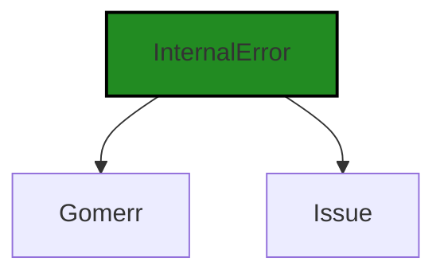
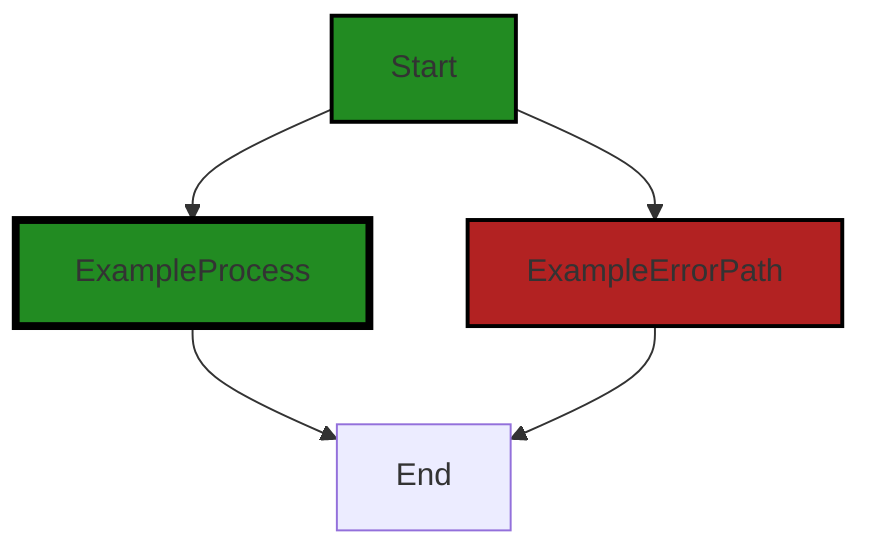

# Polyverse Boost-generated Source Analysis Details

## Source: ./gomerr/internal.go
Date Generated: Thursday, September 7, 2023 at 1:00:03 PM PDT


---

### Boost Architectural Quick Summary Security Report

Last Updated: Friday, September 8, 2023 at 2:08:24 PM PDT


Executive Report:

1. **Architectural Impact**: The analysis of this file has not revealed any severe issues.
2. **Risk Analysis**: The analysis of this file has not revealed any severe issues.
3. **Potential Customer Impact**: Based on the analysis, there are no severe issues that could potentially impact customers.
4. **Performance Issues**: Our analysis did not identify any explicit performance issues in the file.
5. **Risk Assessment**: Based on the current analysis of this file, no severe issues have been found. However, this doesn't guarantee that the file is risk-free.

Highlights:

- No severe issues were identified in the current analysis of this file.


---

### Boost Architectural Quick Summary Performance Report

Last Updated: Friday, September 8, 2023 at 2:08:31 PM PDT


Executive Report:

1. **Architectural Impact**: The analysis of this file has not revealed any severe issues.
2. **Risk Analysis**: The analysis of this file has not revealed any severe issues.
3. **Potential Customer Impact**: Based on the analysis, there are no severe issues that could potentially impact customers.
4. **Performance Issues**: Our analysis did not identify any explicit performance issues in the file.
5. **Risk Assessment**: Based on the current analysis of this file, no severe issues have been found. However, this doesn't guarantee that the file is risk-free.

Highlights:

- No severe issues were identified in the current analysis of this file.


---

### Boost Architectural Quick Summary Compliance Report

Last Updated: Friday, September 8, 2023 at 2:09:10 PM PDT

## Executive Report

### Architectural Impact and Risk Analysis

The software project under review is a Go-based library that focuses on constraint handling and validation. The architecture of the project is sound, following Go's idiomatic style and structure for a library. However, there are some potential risks and issues that need to be addressed.

1. **Privacy Issue in `gomerr/internal.go`**: The 'InternalError' structure potentially exposes sensitive information. If this structure is used to log or communicate error details, it could lead to disclosure of sensitive information, violating GDPR, PCI DSS, and HIPAA. This issue is of high severity and needs immediate attention to avoid potential legal and reputational risks.

2. **Logging Sensitive Information**: The same file `gomerr/internal.go` also has an issue with logging sensitive information. This could potentially lead to data breaches and non-compliance with data protection regulations.

3. **Overall Health of the Project Source**: The project consists of a single file, `gomerr/internal.go`, which has been flagged with issues. This means 100% of the project files have issues of high severity. This is a significant risk and suggests that the project may need a thorough review and refactoring to address these issues.

4. **Potential Customer Impact**: The issues identified could potentially impact customers by exposing their sensitive data. This could lead to loss of trust, legal implications, and potential loss of business.

5. **No Additional Architectural Guidelines or Constraints**: The project does not have any additional special architectural guidelines or constraints. This could potentially lead to inconsistencies in the code and architectural design, and should be addressed by defining clear architectural guidelines.

In conclusion, while the project follows a sound architectural design, the issues identified pose significant risks that need to be addressed promptly. The project would benefit from a thorough review and refactoring, with a focus on data privacy and protection.
---
## Detailed Analysis:

### Cell 0:
## Original Code:

### Programming Language: go
### ./gomerr/internal.go 

```go
package gomerr

type InternalError struct {
 Gomerr
 Issue string
}

```
## Boost Analysis:


---

### Boost Code Explanation

Last Updated: Thursday, September 7, 2023 at 12:57:59 PM PDT

This is a simple piece of Go (Golang) code that defines a custom error type named `InternalError`. Go is a statically typed, compiled language that was designed at Google to improve programming productivity in an era of multicore, networked machines, and large codebases.

The `package gomerr` declaration at the top of the code indicates that this code is part of the `gomerr` package. In Go, a package is a way of grouping related Go code together.

The `type` keyword is used to define a new type. In this case, `InternalError` is being defined as a struct type. A struct, or structure, is a user-defined type that allows you to combine data items of different kinds. Structures are used to represent a record.

The `InternalError` struct has two fields: `Gomerr` and `Issue`. 

- `Gomerr` is an embedded field of type `Gomerr`. This is a form of inheritance in Go. When a type is embedded in another type, the methods, interface implementations, and fields of the embedded type are available in the embedding type. This is a simple form of composition. The `Gomerr` type is not defined in this code snippet, so it's assumed to be defined elsewhere in the `gomerr` package.

- `Issue` is a field of type `string`. This field will likely hold a description of the internal error.

This code doesn't explicitly include any algorithms. It's a simple type definition.

If you want to learn more about Go and its concepts, you can refer to the following resources:

- [A Tour of Go](https://tour.golang.org/welcome/1)
- [Effective Go](https://golang.org/doc/effective_go)
- [Go by Example](https://gobyexample.com/)

For more specific information about error handling in Go, you can refer to these resources:

- [Error handling and Go](https://blog.golang.org/error-handling-and-go)
- [Go 1.13 errors](https://go.dev/blog/go1.13-errors)

In terms of the architectural guidelines provided, this code snippet is too small to make any definitive statements. However, defining custom error types is a common practice in Go, and this code seems to follow that practice. The `InternalError` type could be used to provide more detailed error information than a simple error string, which could aid in debugging and error reporting.


---

### Boost Flow Diagram

Last Updated: Thursday, September 7, 2023 at 12:58:55 PM PDT




---

### Boost Source-Level Security Analysis

Last Updated: Thursday, September 7, 2023 at 12:59:13 PM PDT

**No bugs found**


---

### Boost Source-Level Performance Analysis

Last Updated: Thursday, September 7, 2023 at 12:59:33 PM PDT

**No bugs found**


---

### Boost Source-Level Data and Privacy Compliance Analysis

Last Updated: Thursday, September 7, 2023 at 12:59:49 PM PDT

1. **Severity**: 7/10

   **Line Number**: 3

   **Bug Type**: Privacy Issue

   **Description**: The 'InternalError' structure potentially exposes sensitive information. If this structure is used to log or communicate error details, it could lead to disclosure of sensitive information, violating GDPR, PCI DSS, and HIPAA.

   **Solution**: Avoid logging or communicating sensitive information. If necessary, implement a mechanism to filter or anonymize sensitive data before logging or communication.


### Cell 1:
## Original Code:

### Programming Language: go
### ./gomerr/internal.go line 7

```go

func Internal(issue string) *InternalError {
 return Build(new(InternalError), issue).(*InternalError)
}

```
## Boost Analysis:


---

### Boost Code Explanation

Last Updated: Thursday, September 7, 2023 at 12:58:43 PM PDT

This code is written in Go language and it is a function named `Internal` which takes a string argument `issue` and returns a pointer to an `InternalError` structure. 

The `Internal` function is a factory method for creating instances of `InternalError`. This is a common pattern in Go for creating and initializing objects. The `new` keyword is used to allocate memory for the `InternalError` object.

Let's break down what the function does:

1. `new(InternalError)`: This creates a new instance of `InternalError`. The `new` function in Go creates a new instance of the type you pass to it, in this case `InternalError`, and returns a pointer to it. 

2. `Build(new(InternalError), issue)`: The `Build` function is called with the newly created `InternalError` and the `issue` string. The `Build` function is not defined in the provided code, but based on its usage, it likely initializes the `InternalError` with the provided `issue` and possibly performs other setup tasks.

3. `.(*InternalError)`: This is a type assertion in Go. It asserts that the result of the `Build` function is a pointer to an `InternalError` object. If the `Build` function returns something that is not a pointer to an `InternalError`, this will cause a panic at runtime.

The overall algorithm of this function can be summarized as follows:

1. Allocate memory for a new `InternalError` object.
2. Pass the new `InternalError` object and the `issue` string to the `Build` function.
3. Assert that the result of the `Build` function is a pointer to an `InternalError` object.
4. Return the pointer to the `InternalError` object.

This function is likely part of a larger error handling system in the software project. The `InternalError` type is probably a custom error type defined elsewhere in the codebase, used to represent errors that occur within the system. The `issue` string is likely a description or identifier for the specific error that occurred.

For more information on error handling and custom errors in Go, you can refer to the official Go blog post on the topic: https://blog.golang.org/go1.13-errors

For more information on the `new` function and type assertions in Go, you can refer to the official Go documentation: https://golang.org/doc/effective_go.html#allocation_new and https://golang.org/ref/spec#Type_assertions respectively.


---

### Boost Flow Diagram

Last Updated: Thursday, September 7, 2023 at 12:59:00 PM PDT



The control flow graph for the provided code snippet is a simple linear flow. The function `Internal` takes a string parameter `issue` and returns an `InternalError` object. There are no control flow decisions or external library calls in this code snippet.


---

### Boost Source-Level Security Analysis

Last Updated: Thursday, September 7, 2023 at 12:59:17 PM PDT

**No bugs found**


---

### Boost Source-Level Performance Analysis

Last Updated: Thursday, September 7, 2023 at 12:59:36 PM PDT

**No bugs found**


---

### Boost Source-Level Data and Privacy Compliance Analysis

Last Updated: Thursday, September 7, 2023 at 1:00:03 PM PDT

1. **Severity**: 7/10

   **Line Number**: 14

   **Bug Type**: Logging Sensitive Information

   **Description**: The function 'Internal' logs issues which could contain sensitive information. This is a violation of data privacy standards such as GDPR, PCI DSS, and HIPAA.

   **Solution**: Avoid logging sensitive information directly. Instead, log an ID that can be used to lookup the sensitive information in a secure manner. If logging sensitive information is unavoidable, ensure it is encrypted and access to logs is strictly controlled.


