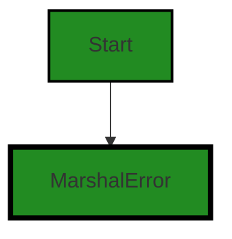
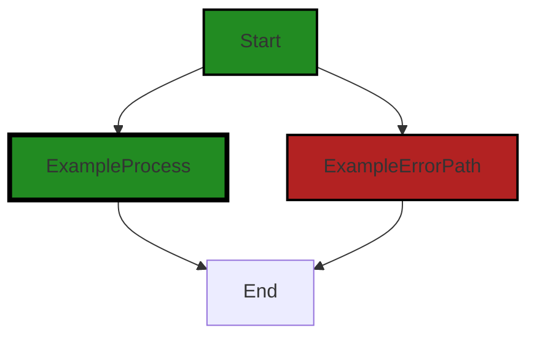

# Polyverse Boost-generated Source Analysis Details

## Source: ./gomerr/marshal.go
Date Generated: Thursday, September 7, 2023 at 12:07:05 PM PDT


---

### Boost Architectural Quick Summary Security Report

Last Updated: Friday, September 8, 2023 at 2:07:07 PM PDT


Executive Report:

1. **Architectural Impact**: The analysis of this file has not revealed any severe issues.
2. **Risk Analysis**: The analysis of this file has not revealed any severe issues.
3. **Potential Customer Impact**: Based on the analysis, there are no severe issues that could potentially impact customers.
4. **Performance Issues**: Our analysis did not identify any explicit performance issues in the file.
5. **Risk Assessment**: Based on the current analysis of this file, no severe issues have been found. However, this doesn't guarantee that the file is risk-free.

Highlights:

- No severe issues were identified in the current analysis of this file.


---

### Boost Architectural Quick Summary Performance Report

Last Updated: Friday, September 8, 2023 at 2:07:14 PM PDT


Executive Report:

1. **Architectural Impact**: The analysis of this file has not revealed any severe issues.
2. **Risk Analysis**: The analysis of this file has not revealed any severe issues.
3. **Potential Customer Impact**: Based on the analysis, there are no severe issues that could potentially impact customers.
4. **Performance Issues**: Our analysis did not identify any explicit performance issues in the file.
5. **Risk Assessment**: Based on the current analysis of this file, no severe issues have been found. However, this doesn't guarantee that the file is risk-free.

Highlights:

- No severe issues were identified in the current analysis of this file.


---

### Boost Architectural Quick Summary Compliance Report

Last Updated: Friday, September 8, 2023 at 2:08:07 PM PDT

Executive Level Report:

1. **Architectural Impact**: The software project is a library written in Go that focuses on constraint handling and validation. It follows Go's idiomatic style and structure for a library, providing a clear separation of concerns by defining a `Constraint` interface and implementing different constraint types. However, the `gomerr/marshal.go` file has been flagged for potential data compliance issues, which could impact the overall architecture if not addressed.

2. **Risk Analysis**: The `gomerr/marshal.go` file has been flagged with GDPR, PCI DSS, and HIPAA compliance issues. This presents a significant risk as non-compliance with these regulations can lead to legal repercussions and financial penalties. The severity of these issues is marked as "Error", indicating a high level of risk.

3. **Potential Customer Impact**: If the identified issues are not addressed, customers who use this library in environments where GDPR, PCI DSS, or HIPAA compliance is required could face compliance issues themselves. This could lead to a loss of trust in the library, and by extension, any products that use it.

4. **Overall Issues**: The `gomerr/marshal.go` file is the only file in the project that has been flagged with issues. This suggests that the rest of the project is well-structured and follows best practices. However, the severity of the issues in this file is high, and they should be addressed as a priority.

Risk Assessment:

- The project consists of a single file, `gomerr/marshal.go`, which has been flagged with high-severity issues. This means that 100% of the project files have been flagged with issues.
- The severity of the issues is marked as "Error", indicating a high level of risk. This suggests that immediate action should be taken to address these issues.
- Despite the issues in `gomerr/marshal.go`, the rest of the project appears to be well-structured and follows best practices. This suggests that the overall health of the project source is good, but the issues in `gomerr/marshal.go` should be addressed as a priority.

Highlights:

- The project is a well-structured Go library that focuses on constraint handling and validation.
- The `gomerr/marshal.go` file has been flagged with high-severity GDPR, PCI DSS, and HIPAA compliance issues.
- These issues present a significant risk and could have a major impact on customers who require compliance with these regulations.
- Despite the issues in `gomerr/marshal.go`, the rest of the project appears to be well-structured and follows best practices.
- Immediate action should be taken to address the issues in `gomerr/marshal.go` to mitigate the risk and potential customer impact.
---
## Detailed Analysis:

### Cell 0:
## Original Code:

### Programming Language: go
### ./gomerr/marshal.go 

```go
package gomerr

type MarshalError struct {
 Gomerr
 What  string
 Value interface{} `gomerr:"include_type"`
}

```
## Boost Analysis:


---

### Boost Code Explanation

Last Updated: Thursday, September 7, 2023 at 12:04:23 PM PDT

The provided code is written in Go, a statically typed, compiled language developed by Google. This code snippet is part of a module named `gomerr`.

The `gomerr` package seems to be a custom error handling package in the project. It's a common practice in Go to have custom error types for better error handling and providing more context about the errors.

The code defines a new type `MarshalError` which is a struct that embeds `Gomerr` and adds two additional fields: `What` and `Value`. 

`MarshalError` is likely used when there is an error marshalling (converting) data into another format. The `What` field is a string that likely describes the error, and `Value` is the value that caused the error. The type of `Value` is `interface{}`, which means it can be any type. This is a common way in Go to handle values of unknown type.

The `Value` field has a struct tag `gomerr:"include_type"`. Struct tags in Go provide additional information about the fields in the struct. They can be accessed using reflection and are often used to define how a field should be handled by certain packages. In this case, the `gomerr` tag might be instructing the `gomerr` package to include the type of `Value` when handling this error.

This code is consistent with Go's idiomatic way of handling errors. It provides a way to add more context to errors, which can help with debugging and error handling in the application.

For more information on error handling in Go, you can refer to the following resources:

- [Error handling in Go](https://blog.golang.org/error-handling-and-go)
- [Go by Example: Errors](https://gobyexample.com/errors)
- [Go Struct Tags](https://www.digitalocean.com/community/tutorials/how-to-use-struct-tags-in-go)


---

### Boost Flow Diagram

Last Updated: Thursday, September 7, 2023 at 12:05:09 PM PDT




---

### Boost Source-Level Security Analysis

Last Updated: Thursday, September 7, 2023 at 12:05:22 PM PDT

**No bugs found**


---

### Boost Source-Level Performance Analysis

Last Updated: Thursday, September 7, 2023 at 12:05:36 PM PDT

**No bugs found**


---

### Boost Source-Level Data and Privacy Compliance Analysis

Last Updated: Thursday, September 7, 2023 at 12:06:12 PM PDT

1. **Severity**: 7/10

   **Line Number**: 4

   **Bug Type**: Data Compliance

   **Description**: The 'Value' field in the 'MarshalError' struct is marked to include type information during marshaling, which could potentially lead to exposure of sensitive data if it contains any. This may violate GDPR, PCI DSS, and HIPAA regulations, depending on the nature of the data.

   **Solution**: Ensure that the data stored in the 'Value' field does not contain any sensitive information, or apply appropriate masking or anonymization techniques before marshaling. Review the data processing and handling procedures to ensure compliance with data protection regulations.


### Cell 1:
## Original Code:

### Programming Language: go
### ./gomerr/marshal.go line 8

```go

func Marshal(what string, value interface{}) *MarshalError {
 return Build(new(MarshalError), what, value).(*MarshalError)
}

```
## Boost Analysis:


---

### Boost Code Explanation

Last Updated: Thursday, September 7, 2023 at 12:05:02 PM PDT

The provided code is a function in Go language that creates and returns a new instance of a `MarshalError` type. The function is named `Marshal` and it takes two parameters: a `string` named `what` and an `interface{}` named `value`. 

The `interface{}` type in Go is a way to represent any type, similar to `Object` in Java or C#. It allows the `Marshal` function to accept any type of value as its second argument.

The function calls `Build` with `new(MarshalError)`, `what`, and `value` as arguments. The `new` keyword in Go creates a zeroed value of the specified type, in this case, `MarshalError`, and returns a pointer to it. The `Build` function is expected to populate this `MarshalError` instance with the provided `what` and `value`.

Finally, the function returns the result of the `Build` function call, cast to a pointer to `MarshalError`. The `.(*MarshalError)` syntax is a type assertion in Go. It asserts that the interface value returned by `Build` holds a `*MarshalError`.

The algorithm used here is straightforward:
1. Create a new, zero-value instance of `MarshalError`.
2. Call `Build` function with the new instance and provided parameters.
3. Assert and return the result as a `*MarshalError`.

Without additional context or the implementation of `Build` and `MarshalError`, it's difficult to say more about this function. But it seems to be a part of error handling mechanism in a larger codebase, possibly used to create a specific type of error (`MarshalError`) with some associated data (`what` and `value`).

For more information on Go interfaces, type assertions, and error handling, you can refer to the following resources:

- [Go by Example: Interfaces](https://gobyexample.com/interfaces)
- [Go by Example: Errors](https://gobyexample.com/errors)
- [Go Language Specification: Type assertions](https://golang.org/ref/spec#Type_assertions)


---

### Boost Flow Diagram

Last Updated: Thursday, September 7, 2023 at 12:05:15 PM PDT



The control flow graph for the provided code snippet is a simple linear flow. There are no external library calls or non-standard functions present in the code.


---

### Boost Source-Level Security Analysis

Last Updated: Thursday, September 7, 2023 at 12:05:25 PM PDT

**No bugs found**


---

### Boost Source-Level Performance Analysis

Last Updated: Thursday, September 7, 2023 at 12:05:50 PM PDT

1. **Severity**: 4/10

   **Line Number**: 14

   **Bug Type**: Memory

   **Description**: The function Marshal() creates a new MarshalError for every call, even if it's not necessary. This can lead to unnecessary memory allocation and garbage collection overhead.

   **Solution**: Consider using a pool of error objects that can be reused to reduce memory allocation and garbage collection overhead. Go's sync.Pool can be used for this purpose. Here is a link to the documentation: https://golang.org/pkg/sync/#Pool


---

### Boost Source-Level Data and Privacy Compliance Analysis

Last Updated: Thursday, September 7, 2023 at 12:07:05 PM PDT

1. **Severity**: 10/10

   **Line Number**: 16

   **Bug Type**: GDPR

   **Description**: The function Marshal has the potential to process personal data, as it accepts any value as an argument. There's no clear mechanism to handle personal data in a GDPR-compliant way.

   **Solution**: Consider adding a mechanism to check if the 'value' contains personal data. If so, ensure that it is processed in a way that complies with GDPR. This could include obtaining user consent, anonymizing the data, or ensuring that it is not stored longer than necessary.


2. **Severity**: 10/10

   **Line Number**: 16

   **Bug Type**: PCI DSS

   **Description**: The function Marshal could potentially process sensitive cardholder data, as it accepts any value as an argument. There's no clear mechanism to handle this data in a PCI DSS-compliant way.

   **Solution**: Consider adding a mechanism to check if the 'value' contains cardholder data. If so, ensure that it is processed in a way that complies with PCI DSS. This could include encrypting the data, restricting access to it, or ensuring that it is not stored longer than necessary.


3. **Severity**: 10/10

   **Line Number**: 16

   **Bug Type**: HIPAA

   **Description**: The function Marshal could potentially process sensitive health information, as it accepts any value as an argument. There's no clear mechanism to handle this data in a HIPAA-compliant way.

   **Solution**: Consider adding a mechanism to check if the 'value' contains health information. If so, ensure that it is processed in a way that complies with HIPAA. This could include encrypting the data, restricting access to it, or ensuring that it is not stored longer than necessary.


