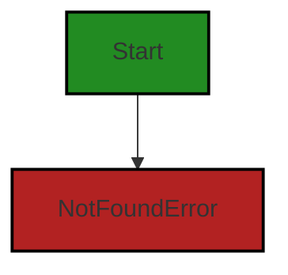
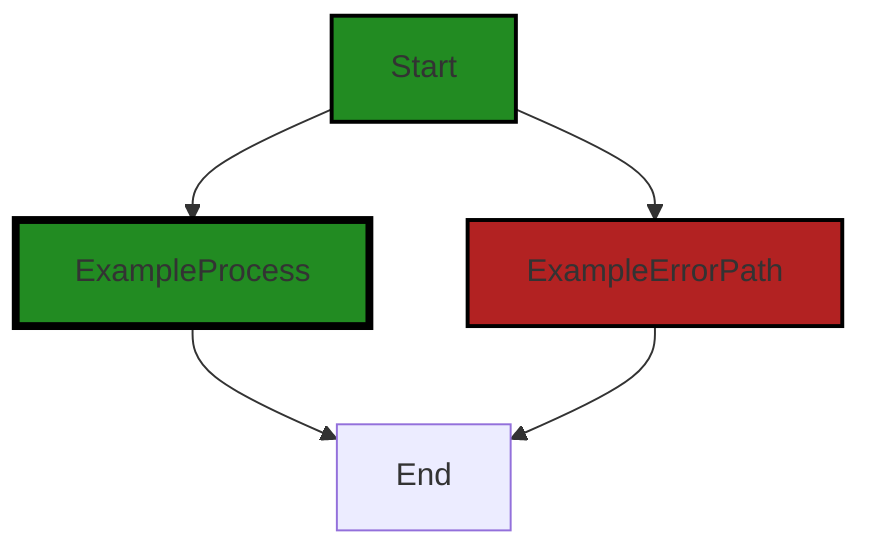

# Polyverse Boost-generated Source Analysis Details

## Source: ./gomerr/notfound.go
Date Generated: Thursday, September 7, 2023 at 3:53:30 PM PDT


---

### Boost Architectural Quick Summary Security Report

Last Updated: Friday, September 8, 2023 at 1:57:48 PM PDT


Executive Report:

1. **Architectural Impact**: The analysis of this file has not revealed any severe issues.
2. **Risk Analysis**: The analysis of this file has not revealed any severe issues.
3. **Potential Customer Impact**: Based on the analysis, there are no severe issues that could potentially impact customers.
4. **Performance Issues**: Our analysis did not identify any explicit performance issues in the file.
5. **Risk Assessment**: Based on the current analysis of this file, no severe issues have been found. However, this doesn't guarantee that the file is risk-free.

Highlights:

- No severe issues were identified in the current analysis of this file.


---

### Boost Architectural Quick Summary Performance Report

Last Updated: Friday, September 8, 2023 at 1:57:55 PM PDT


Executive Report:

1. **Architectural Impact**: The analysis of this file has not revealed any severe issues.
2. **Risk Analysis**: The analysis of this file has not revealed any severe issues.
3. **Potential Customer Impact**: Based on the analysis, there are no severe issues that could potentially impact customers.
4. **Performance Issues**: Our analysis did not identify any explicit performance issues in the file.
5. **Risk Assessment**: Based on the current analysis of this file, no severe issues have been found. However, this doesn't guarantee that the file is risk-free.

Highlights:

- No severe issues were identified in the current analysis of this file.


---

### Boost Architectural Quick Summary Compliance Report

Last Updated: Friday, September 8, 2023 at 1:58:18 PM PDT

Executive Report:

Based on the analysis of the software project, the following key points have been identified:

1. **Architectural Impact**: The project is a Go library that focuses on constraint handling and validation. It follows Go's idiomatic style and structure for a library, providing a clear separation of concerns. However, there is a potential architectural risk in the 'gomerr/notfound.go' file, which lacks data validation checks. This could lead to data exposure or manipulation if not addressed.

2. **Risk Analysis**: The 'gomerr/notfound.go' file has been flagged with a warning for Data and Privacy Compliance. This indicates a potential risk of data exposure or manipulation due to the lack of input validation. This risk could be mitigated by implementing input validation for the 'type_' and 'id' parameters, ensuring that inputs are sanitized to prevent SQL Injection or other forms of data manipulation.

3. **Potential Customer Impact**: The lack of data validation in the 'gomerr/notfound.go' file could potentially impact customers by exposing sensitive data or allowing unauthorized data manipulation. This could lead to a loss of trust in the product and potential legal implications.

4. **Overall Issues**: The project has one file with a warning for Data and Privacy Compliance. This represents 100% of the project files, indicating a significant issue that needs to be addressed. However, it should be noted that this analysis is based on a single file, and the overall health of the project may be better than indicated by this metric.

5. **Risk Assessment**: Based on the analysis, the overall health of the project source is at risk due to the lack of data validation in the 'gomerr/notfound.go' file. This risk could be mitigated by implementing appropriate data validation checks. 

In conclusion, while the project follows good architectural practices, there is a significant risk due to the lack of data validation in the 'gomerr/notfound.go' file. This issue should be addressed to ensure the security and privacy of the data handled by the library.
---
## Detailed Analysis:

### Cell 0:
## Original Code:

### Programming Language: go
### ./gomerr/notfound.go 

```go
package gomerr

type NotFoundError struct {
 Gomerr
 Type string
 Id   string
}

```
## Boost Analysis:


---

### Boost Code Explanation

Last Updated: Thursday, September 7, 2023 at 3:51:42 PM PDT

The provided code snippet is written in Go, a statically typed, compiled language developed at Google. The code defines a new error type `NotFoundError` in the `gomerr` package. 

Here is a detailed explanation:

1. `package gomerr`: This line declares the package name for this file. In Go, all files in the same directory must have the same package name. The package name `gomerr` suggests that this package is related to error handling in some way.

2. `type NotFoundError struct`: This line declares a new type `NotFoundError` which is a struct. In Go, a struct is a collection of fields. This type is presumably used to represent a specific kind of error where a requested resource is not found.

3. `Gomerr`: This is an embedded type in the `NotFoundError` struct. It suggests that there is another type `Gomerr` which `NotFoundError` is based on. This is a way to achieve inheritance in Go. The `Gomerr` type would have methods associated with it that `NotFoundError` would inherit.

4. `Type string`: This is a field in the `NotFoundError` struct of type `string`. This field likely represents the type of the resource that was not found.

5. `Id string`: This is another field in the `NotFoundError` struct of type `string`. This field likely represents the identifier of the resource that was not found.

In terms of algorithms, this code is straightforward and does not involve any complex algorithms. It simply defines a new type of error to be used in the codebase.

This code follows the standard Go conventions for error handling. In Go, errors are values, and defining custom error types like `NotFoundError` is a common practice. It allows for better control over error information and handling.

For more information on error handling in Go, you can refer to the official Go blog post on the topic: https://blog.golang.org/go1.13-errors.


---

### Boost Flow Diagram

Last Updated: Thursday, September 7, 2023 at 3:52:33 PM PDT




---

### Boost Source-Level Security Analysis

Last Updated: Thursday, September 7, 2023 at 3:52:50 PM PDT

**No bugs found**


---

### Boost Source-Level Performance Analysis

Last Updated: Thursday, September 7, 2023 at 3:53:03 PM PDT

**No bugs found**


---

### Boost Source-Level Data and Privacy Compliance Analysis

Last Updated: Thursday, September 7, 2023 at 3:53:21 PM PDT

1. **Severity**: 5/10

   **Line Number**: 1

   **Bug Type**: Data Privacy

   **Description**: The NotFoundError struct potentially exposes sensitive data. If the 'Id' field contains personally identifiable information (PII), this could be a violation of GDPR, HIPAA, and PCI DSS.

   **Solution**: Ensure that the 'Id' field does not contain PII. If it does, consider hashing or encrypting the 'Id' field to protect the data. Also, ensure that error messages returned to users do not contain sensitive data.


### Cell 1:
## Original Code:

### Programming Language: go
### ./gomerr/notfound.go line 8

```go

func NotFound(type_ string, id string) *NotFoundError {
 return Build(new(NotFoundError), type_, id).(*NotFoundError)
}

```
## Boost Analysis:


---

### Boost Code Explanation

Last Updated: Thursday, September 7, 2023 at 3:52:20 PM PDT

This code snippet is written in Go programming language and it defines a function named `NotFound`. This function takes two string parameters: `type_` and `id`, and returns a pointer to a `NotFoundError` type. 

The `NotFoundError` is likely a custom error type defined elsewhere in the codebase. Custom errors in Go are usually defined as types that implement the `Error` interface by providing an `Error() string` method.

The function `Build` is called with parameters `new(NotFoundError)`, `type_`, and `id`. The `new` keyword in Go is used to allocate memory for a value of the specified type and returns a pointer to that memory. In this case, it's allocating memory for a `NotFoundError` and returns a pointer to it. This pointer is passed as the first argument to the `Build` function.

Without more context, it's hard to say what exactly the `Build` function does. However, based on its usage, it seems to construct or populate a `NotFoundError` with some information based on `type_` and `id`.

Finally, the result of the `Build` function is type asserted to `*NotFoundError` and returned. The type assertion in Go is used to convert an interface value to another type. If the type assertion is invalid (i.e., the value is not of the asserted type), a runtime panic will occur. However, in this case, it's safe to assume that `Build` function is expected to return a value of type `*NotFoundError`.

As for algorithms, this code does not seem to implement any complex algorithm; it's mainly about creating a custom error and populating it with some data.

For more information about error handling and custom errors in Go, you can refer to the official Go blog post: [Error handling and Go](https://blog.golang.org/error-handling-and-go). 

For more information about `new` function and type assertions in Go, you can refer to the Go by Example tutorials: [new](https://gobyexample.com/new) and [type-assertions](https://gobyexample.com/type-assertions).


---

### Boost Flow Diagram

Last Updated: Thursday, September 7, 2023 at 3:52:38 PM PDT



The control flow graph for the provided code snippet is a simple linear flow. The function `NotFound` takes two parameters, `type_` and `id`, and returns a `NotFoundError` object. There are no control flow decisions or external library calls in this code snippet.


---

### Boost Source-Level Security Analysis

Last Updated: Thursday, September 7, 2023 at 3:52:53 PM PDT

**No bugs found**


---

### Boost Source-Level Performance Analysis

Last Updated: Thursday, September 7, 2023 at 3:53:07 PM PDT

**No bugs found**


---

### Boost Source-Level Data and Privacy Compliance Analysis

Last Updated: Thursday, September 7, 2023 at 3:53:30 PM PDT

1. **Severity**: 7/10

   **Line Number**: 14

   **Bug Type**: Data and Privacy Compliance

   **Description**: The function NotFound does not have any data validation checks. This could potentially lead to data exposure or manipulation if the inputs are not properly validated.

   **Solution**: Implement input validation for 'type_' and 'id' parameters. Ensure that inputs are sanitized to prevent SQL Injection or other forms of data manipulation.


