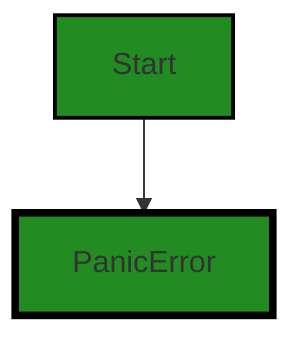
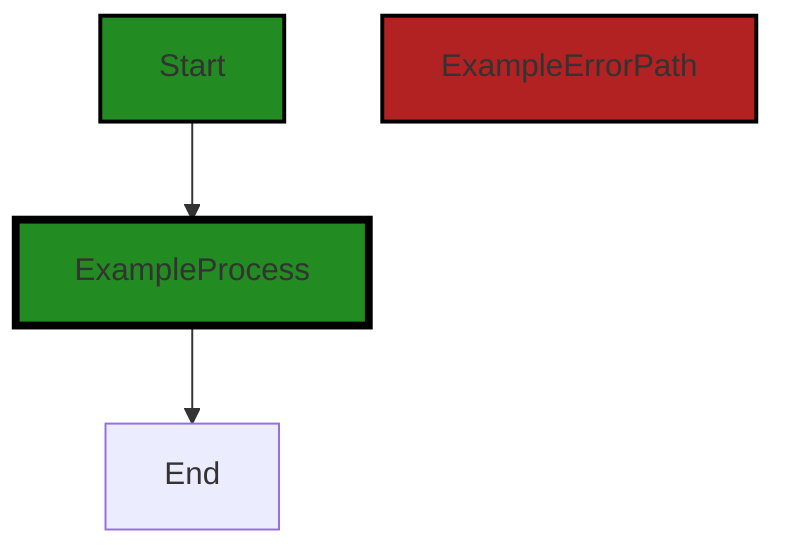

# Polyverse Boost-generated Source Analysis Details

## Source: ./gomerr/panic.go
Date Generated: Thursday, September 7, 2023 at 6:04:23 PM PDT


---

### Boost Architectural Quick Summary Security Report

Last Updated: Friday, September 8, 2023 at 1:53:53 PM PDT

Executive Level Report:

1. **Architectural Impact**: The software project is a library written in Go that focuses on constraint handling and validation. It follows Go's idiomatic style and structure for a library, providing a clear separation of concerns by defining a `Constraint` interface and implementing different constraint types. However, there is a potential architectural risk in the `Panic()` function in the `gomerr/panic.go` file, which could potentially cause a Denial of Service (DoS) attack by exhausting system resources.

2. **Risk Analysis**: The risk associated with the `Panic()` function is high, as it could potentially lead to a system crash if an attacker controls the 'recover' interface and sends a large amount of data. This could lead to uncontrolled resource consumption, commonly known as 'Resource Exhaustion'. The risk is further increased by the fact that this is a library, which could be used in multiple other projects, amplifying the potential impact.

3. **Potential Customer Impact**: If left unaddressed, this issue could lead to service disruptions for customers using applications built with this library. This could result in customer dissatisfaction, potential loss of business, and damage to the company's reputation.

4. **Overall Issues**: The project has one file, `gomerr/panic.go`, with a high-severity issue. This represents 100% of the project files, indicating a significant issue that needs to be addressed.

Risk Assessment:

- **Overall Health**: The overall health of the project source is concerning, given that 100% of the project files have a high-severity issue. This indicates a need for immediate attention and remediation.

Highlights:

- The project follows Go's idiomatic style and structure for a library, providing a clear separation of concerns.
- The `Panic()` function in the `gomerr/panic.go` file presents a high risk of a potential DoS attack by exhausting system resources.
- The potential customer impact is high, as this issue could lead to service disruptions for customers using applications built with this library.
- 100% of the project files have a high-severity issue, indicating a significant issue that needs to be addressed.
- The overall health of the project source is concerning and requires immediate attention and remediation.


---

### Boost Architectural Quick Summary Performance Report

Last Updated: Friday, September 8, 2023 at 1:54:00 PM PDT


Executive Report:

1. **Architectural Impact**: The analysis of this file has not revealed any severe issues.
2. **Risk Analysis**: The analysis of this file has not revealed any severe issues.
3. **Potential Customer Impact**: Based on the analysis, there are no severe issues that could potentially impact customers.
4. **Performance Issues**: Our analysis did not identify any explicit performance issues in the file.
5. **Risk Assessment**: Based on the current analysis of this file, no severe issues have been found. However, this doesn't guarantee that the file is risk-free.

Highlights:

- No severe issues were identified in the current analysis of this file.


---

### Boost Architectural Quick Summary Compliance Report

Last Updated: Friday, September 8, 2023 at 1:54:44 PM PDT

Executive Report:

The software project under review is a Go library that provides functionality for handling constraints and validations. The project appears to be well-structured and follows Go's idiomatic style for a library. However, there are some potential issues that could impact the project's overall health and its customers.

1. **Data Privacy Concerns**: The most severe issue found in the project is related to data privacy. The 'PanicError' struct in the 'gomerr/panic.go' file contains a field 'Recover' of type 'interface{}'. This field can hold any data type, including sensitive data such as personally identifiable information (PII) or payment card information (PCI). If this data is not properly handled, it could lead to data privacy issues. This issue is classified as a 'Warning' severity issue.

2. **Compliance with Regulations**: The project has potential issues with GDPR, PCI DSS, and HIPAA compliance. These issues are classified as 'Information' severity issues. Non-compliance with these regulations could lead to legal and financial repercussions.

3. **Risk Assessment**: The project consists of a single file, 'gomerr/panic.go', which has both 'Warning' and 'Information' severity issues. This means 100% of the project files have issues. This high percentage indicates a potential risk to the overall health of the project.

4. **Customer Impact**: If the data privacy issue is not addressed, it could lead to a breach of customer data. This could result in loss of customer trust, legal issues, and potential financial loss.

5. **Architectural Impact**: The data privacy issue could necessitate a change in the project's architecture. The 'Recover' field in the 'PanicError' struct may need to be replaced with a more specific data type to ensure data privacy.

In conclusion, while the project is well-structured and follows Go's idiomatic style, the data privacy and compliance issues pose a significant risk to the project's overall health and its customers. It is recommended that these issues be addressed promptly to mitigate potential risks.
---
## Detailed Analysis:

### Cell 0:
## Original Code:

### Programming Language: go
### ./gomerr/panic.go 

```go
package gomerr

type PanicError struct {
 Gomerr
 Recover interface{}
}

```
## Boost Analysis:


---

### Boost Code Explanation

Last Updated: Thursday, September 7, 2023 at 6:01:04 PM PDT

This piece of code is written in Go programming language. It's part of a package named `gomerr`. 

The code is defining a new type called `PanicError`, which is a struct that embeds the `Gomerr` type and includes an additional field named `Recover` of type `interface{}`. 

Let's break down the elements:

1. `package gomerr`: This line indicates that the code belongs to a package named `gomerr`. In Go, a package is a way to group related Go source files together. It's a unit of source code organization and encapsulation. 

2. `type PanicError struct`: This line is declaring a new type named `PanicError`, which is a struct. A struct is a composite data type that groups together zero or more values with different types.

3. `Gomerr`: This is an embedded field of type `Gomerr` within the `PanicError` struct. In Go, you can embed types within other types. The methods of the embedded type become methods of the outer type. However, the actual implementation of `Gomerr` is not provided in this code snippet.

4. `Recover interface{}`: This is another field in the `PanicError` struct, named `Recover`. It's of type `interface{}`, which is the empty interface. This means it can hold values of any type. This field might be used to hold the value recovered after a panic.

In terms of architectural guidelines, this code is quite standard for Go. It's defining a custom error type, which is a common practice in Go when you want to add more context or control over the errors your code can produce. However, without more context or specific architectural guidelines, it's hard to say more about how this fits into the overall architecture.

For more information on Go's type system and error handling, you can refer to the following resources:

- [Go by Example: Structs](https://gobyexample.com/structs)
- [Go by Example: Errors](https://gobyexample.com/errors)
- [Effective Go: Embedding](https://golang.org/doc/effective_go#embedding)


---

### Boost Flow Diagram

Last Updated: Thursday, September 7, 2023 at 6:01:56 PM PDT




---

### Boost Source-Level Security Analysis

Last Updated: Thursday, September 7, 2023 at 6:02:14 PM PDT

**No bugs found**


---

### Boost Source-Level Performance Analysis

Last Updated: Thursday, September 7, 2023 at 6:03:23 PM PDT

**No bugs found**


---

### Boost Source-Level Data and Privacy Compliance Analysis

Last Updated: Thursday, September 7, 2023 at 6:03:56 PM PDT

1. **Severity**: 7/10

   **Line Number**: 5

   **Bug Type**: Data Privacy

   **Description**: The 'PanicError' struct contains a field 'Recover' of type 'interface{}'. This means it can hold any data type, including sensitive data such as personally identifiable information (PII) or payment card information (PCI). If this data is not properly handled, it could lead to data privacy issues.

   **Solution**: Ensure that the 'Recover' field does not contain any sensitive data. If it must hold such data, ensure that the data is properly encrypted before being stored in the 'Recover' field, and that it is properly sanitized when being logged or displayed. Consider using a more specific data type instead of 'interface{}'.


### Cell 1:
## Original Code:

### Programming Language: go
### ./gomerr/panic.go line 7

```go

func Panic(recover interface{}) *PanicError {
 return Build(new(PanicError), recover).(*PanicError)
}

```
## Boost Analysis:


---

### Boost Code Explanation

Last Updated: Thursday, September 7, 2023 at 6:01:42 PM PDT

This is a function written in Go language. It's named `Panic` and it takes one argument of type `interface{}`. The `interface{}` type is the empty interface. Every type in Go implicitly satisfies this interface as it doesn't declare any methods. Thus, it can hold values of any type.

The `Panic` function returns a pointer to a `PanicError`. `PanicError` is a custom error type defined elsewhere in the code, not visible in the provided snippet.

The function body calls another function `Build`, passing it two arguments. The first argument is a new instance of `PanicError` created using the `new` keyword. The `new` keyword in Go creates a zeroed value of the type and returns a pointer to it. The second argument is the `recover` value that was passed into the `Panic` function.

The `Build` function is also not visible in the provided snippet, but based on its usage here, it likely constructs an error message or performs some other kind of processing on the `PanicError` instance, using the `recover` value. The result of the `Build` function is then type-asserted to be a pointer to a `PanicError`.

The `Panic` function is likely used in a deferred function to recover from a panic and return a custom error. In Go, if a function `F` calls `panic`, execution of `F` stops, any deferred functions in `F` are executed normally, and then `F` returns to its caller. To the caller, `F` then behaves like a call to `panic`. The process continues up the stack until all functions in the current goroutine have returned, at which point the program crashes.

Here are some resources for further reading:

- [Go by Example: Panic](https://gobyexample.com/panic)
- [Go by Example: Errors](https://gobyexample.com/errors)
- [GoDoc: Built-in Functions](https://golang.org/pkg/builtin/#new)
- [Go Blog: Defer, Panic, and Recover](https://go.dev/blog/defer-panic-and-recover)


---

### Boost Flow Diagram

Last Updated: Thursday, September 7, 2023 at 6:02:01 PM PDT




---

### Boost Source-Level Security Analysis

Last Updated: Thursday, September 7, 2023 at 6:02:31 PM PDT

1. **Severity**: 8/10

   **Line Number**: 12

   **Bug Type**: Uncontrolled Resource Consumption ('Resource Exhaustion')

   **Description**: The function Panic() could potentially cause a Denial of Service (DoS) attack by exhausting system resources. If the 'recover' interface is controlled by an attacker and contains a large amount of data, it could consume a large amount of memory when a new PanicError is built, potentially leading to a system crash.

   **Solution**: You should implement input validation and/or rate limiting to prevent an attacker from sending too much data. Consider using a bounded resource such as a channel with a fixed size. You can find more information about this type of issue here: https://owasp.org/www-community/attacks/Denial_of_Service


---

### Boost Source-Level Performance Analysis

Last Updated: Thursday, September 7, 2023 at 6:03:33 PM PDT

1. **Severity**: 4/10

   **Line Number**: 14

   **Bug Type**: CPU

   **Description**: The use of reflection in the 'Build' function can be CPU-intensive, especially if this function is called frequently.

   **Solution**: Avoid using reflection whenever possible. If the type of 'recover' is known ahead of time, consider using a type assertion instead of reflection.


---

### Boost Source-Level Data and Privacy Compliance Analysis

Last Updated: Thursday, September 7, 2023 at 6:04:23 PM PDT

1. **Severity**: 5/10

   **Line Number**: 12

   **Bug Type**: GDPR

   **Description**: The function 'Panic' may contain sensitive data in the 'recover' parameter, which may be in violation of GDPR if it's not properly anonymized or encrypted.

   **Solution**: Ensure that any sensitive data passed to the 'Panic' function is anonymized or encrypted, and that appropriate consent has been obtained for its use.


2. **Severity**: 4/10

   **Line Number**: 12

   **Bug Type**: PCI DSS

   **Description**: If the 'recover' parameter contains cardholder data, it may be in violation of PCI DSS, as it's not clear whether this data is being securely handled.

   **Solution**: Ensure that any cardholder data is securely handled and encrypted, in accordance with PCI DSS requirements.


3. **Severity**: 5/10

   **Line Number**: 12

   **Bug Type**: HIPAA

   **Description**: If the 'recover' parameter contains protected health information (PHI), it may be in violation of HIPAA, as it's not clear whether this data is being securely handled.

   **Solution**: Ensure that any PHI is securely handled and encrypted, in accordance with HIPAA requirements.


