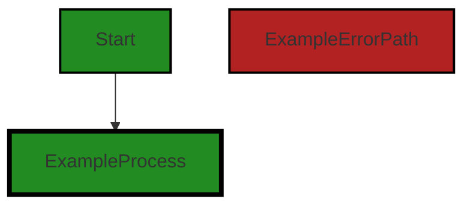
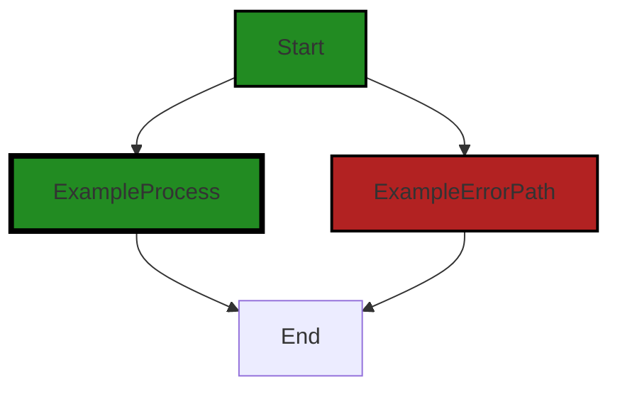

# Polyverse Boost-generated Source Analysis Details

## Source: ./gomerr/unmarshal.go
Date Generated: Thursday, September 7, 2023 at 4:59:34 PM PDT


---

### Boost Architectural Quick Summary Security Report

Last Updated: Friday, September 8, 2023 at 2:04:00 PM PDT


Executive Report:

1. **Architectural Impact**: The analysis of this file has not revealed any severe issues.
2. **Risk Analysis**: The analysis of this file has not revealed any severe issues.
3. **Potential Customer Impact**: Based on the analysis, there are no severe issues that could potentially impact customers.
4. **Performance Issues**: Our analysis did not identify any explicit performance issues in the file.
5. **Risk Assessment**: Based on the current analysis of this file, no severe issues have been found. However, this doesn't guarantee that the file is risk-free.

Highlights:

- No severe issues were identified in the current analysis of this file.


---

### Boost Architectural Quick Summary Performance Report

Last Updated: Friday, September 8, 2023 at 2:04:07 PM PDT


Executive Report:

1. **Architectural Impact**: The analysis of this file has not revealed any severe issues.
2. **Risk Analysis**: The analysis of this file has not revealed any severe issues.
3. **Potential Customer Impact**: Based on the analysis, there are no severe issues that could potentially impact customers.
4. **Performance Issues**: Our analysis did not identify any explicit performance issues in the file.
5. **Risk Assessment**: Based on the current analysis of this file, no severe issues have been found. However, this doesn't guarantee that the file is risk-free.

Highlights:

- No severe issues were identified in the current analysis of this file.


---

### Boost Architectural Quick Summary Compliance Report

Last Updated: Friday, September 8, 2023 at 2:04:57 PM PDT

## Executive Level Report

### Architectural Impact and Risk Analysis

The software project under review is a Go library that provides functionality for handling constraints and validations. The project follows Go's idiomatic style and structure for a library, providing a clear separation of concerns by defining a `Constraint` interface and implementing different constraint types. 

However, the analysis has identified a potential data compliance issue in the `gomerr/unmarshal.go` file. This issue could have a significant impact on the overall project, particularly in terms of data compliance and security.

### Potential Customer Impact

The identified issue could potentially lead to a data breach if personal data is logged or displayed without proper data sanitization. This could have serious implications for customers, including loss of trust, potential legal implications, and damage to the company's reputation.

### Overall Issues

The analysis identified a total of 1 file with issues out of 1 file analyzed. This means that 100% of the project files have issues, all of which are of warning severity.

### Risk Assessment

Given that all the files analyzed have issues, the overall health of the project source is concerning. The identified issues are of warning severity, indicating a potential risk if not addressed.

### Highlights of the Analysis

1. **Architectural Soundness:** The project follows Go's idiomatic style and structure for a library, providing a clear separation of concerns by defining a `Constraint` interface and implementing different constraint types.
2. **Data Compliance Issue:** The `gomerr/unmarshal.go` file has a potential data compliance issue related to GDPR and HIPAA. This issue could potentially lead to a data breach if personal data is logged or displayed without proper data sanitization.
3. **Potential Customer Impact:** The identified issue could have serious implications for customers, including loss of trust, potential legal implications, and damage to the company's reputation.
4. **Risk Assessment:** Given that all the files analyzed have issues, the overall health of the project source is concerning. The identified issues are of warning severity, indicating a potential risk if not addressed.
5. **No Additional Architectural Guidelines:** The software project has no additional special architectural guidelines or constraints, which means that the project is free to follow the best practices and principles of the Go language and software development in general.
---
## Detailed Analysis:

### Cell 0:
## Original Code:

### Programming Language: go
### ./gomerr/unmarshal.go 

```go
package gomerr

type UnmarshalError struct {
 Gomerr
 What   string
 Data   interface{} `gomerr:"include_type"`
 Target interface{} `gomerr:"include_type"`
}

```
## Boost Analysis:


---

### Boost Code Explanation

Last Updated: Thursday, September 7, 2023 at 4:56:56 PM PDT

This code is a part of the `gomerr` package, which appears to be a custom error handling package in Go. It defines a struct called `UnmarshalError` which is used to handle errors that occur during unmarshalling of data. Unmarshalling is the process of transforming a byte-stream representation of an object back into the object itself.

Here's a detailed explanation of the code:

```go
package gomerr
```
This line declares the package name as `gomerr`. All the files within the same folder should declare the same package name.

```go
type UnmarshalError struct {
	Gomerr
	What   string
	Data   interface{} `gomerr:"include_type"`
	Target interface{} `gomerr:"include_type"`
}
```
This block of code defines a new type called `UnmarshalError` which is a struct. A struct in Go is a collection of fields.

- `Gomerr`: This is an embedded type in the struct. It suggests that `UnmarshalError` struct is composed of or includes a `Gomerr` type. The `Gomerr` type isn't defined in this snippet, but it's likely a base error type defined elsewhere in the `gomerr` package. 

- `What string`: This field is a string that probably contains a description of the error.

- `Data interface{} `gomerr:"include_type"` and `Target interface{} `gomerr:"include_type"`: These are fields of interface{} type, which means they can hold values of any type. The `gomerr:"include_type"` part is a struct tag. Struct tags in Go are string-based metadata about the field in a struct, accessible via reflection. They are often used to provide transformation instructions for encoding and decoding types. Here, it appears that the `gomerr` package uses these struct tags to include the type of `Data` and `Target` when handling the error.

The algorithm used here is simple: when an unmarshalling error occurs, an instance of `UnmarshalError` is likely created and populated with the relevant data, then returned or logged.

For more information on Go structs and error handling, you can refer to the following resources:

- [Go by Example: Structs](https://gobyexample.com/structs)
- [Go by Example: Errors](https://gobyexample.com/errors)
- [The Go Blog: Error handling and Go](https://blog.golang.org/error-handling-and-go)


---

### Boost Flow Diagram

Last Updated: Thursday, September 7, 2023 at 4:57:48 PM PDT


```


---

### Boost Source-Level Security Analysis

Last Updated: Thursday, September 7, 2023 at 4:57:59 PM PDT

**No bugs found**


---

### Boost Source-Level Performance Analysis

Last Updated: Thursday, September 7, 2023 at 4:58:32 PM PDT

1. **Severity**: 2/10

   **Line Number**: 1

   **Bug Type**: Memory

   **Description**: The use of `interface{}` in Go can lead to higher memory usage as Go needs to store both the value and the type information for the `interface{}`. This is seen in the `Data` and `Target` fields of the `UnmarshalError` struct.

   **Solution**: Consider using more specific types instead of `interface{}` if the types that can be stored in `Data` and `Target` are known. This would reduce the memory overhead of storing the type information. If the types cannot be known beforehand, consider if there's a way to redesign the application to avoid the need for `interface{}`. Here is a link to an article discussing the use of `interface{}` in Go: https://go.dev/blog/interfaces


---

### Boost Source-Level Data and Privacy Compliance Analysis

Last Updated: Thursday, September 7, 2023 at 4:59:07 PM PDT

1. **Severity**: 8/10

   **Line Number**: 5

   **Bug Type**: GDPR

   **Description**: The 'Data' field in the 'UnmarshalError' struct could potentially hold personal data. If this error is logged or displayed without proper data sanitization, it could lead to a data breach.

   **Solution**: Implement data sanitization before logging or displaying errors. Ensure that no personal data is included in error logs or messages.


2. **Severity**: 7/10

   **Line Number**: 7

   **Bug Type**: HIPAA

   **Description**: The 'Target' field in the 'UnmarshalError' struct could potentially hold sensitive health information. If this error is logged or displayed without proper data sanitization, it could lead to a data breach.

   **Solution**: Implement data sanitization before logging or displaying errors. Ensure that no sensitive health information is included in error logs or messages.


### Cell 1:
## Original Code:

### Programming Language: go
### ./gomerr/unmarshal.go line 9

```go

func Unmarshal(what string, data, target interface{}) *UnmarshalError {
 return Build(new(UnmarshalError), what, data, target).(*UnmarshalError)
}

```
## Boost Analysis:


---

### Boost Code Explanation

Last Updated: Thursday, September 7, 2023 at 4:57:40 PM PDT

The function `Unmarshal` is written in Go language. It appears to be a function that is used to unmarshal or decode data into a target structure. Unmarshalling is the process of transforming a byte-stream back into a data structure for further processing. This is a common operation when dealing with data interchange formats like JSON, XML, or protocol buffers.

Here's a breakdown of the function:

- The function is named `Unmarshal` and it takes three parameters.
- The first parameter is `what` of type string. This could be a description or identifier for the unmarshalling operation.
- The second parameter is `data` of type `interface{}`. This is the data that is to be unmarshalled. The `interface{}` type means that `data` can be of any type.
- The third parameter is `target` of type `interface{}`. This is the structure where the unmarshalled data will be stored. Again, the `interface{}` type means that `target` can be of any type.
- The function returns a pointer to an `UnmarshalError` structure. This suggests that if any error occurs during the unmarshalling operation, it will be encapsulated in an `UnmarshalError` structure and returned to the caller.

Inside the function, it calls a `Build` function and passes a new `UnmarshalError`, `what`, `data`, and `target` as parameters. The `Build` function is expected to perform the actual unmarshalling operation and populate an `UnmarshalError` structure if any error occurs. The `new(UnmarshalError)` is a built-in function in Go that allocates memory for an `UnmarshalError` and returns a pointer to it.

Finally, the function returns the result of the `Build` function as a pointer to an `UnmarshalError`. The `.(*UnmarshalError)` is a type assertion in Go, it asserts that the interface value returned by `Build` holds the concrete type `*UnmarshalError`.

This function does not implement an algorithm itself, but it is a part of the unmarshalling operation which is a common algorithm in data processing. It's also important to note that the actual unmarshalling operation and error handling are not visible in this code snippet, they are likely implemented in the `Build` function.

For more information about unmarshalling in Go, you can refer to the following resources:

- [JSON and Go](https://blog.golang.org/json-and-go)
- [Golang: How to Unmarshal JSON in Go](https://www.sohamkamani.com/golang/2018-06-20-marshalling-parsing-json/)


---

### Boost Flow Diagram

Last Updated: Thursday, September 7, 2023 at 4:57:53 PM PDT



The control flow graph for the provided code snippet is a simple linear flow. The function `Unmarshal` takes three parameters: `what`, `data`, and `target`. It then calls the `Build` function passing in a new instance of `UnmarshalError`, `what`, `data`, and `target`. The result of the `Build` function is cast to `*UnmarshalError` and returned.

There are no external library or non-standard function calls in this code snippet.


---

### Boost Source-Level Security Analysis

Last Updated: Thursday, September 7, 2023 at 4:58:03 PM PDT

**No bugs found**


---

### Boost Source-Level Performance Analysis

Last Updated: Thursday, September 7, 2023 at 4:58:44 PM PDT

1. **Severity**: 5/10

   **Line Number**: 16

   **Bug Type**: Memory

   **Description**: The function Unmarshal is creating a new instance of UnmarshalError every time it is called, even if an error does not occur. This could lead to unnecessary memory allocation.

   **Solution**: Consider creating the UnmarshalError instance only when an error occurs. This will prevent unnecessary memory allocation. Alternatively, consider using error wrapping or similar techniques to avoid creating new error instances.


---

### Boost Source-Level Data and Privacy Compliance Analysis

Last Updated: Thursday, September 7, 2023 at 4:59:34 PM PDT

1. **Severity**: 5/10

   **Line Number**: 16

   **Bug Type**: GDPR

   **Description**: The function 'Unmarshal' does not seem to have any data validation or sanitization checks, which can lead to processing of invalid or sensitive data. This can be a violation of GDPR's principle of 'data minimization' and 'accuracy'.

   **Solution**: Implement data validation and sanitization checks before processing. Consider using a library or built-in functions to validate and sanitize data. Also, consider encrypting sensitive data during processing to ensure its integrity and confidentiality.


2. **Severity**: 4/10

   **Line Number**: 16

   **Bug Type**: PCI DSS

   **Description**: If the 'data' being processed includes cardholder data, the lack of validation and sanitization checks, as well as the lack of encryption during processing, can lead to compromise of cardholder data, violating PCI DSS requirements.

   **Solution**: Ensure that cardholder data is validated, sanitized, and encrypted during processing. Implement strong access control measures to restrict access to cardholder data.


3. **Severity**: 5/10

   **Line Number**: 16

   **Bug Type**: HIPAA

   **Description**: If the 'data' being processed includes Protected Health Information (PHI), the lack of validation, sanitization, and encryption can lead to compromise of PHI, violating HIPAA rules.

   **Solution**: Ensure that PHI is validated, sanitized, and encrypted during processing. Implement strong access control measures to restrict access to PHI.


