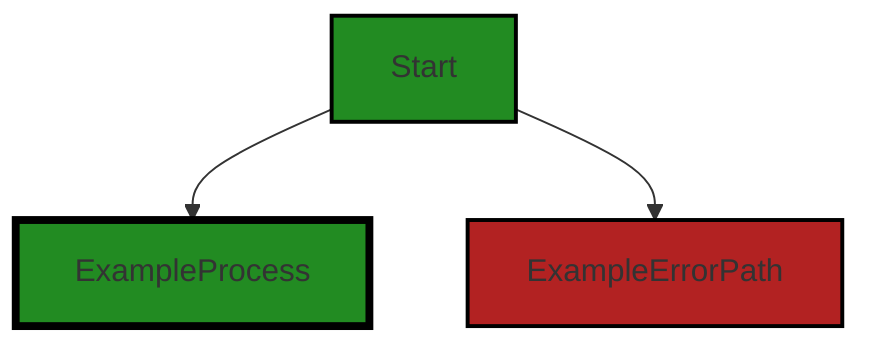
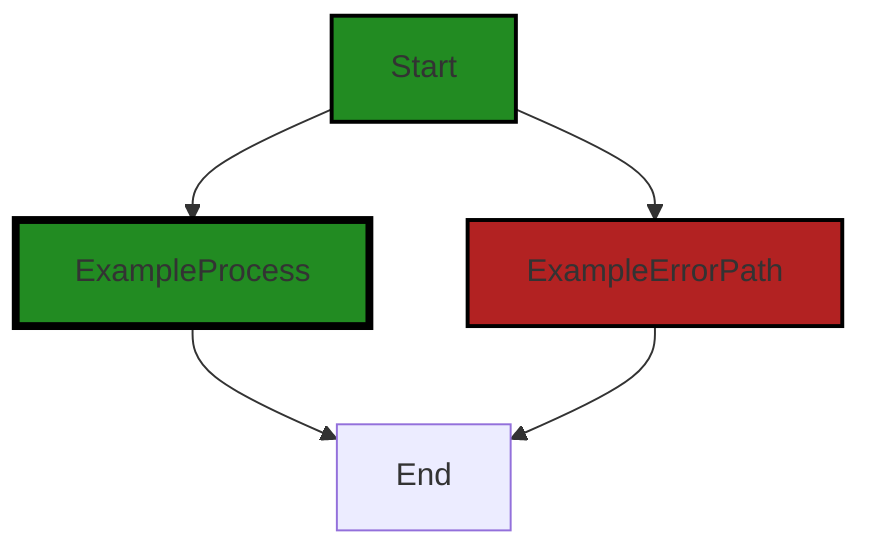

# Polyverse Boost-generated Source Analysis Details

## Source: ./gomerr/unprocessable.go
Date Generated: Thursday, September 7, 2023 at 7:11:29 PM PDT


---

### Boost Architectural Quick Summary Security Report

Last Updated: Friday, September 8, 2023 at 1:46:45 PM PDT


Executive Report:

1. **Architectural Impact**: The analysis of this file has not revealed any severe issues.
2. **Risk Analysis**: The analysis of this file has not revealed any severe issues.
3. **Potential Customer Impact**: Based on the analysis, there are no severe issues that could potentially impact customers.
4. **Performance Issues**: Our analysis did not identify any explicit performance issues in the file.
5. **Risk Assessment**: Based on the current analysis of this file, no severe issues have been found. However, this doesn't guarantee that the file is risk-free.

Highlights:

- No severe issues were identified in the current analysis of this file.


---

### Boost Architectural Quick Summary Performance Report

Last Updated: Friday, September 8, 2023 at 1:46:52 PM PDT


Executive Report:

1. **Architectural Impact**: The analysis of this file has not revealed any severe issues.
2. **Risk Analysis**: The analysis of this file has not revealed any severe issues.
3. **Potential Customer Impact**: Based on the analysis, there are no severe issues that could potentially impact customers.
4. **Performance Issues**: Our analysis did not identify any explicit performance issues in the file.
5. **Risk Assessment**: Based on the current analysis of this file, no severe issues have been found. However, this doesn't guarantee that the file is risk-free.

Highlights:

- No severe issues were identified in the current analysis of this file.


---

### Boost Architectural Quick Summary Compliance Report

Last Updated: Friday, September 8, 2023 at 1:47:32 PM PDT

Executive Report:

The software project under review is a library written in Go, focusing on constraint handling and validation. The project follows Go's idiomatic style and structure for a library, providing a clear separation of concerns by defining a `Constraint` interface and implementing different constraint types. 

Key Highlights:

1. **Issue Severity and Impact**: The most severe issue identified in the project is a warning related to potential data exposure in the file `gomerr/unprocessable.go`. This issue could lead to exposure of sensitive data if not addressed, posing a risk to the security and privacy of the software's users.

2. **Risk Assessment**: The risk associated with the identified issue is moderate. While the potential for data exposure is a serious concern, the issue is localized to a single file and does not appear to be systemic throughout the project. 

3. **Customer Impact**: If left unaddressed, the identified issue could lead to a breach of user data, which would significantly impact customer trust and could potentially lead to legal and regulatory consequences. 

4. **Project Health**: The project appears to be in good health overall, with only one file out of the total having identified issues. This represents a small percentage of the total project files, suggesting that the codebase is generally well-structured and adheres to good programming practices.

5. **Architectural Consistency**: The project does not have any additional special architectural guidelines or constraints, and the code appears to be consistent with general best practices for Go libraries. The identified issue does not seem to stem from a violation of architectural principles, but rather from a specific implementation detail.

In conclusion, while the project is generally well-structured and adheres to good programming practices, the identified data exposure issue needs to be addressed to ensure the security and privacy of the software's users. The issue appears to be localized and not systemic, suggesting that it can be resolved without significant architectural changes.
---
## Detailed Analysis:

### Cell 0:
## Original Code:

### Programming Language: go
### ./gomerr/unprocessable.go 

```go
package gomerr

type UnprocessableError struct {
 Gomerr
 Reason string
 Value  interface{} `gomerr:"include_type"`
}

```
## Boost Analysis:


---

### Boost Code Explanation

Last Updated: Thursday, September 7, 2023 at 7:09:55 PM PDT

The provided code snippet is written in Go, a statically typed, compiled programming language developed by Google. It defines a new error type in the "gomerr" package. 

`package gomerr`

This line declares the package name for this file. All Go files belong to a package, and a package is the way to group functions, types, and variables together. The package here is named "gomerr". 

`type UnprocessableError struct {`

This line declares a new type named "UnprocessableError". This type is a struct, which is a collection of fields. Structs are used to group together zero or more named values of arbitrary types as a single entity. Each value in a struct is called a field. 

`Gomerr`

This field is of type Gomerr. It's an embedded field, also known as anonymous field. When we embed a type into a struct, the struct can access all the methods that are associated with that type (also known as promoting methods). This suggests that there is another struct type named Gomerr defined elsewhere in this package or another package, and UnprocessableError will have all the methods that Gomerr has.

`Reason string`

This line declares a field named "Reason" of type string. This field is likely used to store a human-readable reason why the error occurred. 

`Value  interface{} `gomerr:"include_type"` `

This line declares a field named "Value" of type interface{}. In Go, an interface{} type is the empty interface. It has no methods, so all types implement the empty interface. This means that you can store any value in the Value field. 

The `gomerr:"include_type"` is a struct tag. Struct tags are string-based metadata and are made visible through a reflection interface and take part in no language semantics. They are used to attach metadata to the fields of a struct, which can be acquired using reflection. You can think of them as annotations in other languages like Java.

The struct tag here suggests that there might be some processing in the gomerr package that handles this tag, likely including the type of the Value in the error message or some kind of processing.

In summary, the UnprocessableError struct is a custom error type that includes a reason for the error and the value that caused the error. This can be useful in providing more context about the error to the caller.

For more information about Go struct and interfaces, you can refer to the following resources:

- [A Tour of Go - Structs](https://tour.golang.org/moretypes/2)
- [Go by Example: Structs](https://gobyexample.com/structs)
- [A Tour of Go - Interfaces](https://tour.golang.org/methods/9)
- [Go by Example: Interfaces](https://gobyexample.com/interfaces)


---

### Boost Flow Diagram

Last Updated: Thursday, September 7, 2023 at 7:10:26 PM PDT




---

### Boost Source-Level Security Analysis

Last Updated: Thursday, September 7, 2023 at 7:10:46 PM PDT

**No bugs found**


---

### Boost Source-Level Performance Analysis

Last Updated: Thursday, September 7, 2023 at 7:10:59 PM PDT

**No bugs found**


---

### Boost Source-Level Data and Privacy Compliance Analysis

Last Updated: Thursday, September 7, 2023 at 7:11:22 PM PDT

1. **Severity**: 7/10

   **Line Number**: 1

   **Bug Type**: Data Exposure

   **Description**: The struct 'UnprocessableError' has a field 'Value' that is tagged to include its type during error reporting. This can potentially lead to exposure of sensitive data if the value contains such information.

   **Solution**: Avoid including sensitive data in error messages. If the 'Value' field is expected to contain sensitive data, remove the 'gomerr:"include_type"' tag or implement a custom error formatting method that excludes sensitive data.


### Cell 1:
## Original Code:

### Programming Language: go
### ./gomerr/unprocessable.go line 8

```go

func Unprocessable(reason string, value interface{}) *UnprocessableError {
 return Build(new(UnprocessableError), reason, value).(*UnprocessableError)
}

```
## Boost Analysis:


---

### Boost Code Explanation

Last Updated: Thursday, September 7, 2023 at 7:10:11 PM PDT

This Go code snippet is a function named `Unprocessable` which returns a pointer to an instance of `UnprocessableError`. 

This function takes two parameters: 
1. `reason`: a string that presumably describes why the error occurred.
2. `value`: an interface{} type, which means it can accept any type of value.

Here is a detailed breakdown of what the function does:

1. It creates a new instance of `UnprocessableError` using the `new` keyword. The `new` function in Go allocates zeroed storage for a new item of a specified type and returns its address, a value of type `*T`.

2. The `Build` function is then called with three arguments: the newly created `UnprocessableError`, the `reason`, and the `value`. The `Build` function is not shown in this snippet, but it presumably constructs an `UnprocessableError` object with the provided `reason` and `value`.

3. The result of the `Build` function is then type-asserted to be a pointer to `UnprocessableError` using `.(*UnprocessableError)`. This is necessary because the `Build` function may return a value of type `interface{}`, and we need to assert that the returned value is indeed a pointer to `UnprocessableError`.

4. Finally, the function returns the constructed `UnprocessableError`.

The algorithm used here is straightforward: create a new error object, build it with the provided parameters, and return it.

The code appears to be consistent with Go's standard conventions for error handling. One of Go's idioms is to handle errors where they occur, and this function helps facilitate that by providing a way to build and return a detailed error object.

For more information on error handling in Go, you can refer to the following resources:

- [Go by Example: Errors](https://gobyexample.com/errors)
- [Effective Go: Errors](https://golang.org/doc/effective_go#errors)


---

### Boost Flow Diagram

Last Updated: Thursday, September 7, 2023 at 7:10:32 PM PDT



The control flow graph for the provided code snippet is a simple linear flow. There are no external library calls or non-standard functions present in the code.


---

### Boost Source-Level Security Analysis

Last Updated: Thursday, September 7, 2023 at 7:10:49 PM PDT

**No bugs found**


---

### Boost Source-Level Performance Analysis

Last Updated: Thursday, September 7, 2023 at 7:11:02 PM PDT

**No bugs found**


---

### Boost Source-Level Data and Privacy Compliance Analysis

Last Updated: Thursday, September 7, 2023 at 7:11:29 PM PDT

1. **Severity**: 5/10

   **Line Number**: 16

   **Bug Type**: Data Exposure

   **Description**: The function 'Unprocessable' could potentially expose sensitive data. The 'reason' and 'value' parameters are directly included in the error message without any form of sanitization or filtering.

   **Solution**: Avoid including sensitive data in error messages. If necessary, sanitize or filter the data before including it in the error message. Consider using a logging system that can safely handle sensitive data.


