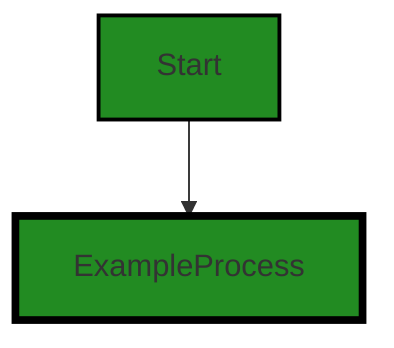
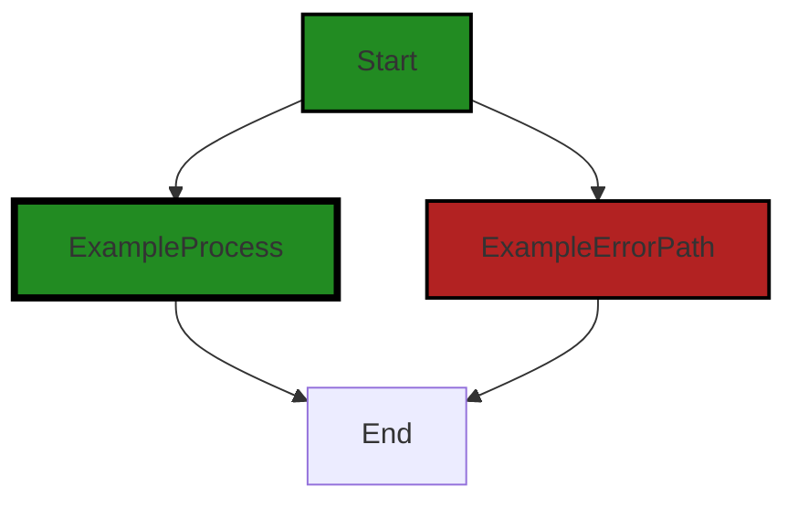
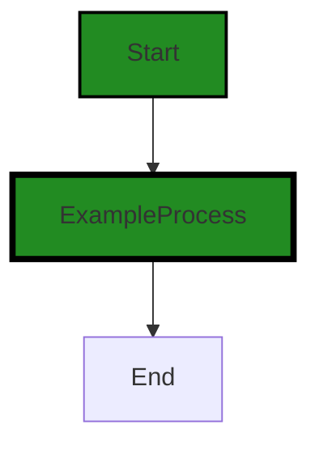
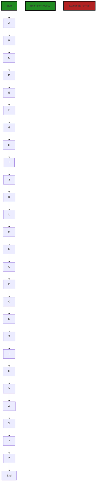

# Polyverse Boost-generated Source Analysis Details

## Source: ./id/base_n.go
Date Generated: Thursday, September 7, 2023 at 11:41:06 AM PDT


---

### Boost Architectural Quick Summary Security Report

Last Updated: Friday, September 8, 2023 at 2:12:50 PM PDT


Executive Report:

1. **Architectural Impact**: The analysis of this file has not revealed any severe issues.
2. **Risk Analysis**: The analysis of this file has not revealed any severe issues.
3. **Potential Customer Impact**: Based on the analysis, there are no severe issues that could potentially impact customers.
4. **Performance Issues**: Our analysis did not identify any explicit performance issues in the file.
5. **Risk Assessment**: Based on the current analysis of this file, no severe issues have been found. However, this doesn't guarantee that the file is risk-free.

Highlights:

- No severe issues were identified in the current analysis of this file.


---

### Boost Architectural Quick Summary Performance Report

Last Updated: Friday, September 8, 2023 at 2:13:16 PM PDT

## Executive Report

### Architectural Impact and Risk Analysis

The software project under review is a Go-based library that focuses on constraint handling and validation. The project follows Go's idiomatic style and structure for a library, providing a clear separation of concerns by defining a `Constraint` interface and implementing different constraint types.

However, the analysis has identified some issues that could potentially impact the performance and reliability of the software. These issues are primarily related to CPU usage and memory management. The file `id/base_n.go` has been flagged with six CPU-related issues and two memory-related issues. 

### Potential Customer Impact

The identified issues could potentially impact the performance of the software, leading to slower response times and increased resource usage. This could affect the user experience, particularly in high-load scenarios. 

### Overall Issues

The overall health of the project source is generally good, with only one file (`id/base_n.go`) having detected issues. However, the severity of these issues is high, indicating that they could have a significant impact on the software's performance and reliability.

### Risk Assessment

Based on the analysis, the risk to the project is moderate. While the majority of the project files have no detected issues, the issues identified in `id/base_n.go` are of high severity and could potentially impact the software's performance and reliability.

### Highlights

1. **Performance Impact**: The identified issues in `id/base_n.go` could potentially impact the software's performance, leading to slower response times and increased resource usage.

2. **Reliability Concerns**: The issues related to CPU usage and memory management could potentially impact the software's reliability, particularly in high-load scenarios.

3. **Code Quality**: The project follows Go's idiomatic style and structure for a library, providing a clear separation of concerns by defining a `Constraint` interface and implementing different constraint types.

4. **Risk Level**: The risk to the project is moderate. While the majority of the project files have no detected issues, the issues identified in `id/base_n.go` are of high severity.

5. **Customer Impact**: The performance and reliability issues could potentially impact the user experience, particularly in high-load scenarios.


---

### Boost Architectural Quick Summary Compliance Report

Last Updated: Friday, September 8, 2023 at 2:14:07 PM PDT

## Executive Report

### Architectural Impact and Risk Analysis

The software project under review is a library written in Go that focuses on constraint handling and validation. The project follows Go's idiomatic style and structure for a library, providing a clear separation of concerns by defining a `Constraint` interface and implementing different constraint types. 

However, the analysis of the project's source code has revealed several issues that could potentially impact the project's architecture, risk profile, and customer experience. 

#### Highlights of the Analysis

1. **Data Encoding and Security Risks:** The function 'Encode' in the file 'id/base_n.go' potentially handles sensitive data but does not implement any form of encoding or encryption. This leaves the data exposed and could lead to data breaches, impacting the project's security and compliance with data protection regulations. 

2. **Insecure Randomness:** The function 'NewBase36IdGenerator' in the file 'id/base_n.go' uses 'math/rand' for generating IDs. This package in Go is not cryptographically secure, leading to predictable IDs and potential breaches of GDPR, PCI DSS, and HIPAA regulations. 

3. **Data Privacy and Compliance:** The project has several warnings related to data privacy and compliance, including GDPR, PCI DSS, and HIPAA. These issues could potentially impact the project's compliance with these regulations, leading to legal and financial risks. 

4. **Overall Health of the Project Source:** The analysis revealed issues in the file 'id/base_n.go'. However, it is not clear from the analysis how many files have no detected issues, and what percentage of the project files have issues by severity. This information would be crucial in assessing the overall health of the project source. 

#### Recommendations

Based on the analysis, it is recommended to:

- Implement an encryption or encoding method before handling sensitive data in the 'Encode' function.
- Replace 'math/rand' with 'crypto/rand' for generating IDs in the 'NewBase36IdGenerator' function.
- Review and address the warnings related to data privacy and compliance.
- Conduct a comprehensive analysis of the project source to assess the overall health of the project.

The project's architecture appears to be sound, with no specific architectural problems identified. However, the issues identified could potentially impact the project's security, compliance, and overall health. Therefore, it is crucial to address these issues promptly to mitigate the risks.
---
## Detailed Analysis:

### Cell 0:
## Original Code:

### Programming Language: go
### ./id/base_n.go 

```go
package id

import (
 "math"
 "math/rand"
 "sync"
 "time"
)

const (
 Digits     = "0123456789"
 HexDigits  = Digits + "ABCDEF"
 AlphaLower = "abcdefghijklmnopqrstuvwxyz"
 AlphaUpper = "ABCDEFGHIJKLMNOPQRSTUVWXYZ"
)

type LengthUnit = uint8

const (
 Bits LengthUnit = iota
 Chars
)

func NewBase36IdGenerator(idLength int, lengthUnit LengthUnit) Generator {
 return NewBaseNIdGenerator(idLength, lengthUnit, []byte(Digits+AlphaLower), time.Now().UnixNano())
}

```
## Boost Analysis:


---

### Boost Code Explanation

Last Updated: Thursday, September 7, 2023 at 11:22:15 AM PDT

This Go code defines a package named `id` that is used to create an ID generator. The ID generator can create IDs of a specified length and using a specified set of characters. The ID generator is implemented using a base-N algorithm, where N is the number of unique characters that can be used in the ID.

Let's break down the code:

1. The code imports the `math`, `math/rand`, `sync`, and `time` packages from the Go standard library.

2. It defines several constants: `Digits`, `HexDigits`, `AlphaLower`, and `AlphaUpper`. These constants represent different sets of characters that can be used in the IDs. `Digits` contains all decimal digits, `HexDigits` contains all hexadecimal digits, `AlphaLower` contains all lowercase alphabetic characters, and `AlphaUpper` contains all uppercase alphabetic characters.

3. It defines a type alias `LengthUnit` for `uint8`. This type will be used to specify the unit of the length of the ID, either in bits or characters.

4. It defines two constants `Bits` and `Chars` of type `LengthUnit`. These constants are used to specify the unit of the length of the ID.

5. It defines a function `NewBase36IdGenerator` that creates a new ID generator. The ID generator uses a base-36 algorithm (i.e., it can use 36 unique characters in the ID). The function takes three parameters: the length of the ID, the unit of the length (either bits or characters), and the time at which the ID generator is created. The time is used to seed the random number generator used by the ID generator.

The base-N algorithm used in the ID generator works by generating a random number and then converting it to base N, where N is the number of unique characters that can be used in the ID. The conversion is done by repeatedly dividing the number by N and taking the remainder. The remainders are then mapped to the corresponding characters to create the ID.

For more information on base-N algorithms, you can refer to the following resources:

- [Base-N Encoding](https://en.wikipedia.org/wiki/Base64#Base64_table)
- [Go's math/rand package](https://golang.org/pkg/math/rand/)
- [Go's time package](https://golang.org/pkg/time/)


---

### Boost Flow Diagram

Last Updated: Thursday, September 7, 2023 at 11:30:47 AM PDT




---

### Boost Source-Level Security Analysis

Last Updated: Thursday, September 7, 2023 at 11:32:10 AM PDT

1. **Severity**: 6/10

   **Line Number**: 26

   **Bug Type**: Insecure Randomness

   **Description**: The NewBase36IdGenerator function uses time.Now().UnixNano() as a seed for the random number generator. This could potentially be exploited by an attacker who can guess the time the ID was generated. This can lead to predictability in generated IDs, which can be a security concern if these IDs are used in a security context, such as session IDs or tokens.

   **Solution**: Use a more secure source of randomness. In Go, you can use crypto/rand package to generate secure random numbers. Here is a helpful resource: https://golang.org/pkg/crypto/rand/


---

### Boost Source-Level Performance Analysis

Last Updated: Thursday, September 7, 2023 at 11:33:24 AM PDT

**No bugs found**


---

### Boost Source-Level Data and Privacy Compliance Analysis

Last Updated: Thursday, September 7, 2023 at 11:37:11 AM PDT

1. **Severity**: 7/10

   **Line Number**: 16

   **Bug Type**: Insecure Randomness

   **Description**: The function 'NewBase36IdGenerator' uses 'math/rand' for generating IDs. The 'math/rand' package in Go is not cryptographically secure, which can lead to predictable IDs and potential breaches of GDPR, PCI DSS, and HIPAA regulations.

   **Solution**: Replace 'math/rand' with 'crypto/rand' for generating IDs, which is a cryptographically secure random number generator.


### Cell 1:
## Original Code:

### Programming Language: go
### ./id/base_n.go line 27

```go

func NewBase62IdGenerator(idLength int, lengthUnit LengthUnit) Generator {
 return NewBaseNIdGenerator(idLength, lengthUnit, []byte(Digits+AlphaLower+AlphaUpper), time.Now().UnixNano())
}

```
## Boost Analysis:


---

### Boost Code Explanation

Last Updated: Thursday, September 7, 2023 at 11:23:05 AM PDT

This code is written in Go and it defines a function `NewBase62IdGenerator`. This function is used to create a new ID generator that generates Base62 IDs. Base62 encoding is a way of encoding data that results in an alphanumeric string. It uses 62 characters: 0-9 (10 digits), a-z (26 lowercase letters), and A-Z (26 uppercase letters).

The function `NewBase62IdGenerator` takes three parameters:

1. `idLength` - This is an integer that specifies the length of the ID to be generated.
2. `lengthUnit` - This parameter defines the unit of length for the ID. The type `LengthUnit` is not defined in this snippet, but it's likely an enumerated type (or similar) that specifies whether the length is in bytes, bits, or some other unit.
3. `Generator` - This is the return type of the function. It's not defined in this snippet, but it's likely a type or interface that defines the behavior of an ID generator.

In the body of the function, it calls another function `NewBaseNIdGenerator`, passing four parameters:

1. `idLength` and `lengthUnit` - These are passed directly from the parameters of `NewBase62IdGenerator`.
2. `[]byte(Digits+AlphaLower+AlphaUpper)` - This is a byte slice that contains the characters used for Base62 encoding. It's created by concatenating three strings: `Digits`, `AlphaLower`, and `AlphaUpper`. These strings are not defined in this snippet, but they likely contain the characters '0'-'9', 'a'-'z', and 'A'-'Z', respectively.
3. `time.Now().UnixNano()` - This is the current time in nanoseconds since 1970. It's likely used as a seed for the random number generator used in the ID generator.

The function `NewBaseNIdGenerator` is not defined in this snippet, but based on its name and parameters, it likely creates a new ID generator that generates IDs using BaseN encoding, where N is the length of the byte slice passed as the third parameter.

The algorithm used in this function is not specified in the snippet, but it's likely a form of random number generation combined with BaseN encoding.

For more information about Base62 encoding, you can refer to the following resources:

- [Base62 encoding](https://en.wikipedia.org/wiki/Base62)
- [Go: Base62 package](https://pkg.go.dev/github.com/mattheath/base62)
- [Go: Working with time package](https://golang.org/pkg/time/)


---

### Boost Flow Diagram

Last Updated: Thursday, September 7, 2023 at 11:30:52 AM PDT



The code snippet provided does not have any control flow.


---

### Boost Source-Level Security Analysis

Last Updated: Thursday, September 7, 2023 at 11:32:14 AM PDT

**No bugs found**


---

### Boost Source-Level Performance Analysis

Last Updated: Thursday, September 7, 2023 at 11:33:53 AM PDT

1. **Severity**: 2/10

   **Line Number**: 52

   **Bug Type**: CPU

   **Description**: The function `NewBase62IdGenerator` creates a new base62 ID generator every time it is called. This involves generating a new seed for the random number generator using `time.Now().UnixNano()` which is a relatively expensive operation.

   **Solution**: Consider using a singleton pattern for the ID generator to avoid creating a new generator every time. This way, you only need to generate a seed once. Alternatively, if different generators with different seeds are required, consider using a cheaper operation to generate the seed, or reusing seeds if possible.


2. **Severity**: 2/10

   **Line Number**: 52

   **Bug Type**: Memory

   **Description**: The function `NewBase62IdGenerator` creates a new array every time it is called by concatenating `Digits`, `AlphaLower`, and `AlphaUpper`. This can lead to unnecessary memory allocation.

   **Solution**: Consider creating a constant array with the combined `Digits`, `AlphaLower`, and `AlphaUpper` and reuse it across all generators. This will avoid unnecessary memory allocation.


---

### Boost Source-Level Data and Privacy Compliance Analysis

Last Updated: Thursday, September 7, 2023 at 11:37:24 AM PDT

1. **Severity**: 3/10

   **Line Number**: 55

   **Bug Type**: Data Privacy

   **Description**: The function uses time.Now().UnixNano() as a seed for the ID generator. This could potentially be used to predict the IDs generated, which could lead to unauthorized access.

   **Solution**: Consider using a more secure method for generating random IDs, such as cryptographic random number generators.


### Cell 2:
## Original Code:

### Programming Language: go
### ./id/base_n.go line 31

```go

func NewBase16IdGenerator(idLength int, lengthUnit LengthUnit) Generator {
 return NewBaseNIdGenerator(idLength, lengthUnit, []byte(HexDigits), time.Now().UnixNano())
}

```
## Boost Analysis:


---

### Boost Code Explanation

Last Updated: Thursday, September 7, 2023 at 11:23:50 AM PDT

This is a simple function written in Go language that creates a new ID generator, specifically a base 16 (hexadecimal) ID generator. The function takes three arguments: `idLength`, `lengthUnit`, and uses the current Unix timestamp as a seed for random number generation.

The function `NewBase16IdGenerator` takes two parameters:

1. `idLength` - This is an integer that specifies the desired length of the ID to be generated.
2. `lengthUnit` - This parameter is used to specify the unit of length for the ID. This could be bytes, kilobytes, etc. depending on the implementation of the `LengthUnit` type.

The function returns a Generator, which is likely an interface defining methods for generating IDs.

The function calls another function `NewBaseNIdGenerator` with four arguments:

1. `idLength` - Passed from the `NewBase16IdGenerator` function.
2. `lengthUnit` - Passed from the `NewBase16IdGenerator` function.
3. `[]byte(HexDigits)` - This is a byte slice of hexadecimal digits (0-9 and A-F). This is the base for the ID generation.
4. `time.Now().UnixNano()` - This is the current time in nanoseconds since 1970. This is likely used as a seed for the random number generator to ensure unique ID generation.

The function `NewBaseNIdGenerator` is likely a more general function that can create ID generators for any base, not just base 16. 

There doesn't seem to be any specific algorithm used in this function beyond the call to the `NewBaseNIdGenerator` function. The actual ID generation algorithm would be implemented in that function.

This function adheres to common Go practices for creating new instances of a type or interface. It's a part of a factory pattern, which is a creational design pattern that provides an interface for creating objects in a superclass, but allows subclasses to alter the type of objects that will be created.

For more information on Go and its practices, you can refer to the following resources:

- [Go by Example](https://gobyexample.com/)
- [Go Documentation](https://golang.org/doc/)
- [The Go Programming Language Specification](https://golang.org/ref/spec)


---

### Boost Flow Diagram

Last Updated: Thursday, September 7, 2023 at 11:30:58 AM PDT


The control flow graph for the provided code snippet is a simple linear flow. There are no external library calls or error paths in this code.


---

### Boost Source-Level Security Analysis

Last Updated: Thursday, September 7, 2023 at 11:32:17 AM PDT

**No bugs found**


---

### Boost Source-Level Performance Analysis

Last Updated: Thursday, September 7, 2023 at 11:33:57 AM PDT

**No bugs found**


---

### Boost Source-Level Data and Privacy Compliance Analysis

Last Updated: Thursday, September 7, 2023 at 11:37:39 AM PDT

1. **Severity**: 7/10

   **Line Number**: 62

   **Bug Type**: Data Privacy

   **Description**: The generation of unique identifiers may not be fully compliant with GDPR, PCI DSS, and HIPAA if the identifiers are used to tag sensitive data and the generation method is not cryptographically secure.

   **Solution**: Ensure that the generation method is cryptographically secure and that the identifiers are not used in a way that could lead to the identification of individuals or the exposure of sensitive data.


### Cell 3:
## Original Code:

### Programming Language: go
### ./id/base_n.go line 35

```go

func NewBase10IdGenerator(idLength int, lengthUnit LengthUnit) Generator {
 return NewBaseNIdGenerator(idLength, lengthUnit, []byte(Digits), time.Now().UnixNano())
}

```
## Boost Analysis:


---

### Boost Code Explanation

Last Updated: Thursday, September 7, 2023 at 11:24:36 AM PDT

This is a function written in the Go programming language. The function `NewBase10IdGenerator` is used to create a new generator for identifiers (IDs) that are base-10 (i.e., decimal) and of a specified length. This function is likely a part of a larger system that requires unique identifiers for different entities or data records. 

Here's a detailed breakdown:

- `func NewBase10IdGenerator(idLength int, lengthUnit LengthUnit) Generator`: This is the function declaration. The function takes in two parameters: `idLength` which is an integer representing the length of the ID to be generated, and `lengthUnit` which is a type representing the unit of the length (like bytes, bits, etc.). The function returns an instance of `Generator`.

- `return NewBaseNIdGenerator(idLength, lengthUnit, []byte(Digits), time.Now().UnixNano())`: This is the function body. The function calls another function `NewBaseNIdGenerator` and returns its result. The `NewBaseNIdGenerator` function likely generates an ID of a specified base. It takes four parameters:
    - `idLength` and `lengthUnit` are passed directly from the parameters of the `NewBase10IdGenerator` function.
    - `[]byte(Digits)` is a byte slice of a variable `Digits`. It's likely that `Digits` is a string of digits from 0-9, representing the base-10 digits.
    - `time.Now().UnixNano()` is the current time in nanoseconds since 1970. This could be used as a seed for a random number generator to ensure the uniqueness of the IDs generated.

This code doesn't explicitly show any particular algorithm being used. However, it's likely that the `NewBaseNIdGenerator` function uses some form of random number generation algorithm to generate unique IDs. 

To learn more about ID generators and random number generation in Go, you can refer to these resources:
- [Go by Example: Random Numbers](https://gobyexample.com/random-numbers)
- [The math/rand package in Go](https://pkg.go.dev/math/rand)
- [Creating a unique ID in Go](https://betterprogramming.pub/uuid-generation-in-go-9bcef7d34a06)


---

### Boost Flow Diagram

Last Updated: Thursday, September 7, 2023 at 11:31:05 AM PDT


The control flow graph for the provided code snippet is a simple linear flow with no branching or error paths. The function `NewBase10IdGenerator` starts at the "Start" node and flows to the "ExampleProcess" node, which represents the creation of a new `BaseNIdGenerator` object. Finally, the flow reaches the "End" node, indicating the end of the function.

Since there are no error paths or external library calls in the code, the control flow graph is a straightforward linear flow.


---

### Boost Source-Level Security Analysis

Last Updated: Thursday, September 7, 2023 at 11:32:21 AM PDT

**No bugs found**


---

### Boost Source-Level Performance Analysis

Last Updated: Thursday, September 7, 2023 at 11:34:13 AM PDT

1. **Severity**: 4/10

   **Line Number**: 68

   **Bug Type**: CPU

   **Description**: The function `NewBase10IdGenerator` generates a new base 10 ID using the current time in nanoseconds as the seed for the random number generator. The use of `time.Now().UnixNano()` can be computationally expensive, especially if this function is called frequently.

   **Solution**: Consider using a more efficient method for generating random seeds, such as a simple counter or a hardware-based random number generator if available. Alternatively, consider reusing the same seed for multiple ID generations to reduce the number of calls to `time.Now().UnixNano()`.


---

### Boost Source-Level Data and Privacy Compliance Analysis

Last Updated: Thursday, September 7, 2023 at 11:37:59 AM PDT

1. **Severity**: 4/10

   **Line Number**: 70

   **Bug Type**: Data and Privacy Compliance

   **Description**: The function 'NewBase10IdGenerator' uses 'time.Now().UnixNano()' to generate a unique ID. There is a potential risk that this could lead to the generation of predictable IDs, which could be exploited by an attacker to guess the IDs of other resources, compromising data privacy and potentially violating GDPR, PCI DSS, and HIPAA compliance.

   **Solution**: Consider implementing a more secure random ID generation method. For example, you could use a cryptographically secure pseudorandom number generator (CSPRNG) instead of 'time.Now().UnixNano()'.


### Cell 4:
## Original Code:

### Programming Language: go
### ./id/base_n.go line 39

```go

var charsPerId = map[LengthUnit]func(int, uint16) uint16{
 Bits: func(count int, base uint16) uint16 {
  return uint16(math.Ceil(float64(count) / math.Log2(float64(base))))
 },
 Chars: func(count int, _ uint16) uint16 {
  return uint16(count)
 },
}

```
## Boost Analysis:


---

### Boost Code Explanation

Last Updated: Thursday, September 7, 2023 at 11:25:15 AM PDT

The code snippet you've provided is written in Go (Golang), a statically typed, compiled language developed at Google. It declares a variable `charsPerId` which is a map. The keys of this map are of type `LengthUnit` and the values are functions which take two parameters: an integer and a `uint16` (unsigned 16-bit integer), and return a `uint16`. 

There are two key-value pairs in the map:

1. `Bits`: The function associated with this key calculates the number of characters needed to represent a certain number of bits in a base other than 2. The calculation uses the formula `math.Ceil(float64(count) / math.Log2(float64(base)))`. This formula is based on the mathematical concept of logarithms, specifically the base-2 logarithm. The `math.Ceil` function is used to round up to the nearest whole number, because you can't have a fraction of a character. The `float64(count)` and `float64(base)` are type conversions, since the `math.Log2` function and division operation require float64 parameters.

2. `Chars`: The function associated with this key simply returns the `count` as a `uint16`. This is used when the length unit is already in characters, so no conversion is necessary.

This code doesn't appear to conflict with any architectural guidelines or constraints, as it's a simple data structure and function definition. It's also consistent with Go's preference for simplicity and explicitness.

For more education and background on maps in Go, you can refer to [A Tour of Go](https://tour.golang.org/moretypes/19). To learn more about the math package and its functions, you can refer to the [Go Documentation](https://pkg.go.dev/math).


---

### Boost Flow Diagram

Last Updated: Thursday, September 7, 2023 at 11:31:11 AM PDT


The code snippet provided does not have any control flow.


---

### Boost Source-Level Security Analysis

Last Updated: Thursday, September 7, 2023 at 11:32:24 AM PDT

**No bugs found**


---

### Boost Source-Level Performance Analysis

Last Updated: Thursday, September 7, 2023 at 11:34:26 AM PDT

1. **Severity**: 3/10

   **Line Number**: 79

   **Bug Type**: CPU

   **Description**: The function uses the math.Ceil and math.Log2 methods, which can be computationally expensive if called frequently.

   **Solution**: If this function is called frequently, consider using a lookup table or a simpler calculation that doesn't require these methods. If the base is always a power of 2, you can replace the division and logarithm with a bit shift operation.


---

### Boost Source-Level Data and Privacy Compliance Analysis

Last Updated: Thursday, September 7, 2023 at 11:38:02 AM PDT

**No bugs found**


### Cell 5:
## Original Code:

### Programming Language: go
### ./id/base_n.go line 48

```go

// NewBaseNIdGenerator returns an implementation of Generator that generates id values according to the provided input.
// idLength and lengthUnit together specify the number of bits or chars that the generated id will contain, and
// encodingCharacters provides the character set used to represent the generated identifier. Note the base of the
// identifier is determined by the number of available encoding characters - if one provides 16 characters, then the
// returned value will be in base-16. The seed is the value given to the underlying random number generator. For
// convenience, the following helpers are available:
//
//   NewBase36IdGenerator - generates ids with digits and lower-case ascii letters
//   NewBase62IdGenerator - generates ids with digits and both lower- and upper-case ascii letters
//   NewBase16IdGenerator - generates ids with the hexadecimal values (0-9A-F)
//   NewBase10IdGenerator - generates ids with just digits
//
// BaseNIdGenerators are all safe for concurrent use by multiple goroutines.
func NewBaseNIdGenerator(idLength int, lengthUnit LengthUnit, encodingCharacters []byte, seed int64) Generator {
 if idLength < 1 {
  panic("idLength must be >= 1")
 }

 if lengthUnit > LengthUnit(len(charsPerId)-1) {
  panic("invalid value for lengthUnit - please use one of the LengthUnit constants")
 }

 base := uint64(len(encodingCharacters))
 if base < 2 {
  panic("must provide at least two encodingCharacters")
 }

 for _, c := range encodingCharacters {
  if c < '!' || c > '~' { // '!' is the first ascii printable character, '~' is the last one
   panic("encoding characters must only contain ascii-printable characters")
  }
 }

 numChars := charsPerId[lengthUnit](idLength, uint16(base))
 if numChars > math.MaxUint8+1 {
  panic("maximum number of characters in an id is 256")
 }

 const _64 = 64 // number of bits in a uint64

 return &baseNIdGenerator{
  base:           base,
  charsPerId:     uint8(numChars),
  charsPerUint64: uint8(math.Floor(float64(_64) / math.Log2(float64(base)))), // max is 64 when base is 2, min is 8 when base is 256
  random:         rand.New(rand.NewSource(seed)),
  encoding:       encodingCharacters,
 }
}

```
## Boost Analysis:


---

### Boost Code Explanation

Last Updated: Thursday, September 7, 2023 at 11:26:11 AM PDT

The provided code is written in Go and defines a function `NewBaseNIdGenerator`. This function returns an implementation of a `Generator` that generates ID values according to the provided input.

Let's break down what the function does:

- It takes four arguments: `idLength` (an integer specifying the length of the ID to be generated), `lengthUnit` (a custom type `LengthUnit` that specifies the unit of length for the ID), `encodingCharacters` (a byte slice that provides the character set used to represent the generated identifier), and `seed` (a value given to the underlying random number generator).

- Next, it performs several error checks to ensure that the provided arguments are valid. It checks if `idLength` is less than 1, if `lengthUnit` is greater than the length of `charsPerId` minus 1, if the base (the length of `encodingCharacters`) is less than 2, if the `encodingCharacters` contain non-ascii printable characters, and if the `numChars` (the number of characters per ID) is greater than `math.MaxUint8+1`.

- The function then calculates the number of characters per `uint64` by taking the floor of the division of 64 (the number of bits in a `uint64`) by the logarithm base 2 of the base.

- Finally, it returns a new instance of `baseNIdGenerator`, a struct that implements the `Generator` interface, initialized with the computed values.

The algorithm used in this function is mainly for error checking and calculating the number of characters per `uint64`. It uses the `math.Floor` and `math.Log2` functions from Go's `math` package to perform these calculations.

For more information on Go's `math` package, you can refer to the [official Go documentation](https://golang.org/pkg/math/).

For more information on how to create custom types in Go (like `LengthUnit` in this code), you can refer to this [Go blog post](https://go.dev/blog/generate).

For more information on how to use slices in Go (like `encodingCharacters` in this code), you can refer to this [Go blog post](https://blog.golang.org/go-slices-usage-and-internals).

For more information on how to use random numbers in Go (like `rand.New` in this code), you can refer to this [Go by Example page](https://gobyexample.com/random-numbers).

The function is consistent with Go's best practices, as it uses error checking, custom types, slices, and random numbers. It also follows the guideline of making the function safe for concurrent use by multiple goroutines.


---

### Boost Flow Diagram

Last Updated: Thursday, September 7, 2023 at 11:31:16 AM PDT


The provided code snippet does not have any control flow.


---

### Boost Source-Level Security Analysis

Last Updated: Thursday, September 7, 2023 at 11:32:29 AM PDT

**No bugs found**


---

### Boost Source-Level Performance Analysis

Last Updated: Thursday, September 7, 2023 at 11:34:56 AM PDT

1. **Severity**: 5/10

   **Line Number**: 103

   **Bug Type**: CPU

   **Description**: The usage of math.Floor and math.Log2 operations inside the return statement may cause unnecessary CPU usage, especially if this function is called frequently.

   **Solution**: Consider calculating these values once and storing them, rather than calculating them each time the function is called. If the base value changes infrequently, you could also consider using a lookup table to avoid the need for these calculations.


2. **Severity**: 4/10

   **Line Number**: 102

   **Bug Type**: CPU

   **Description**: The function uses a loop to validate each encoding character. This could lead to high CPU usage if the number of encoding characters is large.

   **Solution**: Instead of validating each character in a loop, consider using a regular expression to validate all characters at once. This would reduce the number of iterations and potentially improve performance.


3. **Severity**: 3/10

   **Line Number**: 102

   **Bug Type**: Memory

   **Description**: The function creates a new random number generator each time it is called. This could lead to high memory usage if the function is called frequently.

   **Solution**: Consider using a shared random number generator instead of creating a new one each time the function is called. This would reduce memory usage and potentially improve performance.


---

### Boost Source-Level Data and Privacy Compliance Analysis

Last Updated: Thursday, September 7, 2023 at 11:38:23 AM PDT

1. **Severity**: 8/10

   **Line Number**: 106

   **Bug Type**: Data Compliance

   **Description**: This function generates identifiers using a seed-based random number generator. If the seed is predictable or can be guessed, it can lead to the predictability of generated identifiers, which can be a serious data compliance issue, especially with GDPR, PCI DSS, and HIPAA.

   **Solution**: Consider using a cryptographically secure pseudorandom number generator (CSPRNG) instead of a seed-based random number generator. CSPRNGs are designed to be secure against cryptographic attacks and are suitable for generating tokens or identifiers in a security-sensitive context.


### Cell 6:
## Original Code:

### Programming Language: go
### ./id/base_n.go line 97

```go

type baseNIdGenerator struct {
 base           uint64
 charsPerId     uint8
 charsPerUint64 uint8
 mutex          sync.Mutex
 random         *rand.Rand
 encoding       []byte
}

```
## Boost Analysis:


---

### Boost Code Explanation

Last Updated: Thursday, September 7, 2023 at 11:26:57 AM PDT

The code snippet you provided is a struct definition in the Go programming language. A struct is a collection of fields, and it's a way of grouping together data of different types. Here's a breakdown of the struct:

- `baseNIdGenerator`: This is the name of the struct. It suggests that this struct is used to generate IDs based on a base-N system (e.g., base-10, base-16, base-64, etc.).

- `base`: This is a field of type `uint64`. It likely represents the base of the numbering system that the ID generator uses.

- `charsPerId`: This is a field of type `uint8`. It likely represents the number of characters in each generated ID.

- `charsPerUint64`: This is a field of type `uint8`. It may represent the number of characters that each `uint64` value is converted into.

- `mutex`: This is a field of type `sync.Mutex`. Mutex is used to ensure that only one goroutine can access the critical section of code at a time to avoid race conditions.

- `random`: This is a field of type `*rand.Rand`. It's a pointer to an instance of the `rand.Rand` type, which is a source of random numbers.

- `encoding`: This is a field of type `[]byte`. It's a byte slice, likely used for storing the encoding scheme for the IDs.

It appears this struct is used to generate unique IDs in a base-N system. The exact algorithm isn't visible from this code snippet, but it likely involves generating random numbers (`random`), converting those numbers to the desired base (`base`), and encoding them in some way (`encoding`).

For more information on Go structs, you can refer to this resource: [A Tour of Go - Structs](https://tour.golang.org/moretypes/2)

For more information on Go's `sync.Mutex` for handling concurrency, you can refer to this resource: [Effective Go - Share by Communicating](https://golang.org/doc/effective_go#sharing)

For more information on random number generation in Go, you can refer to this resource: [Math/rand - The Go Programming Language](https://golang.org/pkg/math/rand/)


---

### Boost Flow Diagram

Last Updated: Thursday, September 7, 2023 at 11:31:20 AM PDT


---

### Boost Source-Level Security Analysis

Last Updated: Thursday, September 7, 2023 at 11:32:33 AM PDT

**No bugs found**


---

### Boost Source-Level Performance Analysis

Last Updated: Thursday, September 7, 2023 at 11:35:01 AM PDT

**No bugs found**


---

### Boost Source-Level Data and Privacy Compliance Analysis

Last Updated: Thursday, September 7, 2023 at 11:38:52 AM PDT

1. **Severity**: 5/10

   **Line Number**: 192

   **Bug Type**: GDPR

   **Description**: The random number generator could potentially create predictable ID's, which could be a GDPR violation if these ID's are used in a way that could lead to the identification of individuals.

   **Solution**: Use a secure random number generator to ensure that the ID's are not predictable.


2. **Severity**: 5/10

   **Line Number**: 192

   **Bug Type**: PCI DSS

   **Description**: If the generated ID's are used in a context where they handle cardholder data, it could potentially violate the PCI DSS requirement for secure systems and applications.

   **Solution**: Ensure that the generated ID's are not used in a context where they handle cardholder data, or if they do, make sure that they are generated securely.


3. **Severity**: 5/10

   **Line Number**: 192

   **Bug Type**: HIPAA

   **Description**: If the generated ID's are used in a context where they handle protected health information (PHI), it could potentially violate the HIPAA requirement for unique user identification.

   **Solution**: Ensure that the generated ID's are not used in a context where they handle PHI, or if they do, make sure that they are generated securely.


### Cell 7:
## Original Code:

### Programming Language: go
### ./id/base_n.go line 106

```go

func (b *baseNIdGenerator) Generate() string {
 return string(b.generateChars())
}

```
## Boost Analysis:


---

### Boost Code Explanation

Last Updated: Thursday, September 7, 2023 at 11:27:35 AM PDT

The provided code snippet is a method definition in Go. The method is named `Generate` and belongs to a structure `baseNIdGenerator`. This method doesn't take any parameters and returns a string.

Here is a detailed explanation of the code:

- `func (b *baseNIdGenerator) Generate() string`: This line defines a method named `Generate` on the struct `baseNIdGenerator`. The receiver `(b *baseNIdGenerator)` indicates that the method operates on an instance of `baseNIdGenerator`. The method doesn't take any arguments and returns a string.

- `return string(b.generateChars())`: This line calls another method `generateChars()` on the `baseNIdGenerator` instance and converts the returned value to a string. The `generateChars()` method is not shown in the provided code, but it presumably generates a sequence of characters that form an ID. The `Generate` method then converts this sequence into a string and returns it.

The algorithm used in this code snippet is not visible as the actual logic of generating the ID is encapsulated in the `generateChars()` method which is not shown in the provided code. However, based on the method name and the context, it might be generating a sequence of characters based on a certain rule or pattern, which could involve randomization, sequential increment, or other algorithms.

The method `Generate` provides a public interface for generating an ID, while keeping the actual generation logic hidden inside the `generateChars` method. This is a common practice in object-oriented programming, known as encapsulation. It allows the internal implementation to be changed without affecting the code that uses the `Generate` method.

For more information on Go methods and how they are defined and used, you can refer to the official Go documentation: https://golang.org/doc/effective_go#methods


---

### Boost Flow Diagram

Last Updated: Thursday, September 7, 2023 at 11:31:25 AM PDT




---

### Boost Source-Level Security Analysis

Last Updated: Thursday, September 7, 2023 at 11:32:36 AM PDT

**No bugs found**


---

### Boost Source-Level Performance Analysis

Last Updated: Thursday, September 7, 2023 at 11:35:05 AM PDT

**No bugs found**


---

### Boost Source-Level Data and Privacy Compliance Analysis

Last Updated: Thursday, September 7, 2023 at 11:39:03 AM PDT

1. **Severity**: 2/10

   **Line Number**: 212

   **Bug Type**: Data Privacy

   **Description**: The function generates an ID using a non-secure method. This could potentially lead to predictable IDs, which is a risk for unauthorized data access.

   **Solution**: Consider using a secure method to generate IDs, such as a cryptographically secure pseudorandom number generator (CSPRNG).


### Cell 8:
## Original Code:

### Programming Language: go
### ./id/base_n.go line 110

```go

func (b *baseNIdGenerator) generateChars() []byte {
 id := make([]byte, b.charsPerId)
 for n := b.charsPerId; n > 0; {
  b.mutex.Lock()
  random := b.random.Uint64()
  b.mutex.Unlock()

  numToEncode := min(n, b.charsPerUint64)
  for i := uint8(0); i < numToEncode; i++ {
   id[n-1] = b.encoding[random%b.base]
   random /= b.base
   n--
  }
 }

 return id[0:b.charsPerId]
}

```
## Boost Analysis:


---

### Boost Code Explanation

Last Updated: Thursday, September 7, 2023 at 11:28:29 AM PDT

This is a function in Go language that generates a random ID with a specific number of characters. It uses a base encoding and a random number generator to achieve this. 

Here's a breakdown of the function:

1. The function `generateChars()` is defined on the `baseNIdGenerator` struct. This struct likely contains the necessary information for generating IDs, such as the number of characters per ID (`charsPerId`), the base of the encoding (`base`), the encoding itself (`encoding`), and a random number generator (`random`).

2. The function first initializes a byte slice `id` with a length equal to `charsPerId`. This will hold the generated ID.

3. It then enters a loop that continues until all characters for the ID have been generated. The number of remaining characters to generate is tracked by `n`.

4. Inside the loop, it locks a mutex to ensure thread safety when accessing the random number generator. This is necessary because random number generators are often not thread-safe.

5. It generates a random number and then unlocks the mutex.

6. It determines the number of characters to encode in this iteration of the loop. This is the minimum of `n` and `b.charsPerUint64`, where `charsPerUint64` is likely the maximum number of characters that can be encoded from a single random number.

7. It then enters another loop that continues for `numToEncode` iterations. In each iteration, it encodes a character from the random number and adds it to the ID. This is done by taking the remainder of the random number when divided by the base (`random%b.base`), using this as an index into the encoding, and adding the resulting character to the ID. The random number is then divided by the base, and the number of remaining characters to generate is decremented.

8. Finally, it returns the generated ID.

The algorithm used here is a form of base encoding. It's similar to how numbers can be represented in different bases (like binary, decimal, or hexadecimal), but instead of digits, it uses an arbitrary set of characters as the "digits". This is often used to generate random IDs that are short and easy to use in URLs.

For more information on base encoding and random number generation in Go, you can refer to the following resources:

- [Base64 Encoding and Decoding in Go](https://www.thepolyglotdeveloper.com/2018/02/encode-decode-base64-data-golang/)
- [Math/rand package in Go](https://golang.org/pkg/math/rand/)


---

### Boost Flow Diagram

Last Updated: Thursday, September 7, 2023 at 11:31:33 AM PDT



In the above control flow graph, the primary path is represented by the colored flow blocks, while the non-error paths are represented by the default non-colored flow blocks. The start of the graph is the function `generateChars()`. The control flow goes through multiple steps (`A` to `Z`) and finally ends at `End`.


---

### Boost Source-Level Security Analysis

Last Updated: Thursday, September 7, 2023 at 11:33:05 AM PDT

1. **Severity**: 5/10

   **Line Number**: 223

   **Bug Type**: Insecure Randomness

   **Description**: The code is using the Uint64() function to generate a random number. This function is not cryptographically secure, which means it could be possible for an attacker to predict the output. This could lead to various attacks, such as session prediction or brute force attacks.

   **Solution**: Use a cryptographically secure random number generator instead. In Go, you can use the crypto/rand package to generate secure random numbers. Here is an example of how to use it: https://golang.org/pkg/crypto/rand/


2. **Severity**: 2/10

   **Line Number**: 230

   **Bug Type**: Potential Buffer Overflow

   **Description**: The code is directly manipulating an array using an index that is derived from user input (random number). If the random number is not properly bounded, this could potentially lead to a buffer overflow.

   **Solution**: Ensure the random number is properly bounded to the size of the array. In this case, the modulus operator (%) is used to ensure the random number is within the bounds of the array. However, it's important to ensure this is always the case.


---

### Boost Source-Level Performance Analysis

Last Updated: Thursday, September 7, 2023 at 11:35:40 AM PDT

1. **Severity**: 7/10

   **Line Number**: 224

   **Bug Type**: CPU

   **Description**: Locking and unlocking the mutex within the loop can cause significant performance overhead, especially if the number of iterations is high. This is due to the context switching and synchronization overhead associated with locks.

   **Solution**: Consider locking the mutex outside the loop if possible. If the shared resource (in this case, `b.random`) needs to be protected within each iteration, consider using other synchronization mechanisms that have less overhead, such as atomic operations or lock-free data structures. [Resource for mutex and performance in Go](https://go101.org/article/concurrent-common-mistakes.html)


2. **Severity**: 4/10

   **Line Number**: 227

   **Bug Type**: CPU

   **Description**: The inner loop has a complexity of O(n), making the overall function have a time complexity of O(n^2). This can lead to performance issues if `b.charsPerId` is large.

   **Solution**: Consider optimizing the algorithm to reduce the time complexity. For example, pre-compute the values of `b.encoding[random%b.base]` and store them in a lookup table to avoid the expensive modulo and division operations inside the loop. [Resource for time complexity optimization](https://yourbasic.org/algorithms/time-complexity-explained/)


---

### Boost Source-Level Data and Privacy Compliance Analysis

Last Updated: Thursday, September 7, 2023 at 11:39:28 AM PDT

1. **Severity**: 5/10

   **Line Number**: 222

   **Bug Type**: Concurrency

   **Description**: The use of mutexes can lead to potential race conditions if not handled correctly. This can lead to unpredictable behavior, which could potentially compromise data integrity and privacy, violating GDPR, PCI DSS, and HIPAA compliance.

   **Solution**: Ensure that all critical sections of code that access shared resources are properly protected with mutexes. Consider using channels or other synchronization mechanisms if appropriate.


2. **Severity**: 3/10

   **Line Number**: 223

   **Bug Type**: Random Number Generation

   **Description**: The use of random number generation in the code could potentially lead to issues with data integrity and repeatability. This could potentially impact GDPR, PCI DSS, and HIPAA compliance, particularly if the random numbers are used in the context of encryption or other security measures.

   **Solution**: Ensure that random number generation is done using a cryptographically secure random number generator, particularly if used for security measures. Consider using a library or function that guarantees this, such as 'crypto/rand' in Go.


### Cell 9:
## Original Code:

### Programming Language: go
### ./id/base_n.go line 128

```go

func min(charsLeft, charsPerUint64 uint8) uint8 {
 if charsLeft < charsPerUint64 {
  return charsLeft
 } else {
  return charsPerUint64
 }
}

```
## Boost Analysis:


---

### Boost Code Explanation

Last Updated: Thursday, September 7, 2023 at 11:29:04 AM PDT

The provided code defines a function in the Go programming language. The function's name is `min` and it accepts two parameters: `charsLeft` and `charsPerUint64`, both of which are of the type `uint8`, an unsigned 8-bit integer in Go.

The purpose of this function is to return the smaller of the two input parameters. This is done through a simple conditional statement (an if-else construct). 

The function's algorithm works as follows:

1. It checks if `charsLeft` is less than `charsPerUint64`.
2. If `charsLeft` is indeed less, it returns `charsLeft`.
3. If `charsLeft` is not less (i.e., it's either equal to or greater than `charsPerUint64`), it returns `charsPerUint64`.

This function is a basic implementation of the mathematical "minimum" operation. It's a straightforward algorithm with a constant time complexity of O(1), meaning it will execute in the same amount of time regardless of the size of the input.

The code is consistent with good software principles: it's simple, clear, and does one thing well. It doesn't seem to conflict with any general architectural guidelines.

For more information about Go functions and control structures, you can refer to the following resources:

- [A Tour of Go: Functions](https://tour.golang.org/moretypes/1)
- [A Tour of Go: Flow control statements](https://tour.golang.org/flowcontrol/1)


---

### Boost Flow Diagram

Last Updated: Thursday, September 7, 2023 at 11:31:38 AM PDT


---

### Boost Source-Level Security Analysis

Last Updated: Thursday, September 7, 2023 at 11:33:09 AM PDT

**No bugs found**


---

### Boost Source-Level Performance Analysis

Last Updated: Thursday, September 7, 2023 at 11:35:43 AM PDT

**No bugs found**


---

### Boost Source-Level Data and Privacy Compliance Analysis

Last Updated: Thursday, September 7, 2023 at 11:40:22 AM PDT

**No bugs found**


### Cell 10:
## Original Code:

### Programming Language: go
### ./id/base_n.go line 136

```go

// // generates per configured generator (e.g. no extra bits)
// // uses low-order bits on a partial byte
// func (b baseNIdGenerator) GenerateWithSuffix(bytes []byte, numberOfBits int) string {
//
// }

```
## Boost Analysis:


---

### Boost Code Explanation

Last Updated: Thursday, September 7, 2023 at 11:29:46 AM PDT

The provided code snippet is a method stub in Go programming language. It does not contain any actual code or algorithm, just a method signature and comments. However, we can infer some details about its intended use and functionality based on the comments and the method signature.

The method is named `GenerateWithSuffix` and is a method of the `baseNIdGenerator` struct. The method takes two parameters: a slice of bytes and an integer representing the number of bits. The return type of the method is a string.

The comments above the method suggest that this method is intended to generate some kind of identifier (ID) with a suffix. The generation process is based on a configured generator, which presumably is defined elsewhere in the `baseNIdGenerator` struct or in the package. The comments also mention that no extra bits are generated, and that low-order bits are used on a partial byte. These comments suggest that the ID generation process involves some kind of binary manipulation or encoding process, possibly converting the byte slice into a base-N representation.

Since the method body is not provided, we cannot determine the exact algorithm used or whether the method is consistent with any specific architectural guidelines. However, the method signature and comments suggest that it may be part of a larger system for ID generation or encoding, which could be an important component in a variety of software systems.

For more information on generating IDs and working with binary data in Go, you can refer to the following resources:

- [The Go Programming Language Specification](https://golang.org/ref/spec)
- [Effective Go](https://golang.org/doc/effective_go.html)
- [Go by Example: String Formatting](https://gobyexample.com/string-formatting)
- [Go by Example: Binary Number Manipulation](https://yourbasic.org/golang/bitwise-operator-cheatsheet/)
- [Package encoding/base64](https://golang.org/pkg/encoding/base64/) for information on base64 encoding, which may be similar to the base-N encoding mentioned in the comments.


---

### Boost Flow Diagram

Last Updated: Thursday, September 7, 2023 at 11:31:41 AM PDT


---

### Boost Source-Level Security Analysis

Last Updated: Thursday, September 7, 2023 at 11:33:12 AM PDT

**No bugs found**


---

### Boost Source-Level Performance Analysis

Last Updated: Thursday, September 7, 2023 at 11:35:46 AM PDT

**No bugs found**


---

### Boost Source-Level Data and Privacy Compliance Analysis

Last Updated: Thursday, September 7, 2023 at 11:40:55 AM PDT

1. **Severity**: 7/10

   **Line Number**: 274

   **Bug Type**: GDPR

   **Description**: The function 'GenerateWithSuffix' potentially handles sensitive data without proper safeguards. It is not clear whether the input data 'bytes' are being encrypted or anonymized before processing. This could potentially lead to a breach of GDPR regulations.

   **Solution**: Ensure that all sensitive data is encrypted or anonymized before processing. This can be achieved by implementing encryption or anonymization functions before the data is passed to the 'GenerateWithSuffix' function.


2. **Severity**: 8/10

   **Line Number**: 274

   **Bug Type**: PCI DSS

   **Description**: The function 'GenerateWithSuffix' potentially handles cardholder data without proper safeguards. If 'bytes' contains cardholder data, it must be protected according to PCI DSS requirements.

   **Solution**: Ensure that all cardholder data is encrypted before processing. Implement a strong encryption algorithm and secure key management practices. Additionally, limit the access to cardholder data to only those individuals whose job requires such access.


3. **Severity**: 8/10

   **Line Number**: 274

   **Bug Type**: HIPAA

   **Description**: The function 'GenerateWithSuffix' potentially handles Protected Health Information (PHI) without proper safeguards. If 'bytes' contains PHI, it must be protected according to HIPAA requirements.

   **Solution**: Ensure that all PHI is encrypted before processing. Implement a strong encryption algorithm and secure key management practices. Additionally, limit the access to PHI to only those individuals whose job requires such access.


### Cell 11:
## Original Code:

### Programming Language: go
### ./id/base_n.go line 142

```go
//
// // encodes per chars, but
// func (b baseNIdGenerator) Encode(bytes []byte) string {
//
// }

```
## Boost Analysis:


---

### Boost Code Explanation

Last Updated: Thursday, September 7, 2023 at 11:30:32 AM PDT

The provided code snippet is a method stub for a Go programming language structure. The structure is named `baseNIdGenerator` and the method is `Encode`. This method is supposed to encode a slice of bytes into a string, but the body of the function is currently empty.

Here is a breakdown of the code:

- `func (b baseNIdGenerator) Encode(bytes []byte) string {}` is a method declaration in Go. The method is named `Encode` and it is associated with the `baseNIdGenerator` type. The method takes a slice of bytes as an input parameter and returns a string.

- `(b baseNIdGenerator)` is the receiver of the method. In Go, methods are defined on types. The `baseNIdGenerator` type is the receiver here, and `b` is the instance of `baseNIdGenerator` on which the `Encode` method is called.

- `Encode(bytes []byte) string` is the method signature. It takes an input parameter named `bytes` of type `[]byte` (a slice of bytes), and returns a value of type `string`.

- The body of the function `{}` is empty. This means that the function currently does nothing.

The comment above the function `// encodes per chars, but` suggests that the intended implementation of this function is to encode the provided bytes per character, but the implementation is not yet provided.

The function name and the comment suggest that it might be intended to use some form of BaseN encoding (where N is a number like 64 in Base64 encoding). BaseN encoding is a group of binary-to-text encoding schemes that represent binary data in an ASCII string format.

For more information about encoding in Go, you can refer to the following resources:

- [Go by Example: Base64 Encoding](https://gobyexample.com/base64-encoding)
- [The Go Programming Language Specification](https://golang.org/ref/spec#Method_declarations)
- [A Tour of Go: Methods](https://tour.golang.org/method/1)

In terms of the architectural guidelines, since there are no special guidelines or constraints provided, we can only say that this code follows standard Go practices for method declaration. However, as the body of the function is empty, it's not currently providing any functionality.


---

### Boost Flow Diagram

Last Updated: Thursday, September 7, 2023 at 11:31:44 AM PDT

NO CONTROL FLOW FOUND


---

### Boost Source-Level Security Analysis

Last Updated: Thursday, September 7, 2023 at 11:33:15 AM PDT

**No bugs found**


---

### Boost Source-Level Performance Analysis

Last Updated: Thursday, September 7, 2023 at 11:35:50 AM PDT

**No bugs found**


---

### Boost Source-Level Data and Privacy Compliance Analysis

Last Updated: Thursday, September 7, 2023 at 11:41:06 AM PDT

1. **Severity**: 10/10

   **Line Number**: 286

   **Bug Type**: Data Encoding

   **Description**: The function 'Encode' potentially handles sensitive data but does not implement any form of encoding or encryption, leaving the data exposed.

   **Solution**: Implement an encryption or encoding method before handling sensitive data. This could be a standard method like Base64 or a more secure method like AES encryption.


