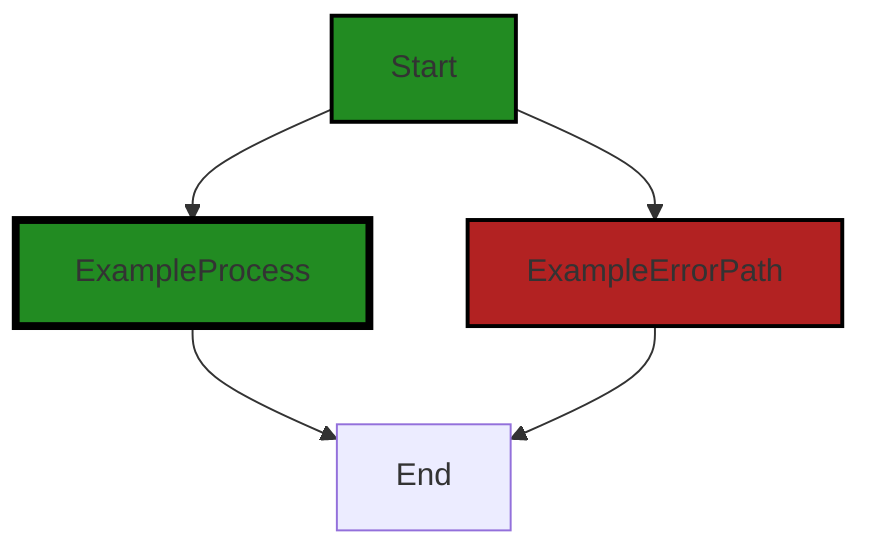
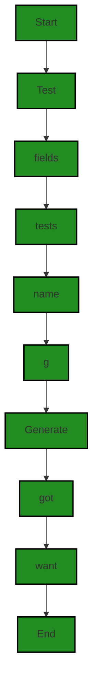

# Polyverse Boost-generated Source Analysis Details

## Source: ./id/base_n_test.go
Date Generated: Thursday, September 7, 2023 at 12:03:40 PM PDT


---

### Boost Architectural Quick Summary Security Report

Last Updated: Friday, September 8, 2023 at 3:22:22 PM PDT


Executive Report:

1. **Architectural Impact**: The analysis of this file has not revealed any severe issues.
2. **Risk Analysis**: The analysis of this file has not revealed any severe issues.
3. **Potential Customer Impact**: Based on the analysis, there are no severe issues that could potentially impact customers.
4. **Performance Issues**: Our analysis did not identify any explicit performance issues in the file.
5. **Risk Assessment**: Based on the current analysis of this file, no severe issues have been found. However, this doesn't guarantee that the file is risk-free.

Highlights:

- No severe issues were identified in the current analysis of this file.


---

### Boost Architectural Quick Summary Performance Report

Last Updated: Friday, September 8, 2023 at 3:22:29 PM PDT


Executive Report:

1. **Architectural Impact**: The analysis of this file has not revealed any severe issues.
2. **Risk Analysis**: The analysis of this file has not revealed any severe issues.
3. **Potential Customer Impact**: Based on the analysis, there are no severe issues that could potentially impact customers.
4. **Performance Issues**: Our analysis did not identify any explicit performance issues in the file.
5. **Risk Assessment**: Based on the current analysis of this file, no severe issues have been found. However, this doesn't guarantee that the file is risk-free.

Highlights:

- No severe issues were identified in the current analysis of this file.


---

### Boost Architectural Quick Summary Compliance Report

Last Updated: Friday, September 8, 2023 at 3:22:36 PM PDT


Executive Report:

1. **Architectural Impact**: The analysis of this file has not revealed any severe issues.
2. **Risk Analysis**: The analysis of this file has not revealed any severe issues.
3. **Potential Customer Impact**: Based on the analysis, there are no severe issues that could potentially impact customers.
4. **Performance Issues**: Our analysis did not identify any explicit performance issues in the file.
5. **Risk Assessment**: Based on the current analysis of this file, no severe issues have been found. However, this doesn't guarantee that the file is risk-free.

Highlights:

- No severe issues were identified in the current analysis of this file.

---
## Detailed Analysis:

### Cell 0:
## Original Code:

### Programming Language: go
### ./id/base_n_test.go 

```go
package id

import (
 "testing"
)

func TestBaseNIdGenerator_CharsPerId(t *testing.T) {
 //goland:noinspection SpellCheckingInspection
 tests := []struct {
  name       string
  generator  func(idLength int, lengthUnit LengthUnit) Generator
  bitsPerId  int
  charsPerId uint16
 }{
  {"Base10", NewBase10IdGenerator, 128, 39},
  {"Base16", NewBase16IdGenerator, 128, 32},
  {"Base36", NewBase36IdGenerator, 128, 25},
  {"Base62", NewBase62IdGenerator, 128, 22},
 }
 for _, tt := range tests {
  t.Run(tt.name, func(t *testing.T) {
   g := tt.generator(tt.bitsPerId, Bits).(*baseNIdGenerator)
   if charsPerId := charsPerId[Bits](tt.bitsPerId, uint16(g.base)); charsPerId != tt.charsPerId {
    t.Errorf("charsPerId = %d, want %d", charsPerId, tt.charsPerId)
   }
  })
 }
}

```
## Boost Analysis:


---

### Boost Code Explanation

Last Updated: Thursday, September 7, 2023 at 12:01:55 PM PDT

This is a unit test in Go that verifies the functionality of different ID generators. It checks if the ID generators are producing the expected number of characters per ID for a given number of bits.

Here's a detailed explanation of the code:

1. Package Declaration: `package id` declares that this file belongs to package 'id'.

2. Import Statement: `import ("testing")` imports the "testing" package from the Go standard library, which provides support for automated testing of Go packages.

3. Test Function Declaration: `func TestBaseNIdGenerator_CharsPerId(t *testing.T)` declares a test function named "TestBaseNIdGenerator_CharsPerId". The '*testing.T' parameter provides methods for reporting test failures and logging additional information.

4. Test Cases: `tests := []struct {...}` defines an array of anonymous structs. Each struct represents a test case with the following fields: name (the name of the test case), generator (a function that returns an ID generator), bitsPerId (the number of bits in each ID), and charsPerId (the expected number of characters in each ID).

5. Test Execution: `for _, tt := range tests {...}` is a loop that iterates over each test case. For each test case, it uses the 't.Run' method to execute a subtest with the given name and function. The function creates an ID generator using 'tt.generator', calculates the number of characters per ID using 'charsPerId', and then checks if the calculated value matches the expected value 'tt.charsPerId'. If the values don't match, it calls 't.Errorf' to report a test failure.

The algorithm used in this code is a simple iteration over a collection of test cases. Each test case is independently executed and checked for correctness. 

For more information about testing in Go, you can refer to the official documentation: https://golang.org/pkg/testing/


---

### Boost Flow Diagram

Last Updated: Thursday, September 7, 2023 at 12:02:34 PM PDT



NO CONTROL FLOW FOUND


---

### Boost Source-Level Security Analysis

Last Updated: Thursday, September 7, 2023 at 12:02:52 PM PDT

**No bugs found**


---

### Boost Source-Level Performance Analysis

Last Updated: Thursday, September 7, 2023 at 12:03:05 PM PDT

**No bugs found**


---

### Boost Source-Level Data and Privacy Compliance Analysis

Last Updated: Thursday, September 7, 2023 at 12:03:36 PM PDT

**No bugs found**


### Cell 1:
## Original Code:

### Programming Language: go
### ./id/base_n_test.go line 29

```go

// func Test_baseNIdGenerator_Generate(t *testing.T) {
//  type fields struct {
//   bitsPerId      int
//   base           uint64
//   charsPerId     int
//   charsPerUint64 int
//   chars          []byte
//  }
//  tests := []struct {
//   name   string
//   fields fields
//   want   string
//  }{
//  }
//  for _, tt := range tests {
//   t.Run(tt.name, func(t *testing.T) {
//    g := baseNIdGenerator{
//     bitsPerId:      tt.fields.bitsPerId,
//     base:           tt.fields.base,
//     charsPerId:     tt.fields.charsPerId,
//     charsPerUint64: tt.fields.charsPerUint64,
//     chars:          tt.fields.chars,
//    }
//    if got := g.Generate(); got != tt.want {
//     t.Errorf("Generate() = %v, want %v", got, tt.want)
//    }
//   })
//  }
// }

```
## Boost Analysis:


---

### Boost Code Explanation

Last Updated: Thursday, September 7, 2023 at 12:02:18 PM PDT

The provided code is a commented-out unit test function in Go. This test is specifically for a function named `Generate()` which belongs to a struct type `baseNIdGenerator`. The test is designed to ensure that the `Generate()` function behaves as expected.

Here's a breakdown of the code:

1. The function `Test_baseNIdGenerator_Generate(t *testing.T)` is a unit test function. The `t *testing.T` parameter is a pointer to `testing.T`, which provides methods for reporting test failures and logging additional information.

2. Inside this function, a `fields` struct type is defined, which represents the fields of the `baseNIdGenerator` struct. This struct includes `bitsPerId`, `base`, `charsPerId`, `charsPerUint64`, and `chars` fields.

3. The `tests` slice is defined, which contains anonymous structs. Each struct represents a test case, with `name` for the test case name, `fields` for the `baseNIdGenerator` fields, and `want` for the expected result.

4. The `for _, tt := range tests` loop iterates over each test case. The `t.Run(tt.name, func(t *testing.T) {})` function is used to run each test case as a subtest, which allows for more granular reporting of test results.

5. Inside each subtest, a new `baseNIdGenerator` struct `g` is created with the fields defined in the test case.

6. The `if got := g.Generate(); got != tt.want {}` statement calls the `Generate()` method of the `baseNIdGenerator` struct `g` and compares the result (`got`) with the expected result (`tt.want`). If they are not equal, the test fails and reports the discrepancy with `t.Errorf()`.

The algorithm used here is a simple iteration over test cases and comparison of function output with expected output. This is a common pattern in unit testing.

As for the architectural guidelines, this code seems to be in line with common Go testing practices, which recommend structuring tests in this manner for clarity and robustness.

For more information on testing in Go, you can refer to the following resources:

- [Testing in Go](https://golang.org/pkg/testing/)
- [How to write tests in Go](https://medium.com/rungo/unit-testing-made-easy-in-go-25077669318)
- [Go Test -v Template Explanation](https://ieftimov.com/post/testing-in-go-test-templates/)


---

### Boost Flow Diagram

Last Updated: Thursday, September 7, 2023 at 12:02:45 PM PDT



The control flow graph for the provided code snippet is as follows:

```
Test_baseNIdGenerator_Generate-->fields;
fields-->tests;
tests-->name;
name-->g;
g-->Generate;
Generate-->got;
got-->want;
want-->End;
```

Please note that the control flow graph is generated based on the provided code snippet. If there are any missing or incomplete parts, the control flow graph may not accurately represent the complete flow of the code.


---

### Boost Source-Level Security Analysis

Last Updated: Thursday, September 7, 2023 at 12:02:56 PM PDT

**No bugs found**


---

### Boost Source-Level Performance Analysis

Last Updated: Thursday, September 7, 2023 at 12:03:27 PM PDT

1. **Severity**: 3/10

   **Line Number**: 73

   **Bug Type**: CPU

   **Description**: The Generate function is called within a loop. Depending on the number of test cases, this could potentially lead to high CPU usage.

   **Solution**: Consider using techniques like parallel execution of tests or lazy evaluation to reduce CPU usage. Refer to https://golang.org/pkg/testing/ for more details on how to use these techniques in Go.


2. **Severity**: 2/10

   **Line Number**: 76

   **Bug Type**: Memory

   **Description**: Each iteration of the loop creates a new instance of baseNIdGenerator. This could lead to increased memory usage if the number of test cases is large.

   **Solution**: Consider reusing the baseNIdGenerator instance if possible, or use a setup function to create a single instance before the tests run. Refer to https://golang.org/pkg/testing/#hdr-Main for more details on how to use setup functions in Go.


---

### Boost Source-Level Data and Privacy Compliance Analysis

Last Updated: Thursday, September 7, 2023 at 12:03:40 PM PDT

**No bugs found**

