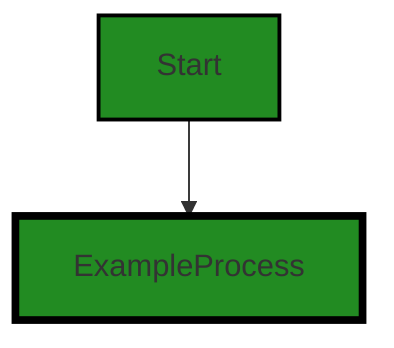

# Polyverse Boost-generated Source Analysis Details

## Source: ./id/idgenerator.go
Date Generated: Thursday, September 7, 2023 at 12:45:02 PM PDT


---

### Boost Architectural Quick Summary Security Report

Last Updated: Friday, September 8, 2023 at 3:18:34 PM PDT


Executive Report:

1. **Architectural Impact**: The analysis of this file has not revealed any severe issues.
2. **Risk Analysis**: The analysis of this file has not revealed any severe issues.
3. **Potential Customer Impact**: Based on the analysis, there are no severe issues that could potentially impact customers.
4. **Performance Issues**: Our analysis did not identify any explicit performance issues in the file.
5. **Risk Assessment**: Based on the current analysis of this file, no severe issues have been found. However, this doesn't guarantee that the file is risk-free.

Highlights:

- No severe issues were identified in the current analysis of this file.


---

### Boost Architectural Quick Summary Performance Report

Last Updated: Friday, September 8, 2023 at 3:18:41 PM PDT


Executive Report:

1. **Architectural Impact**: The analysis of this file has not revealed any severe issues.
2. **Risk Analysis**: The analysis of this file has not revealed any severe issues.
3. **Potential Customer Impact**: Based on the analysis, there are no severe issues that could potentially impact customers.
4. **Performance Issues**: Our analysis did not identify any explicit performance issues in the file.
5. **Risk Assessment**: Based on the current analysis of this file, no severe issues have been found. However, this doesn't guarantee that the file is risk-free.

Highlights:

- No severe issues were identified in the current analysis of this file.


---

### Boost Architectural Quick Summary Compliance Report

Last Updated: Friday, September 8, 2023 at 3:18:47 PM PDT


Executive Report:

1. **Architectural Impact**: The analysis of this file has not revealed any severe issues.
2. **Risk Analysis**: The analysis of this file has not revealed any severe issues.
3. **Potential Customer Impact**: Based on the analysis, there are no severe issues that could potentially impact customers.
4. **Performance Issues**: Our analysis did not identify any explicit performance issues in the file.
5. **Risk Assessment**: Based on the current analysis of this file, no severe issues have been found. However, this doesn't guarantee that the file is risk-free.

Highlights:

- No severe issues were identified in the current analysis of this file.

---
## Detailed Analysis:

### Cell 0:
## Original Code:

### Programming Language: go
### ./id/idgenerator.go 

```go
package id

type Generator interface {
 Generate() string
}

```
## Boost Analysis:


---

### Boost Code Explanation

Last Updated: Thursday, September 7, 2023 at 12:44:10 PM PDT

This is a very simple piece of Go (Golang) code that defines a package named `id` and an interface within it named `Generator`. 

An interface in Go is a custom data type that sets a contract for certain methods. In this case, the `Generator` interface has a contract for a method named `Generate()` that returns a `string`. 

Any type that defines a method with this exact signature (i.e., a method named `Generate` that takes no arguments and returns a `string`) is said to implement the `Generator` interface. 

For example, you might have a `UUIDGenerator` type that generates a UUID (Universally Unique Identifier) as a string, or a `RandomStringGenerator` that generates a random string. As long as these types define a `Generate` method that returns a string, they implement the `Generator` interface.

This interface might be used in a context where you need to generate IDs, but the exact method of generation can vary. For example, you might have a function that creates a new user and needs to generate a unique ID for that user. By accepting a `Generator` as an argument, this function can generate the ID in any way that fulfills the `Generator` contract, without needing to know the specifics.

Here's an example of how this might be used:

```
type UUIDGenerator struct {}

func (g UUIDGenerator) Generate() string {
	// Generate a UUID and return it as a string.
}

func CreateUser(g Generator) User {
	id := g.Generate() // This could use any generator that implements the Generator interface.
	user := User{ID: id}
	return user
}
```

In this example, `CreateUser` doesn't care how IDs are generated, as long as they are a string. This is a good example of the Dependency Inversion Principle, one of the SOLID principles of object-oriented design, which suggests that high-level modules should not depend on low-level modules - both should depend on abstractions.

For more information on interfaces in Go, you can refer to the official Go documentation: [https://golang.org/doc/effective_go#interfaces](https://golang.org/doc/effective_go#interfaces)


---

### Boost Flow Diagram

Last Updated: Thursday, September 7, 2023 at 12:44:23 PM PDT




---

### Boost Source-Level Security Analysis

Last Updated: Thursday, September 7, 2023 at 12:44:36 PM PDT

**No bugs found**


---

### Boost Source-Level Performance Analysis

Last Updated: Thursday, September 7, 2023 at 12:44:51 PM PDT

**No bugs found**


---

### Boost Source-Level Data and Privacy Compliance Analysis

Last Updated: Thursday, September 7, 2023 at 12:45:02 PM PDT

**No bugs found**

