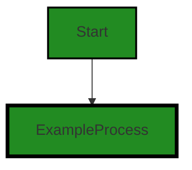

# Polyverse Boost-generated Source Analysis Details

## Source: ./id/uint.go
Date Generated: Thursday, September 7, 2023 at 12:26:36 PM PDT


---

### Boost Architectural Quick Summary Security Report

Last Updated: Friday, September 8, 2023 at 3:00:06 PM PDT


Executive Report:

1. **Architectural Impact**: The analysis of this file has not revealed any severe issues.
2. **Risk Analysis**: The analysis of this file has not revealed any severe issues.
3. **Potential Customer Impact**: Based on the analysis, there are no severe issues that could potentially impact customers.
4. **Performance Issues**: Our analysis did not identify any explicit performance issues in the file.
5. **Risk Assessment**: Based on the current analysis of this file, no severe issues have been found. However, this doesn't guarantee that the file is risk-free.

Highlights:

- No severe issues were identified in the current analysis of this file.


---

### Boost Architectural Quick Summary Performance Report

Last Updated: Friday, September 8, 2023 at 3:00:12 PM PDT


Executive Report:

1. **Architectural Impact**: The analysis of this file has not revealed any severe issues.
2. **Risk Analysis**: The analysis of this file has not revealed any severe issues.
3. **Potential Customer Impact**: Based on the analysis, there are no severe issues that could potentially impact customers.
4. **Performance Issues**: Our analysis did not identify any explicit performance issues in the file.
5. **Risk Assessment**: Based on the current analysis of this file, no severe issues have been found. However, this doesn't guarantee that the file is risk-free.

Highlights:

- No severe issues were identified in the current analysis of this file.


---

### Boost Architectural Quick Summary Compliance Report

Last Updated: Friday, September 8, 2023 at 3:00:19 PM PDT


Executive Report:

1. **Architectural Impact**: The analysis of this file has not revealed any severe issues.
2. **Risk Analysis**: The analysis of this file has not revealed any severe issues.
3. **Potential Customer Impact**: Based on the analysis, there are no severe issues that could potentially impact customers.
4. **Performance Issues**: Our analysis did not identify any explicit performance issues in the file.
5. **Risk Assessment**: Based on the current analysis of this file, no severe issues have been found. However, this doesn't guarantee that the file is risk-free.

Highlights:

- No severe issues were identified in the current analysis of this file.

---
## Detailed Analysis:

### Cell 0:
## Original Code:

### Programming Language: go
### ./id/uint.go 

```go
package id

import (
 "fmt"
 "strconv"
)

type Uint uint

func (u Uint) Format(f fmt.State, c rune) {
 if width, ok := f.Width(); ok {
  _, _ = fmt.Fprintf(f, "%0*d", width, uint(u))
 } else {
  _, _ = fmt.Fprint(f, uint(u))
 }
}

```
## Boost Analysis:


---

### Boost Code Explanation

Last Updated: Thursday, September 7, 2023 at 12:25:10 PM PDT

This Go code defines a package called `id` and a type `Uint`, which is a type alias for Go's built-in `uint` type. It also defines a `Format` method for the `Uint` type, which allows it to satisfy the `fmt.Formatter` interface.

The `fmt.Formatter` interface in Go is used by types that want to control their own output when used in format strings with the `fmt` package. This interface has a single method, `Format`, which takes a `fmt.State` and a `rune`.

The `fmt.State` interface provides access to the destination for output and has methods to access the requested formatting. The `rune` is the verb that was used in the format string.

The `Format` method in this code checks if a width has been specified in the format string. If it has, it uses `fmt.Fprintf` to write a formatted string to `f` (which implements the `io.Writer` interface), with a format string of `"%0*d"`. This format string is saying to print an integer (`d`), left-padded with zeros (`0`), to a total width of `width` characters.

If no width has been specified in the format string, it simply uses `fmt.Fprint` to write the `uint` value of `u` to `f`.

The two underscores (`_, _ =`) are used to explicitly ignore the two return values of `fmt.Fprintf` and `fmt.Fprint` (the number of bytes written and any error that occurred).

This code doesn't appear to use any specific algorithms, it's primarily using the Go standard library's `fmt` package to control the formatting of the `Uint` type when it's used in format strings.

For more information on the `fmt` package and formatting in Go, you can refer to the following resources:

- [Package fmt](https://golang.org/pkg/fmt/)
- [String Formatting in Go](https://gobyexample.com/string-formatting)


---

### Boost Flow Diagram

Last Updated: Thursday, September 7, 2023 at 12:25:55 PM PDT




---

### Boost Source-Level Security Analysis

Last Updated: Thursday, September 7, 2023 at 12:26:06 PM PDT

**No bugs found**


---

### Boost Source-Level Performance Analysis

Last Updated: Thursday, September 7, 2023 at 12:26:20 PM PDT

**No bugs found**


---

### Boost Source-Level Data and Privacy Compliance Analysis

Last Updated: Thursday, September 7, 2023 at 12:26:33 PM PDT

**No bugs found**


### Cell 1:
## Original Code:

### Programming Language: go
### ./id/uint.go line 17

```go

func (u Uint) String() string {
 return strconv.FormatUint(uint64(u), 10)
}

```
## Boost Analysis:


---

### Boost Code Explanation

Last Updated: Thursday, September 7, 2023 at 12:25:41 PM PDT

This Go code defines a method `String()` on an instance `u` of type `Uint`. This method converts the unsigned integer `u` to a string and returns it. 

Let's break down the code:

- `func (u Uint) String() string`: This is a method named `String` defined on the type `Uint`. It returns a `string`. In Go, you can define methods on types. This method takes no parameters other than the receiver `u`. 

- `strconv.FormatUint(uint64(u), 10)`: This is a function call to `FormatUint` from the `strconv` package in Go's standard library. It converts the unsigned integer `u` to a string. The function takes two parameters: an unsigned integer and a base for the conversion. In this case, `uint64(u)` is the unsigned integer to be converted and `10` is the base. The base `10` means that the resulting string will be in decimal format.

The algorithm used here is simple: it's a type conversion from an unsigned integer to a string. This is a common operation in many programming languages. In Go, you can use the `strconv` package to perform conversions between strings and other data types.

For more information on the `strconv` package, you can refer to the official Go documentation: [strconv - The Go Programming Language](https://golang.org/pkg/strconv/).

Regarding the architectural guidelines, since there are no additional special architectural guidelines or constraints provided for this software project, we can say that this code is consistent with common Go practices. The use of the `strconv` package for type conversion is a standard approach in Go.


---

### Boost Flow Diagram

Last Updated: Thursday, September 7, 2023 at 12:25:59 PM PDT


---

### Boost Source-Level Security Analysis

Last Updated: Thursday, September 7, 2023 at 12:26:10 PM PDT

**No bugs found**


---

### Boost Source-Level Performance Analysis

Last Updated: Thursday, September 7, 2023 at 12:26:23 PM PDT

**No bugs found**


---

### Boost Source-Level Data and Privacy Compliance Analysis

Last Updated: Thursday, September 7, 2023 at 12:26:36 PM PDT

**No bugs found**

