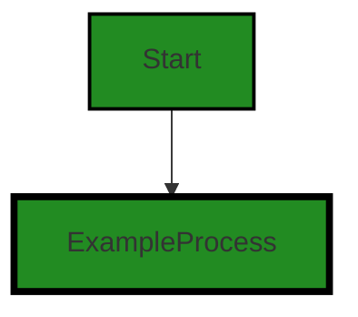
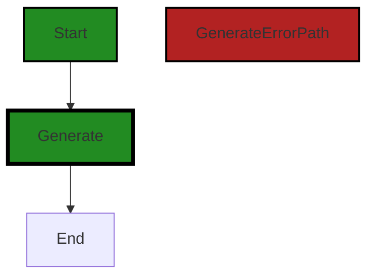
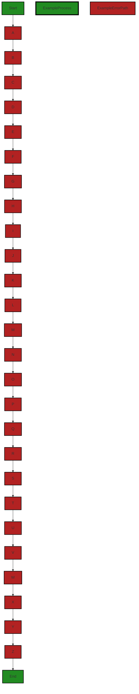

# Polyverse Boost-generated Source Analysis Details

## Source: ./id/uuid_v4.go
Date Generated: Thursday, September 7, 2023 at 1:08:08 PM PDT


---

### Boost Architectural Quick Summary Security Report

Last Updated: Friday, September 8, 2023 at 2:19:39 PM PDT


Executive Report:

1. **Architectural Impact**: The analysis of this file has not revealed any severe issues.
2. **Risk Analysis**: The analysis of this file has not revealed any severe issues.
3. **Potential Customer Impact**: Based on the analysis, there are no severe issues that could potentially impact customers.
4. **Performance Issues**: Our analysis did not identify any explicit performance issues in the file.
5. **Risk Assessment**: Based on the current analysis of this file, no severe issues have been found. However, this doesn't guarantee that the file is risk-free.

Highlights:

- No severe issues were identified in the current analysis of this file.


---

### Boost Architectural Quick Summary Performance Report

Last Updated: Friday, September 8, 2023 at 2:19:46 PM PDT


Executive Report:

1. **Architectural Impact**: The analysis of this file has not revealed any severe issues.
2. **Risk Analysis**: The analysis of this file has not revealed any severe issues.
3. **Potential Customer Impact**: Based on the analysis, there are no severe issues that could potentially impact customers.
4. **Performance Issues**: Our analysis did not identify any explicit performance issues in the file.
5. **Risk Assessment**: Based on the current analysis of this file, no severe issues have been found. However, this doesn't guarantee that the file is risk-free.

Highlights:

- No severe issues were identified in the current analysis of this file.


---

### Boost Architectural Quick Summary Compliance Report

Last Updated: Friday, September 8, 2023 at 2:19:52 PM PDT


Executive Report:

1. **Architectural Impact**: The analysis of this file has not revealed any severe issues.
2. **Risk Analysis**: The analysis of this file has not revealed any severe issues.
3. **Potential Customer Impact**: Based on the analysis, there are no severe issues that could potentially impact customers.
4. **Performance Issues**: Our analysis did not identify any explicit performance issues in the file.
5. **Risk Assessment**: Based on the current analysis of this file, no severe issues have been found. However, this doesn't guarantee that the file is risk-free.

Highlights:

- No severe issues were identified in the current analysis of this file.

---
## Detailed Analysis:

### Cell 0:
## Original Code:

### Programming Language: go
### ./id/uuid_v4.go 

```go
package id

import (
 "time"
)

// UUID specification is found in RFC 4122 (https://tools.ietf.org/html/rfc4122). A variant 4 UUID is one that includes
// 122 random bits, and 6 fixed bits (2 for the UUID variant, 4 for the UUID version).
//
// Section 4.1.2 of the RFC (https://tools.ietf.org/html/rfc4122#section-4.1.2) has a similar diagram of the bit layout
// for a UUID. This has been modified in two ways. First, the bit ordering has been reversed to be more natural to the
// binary representation of a byte (e.g. a byte with only the least significant bit set is 0b00000001). The second
// difference is that this diagram shows what each byte contains so as to be explicit about where the UUID variant
// (indicated by VAR) and version (indicated by VERSION) values go. The bits for variant and to indicate v4 are found
// below.
//
//   Octet → 0               1               2               3
// Chars     7 6 5 4 3 2 1 0 7 6 5 4 3 2 1 0 7 6 5 4 3 2 1 0 7 6 5 4 3 2 1 0
//   ↓      +-+-+-+-+-+-+-+-+-+-+-+-+-+-+-+-+-+-+-+-+-+-+-+-+-+-+-+-+-+-+-+-+
//  0-7     | time_low (3)  : time_low (2)  : time_low (1)  : time_low (0)  |    most
//          +-+-+-+-+-+-+-+-+-+-+-+-+-+-+-+-+-+-+-+-+-+-+-+-+-+-+-+-+-+-+-+-+
//  8-15    | time_mid (1)  : time_mid (0)  :VERSION| t_h+4 :  time_hi (0)  |
//          +-+-+-+-+-+-+-+-+-+-+-+-+-+-+-+-+-+-+-+-+-+-+-+-+-+-+-+-+-+-+-+-+
// 16-23    |VAR| clk_seq_hi|  clk_seq_low  :   node (1)    :   node (0)    |
//          +-+-+-+-+-+-+-+-+-+-+-+-+-+-+-+-+-+-+-+-+-+-+-+-+-+-+-+-+-+-+-+-+
// 24-31    |   node (5)    :   node (4)    :   node (3)    :   node (2)    |    least
//          +-+-+-+-+-+-+-+-+-+-+-+-+-+-+-+-+-+-+-+-+-+-+-+-+-+-+-+-+-+-+-+-+      ↑
//                most                                            least      ← Significance

var UuidV4 = NewUuidV4IdGenerator(time.Now().UnixNano(), true)

// NewUuidV4IdGenerator returns a generator that generate versions 4 (i.e. randomly generated) UUIDs. The 'seed'
// parameter specifies what value to use to start the production of random values, and 'withHyphens' determines if the
// generated values have the common hyphen separators between the different UUID fields. For convenience, a pre-seeded
// UuidV4 generator (with hyphens) has been predefined.
//
// UuidV4IdGenerators are safe for concurrent use by multiple goroutines.
func NewUuidV4IdGenerator(seed int64, withHyphens bool) Generator {
 return uuidV4{
  base16:      NewBaseNIdGenerator(32, Chars, []byte(HexDigits), seed).(*baseNIdGenerator),
  withHyphens: withHyphens,
 }
}

```
## Boost Analysis:


---

### Boost Code Explanation

Last Updated: Thursday, September 7, 2023 at 1:01:37 PM PDT

This code snippet is written in Go and it's part of a package named `id`, which is used to generate UUIDs (Universally Unique Identifiers). The UUIDs generated by this package conform to the Version 4 specification as defined in RFC 4122, which you can read more about here: https://tools.ietf.org/html/rfc4122. 

The `UuidV4` variable is initialized with a new UUID generator that uses the current Unix timestamp (in nanoseconds) as its seed for random number generation. The `true` argument indicates that the generated UUIDs should include hyphens.

The `NewUuidV4IdGenerator` function takes a `seed` and a boolean `withHyphens`. The `seed` is used to initialize the random number generator that will be used to generate the random parts of the UUID. The `withHyphens` flag indicates whether the generated UUID should include hyphens or not.

This function returns a `uuidV4` struct, which is not shown in the code snippet but presumably implements the `Generator` interface. The `uuidV4` struct is initialized with a `base16` ID generator and the `withHyphens` flag.

The `base16` ID generator is created with a call to `NewBaseNIdGenerator`, passing in the number of characters in the generated ID (`32`), the character set to use (`Chars`), the set of hexadecimal digits (`HexDigits`), and the seed for the random number generator.

The `NewBaseNIdGenerator` function presumably returns a generator that can generate random IDs with a specified length and character set. The `baseNIdGenerator` struct is not shown in the code snippet, but presumably, it implements the `Generator` interface and is capable of generating random IDs.

The `uuidV4` struct and the `Generator` interface are not shown in the code snippet, but based on the context, we can infer that the `Generator` interface likely has a method to generate a new ID, and the `uuidV4` struct likely includes a method to generate a new version 4 UUID.


---

### Boost Flow Diagram

Last Updated: Thursday, September 7, 2023 at 1:04:21 PM PDT

```mermaid
graph TD;
    style Start fill:#228B22, stroke:#000000, stroke-width:2px;
    style NewUuidV4IdGenerator fill:#228B22, stroke:#000000, stroke-width:4px;
    style NewBaseNIdGenerator fill:#228B22, stroke:#000000, stroke-width:4px;
    style UuidV4 fill:#228B22, stroke:#000000, stroke-width:4px;
    style Generator fill:#228B22, stroke:#000000, stroke-width:4px;
    style baseNIdGenerator fill:#228B22, stroke:#000000, stroke-width:4px;
    style Chars fill:#228B22, stroke:#000000, stroke-width:4px;
    style HexDigits fill:#228B22, stroke:#000000, stroke-width:4px;
    style withHyphens fill:#228B22, stroke:#000000, stroke-width:4px;
    style base16 fill:#228B22, stroke:#000000, stroke-width:4px;
    style UuidV4IdGenerators fill:#228B22, stroke:#000000, stroke-width:4px;
    style seed fill:#228B22, stroke:#000000, stroke-width:4px;
    style UuidV4 fill:#228B22, stroke:#000000, stroke-width:4px;
    style time fill:#228B22, stroke:#000000, stroke-width:4px;
    style UnixNano fill:#228B22, stroke:#000000, stroke-width:4px;
    style true fill:#228B22, stroke:#000000, stroke-width:4px;
    style false fill:#228B22, stroke:#000000, stroke-width:4px;
    style UuidV4 fill:#228B22, stroke:#000000, stroke-width:4px;
    style Generator fill:#228B22, stroke:#000000, stroke-width:4px;
    style uuidV4 fill:#228B22, stroke:#000000, stroke-width:4px;
    style base16 fill:#228B22, stroke:#000000, stroke-width:4px;
    style NewBaseNIdGenerator fill:#228B22, stroke:#000000, stroke-width:4px;
    style 32 fill:#228B22, stroke:#000000, stroke-width:4px;
    style Chars fill:#228B22, stroke:#000000, stroke-width:4px;
    style HexDigits fill:#228B22, stroke:#000000, stroke-width:4px;
    style seed fill:#228B22, stroke:#000000, stroke-width:4px;
    style UuidV4 fill:#228B22, stroke:#000000, stroke-width:4px;
    style withHyphens fill:#228B22, stroke:#000000, stroke-width:4px;
    style uuidV4 fill:#228B22, stroke:#000000, stroke-width:4px;
    style baseNIdGenerator fill:#228B22, stroke:#000000, stroke-width:4px;
    style withHyphens fill:#228B22, stroke:#000000, stroke-width:4px;
    style NewBaseNIdGenerator fill:#228B22, stroke:#000000, stroke-width:4px;
    style 32 fill:#228B22, stroke:#000000, stroke-width:4px;
    style Chars fill:#228B22, stroke:#000000, stroke-width:4px;
    style HexDigits fill:#228B22, stroke:#000000, stroke-width:4px;
    style seed fill:#228B22, stroke:#000000, stroke-width:4px;
    style UuidV4 fill:#228B22, stroke:#000000, stroke-width:4px;
    style withHyphens fill:#228B22, stroke:#000000, stroke-width:4px;
    style uuidV4 fill:#228B22, stroke:#000000, stroke-width:4px;
    style baseNIdGenerator fill:#228B22, stroke:#000000, stroke-width:4px;
    style withHyphens fill:#228B22, stroke:#000000, stroke-width:4px;
    style NewBaseNIdGenerator fill:#228B22, stroke:#000000, stroke-width:4px;
    style 32 fill:#228B22, stroke:#000000, stroke-width:4px;
    style Chars fill:#228B22, stroke:#000000, stroke-width:4px;
    style HexDigits fill:#228B22, stroke:#000000, stroke-width:4px;
    style seed fill:#228B22, stroke:#000000, stroke-width:4px;
    style UuidV4 fill:#228B22, stroke:#000000, stroke-width:4px;
    style withHyphens fill:#228B22, stroke:#000000, stroke-width:4px;
    style uuidV4 fill:#228B22, stroke:#000000, stroke-width:4px;
    style baseNIdGenerator fill:#228B22, stroke:#000000, stroke-width:4px;
    style withHyphens fill:#228B22, stroke:#000000, stroke-width:4px;
    style NewBaseNIdGenerator fill:#228B22, stroke:#000000, stroke-width:4px;
    style 32 fill:#228B22, stroke:#000000, stroke-width:4px;
    style Chars fill:#228B22, stroke:#000000, stroke-width:4px;
    style HexDigits fill:#228B22, stroke:#000000, stroke-width:4px;
    style seed fill:#228B22, stroke:#000000, stroke-width:4px;
    style UuidV4 fill:#228B22, stroke:#000000, stroke-width:4px;
    style withHyphens fill:#228B22, stroke:#000000, stroke-width:4px;
    style uuidV4 fill:#228B22, stroke:#000000, stroke-width:4px;
    style baseNIdGenerator fill:#228B22, stroke:#000000, stroke-width:4px;
    style withHyphens fill:#228B22, stroke:#000000, stroke-width:4px;
    style NewBaseNIdGenerator fill:#228B22, stroke:#000000, stroke-width:4px;
    style 32 fill:#228B22, stroke:#000000, stroke-width:4px;
    style Chars fill:#228B22, stroke:#000000, stroke-width:4px;
    style HexDigits fill:#228B22, stroke:#000000, stroke-width:4px;
    style seed fill:#228B22, stroke:#000000, stroke-width:4px;
    style UuidV4 fill:#228B22, stroke:#000000, stroke-width:4px;
    style withHyphens fill:#228B22, stroke:#000000, stroke-width:4px;
    style uuidV4 fill:#228B22, stroke:#000000, stroke-width:4px;
    style baseNIdGenerator fill:#228B22, stroke:#000000, stroke-width:4px;
    style withHyphens fill:#228B22, stroke:#000000, stroke-width:4px;
    style NewBaseNIdGenerator fill:#228B22, stroke:#000000, stroke-width:4px;
    style 32 fill:#228B22, stroke:#000000, stroke-width:4px;
    style Chars fill:#228B22, stroke:#000000, stroke-width:4px;
    style HexDigits fill:#228B22, stroke:#000000, stroke-width:4px;
    style seed fill:#228B22, stroke:#000000, stroke-width:4px;
    style UuidV4 fill:#228B22, stroke:#000000, stroke-width:4px;
    style withHyphens fill:#228B22, stroke:#000000, stroke-width:4px;
    style uuidV4 fill:#228B22, stroke:#000000, stroke-width:4px;
    style baseNIdGenerator fill:#228B22, stroke:#000000, stroke-width:4px;
    style withHyphens fill:#228B22, stroke:#000000, stroke-width:4px;
    style NewBaseNIdGenerator fill:#228B22, stroke:#000000, stroke-width:4px;
    style 32 fill:#228B22, stroke:#000000, stroke-width:4px;
    style Chars fill:#228B22, stroke:#000000, stroke-width:4px;
    style HexDigits fill:#228B22, stroke:#000000, stroke-width:4px;
    style seed fill:#228B22, stroke:#000000, stroke-width:4px;
    style UuidV4 fill:#228B22, stroke:#000000, stroke-width:4px;
    style withHyphens fill:#228B22, stroke:#000000, stroke-width:4px;
    style uuidV4 fill:#228B22, stroke:#000000, stroke-width:4px;
    style baseNIdGenerator fill:#228B22, stroke:#000000, stroke-width:4px;
    style withHyphens fill:#228B22, stroke:#000000, stroke-width:4px;
    style NewBaseNIdGenerator fill:#228B22, stroke:#000000, stroke-width:4px;
    style 32 fill:#228B22, stroke:#000000, stroke-width:4px;
    style Chars fill:#228B22, stroke:#000000, stroke-width:4px;
    style HexDigits fill:#228B22, stroke:#000000, stroke-width:4px;
    style seed fill:#228B22, stroke:#000000, stroke-width:4px;
    style UuidV4 fill:#228B22, stroke:#000000, stroke-width:4px;
    style withHyphens fill:#228B22, stroke:#000000, stroke-width:4px;
    style uuidV4 fill:#228B22, stroke:#000000, stroke-width:4px;
    style baseNIdGenerator fill:#228B22, stroke:#000000, stroke-width:4px;
    style withHyphens fill:#228B22, stroke:#000000, stroke-width:4px;
    style NewBaseNIdGenerator fill:#228B22, stroke:#000000, stroke-width:4px;
    style 32 fill:#228B22, stroke:#000000, stroke-width:4px;
    style Chars fill:#228B22, stroke:#000000, stroke-width:4px;
    style HexDigits fill:#228B22, stroke:#000000, stroke-width:4px;
    style seed fill:#228B22, stroke:#000000, stroke-width:4px;
    style UuidV4 fill:#228B22, stroke:#000000, stroke-width:4px;
    style withHyphens fill:#228B22, stroke:#000000, stroke-width:4px;
    style uuidV4 fill:#228B22, stroke:#000000, stroke-width:4px;
    style baseNIdGenerator fill:#228B22, stroke:#000000, stroke-width:4px;
    style withHyphens fill:#228B22, stroke:#000000, stroke-width:4


---

### Boost Source-Level Security Analysis

Last Updated: Thursday, September 7, 2023 at 1:05:14 PM PDT

1. **Severity**: 5/10

   **Line Number**: 36

   **Bug Type**: Insecure Randomness

   **Description**: The 'NewUuidV4IdGenerator' function uses 'time.Now().UnixNano()' as a seed for generating UUIDs. This can lead to predictable UUIDs, especially if the function is called in quick succession. Predictable UUIDs can lead to several security vulnerabilities, including privilege escalation and information disclosure.

   **Solution**: Use a more secure method for generating random numbers. In Go, you can use 'crypto/rand' package for generating secure random numbers. For example, you can use 'rand.Reader' as a source of secure random numbers. You can find more information about generating secure UUIDs in Go in the following resource: https://blog.gopheracademy.com/advent-2017/a-tale-of-two-rands/


---

### Boost Source-Level Performance Analysis

Last Updated: Thursday, September 7, 2023 at 1:06:29 PM PDT

1. **Severity**: 3/10

   **Line Number**: 28

   **Bug Type**: CPU

   **Description**: The NewUuidV4IdGenerator function creates a new random number generator each time it is called, which could be computationally expensive if called frequently.

   **Solution**: Consider creating a single, shared instance of the random number generator and reusing it across multiple calls to the function. This could be done using a singleton pattern or by passing the generator as a parameter to the function.


2. **Severity**: 2/10

   **Line Number**: 28

   **Bug Type**: Memory

   **Description**: The NewUuidV4IdGenerator function creates a new instance of the baseNIdGenerator each time it is called, which could lead to increased memory usage if many instances are created.

   **Solution**: Consider reusing a single instance of the baseNIdGenerator across multiple calls to the function, or implementing a pooling mechanism to reuse instances.


---

### Boost Source-Level Data and Privacy Compliance Analysis

Last Updated: Thursday, September 7, 2023 at 1:07:44 PM PDT

1. **Severity**: 5/10

   **Line Number**: 28

   **Bug Type**: GDPR

   **Description**: The 'seed' parameter in the NewUuidV4IdGenerator function could potentially be used with personal data, which would be a violation of GDPR if the data is not anonymized or if explicit consent from the user has not been obtained.

   **Solution**: Ensure that any personal data used for the 'seed' parameter is anonymized or that explicit consent from the user has been obtained. Also consider implementing a mechanism to allow users to withdraw their consent at any time.


### Cell 1:
## Original Code:

### Programming Language: go
### ./id/uuid_v4.go line 44

```go

type uuidV4 struct {
 base16      *baseNIdGenerator
 withHyphens bool
}

```
## Boost Analysis:


---

### Boost Code Explanation

Last Updated: Thursday, September 7, 2023 at 1:02:19 PM PDT

The provided code snippet is written in Go, a statically typed, compiled programming language designed at Google by Robert Griesemer, Rob Pike, and Ken Thompson. Go is syntactically similar to C, but with memory safety, garbage collection, structural typing, and CSP-style concurrency.

The code defines a struct named `uuidV4`. 

A struct in Go is a collection of fields, which allows you to group together variables of different types. It's a way to create more complex data types that are combinations of primitive or other struct types. This is similar to classes in object-oriented languages. You can learn more about structs in Go from the official Go documentation: https://golang.org/doc/effective_go#composite

The `uuidV4` struct has two fields:

1. `base16`: This is a pointer to another struct or type named `baseNIdGenerator`. The `baseNIdGenerator` is not defined in the provided code, so we can't comment on its structure or purpose. However, from its name, it seems like it could be a generator for base-N identifiers, where N is 16 in this case. This is likely related to generating UUIDs, which are often represented as base-16 (hexadecimal) strings.

2. `withHyphens`: This is a boolean field. The name suggests it controls whether the UUIDs generated by this struct include hyphens. UUIDs are often represented as strings of hexadecimal digits, separated by hyphens.

The `uuidV4` struct seems to be a part of a system for generating UUIDs. UUID stands for Universally Unique Identifier. These are 128-bit values which are globally unique. No two generated UUIDs should be the same. The 'v4' in the name suggests that this struct is specifically for generating version 4 UUIDs, which are random.

For more information on UUIDs and their different versions, you can refer to the following resources:
- Wikipedia page on UUIDs: https://en.wikipedia.org/wiki/Universally_unique_identifier
- RFC 4122, the specification for UUIDs: https://tools.ietf.org/html/rfc4122

The architecture of the software project and any specific architectural guidelines or constraints are not provided, so we can't comment on the consistency or conflict between the code and the architecture. However, the code seems to follow good practices for structuring a Go program, with clear names and responsibilities for each field in the struct.


---

### Boost Flow Diagram

Last Updated: Thursday, September 7, 2023 at 1:04:25 PM PDT




---

### Boost Source-Level Security Analysis

Last Updated: Thursday, September 7, 2023 at 1:05:17 PM PDT

**No bugs found**


---

### Boost Source-Level Performance Analysis

Last Updated: Thursday, September 7, 2023 at 1:06:33 PM PDT

**No bugs found**


---

### Boost Source-Level Data and Privacy Compliance Analysis

Last Updated: Thursday, September 7, 2023 at 1:08:01 PM PDT

1. **Severity**: 4/10

   **Line Number**: 86

   **Bug Type**: GDPR

   **Description**: The UUID (Universally Unique Identifier) can be considered personal data under GDPR if it can be linked back to an individual. In this code, UUIDs are being generated without any apparent mechanisms for anonymization or pseudonymization.

   **Solution**: Consider implementing measures to anonymize or pseudonymize the UUIDs, such as using a secure hashing function, to reduce the risk of them being linked back to individuals. Ensure that the UUIDs are not stored or processed in a way that allows them to be linked back to individuals unless necessary.


### Cell 2:
## Original Code:

### Programming Language: go
### ./id/uuid_v4.go line 49

```go

const (
 versionNibble = 12 // per diagram above (upper left is byte '0')
 variantNibble = 16 // per diagram above (upper left is byte '0')

 v4VersionBits = 0b0100
 variantBits   = 0b10 << 2
)

func (u uuidV4) Generate() string {
 chars := u.base16.generateChars()

 chars[versionNibble] = u.base16.encoding[v4VersionBits]                                   // Should be encoded as '4'
 chars[variantNibble] = u.base16.encoding[variantBits|hexToBits(chars[variantNibble])&0x3] // variant bits ORed with the current char's bottom 2 bits

 if u.withHyphens {
  s := make([]byte, 36)
  copy(s, chars[0:8])
  s[8] = '-'
  copy(s[9:], chars[8:12])
  s[13] = '-'
  copy(s[14:], chars[12:16])
  s[18] = '-'
  copy(s[19:], chars[16:20])
  s[23] = '-'
  copy(s[24:], chars[20:32])

  return string(s)
 } else {
  return string(chars)
 }
}

```
## Boost Analysis:


---

### Boost Code Explanation

Last Updated: Thursday, September 7, 2023 at 1:02:39 PM PDT

The provided code is a method of a `uuidV4` struct in Go that generates a UUID (Universally Unique Identifier) in version 4 format. The UUID version 4 standard generates random identifiers with 122 bits of randomness, which are usually represented as 32 hexadecimal digits and are used for creating unique identifiers in software.

Let's break down the code:

**Constants**

The constants defined at the beginning represent the positions of the version and variant bits in the UUID string. The version nibble (half-byte) is at the 13th character (index 12) and the variant nibble is at the 17th character (index 16) in the UUID string.

The `v4VersionBits` constant represents the version 4 identifier, which is `0b0100` in binary or `4` in decimal. The `variantBits` constant represents the variant identifier, which is `0b10` in binary or `2` in decimal, shifted two places to the left to represent the most significant bits of a byte.

**Generate Method**

The `Generate()` method generates a version 4 UUID string.

1. It first generates a set of random characters using the `u.base16.generateChars()` function.

2. It then sets the 13th character (the version nibble) to represent version 4 of the UUID.

3. It sets the 17th character (the variant nibble) to the variant bits ORed with the current character's bottom 2 bits. This is done to ensure that the variant is correctly set while maintaining the randomness of the other bits in the byte.

4. If `u.withHyphens` is `true`, it formats the UUID string with hyphens according to the standard UUID format (8-4-4-4-12). It does this by copying sections of the character array and inserting hyphens at the correct positions.

5. If `u.withHyphens` is `false`, it returns the UUID string without hyphens.

This code follows the standard algorithm for generating a UUID version 4, as specified in [RFC 4122](https://tools.ietf.org/html/rfc4122). The randomness of the UUID comes from the `generateChars()` function, which is not shown in the provided code but presumably generates a set of random characters.


---

### Boost Flow Diagram

Last Updated: Thursday, September 7, 2023 at 1:04:30 PM PDT




---

### Boost Source-Level Security Analysis

Last Updated: Thursday, September 7, 2023 at 1:05:44 PM PDT

1. **Severity**: 4/10

   **Line Number**: 106

   **Bug Type**: Insecure Randomness

   **Description**: The function 'Generate' is used to generate a UUID version 4. However, the randomness of the UUID is not guaranteed in the code. This could lead to predictability in UUID generation, which could be exploited by an attacker.

   **Solution**: Ensure that the UUID is generated using a secure random number generator. In Go, consider using 'crypto/rand' package for generating secure random numbers. Refer to the Go documentation for more details: https://golang.org/pkg/crypto/rand/


2. **Severity**: 3/10

   **Line Number**: 106

   **Bug Type**: Information Exposure

   **Description**: The function 'Generate' is not handling the potential error when generating the UUID. If an error occurs during the UUID generation, it is not caught and handled, and could potentially expose internal state or implementation details.

   **Solution**: Add error handling to the 'Generate' function to catch any potential errors during the UUID generation. This can prevent any unhandled errors from exposing internal information. Refer to the Go documentation on error handling: https://blog.golang.org/error-handling-and-go


---

### Boost Source-Level Performance Analysis

Last Updated: Thursday, September 7, 2023 at 1:06:58 PM PDT

1. **Severity**: 2/10

   **Line Number**: 106

   **Bug Type**: Memory

   **Description**: The code is creating a new byte slice 's' each time the Generate function is called and the 'withHyphens' condition is true. This could lead to high memory usage if the Generate function is called frequently.

   **Solution**: Consider using a buffer pool to reuse byte slices, which can help reduce memory allocations and garbage collection overhead. Here is a link to an article on buffer pools in Go: https://www.ardanlabs.com/blog/2013/08/pool-go-routine-to-process-task.html


2. **Severity**: 1/10

   **Line Number**: 106

   **Bug Type**: CPU

   **Description**: The code is using the 'copy' function multiple times to copy characters into the 's' byte slice. This could lead to unnecessary CPU usage if the Generate function is called frequently.

   **Solution**: Consider using a single 'copy' operation or a string builder to construct the UUID string. Here is a link to an article on string concatenation in Go: https://go.dev/play/p/8ByVn2KTe0


---

### Boost Source-Level Data and Privacy Compliance Analysis

Last Updated: Thursday, September 7, 2023 at 1:08:04 PM PDT

**No bugs found**


### Cell 3:
## Original Code:

### Programming Language: go
### ./id/uuid_v4.go line 81

```go

func hexToBits(b byte) byte {
 if b >= '0' && b <= '9' {
  return b - '0'
 } else if b >= 'A' && b <= 'F' {
  return (b - 'A') + 10
 } else {
  panic("provided value is not encoded in hexadecimal: " + string(b))
 }
}

```
## Boost Analysis:


---

### Boost Code Explanation

Last Updated: Thursday, September 7, 2023 at 1:03:24 PM PDT

The provided function `hexToBits` is a Go function that converts a hexadecimal byte to its binary equivalent. 

The algorithm used in this function is a simple comparison and subtraction operation that is based on the ASCII values of the hexadecimal characters. 

Here's a detailed breakdown of the function:

1. It takes a byte `b` as an argument. This byte is expected to be a hexadecimal digit, either in the range of '0' to '9' or 'A' to 'F'.

2. The function then checks if the byte `b` is in the ASCII range of '0' to '9'. If it is, it subtracts the ASCII value of '0' from `b` to get the numerical value of the hexadecimal digit. This works because in the ASCII table, the characters '0' to '9' are sequentially ordered, so subtracting the ASCII value of '0' from any of these will give the numerical equivalent.

3. If `b` is not in the range of '0' to '9', the function checks if it is in the range of 'A' to 'F'. If it is, it subtracts the ASCII value of 'A' from `b` and then adds 10. This is because the hexadecimal system represents values from 10 to 15 with the characters 'A' to 'F'. So, subtracting 'A' from any of these characters gives a value from 0 to 5, and adding 10 gives the correct hexadecimal value.

4. If `b` is neither in the range of '0' to '9' nor 'A' to 'F', the function throws a panic with a message indicating that the provided value is not a valid hexadecimal digit.

This function does not conflict with any architectural guidelines since it's a simple utility function that doesn't interact with any external systems or resources.

To learn more about ASCII and hexadecimal systems, you can follow these links:

- ASCII Table: https://www.asciitable.com/
- Hexadecimal: https://en.wikipedia.org/wiki/Hexadecimal
- Go Language Byte Type: https://golang.org/ref/spec#Numeric_types


---

### Boost Flow Diagram

Last Updated: Thursday, September 7, 2023 at 1:04:45 PM PDT




---

### Boost Source-Level Security Analysis

Last Updated: Thursday, September 7, 2023 at 1:06:00 PM PDT

1. **Severity**: 5/10

   **Line Number**: 169

   **Bug Type**: Error Handling

   **Description**: The function uses panic() to handle an error condition. This abruptly terminates the program, which can lead to denial of service if the input is not properly validated. It also discloses information about the internal workings of the code, potentially aiding an attacker.

   **Solution**: Replace panic() with a proper error handling mechanism. Return an error to the caller and let them decide how to handle it. This will prevent abrupt termination of the program and potential information disclosure. 

Refer to the Go documentation on error handling: https://blog.golang.org/error-handling-and-go


---

### Boost Source-Level Performance Analysis

Last Updated: Thursday, September 7, 2023 at 1:07:22 PM PDT

1. **Severity**: 2/10

   **Line Number**: 160

   **Bug Type**: CPU

   **Description**: The function hexToBits performs multiple comparisons and arithmetic operations, which can be inefficient for large data sets.

   **Solution**: Consider using a lookup table for converting hexadecimal to bits. This would reduce the complexity of the function from O(n) to O(1), improving performance. Here is a resource on how to implement a lookup table in Go: https://yourbasic.org/golang/lookup-table/


2. **Severity**: 3/10

   **Line Number**: 167

   **Bug Type**: CPU

   **Description**: The panic statement can be costly in terms of CPU usage because it involves stack unwinding.

   **Solution**: Instead of using a panic statement, consider returning an error. This would allow the calling function to decide how to handle the error, which can lead to better performance and more robust code. Here is a resource on error handling in Go: https://blog.golang.org/error-handling-and-go


---

### Boost Source-Level Data and Privacy Compliance Analysis

Last Updated: Thursday, September 7, 2023 at 1:08:08 PM PDT

**No bugs found**

