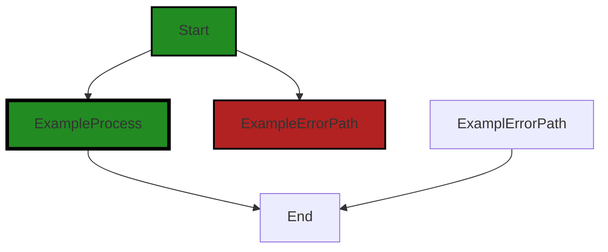

# Polyverse Boost-generated Source Analysis Details

## Source: ./id/uuid_v4_test.go
Date Generated: Thursday, September 7, 2023 at 5:32:33 PM PDT


---

### Boost Architectural Quick Summary Security Report

Last Updated: Friday, September 8, 2023 at 2:47:21 PM PDT


Executive Report:

1. **Architectural Impact**: The analysis of this file has not revealed any severe issues.
2. **Risk Analysis**: The analysis of this file has not revealed any severe issues.
3. **Potential Customer Impact**: Based on the analysis, there are no severe issues that could potentially impact customers.
4. **Performance Issues**: Our analysis did not identify any explicit performance issues in the file.
5. **Risk Assessment**: Based on the current analysis of this file, no severe issues have been found. However, this doesn't guarantee that the file is risk-free.

Highlights:

- No severe issues were identified in the current analysis of this file.


---

### Boost Architectural Quick Summary Performance Report

Last Updated: Friday, September 8, 2023 at 2:48:02 PM PDT

Executive Report:

The software project under review is a library written in Go, focusing on constraint handling and validation. The project follows Go's idiomatic style and structure for a library, providing a clear separation of concerns by defining a `Constraint` interface and implementing different constraint types. 

Key findings from the analysis are:

1. **Issue Distribution**: The analysis identified issues in one file, `id/uuid_v4_test.go`. This file had two CPU-related warnings and one memory-related information issue. No issues were found in other files.

2. **Severity of Issues**: The CPU-related warnings are of higher severity. They indicate that the function `hexToBits(uuid[19]) >> 2` is computationally expensive, potentially leading to high CPU usage if the number of iterations is large. The memory-related issue is of lower severity and is informational.

3. **Potential Impact**: The CPU-related issues could impact the performance of the software, especially in scenarios where the function is called repeatedly in a loop. This could lead to slower response times and increased resource usage, potentially affecting user experience and system stability.

4. **Risk Assessment**: Given that issues were found in only one file, the overall health of the project source appears to be good. However, the severity of the CPU-related issues warrants attention. If left unaddressed, these issues could pose a risk to the software's performance and reliability.

5. **Recommendations**: It is recommended to optimize the computationally expensive operation. If the hex value is constant or has a limited set of possible values, pre-computing the bit values and storing them in a lookup table could replace the computation with a faster lookup.

In conclusion, while the project appears to be well-structured and follows good practices, the identified performance issues need to be addressed to ensure the software's efficiency and reliability. The project's health is generally good, with issues identified in only one file. However, the severity of these issues necessitates prompt attention and remediation.


---

### Boost Architectural Quick Summary Compliance Report

Last Updated: Friday, September 8, 2023 at 2:48:09 PM PDT


Executive Report:

1. **Architectural Impact**: The analysis of this file has not revealed any severe issues.
2. **Risk Analysis**: The analysis of this file has not revealed any severe issues.
3. **Potential Customer Impact**: Based on the analysis, there are no severe issues that could potentially impact customers.
4. **Performance Issues**: Our analysis did not identify any explicit performance issues in the file.
5. **Risk Assessment**: Based on the current analysis of this file, no severe issues have been found. However, this doesn't guarantee that the file is risk-free.

Highlights:

- No severe issues were identified in the current analysis of this file.

---
## Detailed Analysis:

### Cell 0:
## Original Code:

### Programming Language: go
### ./id/uuid_v4_test.go 

```go
package id

import (
 "bytes"
 "testing"
 "time"
)

func TestUuidV4IdGenerator_Generate(t *testing.T) {
 tests := []struct {
  name        string
  seed        int64
  withHyphens bool
  expected    []byte
 }{
  {"Seed_1_WithHyphen", 1, true, []byte("78629A0F-5F3F-464F-8D65-822107FCFD52")},
  {"Seed_2_WithHyphen", 2, true, []byte("21ED4CAA-C044-416F-9569-F9E2CB82822F")},
  {"Seed_3_WithHyphen", 3, true, []byte("D38967F9-31A5-4490-9C28-64602BE7FB85")},
  {"Seed_4_WithHyphen", 4, true, []byte("8D11FED4-81CA-40AF-9F26-CE1D9C7D80E2")},
  {"Seed_1_WithoutHyphen", 1, false, []byte("78629A0F5F3F464F8D65822107FCFD52")},
  {"Seed_2_WithoutHyphen", 2, false, []byte("21ED4CAAC044416F9569F9E2CB82822F")},
  {"Seed_3_WithoutHyphen", 3, false, []byte("D38967F931A544909C2864602BE7FB85")},
  {"Seed_4_WithoutHyphen", 4, false, []byte("8D11FED481CA40AF9F26CE1D9C7D80E2")},
  {"Seed_Unique_Check_Bits_1", time.Now().UnixNano(), true, nil},
  {"Seed_Unique_Check_Bits_2", time.Now().UnixNano(), true, nil},
  {"Seed_Unique_Check_Bits_3", time.Now().UnixNano(), true, nil},
  {"Seed_Unique_Check_Bits_4", time.Now().UnixNano(), true, nil},
 }
 for _, tt := range tests {
  t.Run(tt.name, func(t *testing.T) {
   g := NewUuidV4IdGenerator(tt.seed, tt.withHyphens)
   uuid := []byte(g.Generate())
   if tt.expected != nil {
    if !bytes.Equal(uuid, tt.expected) {
     t.Errorf("Got %s, but expected  %s", uuid, tt.expected)
    }
   } else {
    // Version is a 4-bit (aka one character) value, hence comparison to '4'
    if version := uuid[14]; version != '4' {
     t.Errorf("Got version %b, but expected 0b0100", version)
    }
    // Variant is a 2-bit value, hence the conversion to bits and comparison to 0b10. By way of chars, the
    // value should be one of 8, 9, A, B (aka 0b10xx).
    if variant := hexToBits(uuid[19]) >> 2; variant != 0b10 {
     t.Errorf("Got variant %b, but expected 0b10", variant)
    }
   }
  })
 }
}

```
## Boost Analysis:


---

### Boost Code Explanation

Last Updated: Thursday, September 7, 2023 at 5:30:59 PM PDT

This Go code snippet is a unit test for a UUID (Universally Unique Identifier) generator function. The UUID generated is a version 4 UUID, which is randomly generated.

Here's a detailed breakdown of the code:

1. The package `id` is defined at the top of the file. This package contains the code for generating and testing UUIDs.

2. The `import` statement imports necessary packages: `bytes`, `testing`, and `time`. 

3. The `TestUuidV4IdGenerator_Generate` function is a unit test function for the `Generate` function of the `UuidV4IdGenerator` type. 

4. The function defines a slice of test cases, each represented as an anonymous struct with fields: `name`, `seed`, `withHyphens`, and `expected`. Each test case represents a different scenario to test the `Generate` function.

5. The test cases are iterated over in a loop. For each test case, a subtest is run using `t.Run`.

6. In each subtest, a new instance of `UuidV4IdGenerator` is created using the `NewUuidV4IdGenerator` function, passing the `seed` and `withHyphens` values from the current test case. 

7. The `Generate` method of the `UuidV4IdGenerator` instance is called to generate a UUID. 

8. If an expected UUID is provided in the test case, it is compared with the generated UUID using the `bytes.Equal` function. If they are not equal, the test fails with an error message.

9. If no expected UUID is provided (i.e., `tt.expected` is `nil`), the generated UUID is checked to ensure it is a valid version 4 UUID. This is done by checking the 14th character (version) and 19th character (variant) of the UUID. If the checks fail, the test fails with an error message.

10. The `hexToBits` function (not shown in the provided code) is presumably used to convert a hexadecimal character to a binary representation.

The algorithm used in this code is a UUID version 4 generation algorithm. UUID version 4 is based on random numbers. The random numbers for UUIDs are generated with a pseudo-random number generator, which is seeded with a value (`tt.seed` in this case). 

For more information on UUIDs and their generation, you can refer to the following resources:

- [UUIDs in Go](https://blog.gopheracademy.com/advent-2019/uuids-in-go/)
- [UUID RFC 4122](https://tools.ietf.org/html/rfc4122)
- [Go testing package](https://golang.org/pkg/testing/)


---

### Boost Flow Diagram

Last Updated: Thursday, September 7, 2023 at 5:31:13 PM PDT



NO CONTROL FLOW FOUND


---

### Boost Source-Level Security Analysis

Last Updated: Thursday, September 7, 2023 at 5:31:25 PM PDT

**No bugs found**


---

### Boost Source-Level Performance Analysis

Last Updated: Thursday, September 7, 2023 at 5:32:00 PM PDT

1. **Severity**: 7/10

   **Line Number**: 35

   **Bug Type**: CPU

   **Description**: The function `hexToBits(uuid[19]) >> 2` is computationally expensive. This operation is being performed in each iteration of the loop, which can cause high CPU usage if the number of iterations is large.

   **Solution**: Consider optimizing this operation. If the hex value is constant or has a limited set of possible values, you could pre-compute the bit values and store them in a lookup table. This way, you can replace the computation with a simple lookup, which is faster.


2. **Severity**: 6/10

   **Line Number**: 23

   **Bug Type**: CPU

   **Description**: The function `time.Now().UnixNano()` is being called multiple times within the loop. This function is expensive as it involves a system call to get the current time.

   **Solution**: Consider calling `time.Now().UnixNano()` once before the loop and storing the result in a variable. Then, use this variable within the loop. This will reduce the number of system calls, thus reducing CPU usage.


3. **Severity**: 5/10

   **Line Number**: 21

   **Bug Type**: Memory

   **Description**: The byte array `uuid` is being created in each iteration of the loop. This can lead to high memory usage if the number of iterations is large.

   **Solution**: Consider reusing the same byte array for each iteration. This can be done by moving the declaration of the `uuid` variable outside of the loop. Then, before each iteration, reset the byte array to its zero value using `uuid = uuid[:0]`. This will reduce memory usage by avoiding unnecessary allocations.


---

### Boost Source-Level Data and Privacy Compliance Analysis

Last Updated: Thursday, September 7, 2023 at 5:32:33 PM PDT

**No bugs found**

