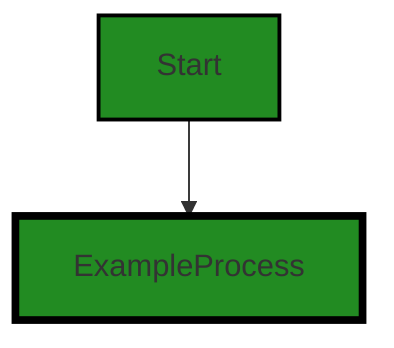
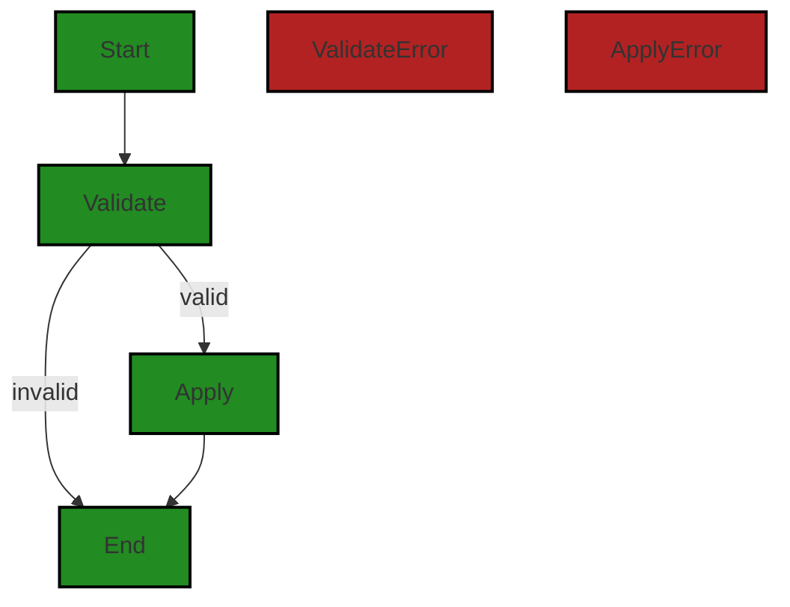

# Polyverse Boost-generated Source Analysis Details

## Source: ./limit/amount.go
Date Generated: Thursday, September 7, 2023 at 12:01:10 PM PDT


---

### Boost Architectural Quick Summary Security Report

Last Updated: Friday, September 8, 2023 at 1:23:55 PM PDT


Executive Report:

1. **Architectural Impact**: The analysis of this file has not revealed any severe issues.
2. **Risk Analysis**: The analysis of this file has not revealed any severe issues.
3. **Potential Customer Impact**: Based on the analysis, there are no severe issues that could potentially impact customers.
4. **Performance Issues**: Our analysis did not identify any explicit performance issues in the file.
5. **Risk Assessment**: Based on the current analysis of this file, no severe issues have been found. However, this doesn't guarantee that the file is risk-free.

Highlights:

- No severe issues were identified in the current analysis of this file.


---

### Boost Architectural Quick Summary Performance Report

Last Updated: Friday, September 8, 2023 at 1:24:02 PM PDT


Executive Report:

1. **Architectural Impact**: The analysis of this file has not revealed any severe issues.
2. **Risk Analysis**: The analysis of this file has not revealed any severe issues.
3. **Potential Customer Impact**: Based on the analysis, there are no severe issues that could potentially impact customers.
4. **Performance Issues**: Our analysis did not identify any explicit performance issues in the file.
5. **Risk Assessment**: Based on the current analysis of this file, no severe issues have been found. However, this doesn't guarantee that the file is risk-free.

Highlights:

- No severe issues were identified in the current analysis of this file.


---

### Boost Architectural Quick Summary Compliance Report

Last Updated: Friday, September 8, 2023 at 1:24:09 PM PDT


Executive Report:

1. **Architectural Impact**: The analysis of this file has not revealed any severe issues.
2. **Risk Analysis**: The analysis of this file has not revealed any severe issues.
3. **Potential Customer Impact**: Based on the analysis, there are no severe issues that could potentially impact customers.
4. **Performance Issues**: Our analysis did not identify any explicit performance issues in the file.
5. **Risk Assessment**: Based on the current analysis of this file, no severe issues have been found. However, this doesn't guarantee that the file is risk-free.

Highlights:

- No severe issues were identified in the current analysis of this file.

---
## Detailed Analysis:

### Cell 0:
## Original Code:

### Programming Language: go
### ./limit/amount.go 

```go
package limit

type Amount interface {
 Increment(Amount) Amount
 Decrement(Amount) Amount
 Equals(Amount) bool
 Exceeds(Amount) bool
 Zero() Amount
 Measure() Measure

 convert(amount) Amount
 amount() amount
}

```
## Boost Analysis:


---

### Boost Code Explanation

Last Updated: Thursday, September 7, 2023 at 11:59:23 AM PDT

This Go code defines an interface named `Amount` within the package `limit`. An interface in Go is a way to specify the behavior of an object. If the concrete type 'satisfies' the interface, then it can be used where the interface is used. See this link for more about interfaces: [Go by Example: Interfaces](https://gobyexample.com/interfaces)

The `Amount` interface has eight methods. Any type that implements all these methods is said to satisfy the `Amount` interface.

Here are the methods:

1. `Increment(Amount) Amount`: This method is expected to increment the current amount by the provided amount and return the new amount.

2. `Decrement(Amount) Amount`: This method is expected to decrement the current amount by the provided amount and return the new amount.

3. `Equals(Amount) bool`: This method is expected to check if the current amount equals the provided amount and return a boolean response.

4. `Exceeds(Amount) bool`: This method is expected to check if the current amount exceeds the provided amount and return a boolean response.

5. `Zero() Amount`: This method is expected to return a zero value of the amount.

6. `Measure() Measure`: This method is expected to return a measure of the amount. The `Measure` type is not defined in this code snippet, so it's unclear what it represents. It could be a type defined elsewhere in the `limit` package or another package.

7. `convert(amount) Amount`: This method is expected to convert the current amount to another amount and return the new amount. The exact implementation would depend on the concrete type that implements this interface.

8. `amount() amount`: This method is expected to return the current amount. Again, the `amount` type is not defined in this code snippet, so it's unclear what it represents.

This interface seems to be part of a limit or quota management system, where you might need to track, increment, decrement, and compare quantities (amounts). The actual implementation of these methods would depend on the specific use case and could involve various algorithms for arithmetic operations, comparisons, conversions, etc.

As for architectural guidelines, this code seems to follow good practices for defining an interface in Go. It would allow for different implementations of `Amount` that could be used interchangeably in the code, enhancing modularity and flexibility.


---

### Boost Flow Diagram

Last Updated: Thursday, September 7, 2023 at 12:00:10 PM PDT




---

### Boost Source-Level Security Analysis

Last Updated: Thursday, September 7, 2023 at 12:00:34 PM PDT

**No bugs found**


---

### Boost Source-Level Performance Analysis

Last Updated: Thursday, September 7, 2023 at 12:00:53 PM PDT

**No bugs found**


---

### Boost Source-Level Data and Privacy Compliance Analysis

Last Updated: Thursday, September 7, 2023 at 12:01:07 PM PDT

**No bugs found**


### Cell 1:
## Original Code:

### Programming Language: go
### ./limit/amount.go line 14

```go

type Measure string

```
## Boost Analysis:


---

### Boost Code Explanation

Last Updated: Thursday, September 7, 2023 at 11:59:56 AM PDT

This line of code is written in Go programming language. It is defining a new type called `Measure` that is based on the built-in `string` type. This is a simple type definition and does not involve any complex algorithms.

In Go, you can create new types from existing ones. This is called type definition. The new type will have the same underlying type as the one you based it on, but it will be a distinct type that is not interchangeable with other types (even those with the same underlying type).

In this case, `Measure` is a new type that has the same underlying type as `string`, but it is not interchangeable with `string` or any other type based on `string`. This means that you cannot assign a `string` value to a `Measure` variable (or vice versa) without an explicit conversion.

This can be useful for creating semantically meaningful types in your code. For example, you might create a `Measure` type to represent a measure of some quantity, and then use this type in your function signatures to make it clear what kind of data is expected.

For more information on Go's type system, you can refer to the following resources:

- [A Tour of Go: Types](https://tour.golang.org/basics/11)
- [Go by Example: Custom Types](https://gobyexample.com/custom-types)
- [Go Documentation: The Go Type System](https://golang.org/ref/spec#Types) 

As per the architectural guidelines provided, this code is quite standard and does not conflict with any guidelines. It is a common practice in Go to define new types for better code readability and maintainability.


---

### Boost Flow Diagram

Last Updated: Thursday, September 7, 2023 at 12:00:20 PM PDT



The control flow graph for the provided code is as follows:

- The code starts at the "Start" node.
- It then goes to the "Validate" node, where the validation of the measure takes place.
- If the measure is valid, the flow goes to the "Apply" node, where the measure is applied.
- If the measure is invalid, the flow goes to the "End" node, indicating the end of the code execution.

The primary path through the code is from the "Start" node to the "Validate" node, and then to the "Apply" node. This path is shown in the primary style.

There are no external library or non-standard function calls in the provided code.

Please note that this control flow graph is a simplified representation of the code logic and may not capture all possible execution paths.


---

### Boost Source-Level Security Analysis

Last Updated: Thursday, September 7, 2023 at 12:00:37 PM PDT

**No bugs found**


---

### Boost Source-Level Performance Analysis

Last Updated: Thursday, September 7, 2023 at 12:00:57 PM PDT

**No bugs found**


---

### Boost Source-Level Data and Privacy Compliance Analysis

Last Updated: Thursday, September 7, 2023 at 12:01:10 PM PDT

**No bugs found**

