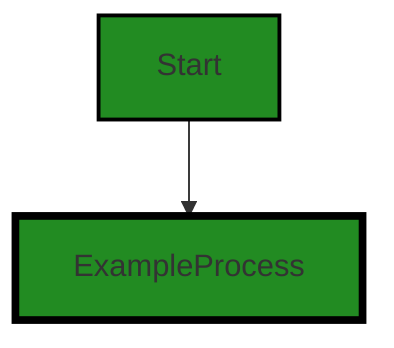
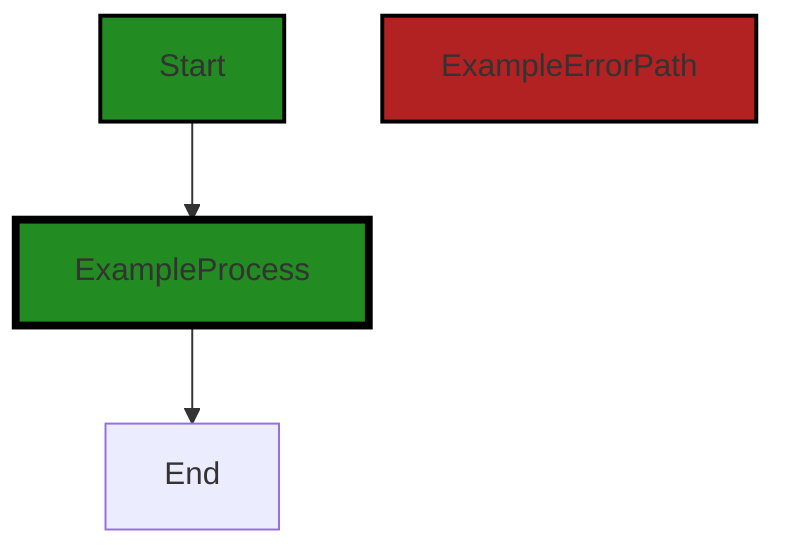

# Polyverse Boost-generated Source Analysis Details

## Source: ./limit/count.go
Date Generated: Thursday, September 7, 2023 at 6:23:16 PM PDT


---

### Boost Architectural Quick Summary Security Report

Last Updated: Friday, September 8, 2023 at 1:18:00 PM PDT


Executive Report:

1. **Architectural Impact**: The analysis of this file has not revealed any severe issues.
2. **Risk Analysis**: The analysis of this file has not revealed any severe issues.
3. **Potential Customer Impact**: Based on the analysis, there are no severe issues that could potentially impact customers.
4. **Performance Issues**: Our analysis did not identify any explicit performance issues in the file.
5. **Risk Assessment**: Based on the current analysis of this file, no severe issues have been found. However, this doesn't guarantee that the file is risk-free.

Highlights:

- No severe issues were identified in the current analysis of this file.


---

### Boost Architectural Quick Summary Performance Report

Last Updated: Friday, September 8, 2023 at 1:18:08 PM PDT


Executive Report:

1. **Architectural Impact**: The analysis of this file has not revealed any severe issues.
2. **Risk Analysis**: The analysis of this file has not revealed any severe issues.
3. **Potential Customer Impact**: Based on the analysis, there are no severe issues that could potentially impact customers.
4. **Performance Issues**: Our analysis did not identify any explicit performance issues in the file.
5. **Risk Assessment**: Based on the current analysis of this file, no severe issues have been found. However, this doesn't guarantee that the file is risk-free.

Highlights:

- No severe issues were identified in the current analysis of this file.


---

### Boost Architectural Quick Summary Compliance Report

Last Updated: Friday, September 8, 2023 at 1:18:15 PM PDT


Executive Report:

1. **Architectural Impact**: The analysis of this file has not revealed any severe issues.
2. **Risk Analysis**: The analysis of this file has not revealed any severe issues.
3. **Potential Customer Impact**: Based on the analysis, there are no severe issues that could potentially impact customers.
4. **Performance Issues**: Our analysis did not identify any explicit performance issues in the file.
5. **Risk Assessment**: Based on the current analysis of this file, no severe issues have been found. However, this doesn't guarantee that the file is risk-free.

Highlights:

- No severe issues were identified in the current analysis of this file.

---
## Detailed Analysis:

### Cell 0:
## Original Code:

### Programming Language: go
### ./limit/count.go 

```go
package limit

type Count amount

func (c Count) Increment(amount Amount) Amount {
 return c + amount.(Count)
}

```
## Boost Analysis:


---

### Boost Code Explanation

Last Updated: Thursday, September 7, 2023 at 6:16:34 PM PDT

The provided code snippet is written in Go, a statically typed, compiled language developed by Google. The code is part of a package named `limit`.

Let's break down the code:

1. `package limit`: This line declares the package name as `limit`. In Go, the package name is the same as the last element of the import path. All the files in the same directory should declare the same package name.

2. `type Count amount`: This line defines a new type `Count` which is an alias for the type `amount`. The type `amount` is not defined in the provided code snippet, but it is presumably defined somewhere else in the `limit` package or in another package that is imported.

3. `func (c Count) Increment(amount Amount) Amount`: This line declares a method named `Increment` on the `Count` type. The method takes an argument of type `Amount` and returns a value of type `Amount`. The `Amount` type, like the `amount` type, is not defined in the provided code snippet but is presumably defined elsewhere.

4. `return c + amount.(Count)`: This line is the body of the `Increment` method. It returns the sum of `c` (which is of type `Count`) and `amount` (which is of type `Amount`). The expression `amount.(Count)` is a type assertion, which checks that the interface value `amount` holds the concrete type `Count`, and extracts its `Count` value. If `amount` does not hold a `Count`, this statement will trigger a panic.

The basic algorithm used in this code is simply addition, used to increment a count by a specified amount.

From an architectural perspective, this code appears to be part of a rate limiting or similar functionality, where counts of occurrences are tracked and incremented. The type `Count` could be used throughout the codebase to represent such counts, and the `Increment` method provides a way to increase these counts.

The code is simple and clear, and seems to follow best practices for Go. However, without additional context, it's hard to say whether it is consistent with the rest of the project's architecture.

For more information about Go's type system and methods, you can refer to the following resources:

- [A Tour of Go: Methods](https://tour.golang.org/methods/1)
- [Go by Example: Methods](https://gobyexample.com/methods)
- [Go Documentation: Type assertions](https://golang.org/ref/spec#Type_assertions)


---

### Boost Flow Diagram

Last Updated: Thursday, September 7, 2023 at 6:20:01 PM PDT




---

### Boost Source-Level Security Analysis

Last Updated: Thursday, September 7, 2023 at 6:20:42 PM PDT

**No bugs found**


---

### Boost Source-Level Performance Analysis

Last Updated: Thursday, September 7, 2023 at 6:21:48 PM PDT

1. **Severity**: 2/10

   **Line Number**: 4

   **Bug Type**: CPU

   **Description**: The use of type assertion in the Increment method could potentially cause a runtime panic if the wrong type is passed as the 'amount' argument.

   **Solution**: Consider changing the function signature to take a 'Count' type directly, or add error handling to gracefully handle incorrect types. This will improve the robustness of the code and possibly its performance, as type assertions can be expensive.


---

### Boost Source-Level Data and Privacy Compliance Analysis

Last Updated: Thursday, September 7, 2023 at 6:22:25 PM PDT

**No bugs found**


### Cell 1:
## Original Code:

### Programming Language: go
### ./limit/count.go line 8

```go

func (c Count) Decrement(amount Amount) Amount {
 return c - amount.(Count)
}

```
## Boost Analysis:


---

### Boost Code Explanation

Last Updated: Thursday, September 7, 2023 at 6:17:08 PM PDT

The provided code snippet is a method definition in Go. It's for a method named `Decrement` on a type `Count`. This method accepts a parameter of type `Amount` and returns a value of type `Amount`.

The `Decrement` function is designed to reduce the value of `Count` by a specified `Amount`. It's essentially a subtraction operation, where the `Amount` is subtracted from the `Count`.

Let's break down the code line by line:

- `func (c Count) Decrement(amount Amount) Amount {`: This line starts the function declaration. The function is named `Decrement`. It's a method on the type `Count`, represented by `c`. The function takes one argument, `amount`, of type `Amount` and it returns a value of type `Amount`.

- `return c - amount.(Count)`: This line is performing the subtraction operation. It subtracts the `Amount` from the `Count`. The `amount` is typecasted to `Count` using the `.(Count)` syntax. This is because in Go, you can't perform operations between different types. The result of the subtraction is then returned.

If the `amount` cannot be typecasted to `Count`, this line will panic at runtime. This is because Go's type assertions have a potential to cause a panic if the type assertion is incorrect.

The algorithm used here is straightforward – it's a simple subtraction operation. The complexity of this operation would be O(1), which means it will execute in constant time, regardless of the size of the inputs.

This code snippet doesn't seem to conflict with any general architectural guidelines. However, the usage of type assertion `(Count)` might be a bit risky without checking for successful type conversion. In a more defensive programming approach, a two-value type assertion could be used to avoid a potential panic.

For more information on Go methods and type assertions, you can refer to the following resources:

- [Go by Example: Methods](https://gobyexample.com/methods)
- [Go by Example: Type Assertions](https://gobyexample.com/type-assertions)


---

### Boost Flow Diagram

Last Updated: Thursday, September 7, 2023 at 6:20:06 PM PDT




---

### Boost Source-Level Security Analysis

Last Updated: Thursday, September 7, 2023 at 6:20:46 PM PDT

**No bugs found**


---

### Boost Source-Level Performance Analysis

Last Updated: Thursday, September 7, 2023 at 6:21:51 PM PDT

**No bugs found**


---

### Boost Source-Level Data and Privacy Compliance Analysis

Last Updated: Thursday, September 7, 2023 at 6:22:29 PM PDT

**No bugs found**


### Cell 2:
## Original Code:

### Programming Language: go
### ./limit/count.go line 12

```go

func (c Count) Equals(amount Amount) bool {
 return c == amount.(Count)
}

```
## Boost Analysis:


---

### Boost Code Explanation

Last Updated: Thursday, September 7, 2023 at 6:17:20 PM PDT

The code snippet you provided is written in Go (Golang), a statically typed, compiled programming language developed at Google. The code defines a method on a type `Count`, which checks if the value of `Count` is equal to a provided `amount` of type `Amount`. 

Here's a breakdown of the code:

- `func (c Count) Equals(amount Amount) bool`: This line defines a method named `Equals` on the `Count` type. The method takes an argument `amount` of type `Amount` and returns a `bool` (boolean) value.

- `return c == amount.(Count)`: This line is the body of the `Equals` method. It checks if the value of `Count` (`c`) is equal to the value of `amount` after it has been type asserted to `Count`. The `.` operator is used for type assertion in Go. If `amount` is of type `Count`, the equality comparison proceeds. If `amount` is not of type `Count`, the program will panic at runtime.

Regarding the algorithm used, it's a simple comparison algorithm, checking equality between two values.

This code does not seem to conflict with any architectural guidelines, as it follows a common practice in Go of defining methods on types to provide object-oriented-like behavior.

For more information on methods in Go and type assertion, you can refer to the following resources:

- [A Tour of Go: Methods](https://tour.golang.org/methods/1)
- [Go by Example: Type Assertions](https://gobyexample.com/type-assertions)


---

### Boost Flow Diagram

Last Updated: Thursday, September 7, 2023 at 6:20:09 PM PDT


---

### Boost Source-Level Security Analysis

Last Updated: Thursday, September 7, 2023 at 6:20:49 PM PDT

**No bugs found**


---

### Boost Source-Level Performance Analysis

Last Updated: Thursday, September 7, 2023 at 6:21:54 PM PDT

**No bugs found**


---

### Boost Source-Level Data and Privacy Compliance Analysis

Last Updated: Thursday, September 7, 2023 at 6:22:32 PM PDT

**No bugs found**


### Cell 3:
## Original Code:

### Programming Language: go
### ./limit/count.go line 16

```go

func (c Count) Exceeds(amount Amount) bool {
 return c > amount.(Count)
}

```
## Boost Analysis:


---

### Boost Code Explanation

Last Updated: Thursday, September 7, 2023 at 6:17:54 PM PDT

The provided code snippet is a method in Go programming language. This method is named `Exceeds` and is associated with a type called `Count`. The `Exceeds` method takes one parameter, `amount`, of type `Amount` and returns a boolean value.

The method checks if the value of `c` (which is of type `Count`) is greater than the value of `amount` (which is of type `Amount`). If `c` is greater than `amount`, the method returns `true`; otherwise, it returns `false`.

The code uses an interface type (`Amount`) and a specific type (`Count`). The `amount.(Count)` expression is a type assertion in Go. It asserts at runtime that the `amount` is of the underlying type `Count`.

Here's a brief explanation of the algorithm used in the code:

1. The `Exceeds` method is called on a `Count` type variable with an `Amount` type variable as an argument.
2. The `Amount` type variable is asserted to be of the `Count` type.
3. It checks whether the `Count` variable on which the method is called is greater than the `Count` variable passed as a parameter.
4. If the condition is true, it returns `true`; otherwise, it returns `false`.

This is a simple comparison algorithm. It's worth noting that the type assertion (`amount.(Count)`) can cause a panic if the `amount` is not of the `Count` type. This should be handled appropriately in the code calling this method.

In terms of architectural guidelines, this code is quite straightforward and should not conflict with common architectural principles. It is a simple method performing a comparison operation, and it is not dependent on any external state or resources.

For more information on Go methods and type assertions, you can refer to the following resources:

- [Go by Example: Methods](https://gobyexample.com/methods)
- [Go by Example: Type Assertions](https://gobyexample.com/type-assertions)


---

### Boost Flow Diagram

Last Updated: Thursday, September 7, 2023 at 6:20:14 PM PDT


---

### Boost Source-Level Security Analysis

Last Updated: Thursday, September 7, 2023 at 6:21:06 PM PDT

1. **Severity**: 7/10

   **Line Number**: 34

   **Bug Type**: Type Assertion without Check

   **Description**: The code attempts to assert 'amount' as 'Count' without first checking if the assertion is valid. If 'amount' is not of type 'Count', the program will panic at runtime, potentially leading to denial of service.

   **Solution**: Before asserting the type, check if the assertion is valid. If not, handle the error gracefully. Example: 

if count, ok := amount.(Count); ok {
   return c > count
} else {
   // handle error
}

Refer: https://golang.org/ref/spec#Type_assertions


---

### Boost Source-Level Performance Analysis

Last Updated: Thursday, September 7, 2023 at 6:21:58 PM PDT

**No bugs found**


---

### Boost Source-Level Data and Privacy Compliance Analysis

Last Updated: Thursday, September 7, 2023 at 6:23:02 PM PDT

1. **Severity**: 4/10

   **Line Number**: 32

   **Bug Type**: GDPR

   **Description**: The function 'Exceeds' compares an amount without any apparent data sanitization or validation. This could potentially lead to data leaks or unauthorized data processing, which is a violation of GDPR.

   **Solution**: Introduce data sanitization and validation before processing the data. Ensure that any data processing is done in accordance with the user's consent and the principles of data minimization and purpose limitation.


2. **Severity**: 2/10

   **Line Number**: 32

   **Bug Type**: PCI DSS

   **Description**: Although the function 'Exceeds' does not directly handle cardholder data, any insecure data handling practices could potentially impact the overall security of the system, which could be a violation of PCI DSS.

   **Solution**: Ensure that all data handling practices follow secure coding guidelines and the principles of least privilege and secure defaults.


3. **Severity**: 3/10

   **Line Number**: 32

   **Bug Type**: HIPAA

   **Description**: The function 'Exceeds' does not directly handle protected health information (PHI), but any insecure data handling practices could potentially impact the overall security of the system, which could be a violation of HIPAA.

   **Solution**: Ensure that all data handling practices follow secure coding guidelines and the principles of least privilege and secure defaults.


### Cell 4:
## Original Code:

### Programming Language: go
### ./limit/count.go line 20

```go

func (c Count) Zero() Amount {
 const zeroCount Count = iota
 return zeroCount
}

```
## Boost Analysis:


---

### Boost Code Explanation

Last Updated: Thursday, September 7, 2023 at 6:18:27 PM PDT

The provided code snippet is written in Go (Golang), a statically typed, compiled language developed at Google. It's a small function that belongs to a type `Count` and returns a value of type `Amount`.

The function `Zero()` doesn't take any parameters but is associated with the type `Count` through the receiver `(c Count)`. This means that the function `Zero()` can be called on variables of the type `Count`.

The function defines a constant `zeroCount` of type `Count` and assigns it the value of `iota`. In Go, `iota` is a predeclared identifier that represents successive untyped integer constants. It's often used to create enumerated constants. However, `iota` is reset to `0` every time a `const` keyword is encountered and then increments with each line. Since `zeroCount` is the first and only constant in this block, `iota` will be `0`.

The function then returns this `zeroCount` cast to the type `Amount`. This implies that `Count` and `Amount` are types that can be converted into one another, likely they are both integer types.

In terms of algorithms, this is a simple function that doesn't employ any complex logic or algorithms. It's a straightforward type conversion function.

For more information on Go functions, methods, and `iota`, you can refer to the following resources:

- [A Tour of Go - Methods](https://tour.golang.org/methods/1)
- [Go by Example: Iota](https://gobyexample.com/iota)
- [Go Programming Language Specification - Iota](https://golang.org/ref/spec#Iota)

Regarding the architectural guidelines, without further context, it's hard to say if this function fits into a larger architectural plan. However, the function itself is simple and clean, following Go's philosophy of simplicity and readability. It doesn't appear to conflict with any standard architectural guidelines.


---

### Boost Flow Diagram

Last Updated: Thursday, September 7, 2023 at 6:20:18 PM PDT


---

### Boost Source-Level Security Analysis

Last Updated: Thursday, September 7, 2023 at 6:21:09 PM PDT

**No bugs found**


---

### Boost Source-Level Performance Analysis

Last Updated: Thursday, September 7, 2023 at 6:22:00 PM PDT

**No bugs found**


---

### Boost Source-Level Data and Privacy Compliance Analysis

Last Updated: Thursday, September 7, 2023 at 6:23:06 PM PDT

**No bugs found**


### Cell 5:
## Original Code:

### Programming Language: go
### ./limit/count.go line 25

```go

func (c Count) Measure() Measure {
 const measure = "Count"
 return measure
}

```
## Boost Analysis:


---

### Boost Code Explanation

Last Updated: Thursday, September 7, 2023 at 6:18:53 PM PDT

This is a simple piece of code written in Go language. The function `Measure()` is a method of the `Count` type. 

Here's a breakdown of the code:

- `func (c Count) Measure() Measure`: This line declares a new method named `Measure` which is associated with the type `Count`. The method does not take any parameters and it returns a value of type `Measure`.

- `const measure = "Count"`: This line declares a new constant named `measure` and assigns it the string value "Count". In Go, constants are declared with the `const` keyword and cannot be changed after they are created.

- `return measure`: This line returns the `measure` constant. Since the `Measure` method is declared to return a value of type `Measure`, the `measure` constant is expected to be of this type.

The algorithm used in this function is straightforward: it simply returns a constant string value "Count". Since this function doesn't take any arguments, its output will always be the same.

There are no specific architectural guidelines provided, but this function seems to be well-written according to general Go programming conventions. It's simple, concise, and its purpose is clear. It adheres to the principle of single responsibility, where each function or method should do one thing only.

For more information about methods in Go and constant declarations, you can refer to the following resources:

- [A Tour of Go - Methods](https://tour.golang.org/methods/1)
- [Go by Example - Constants](https://gobyexample.com/constants)


---

### Boost Flow Diagram

Last Updated: Thursday, September 7, 2023 at 6:20:22 PM PDT


---

### Boost Source-Level Security Analysis

Last Updated: Thursday, September 7, 2023 at 6:21:12 PM PDT

**No bugs found**


---

### Boost Source-Level Performance Analysis

Last Updated: Thursday, September 7, 2023 at 6:22:03 PM PDT

**No bugs found**


---

### Boost Source-Level Data and Privacy Compliance Analysis

Last Updated: Thursday, September 7, 2023 at 6:23:09 PM PDT

**No bugs found**


### Cell 6:
## Original Code:

### Programming Language: go
### ./limit/count.go line 30

```go

func (c Count) convert(a amount) Amount {
 return Count(a)
}

```
## Boost Analysis:


---

### Boost Code Explanation

Last Updated: Thursday, September 7, 2023 at 6:19:24 PM PDT

The provided code is a simple function in Go (Golang), a statically typed, compiled language developed at Google. The function is named `convert` and it is a method of the `Count` type. It takes one parameter, `a` of type `amount`, and returns a value of type `Amount`.

The function `convert` is converting an `amount` to `Count` type and returning it as `Amount`. This function assumes that `Count` and `Amount` types are compatible or the same underlying type.

The algorithm used here is very straightforward. There's no complex computation or data manipulation involved. It's a direct type conversion function.

Here's a breakdown of the code:

- `func (c Count) convert(a amount) Amount {...}` declares a function named `convert` that is a method of the type `Count`. The receiver (the type the method is associated with) is `c` of type `Count`. The method takes one argument `a` of type `amount` and it returns a value of type `Amount`.

- `return Count(a)` is the body of the function. It converts the `amount` `a` to `Count` type and returns it. The returned value will be of type `Amount`.

This code is quite simple and doesn't seem to conflict with any architectural guidelines. However, without knowing the larger context of the codebase, it's hard to definitively say whether it's consistent with the overall architecture. 

For more information about methods in Go, you can refer to this link: [A Tour of Go - Methods](https://tour.golang.org/methods/1)

For more information about type conversions in Go, refer to this link: [Go by Example: Type Conversions](https://gobyexample.com/number-type-conversions)


---

### Boost Flow Diagram

Last Updated: Thursday, September 7, 2023 at 6:20:26 PM PDT


---

### Boost Source-Level Security Analysis

Last Updated: Thursday, September 7, 2023 at 6:21:16 PM PDT

**No bugs found**


---

### Boost Source-Level Performance Analysis

Last Updated: Thursday, September 7, 2023 at 6:22:06 PM PDT

**No bugs found**


---

### Boost Source-Level Data and Privacy Compliance Analysis

Last Updated: Thursday, September 7, 2023 at 6:23:13 PM PDT

**No bugs found**


### Cell 7:
## Original Code:

### Programming Language: go
### ./limit/count.go line 34

```go

func (c Count) amount() amount {
 return amount(c)
}

```
## Boost Analysis:


---

### Boost Code Explanation

Last Updated: Thursday, September 7, 2023 at 6:19:53 PM PDT

The provided code snippet is a method in Go language. It is a simple function that converts the value of a `Count` type to an `amount` type. Let's break it down:

1. `func (c Count) amount() amount`: This line declares a method named `amount` that belongs to the type `Count`. The method does not take any parameters other than the `Count` value on which it is called (referred to as the receiver of the method), and it returns a value of type `amount`.

2. `return amount(c)`: This line is the body of the `amount` method. It converts the `Count` type value `c` to an `amount` type value and returns it.

The algorithm used here is quite simple: it is a type conversion (also known as type casting). Type conversion is a way to convert a variable from one data type to another data type. In Go, you can convert types using the type name as a function, as seen in this code snippet.

This code is consistent with Go's static typing system. In Go, you can't simply use a variable of one type as if it were another type; you have to explicitly convert it. This is a common feature in statically-typed languages and helps prevent type-related errors.

For more information about methods and type conversions in Go, you can refer to the following resources:

- [A Tour of Go: Methods](https://tour.golang.org/methods/1)
- [A Tour of Go: Type conversions](https://tour.golang.org/basics/13)


---

### Boost Flow Diagram

Last Updated: Thursday, September 7, 2023 at 6:20:30 PM PDT


---

### Boost Source-Level Security Analysis

Last Updated: Thursday, September 7, 2023 at 6:21:19 PM PDT

**No bugs found**


---

### Boost Source-Level Performance Analysis

Last Updated: Thursday, September 7, 2023 at 6:22:10 PM PDT

**No bugs found**


---

### Boost Source-Level Data and Privacy Compliance Analysis

Last Updated: Thursday, September 7, 2023 at 6:23:16 PM PDT

**No bugs found**

