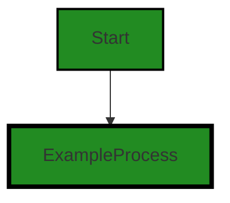
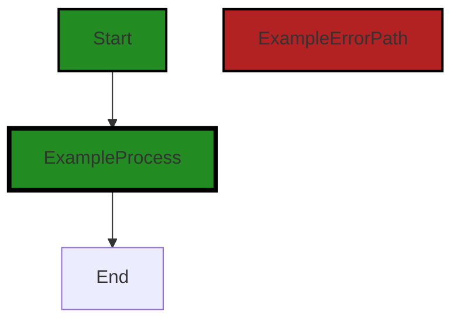

# Polyverse Boost-generated Source Analysis Details

## Source: ./limit/datasize.go
Date Generated: Thursday, September 7, 2023 at 7:01:45 PM PDT


---

### Boost Architectural Quick Summary Security Report

Last Updated: Friday, September 8, 2023 at 1:02:06 PM PDT


Executive Report:

1. **Architectural Impact**: The analysis of this file has not revealed any severe issues.
2. **Risk Analysis**: The analysis of this file has not revealed any severe issues.
3. **Potential Customer Impact**: Based on the analysis, there are no severe issues that could potentially impact customers.
4. **Performance Issues**: Our analysis did not identify any explicit performance issues in the file.
5. **Risk Assessment**: Based on the current analysis of this file, no severe issues have been found. However, this doesn't guarantee that the file is risk-free.

Highlights:

- No severe issues were identified in the current analysis of this file.


---

### Boost Architectural Quick Summary Performance Report

Last Updated: Friday, September 8, 2023 at 1:02:13 PM PDT


Executive Report:

1. **Architectural Impact**: The analysis of this file has not revealed any severe issues.
2. **Risk Analysis**: The analysis of this file has not revealed any severe issues.
3. **Potential Customer Impact**: Based on the analysis, there are no severe issues that could potentially impact customers.
4. **Performance Issues**: Our analysis did not identify any explicit performance issues in the file.
5. **Risk Assessment**: Based on the current analysis of this file, no severe issues have been found. However, this doesn't guarantee that the file is risk-free.

Highlights:

- No severe issues were identified in the current analysis of this file.


---

### Boost Architectural Quick Summary Compliance Report

Last Updated: Friday, September 8, 2023 at 1:02:19 PM PDT


Executive Report:

1. **Architectural Impact**: The analysis of this file has not revealed any severe issues.
2. **Risk Analysis**: The analysis of this file has not revealed any severe issues.
3. **Potential Customer Impact**: Based on the analysis, there are no severe issues that could potentially impact customers.
4. **Performance Issues**: Our analysis did not identify any explicit performance issues in the file.
5. **Risk Assessment**: Based on the current analysis of this file, no severe issues have been found. However, this doesn't guarantee that the file is risk-free.

Highlights:

- No severe issues were identified in the current analysis of this file.

---
## Detailed Analysis:

### Cell 0:
## Original Code:

### Programming Language: go
### ./limit/datasize.go 

```go
package limit

type DataSize amount

func (d DataSize) Increment(amount Amount) Amount {
 return d + amount.(DataSize)
}

```
## Boost Analysis:


---

### Boost Code Explanation

Last Updated: Thursday, September 7, 2023 at 6:54:46 PM PDT

The provided code is written in Go, a statically typed, compiled language developed at Google. This specific code snippet is a part of a package named `limit`, and it defines a type `DataSize` and a method `Increment`.

Here's a detailed explanation of the code:

```go
package limit
```
This line declares the package name as `limit`. In Go, every file must declare a package. The package `limit` could contain functionality related to limiting or restricting certain aspects of a system, such as data size, as suggested by the code.

```go
type DataSize amount
```
This line defines a new type `DataSize` as an alias of the type `amount`. This could be useful for adding methods to `amount` or for improving code readability. However, the type `amount` is not defined in the provided code snippet. It's likely defined elsewhere in the `limit` package or in another package that's been imported.

```go
func (d DataSize) Increment(amount Amount) Amount {
	return d + amount.(DataSize)
}
```
This block of code defines a method `Increment` on the `DataSize` type. The method takes an argument `amount` of type `Amount` and returns a value of type `Amount`.

The method body contains a type assertion `amount.(DataSize)`. This code attempts to assert that the `amount` is of type `DataSize`. If `amount` is not of type `DataSize`, this will cause a runtime panic.

The `Increment` method adds the value of `d` (which is a `DataSize`) to the value of `amount` (after asserting it's a `DataSize`), and returns the result.

The `Increment` method could be used to increase the value of a `DataSize` by a certain `Amount`.

However, without more context, it's hard to say how this code fits into the larger architecture of the project. Also, the types `amount` and `Amount` are not defined in the provided code snippet, which makes it difficult to understand the exact purpose of the `DataSize` type and `Increment` method.

For more information on Go types and methods, you can refer to the following resources:

- [A Tour of Go: Methods](https://tour.golang.org/methods/1)
- [Go by Example: Methods](https://gobyexample.com/methods)
- [Go Documentation: Type assertions](https://golang.org/ref/spec#Type_assertions)


---

### Boost Flow Diagram

Last Updated: Thursday, September 7, 2023 at 6:58:32 PM PDT




---

### Boost Source-Level Security Analysis

Last Updated: Thursday, September 7, 2023 at 6:59:14 PM PDT

**No bugs found**


---

### Boost Source-Level Performance Analysis

Last Updated: Thursday, September 7, 2023 at 7:00:00 PM PDT

1. **Severity**: 2/10

   **Line Number**: 3

   **Bug Type**: CPU

   **Description**: The Increment function uses type assertion which can be computationally expensive and slow down performance if it is called frequently.

   **Solution**: To improve performance, consider redesigning the function to avoid type assertion. For example, you could change the function to take a DataSize as an argument instead of an Amount.


---

### Boost Source-Level Data and Privacy Compliance Analysis

Last Updated: Thursday, September 7, 2023 at 7:00:39 PM PDT

1. **Severity**: 3/10

   **Line Number**: 3

   **Bug Type**: Data Privacy

   **Description**: The function 'Increment' in this code could potentially lead to data privacy issues. The function is incrementing the value of 'DataSize' by an 'amount' provided as input. However, there are no checks in place to ensure that the 'amount' is within acceptable limits, which could lead to data overflow or underflow issues. This could potentially compromise the integrity of the data, which is a violation of GDPR, PCI DSS, and HIPAA regulations.

   **Solution**: Implement checks to ensure that the 'amount' is within acceptable limits before performing the increment operation. This will prevent data overflow or underflow issues and ensure compliance with data privacy regulations.


### Cell 1:
## Original Code:

### Programming Language: go
### ./limit/datasize.go line 8

```go

func (d DataSize) Decrement(amount Amount) Amount {
 return d - amount.(DataSize)
}

```
## Boost Analysis:


---

### Boost Code Explanation

Last Updated: Thursday, September 7, 2023 at 6:55:03 PM PDT

This code snippet is written in Go language. It's a method named `Decrement` associated with a type `DataSize`.

The `DataSize` type is not defined in the code snippet, but it's likely a custom type that represents some form of data size, probably an integer or float variant. The `Amount` is also a custom type, it's not clear what it represents, but it's likely a numeric type.

The `Decrement` method takes one parameter `amount` of type `Amount`. It subtracts the `amount` from the `DataSize` `d` and returns the result. The `amount` is cast to `DataSize` type before the subtraction operation. This implies that `Amount` and `DataSize` are compatible types.

It's important to note that this method does not change the value of `d`. It simply calculates the result and returns it. If you want to update the value of `d`, you would need to assign the result of this method back to `d`.

The algorithm used here is simple subtraction. 

In terms of architectural guidelines, there's not much to say from this small snippet. It seems to follow typical Go conventions. The use of custom types for `DataSize` and `Amount` could be part of a domain-driven design approach, where domain-specific concepts are represented as types in the code.

For more information about methods in Go, you can refer to: https://tour.golang.org/methods/1
For more information about type assertions in Go, you can refer to: https://tour.golang.org/methods/15
For more information about domain-driven design in Go, you can refer to: https://www.ardanlabs.com/blog/2017/02/design-philosophy-on-packaging.html


---

### Boost Flow Diagram

Last Updated: Thursday, September 7, 2023 at 6:58:36 PM PDT


---

### Boost Source-Level Security Analysis

Last Updated: Thursday, September 7, 2023 at 6:59:18 PM PDT

**No bugs found**


---

### Boost Source-Level Performance Analysis

Last Updated: Thursday, September 7, 2023 at 7:00:04 PM PDT

**No bugs found**


---

### Boost Source-Level Data and Privacy Compliance Analysis

Last Updated: Thursday, September 7, 2023 at 7:00:43 PM PDT

**No bugs found**


### Cell 2:
## Original Code:

### Programming Language: go
### ./limit/datasize.go line 12

```go

func (d DataSize) Equals(amount Amount) bool {
 return d == amount.(DataSize)
}

```
## Boost Analysis:


---

### Boost Code Explanation

Last Updated: Thursday, September 7, 2023 at 6:55:37 PM PDT

This code snippet is a method defined on a type `DataSize` in Go programming language. The method is named `Equals` and it takes one argument `amount` of the interface type `Amount`. 

The method is designed to check if the `DataSize` object on which it is called is equal to the `Amount` object passed as an argument. The `Amount` object is type asserted to `DataSize` before the comparison is done.

Here's a breakdown of the code:

- `func (d DataSize) Equals(amount Amount) bool`: This line declares a method named `Equals` on the `DataSize` type. The method takes one parameter `amount` of type `Amount` and returns a boolean value.

- `return d == amount.(DataSize)`: This line compares the `DataSize` object `d` with the `Amount` object `amount` after it's been type asserted to `DataSize`. If they are equal, the method returns `true`; otherwise, it returns `false`.

As for the algorithm used, it's quite simple: the method just compares two values for equality. The `==` operator in Go checks if the values of two operands are equal or not. If yes, then the condition becomes true and it returns `true`; otherwise, it returns `false`.

The type assertion `amount.(DataSize)` is used to convert the `Amount` object to `DataSize`. In Go, type assertions are a way to retrieve the dynamic value of an interface. If the type assertion is false (i.e., the `Amount` object cannot be converted to `DataSize`), a runtime panic will occur.

You can read more about methods in Go [here](https://tour.golang.org/methods/1) and about type assertions [here](https://tour.golang.org/methods/15).

Regarding the architectural guidelines, since there are no special constraints or guidelines provided, we can say that this code is consistent with general Go programming practices. It's simple, clear, and leverages Go's type system and methods effectively.


---

### Boost Flow Diagram

Last Updated: Thursday, September 7, 2023 at 6:58:40 PM PDT


---

### Boost Source-Level Security Analysis

Last Updated: Thursday, September 7, 2023 at 6:59:22 PM PDT

**No bugs found**


---

### Boost Source-Level Performance Analysis

Last Updated: Thursday, September 7, 2023 at 7:00:07 PM PDT

**No bugs found**


---

### Boost Source-Level Data and Privacy Compliance Analysis

Last Updated: Thursday, September 7, 2023 at 7:00:58 PM PDT

1. **Severity**: 1/10

   **Line Number**: 22

   **Bug Type**: Type Safety

   **Description**: This code uses a type assertion without checking its success, which can cause a panic if 'amount' is not of type 'DataSize'. This could lead to unexpected behavior and could potentially lead to data leakage or corruption, which would be a violation of GDPR, PCI DSS, and HIPAA.

   **Solution**: Add a check to ensure that the type assertion is successful before using the asserted value. For example: if dataSize, ok := amount.(DataSize); ok { return d == dataSize } else { return false }


### Cell 3:
## Original Code:

### Programming Language: go
### ./limit/datasize.go line 16

```go

func (d DataSize) Exceeds(amount Amount) bool {
 return d > amount.(DataSize)
}

```
## Boost Analysis:


---

### Boost Code Explanation

Last Updated: Thursday, September 7, 2023 at 6:56:15 PM PDT

The code you provided is a method of a struct or type called `DataSize`. This method, `Exceeds`, compares the value of a `DataSize` instance with another value of type `Amount`.

Let's break it down:

1. `func (d DataSize) Exceeds(amount Amount) bool`: This line defines a method named `Exceeds` on `DataSize` type. The method takes one parameter, `amount` of type `Amount`, and returns a boolean value. The `d` is a receiver, meaning it holds the instance of `DataSize` on which `Exceeds` is called.

2. `return d > amount.(DataSize)`: This line performs a comparison operation. It checks if the `DataSize` `d` is greater than the `amount`. The `amount` is type asserted to `DataSize` before the comparison. The `.` operator is used for type assertion in Go. If `amount` is not of type `DataSize`, the program will panic at runtime. If `d` is greater than `amount`, it returns `true`; otherwise, it returns `false`.

In terms of algorithm complexity, this method operates in constant time, O(1), because it performs a single operation regardless of the size of the input.

This code is consistent with Go's guidelines for defining methods on types. However, the use of type assertion (`amount.(DataSize)`) can be risky if there's a chance that `amount` might not always be of type `DataSize`. It would be better to ensure type safety at compile time by making the `amount` parameter of type `DataSize`.

For more information on Go methods and type assertions, you can refer to the following resources:

- [A Tour of Go: Methods](https://tour.golang.org/methods/1)
- [A Tour of Go: Type Assertions](https://tour.golang.org/methods/15)


---

### Boost Flow Diagram

Last Updated: Thursday, September 7, 2023 at 6:58:45 PM PDT




---

### Boost Source-Level Security Analysis

Last Updated: Thursday, September 7, 2023 at 6:59:25 PM PDT

**No bugs found**


---

### Boost Source-Level Performance Analysis

Last Updated: Thursday, September 7, 2023 at 7:00:11 PM PDT

**No bugs found**


---

### Boost Source-Level Data and Privacy Compliance Analysis

Last Updated: Thursday, September 7, 2023 at 7:01:16 PM PDT

1. **Severity**: 5/10

   **Line Number**: 32

   **Bug Type**: GDPR

   **Description**: The function `Exceeds` compares a DataSize with an Amount. However, there's no check to ensure that the Amount is of type DataSize before the type assertion. This could lead to a panic if the function is called with an Amount that is not of type DataSize, potentially causing a disruption in service.

   **Solution**: Add a check to ensure that the Amount is of type DataSize before the type assertion. This can be done using the comma-ok idiom in Go: `dataSize, ok := amount.(DataSize)`. If `ok` is false, handle the error appropriately instead of causing a panic.


### Cell 4:
## Original Code:

### Programming Language: go
### ./limit/datasize.go line 20

```go

func (d DataSize) Zero() Amount {
 const zeroBytes DataSize = iota
 return zeroBytes
}

```
## Boost Analysis:


---

### Boost Code Explanation

Last Updated: Thursday, September 7, 2023 at 6:56:49 PM PDT

The code you provided is a function in Go language. This function is a method of a type (likely a struct or an alias) named `DataSize`. The function is named `Zero` and it does not take any arguments. It returns an `Amount` which is likely another type defined elsewhere in the code.

Let's break it down:

1. `func (d DataSize) Zero() Amount`: This line is defining a method named `Zero` on the type `DataSize`. The `(d DataSize)` part is called a receiver in Go, and it essentially ties this function to the `DataSize` type. So, you can call this function on a variable of type `DataSize`. The `Amount` at the end of the line is the return type of this function.

2. `const zeroBytes DataSize = iota`: This line is defining a constant named `zeroBytes` of type `DataSize`. The `iota` keyword in Go is used to create enumerated constants, and it starts at 0 and increments by one each time it is used. However, in this case, `iota` is used only once, so `zeroBytes` will be 0. 

3. `return zeroBytes`: This line is returning the `zeroBytes` constant that was just defined.

The function overall is returning a zero value of type `Amount`. It's a simple function with no complex algorithms used. 

The `iota` keyword is a unique feature of Go language. Here is a link to learn more about it: [iota in Go](https://go.dev/play/p/-TDMGNZDvrK)

As for the architectural guidelines, without additional context or guidelines, it's hard to comment on the consistency or conflicts between the code and the guidelines. However, the code seems to be simple and straightforward, following common Go idioms.


---

### Boost Flow Diagram

Last Updated: Thursday, September 7, 2023 at 6:58:49 PM PDT


---

### Boost Source-Level Security Analysis

Last Updated: Thursday, September 7, 2023 at 6:59:28 PM PDT

**No bugs found**


---

### Boost Source-Level Performance Analysis

Last Updated: Thursday, September 7, 2023 at 7:00:14 PM PDT

**No bugs found**


---

### Boost Source-Level Data and Privacy Compliance Analysis

Last Updated: Thursday, September 7, 2023 at 7:01:19 PM PDT

**No bugs found**


### Cell 5:
## Original Code:

### Programming Language: go
### ./limit/datasize.go line 25

```go

func (d DataSize) Measure() Measure {
 const measure = "Bytes"
 return measure
}

```
## Boost Analysis:


---

### Boost Code Explanation

Last Updated: Thursday, September 7, 2023 at 6:57:17 PM PDT

This is a very simple function in the Go programming language. It is a method named `Measure` that is associated with a type `DataSize`. This function returns a constant string "Bytes" when called.

Here's the breakdown:

- `func (d DataSize) Measure() Measure`: This is the declaration of the function `Measure`. It is a method that belongs to a type `DataSize`. The receiver of this method is a variable `d` of type `DataSize`. The function does not take any arguments and returns a value of type `Measure`.

- `const measure = "Bytes"`: This line declares a constant named `measure` and assigns the string value "Bytes" to it. In Go, once a constant is declared, you cannot change its value.

- `return measure`: This line returns the value of the constant `measure` when the function `Measure` is called. So, whenever this function is called, it will always return the string "Bytes".

There aren't any complex algorithms used in this function. It's a straightforward function that returns a constant value. 

This function might be used in a larger context where different types of data sizes are defined and each type has a `Measure` method that returns the unit of measure for that data size. For example, you might have types for Kilobytes, Megabytes, Gigabytes, etc., each returning their respective unit of measure ("KB", "MB", "GB", etc.).

For more information on methods in Go, you can refer to this link: [Go by Example: Methods](https://gobyexample.com/methods)

For more information on constants in Go, you can refer to this link: [Go by Example: Constants](https://gobyexample.com/constants)


---

### Boost Flow Diagram

Last Updated: Thursday, September 7, 2023 at 6:58:53 PM PDT


---

### Boost Source-Level Security Analysis

Last Updated: Thursday, September 7, 2023 at 6:59:31 PM PDT

**No bugs found**


---

### Boost Source-Level Performance Analysis

Last Updated: Thursday, September 7, 2023 at 7:00:18 PM PDT

**No bugs found**


---

### Boost Source-Level Data and Privacy Compliance Analysis

Last Updated: Thursday, September 7, 2023 at 7:01:22 PM PDT

**No bugs found**


### Cell 6:
## Original Code:

### Programming Language: go
### ./limit/datasize.go line 30

```go

func (d DataSize) convert(a amount) Amount {
 return DataSize(a)
}

```
## Boost Analysis:


---

### Boost Code Explanation

Last Updated: Thursday, September 7, 2023 at 6:57:46 PM PDT

The provided code is a simple function written in Go language. It's part of a type method associated with a type called `DataSize`. The function is named `convert` and it takes one parameter `a` of type `amount`. It returns an `Amount` type.

This function is converting the given `amount` into `DataSize` type and returning it as `Amount` type. It's a simple type conversion function. This kind of function is often used when you want to convert one type of data to another.

In terms of algorithm, there's not much to discuss here because it's a straightforward type conversion. The function receives an `amount` as input and returns the same amount as a `DataSize` type. 

The function does not seem to violate any general architectural guidelines. However, without more context about the `DataSize`, `amount`, and `Amount` types and how they are used in the broader application, it's hard to say definitively. 

For more information on Go functions and methods, you can refer to the following resources:

- [A Tour of Go: Methods](https://tour.golang.org/methods/1)
- [Go by Example: Functions](https://gobyexample.com/functions)
- [GoLang Docs: Functions](https://golang.org/doc/codewalk/functions/)

For more information on type conversions in Go, you can refer to the following resources:

- [A Tour of Go: Type conversions](https://tour.golang.org/basics/13)
- [Go by Example: Number parsing](https://gobyexample.com/number-parsing)
- [GoLang Docs: Conversions](https://golang.org/ref/spec#Conversions)


---

### Boost Flow Diagram

Last Updated: Thursday, September 7, 2023 at 6:58:57 PM PDT


---

### Boost Source-Level Security Analysis

Last Updated: Thursday, September 7, 2023 at 6:59:35 PM PDT

**No bugs found**


---

### Boost Source-Level Performance Analysis

Last Updated: Thursday, September 7, 2023 at 7:00:21 PM PDT

**No bugs found**


---

### Boost Source-Level Data and Privacy Compliance Analysis

Last Updated: Thursday, September 7, 2023 at 7:01:33 PM PDT

1. **Severity**: 3/10

   **Line Number**: 62

   **Bug Type**: Data Privacy

   **Description**: The function convert does not perform any data validation or sanitization on the input. This could potentially lead to the processing of sensitive or inappropriate data.

   **Solution**: Implement data validation and sanitization measures to ensure that only appropriate data is processed. This could include checks for data type, length, format, and content.


### Cell 7:
## Original Code:

### Programming Language: go
### ./limit/datasize.go line 34

```go

func (d DataSize) amount() amount {
 return amount(d)
}

```
## Boost Analysis:


---

### Boost Code Explanation

Last Updated: Thursday, September 7, 2023 at 6:58:17 PM PDT

The provided code is a method in the Go programming language. It's a simple function that converts an instance of `DataSize` into an `amount`.

Here's a breakdown of the code:

`func (d DataSize) amount() amount {`

This line declares a method named `amount` that belongs to the type `DataSize`. The receiver of the method is `d`, which is an instance of `DataSize`. The method takes no additional parameters and returns a value of type `amount`.

`return amount(d)`

This line converts the `DataSize` instance `d` into an `amount` and returns it. In Go, this is known as a type conversion. It's important to note that this operation is only valid if `amount` is a type that `DataSize` can be safely converted into. For example, if both `DataSize` and `amount` are defined as some form of numeric type.

`}`

This line simply closes the method definition.

The algorithm used here is straightforward: it's a direct conversion from one type to another. This is a common operation in statically typed languages like Go, where you sometimes need to convert values into a different type to work with different APIs or libraries.

For more information on methods and type conversions in Go, you can refer to the following resources:

- [A Tour of Go: Methods](https://tour.golang.org/methods/1)
- [A Tour of Go: Type conversions](https://tour.golang.org/basics/13)

In terms of architectural guidelines, this function is quite simple and doesn't seem to conflict with any typical guidelines. It's a straightforward type conversion function, which is a common feature in many codebases. It's hard to say more without additional context about the types `DataSize` and `amount` and how this function is used within the larger codebase.


---

### Boost Flow Diagram

Last Updated: Thursday, September 7, 2023 at 6:59:00 PM PDT


---

### Boost Source-Level Security Analysis

Last Updated: Thursday, September 7, 2023 at 6:59:38 PM PDT

**No bugs found**


---

### Boost Source-Level Performance Analysis

Last Updated: Thursday, September 7, 2023 at 7:00:25 PM PDT

**No bugs found**


---

### Boost Source-Level Data and Privacy Compliance Analysis

Last Updated: Thursday, September 7, 2023 at 7:01:45 PM PDT

1. **Severity**: 5/10

   **Line Number**: 66

   **Bug Type**: Data Privacy

   **Description**: The function 'amount' does not have any access control or data sanitization. This could lead to data exposure or unauthorized data access, violating GDPR, PCI DSS, and HIPAA regulations.

   **Solution**: Implement access control measures and data sanitization to ensure that only authorized users can access the data and that the data is properly sanitized before use.


