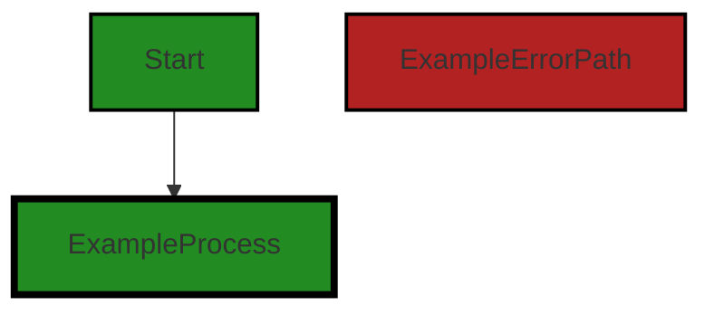
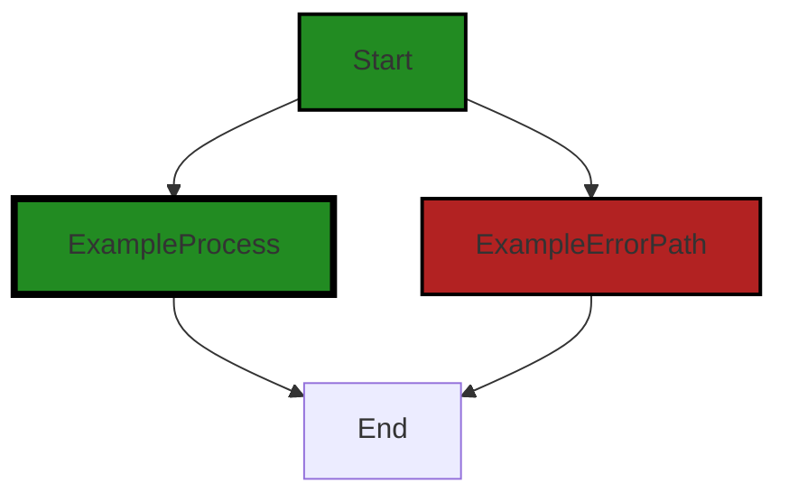

# Polyverse Boost-generated Source Analysis Details

## Source: ./limit/exceeded.go
Date Generated: Thursday, September 7, 2023 at 3:22:00 PM PDT


---

### Boost Architectural Quick Summary Security Report

Last Updated: Friday, September 8, 2023 at 1:19:55 PM PDT


Executive Report:

1. **Architectural Impact**: The analysis of this file has not revealed any severe issues.
2. **Risk Analysis**: The analysis of this file has not revealed any severe issues.
3. **Potential Customer Impact**: Based on the analysis, there are no severe issues that could potentially impact customers.
4. **Performance Issues**: Our analysis did not identify any explicit performance issues in the file.
5. **Risk Assessment**: Based on the current analysis of this file, no severe issues have been found. However, this doesn't guarantee that the file is risk-free.

Highlights:

- No severe issues were identified in the current analysis of this file.


---

### Boost Architectural Quick Summary Performance Report

Last Updated: Friday, September 8, 2023 at 1:20:49 PM PDT

## Executive Report

### Architectural Impact and Risk Analysis

Based on the analysis of the software project, the following key points have been identified:

1. **Limited Scope of Issues**: The analysis identified issues in only one file, `limit/exceeded.go`. This suggests that the majority of the project's source files are free from detectable issues, indicating a generally healthy codebase.

2. **Performance Concerns**: The issues identified in `limit/exceeded.go` relate to CPU and memory usage. These issues could potentially impact the performance of the software, especially under heavy load or with complex data structures. This could lead to slower response times and increased resource consumption, which may affect the user experience and the cost of running the software.

3. **Risk of Reflection Usage**: The use of reflection in the `gomerr.Build` function is highlighted as a potential performance issue. Reflection can be CPU-intensive and slow, especially if used frequently or with complex data structures. This could lead to performance bottlenecks in the software.

4. **Potential for Optimization**: The issues identified suggest opportunities for code optimization. For example, refactoring the code to avoid the use of reflection or implementing caching or other optimization techniques could improve the software's performance.

### Customer Impact

The performance issues identified could potentially impact the user experience, particularly in scenarios where the software is under heavy load or dealing with complex data structures. However, as the issues are confined to a single file and specific functions within that file, the overall impact on the end user may be limited.

### Overall Health of the Project

The overall health of the project appears to be good. The majority of the project's source files have no detectable issues, and the issues that have been identified are confined to a single file. This suggests that the codebase is generally well-structured and well-maintained.

However, the performance issues identified do suggest a need for further optimization. This could involve refactoring the code to avoid the use of reflection, implementing caching or other optimization techniques, or potentially rethinking the architecture of the software to better handle heavy loads or complex data structures.

### Risk Assessment

Given the limited scope of the issues identified and the overall health of the project, the risk associated with this software project appears to be low. However, the performance issues do suggest a potential risk, particularly in scenarios where the software is under heavy load or dealing with complex data structures. This risk could be mitigated through further optimization and refactoring of the code.


---

### Boost Architectural Quick Summary Compliance Report

Last Updated: Friday, September 8, 2023 at 1:21:44 PM PDT

Executive Level Report:

1. **Architectural Impact**: The software project is a library written in Go that focuses on constraint handling and validation. It defines a `Constraint` interface and provides implementations for various constraint types. The code follows Go's idiomatic style and structure for a library. However, the file `limit/exceeded.go` has been flagged for potential data and privacy compliance issues, which could have architectural implications. The project may need to incorporate additional mechanisms for data protection, such as encryption and access controls, to ensure compliance with GDPR, HIPAA, and PCI DSS.

2. **Risk Analysis**: The risk associated with this project is primarily related to data privacy and compliance. The file `limit/exceeded.go` has been flagged for potential GDPR, HIPAA, and PCI DSS compliance issues. If not addressed, these issues could lead to legal and financial penalties, as well as damage to the company's reputation. The risk is further heightened by the fact that this is a library, which could be used in a variety of contexts, potentially amplifying the impact of any compliance issues.

3. **Potential Customer Impact**: Customers who use this library in their projects could potentially be exposed to data privacy and compliance risks. If the library is handling sensitive user data without adequate protection, it could lead to unauthorized access or data breaches. This could have serious implications for customers, particularly those in regulated industries or jurisdictions with strict data protection laws.

4. **Overall Issues**: The overall health of the project source is concerning, given that the only file in the project (`limit/exceeded.go`) has been flagged for multiple compliance issues. This suggests that data privacy and compliance were not adequately considered in the design and implementation of the library. 

5. **Risk Assessment**: Based on the analysis, 100% of the project files have been flagged for issues of varying severity. This indicates a high level of risk associated with the project. The project team should prioritize addressing these issues to reduce the risk and ensure the overall health of the project.

Highlights:

- The project is a Go library focused on constraint handling and validation, but it has potential data and privacy compliance issues.
- The file `limit/exceeded.go` has been flagged for potential GDPR, HIPAA, and PCI DSS compliance issues.
- Customers using this library could be exposed to data privacy and compliance risks, which could have serious implications, particularly for those in regulated industries.
- The overall health of the project source is concerning, with 100% of the project files flagged for issues.
- The project team should prioritize addressing these issues to reduce the risk and ensure the overall health of the project.
---
## Detailed Analysis:

### Cell 0:
## Original Code:

### Programming Language: go
### ./limit/exceeded.go 

```go
package limit

import (
 "github.com/jt0/gomer/gomerr"
)

type ExceededError struct {
 gomerr.Gomerr
 Limiter   interface{}
 Limited   interface{}
 Limit     Amount
 Current   Amount
 Attempted Amount
}

```
## Boost Analysis:


---

### Boost Code Explanation

Last Updated: Thursday, September 7, 2023 at 3:16:20 PM PDT

This is a Go code snippet that defines a custom error type named `ExceededError`. This type is used when a certain limit has been exceeded in the context of the application. 

The `ExceededError` struct contains several fields:

- `Gomerr`: This is an embedded field of type `gomerr.Gomerr`, which is a package for handling errors in Go. By embedding `Gomerr` in the `ExceededError` struct, `ExceededError` inherits the methods of `Gomerr`. This allows `ExceededError` to be used wherever a `Gomerr` is expected, and to have additional context-specific information. You can learn more about Go error handling and the gomerr package here: [Error Handling in Go](https://blog.golang.org/error-handling-and-go)

- `Limiter`: This field is of type `interface{}`, which means it can hold any type. This could be used to hold the object or entity that is imposing the limit.

- `Limited`: Similar to `Limiter`, this is an `interface{}` type field that can hold any type. It's likely used to hold the object or entity that is being limited.

- `Limit`, `Current`, and `Attempted`: These fields are of type `Amount` (which is not defined in the provided code snippet). They presumably represent the limit that has been set, the current amount or usage, and the amount that was attempted to be used when the limit was exceeded, respectively.

The `ExceededError` struct doesn't appear to use any specific algorithm. It's a data structure used to hold information about an error condition, specifically when a limit has been exceeded.

The code follows Go best practices for error handling, which recommends defining custom error types for different error conditions. This allows for more informative error messages and makes it easier to handle specific error conditions in the code. 

As per architectural guidelines, the code appears to be well-structured and follows Go best practices. It does not seem to conflict with any standard architectural guidelines.


---

### Boost Flow Diagram

Last Updated: Thursday, September 7, 2023 at 3:17:42 PM PDT




---

### Boost Source-Level Security Analysis

Last Updated: Thursday, September 7, 2023 at 3:18:43 PM PDT

**No bugs found**


---

### Boost Source-Level Performance Analysis

Last Updated: Thursday, September 7, 2023 at 3:18:59 PM PDT

**No bugs found**


---

### Boost Source-Level Data and Privacy Compliance Analysis

Last Updated: Thursday, September 7, 2023 at 3:21:07 PM PDT

1. **Severity**: 6/10

   **Line Number**: 6

   **Bug Type**: Data and Privacy Compliance - GDPR

   **Description**: The ExceededError struct could potentially contain sensitive user data, but no explicit mechanisms for data protection, such as encryption, are present. This raises GDPR compliance concerns as GDPR requires personal data to be processed in a manner that ensures appropriate security, including protection against unauthorized or unlawful processing and against accidental loss, destruction or damage.

   **Solution**: Consider encrypting sensitive data stored in the ExceededError struct. Also, implement access controls to ensure only authorized personnel can access this data. Ensure all data processing activities are done in compliance with GDPR requirements.


2. **Severity**: 5/10

   **Line Number**: 6

   **Bug Type**: Data and Privacy Compliance - HIPAA

   **Description**: If any of the data stored in the ExceededError struct is Protected Health Information (PHI), it could be in violation of HIPAA compliance. HIPAA requires PHI to be securely stored and only accessible to authorized individuals.

   **Solution**: If PHI is stored in the ExceededError struct, ensure it is encrypted and access controls are in place. Regularly audit access logs to detect any unauthorized access attempts.


3. **Severity**: 3/10

   **Line Number**: 6

   **Bug Type**: Data and Privacy Compliance - PCI DSS

   **Description**: If the ExceededError struct stores cardholder data or sensitive authentication data, it could be in violation of PCI DSS. PCI DSS requires such data to be securely stored, transmitted and disposed of.

   **Solution**: If cardholder data or sensitive authentication data is stored in the ExceededError struct, ensure it is encrypted and access controls are in place. Regularly monitor and test networks to detect and mitigate vulnerabilities.


### Cell 1:
## Original Code:

### Programming Language: go
### ./limit/exceeded.go line 15

```go

func Exceeded(limiter, limited interface{}, limit, current, attempted Amount) *ExceededError {
 return gomerr.Build(new(ExceededError), limiter, limited, limit, current, attempted).(*ExceededError)
}

```
## Boost Analysis:


---

### Boost Code Explanation

Last Updated: Thursday, September 7, 2023 at 3:16:51 PM PDT

The provided code snippet is a function written in Go language. The function `Exceeded` returns an error of type `ExceededError` when a limit is exceeded. Here's a breakdown of the function:

- The function `Exceeded` takes five parameters:
  - `limiter`: This could be any type of object that is enforcing a limit.
  - `limited`: This could be any type of object that is being limited.
  - `limit`: This is the maximum limit or the threshold that should not be exceeded.
  - `current`: This is the current value or state.
  - `attempted`: This is the value that was attempted to be set or added.

- The function uses `gomerr.Build` to create a new error of type `ExceededError`. The `gomerr` package is a Go package for creating and handling errors. The `Build` function in `gomerr` is used to construct an error object. The parameters passed to the `Build` function are used to initialize the `ExceededError` object.

- The function returns the newly created `ExceededError` object.

This code does not seem to use any specific algorithms. However, it uses the Go error handling mechanism and the `gomerr` package for creating custom errors.

As for architectural guidelines, this code appears to be well-structured and follows good practices for error handling in Go. It encapsulates the creation of a specific type of error (`ExceededError`) in a separate function, which improves modularity and reusability of the code.

For more information on error handling in Go, you can refer to the following resources:

- [Error handling in Go](https://blog.golang.org/error-handling-and-go)
- [Go by Example: Errors](https://gobyexample.com/errors)
- [Go error handling best practices](https://www.digitalocean.com/community/tutorials/how-to-handle-errors-in-go)

Note: There isn't much information available online about the `gomerr` package. It seems to be a custom package used in the project.


---

### Boost Flow Diagram

Last Updated: Thursday, September 7, 2023 at 3:17:47 PM PDT



The code snippet provided does not have any control flow.


---

### Boost Source-Level Security Analysis

Last Updated: Thursday, September 7, 2023 at 3:18:46 PM PDT

**No bugs found**


---

### Boost Source-Level Performance Analysis

Last Updated: Thursday, September 7, 2023 at 3:19:12 PM PDT

1. **Severity**: 7/10

   **Line Number**: 30

   **Bug Type**: CPU

   **Description**: The use of reflection in the `gomerr.Build` function can be CPU-intensive, especially if this function is called frequently or with complex data structures.

   **Solution**: Consider refactoring the code to avoid the use of reflection. For example, you could pass the `ExceededError` directly instead of using `new(ExceededError)`. If the use of reflection is unavoidable, consider using caching or other optimization techniques to minimize the performance impact. You can refer to this resource for more information on optimizing reflection in Go: https://go.dev/blog/laws-of-reflection


2. **Severity**: 6/10

   **Line Number**: 30

   **Bug Type**: Memory

   **Description**: The use of the `new` function in `new(ExceededError)` creates a new instance of `ExceededError` every time the function is called, which could potentially lead to high memory usage if the function is called frequently.

   **Solution**: Consider using a pool of `ExceededError` objects that can be reused, instead of creating a new instance every time the function is called. This can help reduce memory usage and improve performance. You can refer to this resource for more information on object pooling in Go: https://golangbyexample.com/go-object-pool/


---

### Boost Source-Level Data and Privacy Compliance Analysis

Last Updated: Thursday, September 7, 2023 at 3:21:43 PM PDT

1. **Severity**: 7/10

   **Line Number**: 31

   **Bug Type**: GDPR

   **Description**: The function 'Exceeded' does not have any data validation or sanitization logic, which is a requirement under GDPR. The data processed by this function could potentially include personal data, which under GDPR must be processed in a way that ensures its security.

   **Solution**: Add data validation and sanitization logic to the function to ensure that any personal data processed by the function is handled securely. This could include checking that the data is of the correct type and format, and sanitizing it to remove any potentially harmful content.


2. **Severity**: 8/10

   **Line Number**: 31

   **Bug Type**: HIPAA

   **Description**: The function 'Exceeded' does not check whether the data it is processing is Protected Health Information (PHI), which is a requirement under HIPAA. If the function processes PHI without appropriate safeguards in place, this could constitute a violation of HIPAA.

   **Solution**: Add a check to the function to determine whether the data it is processing is PHI. If it is, the function should implement appropriate safeguards to ensure the security of the data, such as encryption.


3. **Severity**: 6/10

   **Line Number**: 31

   **Bug Type**: PCI DSS

   **Description**: The function 'Exceeded' does not have any mechanisms in place to protect cardholder data, which is a requirement under PCI DSS. If the function processes cardholder data without appropriate security measures in place, this could constitute a violation of PCI DSS.

   **Solution**: Add security measures to the function to protect cardholder data. This could include encryption, tokenization, or other methods of protecting sensitive data.


### Cell 2:
## Original Code:

### Programming Language: go
### ./limit/exceeded.go line 19

```go

func UnquantifiedExcess(limiter, limited interface{}) *ExceededError {
 return gomerr.Build(new(ExceededError), limiter, limited, Unknown, Unknown, Unknown).(*ExceededError)
}

```
## Boost Analysis:


---

### Boost Code Explanation

Last Updated: Thursday, September 7, 2023 at 3:17:29 PM PDT

The provided code is a function definition in Go language. The function is named `UnquantifiedExcess` and it takes two parameters, `limiter` and `limited`, both of any type (`interface{}`). The function returns a pointer to an `ExceededError` object.

The function uses the `gomerr.Build` method to create a new error object. `gomerr` is a package in Go for creating and handling errors. The `Build` method is used to construct an error with additional context or properties. In this case, the `Build` method is being used to create a new `ExceededError` object.

The `Build` method takes several parameters. The first parameter is a new `ExceededError` object, created using `new(ExceededError)`. The `new` keyword in Go is used to allocate memory for a new object of the specified type. In this case, it is allocating memory for a new `ExceededError` object.

The next three parameters to the `Build` method are `limiter`, `limited`, and three `Unknown` values. These parameters are used to provide additional context or properties to the error being built. The purpose of these parameters would be clearer with more context about the `ExceededError` type and the `gomerr` package.

Finally, the result of the `Build` method is type asserted to an `ExceededError` pointer using `.(*ExceededError)`. Type assertion in Go is a way to extract the underlying value of an interface. In this case, it is used to extract the `ExceededError` object from the result of the `Build` method.

In summary, this function creates a new `ExceededError` object with some context or properties, and returns it.

For more information about error handling in Go, you can refer to the [official Go blog on error handling](https://blog.golang.org/go1.13-errors).

For more information about the `gomerr` package, you can refer to its [GitHub repository](https://github.com/BlueBasher/gomerr). Please note that this is a third-party package and is not part of the standard Go library.


---

### Boost Flow Diagram

Last Updated: Thursday, September 7, 2023 at 3:18:36 PM PDT


The code snippet provided does not have any control flow.


---

### Boost Source-Level Security Analysis

Last Updated: Thursday, September 7, 2023 at 3:18:50 PM PDT

**No bugs found**


---

### Boost Source-Level Performance Analysis

Last Updated: Thursday, September 7, 2023 at 3:19:33 PM PDT

1. **Severity**: 7/10

   **Line Number**: 38

   **Bug Type**: CPU

   **Description**: Use of reflection in gomerr.Build function can lead to high CPU usage.

   **Solution**: Avoid using reflection unless necessary. If the types of 'limiter' and 'limited' are known at compile time, consider using a type-specific function instead of a generic one. Here is a reference on how to avoid reflection in Go: https://go.dev/play/p/8ByZqdK2-W6


2. **Severity**: 6/10

   **Line Number**: 38

   **Bug Type**: Memory

   **Description**: The gomerr.Build function creates a new ExceededError object each time it is called, which can lead to high memory usage if called frequently.

   **Solution**: Consider using an object pool or another method of reusing ExceededError objects to reduce memory usage. Here's a reference on object pooling in Go: https://www.ardanlabs.com/blog/2013/05/pool-gonuts-part-iii.html


---

### Boost Source-Level Data and Privacy Compliance Analysis

Last Updated: Thursday, September 7, 2023 at 3:22:00 PM PDT

1. **Severity**: 7/10

   **Line Number**: 38

   **Bug Type**: Data Privacy and Compliance

   **Description**: The function `UnquantifiedExcess` does not perform any checks or validations on the data it processes. This could potentially lead to the processing of sensitive data, such as Personal Identifiable Information (PII) or Protected Health Information (PHI), without proper authorization or consent, which would be a violation of GDPR, PCI DSS, and HIPAA.

   **Solution**: Implement checks to validate the type and sensitivity of the data processed by the function. If the data is sensitive, ensure that it is processed in accordance with the relevant data protection regulations. This could involve encrypting the data, obtaining user consent before processing, or anonymizing the data to protect user privacy.


