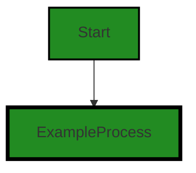
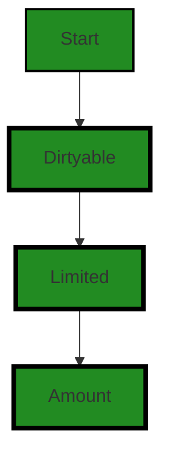
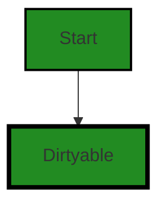

# Polyverse Boost-generated Source Analysis Details

## Source: ./limit/limiter.go
Date Generated: Thursday, September 7, 2023 at 3:00:13 AM PDT


---

### Boost Architectural Quick Summary Security Report

Last Updated: Friday, September 8, 2023 at 1:18:33 PM PDT


Executive Report:

1. **Architectural Impact**: The analysis of this file has not revealed any severe issues.
2. **Risk Analysis**: The analysis of this file has not revealed any severe issues.
3. **Potential Customer Impact**: Based on the analysis, there are no severe issues that could potentially impact customers.
4. **Performance Issues**: Our analysis did not identify any explicit performance issues in the file.
5. **Risk Assessment**: Based on the current analysis of this file, no severe issues have been found. However, this doesn't guarantee that the file is risk-free.

Highlights:

- No severe issues were identified in the current analysis of this file.


---

### Boost Architectural Quick Summary Performance Report

Last Updated: Friday, September 8, 2023 at 1:18:40 PM PDT


Executive Report:

1. **Architectural Impact**: The analysis of this file has not revealed any severe issues.
2. **Risk Analysis**: The analysis of this file has not revealed any severe issues.
3. **Potential Customer Impact**: Based on the analysis, there are no severe issues that could potentially impact customers.
4. **Performance Issues**: Our analysis did not identify any explicit performance issues in the file.
5. **Risk Assessment**: Based on the current analysis of this file, no severe issues have been found. However, this doesn't guarantee that the file is risk-free.

Highlights:

- No severe issues were identified in the current analysis of this file.


---

### Boost Architectural Quick Summary Compliance Report

Last Updated: Friday, September 8, 2023 at 1:19:07 PM PDT

Executive Level Report:

1. **Architectural Impact**: The software project is a library written in Go that focuses on constraint handling and validation. It defines a `Constraint` interface and provides implementations for various constraint types. The code follows Go's idiomatic style and structure for a library. However, there is a potential GDPR violation in the `limiter.go` file, which could have architectural implications. The method `Limiter()` could potentially return sensitive data, which could require changes in the architecture to ensure data privacy and compliance with GDPR.

2. **Risk Analysis**: The risk associated with this project is moderate. The main risk comes from potential GDPR and HIPAA violations in the `limiter.go` file. This could lead to legal and financial consequences if not addressed. The risk is further increased by potential PCI DSS and Data Privacy issues in the same file. However, it's important to note that these are potential issues and further investigation is needed to confirm them.

3. **Potential Customer Impact**: The potential customer impact is high. If the GDPR, HIPAA, PCI DSS, and Data Privacy issues are confirmed, it could lead to a breach of customer's sensitive data. This could result in loss of trust, legal action, and financial loss for the customers.

4. **Overall Issues**: The overall health of the project source is questionable. The `limiter.go` file has potential GDPR, HIPAA, PCI DSS, and Data Privacy issues. However, it's the only file in the project, which means 100% of the project files have potential issues. This is a significant concern and needs immediate attention.

Highlights of the Analysis:

- The project is a Go library for constraint handling and validation, following Go's idiomatic style and structure for a library.
- The `limiter.go` file has potential GDPR, HIPAA, PCI DSS, and Data Privacy issues.
- The potential issues in the `limiter.go` file could lead to a breach of customer's sensitive data, resulting in high customer impact.
- 100% of the project files have potential issues, indicating a significant concern for the overall health of the project source.
- The architectural impact of the potential GDPR violation could require changes in the architecture to ensure data privacy and compliance.
---
## Detailed Analysis:

### Cell 0:
## Original Code:

### Programming Language: go
### ./limit/limiter.go 

```go
package limit

import (
 "github.com/jt0/gomer/gomerr"
)

type Limited interface {
 Limiter() (Limiter, gomerr.Gomerr)
 DefaultLimit() Amount
 LimitAmount() Amount
}

```
## Boost Analysis:


---

### Boost Code Explanation

Last Updated: Thursday, September 7, 2023 at 2:55:48 AM PDT

This is a Go code snippet that defines a package named "limit". This package seems to be focused on limiting some resource or functionality in a system, possibly related to rate limiting or resource allocation. 

The code imports a package called "gomerr" from "github.com/jt0/gomer". Gomerr is a Go package that provides enhanced error handling capabilities for Go applications. It allows for the creation and propagation of errors with additional context, which can be useful for debugging and error tracking.

The main part of this snippet is the definition of an interface named "Limited". An interface in Go is a type that defines a set of methods that a type must have in order to implement the interface. In this case, the "Limited" interface defines three methods:

1. `Limiter() (Limiter, gomerr.Gomerr)`: This method should return an instance of a type that implements the "Limiter" interface and a Gomerr error. The "Limiter" interface is not defined in this snippet, so we can't say exactly what it does, but given the name, it likely provides methods for applying and managing limits.

2. `DefaultLimit() Amount`: This method should return the default limit as an "Amount". The "Amount" type is not defined in this snippet, but it is likely a numeric type that represents the quantity of some resource that can be used.

3. `LimitAmount() Amount`: This method should return the current limit amount as an "Amount". This might be different from the default limit if, for example, the limit has been temporarily reduced due to high system load.

This interface would be used to abstract away the details of how limits are applied and managed. Any type that needs to have a limit applied to it would implement this interface, and other parts of the system could then interact with those types in a generic way using this interface.

Here are some resources for further learning:

- [Go Interfaces](https://gobyexample.com/interfaces): This is a short tutorial on how to define and use interfaces in Go.
- [Error handling in Go](https://blog.golang.org/error-handling-and-go): This is a blog post from the official Go blog that explains how error handling works in Go. 
- [Gomerr GitHub](https://github.com/jt0/gomer): This is the GitHub repository for the Gomerr package, where you can find more information about how it works and how to use it.


---

### Boost Flow Diagram

Last Updated: Thursday, September 7, 2023 at 2:57:48 AM PDT




---

### Boost Source-Level Security Analysis

Last Updated: Thursday, September 7, 2023 at 2:58:28 AM PDT

**No bugs found**


---

### Boost Source-Level Performance Analysis

Last Updated: Thursday, September 7, 2023 at 2:58:52 AM PDT

**No bugs found**


---

### Boost Source-Level Data and Privacy Compliance Analysis

Last Updated: Thursday, September 7, 2023 at 2:59:59 AM PDT

1. **Severity**: 7/10

   **Line Number**: 7

   **Bug Type**: GDPR

   **Description**: The Limited interface has a method Limiter() that could potentially return sensitive data. This could be a violation of the GDPR, which requires that personal data be processed in a way that ensures appropriate security, including protection against unauthorized or unlawful processing and against accidental loss, destruction or damage.

   **Solution**: Consider implementing data anonymization or pseudonymization techniques when returning sensitive data. Also, consider implementing appropriate access controls to limit who can call this method and what data they can access.


2. **Severity**: 6/10

   **Line Number**: 9

   **Bug Type**: HIPAA

   **Description**: The DefaultLimit() method could potentially return sensitive health information. This could be a violation of the HIPAA, which requires that protected health information be processed in a way that ensures its confidentiality, integrity, and availability.

   **Solution**: Consider implementing data anonymization or pseudonymization techniques when returning sensitive health information. Also, consider implementing appropriate access controls to limit who can call this method and what data they can access.


3. **Severity**: 5/10

   **Line Number**: 10

   **Bug Type**: PCI DSS

   **Description**: The LimitAmount() method could potentially return sensitive cardholder data. This could be a violation of the PCI DSS, which requires that cardholder data be processed in a way that ensures its confidentiality and integrity.

   **Solution**: Consider implementing data anonymization or pseudonymization techniques when returning sensitive cardholder data. Also, consider implementing appropriate access controls to limit who can call this method and what data they can access.


### Cell 1:
## Original Code:

### Programming Language: go
### ./limit/limiter.go line 12

```go

type Limiter interface {
 Dirtyable
 Current(limited Limited) Amount
 SetCurrent(limited Limited, current Amount)
 Override(limited Limited) Amount
 SetOverride(limited Limited, override Amount)
 Maximum(limited Limited) Amount
}

```
## Boost Analysis:


---

### Boost Code Explanation

Last Updated: Thursday, September 7, 2023 at 2:56:46 AM PDT

This code is written in Go and it defines an interface named `Limiter`. An interface in Go is a custom type that is used to specify a contract (behavior) that types should have. They are abstract, so they don't have an explicit implementation, they only define the methods that a type should possess.

The `Limiter` interface defines the following methods:

1. `Dirtyable`: This seems to be another interface that this `Limiter` interface embeds. The methods defined in the `Dirtyable` interface will also be a part of the `Limiter` interface. The details of this interface are not provided in the code snippet.

2. `Current(limited Limited) Amount`: This method takes an argument of type `Limited` and returns an `Amount`. The `Limited` and `Amount` could be any type (built-in or user-defined). The exact functionality of this method would depend on how it is implemented in the concrete type that satisfies the `Limiter` interface.

3. `SetCurrent(limited Limited, current Amount)`: This method takes two arguments, one of type `Limited` and another of type `Amount`. The functionality of this method would be to set the current amount of something that is limited. The exact details would depend on the implementation in the concrete type.

4. `Override(limited Limited) Amount` and `SetOverride(limited Limited, override Amount)`: These methods seem to get and set an override amount for something that is limited.

5. `Maximum(limited Limited) Amount`: This method would return the maximum amount for something that is limited.

This interface could be used to implement any kind of limiting functionality, like rate limiting or resource limiting, in a software application. The exact details would depend on how these methods are implemented in the concrete types that satisfy this interface.

As for the architectural guidelines, since none are provided, we can only say that this code follows the general Go best practices for defining interfaces.

For more information on interfaces in Go, you can refer to the following resources:

- [Go by Example: Interfaces](https://gobyexample.com/interfaces)
- [A Tour of Go: Interfaces](https://tour.golang.org/methods/9)


---

### Boost Flow Diagram

Last Updated: Thursday, September 7, 2023 at 2:58:07 AM PDT



The control flow graph for the given source code is a simple linear flow. The code defines an interface named `Limiter` which extends the `Dirtyable` interface. The `Dirtyable` interface is not shown in the code snippet provided, but it is assumed to be defined elsewhere. The `Limiter` interface has a single method `Current` which takes a parameter of type `Limited` and returns an `Amount`. The `SetCurrent`, `Override`, `SetOverride`, and `Maximum` methods are not shown in the code snippet, but they are assumed to be defined in the `Limiter` interface as well.

The control flow starts at the `Limiter` interface and flows to the `Dirtyable` interface, and then to the `Limited` interface. Finally, the control flow reaches the `Amount` type.

Note: The control flow graph does not show any error paths or external library calls as the code snippet does not contain any such elements.


---

### Boost Source-Level Security Analysis

Last Updated: Thursday, September 7, 2023 at 2:58:33 AM PDT

**No bugs found**


---

### Boost Source-Level Performance Analysis

Last Updated: Thursday, September 7, 2023 at 2:58:55 AM PDT

**No bugs found**


---

### Boost Source-Level Data and Privacy Compliance Analysis

Last Updated: Thursday, September 7, 2023 at 3:00:08 AM PDT

1. **Severity**: 5/10

   **Line Number**: 22

   **Bug Type**: Data Privacy

   **Description**: The Limiter interface allows setting and getting the current and maximum amounts, potentially allowing unauthorized access to sensitive data. This could lead to a violation of GDPR, PCI DSS, and HIPAA compliance.

   **Solution**: Implement access control mechanisms to ensure that only authorized users can set and get the current and maximum amounts. Also consider implementing encryption for the data in transit and at rest.


### Cell 2:
## Original Code:

### Programming Language: go
### ./limit/limiter.go line 21

```go

type Dirtyable interface {
 IsDirty() bool
 ClearDirty()
}

```
## Boost Analysis:


---

### Boost Code Explanation

Last Updated: Thursday, September 7, 2023 at 2:57:32 AM PDT

The provided code is written in Go and it defines an interface named `Dirtyable`. 

An interface in Go is a collection of method signatures that a Type can implement. It is a way to define and group related behavior. An interface is defined with the `type` keyword, followed by the name of the interface and the keyword `interface`. Inside the curly brackets `{}` we define a list of methods that the interface includes.

The `Dirtyable` interface in this code includes two methods: `IsDirty() bool` and `ClearDirty()`. Any type that defines these two methods is said to implement the `Dirtyable` interface.

- `IsDirty() bool`: This method returns a boolean value. It is expected to be implemented by a type to indicate if the object is "dirty" or not. In a software context, an object is often marked as "dirty" if it has been modified since it was last saved or synchronized.

- `ClearDirty()`: This method does not return a value. It is expected to be implemented by a type to clear the "dirty" status of the object, often indicating that the object has been saved or synchronized.

This interface could be used in a variety of contexts, but it's often used in software patterns that involve tracking the state of objects, such as the "dirty checking" pattern. This pattern is common in Object-Relational Mapping (ORM) systems, graphic libraries, or any context where it's important to track if an object has changed.

Here are some resources for further reading:
- [Go by Example: Interfaces](https://gobyexample.com/interfaces)
- [Effective Go: Interfaces](https://golang.org/doc/effective_go#interfaces)
- [Go Interfaces Tutorial](https://www.callicoder.com/golang-interfaces/)


---

### Boost Flow Diagram

Last Updated: Thursday, September 7, 2023 at 2:58:14 AM PDT



The control flow graph for the provided code is very simple. It consists of a single node representing the `Dirtyable` interface. There are no control flow paths or decision points in this code snippet.


---

### Boost Source-Level Security Analysis

Last Updated: Thursday, September 7, 2023 at 2:58:37 AM PDT

**No bugs found**


---

### Boost Source-Level Performance Analysis

Last Updated: Thursday, September 7, 2023 at 2:59:01 AM PDT

**No bugs found**


---

### Boost Source-Level Data and Privacy Compliance Analysis

Last Updated: Thursday, September 7, 2023 at 3:00:13 AM PDT

**No bugs found**

