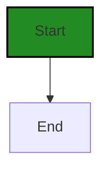
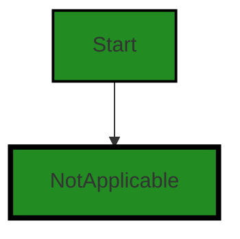
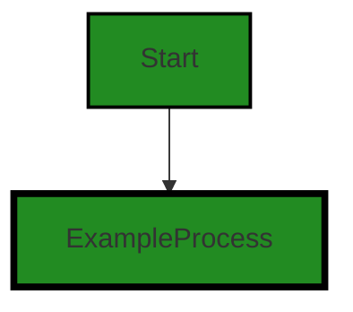
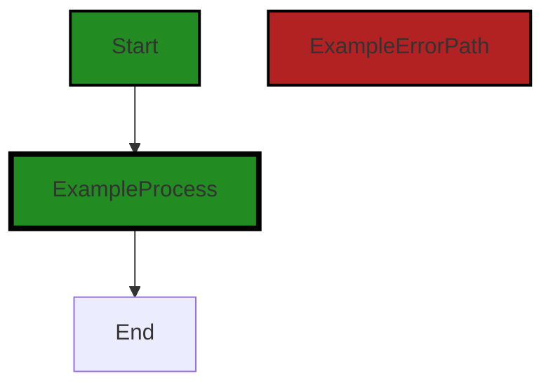

# Polyverse Boost-generated Source Analysis Details

## Source: ./limit/notapplicable.go
Date Generated: Thursday, September 7, 2023 at 4:39:55 PM PDT


---

### Boost Architectural Quick Summary Security Report

Last Updated: Friday, September 8, 2023 at 1:19:24 PM PDT


Executive Report:

1. **Architectural Impact**: The analysis of this file has not revealed any severe issues.
2. **Risk Analysis**: The analysis of this file has not revealed any severe issues.
3. **Potential Customer Impact**: Based on the analysis, there are no severe issues that could potentially impact customers.
4. **Performance Issues**: Our analysis did not identify any explicit performance issues in the file.
5. **Risk Assessment**: Based on the current analysis of this file, no severe issues have been found. However, this doesn't guarantee that the file is risk-free.

Highlights:

- No severe issues were identified in the current analysis of this file.


---

### Boost Architectural Quick Summary Performance Report

Last Updated: Friday, September 8, 2023 at 1:19:31 PM PDT


Executive Report:

1. **Architectural Impact**: The analysis of this file has not revealed any severe issues.
2. **Risk Analysis**: The analysis of this file has not revealed any severe issues.
3. **Potential Customer Impact**: Based on the analysis, there are no severe issues that could potentially impact customers.
4. **Performance Issues**: Our analysis did not identify any explicit performance issues in the file.
5. **Risk Assessment**: Based on the current analysis of this file, no severe issues have been found. However, this doesn't guarantee that the file is risk-free.

Highlights:

- No severe issues were identified in the current analysis of this file.


---

### Boost Architectural Quick Summary Compliance Report

Last Updated: Friday, September 8, 2023 at 1:19:37 PM PDT


Executive Report:

1. **Architectural Impact**: The analysis of this file has not revealed any severe issues.
2. **Risk Analysis**: The analysis of this file has not revealed any severe issues.
3. **Potential Customer Impact**: Based on the analysis, there are no severe issues that could potentially impact customers.
4. **Performance Issues**: Our analysis did not identify any explicit performance issues in the file.
5. **Risk Assessment**: Based on the current analysis of this file, no severe issues have been found. However, this doesn't guarantee that the file is risk-free.

Highlights:

- No severe issues were identified in the current analysis of this file.

---
## Detailed Analysis:

### Cell 0:
## Original Code:

### Programming Language: go
### ./limit/notapplicable.go 

```go
package limit

type notApplicable struct{}

```
## Boost Analysis:


---

### Boost Code Explanation

Last Updated: Thursday, September 7, 2023 at 4:31:55 PM PDT

This code snippet is very minimal and does not include any algorithm or complex computations. It is written in Go, a statically-typed compiled language developed by Google. The code defines a package named `limit` and a type `notApplicable` within it. 

Let's break it down:

1. `package limit`: This line declares the `limit` package. In Go, a package is a collection of source files in the same directory that are compiled together. Functions, types, variables, and constants defined in one source file are accessible to all other source files within the same package. The name of the package determines the default identifier for importing this package. In this case, the package can be imported with the identifier `limit`.

2. `type notApplicable struct{}`: This line declares a type `notApplicable` which is an empty struct. In Go, a struct is a composite data type that groups together zero or more values of different types. The struct type `notApplicable` does not hold any data. It is often used in Go when you want to create a distinct type for which behavior can be defined (via methods), but you don't need to store any additional data inside the type itself. 

This type could be used to signify a special condition or a specific behavior in the context of the `limit` package. However, without more context or additional code, it's not possible to determine its exact purpose.

For more information about Go packages and structs, you can refer to the following resources:

- [How to Write Go Code](https://golang.org/doc/code.html): This is the official Go documentation about how to write Go code, including how to define and use packages.

- [A Tour of Go](https://tour.golang.org/moretypes/2): This is an interactive tour of Go, which includes a section about structs. It's a great resource for learning about the basics of Go.

- [Go by Example: Structs](https://gobyexample.com/structs): This is a practical guide to Go, which includes examples of how to use structs.


---

### Boost Flow Diagram

Last Updated: Thursday, September 7, 2023 at 4:36:07 PM PDT




---

### Boost Source-Level Security Analysis

Last Updated: Thursday, September 7, 2023 at 4:36:54 PM PDT

**No bugs found**


---

### Boost Source-Level Performance Analysis

Last Updated: Thursday, September 7, 2023 at 4:37:33 PM PDT

**No bugs found**


---

### Boost Source-Level Data and Privacy Compliance Analysis

Last Updated: Thursday, September 7, 2023 at 4:38:31 PM PDT

**No bugs found**


### Cell 1:
## Original Code:

### Programming Language: go
### ./limit/notapplicable.go line 4

```go

var NotApplicable = notApplicable{}

```
## Boost Analysis:


---

### Boost Code Explanation

Last Updated: Thursday, September 7, 2023 at 4:32:25 PM PDT

The line of code you've provided is quite simple and straightforward. It's written in Go, a statically typed, compiled programming language developed at Google. 

The code declares a variable named `NotApplicable` and assigns it an instance of the `notApplicable` type. Here's what we can infer from this line:

- `notApplicable` is a type, likely a struct, that's defined somewhere else in the code. 
- The `{}` following `notApplicable` is used to create an instance of the `notApplicable` type. This is called a composite literal in Go, and it's a way of creating a value of a specific type. If `notApplicable` is a struct, then `{}` would create a new struct with all fields set to their zero values.
- `NotApplicable` is a variable that's declared at the package level, which means it's accessible from anywhere within the same package. The variable name starts with a capital letter, which in Go means it's exported and can be accessed from other packages. 

This line of code doesn't involve any complex algorithms. It's simply creating an instance of a type and assigning it to a variable. 

For more information on Go's syntax and types, you can refer to the official Go documentation: 

- [Go Types](https://tour.golang.org/basics/11)
- [Go Composite Literals](https://tour.golang.org/moretypes/5)
- [Go Exported identifiers](https://tour.golang.org/basics/3) 

From an architectural perspective, this line of code is quite common and doesn't seem to conflict with any standard architectural guidelines. It's a common practice in Go to declare package-level variables for types that are used throughout the package.


---

### Boost Flow Diagram

Last Updated: Thursday, September 7, 2023 at 4:36:10 PM PDT




---

### Boost Source-Level Security Analysis

Last Updated: Thursday, September 7, 2023 at 4:36:57 PM PDT

**No bugs found**


---

### Boost Source-Level Performance Analysis

Last Updated: Thursday, September 7, 2023 at 4:37:36 PM PDT

**No bugs found**


---

### Boost Source-Level Data and Privacy Compliance Analysis

Last Updated: Thursday, September 7, 2023 at 4:38:34 PM PDT

**No bugs found**


### Cell 2:
## Original Code:

### Programming Language: go
### ./limit/notapplicable.go line 6

```go

func (notApplicable) Increment(Amount) Amount {
 return NotApplicable
}

```
## Boost Analysis:


---

### Boost Code Explanation

Last Updated: Thursday, September 7, 2023 at 4:32:45 PM PDT

This code snippet is a function definition in Go (Golang) language. The function `Increment` is a method of the `notApplicable` type. It takes an argument of type `Amount` and also returns a value of type `Amount`.

The `Increment` function does not perform any increment operation, despite its name. Instead, it simply returns a constant or a variable named `NotApplicable`. This suggests that the `Increment` operation is not applicable or not implemented for the type `notApplicable`.

The algorithm used here is straightforward:

1. The function `Increment` is called with a parameter of type `Amount`.
2. The function immediately returns the value `NotApplicable`.

This code does not seem to adhere to any specific architectural guideline. It is a simple function definition. However, it might be part of a larger codebase where the `notApplicable` type and the `Increment` function have specific roles. 

For more information on Go functions and methods, you can refer to the following resources:

- [A Tour of Go - Methods](https://tour.golang.org/methods/1)
- [Go by Example: Methods](https://gobyexample.com/methods)


---

### Boost Flow Diagram

Last Updated: Thursday, September 7, 2023 at 4:36:14 PM PDT




---

### Boost Source-Level Security Analysis

Last Updated: Thursday, September 7, 2023 at 4:37:01 PM PDT

**No bugs found**


---

### Boost Source-Level Performance Analysis

Last Updated: Thursday, September 7, 2023 at 4:37:48 PM PDT

1. **Severity**: 1/10

   **Line Number**: 10

   **Bug Type**: CPU

   **Description**: The function `Increment` is not doing any meaningful work. It simply returns a value called `NotApplicable` regardless of the input `Amount`.

   **Solution**: If this function is supposed to increment an amount, it should be implemented to do so. If not, consider removing or renaming this function to avoid confusion.


---

### Boost Source-Level Data and Privacy Compliance Analysis

Last Updated: Thursday, September 7, 2023 at 4:38:37 PM PDT

**No bugs found**


### Cell 3:
## Original Code:

### Programming Language: go
### ./limit/notapplicable.go line 10

```go

func (notApplicable) Decrement(Amount) Amount {
 return NotApplicable
}

```
## Boost Analysis:


---

### Boost Code Explanation

Last Updated: Thursday, September 7, 2023 at 4:33:18 PM PDT

This code snippet is a method definition in Go programming language. The method name is `Decrement`, it belongs to a receiver type `notApplicable` and takes an argument named `Amount`. It returns a value of type `Amount`.

The `Decrement` method does not perform any operations on the `Amount` input. Instead, it returns a constant or a predefined value `NotApplicable`. It seems like this method is a part of an interface implementation where `notApplicable` type does not support the `Decrement` operation.

The algorithm used here is very straightforward, it's a simple return of a predefined value. No complex algorithms or data structures are involved.

Here are some key points to understand:

1. **Method Receivers**: In Go, you can define methods on types. A method is a function with a special receiver argument. The receiver appears in its own argument list between the `func` keyword and the method name. In this case, `notApplicable` is the receiver type.

2. **Return Types**: Go's return values may be named. If so, they are treated as variables defined at the top of the function. Here, `Amount` is the return type.

3. **Interface Implementation**: In Go, to implement an interface, we just need to implement all the methods in the interface. We don't need to explicitly declare that it implements the interface. This method could be a part of such interface implementation.

This code does not appear to conflict with any common architectural guidelines. It's quite common to have methods that are not applicable for certain types, especially when implementing interfaces.

For more information on Go methods and interfaces, you can refer to the following resources:

- [A Tour of Go - Methods](https://tour.golang.org/methods/1)
- [A Tour of Go - Interfaces](https://tour.golang.org/methods/9)


---

### Boost Flow Diagram

Last Updated: Thursday, September 7, 2023 at 4:36:18 PM PDT


---

### Boost Source-Level Security Analysis

Last Updated: Thursday, September 7, 2023 at 4:37:04 PM PDT

**No bugs found**


---

### Boost Source-Level Performance Analysis

Last Updated: Thursday, September 7, 2023 at 4:38:01 PM PDT

1. **Severity**: 1/10

   **Line Number**: 18

   **Bug Type**: CPU

   **Description**: The function Decrement is not implemented, it simply returns a value named NotApplicable. This does not perform any meaningful operation and hence does not have any performance impact. However, it might be causing unnecessary CPU cycles if it is being called.

   **Solution**: If this function is not required, it should be removed to avoid unnecessary function calls. If it is required, it should be implemented correctly to perform the intended operation.


---

### Boost Source-Level Data and Privacy Compliance Analysis

Last Updated: Thursday, September 7, 2023 at 4:38:41 PM PDT

**No bugs found**


### Cell 4:
## Original Code:

### Programming Language: go
### ./limit/notapplicable.go line 14

```go

func (notApplicable) Equals(Amount) bool {
 return false
}

```
## Boost Analysis:


---

### Boost Code Explanation

Last Updated: Thursday, September 7, 2023 at 4:33:49 PM PDT

The code provided is a method named `Equals` that belongs to a type `notApplicable`. This method takes an argument of type `Amount` and always returns `false`.

Here's a breakdown of the code:

- `func (notApplicable)`: This is a method receiver in Go, which allows the type `notApplicable` to have the method `Equals`. This means you can call `.Equals(Amount)` on any variable of the type `notApplicable`.

- `Equals(Amount) bool`: This is the method signature. `Equals` is the name of the method, `Amount` is the type of the argument this method takes, and `bool` is the return type of the method. 

- `return false`: This is the body of the function. No matter what `Amount` you pass in, it will always return `false`.

The algorithm used here is straightforward - there's no computation or conditionals, it simply returns `false` for every invocation.

This code suggests that the `notApplicable` type is not intended to be considered equal to any `Amount`. The `Equals` method could be part of an interface that `notApplicable` is implementing, where the interface requires an `Equals` method.

For more information on methods in Go, you can refer to the Go documentation: https://golang.org/doc/effective_go#methods

For more information on interfaces in Go, you can refer to: https://golang.org/doc/effective_go#interfaces

Note: The code provided is consistent with Go language syntax and conventions. However, without additional context or architectural guidelines, it's not possible to provide an analysis on its consistency or conflict with the overall software project architecture.


---

### Boost Flow Diagram

Last Updated: Thursday, September 7, 2023 at 4:36:21 PM PDT




---

### Boost Source-Level Security Analysis

Last Updated: Thursday, September 7, 2023 at 4:37:07 PM PDT

**No bugs found**


---

### Boost Source-Level Performance Analysis

Last Updated: Thursday, September 7, 2023 at 4:38:04 PM PDT

**No bugs found**


---

### Boost Source-Level Data and Privacy Compliance Analysis

Last Updated: Thursday, September 7, 2023 at 4:38:44 PM PDT

**No bugs found**


### Cell 5:
## Original Code:

### Programming Language: go
### ./limit/notapplicable.go line 18

```go

func (notApplicable) Exceeds(Amount) bool {
 return false
}

```
## Boost Analysis:


---

### Boost Code Explanation

Last Updated: Thursday, September 7, 2023 at 4:34:14 PM PDT

This is a simple Go function named `Exceeds` that is a method of a type named `notApplicable`. This function takes an argument of type `Amount` and always returns `false`.

Let's break down the code:

1. `func (notApplicable) Exceeds(Amount) bool {`: This line declares a function named `Exceeds`. It is a method of the `notApplicable` type. The function takes one argument of type `Amount` and returns a boolean value. The `notApplicable` type is likely a struct or an interface, but it's not clear from this snippet.

2. `return false`: This line is the body of the function. Regardless of the input, the function always returns `false`.

The function seems to be an implementation of an interface or a method override in a struct, where the `Exceeds` behavior is not applicable. The function does not perform any calculations or comparisons, so no specific algorithm is used.

This code is consistent with Go's conventions for method declaration and implementation. However, without additional context or architectural guidelines, it's hard to say if this function is consistent with the overall project architecture.

For more information about methods in Go, you can refer to this link:
- [A Tour of Go - Methods](https://tour.golang.org/methods/1)


---

### Boost Flow Diagram

Last Updated: Thursday, September 7, 2023 at 4:36:25 PM PDT


---

### Boost Source-Level Security Analysis

Last Updated: Thursday, September 7, 2023 at 4:37:10 PM PDT

**No bugs found**


---

### Boost Source-Level Performance Analysis

Last Updated: Thursday, September 7, 2023 at 4:38:07 PM PDT

**No bugs found**


---

### Boost Source-Level Data and Privacy Compliance Analysis

Last Updated: Thursday, September 7, 2023 at 4:38:47 PM PDT

**No bugs found**


### Cell 6:
## Original Code:

### Programming Language: go
### ./limit/notapplicable.go line 22

```go

func (notApplicable) Zero() Amount {
 return NotApplicable
}

```
## Boost Analysis:


---

### Boost Code Explanation

Last Updated: Thursday, September 7, 2023 at 4:34:43 PM PDT

This code is a method named `Zero` on a type named `notApplicable`. The method doesn't take any parameters and returns an `Amount` type. The `Amount` type is not defined in this code snippet, but it's probably defined elsewhere in the project.

Here's a detailed explanation:

- `func (notApplicable) Zero() Amount`: This is a method named `Zero` on a type named `notApplicable`. The parentheses around `notApplicable` indicate that `Zero` is a method of `notApplicable`. This method doesn't take any parameters and returns an `Amount`.

- `return NotApplicable`: This is the body of the `Zero` method. It simply returns a value `NotApplicable`. Again, `NotApplicable` is not defined in this code snippet, but it's probably a constant or a variable of type `Amount` defined elsewhere in the project.

The purpose of this method seems to be to provide a default or "zero" value for the `notApplicable` type. In some contexts, "not applicable" is used as a default or "zero" value, especially when dealing with optional or nullable data.

As for the algorithm, this method is very simple and doesn't involve any complex algorithms. It simply returns a constant value.

This code seems to follow Go's conventions and best practices. It's simple, clear, and easy to understand. However, without more context, it's hard to say whether it's consistent with the overall architecture of the project.

For more information on Go's conventions and best practices, you can refer to the following resources:

- [Effective Go](https://golang.org/doc/effective_go.html)
- [Go Code Review Comments](https://github.com/golang/go/wiki/CodeReviewComments)


---

### Boost Flow Diagram

Last Updated: Thursday, September 7, 2023 at 4:36:28 PM PDT


---

### Boost Source-Level Security Analysis

Last Updated: Thursday, September 7, 2023 at 4:37:13 PM PDT

**No bugs found**


---

### Boost Source-Level Performance Analysis

Last Updated: Thursday, September 7, 2023 at 4:38:11 PM PDT

**No bugs found**


---

### Boost Source-Level Data and Privacy Compliance Analysis

Last Updated: Thursday, September 7, 2023 at 4:39:45 PM PDT

**No bugs found**


### Cell 7:
## Original Code:

### Programming Language: go
### ./limit/notapplicable.go line 26

```go

func (notApplicable) Measure() Measure {
 const notApplicableMeasure = "NotApplicable"
 return notApplicableMeasure
}

```
## Boost Analysis:


---

### Boost Code Explanation

Last Updated: Thursday, September 7, 2023 at 4:35:11 PM PDT

The provided code snippet is a method named `Measure` on a struct or type called `notApplicable`. This method does not take any arguments and returns a string named `Measure`. The method is written in Go programming language.

The `Measure` method returns a constant string "NotApplicable". The constant `notApplicableMeasure` is defined within the scope of the `Measure` method, and it is not accessible from outside this method. 

The method is a part of the `notApplicable` type (which could be a struct or an interface). This suggests that when an instance of `notApplicable` calls the `Measure` method, it will always return the string "NotApplicable". 

This kind of method is generally used in Go when you have several types that may implement the same interface. In this case, the `Measure` method could be a part of an interface that `notApplicable` and other types implement. The interface could be used to standardize the behavior of several types, even though the implementation (like returning "NotApplicable" for `notApplicable` type) may differ.

This code doesn't use any complex algorithms; it's a straightforward function that returns a constant string.

For more information about methods in Go, you can refer to the official Go documentation: https://golang.org/doc/effective_go#methods

And for more information about interfaces in Go, you can refer to: https://golang.org/doc/effective_go#interfaces

As for the architectural guidelines, this code snippet is quite generic and does not seem to violate any standard Go conventions or best practices. It is consistent with the Go's way of implementing methods on types and using interfaces to standardize behavior across different types.


---

### Boost Flow Diagram

Last Updated: Thursday, September 7, 2023 at 4:36:34 PM PDT


---

### Boost Source-Level Security Analysis

Last Updated: Thursday, September 7, 2023 at 4:37:16 PM PDT

**No bugs found**


---

### Boost Source-Level Performance Analysis

Last Updated: Thursday, September 7, 2023 at 4:38:14 PM PDT

**No bugs found**


---

### Boost Source-Level Data and Privacy Compliance Analysis

Last Updated: Thursday, September 7, 2023 at 4:39:48 PM PDT

**No bugs found**


### Cell 8:
## Original Code:

### Programming Language: go
### ./limit/notapplicable.go line 31

```go

func (notApplicable) convert(amount) Amount {
 return NotApplicable
}

```
## Boost Analysis:


---

### Boost Code Explanation

Last Updated: Thursday, September 7, 2023 at 4:35:42 PM PDT

The code you provided is a method named `convert` on a type `notApplicable`. It takes an argument `amount` (the type of `amount` is not specified in the snippet) and returns a value of type `Amount`.

The `convert` method does not actually use the `amount` argument in any way. Instead, it simply returns a constant or a default value `NotApplicable`, which is presumably of type `Amount`.

This suggests that `notApplicable` is a type that represents a special case or an error condition in which the `convert` operation is not applicable or not possible. This is a common pattern in object-oriented programming, where a method on a base type or interface has different implementations for different subclasses or implementations. In this case, the `notApplicable` type seems to represent a subclass or implementation for which the `convert` operation is not applicable.

Since the provided code snippet is very minimal, it's hard to provide more specific details or context. However, the overall pattern suggests a use of the Polymorphism principle in object-oriented programming, where different types can provide different implementations of the same method.

For more information on Go methods and interfaces, which provide Go's version of object-oriented programming, you can refer to the following resources:

- [A Tour of Go: Methods and Interfaces](https://tour.golang.org/methods/1)
- [Go by Example: Interfaces](https://gobyexample.com/interfaces)

Regarding the architectural guidelines, since no special guidelines or constraints were provided, this code can be considered generally consistent with common practices in Go and object-oriented programming. However, without more context or a larger codebase, it's hard to make more specific judgments or recommendations.


---

### Boost Flow Diagram

Last Updated: Thursday, September 7, 2023 at 4:36:38 PM PDT


---

### Boost Source-Level Security Analysis

Last Updated: Thursday, September 7, 2023 at 4:37:20 PM PDT

**No bugs found**


---

### Boost Source-Level Performance Analysis

Last Updated: Thursday, September 7, 2023 at 4:38:17 PM PDT

**No bugs found**


---

### Boost Source-Level Data and Privacy Compliance Analysis

Last Updated: Thursday, September 7, 2023 at 4:39:51 PM PDT

**No bugs found**


### Cell 9:
## Original Code:

### Programming Language: go
### ./limit/notapplicable.go line 35

```go

func (notApplicable) amount() amount {
 return 0
}

```
## Boost Analysis:


---

### Boost Code Explanation

Last Updated: Thursday, September 7, 2023 at 4:35:53 PM PDT

This code snippet is quite simple and straightforward. It is written in Go, a statically typed, compiled language developed by Google. 

Here is a detailed explanation:

1. `func (notApplicable) amount() amount`: This is a method named `amount` associated with the type `notApplicable`. The method does not take any parameters and returns a value of type `amount`.

2. `return 0`: The `amount` method returns the integer value 0. 

This code defines a method for the `notApplicable` type that always returns 0 when called. This could be used in a situation where you have an interface that requires an `amount` method, but in some cases, the `amount` is not applicable or always zero. 

The algorithm used here is quite simple: whenever the `amount` method is called on a `notApplicable` type, it returns 0.

There's no specific architectural guideline here, but it seems to be a case of polymorphism where different types have the same method but behave differently. 

For more information on Go methods, you can refer to the following resources:

- [A Tour of Go - Methods](https://tour.golang.org/methods/1)
- [Go by Example: Methods](https://gobyexample.com/methods)


---

### Boost Flow Diagram

Last Updated: Thursday, September 7, 2023 at 4:36:41 PM PDT


---

### Boost Source-Level Security Analysis

Last Updated: Thursday, September 7, 2023 at 4:37:23 PM PDT

**No bugs found**


---

### Boost Source-Level Performance Analysis

Last Updated: Thursday, September 7, 2023 at 4:38:21 PM PDT

**No bugs found**


---

### Boost Source-Level Data and Privacy Compliance Analysis

Last Updated: Thursday, September 7, 2023 at 4:39:55 PM PDT

**No bugs found**

