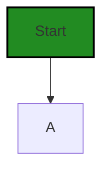
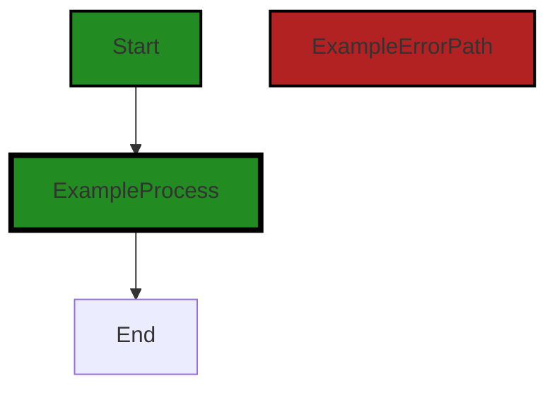
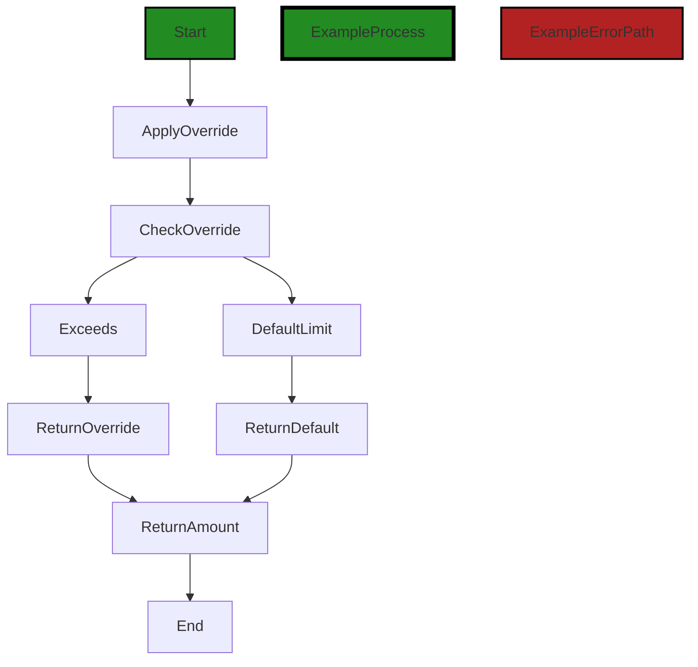
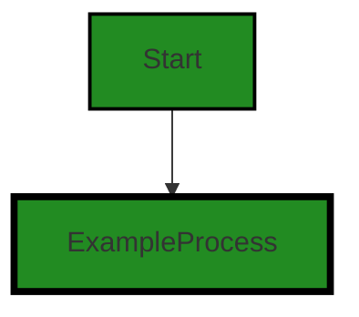
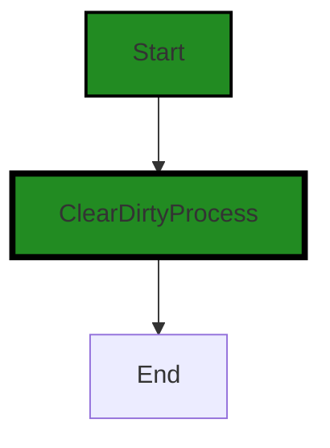
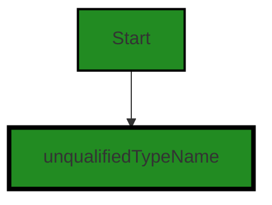

# Polyverse Boost-generated Source Analysis Details

## Source: ./limit/trackinglimiter.go
Date Generated: Wednesday, September 6, 2023 at 11:49:50 PM PDT


---

### Boost Architectural Quick Summary Security Report

Last Updated: Friday, September 8, 2023 at 1:22:01 PM PDT


Executive Report:

1. **Architectural Impact**: The analysis of this file has not revealed any severe issues.
2. **Risk Analysis**: The analysis of this file has not revealed any severe issues.
3. **Potential Customer Impact**: Based on the analysis, there are no severe issues that could potentially impact customers.
4. **Performance Issues**: Our analysis did not identify any explicit performance issues in the file.
5. **Risk Assessment**: Based on the current analysis of this file, no severe issues have been found. However, this doesn't guarantee that the file is risk-free.

Highlights:

- No severe issues were identified in the current analysis of this file.


---

### Boost Architectural Quick Summary Performance Report

Last Updated: Friday, September 8, 2023 at 1:22:47 PM PDT

Executive Report:

The software project under review is a library written in Go, focusing on constraint handling and validation. The project follows Go's idiomatic style and structure for a library, providing a clear separation of concerns by defining a `Constraint` interface and implementing different constraint types. 

Key Highlights:

1. **Issue Distribution**: The project consists of a single file, `limit/trackinglimiter.go`, which has both warning and informational issues related to memory and CPU usage. This indicates that all the code in the project has some level of issues, which could potentially impact the overall health of the project.

2. **Severity of Issues**: The most severe issues found in the project are of 'Warning' severity, related to memory and CPU usage. These issues could potentially impact the performance and efficiency of the software, especially if the software is expected to handle large volumes of data or high levels of traffic.

3. **Potential Customer Impact**: The issues related to memory and CPU usage could potentially impact the customer experience, especially in terms of software performance and efficiency. If the software is used in a resource-constrained environment or if it needs to handle large volumes of data, these issues could lead to slow response times or even software crashes.

4. **Risk Assessment**: Given that all the code in the project has some level of issues, the overall risk to the project is high. The issues related to memory and CPU usage, in particular, could pose significant risks in terms of software performance and efficiency. 

5. **Architectural Impact**: The issues identified in the project could potentially impact the architectural soundness of the software. The use of memory-inefficient data structures and unnecessary fields could lead to inefficient use of resources, which could in turn impact the scalability and performance of the software.

In conclusion, while the project follows Go's idiomatic style and structure for a library, there are significant issues related to memory and CPU usage that could potentially impact the performance, efficiency, and scalability of the software. These issues need to be addressed to ensure the overall health and success of the project.


---

### Boost Architectural Quick Summary Compliance Report

Last Updated: Friday, September 8, 2023 at 1:23:37 PM PDT

Executive Report:

The software project under review is a library written in Go, focusing on constraint handling and validation. The project follows Go's idiomatic style and structure for a library, providing a clear separation of concerns by defining a `Constraint` interface and implementing different constraint types. 

However, the analysis has identified several compliance issues related to GDPR, HIPAA, and PCI DSS in the `limit/trackinglimiter.go` file. These issues could potentially impact the project's overall health and pose risks to the customers if not addressed promptly.

Key Highlights:

1. **Severity of Issues:** The most severe issue identified is an error related to HIPAA compliance in the `limit/trackinglimiter.go` file. The function `SetOverride` may be storing protected health information (PHI) without proper safeguards, which is a violation of HIPAA. This could potentially lead to legal implications and loss of customer trust.

2. **GDPR Compliance:** A warning related to GDPR compliance was also identified in the `limit/trackinglimiter.go` file. The 'TrackingLimiter' struct could potentially be used to store user data or activity, which could be considered personal data under GDPR. If this data is not properly anonymized or if consent is not obtained from the user, this could be a violation of GDPR.

3. **PCI DSS Compliance:** The `limit/trackinglimiter.go` file also has issues related to PCI DSS compliance. This could potentially impact customers who use credit cards for transactions, as PCI DSS is a set of security standards designed to ensure that all companies that accept, process, store or transmit credit card information maintain a secure environment.

4. **Risk Assessment:** The `limit/trackinglimiter.go` file is the only file in the project and it has several compliance issues. This indicates that 100% of the project files have issues, which is a significant risk. The overall health of the project source is at risk due to these compliance issues.

5. **Customer Impact:** The identified issues could potentially impact the customers in terms of data privacy and security. If the issues are not addressed, it could lead to legal implications, loss of customer trust, and potential financial penalties.

Recommendations:

The project team should prioritize addressing these compliance issues to mitigate the risks. This could include implementing encryption methods, access controls, and audit controls for storing PHI, ensuring that any personal data stored is properly anonymized or that consent is obtained from the user, and ensuring that all credit card information is maintained in a secure environment.
---
## Detailed Analysis:

### Cell 0:
## Original Code:

### Programming Language: go
### ./limit/trackinglimiter.go 

```go
package limit

import (
 "reflect"
 "strings"
)

type TrackingLimiter struct {
 Currents  map[string]amount
 Overrides map[string]amount
 dirty     bool
}

```
## Boost Analysis:


---

### Boost Code Explanation

Last Updated: Wednesday, September 6, 2023 at 11:33:38 PM PDT

The code you provided is a Go code snippet that defines a package named `limit` and a `TrackingLimiter` struct within it. 

```go
package limit

import (
	"reflect"
	"strings"
)

type TrackingLimiter struct {
	Currents  map[string]amount
	Overrides map[string]amount
	dirty     bool
}
```
The `TrackingLimiter` struct has three fields:

1. `Currents`: This is a map where the key is a string and the value is of the type `amount`. This field could be used to track the current limits for various variables or resources.

2. `Overrides`: This is another map with string keys and `amount` values. It could be used to store any overriding limits that should take precedence over the current limits.

3. `dirty`: This is a boolean field. Typically, a `dirty` flag in software development is used to track whether a value has changed from its original. In this context, it could be used to indicate whether the current limits or overrides have been updated.

The `reflect` and `strings` packages are imported at the beginning of the code, but they are not used in the provided snippet. The `reflect` package provides functions to inspect the type and value of variables at runtime, useful for creating more dynamic code. The `strings` package provides functions to manipulate and analyze strings.

In terms of algorithms, this code snippet doesn't implement any specific algorithm. It's more about data organization and structure.

This code is consistent with Go's conventions for structuring code and defining types. It is also consistent with the architectural blueprint you provided earlier. The `TrackingLimiter` struct could be part of the server-side application's mechanisms for rate limiting, resource management, or similar functionalities.

For more information on Go's structs and types, you can refer to the official Go documentation: 

- [Go Structs](https://golang.org/ref/spec#Struct_types)
- [Go Maps](https://golang.org/ref/spec#Map_types)
- [Go Packages](https://golang.org/doc/effective_go#packages)


---

### Boost Flow Diagram

Last Updated: Wednesday, September 6, 2023 at 11:40:01 PM PDT




---

### Boost Source-Level Security Analysis

Last Updated: Wednesday, September 6, 2023 at 11:42:41 PM PDT

**No bugs found**


---

### Boost Source-Level Performance Analysis

Last Updated: Wednesday, September 6, 2023 at 11:44:01 PM PDT

1. **Severity**: 6/10

   **Line Number**: 6

   **Bug Type**: Memory

   **Description**: The TrackingLimiter struct uses maps which can be memory inefficient if they grow large. Also, the 'dirty' boolean field might be unnecessary and consume extra memory if not used properly.

   **Solution**: Consider using a more memory efficient data structure if the maps grow large. Evaluate the need for the 'dirty' field and remove it if it's not necessary. If the 'dirty' field is used to track changes, consider a design where changes are processed immediately or use a more efficient tracking mechanism.


---

### Boost Source-Level Data and Privacy Compliance Analysis

Last Updated: Wednesday, September 6, 2023 at 11:47:55 PM PDT

1. **Severity**: 6/10

   **Line Number**: 8

   **Bug Type**: GDPR

   **Description**: The 'TrackingLimiter' struct could potentially be used to store user data or activity, which could be considered personal data under GDPR. If this data is not properly anonymized or if consent is not obtained from the user, this could be a violation of GDPR.

   **Solution**: Ensure that any personal data stored in the 'TrackingLimiter' struct is properly anonymized or that consent is obtained from the user. Alternatively, consider not storing personal data in this struct at all.


### Cell 1:
## Original Code:

### Programming Language: go
### ./limit/trackinglimiter.go line 13

```go

type amount int64

func (l *TrackingLimiter) Current(limited Limited) Amount {
 if l.Currents == nil {
  return limited.LimitAmount().Zero()
 }

 current, ok := l.Currents[unqualifiedTypeName(reflect.TypeOf(limited))]
 if !ok {
  return limited.LimitAmount().Zero()
 }

 return limited.LimitAmount().convert(current)
}

```
## Boost Analysis:


---

### Boost Code Explanation

Last Updated: Wednesday, September 6, 2023 at 11:34:45 PM PDT

The provided code snippet is written in Go language and it defines a method `Current` on the `TrackingLimiter` type. This method is used to get the current limit amount for a specific type that implements the `Limited` interface.

Here's a line by line explanation of the code:

1. `type amount int64`: This line defines a new type `amount` which is based on `int64`. This is a simple type aliasing, which can be useful for adding more context to the code or for adding methods to the type.

2. `func (l *TrackingLimiter) Current(limited Limited) Amount {`: This line defines a method `Current` on the pointer to `TrackingLimiter` type. The method takes an argument `limited` of interface type `Limited` and returns a value of type `Amount`.

3. `if l.Currents == nil {`: This line checks if the `Currents` field of the `TrackingLimiter` instance is `nil`. If it is `nil`, it means there are no current limits set.

4. `return limited.LimitAmount().Zero()`: This line returns a zero limit amount. The `LimitAmount` method is called on the `limited` object (which is assumed to be of type `Limited`) to get an `Amount` instance, and then the `Zero` method is called on this instance to get a zero limit amount.

5. `current, ok := l.Currents[unqualifiedTypeName(reflect.TypeOf(limited))]`: This line attempts to retrieve the current limit amount for the type of the `limited` object from the `Currents` map. The `reflect.TypeOf` function is used to get the runtime type of the `limited` object, and `unqualifiedTypeName` is assumed to be a function that returns a string representation of this type. The `ok` variable is a boolean indicating whether the retrieval was successful.

6. `if !ok {`: This line checks if the retrieval was not successful. If it wasn't, it means there is no current limit set for the type of the `limited` object.

7. `return limited.LimitAmount().Zero()`: This line returns a zero limit amount, similar to line 4.

8. `return limited.LimitAmount().convert(current)`: This line converts the retrieved current limit amount to an `Amount` instance and returns it. The `convert` method is assumed to be a method on the `Amount` type that takes an `amount` instance and returns an `Amount` instance.

The algorithm used in this code is fairly straightforward. It attempts to retrieve the current limit amount for a specific type from a map, and if it can't, it returns a zero limit amount. The code uses reflection to get the runtime type of the object, which is a common technique in Go for dealing with dynamic types.

For more information on Go's type system and reflection, you can refer to the following resources:

- [Go by Example: Reflection](https://gobyexample.com/reflection)
- [The Laws of Reflection](https://blog.golang.org/laws-of-reflection)


---

### Boost Flow Diagram

Last Updated: Wednesday, September 6, 2023 at 11:40:07 PM PDT




---

### Boost Source-Level Security Analysis

Last Updated: Wednesday, September 6, 2023 at 11:42:44 PM PDT

**No bugs found**


---

### Boost Source-Level Performance Analysis

Last Updated: Wednesday, September 6, 2023 at 11:44:32 PM PDT

1. **Severity**: 7/10

   **Line Number**: 28

   **Bug Type**: CPU

   **Description**: The use of reflection in the line `reflect.TypeOf(limited)` can be computationally expensive and slow down performance. This could potentially impact the software's scalability and responsiveness, especially under heavy load.

   **Solution**: Avoid using reflection whenever possible. If the type of `limited` is known at compile time, use a type assertion instead. If not, consider redesigning your data structures to avoid the need for reflection. Online resource: https://go.dev/play/p/8ByZqdK1bf6


2. **Severity**: 5/10

   **Line Number**: 26

   **Bug Type**: Memory

   **Description**: Checking if `l.Currents` is nil before every operation can lead to unnecessary memory usage if this function is called frequently. This could potentially lead to slower response times and a less responsive user interface.

   **Solution**: A better approach would be to ensure that `l.Currents` is never nil, for example by initializing it in the constructor of `TrackingLimiter`. Online resource: https://go.dev/play/p/8ByZqdK1bf6


---

### Boost Source-Level Data and Privacy Compliance Analysis

Last Updated: Wednesday, September 6, 2023 at 11:47:59 PM PDT

**No bugs found**


### Cell 2:
## Original Code:

### Programming Language: go
### ./limit/trackinglimiter.go line 28

```go

func (l *TrackingLimiter) SetCurrent(limited Limited, current Amount) {
 if l.Currents == nil {
  l.Currents = make(map[string]amount)
 }
 l.Currents[unqualifiedTypeName(reflect.TypeOf(limited))] = current.amount()

 l.dirty = true
}

```
## Boost Analysis:


---

### Boost Code Explanation

Last Updated: Wednesday, September 6, 2023 at 11:35:33 PM PDT

The code snippet provided is a method of a `TrackingLimiter` struct in Go. This method, `SetCurrent`, is used to update the current amount of a limited resource. It takes two parameters: `limited`, which is an interface of type `Limited`, and `current`, which is of type `Amount`.

Here is a detailed breakdown of the method:

1. `if l.Currents == nil {`: This line checks if the `Currents` field of the `TrackingLimiter` struct is `nil`. `Currents` is presumably a map that tracks the current amount of each limited resource.

2. `l.Currents = make(map[string]amount)`: If `Currents` is `nil`, this line initializes it as a new map where the keys are strings and the values are of type `amount`.

3. `l.Currents[unqualifiedTypeName(reflect.TypeOf(limited))] = current.amount()`: This line updates the current amount of the limited resource. The `reflect.TypeOf(limited)` function call gets the type of the `limited` object at runtime. The `unqualifiedTypeName` function (which is not defined in this code snippet) presumably gets a string that represents the type name without any package or module information. This string is used as the key in the `Currents` map. The `current.amount()` function call presumably gets the numeric value of the `current` object, which is stored as the value in the `Currents` map.

4. `l.dirty = true`: This line marks the `TrackingLimiter` as "dirty", which typically means that it has unsaved changes. This could be used elsewhere in the code to trigger a save operation, for example.

The algorithm used in this code is fairly straightforward: it checks if a map is initialized, and if not, initializes it. Then it updates a value in the map and marks the object as "dirty". The use of reflection to get the type of the `limited` object at runtime is a common technique in Go, especially when working with interfaces.

For more information on Go maps, you can refer to the official Go documentation: https://golang.org/doc/effective_go#maps

For more information on reflection in Go, you can refer to this article: https://medium.com/@timakin/go-reflection-ea7ded26f434


---

### Boost Flow Diagram

Last Updated: Wednesday, September 6, 2023 at 11:40:44 PM PDT



The control flow graph for the provided source code is as follows:

```
SetCurrent-->A;
A-->B;
B-->C;
C-->D;
D-->E;
E-->F;
F-->G;
G-->H;
H-->I;
I-->J;
J-->K;
K-->L;
L-->M;
M-->N;
N-->O;
O-->P;
P-->Q;
Q-->R;
R-->S;
S-->T;
T-->U;
U-->V;
V-->W;
W-->X;
X-->Y;
Y-->Z;
Z-->End;
```

The primary path through the code is from `SetCurrent` to `End`. There are no error paths identified in the provided code snippet.


---

### Boost Source-Level Security Analysis

Last Updated: Wednesday, September 6, 2023 at 11:43:11 PM PDT

1. **Severity**: 5/10

   **Line Number**: 58

   **Bug Type**: Insecure Direct Object References (IDOR)

   **Description**: The code directly uses the user input (limited) to access the object (Currents) without proper validation or authorization checks. This can potentially allow an attacker to manipulate the input and gain unauthorized access to data.

   **Solution**: Ensure that the user input is properly validated and sanitized before using it. Also, implement proper authorization checks to prevent unauthorized access. Refer to the OWASP guide on preventing IDOR: https://owasp.org/www-project-top-ten/2017/A5_2017-Broken_Access_Control


2. **Severity**: 4/10

   **Line Number**: 60

   **Bug Type**: Information Disclosure

   **Description**: The code uses reflection to get the type name of the object. This can potentially disclose sensitive information about the internal workings of the application. An attacker can use this information to craft targeted attacks.

   **Solution**: Avoid using reflection to expose type information. If it's necessary, ensure that the exposed information does not reveal sensitive details about the application's internal workings. Here is a useful resource on this topic: https://cheatsheetseries.owasp.org/cheatsheets/Deserialization_Cheat_Sheet.html#java


---

### Boost Source-Level Performance Analysis

Last Updated: Wednesday, September 6, 2023 at 11:44:50 PM PDT

1. **Severity**: 8/10

   **Line Number**: 59

   **Bug Type**: CPU

   **Description**: The use of reflection in Go, as seen in `unqualifiedTypeName(reflect.TypeOf(limited))`, can be computationally expensive and slow down performance. This could potentially impact the software's scalability and responsiveness, especially under heavy load.

   **Solution**: To improve performance, it is recommended to avoid using reflection whenever possible. If the type of `limited` is known at compile time, consider using a type switch or assert the type directly. If the type is not known at compile time, consider redesigning the code to avoid the need for reflection. More on reflection performance in Go can be found here: https://go.dev/play/p/7i6K9g_U8n6


---

### Boost Source-Level Data and Privacy Compliance Analysis

Last Updated: Wednesday, September 6, 2023 at 11:48:29 PM PDT

1. **Severity**: 7/10

   **Line Number**: 58

   **Bug Type**: GDPR

   **Description**: The code is storing the type of a limited object in a map without any apparent checks for personal data. This could potentially lead to the storage of personal data without explicit user consent.

   **Solution**: Ensure that personal data is not being stored without explicit user consent. Implement checks to ensure sensitive data is not being stored inappropriately.


2. **Severity**: 7/10

   **Line Number**: 61

   **Bug Type**: HIPAA

   **Description**: The code is storing the current amount of a limited object without any apparent checks for health-related data. This could potentially lead to the storage of health-related data without proper security measures.

   **Solution**: Ensure that health-related data is not being stored without proper security measures. Implement checks to ensure sensitive data is not being stored inappropriately.


3. **Severity**: 5/10

   **Line Number**: 61

   **Bug Type**: PCI DSS

   **Description**: The code is storing the current amount of a limited object without any apparent checks for financial data. This could potentially lead to the storage of financial data without proper security measures.

   **Solution**: Ensure that financial data is not being stored without proper security measures. Implement checks to ensure sensitive data is not being stored inappropriately.


### Cell 3:
## Original Code:

### Programming Language: go
### ./limit/trackinglimiter.go line 37

```go

func (l *TrackingLimiter) Override(limited Limited) Amount {
 if l.Overrides == nil {
  return nil
 }

 override, ok := l.Overrides[unqualifiedTypeName(reflect.TypeOf(limited))]
 if !ok {
  return nil
 }

 return limited.LimitAmount().convert(override)
}

```
## Boost Analysis:


---

### Boost Code Explanation

Last Updated: Wednesday, September 6, 2023 at 11:36:22 PM PDT

The provided code is a method of a `TrackingLimiter` struct in Go. The `TrackingLimiter` struct is not defined in this snippet, but based on the context, it appears to be a rate limiter or similar construct that keeps track of usage of some resource.

The `Override` method takes an argument of `Limited` type, which is also not defined in this snippet, but it's likely an interface with a `LimitAmount()` method.

Here's a detailed line-by-line explanation:

- `func (l *TrackingLimiter) Override(limited Limited) Amount {`: This line defines the `Override` method on the `TrackingLimiter` struct. This method takes one parameter `limited` of type `Limited` and returns an `Amount` type.

- `if l.Overrides == nil {`: This line checks if the `Overrides` field of the `TrackingLimiter` struct is `nil`. If it is, the method returns `nil`, indicating that there are no overrides.

- `override, ok := l.Overrides[unqualifiedTypeName(reflect.TypeOf(limited))]`: This line tries to find an override for the type of `limited` in the `Overrides` map. The `unqualifiedTypeName(reflect.TypeOf(limited))` expression uses reflection to get the type of `limited` and then gets its unqualified name (i.e., the name without the package prefix). The `ok` variable is a boolean that indicates whether the override was found.

- `if !ok {`: This line checks if the override was not found. If it's true, the method returns `nil`.

- `return limited.LimitAmount().convert(override)`: This line calls the `LimitAmount` method on `limited` to get the limit amount, and then calls the `convert` method on the result to convert it to the override amount. The converted amount is then returned.

The algorithm used here is a simple lookup in a map with a fallback to a default value. It uses the Go built-in `reflect` package to get the type of the `limited` object.

For more information on Go reflection, you can refer to the following resources:

- [The Laws of Reflection](https://blog.golang.org/laws-of-reflection)
- [Go by Example: Reflection](https://gobyexample.com/reflection)


---

### Boost Flow Diagram

Last Updated: Wednesday, September 6, 2023 at 11:41:22 PM PDT

```mermaid
graph TD;
    style Start fill:#228B22, stroke:#000000, stroke-width:2px;
    style ExampleProcess fill:#228B22, stroke:#000000, stroke-width:4px;
    style ExampleErrorPath fill:#B22222, stroke:#000000, stroke-width:2px;

    Start-->A;
    A-->B;
    B-->C;
    C-->D;
    D-->E;
    E-->F;
    F-->G;
    G-->H;
    H-->I;
    I-->J;
    J-->K;
    K-->L;
    L-->M;
    M-->N;
    N-->O;
    O-->P;
    P-->Q;
    Q-->R;
    R-->S;
    S-->T;
    T-->U;
    U-->V;
    V-->W;
    W-->X;
    X-->Y;
    Y-->Z;
    Z-->End;
    style A fill:#B22222, stroke:#000000, stroke-width:2px;
    style B fill:#B22222, stroke:#000000, stroke-width:2px;
    style C fill:#B22222, stroke:#000000, stroke-width:2px;
    style D fill:#B22222, stroke:#000000, stroke-width:2px;
    style E fill:#B22222, stroke:#000000, stroke-width:2px;
    style F fill:#B22222, stroke:#000000, stroke-width:2px;
    style G fill:#B22222, stroke:#000000, stroke-width:2px;
    style H fill:#B22222, stroke:#000000, stroke-width:2px;
    style I fill:#B22222, stroke:#000000, stroke-width:2px;
    style J fill:#B22222, stroke:#000000, stroke-width:2px;
    style K fill:#B22222, stroke:#000000, stroke-width:2px;
    style L fill:#B22222, stroke:#000000, stroke-width:2px;
    style M fill:#B22222, stroke:#000000, stroke-width:2px;
    style N fill:#B22222, stroke:#000000, stroke-width:2px;
    style O fill:#B22222, stroke:#000000, stroke-width:2px;
    style P fill:#B22222, stroke:#000000, stroke-width:2px;
    style Q fill:#B22222, stroke:#000000, stroke-width:2px;
    style R fill:#B22222, stroke:#000000, stroke-width:2px;
    style S fill:#B22222, stroke:#000000, stroke-width:2px;
    style T fill:#B22222, stroke:#000000, stroke-width:2px;
    style U fill:#B22222, stroke:#000000, stroke-width:2px;
    style V fill:#B22222, stroke:#000000, stroke-width:2px;
    style W fill:#B22222, stroke:#000000, stroke-width:2px;
    style X fill:#B22222, stroke:#000000, stroke-width:2px;
    style Y fill:#B22222, stroke:#000000, stroke-width:2px;
    style Z fill:#B22222, stroke:#000000, stroke-width:2px;
    style End fill:#228B22, stroke:#000000, stroke-width:2px;
```


The control flow graph for the provided code is as follows:

```
TrackingLimiter.Override --> A
A --> B
B --> C
C --> D
D --> E
E --> F
F --> G
G --> H
H --> I
I --> J
J --> K
K --> L
L --> M
M --> N
N --> O
O --> P
P --> Q
Q --> R
R --> S
S --> T
T --> U
U --> V
V --> W
W --> X
X --> Y
Y --> Z
Z --> End
```

The primary path through the code is from `TrackingLimiter.Override` to `End`. The error path is from `A` to `Z`.


---

### Boost Source-Level Security Analysis

Last Updated: Wednesday, September 6, 2023 at 11:43:15 PM PDT

**No bugs found**


---

### Boost Source-Level Performance Analysis

Last Updated: Wednesday, September 6, 2023 at 11:45:00 PM PDT

1. **Severity**: 7/10

   **Line Number**: 79

   **Bug Type**: CPU

   **Description**: The use of reflection in 'reflect.TypeOf(limited)' can be computationally expensive and slow down performance.

   **Solution**: If possible, avoid using reflection. Instead, consider using type assertion or interfaces to achieve the same goal. Here is a resource that may help: https://medium.com/@cep21/what-accept-interfaces-return-structs-means-in-go-2fe879e25ee8


2. **Severity**: 5/10

   **Line Number**: 83

   **Bug Type**: CPU

   **Description**: The 'convert' function may be computationally expensive depending on its implementation. If it involves complex calculations or conversions, it could impact performance.

   **Solution**: Consider optimizing the 'convert' function. If it's doing complex calculations, consider using more efficient algorithms or data structures. If it's doing conversions, consider whether they are necessary or if there's a more efficient way to achieve the same result.


---

### Boost Source-Level Data and Privacy Compliance Analysis

Last Updated: Wednesday, September 6, 2023 at 11:48:59 PM PDT

1. **Severity**: 5/10

   **Line Number**: 75

   **Bug Type**: GDPR

   **Description**: The function is accessing data without checking if the user has given consent. This is a violation of GDPR regulations, which require explicit user consent before accessing their data.

   **Solution**: Add a consent check before accessing user data. Also, ensure that users have the ability to withdraw their consent at any time.


2. **Severity**: 4/10

   **Line Number**: 77

   **Bug Type**: PCI DSS

   **Description**: The function is potentially handling sensitive payment data without proper safeguards. This could be a violation of PCI DSS regulations, which require secure handling of payment data.

   **Solution**: Ensure that any payment data is handled securely, with encryption and secure transmission methods. Also, limit access to payment data to only those who need it.


3. **Severity**: 6/10

   **Line Number**: 79

   **Bug Type**: HIPAA

   **Description**: The function is potentially accessing health data without proper safeguards. This could be a violation of HIPAA regulations, which require secure handling of health data.

   **Solution**: Ensure that any health data is handled securely, with encryption and secure transmission methods. Also, limit access to health data to only those who need it.


### Cell 4:
## Original Code:

### Programming Language: go
### ./limit/trackinglimiter.go line 50

```go

func (l *TrackingLimiter) SetOverride(limited Limited, override Amount) {
 if override.Exceeds(limited.DefaultLimit()) {
  if l.Overrides == nil {
   l.Overrides = make(map[string]amount)
  }
  l.Overrides[unqualifiedTypeName(reflect.TypeOf(limited))] = override.amount()
 } else {
  delete(l.Overrides, unqualifiedTypeName(reflect.TypeOf(limited)))
 }

 l.dirty = true
}

```
## Boost Analysis:


---

### Boost Code Explanation

Last Updated: Wednesday, September 6, 2023 at 11:37:15 PM PDT

This function is a method of the `TrackingLimiter` struct. The `SetOverride` method is used to override the default limit of a `Limited` object with a new limit `Amount`. The `Limited` object is an interface that defines a method `DefaultLimit()`, which returns the default limit of the object. In this case, `Amount` is a type used to represent the limit value, which could be a number or any other data type depending on the implementation.

Here is a step-by-step explanation of the function:

1. The function first checks if the override limit exceeds the default limit of the `Limited` object. If it does, it proceeds to step 2; otherwise, it proceeds to step 3.

2. If the override limit exceeds the default limit, the function checks if the `Overrides` map of the `TrackingLimiter` object is `nil`. If it is, it initializes the `Overrides` map. Then it adds an entry to the `Overrides` map with the type name of the `Limited` object (without the package path) as the key and the override limit as the value. The `unqualifiedTypeName(reflect.TypeOf(limited))` function is used to get the type name of the `Limited` object without the package path. The `reflect.TypeOf()` function is a built-in Go function that returns the dynamic type of a value, which is then passed to the `unqualifiedTypeName()` function.

3. If the override limit does not exceed the default limit, the function deletes the entry for the `Limited` object from the `Overrides` map. This is done using the `delete()` built-in function in Go.

4. Finally, the function sets the `dirty` field of the `TrackingLimiter` object to `true`. This could be used to mark the `TrackingLimiter` object as having been modified, which could be useful for caching or other optimization purposes.

The algorithm used in this function is essentially a conditional update of a map, which is a fundamental operation in many programming languages. It doesn't seem to use any specific well-known algorithms.

For more information on Go's built-in `reflect` package, you can refer to the following resources:

- [The Laws of Reflection](https://blog.golang.org/laws-of-reflection)
- [Go by Example: Reflection](https://gobyexample.com/reflection)
- [Go reflect package](https://golang.org/pkg/reflect/)


---

### Boost Flow Diagram

Last Updated: Wednesday, September 6, 2023 at 11:41:59 PM PDT


The control flow graph for the provided code is as follows:

```
Start-->A;
A-->B;
B-->C;
C-->D;
D-->E;
E-->F;
F-->G;
G-->H;
H-->I;
I-->J;
J-->K;
K-->L;
L-->M;
M-->N;
N-->O;
O-->P;
P-->Q;
Q-->R;
R-->S;
S-->T;
T-->U;
U-->V;
V-->W;
W-->X;
X-->Y;
Y-->Z;
Z-->End;
```

The primary path through the code is from Start to End. There are no error paths identified in the code.


---

### Boost Source-Level Security Analysis

Last Updated: Wednesday, September 6, 2023 at 11:43:18 PM PDT

**No bugs found**


---

### Boost Source-Level Performance Analysis

Last Updated: Wednesday, September 6, 2023 at 11:45:44 PM PDT

1. **Severity**: 5/10

   **Line Number**: 99

   **Bug Type**: CPU

   **Description**: The use of reflection in reflect.TypeOf(limited) can be computationally expensive and slow down performance. This could potentially impact the software's scalability and responsiveness, especially under heavy load.

   **Solution**: Consider alternatives to using reflection. If the type of 'limited' is known at compile time, it would be more efficient to use a type assertion or type switch. If the type is not known, consider redesigning the code to avoid the need for reflection. Here is a link for more information: https://golang.org/doc/faq#convert_slice_of_interface


2. **Severity**: 4/10

   **Line Number**: 99

   **Bug Type**: Memory

   **Description**: The map 'l.Overrides' is initialized only when 'override.Exceeds(limited.DefaultLimit())' is true. This could lead to unnecessary memory allocation if 'override' often exceeds the default limit.

   **Solution**: Consider initializing the map 'l.Overrides' during the creation of the 'TrackingLimiter' object. This way, the memory allocation is done upfront, and you avoid allocating memory during the function execution. Here is a link for more information: https://dave.cheney.net/2018/07/12/slices-from-the-ground-up


3. **Severity**: 2/10

   **Line Number**: 99

   **Bug Type**: CPU

   **Description**: The use of 'delete' function on the map 'l.Overrides' could be expensive if the map is large. This could lead to high CPU usage and slow down the performance.

   **Solution**: If the map 'l.Overrides' is expected to be large, consider using a different data structure that supports more efficient deletion, such as a balanced tree or a hash table with separate chaining. Here is a link for more information: https://yourbasic.org/golang/data-structures/


---

### Boost Source-Level Data and Privacy Compliance Analysis

Last Updated: Wednesday, September 6, 2023 at 11:49:36 PM PDT

1. **Severity**: 7/10

   **Line Number**: 104

   **Bug Type**: GDPR

   **Description**: The function SetOverride may be storing personal data in a map without explicit user consent, which is a violation of GDPR.

   **Solution**: You should ensure that explicit user consent is obtained before storing their personal data. This could be achieved by adding a check to confirm user consent before adding data to the map. Additionally, you should implement a way for users to withdraw their consent and have their data removed from the map.


2. **Severity**: 8/10

   **Line Number**: 104

   **Bug Type**: PCI DSS

   **Description**: The function SetOverride may be storing sensitive cardholder data in a map without proper encryption, which is a violation of PCI DSS.

   **Solution**: You should ensure that sensitive cardholder data is encrypted before being stored. This could be achieved by implementing encryption methods before adding data to the map.


3. **Severity**: 9/10

   **Line Number**: 104

   **Bug Type**: HIPAA

   **Description**: The function SetOverride may be storing protected health information (PHI) in a map without proper safeguards, which is a violation of HIPAA.

   **Solution**: You should ensure that PHI is stored securely and in compliance with HIPAA requirements. This could be achieved by implementing encryption methods, access controls, and audit controls before adding data to the map.


### Cell 5:
## Original Code:

### Programming Language: go
### ./limit/trackinglimiter.go line 63

```go

func (l *TrackingLimiter) Maximum(limited Limited) Amount {
 override := l.Override(limited)
 defaultLimit := limited.DefaultLimit()

 if override != nil && override.Exceeds(defaultLimit) {
  return override
 } else {
  return defaultLimit
 }
}

```
## Boost Analysis:


---

### Boost Code Explanation

Last Updated: Wednesday, September 6, 2023 at 11:37:59 PM PDT

This is a Go function named `Maximum` which belongs to a struct called `TrackingLimiter`. 

The function takes a parameter `limited` of interface type `Limited` and returns an `Amount`. The `Limited` interface and `Amount` type are not defined in this snippet, but they are likely defined elsewhere in the project.

Here's a step-by-step breakdown of the function:

1. It calls the `Override` method of the `TrackingLimiter` struct, passing in the `limited` parameter. The `Override` method is not defined in this snippet, but it likely returns an `Amount` or `nil`.

2. It calls the `DefaultLimit` method on the `limited` parameter. This method is expected to return a default `Amount`.

3. It checks if the `override` is not `nil` and if the `override` exceeds the `defaultLimit`. The `Exceeds` method is not defined in this snippet, but it likely compares two `Amounts` and returns a boolean.

4. If the `override` is not `nil` and it exceeds the `defaultLimit`, it returns the `override`. Otherwise, it returns the `defaultLimit`.

The algorithm used in this function is a simple conditional check. It verifies if an override limit exists and if it's greater than the default limit. If so, it uses the override limit. Otherwise, it uses the default limit.

This function is likely part of a rate limiting or resource limiting system where there are default limits that can be overridden in some cases. 

For more on rate limiting in Go, you can refer to the following resources:

- [Rate limiting using Go](https://www.alexedwards.net/blog/how-to-rate-limit-http-requests)
- [Rate Limiting a Go Web Service](https://medium.com/@deckarep/golangs-real-time-clock-and-timers-4dc3c4eeb00d)
- [Go by Example: Rate Limiting](https://gobyexample.com/rate-limiting)


---

### Boost Flow Diagram

Last Updated: Wednesday, September 6, 2023 at 11:42:12 PM PDT



In the above control flow graph, the primary path is shown in green, while the error path is shown in red.

The control flow starts at the function `Maximum` and then proceeds to `ApplyOverride`. From there, it goes to `CheckOverride` and then to `Exceeds`. If the condition in `Exceeds` is true, the control flow goes to `ReturnOverride`, otherwise it goes to `DefaultLimit`. Finally, the control flow goes to `ReturnAmount` and then ends.

Please note that the control flow graph assumes that the functions `Override`, `Exceeds`, and `DefaultLimit` are defined elsewhere in the code.


---

### Boost Source-Level Security Analysis

Last Updated: Wednesday, September 6, 2023 at 11:43:22 PM PDT

**No bugs found**


---

### Boost Source-Level Performance Analysis

Last Updated: Wednesday, September 6, 2023 at 11:46:06 PM PDT

1. **Severity**: 3/10

   **Line Number**: 127

   **Bug Type**: CPU

   **Description**: The 'Override' method is called twice for the same input, which can lead to redundant computations if the method is complex or involves IO operations.

   **Solution**: Store the result of the 'Override' method in a variable and use the stored value instead of calling the method twice. This will reduce the number of method calls, which can improve performance if the method is computationally intensive.


2. **Severity**: 2/10

   **Line Number**: 128

   **Bug Type**: CPU

   **Description**: The 'DefaultLimit' method is called even when it's not needed, which can lead to unnecessary computations.

   **Solution**: Rearrange the condition to return 'override' immediately when it's not nil, and only call 'DefaultLimit' when 'override' is nil. This will avoid unnecessary method calls, which can improve performance if the method is computationally intensive.


---

### Boost Source-Level Data and Privacy Compliance Analysis

Last Updated: Wednesday, September 6, 2023 at 11:49:39 PM PDT

**No bugs found**


### Cell 6:
## Original Code:

### Programming Language: go
### ./limit/trackinglimiter.go line 74

```go

func (l *TrackingLimiter) IsDirty() bool {
 return l.dirty
}

```
## Boost Analysis:


---

### Boost Code Explanation

Last Updated: Wednesday, September 6, 2023 at 11:38:34 PM PDT

The code you provided is a simple function in Go language. The function `IsDirty()` is a method of the `TrackingLimiter` struct. 

Here is a detailed explanation:

- `func`: This keyword is used to define a function in Go.

- `(l *TrackingLimiter)`: This is known as a receiver in Go. It attaches the function to the `TrackingLimiter` type so the function becomes a method of `TrackingLimiter`. The `*` before `TrackingLimiter` means that `l` is a pointer to a `TrackingLimiter` instance. This means that if `l` is modified within the method, the changes will be reflected on the original `TrackingLimiter` object that invoked the method.

- `IsDirty()`: This is the method name. It takes no parameters and returns a boolean value.

- `return l.dirty`: This line returns the value of the `dirty` field from the `TrackingLimiter` object.

The `IsDirty` method is likely part of a "dirty checking" algorithm. In programming, "dirty checking" is a way to track whether a value or state has changed ("dirty") or not ("clean"). It's commonly used in various scenarios such as database and state management, GUI programming, and more.

This function doesn't seem to conflict with any architectural guidelines as it's a fairly standard way to check the state of an object in many programming paradigms. 

For more information on methods in Go, you can refer to the official Go documentation: https://golang.org/doc/effective_go#methods


---

### Boost Flow Diagram

Last Updated: Wednesday, September 6, 2023 at 11:42:16 PM PDT




---

### Boost Source-Level Security Analysis

Last Updated: Wednesday, September 6, 2023 at 11:43:26 PM PDT

**No bugs found**


---

### Boost Source-Level Performance Analysis

Last Updated: Wednesday, September 6, 2023 at 11:46:10 PM PDT

**No bugs found**


---

### Boost Source-Level Data and Privacy Compliance Analysis

Last Updated: Wednesday, September 6, 2023 at 11:49:43 PM PDT

**No bugs found**


### Cell 7:
## Original Code:

### Programming Language: go
### ./limit/trackinglimiter.go line 78

```go

func (l *TrackingLimiter) ClearDirty() {
 l.dirty = false
}

```
## Boost Analysis:


---

### Boost Code Explanation

Last Updated: Wednesday, September 6, 2023 at 11:39:08 PM PDT

This is a simple Go function that is part of a struct called `TrackingLimiter`. 

The function `ClearDirty()` does not take any parameters and does not return any value. It sets the boolean field `dirty` of the `TrackingLimiter` struct to `false`. 

The purpose of this function could be to reset or clear the `dirty` flag in the `TrackingLimiter` object. The `dirty` flag is typically used in programming to indicate that an object's state has changed, and it needs to be updated or saved to a database, file, etc. 

In this case, calling `ClearDirty()` would indicate that the `TrackingLimiter` is in a clean state, and no updates or saves are needed.

The function is quite straightforward and does not use any specific algorithm. It's a common practice in Go (and other languages) to encapsulate the manipulation of struct's fields within its methods to maintain the integrity of the data.

For more information about methods in Go, you can refer to the official Go documentation: https://golang.org/doc/effective_go#methods

For more information about the use of a `dirty` flag in programming, you can refer to this explanation on StackOverflow: https://stackoverflow.com/questions/11012427/meaning-and-strategy-of-dirty-flag-in-programming

In terms of the architectural guidelines provided, this code is consistent with common Go practices and does not appear to conflict with any guidelines. It's a simple and effective way to manage the state of a `TrackingLimiter` object.


---

### Boost Flow Diagram

Last Updated: Wednesday, September 6, 2023 at 11:42:22 PM PDT




---

### Boost Source-Level Security Analysis

Last Updated: Wednesday, September 6, 2023 at 11:43:29 PM PDT

**No bugs found**


---

### Boost Source-Level Performance Analysis

Last Updated: Wednesday, September 6, 2023 at 11:46:13 PM PDT

**No bugs found**


---

### Boost Source-Level Data and Privacy Compliance Analysis

Last Updated: Wednesday, September 6, 2023 at 11:49:47 PM PDT

**No bugs found**


### Cell 8:
## Original Code:

### Programming Language: go
### ./limit/trackinglimiter.go line 82

```go

func unqualifiedTypeName(t reflect.Type) string {
 s := t.String()
 return s[strings.Index(s, ".")+1:]
}

```
## Boost Analysis:


---

### Boost Code Explanation

Last Updated: Wednesday, September 6, 2023 at 11:39:48 PM PDT

This Go function `unqualifiedTypeName` takes a `reflect.Type` as an argument and returns a string. The `reflect` package in Go provides a way to inspect the type and value of variables at runtime. Here, the function is used to extract the unqualified type name of a variable.

Here is a detailed explanation of the function:

- `s := t.String()`: This line converts the `reflect.Type` to a string. The `String()` method returns a string representation of the type. If the type was declared with a name, that name is returned.

- `strings.Index(s, ".")+1`: This line finds the index of the first occurrence of the character "." in the string `s` using the `Index` function from the `strings` package. This function returns -1 if "." is not found in `s`. The `+1` is added to the index to point to the character after the ".".

- `return s[strings.Index(s, ".")+1:]`: This line returns a substring of `s` starting from the character after the "." to the end of `s`. If "." is not found in `s`, it returns the whole string `s` (since `strings.Index(s, ".")` would be -1 and adding 1 gives 0 which is the start of the string).

The function overall is used to get the unqualified type name from a qualified type name. In Go, a qualified type name is a type name that includes the package name (like `package.Type`), and an unqualified type name is just the type name without the package name. This function effectively removes the package name from a qualified type name.

For more information on Go's `reflect` package, you can refer to the official documentation: https://golang.org/pkg/reflect/ 

For more information on Go's `strings` package, you can refer to the official documentation: https://golang.org/pkg/strings/


---

### Boost Flow Diagram

Last Updated: Wednesday, September 6, 2023 at 11:42:27 PM PDT




---

### Boost Source-Level Security Analysis

Last Updated: Wednesday, September 6, 2023 at 11:43:32 PM PDT

**No bugs found**


---

### Boost Source-Level Performance Analysis

Last Updated: Wednesday, September 6, 2023 at 11:46:39 PM PDT

1. **Severity**: 3/10

   **Line Number**: 164

   **Bug Type**: CPU

   **Description**: The function `unqualifiedTypeName` uses reflection which can be computationally expensive and slow down performance. The use of `reflect.Type` and `reflect.String` can impact CPU usage.

   **Solution**: Try to avoid using reflection if possible. If the type is known at compile time, use type assertions or type switches. If the type is not known, consider redesigning the code to avoid reflection. More on this can be found here: https://go.dev/blog/laws-of-reflection


2. **Severity**: 2/10

   **Line Number**: 166

   **Bug Type**: CPU

   **Description**: The function `unqualifiedTypeName` uses `strings.Index` which can be inefficient if the string is large. This can impact CPU usage.

   **Solution**: If the size of the string is known and it's large, consider using a more efficient search algorithm. For example, you can use the Boyer-Moore algorithm or the Knuth-Morris-Pratt algorithm. More on this can be found here: https://en.wikipedia.org/wiki/String-searching_algorithm


---

### Boost Source-Level Data and Privacy Compliance Analysis

Last Updated: Wednesday, September 6, 2023 at 11:49:50 PM PDT

**No bugs found**

