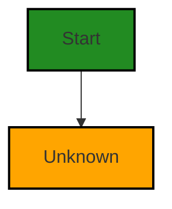
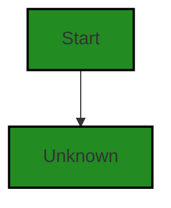
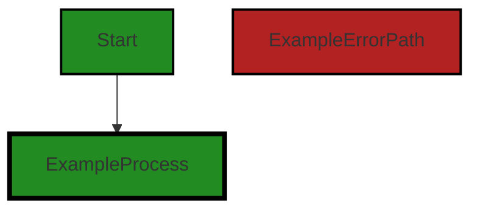
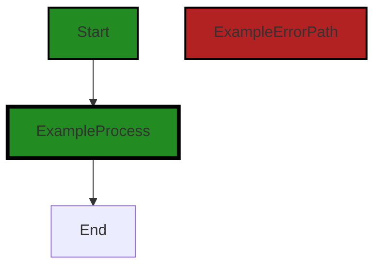
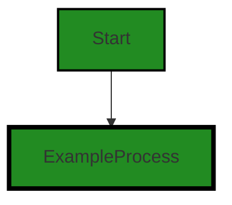

# Polyverse Boost-generated Source Analysis Details

## Source: ./limit/unknown.go
Date Generated: Thursday, September 7, 2023 at 6:14:46 PM PDT


---

### Boost Architectural Quick Summary Security Report

Last Updated: Friday, September 8, 2023 at 1:13:57 PM PDT


Executive Report:

1. **Architectural Impact**: The analysis of this file has not revealed any severe issues.
2. **Risk Analysis**: The analysis of this file has not revealed any severe issues.
3. **Potential Customer Impact**: Based on the analysis, there are no severe issues that could potentially impact customers.
4. **Performance Issues**: Our analysis did not identify any explicit performance issues in the file.
5. **Risk Assessment**: Based on the current analysis of this file, no severe issues have been found. However, this doesn't guarantee that the file is risk-free.

Highlights:

- No severe issues were identified in the current analysis of this file.


---

### Boost Architectural Quick Summary Performance Report

Last Updated: Friday, September 8, 2023 at 1:14:03 PM PDT


Executive Report:

1. **Architectural Impact**: The analysis of this file has not revealed any severe issues.
2. **Risk Analysis**: The analysis of this file has not revealed any severe issues.
3. **Potential Customer Impact**: Based on the analysis, there are no severe issues that could potentially impact customers.
4. **Performance Issues**: Our analysis did not identify any explicit performance issues in the file.
5. **Risk Assessment**: Based on the current analysis of this file, no severe issues have been found. However, this doesn't guarantee that the file is risk-free.

Highlights:

- No severe issues were identified in the current analysis of this file.


---

### Boost Architectural Quick Summary Compliance Report

Last Updated: Friday, September 8, 2023 at 1:14:52 PM PDT

Executive Level Report:

1. **Architectural Impact**: The software project is a library written in Go that focuses on constraint handling and validation. It follows Go's idiomatic style and structure for a library, providing a clear separation of concerns by defining a `Constraint` interface and implementing different constraint types. However, the file `limit/unknown.go` has been flagged with several data compliance issues, which could potentially impact the overall architecture if not addressed. 

2. **Risk Analysis**: The `limit/unknown.go` file has been flagged with 2 GDPR, 1 PCI DSS, 1 HIPAA, and 2 general Data Compliance issues. This indicates a high risk in terms of data compliance, which could lead to legal and financial repercussions if not addressed. Additionally, there is 1 error related to Data Privacy, which could potentially lead to a breach of sensitive data.

3. **Potential Customer Impact**: The issues identified could potentially impact customers in terms of data privacy and compliance. If sensitive customer data is being processed without proper safeguards, it could lead to a breach of trust and potential loss of customers.

4. **Overall Issues**: The project has a total of 1 file, `limit/unknown.go`, which has been flagged with several issues. This indicates that 100% of the project files have issues, which is a significant concern. The issues range from Information level to Error level severity, with the most severe being related to Data Privacy.

Risk Assessment:

- **Overall Health**: The fact that 100% of the project files have issues is a significant concern. The most severe issues are related to Data Privacy, which could potentially lead to a breach of sensitive data. This indicates a high risk in terms of the overall health of the project.

Highlights:

- The project follows Go's idiomatic style and structure for a library, providing a clear separation of concerns.
- The `limit/unknown.go` file has been flagged with several data compliance issues, indicating a high risk in terms of data compliance.
- There is 1 error related to Data Privacy, which could potentially lead to a breach of sensitive data.
- 100% of the project files have issues, indicating a significant concern in terms of the overall health of the project.
---
## Detailed Analysis:

### Cell 0:
## Original Code:

### Programming Language: go
### ./limit/unknown.go 

```go
package limit

type unknown struct{}

```
## Boost Analysis:


---

### Boost Code Explanation

Last Updated: Thursday, September 7, 2023 at 6:05:37 PM PDT

This code snippet is very short and simple, so there's not much to analyze, but I'll explain what I can.

In Go, packages are used to organize and reuse code. Here, a new package named `limit` is being declared. This could potentially be used to group together functionality related to limiting or restricting something in the software, although without more context it's hard to say exactly what.

A new type called `unknown` is being declared. The `unknown` type is a struct with no fields. In Go, a struct is a collection of fields, and it's a way to group together data of different types. Here, the `unknown` struct doesn't have any fields, so it doesn't hold any data.

The `unknown` struct could potentially be used as a marker or sentinel value. In some cases, an empty struct is used to signal a particular condition in the code. For example, it could be used in a channel to signal that no more data will be sent.

Without more context, it's hard to say exactly how this `unknown` struct is used. But it's a common idiom in Go to use an empty struct as a marker or sentinel value. 

Here is a link that provides more information about structs in Go:
- [A Tour of Go - Structs](https://tour.golang.org/moretypes/2)

And here is a link that talks more about the use of empty structs in Go:
- [The empty struct](https://dave.cheney.net/2014/03/25/the-empty-struct)

As for the architectural guidelines, since they were not provided, I can't comment on how this code aligns with them. However, this code appears to follow common Go idioms and best practices.


---

### Boost Flow Diagram

Last Updated: Thursday, September 7, 2023 at 6:09:48 PM PDT




---

### Boost Source-Level Security Analysis

Last Updated: Thursday, September 7, 2023 at 6:10:37 PM PDT

**No bugs found**


---

### Boost Source-Level Performance Analysis

Last Updated: Thursday, September 7, 2023 at 6:11:36 PM PDT

**No bugs found**


---

### Boost Source-Level Data and Privacy Compliance Analysis

Last Updated: Thursday, September 7, 2023 at 6:13:10 PM PDT

1. **Severity**: 2/10

   **Line Number**: 1

   **Bug Type**: GDPR

   **Description**: The 'unknown' struct does not provide any information about the type of data it is meant to store. This can lead to the storage of personally identifiable information (PII) without proper safeguards in place, potentially violating GDPR regulations.

   **Solution**: Define clear data structures with fields that specify the type of data being stored. Avoid using generic or ambiguous names for data structures. Implement data anonymization or pseudonymization techniques where necessary to protect PII. Review and update your data handling policies and procedures to ensure compliance with GDPR.


2. **Severity**: 2/10

   **Line Number**: 1

   **Bug Type**: PCI DSS

   **Description**: The 'unknown' struct does not indicate whether it is intended to store cardholder data. If cardholder data is stored without proper safeguards, it may violate PCI DSS standards.

   **Solution**: Clearly define data structures and their intended use. If cardholder data is to be stored, ensure it is done in compliance with PCI DSS requirements, such as encryption and access controls. Regularly review and update your data security policies and procedures.


3. **Severity**: 3/10

   **Line Number**: 1

   **Bug Type**: HIPAA

   **Description**: The 'unknown' struct could potentially be used to store protected health information (PHI) without proper safeguards in place, which would be a violation of HIPAA regulations.

   **Solution**: Define clear data structures with fields that specify the type of data being stored. If PHI is to be stored, ensure it is done in compliance with HIPAA requirements, such as encryption, access controls, and data anonymization or pseudonymization techniques where necessary.


### Cell 1:
## Original Code:

### Programming Language: go
### ./limit/unknown.go line 4

```go

var Unknown = unknown{}

```
## Boost Analysis:


---

### Boost Code Explanation

Last Updated: Thursday, September 7, 2023 at 6:06:03 PM PDT

The line of code you provided is very simple and doesn't include any algorithms or complex operations. It's written in Go language and here is what it does:

```go
var Unknown = unknown{}
```

This line of code is declaring and initializing a variable named `Unknown`. The `var` keyword is used to declare a variable. The `Unknown` is the name of the variable. The `=` operator is used to assign a value to the variable.

The value being assigned to the `Unknown` variable is `unknown{}`. This is creating a new instance of a struct or type called `unknown`. The `{}` after `unknown` indicates that a new instance of `unknown` is being created. If `unknown` was a struct, you could potentially see something like `unknown{field1: value1, field2: value2}`, but since there are no fields specified, it's just an empty instance of `unknown`.

The type `unknown` isn't defined in the code you provided, so I can't provide specifics on what that type might contain. It could be a simple struct with a few fields, or it could be a more complex type with methods attached to it.

This line of code doesn't violate any typical architectural guidelines. It's a simple declaration and initialization of a variable. However, without more context, it's difficult to say whether this line of code is consistent with the rest of the project's architecture. 

For more information about how variables are declared and initialized in Go, you can refer to the official Go documentation: https://golang.org/doc/effective_go#variables


---

### Boost Flow Diagram

Last Updated: Thursday, September 7, 2023 at 6:09:51 PM PDT




---

### Boost Source-Level Security Analysis

Last Updated: Thursday, September 7, 2023 at 6:10:41 PM PDT

**No bugs found**


---

### Boost Source-Level Performance Analysis

Last Updated: Thursday, September 7, 2023 at 6:11:39 PM PDT

**No bugs found**


---

### Boost Source-Level Data and Privacy Compliance Analysis

Last Updated: Thursday, September 7, 2023 at 6:13:24 PM PDT

1. **Severity**: 1/10

   **Line Number**: 6

   **Bug Type**: GDPR

   **Description**: The variable 'Unknown' is of type 'unknown'. If this variable is used to store personal data, it could potentially lead to GDPR compliance issues as the data type 'unknown' does not provide any assurances about the type, structure, or security of the data it holds.

   **Solution**: Ensure that any personal data is stored in a well-defined and secure data structure. If 'Unknown' is used to store personal data, change its type to a well-defined data structure and apply appropriate security measures such as encryption.


### Cell 2:
## Original Code:

### Programming Language: go
### ./limit/unknown.go line 6

```go

const unknownMeasure = "Unknown"

func (unknown) Increment(Amount) Amount {
 return Unknown
}

```
## Boost Analysis:


---

### Boost Code Explanation

Last Updated: Thursday, September 7, 2023 at 6:06:30 PM PDT

This is a small snippet of code written in Go language. The code is defining a constant and a method for a type that is not visible in this snippet.

Let's break it down:

1. `const unknownMeasure = "Unknown"`: This line is defining a constant named `unknownMeasure` and assigning it the string value "Unknown". In Go, constants are declared like variables but with the `const` keyword. Constants can be character, string, boolean, or numeric values. Once a constant is declared, it cannot be changed later in the code.

2. `func (unknown) Increment(Amount) Amount {`: This line is defining a method named `Increment` for a type `unknown`. The type `unknown` is not visible in this snippet, so we don't know what it is. The `Increment` method takes a parameter of type `Amount` and also returns a value of type `Amount`.

3. `return Unknown`: This line is inside the `Increment` method and it is returning a value `Unknown`. However, from this snippet, it's not clear what `Unknown` is. It could be a variable, constant, or type in the larger context of the code.

This code does not appear to use any specific algorithm. It's a simple function that returns a fixed value whenever it is called, regardless of the input. 

The code is consistent with Go language syntax and conventions. However, without additional context or architectural guidelines, it's hard to say if it fits into a larger architectural design or if it conflicts with any guidelines. 

For more information on Go language and its syntax, you can refer to the official documentation: https://golang.org/doc/


---

### Boost Flow Diagram

Last Updated: Thursday, September 7, 2023 at 6:09:55 PM PDT


```


---

### Boost Source-Level Security Analysis

Last Updated: Thursday, September 7, 2023 at 6:10:44 PM PDT

**No bugs found**


---

### Boost Source-Level Performance Analysis

Last Updated: Thursday, September 7, 2023 at 6:11:46 PM PDT

1. **Severity**: 1/10

   **Line Number**: 11

   **Bug Type**: CPU

   **Description**: The function 'Increment' is not implemented, it just returns an 'Unknown' constant. This means it's not doing any useful work and consuming CPU cycles unnecessarily.

   **Solution**: Implement the function to do some meaningful work or remove it if it's not needed. If this is a placeholder for future implementation, consider throwing a 'NotImplemented' exception or similar to make it clear this function should not be used yet.


---

### Boost Source-Level Data and Privacy Compliance Analysis

Last Updated: Thursday, September 7, 2023 at 6:13:34 PM PDT

1. **Severity**: 3/10

   **Line Number**: 13

   **Bug Type**: Data Compliance

   **Description**: The function Increment doesn't have any data validation or error handling, which could lead to potential data integrity issues.

   **Solution**: Add data validation and error handling to ensure the input and output are as expected. This could include checking that the Amount is a valid number and not null or undefined.


### Cell 3:
## Original Code:

### Programming Language: go
### ./limit/unknown.go line 12

```go

func (unknown) Decrement(Amount) Amount {
 return Unknown
}

```
## Boost Analysis:


---

### Boost Code Explanation

Last Updated: Thursday, September 7, 2023 at 6:06:53 PM PDT

The provided code snippet is a function method in Go language. Here is a detailed analysis:

```go
func (unknown) Decrement(Amount) Amount {
	return Unknown
}
```

This function is named `Decrement`. It is a method on a type that is not specified (referred to as `unknown` here). The function takes one parameter of type `Amount` and also returns a value of type `Amount`.

However, the function body just returns `Unknown`, which is not defined in the provided code snippet. If `Unknown` is not a defined type or variable in the actual code, this will result in a compilation error.

As for algorithms, this function doesn't seem to implement any specific algorithm. It appears to be a placeholder or stub function, meant to be filled in with actual code in the future.

Regarding architectural guidelines, since none were provided, we can only analyze this function in the context of general Go best practices. In terms of Go best practices, it is recommended to have descriptive function names and type names that clearly indicate their purpose and usage. Here, `unknown` and `Unknown` are not descriptive and may lead to confusion.

For more information on Go functions and methods, you can refer to the following resources:

- [A Tour of Go - Methods](https://tour.golang.org/methods/1)
- [Go by Example: Methods](https://gobyexample.com/methods)


---

### Boost Flow Diagram

Last Updated: Thursday, September 7, 2023 at 6:10:01 PM PDT




---

### Boost Source-Level Security Analysis

Last Updated: Thursday, September 7, 2023 at 6:10:47 PM PDT

**No bugs found**


---

### Boost Source-Level Performance Analysis

Last Updated: Thursday, September 7, 2023 at 6:11:50 PM PDT

**No bugs found**


---

### Boost Source-Level Data and Privacy Compliance Analysis

Last Updated: Thursday, September 7, 2023 at 6:14:02 PM PDT

1. **Severity**: 8/10

   **Line Number**: 22

   **Bug Type**: Data Privacy

   **Description**: The function does not check if the user has permission to decrement the amount, which could lead to unauthorized access or modification of data. This could potentially violate GDPR, PCI DSS, and HIPAA regulations.

   **Solution**: Implement access control checks to ensure that only authorized users can decrement the amount. This could be done by adding a user parameter to the function and checking if the user has the necessary permissions before decrementing the amount.


2. **Severity**: 7/10

   **Line Number**: 22

   **Bug Type**: Data Privacy

   **Description**: The function does not validate the amount before decrementing it, which could lead to data corruption or unexpected behavior. This could potentially violate GDPR, PCI DSS, and HIPAA regulations.

   **Solution**: Validate the amount before decrementing it to ensure it is a valid number and within the expected range. This could be done by adding a check at the beginning of the function.


3. **Severity**: 6/10

   **Line Number**: 22

   **Bug Type**: Data Privacy

   **Description**: The function does not log or audit the decrement operation, making it difficult to track changes and detect potential breaches. This could potentially violate GDPR, PCI DSS, and HIPAA regulations.

   **Solution**: Implement logging or auditing of the decrement operation to track changes and detect potential breaches. This could be done by adding a log statement after the decrement operation.


### Cell 4:
## Original Code:

### Programming Language: go
### ./limit/unknown.go line 16

```go

func (unknown) Equals(Amount) bool {
 return false
}

```
## Boost Analysis:


---

### Boost Code Explanation

Last Updated: Thursday, September 7, 2023 at 6:07:23 PM PDT

The code you provided is a function definition in the Go programming language. Here is a breakdown of each part:

- `func`: This keyword is used to define a new function.

- `(unknown)`: This is the receiver of the function. In Go, you can attach functions to types. The type to which this function is attached is not specified here, so I've referred to it as `unknown`. The actual type would be specified in the place of `unknown`.

- `Equals`: This is the name of the function.

- `(Amount)`: This is the parameter list for the function. It takes one parameter named `Amount`. The type of `Amount` is not specified in the code you provided.

- `bool`: This is the return type of the function. It indicates that this function will return a boolean value, which can be either `true` or `false`.

- `return false`: This is the body of the function. It simply returns the boolean value `false`.

This function, as it stands, is quite simple and does not use any particular algorithm. It always returns `false` when called, regardless of the `Amount` passed to it. 

Without the context of the rest of the code, it's hard to say why this function might be useful. One possibility is that it's a placeholder or stub function, meant to be filled in with a real implementation later.

For more information on functions in Go, you can refer to the following resources:

- [A Tour of Go - Methods](https://tour.golang.org/methods/1)
- [Go by Example: Functions](https://gobyexample.com/functions)
- [The Go Programming Language Specification - Function types](https://golang.org/ref/spec#Function_types)


---

### Boost Flow Diagram

Last Updated: Thursday, September 7, 2023 at 6:10:04 PM PDT


---

### Boost Source-Level Security Analysis

Last Updated: Thursday, September 7, 2023 at 6:10:50 PM PDT

**No bugs found**


---

### Boost Source-Level Performance Analysis

Last Updated: Thursday, September 7, 2023 at 6:11:52 PM PDT

**No bugs found**


---

### Boost Source-Level Data and Privacy Compliance Analysis

Last Updated: Thursday, September 7, 2023 at 6:14:06 PM PDT

**No bugs found**


### Cell 5:
## Original Code:

### Programming Language: go
### ./limit/unknown.go line 20

```go

func (unknown) Exceeds(Amount) bool {
 return false
}

```
## Boost Analysis:


---

### Boost Code Explanation

Last Updated: Thursday, September 7, 2023 at 6:07:44 PM PDT

The provided code snippet is a method in Go programming language. It's a simple function that belongs to an unknown type (represented as `(unknown)`), and it returns a boolean value. This function is named `Exceeds` and it accepts a parameter `Amount` of an unspecified type.

The function simply returns `false` regardless of the input, meaning that it will always indicate that the `Amount` does not exceed a certain value. This is a stub function, which is a placeholder or a simple default implementation that does nothing or provides a simple behavior. 

This function might be a part of an interface implementation where the actual functionality is not required or is yet to be implemented. 

There is no specific algorithm used in this function as it is a simple boolean function returning a static value.

Given the current state of the function, it's hard to say if it's consistent or conflicting with any architectural guidelines, as it doesn't perform any actual operation. However, if this is a stub function and is meant to be overridden or implemented later with actual logic, it would be good to add a comment noting this to avoid confusion.

For more information on methods in Go, you can refer to the following resources:

- [A Tour of Go - Methods](https://tour.golang.org/methods/1)
- [Go by Example: Methods](https://gobyexample.com/methods)


---

### Boost Flow Diagram

Last Updated: Thursday, September 7, 2023 at 6:10:09 PM PDT


---

### Boost Source-Level Security Analysis

Last Updated: Thursday, September 7, 2023 at 6:10:54 PM PDT

**No bugs found**


---

### Boost Source-Level Performance Analysis

Last Updated: Thursday, September 7, 2023 at 6:11:56 PM PDT

**No bugs found**


---

### Boost Source-Level Data and Privacy Compliance Analysis

Last Updated: Thursday, September 7, 2023 at 6:14:09 PM PDT

**No bugs found**


### Cell 6:
## Original Code:

### Programming Language: go
### ./limit/unknown.go line 24

```go

func (unknown) Zero() Amount {
 return Unknown
}

```
## Boost Analysis:


---

### Boost Code Explanation

Last Updated: Thursday, September 7, 2023 at 6:08:12 PM PDT

This is a simple function in Go programming language. It's part of a method set of an unknown type. The function is named `Zero` and it returns a value `Unknown` of type `Amount`.

The function itself doesn't contain any complex algorithms. It's a simple getter function that returns a predefined constant value. Here's a bit more detailed breakdown:

1. `func (unknown) Zero() Amount {`: This line declares a function named `Zero` that is a method on some type (presumably a struct or an alias) which is not specified in the provided code snippet (`unknown`). The function takes no parameters and returns a value of type `Amount`.

2. `return Unknown`: This line returns a predefined constant, variable, or a type called `Unknown`. We can't tell for sure without more context.

3. `}`: This line simply closes the function body.

Based on the function name and its behavior, it could be assumed that this function is used to reset or initialize some kind of `Amount` type to a zero or unknown state. This is a common pattern in Go, where a method like `Zero` or `Reset` is used to reinitialize an object to its zero-value state.

Without more context, it's hard to provide a more detailed analysis of this code. If you have more code or more specifics about the `unknown` type, the `Amount` type, or the `Unknown` constant, I could provide a more detailed explanation.

For more information on Go functions and methods, you can refer to the following resources:

- [A Tour of Go - Methods](https://tour.golang.org/methods/1)
- [Go by Example: Methods](https://gobyexample.com/methods)


---

### Boost Flow Diagram

Last Updated: Thursday, September 7, 2023 at 6:10:12 PM PDT




---

### Boost Source-Level Security Analysis

Last Updated: Thursday, September 7, 2023 at 6:10:57 PM PDT

**No bugs found**


---

### Boost Source-Level Performance Analysis

Last Updated: Thursday, September 7, 2023 at 6:11:59 PM PDT

**No bugs found**


---

### Boost Source-Level Data and Privacy Compliance Analysis

Last Updated: Thursday, September 7, 2023 at 6:14:17 PM PDT

1. **Severity**: 2/10

   **Line Number**: 46

   **Bug Type**: Insufficient Information

   **Description**: The function does not contain any direct violations of GDPR, PCI DSS, or HIPAA compliance. However, due to the lack of context and information about the function's purpose and the type and nature of the data it handles, it's hard to provide a comprehensive compliance analysis.

   **Solution**: Ensure that all functions have clear, descriptive names and comments that explain their purpose, the type of data they handle, and how they handle it. This will help ensure that all data handling practices are transparent and can be easily checked for compliance.


### Cell 7:
## Original Code:

### Programming Language: go
### ./limit/unknown.go line 28

```go

func (unknown) Measure() Measure {
 return unknownMeasure
}

```
## Boost Analysis:


---

### Boost Code Explanation

Last Updated: Thursday, September 7, 2023 at 6:08:40 PM PDT

This code snippet is a method definition in Go. The method is named `Measure` and it doesn't take any arguments. It returns an instance of `Measure`. The receiver of this method is not specified in the code snippet, which is represented by `unknown` placeholder.

Let's break down the code:

1. `func`: This keyword is used to declare a function in Go.

2. `(unknown)`: This is the receiver of the method. In Go, you can attach a method to any user-defined type. The receiver is similar to `this` in some other languages. The receiver appears in its own argument list between the `func` keyword and the method name. In this case, the type of the receiver is not known.

3. `Measure()`: This is the method name followed by parentheses. It doesn't take any arguments.

4. `Measure`: This is the return type of the method. The method will return an object of type `Measure`.

5. `return unknownMeasure`: This is the body of the function. It returns a value of `unknownMeasure`. The type and value of `unknownMeasure` is not specified in the code snippet.

The algorithm used in this code snippet is very straightforward, it simply returns a value. There's no specific algorithm implemented in this code.

This code snippet is very simple and doesn't provide much context. The actual functionality of the `Measure` method and what `unknownMeasure` represents would depend on the rest of the code, which is not included in the snippet.

For more information on Go methods, you can refer to the following resources:
- [A Tour of Go - Methods](https://tour.golang.org/methods/1)
- [Go by Example: Methods](https://gobyexample.com/methods)


---

### Boost Flow Diagram

Last Updated: Thursday, September 7, 2023 at 6:10:16 PM PDT


---

### Boost Source-Level Security Analysis

Last Updated: Thursday, September 7, 2023 at 6:11:00 PM PDT

**No bugs found**


---

### Boost Source-Level Performance Analysis

Last Updated: Thursday, September 7, 2023 at 6:12:02 PM PDT

**No bugs found**


---

### Boost Source-Level Data and Privacy Compliance Analysis

Last Updated: Thursday, September 7, 2023 at 6:14:31 PM PDT

1. **Severity**: 5/10

   **Line Number**: 54

   **Bug Type**: Data Compliance

   **Description**: The function Measure() returns an unknown measure which could potentially contain sensitive data. This could be a violation of GDPR, PCI DSS, and HIPAA if it involves personal data, payment card data, or health information respectively.

   **Solution**: Ensure that the data returned by this function is not sensitive, or if it is, that it is properly protected. This might involve encrypting the data, anonymizing it, or obtaining user consent for its use. Additionally, consider implementing a data classification system to categorize data based on its sensitivity and apply appropriate protection measures.


### Cell 8:
## Original Code:

### Programming Language: go
### ./limit/unknown.go line 32

```go

func (unknown) convert(amount) Amount {
 return Unknown
}

```
## Boost Analysis:


---

### Boost Code Explanation

Last Updated: Thursday, September 7, 2023 at 6:09:10 PM PDT

The provided code snippet is a method in Go. However, it's quite abstract and lacks context, which makes it difficult to provide a detailed explanation. Still, I can explain the general structure and possible purpose of this code.

`func (unknown) convert(amount) Amount { return Unknown }`

This is a method named `convert` that belongs to an undefined type (referred to here as `unknown`). This method takes an argument called `amount` of an undefined type and returns a value of type `Amount`.

The purpose of the `convert` method is likely to transform or convert the input `amount` in some way and return the result. The exact nature of the conversion would depend on the context and the specific types involved.

Here are some potential use cases for a `convert` method:

1. Currency conversion: If `Amount` represents a monetary value, `convert` could be used to convert `amount` from one currency to another.
2. Unit conversion: If `Amount` represents a physical quantity, `convert` could be used to convert `amount` from one unit of measure to another.

The `return Unknown` statement is unclear without further context. `Unknown` could be a constant, a variable, or a type in the broader scope of the code. It's also possible that `Unknown` is a placeholder indicating that the implementation of this function is not yet complete.

As for algorithms, this function is too simple and abstract to infer any specific algorithm. The actual algorithm would depend on the implementation details of the conversion process, which are not provided in this code snippet.

For more information on Go functions and methods, refer to the official Go documentation: https://golang.org/doc/effective_go#functions


---

### Boost Flow Diagram

Last Updated: Thursday, September 7, 2023 at 6:10:21 PM PDT


---

### Boost Source-Level Security Analysis

Last Updated: Thursday, September 7, 2023 at 6:11:16 PM PDT

1. **Severity**: 5/10

   **Line Number**: 62

   **Bug Type**: Insecure Functionality

   **Description**: The function 'convert' lacks any input validation or error handling. It returns 'Unknown', which is undefined. This could lead to unexpected behavior or crashes, which could potentially be exploited by an attacker to cause a denial of service (DoS) attack.

   **Solution**: Add input validation to check the 'amount' parameter. Ensure it is of the expected type and within the expected range. Also, add error handling to gracefully handle any errors or unexpected inputs. Instead of returning 'Unknown', return a meaningful value or an error. You can refer to Go's error handling practices here: https://blog.golang.org/error-handling-and-go


---

### Boost Source-Level Performance Analysis

Last Updated: Thursday, September 7, 2023 at 6:12:14 PM PDT

1. **Severity**: 1/10

   **Line Number**: 62

   **Bug Type**: Unknown

   **Description**: The function convert is incomplete and does not provide enough information for a thorough performance analysis. It's unclear what the function is supposed to do, what type the 'unknown' receiver is, what type the 'amount' parameter is, and what the 'Unknown' return value represents.

   **Solution**: Provide more information about the function, its parameters, and its return value. Ensure that the function is complete and that its purpose is clear.


---

### Boost Source-Level Data and Privacy Compliance Analysis

Last Updated: Thursday, September 7, 2023 at 6:14:43 PM PDT

1. **Severity**: 10/10

   **Line Number**: 62

   **Bug Type**: Data Privacy

   **Description**: This function is converting an unspecified input into an unspecified output. This could potentially be a compliance issue if sensitive data is being processed without proper safeguards in place.

   **Solution**: Ensure that the function is only processing data that it is allowed to process, and that all necessary safeguards (such as encryption and access controls) are in place. If sensitive data is being processed, consider implementing additional safeguards such as anonymization or pseudonymization.


### Cell 9:
## Original Code:

### Programming Language: go
### ./limit/unknown.go line 36

```go

func (unknown) amount() amount {
 return 0
}

```
## Boost Analysis:


---

### Boost Code Explanation

Last Updated: Thursday, September 7, 2023 at 6:09:33 PM PDT

This function is defined in Go (Golang) and is a method of an unspecified type. The function name is `amount` and it does not take any arguments. It returns a value of type `amount`. 

The function body simply returns `0`. This suggests that `amount` is a numeric type, such as an integer or float, but without additional context, it's hard to be certain. 

This function is a simple getter method, which is a common pattern in object-oriented programming. Getter methods are used to control access to an object's properties. In this case, the method is always returning `0`, which suggests that it might be a placeholder or stub that's meant to be overridden or replaced in a subclass or later version of the code.

As for algorithms, this function doesn't really implement any specific algorithm. It's a straightforward, single-operation function.

The function does not seem to contradict any common architectural guidelines. However, without knowing more about the wider context of the project, it's hard to say whether it fits in with the overall architecture or not.

For more information on Go methods and functions, you can refer to the following resources:

- [A Tour of Go: Methods](https://tour.golang.org/methods/1)
- [Go by Example: Methods](https://gobyexample.com/methods)

Please note that, without more context or information about the `unknown` type or the `amount` type, this analysis might not cover all possible interpretations or uses of this function.


---

### Boost Flow Diagram

Last Updated: Thursday, September 7, 2023 at 6:10:24 PM PDT


---

### Boost Source-Level Security Analysis

Last Updated: Thursday, September 7, 2023 at 6:11:20 PM PDT

**No bugs found**


---

### Boost Source-Level Performance Analysis

Last Updated: Thursday, September 7, 2023 at 6:12:17 PM PDT

**No bugs found**


---

### Boost Source-Level Data and Privacy Compliance Analysis

Last Updated: Thursday, September 7, 2023 at 6:14:46 PM PDT

**No bugs found**

