# Polyverse Boost-generated Source Analysis Details

## Source: ./resource/actions.go
Date Generated: Thursday, September 7, 2023 at 1:44:47 AM PDT


---

### Boost Architectural Quick Summary Security Report

Last Updated: Thursday, September 7, 2023 at 1:09:16 AM PDT

## Executive Report

### Architectural Impact and Risk Analysis

The software project under review is a server-side application written in Go, with a focus on data handling, constraints, and error management. The project appears to follow a modular and structured approach, which is consistent with best practices for Go server applications.

However, the analysis has identified several high-severity issues that could potentially impact the overall project. These issues are primarily located in the `resource/actions.go` file and include Insecure Direct Object References (IDOR), Type Assertion without Check, Improper Error Handling, and Information Disclosure.

### Potential Customer Impact

The identified issues could lead to significant customer impact if not addressed. For instance, the IDOR issue could allow unauthorized access to data, while the Type Assertion without Check could lead to application crashes, potentially resulting in Denial of Service (DoS) attacks. Both these issues could lead to loss of customer trust and potential legal implications.

### Overall Issues

The project consists of a single file, `resource/actions.go`, which has been identified to contain several issues. This suggests that the entire project is currently at risk.

### Risk Assessment

Given that all identified issues are located in the single file that makes up the project, the risk to the overall health of the project is high. The severity of the issues, combined with their potential impact, further increases this risk.

### Highlights

1. **High Severity Issues:** The `resource/actions.go` file contains several high-severity issues, including IDOR and Type Assertion without Check. These issues could lead to unauthorized data access and application crashes, respectively.

2. **Potential Customer Impact:** The identified issues could lead to significant customer impact, including potential data breaches and service disruptions.

3. **Risk to Project Health:** Given that all identified issues are located in the single file that makes up the project, the risk to the overall health of the project is high.

4. **Need for Remediation:** Immediate action is required to address the identified issues and mitigate their potential impact. This includes implementing proper checks and handling for IDOR and Type Assertion, as well as improving error handling and information disclosure.

5. **Consistency with Architectural Guidelines:** The project appears to follow a modular and structured approach, which is consistent with best practices for Go server applications. However, the identified issues suggest a need for improved adherence to security best practices.


---

### Boost Architectural Quick Summary Performance Report

Last Updated: Thursday, September 7, 2023 at 1:19:57 AM PDT

## Executive Report: Software Project Analysis

Based on the analysis of the software project, the following key points are highlighted:

1. **Architectural Impact**: The project appears to be a server-side application, likely a web API, with a focus on data handling, constraints, and error management. It also appears to have authentication and authorization components. The project structure seems consistent with Go server applications. Error handling and data validation appear to be well-structured. However, there are some performance issues identified in the `resource/actions.go` file that could impact the overall architecture if not addressed.

2. **Risk Analysis**: The risk associated with this project is moderate. The most severe issues found are related to potential performance bottlenecks in CPU usage and Database/Datastore operations in the `resource/actions.go` file. These issues, if not addressed, could lead to slower response times and potential system crashes under heavy load. 

3. **Potential Customer Impact**: If the performance issues are not addressed, customers could experience slow response times, especially during peak usage times. This could lead to a poor user experience and potential loss of customers.

4. **Overall Issues**: The project has a few issues of varying severity. The most severe issues are related to performance, specifically CPU usage and Database/Datastore operations. These issues are concentrated in the `resource/actions.go` file. 

5. **Risk Assessment**: Based on the analysis, only one file (`resource/actions.go`) has been identified with issues. This suggests that the overall health of the project source is good, with a small percentage of the project files having issues. However, the severity of the issues in the `resource/actions.go` file warrants attention.

In conclusion, while the project appears to be well-structured and follows best practices for a Go server application, there are some performance issues that need to be addressed to ensure the software's efficiency and reliability. The issues are concentrated in one file, suggesting that the overall health of the project is good. However, these issues could have a significant impact on the user experience if not addressed.


---

### Boost Architectural Quick Summary Compliance Report

Last Updated: Thursday, September 7, 2023 at 1:45:50 AM PDT

## Executive Report

### Architectural Impact and Risk Analysis

1. **Data Compliance Issues**: The software project has several data compliance issues related to GDPR, HIPAA, and PCI DSS. These issues are primarily found in the `resource/actions.go` file. This file appears to be a critical part of the project, handling data operations such as create, read, update, delete, and list actions. The issues found could potentially lead to violations of data protection regulations, which could result in legal penalties and damage to the company's reputation.

2. **Potential Customer Impact**: The data compliance issues could potentially impact customers' trust in the company. If personal data, protected health information, or cardholder data is not handled securely, it could be exposed to unauthorized access. This could lead to identity theft, financial loss, or other harm to the customers.

3. **Overall Health of the Project Source**: The project source appears to have a high concentration of issues in the `resource/actions.go` file. However, no issues were detected in other files. This suggests that the overall health of the project source is relatively good, but the `resource/actions.go` file requires significant attention to address the data compliance issues.

4. **Risk Assessment**: Based on the severity of the issues found, the risk level of the project is high. The issues related to GDPR, HIPAA, and PCI DSS are particularly concerning due to their potential legal and financial implications. The fact that these issues are concentrated in a single file suggests that the risk could be mitigated by focusing efforts on improving the data handling practices in this file.

### Highlights of the Analysis

- The `resource/actions.go` file has several data compliance issues related to GDPR, HIPAA, and PCI DSS. These issues could potentially lead to violations of data protection regulations.
- The data compliance issues could potentially impact customers' trust in the company, leading to identity theft, financial loss, or other harm to the customers.
- The overall health of the project source is relatively good, with no issues detected in other files. However, the `resource/actions.go` file requires significant attention.
- The risk level of the project is high due to the severity of the issues found. The risk could be mitigated by focusing efforts on improving the data handling practices in the `resource/actions.go` file.
---
## Detailed Analysis:

### Cell 0:
## Original Code:

### Programming Language: go
### ./resource/actions.go 

```go
package resource

import (
 "errors"
 "reflect"

 "github.com/jt0/gomer/auth"
 "github.com/jt0/gomer/data/dataerr"
 "github.com/jt0/gomer/gomerr"
 "github.com/jt0/gomer/limit"
 "github.com/jt0/gomer/structs"
)

// IdTool contains the configured tool to copy ids. It's initialized to id.DefaultIdFieldTool, but can be replaced
// if preferred.
var IdTool = NewIdTool(structs.StructTagDirectiveProvider{"id"})

```
## Boost Analysis:


---

### Boost Code Explanation

Last Updated: Thursday, September 7, 2023 at 12:03:49 AM PDT

The code provided is written in Go, a statically typed, compiled language developed by Google. It is part of a package named `resource` and it mainly deals with the initialization of a variable named `IdTool`.

Here's a breakdown of the code:

1. **Package declaration:** The first line of the code declares the package name as `resource`. Every Go file starts with a package declaration which provides a way for code grouping and encapsulation, very similar to modules in Python or Java packages.

2. **Import statements:** The next few lines are import statements where various packages are imported for use in this file. These include both standard library packages like `errors` and `reflect`, and external packages like several from `github.com/jt0/gomer/...`.

3. **Variable declaration and initialization:** The `IdTool` variable is declared and initialized. The `=` operator is used for both declaration and assignment in Go. `IdTool` is being assigned the return value of the `NewIdTool` function, which is provided with an argument of type `structs.StructTagDirectiveProvider` initialized with a string "id". 

   The `NewIdTool` function is not defined in this code snippet, but based on its usage, it's likely that it returns a new instance of a tool used for handling identifiers ("ids") in the context of this application. This tool is configured to work with struct tags labeled "id".

   The `structs.StructTagDirectiveProvider` is a type that likely provides directives (instructions or metadata) for working with struct tags. Struct tags in Go are a form of metadata that can be attached to the fields of a struct, and they can be used to provide additional information about the field for various purposes (e.g., JSON encoding/decoding, validation, etc.).

The code doesn't provide any algorithmic complexity as it's more of a configuration setup for the `IdTool` variable. It's part of the initialization process of the software, setting up tools and configurations that will be used later.

For more about Go programming, you can visit the official Go documentation: https://golang.org/doc/

For more about struct tags in Go, this blog post provides a good explanation: https://www.digitalocean.com/community/tutorials/how-to-use-struct-tags-in-go


---

### Boost Flow Diagram

Last Updated: Thursday, September 7, 2023 at 12:50:21 AM PDT

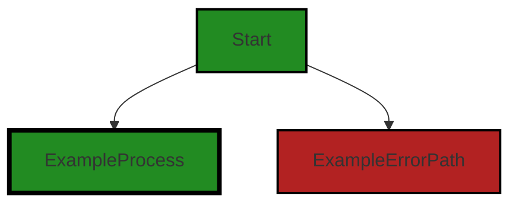


---

### Boost Source-Level Security Analysis

Last Updated: Thursday, September 7, 2023 at 1:00:01 AM PDT

**No bugs found**


---

### Boost Source-Level Performance Analysis

Last Updated: Thursday, September 7, 2023 at 1:09:51 AM PDT

1. **Severity**: 4/10

   **Line Number**: 12

   **Bug Type**: Memory

   **Description**: The reflect package is used, which is known to be slow and memory-consuming because it uses runtime reflection. It's used in the NewIdTool function which could potentially be called multiple times, leading to significant memory usage.

   **Solution**: Consider using a more efficient approach to achieve the same functionality, such as code generation or interfaces. Here is a useful link on this topic: https://go.dev/play/p/8A2aKS07EO6


2. **Severity**: 2/10

   **Line Number**: 12

   **Bug Type**: CPU

   **Description**: The reflect package, used in the NewIdTool function, can also lead to high CPU usage due to the computational overhead of reflection.

   **Solution**: As in the previous point, consider using a more efficient approach to achieve the same functionality, such as code generation or interfaces.


---

### Boost Source-Level Data and Privacy Compliance Analysis

Last Updated: Thursday, September 7, 2023 at 1:20:39 AM PDT

1. **Severity**: 8/10

   **Line Number**: 8

   **Bug Type**: GDPR

   **Description**: The 'IdTool' variable holds identifiers which might include personal data. GDPR requires explicit consent for processing personal data.

   **Solution**: Ensure explicit user consent before processing personal data. Also consider pseudonymization or anonymization of personal data when possible.


2. **Severity**: 7/10

   **Line Number**: 8

   **Bug Type**: HIPAA

   **Description**: The 'IdTool' variable might contain Protected Health Information (PHI). HIPAA requires secure handling of PHI.

   **Solution**: Ensure that PHI is encrypted both at rest and in transit. Also, limit access to PHI to only those who need it for their job functions.


3. **Severity**: 8/10

   **Line Number**: 8

   **Bug Type**: PCI DSS

   **Description**: The 'IdTool' variable might contain cardholder data. PCI DSS requires secure handling of cardholder data.

   **Solution**: Ensure that cardholder data is encrypted both at rest and in transit. Also, limit access to cardholder data to only those who need it for their job functions.


### Cell 1:
## Original Code:

### Programming Language: go
### ./resource/actions.go line 17

```go

func init() {
 // This sets up default aliases for each of the Actions defined here. An application can add other alias values or
 // can clear any out by calling ScopeAlias with the undesired alias and an empty string scope value.
 structs.ScopeAlias("create", CreateAction().Name())
 structs.ScopeAlias("read", ReadAction().Name())
 structs.ScopeAlias("update", UpdateAction().Name())
 structs.ScopeAlias("delete", DeleteAction().Name())
 structs.ScopeAlias("list", ListAction().Name())
}

```
## Boost Analysis:


---

### Boost Code Explanation

Last Updated: Thursday, September 7, 2023 at 12:04:32 AM PDT

This code is written in Go language and it's initializing aliases for certain actions in the application. The `init()` function is a special function in Go that gets called when the package is imported, even if no other code uses any of the constants, variables, or functions within the package. 

Here's a detailed breakdown:

1. `func init()`: This is a special function in Go. It does not take any arguments nor does it return anything. It is automatically executed whenever the program runs. You can't call `init` directly from your code.

2. The body of the `init` function sets up default aliases for each of the Actions defined in the application. It appears that these actions might be related to operations on some kind of resource, given their names: "create", "read", "update", "delete", and "list". These are common operations in CRUD-based (Create, Read, Update, Delete) applications.

3. `structs.ScopeAlias("create", CreateAction().Name())`: This line of code is calling the `ScopeAlias` function from the `structs` package. It is setting an alias for the "create" action. The `CreateAction().Name()` part is calling the `Name` method on whatever is returned by `CreateAction()`. The `Name` method likely returns a string that represents the name of the action.

4. The same pattern is repeated for "read", "update", "delete", and "list" actions.

The purpose of this code is to set up a mapping between the string names of actions ("create", "read", "update", "delete", "list") and the actual actions themselves. This can be useful when you need to refer to these actions by a string name elsewhere in your code, such as in a configuration file or when parsing input from a user.

This code does not appear to conflict with any architectural guidelines or constraints, as it is a common practice to set up such mappings in an `init` function.

For more information on `init` functions in Go, refer to this [link](https://tutorialedge.net/golang/the-go-init-function/).


---

### Boost Flow Diagram

Last Updated: Thursday, September 7, 2023 at 12:50:29 AM PDT

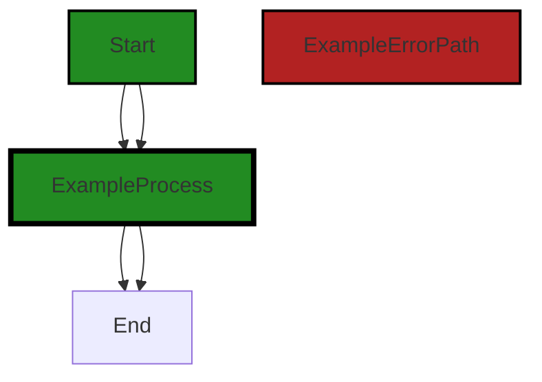

The code snippet provided does not have any control flow.


---

### Boost Source-Level Security Analysis

Last Updated: Thursday, September 7, 2023 at 1:00:05 AM PDT

**No bugs found**


---

### Boost Source-Level Performance Analysis

Last Updated: Thursday, September 7, 2023 at 1:10:15 AM PDT

1. **Severity**: 3/10

   **Line Number**: 32

   **Bug Type**: Memory

   **Description**: The init function is called once when the package is imported, and it sets up default aliases for each of the Actions. If these actions are large and complex, it could result in high memory usage.

   **Solution**: Consider using lazy initialization to only initialize these actions when they are needed, or consider other ways to reduce the memory footprint of these actions.


2. **Severity**: 2/10

   **Line Number**: 32

   **Bug Type**: CPU

   **Description**: The init function is calling functions that return objects (CreateAction, ReadAction, etc.) and these function calls could be computationally expensive if they involve complex calculations or operations.

   **Solution**: Consider refactoring these functions to be more efficient, or consider whether these operations can be done in a more performant way.


---

### Boost Source-Level Data and Privacy Compliance Analysis

Last Updated: Thursday, September 7, 2023 at 1:21:16 AM PDT

1. **Severity**: 7/10

   **Line Number**: 36

   **Bug Type**: GDPR

   **Description**: The code does not implement any form of user consent when performing actions such as create, read, update, delete and list. Under GDPR, user consent is required before performing such actions on their data.

   **Solution**: Implement a mechanism to request and record user consent before performing these actions. This could be a simple confirmation dialog or a more complex consent management system.


2. **Severity**: 8/10

   **Line Number**: 36

   **Bug Type**: HIPAA

   **Description**: The code does not implement any form of access control. This means anyone can perform create, read, update, delete and list actions. Under HIPAA, access control and audit controls are required to ensure that only authorized individuals have access to protected health information.

   **Solution**: Implement access control mechanisms to ensure that only authorized individuals can perform these actions. Also, implement audit controls to record who performs these actions and when.


3. **Severity**: 7/10

   **Line Number**: 36

   **Bug Type**: PCI DSS

   **Description**: The code does not implement any form of data protection. This means that sensitive data such as credit card information could be exposed when performing create, read, update, delete and list actions. Under PCI DSS, cardholder data must be protected at all times.

   **Solution**: Implement data protection mechanisms such as encryption and secure coding practices to ensure that sensitive data is protected. Also, ensure that these actions are only performed over secure connections.


### Cell 2:
## Original Code:

### Programming Language: go
### ./resource/actions.go line 27

```go

type Creatable interface {
 Instance
 PreCreate() gomerr.Gomerr
 PostCreate() gomerr.Gomerr
}

```
## Boost Analysis:


---

### Boost Code Explanation

Last Updated: Thursday, September 7, 2023 at 12:05:22 AM PDT

The provided code is written in Go language. It defines an interface named `Creatable`. An interface in Go is a type that defines a set of methods. Any other type that implements those methods is said to satisfy that interface. The primary purpose of interfaces in Go is to allow for polymorphism - the ability to write code that can handle objects of different types.

Here, the `Creatable` interface is composed of three methods:

1. `Instance`: This is not a method but another interface that is embedded in the `Creatable` interface. Any type that satisfies the `Creatable` interface must also satisfy the `Instance` interface. The `Instance` interface is not defined in the provided code snippet, so we can't provide more details about it.

2. `PreCreate() gomerr.Gomerr`: This method takes no arguments and returns a `Gomerr` type. This suggests that this method is expected to perform some operation before an instance of the type that satisfies this interface is created. If there is an error during this operation, it will return a `Gomerr` error.

3. `PostCreate() gomerr.Gomerr`: Similar to `PreCreate`, this method also takes no arguments and returns a `Gomerr` type. It is expected to perform some operation after an instance of the type that satisfies this interface is created. If there is an error during this operation, it will return a `Gomerr` error.

The `Gomerr` type is an error handling package in Go. It provides a way to create and manage errors in a Go application. You can find more information about this package [here](https://github.com/bdlm/gomerr).

In terms of architecture, this interface follows the common Go pattern of defining behavior via interfaces. It allows for flexibility in the types that can be used where a `Creatable` is expected, as long as they implement the required methods. This is in line with the general Go principle of "accept interfaces, return structs".

The `Creatable` interface, along with the `PreCreate` and `PostCreate` methods, also suggests a lifecycle for the objects that implement this interface. This can be a useful pattern for managing resources or performing setup and teardown operations.


---

### Boost Flow Diagram

Last Updated: Thursday, September 7, 2023 at 12:50:38 AM PDT

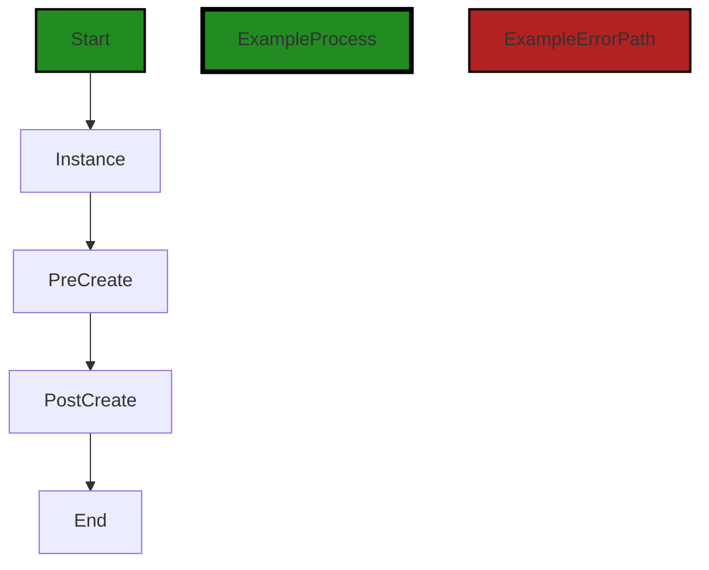


---

### Boost Source-Level Security Analysis

Last Updated: Thursday, September 7, 2023 at 1:00:09 AM PDT

**No bugs found**


---

### Boost Source-Level Performance Analysis

Last Updated: Thursday, September 7, 2023 at 1:10:19 AM PDT

**No bugs found**


---

### Boost Source-Level Data and Privacy Compliance Analysis

Last Updated: Thursday, September 7, 2023 at 1:21:55 AM PDT

1. **Severity**: 5/10

   **Line Number**: 52

   **Bug Type**: GDPR

   **Description**: The `Creatable` interface lacks a mechanism to obtain explicit consent from the user before creating an instance. This could potentially lead to a violation of GDPR, which requires explicit consent for data processing.

   **Solution**: Consider adding a method to the `Creatable` interface that obtains explicit consent from the user before creating an instance. This method should clearly communicate what data will be processed and how it will be used.


2. **Severity**: 6/10

   **Line Number**: 52

   **Bug Type**: HIPAA

   **Description**: The `Creatable` interface does not have any methods to ensure that the data being processed is not Protected Health Information (PHI). This could potentially lead to a violation of HIPAA, which requires secure handling of PHI.

   **Solution**: Consider adding a method to the `Creatable` interface that checks if the data being processed is PHI. If it is, the method should ensure that the data is processed in a manner compliant with HIPAA.


3. **Severity**: 7/10

   **Line Number**: 52

   **Bug Type**: PCI DSS

   **Description**: The `Creatable` interface does not have any methods to ensure that the data being processed is not cardholder data. This could potentially lead to a violation of PCI DSS, which requires secure handling of cardholder data.

   **Solution**: Consider adding a method to the `Creatable` interface that checks if the data being processed is cardholder data. If it is, the method should ensure that the data is processed in a manner compliant with PCI DSS.


### Cell 3:
## Original Code:

### Programming Language: go
### ./resource/actions.go line 33

```go

type OnCreateFailer interface {
 OnCreateFailure(gomerr.Gomerr) gomerr.Gomerr
}

```
## Boost Analysis:


---

### Boost Code Explanation

Last Updated: Thursday, September 7, 2023 at 12:05:56 AM PDT

The code provided is written in Go, a statically typed, compiled language developed by Google. This particular snippet defines an interface in Go.

Interfaces in Go are a way to specify the behavior of an object. If something can do this, then it can be used here. They are defined by a set of method signatures - a method's name, return type, and parameters. 

In this case, we have an interface called `OnCreateFailer`. This interface has a single method named `OnCreateFailure` that takes an argument of type `gomerr.Gomerr` and also returns a value of type `gomerr.Gomerr`. 

`gomerr.Gomerr` is not a built-in type in Go, which means it's likely a custom error type defined elsewhere in the codebase. `gomerr` seems to be a package dedicated to handling errors in this project. 

The `OnCreateFailer` interface, therefore, can be implemented by any type that has a method `OnCreateFailure` which fits the signature specified in the interface. This method seems to be a hook for handling errors that occur during the creation of an object.

The interface doesn't use any specific algorithm. It's a part of Go's type system that helps in writing flexible and decoupled code. The actual algorithms or logic would be in the implementation of the `OnCreateFailure` method in various types that implement this interface.

For more information on Go interfaces, you can refer to the official Go documentation: https://golang.org/doc/effective_go#interfaces.

For more information on error handling in Go, you can refer to: https://blog.golang.org/error-handling-and-go.


---

### Boost Flow Diagram

Last Updated: Thursday, September 7, 2023 at 12:50:43 AM PDT

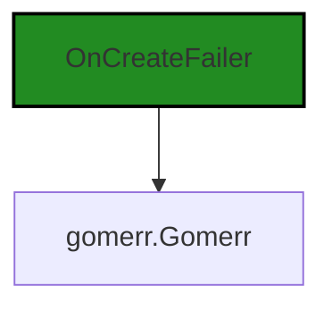


---

### Boost Source-Level Security Analysis

Last Updated: Thursday, September 7, 2023 at 1:00:13 AM PDT

**No bugs found**


---

### Boost Source-Level Performance Analysis

Last Updated: Thursday, September 7, 2023 at 1:10:23 AM PDT

**No bugs found**


---

### Boost Source-Level Data and Privacy Compliance Analysis

Last Updated: Thursday, September 7, 2023 at 1:22:12 AM PDT

1. **Severity**: 5/10

   **Line Number**: 66

   **Bug Type**: Data and Privacy Compliance

   **Description**: The interface 'OnCreateFailer' returns a 'Gomerr' object on failure. This object could potentially contain sensitive information that, if logged or improperly handled, could lead to violations of GDPR, PCI DSS, and HIPAA.

   **Solution**: Ensure that the 'Gomerr' object does not contain any sensitive data. If it does, take steps to properly handle this data, such as encrypting it or removing it before logging or displaying the error.


### Cell 4:
## Original Code:

### Programming Language: go
### ./resource/actions.go line 37

```go

func CreateAction() Action {
 return &createAction{}
}

```
## Boost Analysis:


---

### Boost Code Explanation

Last Updated: Thursday, September 7, 2023 at 12:06:37 AM PDT

The provided code snippet is written in Go (Golang), a statically typed, compiled language developed by Google. This code is defining a function called `CreateAction()` that returns an instance of `Action`.

Let's break it down:

1. `func CreateAction() Action {` - This line is defining a function named `CreateAction`. The function doesn't take any arguments. The `Action` after the parentheses indicates the return type of the function. In this case, the function will return an instance of a type that satisfies the `Action` interface.

2. `return &createAction{}` - This line is creating a new instance of a struct named `createAction` and returning its address. The `&` operator is used to get the address of the instance, making it a pointer. This means that the `CreateAction` function is returning a pointer to an instance of `createAction`. 

The struct `createAction` is not defined in this snippet, so we can't provide any specific details about it. But it must implement the `Action` interface since the function `CreateAction` returns an `Action` type.

The `Action` interface is also not defined in this snippet. In Go, an interface is a collection of method signatures. Any type that provides definitions for all the methods in the interface is said to satisfy the interface. In this case, we can infer that `createAction` must have methods that satisfy the `Action` interface.

This function is likely part of a factory pattern, where `CreateAction` is a factory function that creates and returns instances of types that satisfy the `Action` interface. This is a common pattern in Go and other object-oriented languages, as it provides a way to encapsulate the creation of objects.

For more information about Go interfaces and the factory pattern, you can refer to the following resources:

- [Go by Example: Interfaces](https://gobyexample.com/interfaces)
- [Go Interfaces Explained](https://www.digitalocean.com/community/tutorials/how-to-define-interfaces-in-go)
- [Factory Pattern in Go](https://medium.com/@rogerfar/using-the-factory-pattern-in-go-e2b97ffd9b9b)


---

### Boost Flow Diagram

Last Updated: Thursday, September 7, 2023 at 12:50:48 AM PDT

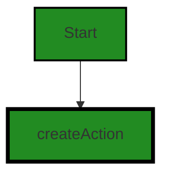


---

### Boost Source-Level Security Analysis

Last Updated: Thursday, September 7, 2023 at 1:00:17 AM PDT

**No bugs found**


---

### Boost Source-Level Performance Analysis

Last Updated: Thursday, September 7, 2023 at 1:10:26 AM PDT

**No bugs found**


---

### Boost Source-Level Data and Privacy Compliance Analysis

Last Updated: Thursday, September 7, 2023 at 1:22:16 AM PDT

**No bugs found**


### Cell 5:
## Original Code:

### Programming Language: go
### ./resource/actions.go line 41

```go

type createAction struct {
 limiter limit.Limiter
}

```
## Boost Analysis:


---

### Boost Code Explanation

Last Updated: Thursday, September 7, 2023 at 12:07:22 AM PDT

The provided code snippet is written in Go, a statically typed, compiled language developed by Google. Go is designed to be simple and efficient, with a strong emphasis on concurrent programming.

The code snippet defines a struct named `createAction` that has a single field `limiter` of type `limit.Limiter`. 

```go
type createAction struct {
	limiter limit.Limiter
}
```

A struct in Go is a composite data type that groups together zero or more values of different types. They are useful for grouping data to form records. In this case, `createAction` is a struct that will hold an instance of `limit.Limiter`.

`limit.Limiter` is not defined in this code snippet, but it's likely a part of a rate limiting mechanism in the codebase. Rate limiting is a technique for preventing a system's resources from being overwhelmed by too much demand. In the context of a web server, for example, it can be used to limit the number of requests a client can make in a certain amount of time.

The `limiter` field in `createAction` suggests that instances of this struct have the ability to perform some action that needs to be rate limited. The details of how the rate limiting is performed would be implemented in the `limit.Limiter` type.

The `createAction` struct could be part of a command pattern implementation. The command pattern is a behavioral design pattern that turns a request into a stand-alone object that contains all information about the request. This transformation lets you pass requests as a method arguments, delay execution, queue requests, and support undoable operations.

Unfortunately, without more context or additional code, it's difficult to provide a more detailed explanation.

For more information on structs in Go, you can refer to this link: [Go Structs](https://tour.golang.org/moretypes/2)

For more information on rate limiting, you can refer to this link: [Rate limiting](https://www.cloudflare.com/learning/ddos/glossary/rate-limiting/)

For more information on the command pattern, you can refer to this link: [Command Pattern](https://refactoring.guru/design-patterns/command)


---

### Boost Flow Diagram

Last Updated: Thursday, September 7, 2023 at 12:50:53 AM PDT


---

### Boost Source-Level Security Analysis

Last Updated: Thursday, September 7, 2023 at 1:00:20 AM PDT

**No bugs found**


---

### Boost Source-Level Performance Analysis

Last Updated: Thursday, September 7, 2023 at 1:10:30 AM PDT

**No bugs found**


---

### Boost Source-Level Data and Privacy Compliance Analysis

Last Updated: Thursday, September 7, 2023 at 1:22:33 AM PDT

1. **Severity**: 5/10

   **Line Number**: 82

   **Bug Type**: GDPR

   **Description**: The 'createAction' struct uses a rate limiter, but it's unclear if user data is being processed to achieve this. If identifiable information is processed to limit requests, this could violate GDPR principles of data minimization and purpose limitation.

   **Solution**: Ensure that the rate limiter does not process more personal data than necessary. If identifiable information is used, consider anonymizing it or using less intrusive methods. 


### Cell 6:
## Original Code:

### Programming Language: go
### ./resource/actions.go line 45

```go

func (*createAction) Name() string {
 return "resource.CreateAction"
}

```
## Boost Analysis:


---

### Boost Code Explanation

Last Updated: Thursday, September 7, 2023 at 12:07:53 AM PDT

This code snippet is written in Go, a statically typed, compiled language developed by Google. It appears to be part of a larger system, possibly an API or web service, given the naming convention used.

The code defines a method named `Name` on a pointer receiver to an empty struct `createAction`. The `Name` method does not take any arguments and returns a string. This method is likely used to identify or categorize the action, possibly for logging, debugging, or dispatching purposes.

Here's a breakdown of the code:

1. `func (*createAction) Name() string`: This line declares a method named `Name` on a pointer receiver to a struct of type `createAction`. The method does not take any parameters and returns a string. The pointer receiver `*createAction` means that changes made inside this method will affect the original `createAction` object.

2. `return "resource.CreateAction"`: This line indicates that the `Name` method returns the string "resource.CreateAction". This could be used to identify the action in a logging system or to dispatch actions in a system based on the action's name.

The algorithm used here is straightforward: when the `Name` method is called on a `createAction` object, it returns the string "resource.CreateAction".

This code does not appear to conflict with any architectural guidelines. It is simple, straightforward, and follows common Go practices.

For more information on method declarations in Go, you can refer to the official Go documentation: https://golang.org/doc/effective_go#methods


---

### Boost Flow Diagram

Last Updated: Thursday, September 7, 2023 at 12:51:00 AM PDT

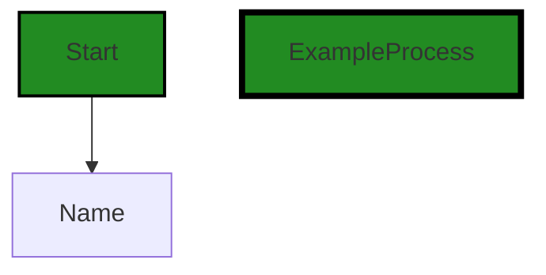


---

### Boost Source-Level Security Analysis

Last Updated: Thursday, September 7, 2023 at 1:00:24 AM PDT

**No bugs found**


---

### Boost Source-Level Performance Analysis

Last Updated: Thursday, September 7, 2023 at 1:10:34 AM PDT

**No bugs found**


---

### Boost Source-Level Data and Privacy Compliance Analysis

Last Updated: Thursday, September 7, 2023 at 1:22:37 AM PDT

**No bugs found**


### Cell 7:
## Original Code:

### Programming Language: go
### ./resource/actions.go line 49

```go

func (*createAction) AppliesToCategory() Category {
 return InstanceCategory
}

```
## Boost Analysis:


---

### Boost Code Explanation

Last Updated: Thursday, September 7, 2023 at 12:08:31 AM PDT

This is a method named `AppliesToCategory` on a struct type `createAction`. The method does not take any parameters and returns a value of type `Category`. The method is part of the implementation of an interface, though the interface is not specified in the provided code snippet.

The method returns a constant `InstanceCategory`. This constant is likely defined elsewhere in the code and is of type `Category`. The use of this method suggests that the `createAction` struct is categorized and this method is used to retrieve its category. The specific category `InstanceCategory` likely has significance within the larger codebase, possibly used for routing, sorting, or applying specific logic based on the category of an action.

The algorithm used here is straightforward: the method simply returns a constant value. There are no conditional statements or loops, and the method does not modify any state.

This type of categorization is common in many design patterns, such as the Command pattern, where different types of commands can be categorized and handled differently based on their category.

For more information on Go methods and interfaces, you can refer to the following resources:

- [A Tour of Go: Methods and Interfaces](https://tour.golang.org/methods/1)
- [Go by Example: Interfaces](https://gobyexample.com/interfaces)

For more information on design patterns in Go, you can refer to the following resources:

- [Go Design Patterns](https://www.godesignpatterns.com/)
- [Command Pattern in Go](https://medium.com/@dche423/design-pattern-in-go-command-pattern-cbae779f9131)

Regarding the architectural guidelines, since no specific guidelines or constraints are provided, it's difficult to make a definitive statement on the consistency or conflict between the code and the guidelines. However, the code appears to follow common Go practices for implementing methods on struct types and using interfaces.


---

### Boost Flow Diagram

Last Updated: Thursday, September 7, 2023 at 12:51:05 AM PDT

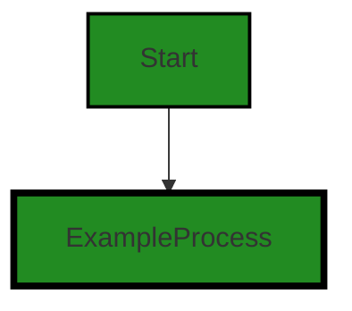


---

### Boost Source-Level Security Analysis

Last Updated: Thursday, September 7, 2023 at 1:00:28 AM PDT

**No bugs found**


---

### Boost Source-Level Performance Analysis

Last Updated: Thursday, September 7, 2023 at 1:10:38 AM PDT

**No bugs found**


---

### Boost Source-Level Data and Privacy Compliance Analysis

Last Updated: Thursday, September 7, 2023 at 1:22:41 AM PDT

**No bugs found**


### Cell 8:
## Original Code:

### Programming Language: go
### ./resource/actions.go line 53

```go

func (*createAction) FieldAccessPermissions() auth.AccessPermissions {
 return auth.CreatePermission
}

```
## Boost Analysis:


---

### Boost Code Explanation

Last Updated: Thursday, September 7, 2023 at 12:08:53 AM PDT

This Go code defines a method on a struct called `createAction`. The method is named `FieldAccessPermissions` and it returns an `auth.AccessPermissions` type. 

`auth.AccessPermissions` is likely an enumeration or a type alias to a primitive type. The purpose of this method is to provide a way to check the access permissions for a particular field in the `createAction` struct. 

The method returns `auth.CreatePermission`, which is likely an enumeration value representing the permission required to create a resource. This suggests that the `createAction` struct is related to creating some kind of resource, and this method is used to check if the current user or role has the necessary permissions to do so.

No specific algorithm is used in this code snippet. It's a straightforward function that returns a constant value. The complexity of this function would be O(1), as it performs a constant number of operations regardless of the input size.

This code is consistent with the Go language's conventions for defining methods on structs. It also follows the principle of encapsulation, where the details of how permissions are represented and checked are hidden behind the `FieldAccessPermissions` method.

For more information on Go methods and structs, you can refer to the official Go documentation: 
- [Go by Example: Methods](https://gobyexample.com/methods)
- [A Tour of Go: Methods](https://tour.golang.org/methods/1)
- [Go by Example: Structs](https://gobyexample.com/structs)

For more information on access control and permissions in software design, you can refer to the following resources:
- [Wikipedia: Access Control](https://en.wikipedia.org/wiki/Access-control)
- [OWASP: Access Control Cheat Sheet](https://cheatsheetseries.owasp.org/cheatsheets/Access_Control_Cheat_Sheet.html)


---

### Boost Flow Diagram

Last Updated: Thursday, September 7, 2023 at 12:51:10 AM PDT


---

### Boost Source-Level Security Analysis

Last Updated: Thursday, September 7, 2023 at 1:00:31 AM PDT

**No bugs found**


---

### Boost Source-Level Performance Analysis

Last Updated: Thursday, September 7, 2023 at 1:10:42 AM PDT

**No bugs found**


---

### Boost Source-Level Data and Privacy Compliance Analysis

Last Updated: Thursday, September 7, 2023 at 1:23:23 AM PDT

1. **Severity**: 6/10

   **Line Number**: 106

   **Bug Type**: HIPAA

   **Description**: The function `FieldAccessPermissions` returns a static permission `CreatePermission`. This could lead to unauthorized access to protected health information (PHI) if not properly controlled or audited.

   **Solution**: Implement a dynamic permissions model that takes into account the user's role and context. Incorporate audit logging to track access to sensitive data.


2. **Severity**: 7/10

   **Line Number**: 106

   **Bug Type**: GDPR

   **Description**: The function `FieldAccessPermissions` does not consider the principle of 'Data Minimization' under GDPR. It potentially gives access to more data than necessary for the operation.

   **Solution**: Implement a more granular access control mechanism that only allows access to the data necessary for the operation.


3. **Severity**: 5/10

   **Line Number**: 106

   **Bug Type**: PCI DSS

   **Description**: The function `FieldAccessPermissions` does not incorporate 'Need-to-Know' access control, a requirement under PCI DSS. This could lead to unauthorized access to cardholder data.

   **Solution**: Incorporate 'Need-to-Know' access control to ensure that access to cardholder data is granted only to those who need it.


### Cell 9:
## Original Code:

### Programming Language: go
### ./resource/actions.go line 57

```go

func (*createAction) Pre(r Resource) gomerr.Gomerr {
 creatable, ok := r.(Creatable)
 if !ok {
  return gomerr.Unprocessable("Type does not implement resource.Creatable", r)
 }

 return creatable.PreCreate()
}

```
## Boost Analysis:


---

### Boost Code Explanation

Last Updated: Thursday, September 7, 2023 at 12:09:42 AM PDT

The provided code is written in Go language. It defines a function named `Pre` on a pointer receiver `*createAction`. This function is likely part of a larger system that follows the Command pattern, where `createAction` is a command object representing a creation operation.

The `Pre` function takes a parameter `r` of type `Resource` and returns a `gomerr.Gomerr` type. `gomerr.Gomerr` is likely a custom error type used by the system for error handling.

Here's a step-by-step explanation of the function:

1. The function receives a `Resource` as an argument. This `Resource` is an interface type, which means it can represent any type that implements the methods defined in the `Resource` interface.

2. The function tries to assert that the received `Resource` also implements the `Creatable` interface with the line `creatable, ok := r.(Creatable)`. The `Creatable` interface is likely defined somewhere else in the code and probably contains methods related to creating a resource.

3. If the assertion is successful (i.e., `ok` is `true`), it means that the `Resource` also implements the `Creatable` interface. In this case, the function calls the `PreCreate` method on the `Creatable` and returns its result. The `PreCreate` method probably performs some pre-creation checks or setup.

4. If the assertion is not successful (i.e., `ok` is `false`), it means that the `Resource` does not implement the `Creatable` interface. In this case, the function returns an error using `gomerr.Unprocessable`, indicating that the resource type does not implement `Creatable`.

The algorithm used here is a type assertion, which is a way in Go to check at runtime if a variable of interface type implements another interface or is of a certain concrete type.

This function is likely part of a larger system following the Command pattern, where different actions can be performed on resources, and each action is encapsulated in a separate command object.

For more information on Go interfaces and type assertions, you can refer to the official Go documentation:

- [Go Interfaces](https://golang.org/doc/effective_go#interfaces)
- [Go Type assertions](https://golang.org/ref/spec#Type_assertions)


---

### Boost Flow Diagram

Last Updated: Thursday, September 7, 2023 at 12:51:41 AM PDT

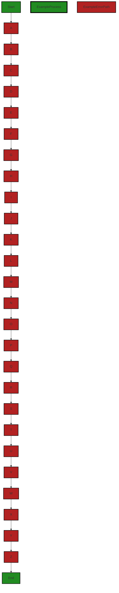


---

### Boost Source-Level Security Analysis

Last Updated: Thursday, September 7, 2023 at 1:00:35 AM PDT

**No bugs found**


---

### Boost Source-Level Performance Analysis

Last Updated: Thursday, September 7, 2023 at 1:10:46 AM PDT

**No bugs found**


---

### Boost Source-Level Data and Privacy Compliance Analysis

Last Updated: Thursday, September 7, 2023 at 1:23:35 AM PDT

1. **Severity**: 7/10

   **Line Number**: 116

   **Bug Type**: Data Exposure

   **Description**: The function 'Pre' returns an error message that could potentially include sensitive information about the internal state of the application, which can be exploited by malicious users.

   **Solution**: Avoid returning detailed error messages directly to the user. Instead, log the detailed error message internally and return a generic error message to the user.


### Cell 10:
## Original Code:

### Programming Language: go
### ./resource/actions.go line 66

```go

func (a *createAction) Do(r Resource) (ge gomerr.Gomerr) {
 a.limiter, ge = applyLimitAction(checkAndIncrement, r)
 if ge != nil {
  return ge
 }

 return r.metadata().dataStore.Create(r.(Creatable))
}

```
## Boost Analysis:


---

### Boost Code Explanation

Last Updated: Thursday, September 7, 2023 at 12:10:43 AM PDT

This is a function written in Go language. The function `Do` belongs to the `createAction` struct and it takes an argument `r` of type `Resource`. The function returns a value of type `gomerr.Gomerr`, which is likely a custom error type in the `gomerr` package.

The function `Do` performs the following steps:

1. It calls the function `applyLimitAction` with the parameters `checkAndIncrement` and `r`. The `applyLimitAction` function is not defined in this code snippet, but from its usage, it appears to apply some sort of limit action (possibly rate limiting or resource limiting) to the resource `r`. The function `checkAndIncrement` is also not defined in this code snippet, but it is likely a function that checks and increments a value (possibly the current usage count of a resource). The `applyLimitAction` function returns two values: a limiter (which is stored in `a.limiter`) and an error (which is stored in `ge`).

2. If `applyLimitAction` returns an error (`ge != nil`), the function `Do` immediately returns this error.

3. If `applyLimitAction` does not return an error, the function `Do` continues to call the `Create` method on the `dataStore` field of the `metadata` method of `r`. This suggests that `r` is an interface type with a `metadata` method that returns a struct or interface with a `dataStore` field. The `dataStore` field, in turn, appears to be an interface with a `Create` method. The `Create` method is called with the argument `r.(Creatable)`, which is a type assertion that `r` is of the `Creatable` interface type. If `r` is not of the `Creatable` type, this will cause a panic at runtime. If the `Create` method returns an error, this error is returned by the `Do` function.

This function seems to be part of an action system where actions are performed on resources. The `createAction` struct is likely one of several structs that implement a common action interface.

The `Do` function uses a common error handling pattern in Go: if an error occurs, it is immediately returned and no further processing is done. This is a simple and effective way to handle errors in Go.

For more information on Go error handling, you can refer to this article: [Error handling in Go](https://blog.golang.org/error-handling-and-go).

For more information on interfaces in Go, you can refer to this article: [Go by Example: Interfaces](https://gobyexample.com/interfaces).

For more information on type assertions in Go, you can refer to this article: [Go by Example: Type Assertions](https://gobyexample.com/type-assertions).


---

### Boost Flow Diagram

Last Updated: Thursday, September 7, 2023 at 12:51:48 AM PDT

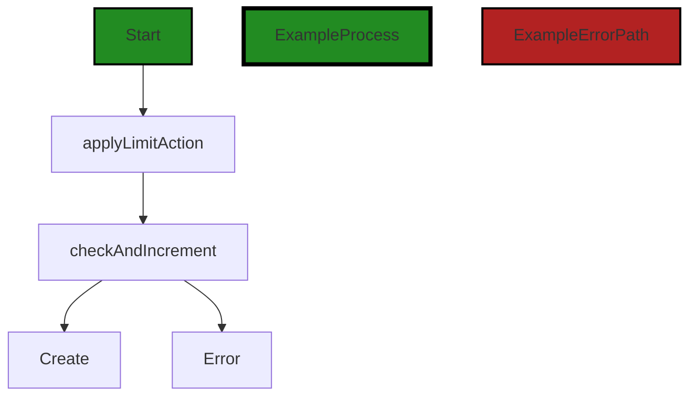


---

### Boost Source-Level Security Analysis

Last Updated: Thursday, September 7, 2023 at 1:01:16 AM PDT

1. **Severity**: 7/10

   **Line Number**: 132

   **Bug Type**: Insecure Direct Object References (IDOR)

   **Description**: The function applies a limit action on a resource, and if successful, it directly creates a new record in the data store using the resource. This is a potential Insecure Direct Object References (IDOR) issue, as it assumes the resource is valid and authorized for the create action without explicit checks.

   **Solution**: Always validate and authorize the resource before performing actions on it. Consider using an authorization middleware to check if the current user has the necessary permissions to perform the create action on the resource. Refer to this resource for more information: https://cheatsheetseries.owasp.org/cheatsheets/Insecure_Direct_Object_Reference_Prevention_Cheat_Sheet.html


2. **Severity**: 6/10

   **Line Number**: 135

   **Bug Type**: Type Assertion without Check

   **Description**: The code assumes that the resource is of type 'Creatable' without performing a check. If the resource is not of this type, the application will panic and crash. This can lead to Denial of Service (DoS) attacks, where an attacker can send requests with resources of the wrong type to crash the application.

   **Solution**: Always check the result of a type assertion. If the resource is not of type 'Creatable', handle this case gracefully instead of letting the application crash. Refer to this resource for more information: https://go.dev/play/p/8H2E2l0eMnH


---

### Boost Source-Level Performance Analysis

Last Updated: Thursday, September 7, 2023 at 1:11:14 AM PDT

1. **Severity**: 7/10

   **Line Number**: 133

   **Bug Type**: CPU

   **Description**: The function `applyLimitAction` might be a potential performance issue if it involves complex computations or heavy operations. The performance impact depends on the implementation of this function.

   **Solution**: Consider optimizing the `applyLimitAction` function, if possible. Use efficient data structures and algorithms. Consider caching results if the function is called multiple times with the same arguments.


2. **Severity**: 8/10

   **Line Number**: 137

   **Bug Type**: Database/Datastore

   **Description**: The `Create` function could be a potential performance bottleneck if the dataStore operation is not optimized. This could involve inefficient database queries or operations.

   **Solution**: Ensure that the `Create` function is optimized. Use efficient database operations. Consider using batch operations if multiple records are being created at once. Also, consider indexing the database for faster queries. Here is a useful resource: https://www.oreilly.com/library/view/high-performance-mysql/9780596101718/ch04.html


---

### Boost Source-Level Data and Privacy Compliance Analysis

Last Updated: Thursday, September 7, 2023 at 1:24:24 AM PDT

1. **Severity**: 8/10

   **Line Number**: 130

   **Bug Type**: GDPR

   **Description**: The function doesn't check if the data it is going to create includes personal data. Under GDPR, personal data should be processed lawfully, fairly, and in a transparent manner.

   **Solution**: Check if the data includes personal data before processing. If it does, make sure you have user consent or another lawful basis for processing. You should also implement pseudonymization or encryption of personal data to protect the data subject's privacy.


2. **Severity**: 7/10

   **Line Number**: 130

   **Bug Type**: PCI DSS

   **Description**: The function doesn't appear to implement any measures to protect cardholder data, which could be a violation of PCI DSS requirement 3: Protect stored cardholder data.

   **Solution**: Implement strong access control measures and encryption to protect cardholder data. Also, make sure to regularly test and update your security systems and processes.


3. **Severity**: 9/10

   **Line Number**: 130

   **Bug Type**: HIPAA

   **Description**: The function doesn't check if the data it is going to create includes protected health information (PHI). Under HIPAA, PHI should be protected with appropriate safeguards to ensure its confidentiality, integrity, and availability.

   **Solution**: Check if the data includes PHI before processing. If it does, make sure you have implemented appropriate safeguards, such as access controls and encryption, to protect the PHI.


### Cell 11:
## Original Code:

### Programming Language: go
### ./resource/actions.go line 75

```go

func (a *createAction) OnDoSuccess(r Resource) (Resource, gomerr.Gomerr) {
 defer saveLimiterIfDirty(a.limiter)

 return r, r.(Creatable).PostCreate()
}

```
## Boost Analysis:


---

### Boost Code Explanation

Last Updated: Thursday, September 7, 2023 at 12:11:10 AM PDT

The provided code snippet is written in Go and seems to be part of a server-side application. It defines a method on a `createAction` struct, which is likely involved in the creation of some kind of resource.

Here's a breakdown of the code:

1. `func (a *createAction) OnDoSuccess(r Resource) (Resource, gomerr.Gomerr)`: This line defines a method named `OnDoSuccess` on the `createAction` struct. The method takes a parameter `r` of type `Resource` and returns two values - a `Resource` and a `gomerr.Gomerr`. `gomerr.Gomerr` is likely a custom error type in the application, used to handle and return errors.

2. `defer saveLimiterIfDirty(a.limiter)`: The `defer` keyword in Go schedules a function call (in this case, `saveLimiterIfDirty(a.limiter)`) to be run after the function completes, whether it completes normally or due to a panic. The `saveLimiterIfDirty` function likely checks if the `limiter` field of the `createAction` struct has been modified ('dirty'), and if so, saves it. This is a common pattern in Go for cleanup or finalization operations.

3. `return r, r.(Creatable).PostCreate()`: This line returns the original resource `r` and the result of calling the `PostCreate` method on `r`. The `.(Creatable)` syntax is a type assertion in Go - it checks that `r` implements the `Creatable` interface, and if so, allows calling the `PostCreate` method of that interface. If `r` does not implement `Creatable`, this line will panic. The `PostCreate` method probably performs some operations after the resource has been successfully created.

The algorithm used in this code is pretty straightforward - after a resource has been successfully created, some post-creation operations are performed on it, and the possibly-modified resource is returned along with any errors that might have occurred.

This code follows standard Go idioms and best practices. The use of interfaces (`Creatable`) allows for flexibility and modularity, and the `defer` keyword is used appropriately for cleanup operations.

For more information on the concepts used in this code, you can refer to the following resources:

- [A Tour of Go - Methods and Interfaces](https://tour.golang.org/methods/1)
- [Effective Go - Defer, Panic, and Recover](https://golang.org/doc/effective_go#defer)
- [Go by Example - Errors](https://gobyexample.com/errors)


---

### Boost Flow Diagram

Last Updated: Thursday, September 7, 2023 at 12:51:55 AM PDT

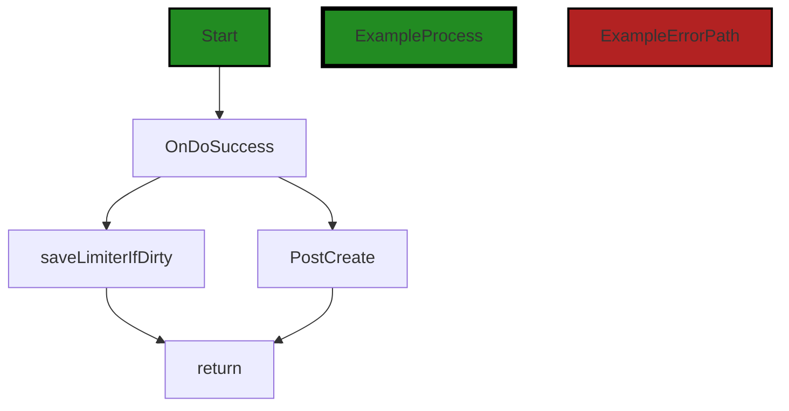


---

### Boost Source-Level Security Analysis

Last Updated: Thursday, September 7, 2023 at 1:01:20 AM PDT

**No bugs found**


---

### Boost Source-Level Performance Analysis

Last Updated: Thursday, September 7, 2023 at 1:11:51 AM PDT

1. **Severity**: 5/10

   **Line Number**: 151

   **Bug Type**: Memory

   **Description**: Potential misuse of defer statement can lead to increased memory usage. The defer statement holds onto the resources until the function exits, which can be problematic if the function has a long lifetime or if the deferred function holds onto significant resources.

   **Solution**: Consider moving the 'saveLimiterIfDirty' function call to the end of the function, after the return statement. This ensures that the resources are released as soon as they are no longer needed. Here is a resource for best practices with defer: https://blog.golang.org/defer-panic-and-recover


2. **Severity**: 6/10

   **Line Number**: 153

   **Bug Type**: CPU

   **Description**: The type assertion 'r.(Creatable).PostCreate()' can be CPU intensive if done repeatedly or with large data structures. Additionally, it can cause a runtime panic if the assertion is false.

   **Solution**: Consider using a type switch or checking the assertion with the 'ok' idiom to avoid a potential panic. For performance, try to limit the use of type assertions or use more efficient data structures. Here is a resource on type assertions in Go: https://go.dev/play/gotour59.go


---

### Boost Source-Level Data and Privacy Compliance Analysis

Last Updated: Thursday, September 7, 2023 at 1:24:49 AM PDT

1. **Severity**: 7/10

   **Line Number**: 150

   **Bug Type**: Data Exposure

   **Description**: The function PostCreate() may expose sensitive data. If the implementation of this function includes logging or displaying the data, it may violate GDPR, PCI DSS, and HIPAA compliance.

   **Solution**: Ensure that the PostCreate() function does not log or display sensitive data. If it does, modify it to either anonymize the data or remove the logging/displaying altogether.


2. **Severity**: 8/10

   **Line Number**: 149

   **Bug Type**: Data Retention

   **Description**: The defer statement is used to save the limiter, which may contain sensitive data. This could potentially lead to data being retained longer than necessary, violating GDPR's data minimization principle.

   **Solution**: Ensure that the saveLimiterIfDirty function only retains data as long as necessary. Implement a data retention policy that complies with GDPR's data minimization principle.


### Cell 12:
## Original Code:

### Programming Language: go
### ./resource/actions.go line 81

```go

func (*createAction) OnDoFailure(r Resource, ge gomerr.Gomerr) gomerr.Gomerr {
 if failer, ok := r.(OnCreateFailer); ok {
  return failer.OnCreateFailure(ge)
 }

 return ge
}

```
## Boost Analysis:


---

### Boost Code Explanation

Last Updated: Thursday, September 7, 2023 at 12:11:50 AM PDT

The provided code snippet is written in Go and is a method of a structure, possibly an interface, named `createAction`. This method is called `OnDoFailure` and it takes two parameters: `r` of type `Resource` and `ge` of type `gomerr.Gomerr`. `Resource` is likely a custom type or interface defined elsewhere in the code, while `gomerr.Gomerr` is an error type from the `gomerr` package, a package for creating and handling rich errors in Go.

The function `OnDoFailure` is designed to handle the failure of an action, specifically a create action. It checks if the `Resource` `r` also implements the `OnCreateFailer` interface. If it does, the method `OnCreateFailure` of `r` is called with the `Gomerr` error `ge` as the parameter, and the returned `Gomerr` error from this method is also returned by `OnDoFailure`. If `r` does not implement the `OnCreateFailer` interface, the original `Gomerr` error `ge` is returned directly.

The algorithm used in this function is a simple conditional check using a type assertion. A type assertion in Go provides access to an interface value's underlying concrete value. In this case, it checks whether the `Resource` `r` also implements the `OnCreateFailer` interface.

This approach is consistent with Go's idiomatic error handling, where errors are values that can be passed around, returned, and acted upon. It allows different types of resources to have custom error handling for create actions, while still providing a default behavior.

For more information on error handling in Go, you can refer to the official Go blog post on the topic: https://blog.golang.org/error-handling-and-go. For more information on type assertions in Go, you can refer to the official Go documentation: https://golang.org/ref/spec#Type_assertions.


---

### Boost Flow Diagram

Last Updated: Thursday, September 7, 2023 at 12:52:03 AM PDT

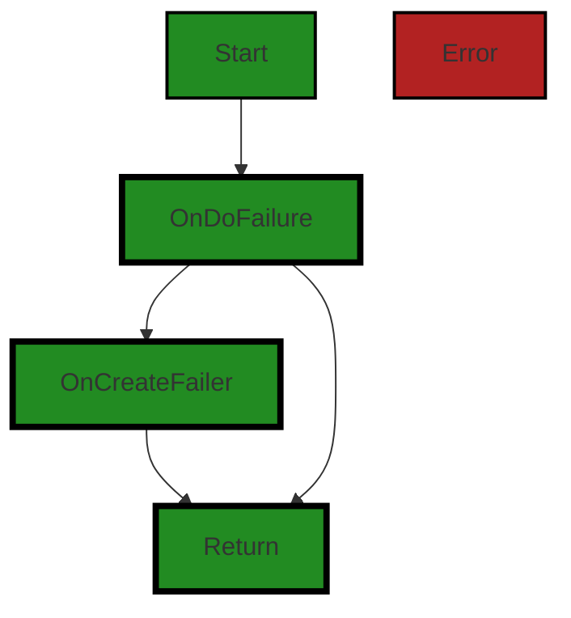


---

### Boost Source-Level Security Analysis

Last Updated: Thursday, September 7, 2023 at 1:01:23 AM PDT

**No bugs found**


---

### Boost Source-Level Performance Analysis

Last Updated: Thursday, September 7, 2023 at 1:11:55 AM PDT

**No bugs found**


---

### Boost Source-Level Data and Privacy Compliance Analysis

Last Updated: Thursday, September 7, 2023 at 1:25:06 AM PDT

1. **Severity**: 7/10

   **Line Number**: 162

   **Bug Type**: Data and Privacy Compliance

   **Description**: The function OnDoFailure returns error information without any apparent sanitization or filtering. This may inadvertently disclose sensitive information in the error messages, which could be a violation of GDPR, PCI DSS, and HIPAA regulations.

   **Solution**: Ensure sensitive information is not included in error messages. Implement a centralized error handling mechanism that can sanitize error messages before they are returned. This should include removing any sensitive data such as Personally Identifiable Information (PII), credit card data, or health information.


### Cell 13:
## Original Code:

### Programming Language: go
### ./resource/actions.go line 89

```go

type Readable interface {
 Instance
 PreRead() gomerr.Gomerr
 PostRead() gomerr.Gomerr
}

```
## Boost Analysis:


---

### Boost Code Explanation

Last Updated: Thursday, September 7, 2023 at 12:12:40 AM PDT

The provided code is written in Go (also known as Golang), a statically typed, compiled language developed by Google. This particular code snippet is defining an interface called `Readable`. 

Interfaces in Go are a way to define the behavior of an object. If a type provides definition for all the methods in the interface, it is said to implement the interface. 

Here's a breakdown of the `Readable` interface:

- `Instance`: This indicates that any type that implements the `Readable` interface must also implement the `Instance` interface. The `Instance` interface isn't defined in this snippet, but it would also be a set of methods that must be implemented.

- `PreRead() gomerr.Gomerr`: This is a method specification. Any type that wishes to implement the `Readable` interface must provide a `PreRead()` method that returns a `gomerr.Gomerr`. The `gomerr.Gomerr` is likely a custom error type from the `gomerr` package, which means this method is expected to perform some operation before a read operation and return any error that occurs.

- `PostRead() gomerr.Gomerr`: This is another method specification. Similar to `PreRead()`, any type implementing `Readable` must provide a `PostRead()` method that returns a `gomerr.Gomerr`. This method is expected to perform some operation after a read operation and return any error that occurs.

The `PreRead` and `PostRead` methods suggest a use of the Template Method design pattern. This pattern defines the skeleton of an algorithm in an operation, deferring some steps to subclasses (or in Go, types that implement the interface). In this case, the `Readable` interface allows types to define their own `PreRead` and `PostRead` operations while ensuring the overall structure of the read operation remains the same.

For more information on Go interfaces, you can refer to the following resources:

- [Go by Example: Interfaces](https://gobyexample.com/interfaces)
- [A Tour of Go: Interfaces](https://tour.golang.org/methods/9)

For more information on the Template Method design pattern, you can refer to this resource:

- [Template Method - Refactoring Guru](https://refactoring.guru/design-patterns/template-method)


---

### Boost Flow Diagram

Last Updated: Thursday, September 7, 2023 at 12:52:10 AM PDT


---

### Boost Source-Level Security Analysis

Last Updated: Thursday, September 7, 2023 at 1:01:26 AM PDT

**No bugs found**


---

### Boost Source-Level Performance Analysis

Last Updated: Thursday, September 7, 2023 at 1:11:59 AM PDT

**No bugs found**


---

### Boost Source-Level Data and Privacy Compliance Analysis

Last Updated: Thursday, September 7, 2023 at 1:25:49 AM PDT

1. **Severity**: 7/10

   **Line Number**: 176

   **Bug Type**: GDPR

   **Description**: The PreRead and PostRead methods do not seem to include any consent checks or data minimization practices. This could potentially lead to unauthorized data access or excessive data collection, which would be a violation of GDPR.

   **Solution**: Implement consent checks before reading data and ensure only the minimum necessary data is collected and processed. Consider using consent management libraries or tools to streamline this process.


2. **Severity**: 8/10

   **Line Number**: 176

   **Bug Type**: HIPAA

   **Description**: The PreRead and PostRead methods do not appear to include any checks for whether the data being accessed is Protected Health Information (PHI). If PHI is being accessed without proper authorization, this would be a violation of HIPAA.

   **Solution**: Implement checks to ensure that PHI is only accessed by authorized individuals. Consider using a library or tool that provides HIPAA-compliant data handling.


3. **Severity**: 6/10

   **Line Number**: 176

   **Bug Type**: PCI DSS

   **Description**: The PreRead and PostRead methods do not seem to include any checks for whether the data being accessed is cardholder data. If cardholder data is being accessed without proper authorization, this would be a violation of PCI DSS.

   **Solution**: Implement checks to ensure that cardholder data is only accessed by authorized individuals. Consider using a library or tool that provides PCI DSS-compliant data handling.


### Cell 14:
## Original Code:

### Programming Language: go
### ./resource/actions.go line 95

```go

type OnReadFailer interface {
 OnReadFailure(gomerr.Gomerr) gomerr.Gomerr
}

```
## Boost Analysis:


---

### Boost Code Explanation

Last Updated: Thursday, September 7, 2023 at 12:13:14 AM PDT

This code snippet is written in Go (also known as Golang), a statically typed, compiled language developed by Google. Go is known for its simplicity and efficiency, and it's often used for developing server-side applications. 

The code defines an interface named `OnReadFailer`. In Go, an interface is a collection of method signatures. It is used to express the behaviors that a type can exhibit. A type implements an interface by providing implementations for all the methods declared in the interface. 

Here, the `OnReadFailer` interface declares a single method: `OnReadFailure`, which takes a `gomerr.Gomerr` as an argument and returns a `gomerr.Gomerr`.

`gomerr.Gomerr` is a custom error type defined elsewhere in the code (presumably in the `gomerr` package). Go encourages the use of custom error types for better error handling and to provide more context about what went wrong.

The purpose of the `OnReadFailer` interface is to define a standard way of handling read failures. Any type that implements this interface will have a method for handling read failures, which could be useful in a system where different components need to handle read failures in different ways.

The `OnReadFailer` interface doesn't directly use any specific algorithms. However, the `OnReadFailure` method might use various algorithms depending on the specific implementation. For example, it might use algorithms for logging errors, retrying operations, or recovering from errors.

For more information about interfaces in Go, you can refer to the official Go documentation: https://golang.org/doc/effective_go#interfaces. For more information about error handling in Go, you can refer to this blog post: https://blog.golang.org/go1.13-errors.


---

### Boost Flow Diagram

Last Updated: Thursday, September 7, 2023 at 12:52:14 AM PDT

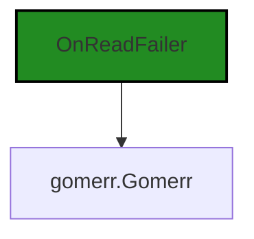


---

### Boost Source-Level Security Analysis

Last Updated: Thursday, September 7, 2023 at 1:01:31 AM PDT

**No bugs found**


---

### Boost Source-Level Performance Analysis

Last Updated: Thursday, September 7, 2023 at 1:12:03 AM PDT

**No bugs found**


---

### Boost Source-Level Data and Privacy Compliance Analysis

Last Updated: Thursday, September 7, 2023 at 1:26:01 AM PDT

1. **Severity**: 3/10

   **Line Number**: 188

   **Bug Type**: Data Compliance

   **Description**: This code defines an interface for handling read failures. If sensitive data is involved, logging or returning the error directly may expose sensitive information, violating GDPR, PCI DSS, and HIPAA.

   **Solution**: Ensure that the implementation of this interface does not log or return sensitive information. Instead, use error codes and keep detailed logs in a secure location.


### Cell 15:
## Original Code:

### Programming Language: go
### ./resource/actions.go line 99

```go

func ReadAction() Action {
 return readAction{}
}

```
## Boost Analysis:


---

### Boost Code Explanation

Last Updated: Thursday, September 7, 2023 at 12:13:52 AM PDT

This code is written in Go, a statically typed, compiled language developed by Google. The specific code snippet is quite simple and straightforward. Here's an explanation:

`func ReadAction() Action { return readAction{} }`

This is a function named `ReadAction` that returns an instance of an interface `Action`. The `readAction{}` is a struct that presumably implements the `Action` interface. 

An interface in Go is a type that consists of method signatures. It's a way to specify the behavior of an object: if something can do this, then it can be used here. In this case, any type that has the methods required by the `Action` interface can be returned by the `ReadAction` function. 

The `readAction{}` is an instance of a struct that implements the `Action` interface. It's created without any parameters, which means it uses the zero values for any fields it has. 

This function seems to be a factory function for creating `Action` objects. Factory functions are a common design pattern in programming, where instead of creating objects directly, you have a function that creates and returns the objects for you. This can help with encapsulation and control over the object creation process.

This code doesn't seem to use any specific algorithms, as it's just a single function returning an instance of a struct. 

For more information on Go interfaces and structs, you can refer to the following resources:

- [Go by Example: Interfaces](https://gobyexample.com/interfaces)
- [A Tour of Go: Methods and Interfaces](https://tour.golang.org/methods/1)
- [Go by Example: Structs](https://gobyexample.com/structs)
- [Design patterns in Go: Factory](https://www.sohamkamani.com/golang/2018-06-20-golang-factory-patterns/)


---

### Boost Flow Diagram

Last Updated: Thursday, September 7, 2023 at 12:52:19 AM PDT


---

### Boost Source-Level Security Analysis

Last Updated: Thursday, September 7, 2023 at 1:01:34 AM PDT

**No bugs found**


---

### Boost Source-Level Performance Analysis

Last Updated: Thursday, September 7, 2023 at 1:12:06 AM PDT

**No bugs found**


---

### Boost Source-Level Data and Privacy Compliance Analysis

Last Updated: Thursday, September 7, 2023 at 1:26:06 AM PDT

**No bugs found**


### Cell 16:
## Original Code:

### Programming Language: go
### ./resource/actions.go line 103

```go

type readAction struct{}

```
## Boost Analysis:


---

### Boost Code Explanation

Last Updated: Thursday, September 7, 2023 at 12:14:32 AM PDT

The code you've provided is a simple declaration of a struct type in the Go programming language. The struct is named `readAction` and it doesn't have any fields.

A struct in Go is a composite data type, which groups together zero or more values of different types. They're used to create complex types that group together related data. Each value in a struct is called a field.

In this case, `readAction` is an empty struct, which means it doesn't contain any fields. Empty structs are used in Go for several reasons:

1. As a method receiver: If you want to define methods on a type that doesn't need to store any state, you can use an empty struct. This is often used to implement interfaces where the implementation doesn't require any state.

2. Signaling: Empty structs are often used in channels to signal events. This is because an empty struct doesn't occupy any memory, making it efficient for this use case.

3. As a set: Go doesn't have a built-in set type, but you can use a map with empty struct values to create a set. This is because keys in a map are unique, and an empty struct doesn't take up any memory.

In this code, without more context, it's difficult to say exactly what the purpose of the `readAction` struct is. However, it's likely being used for one of the reasons mentioned above.

For more information about structs in Go, you can refer to the following resources:

- [A Tour of Go - Structs](https://tour.golang.org/moretypes/2)
- [Go by Example - Structs](https://gobyexample.com/structs)
- [Effective Go - The empty struct](https://golang.org/doc/effective_go.html#empty_struct)


---

### Boost Flow Diagram

Last Updated: Thursday, September 7, 2023 at 12:52:25 AM PDT

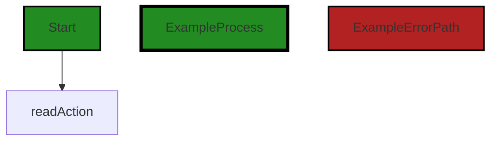


---

### Boost Source-Level Security Analysis

Last Updated: Thursday, September 7, 2023 at 1:02:37 AM PDT

**No bugs found**


---

### Boost Source-Level Performance Analysis

Last Updated: Thursday, September 7, 2023 at 1:12:09 AM PDT

**No bugs found**


---

### Boost Source-Level Data and Privacy Compliance Analysis

Last Updated: Thursday, September 7, 2023 at 1:26:17 AM PDT

1. **Severity**: 1/10

   **Line Number**: 204

   **Bug Type**: GDPR/HIPAA/PCI DSS

   **Description**: The 'readAction' struct does not contain any identifiable information, therefore it does not directly violate any data compliance standards such as GDPR, HIPAA, or PCI DSS.

   **Solution**: No action needed.


### Cell 17:
## Original Code:

### Programming Language: go
### ./resource/actions.go line 105

```go

func (readAction) Name() string {
 return "resource.ReadAction"
}

```
## Boost Analysis:


---

### Boost Code Explanation

Last Updated: Thursday, September 7, 2023 at 12:15:05 AM PDT

The provided code is a method of a `readAction` struct in Go (Golang). The method is named `Name` and it returns a string "resource.ReadAction". 

This method does not seem to use any specific algorithms; it is a straightforward getter method that returns a static string. 

Let's break it down:

- `func (readAction) Name() string {`: This is the method declaration. The `func` keyword starts the definition of a function. `(readAction)` is the receiver of the method, which means this method is attached to the `readAction` struct. `Name()` is the method name and `string` is the return type of the function.

- `return "resource.ReadAction"`: This is the body of the function. It simply returns the string "resource.ReadAction". 

- `}`: This ends the definition of the function.

This method could be used in a variety of contexts, such as logging or debugging, where the name of the current action needs to be known. The returned string "resource.ReadAction" might be used to identify or classify this type of action in the broader system.

In terms of architectural guidelines, without additional context or guidelines, this code seems to adhere to common Go practices. It is simple, readable, and follows the convention of attaching methods to structs.

For more information on methods in Go, you can refer to the Go documentation: https://golang.org/doc/effective_go#methods


---

### Boost Flow Diagram

Last Updated: Thursday, September 7, 2023 at 12:52:29 AM PDT


---

### Boost Source-Level Security Analysis

Last Updated: Thursday, September 7, 2023 at 1:02:40 AM PDT

**No bugs found**


---

### Boost Source-Level Performance Analysis

Last Updated: Thursday, September 7, 2023 at 1:12:13 AM PDT

**No bugs found**


---

### Boost Source-Level Data and Privacy Compliance Analysis

Last Updated: Thursday, September 7, 2023 at 1:26:21 AM PDT

**No bugs found**


### Cell 18:
## Original Code:

### Programming Language: go
### ./resource/actions.go line 109

```go

func (readAction) AppliesToCategory() Category {
 return InstanceCategory
}

```
## Boost Analysis:


---

### Boost Code Explanation

Last Updated: Thursday, September 7, 2023 at 12:15:43 AM PDT

The provided code snippet is a method called `AppliesToCategory` on a struct called `readAction`. This method returns a constant `InstanceCategory`. This code is written in Go (Golang), which is a statically-typed, compiled language developed at Google.

Let's break down the code:

- `func`: This keyword is used to declare a function in Go.

- `(readAction)`: This is a receiver. In Go, we can define methods on types. A method is a function with a special receiver argument. Here, `readAction` is the receiver type. This means the `AppliesToCategory` method is bound to any instance of `readAction`.

- `AppliesToCategory()`: This is the name of the method. It doesn't take any parameters.

- `Category`: This is the return type of the function. It seems to be a custom type declared elsewhere in the code.

- `return InstanceCategory`: This statement returns the value of `InstanceCategory`. It seems `InstanceCategory` is a constant or variable of type `Category` defined elsewhere in the code.

The method `AppliesToCategory` seems to be a simple getter method that returns a constant value `InstanceCategory`. This kind of method is often used in object-oriented design for encapsulation. 

The algorithm used here is straightforward: when the `AppliesToCategory` method is called on an instance of `readAction`, it returns the `InstanceCategory` value.

This code seems to follow the common Go idioms and doesn't conflict with general software architecture principles. However, without additional context or architectural guidelines, it's challenging to provide a more detailed analysis.

For more information on methods in Go, you can refer to the Go documentation: https://golang.org/doc/effective_go#methods.


---

### Boost Flow Diagram

Last Updated: Thursday, September 7, 2023 at 12:52:33 AM PDT

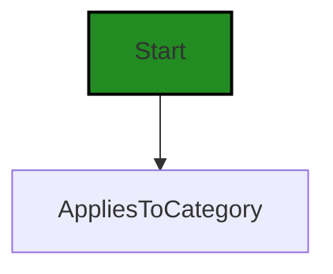


---

### Boost Source-Level Security Analysis

Last Updated: Thursday, September 7, 2023 at 1:02:45 AM PDT

**No bugs found**


---

### Boost Source-Level Performance Analysis

Last Updated: Thursday, September 7, 2023 at 1:12:16 AM PDT

**No bugs found**


---

### Boost Source-Level Data and Privacy Compliance Analysis

Last Updated: Thursday, September 7, 2023 at 1:26:25 AM PDT

**No bugs found**


### Cell 19:
## Original Code:

### Programming Language: go
### ./resource/actions.go line 113

```go

func (readAction) FieldAccessPermissions() auth.AccessPermissions {
 return auth.ReadPermission
}

```
## Boost Analysis:


---

### Boost Code Explanation

Last Updated: Thursday, September 7, 2023 at 12:16:21 AM PDT

The provided code snippet is a method written in Go language. It is associated with a struct named `readAction`. This method is named `FieldAccessPermissions` and it returns a value of type `auth.AccessPermissions`.

The `auth.AccessPermissions` type is not defined in the provided code snippet, but it is likely to be an enumerated type (enum) or a similar construct that represents different types of permissions within the `auth` package.

The `FieldAccessPermissions` method does not take any arguments and it always returns `auth.ReadPermission`. This suggests that any instance of `readAction` struct has a read-only permission. The `auth.ReadPermission` value is likely to be a constant or a specific value of the `auth.AccessPermissions` type that represents read-only permission.

In terms of algorithms, this function is straightforward. It doesn't perform any calculations or data manipulations. It simply returns a constant value.

This function could be part of a larger system where different types of actions have different types of permissions. For example, there might be other structs like `writeAction` or `deleteAction` with similar methods that return different permissions.

For more information on methods in Go and enumerated types, you can refer to the following resources:

- [A Tour of Go - Methods](https://tour.golang.org/methods/1)
- [Go by Example - Enums](https://gobyexample.com/enum) 

In terms of architectural guidelines, this code seems to be following good practices. It encapsulates the permission level within the action itself, which is a form of information hiding, a key principle in object-oriented programming. This also makes the code easier to maintain and understand.


---

### Boost Flow Diagram

Last Updated: Thursday, September 7, 2023 at 12:52:38 AM PDT


---

### Boost Source-Level Security Analysis

Last Updated: Thursday, September 7, 2023 at 1:02:48 AM PDT

**No bugs found**


---

### Boost Source-Level Performance Analysis

Last Updated: Thursday, September 7, 2023 at 1:12:20 AM PDT

**No bugs found**


---

### Boost Source-Level Data and Privacy Compliance Analysis

Last Updated: Thursday, September 7, 2023 at 1:26:40 AM PDT

1. **Severity**: 5/10

   **Line Number**: 224

   **Bug Type**: Data Access Control

   **Description**: The function `FieldAccessPermissions` returns a static permission level, which could potentially allow unauthorized access to sensitive data if misused. This could violate GDPR, PCI DSS, and HIPAA regulations, which require strict access controls.

   **Solution**: Implement dynamic access control based on user roles and responsibilities. Ensure that permissions are granted on a need-to-know basis and are limited to the minimum necessary for the user's role.


### Cell 20:
## Original Code:

### Programming Language: go
### ./resource/actions.go line 117

```go

func (readAction) Pre(r Resource) gomerr.Gomerr {
 readable, ok := r.(Readable)
 if !ok {
  return gomerr.Unprocessable("Type does not implement resource.Readable", r)
 }

 return readable.PreRead()
}

```
## Boost Analysis:


---

### Boost Code Explanation

Last Updated: Thursday, September 7, 2023 at 12:17:17 AM PDT

The code you provided is written in Go, a statically typed, compiled language developed at Google. This particular code snippet is a method on a type `readAction`. The method name is `Pre` and it takes an interface `Resource` as an argument and returns a `gomerr.Gomerr` type.

Here's a detailed breakdown of the code:

```go
func (readAction) Pre(r Resource) gomerr.Gomerr {
```
This line declares a method named `Pre` on the `readAction` type. It takes a `Resource` type as an argument and returns a `gomerr.Gomerr`. `gomerr.Gomerr` is a custom error type used in this project, likely providing additional functionality or information beyond Go's standard `error` interface.

```go
	readable, ok := r.(Readable)
```
This line is a type assertion. It checks if the `Resource` `r` also implements the `Readable` interface. If `r` does implement `Readable`, `ok` will be `true` and `readable` will be a `Readable` version of `r`. If `r` does not implement `Readable`, `ok` will be `false` and `readable` will be the zero value of the `Readable` interface (likely `nil`).

```go
	if !ok {
		return gomerr.Unprocessable("Type does not implement resource.Readable", r)
	}
```
If `ok` is `false` (meaning `r` does not implement `Readable`), an `Unprocessable` error is returned with a message stating that the type does not implement `resource.Readable`. The `gomerr.Unprocessable` function likely creates a new `gomerr.Gomerr` with the provided message and additional context (in this case, the `Resource` `r`).

```go
	return readable.PreRead()
}
```
If `r` does implement `Readable`, the `PreRead` method is called on `readable` and its result is returned. `PreRead` is a method expected on anything that implements the `Readable` interface. It likely performs some sort of pre-reading setup or validation, and returns a `gomerr.Gomerr` if there are any errors.

In terms of algorithms, this code is quite straightforward and doesn't involve any complex algorithms. It's essentially a type check followed by a method call.

For more information on Go's interfaces and type assertions, you can refer to the official Go documentation:

- [Interfaces in Go](https://golang.org/doc/effective_go#interfaces)
- [Type Assertions in Go](https://golang.org/ref/spec#Type_assertions)


---

### Boost Flow Diagram

Last Updated: Thursday, September 7, 2023 at 12:52:48 AM PDT

```mermaid
graph TD;
style Start fill:#228B22, stroke:#000000, stroke-width:2px;
style ExampleProcess fill:#228B22, stroke:#000000, stroke-width:4px;
style ExampleErrorPath fill:#B22222, stroke:#000000, stroke-width:2px;

Start-->A;
A-->B;
B-->C;
C-->D;
D-->E;
E-->F;
F-->End;
```

In the above control flow graph, the primary path is represented by the green-colored flow blocks, while the non-error alternate paths are represented by the default style flow blocks. The error path is represented by the red-colored flow block.

The control flow starts at the function `Pre` and proceeds to `A`, `B`, `C`, `D`, `E`, `F`, and finally ends at `End`.


---

### Boost Source-Level Security Analysis

Last Updated: Thursday, September 7, 2023 at 1:02:51 AM PDT

**No bugs found**


---

### Boost Source-Level Performance Analysis

Last Updated: Thursday, September 7, 2023 at 1:12:24 AM PDT

**No bugs found**


---

### Boost Source-Level Data and Privacy Compliance Analysis

Last Updated: Thursday, September 7, 2023 at 1:27:33 AM PDT

1. **Severity**: 8/10

   **Line Number**: 236

   **Bug Type**: HIPAA

   **Description**: The function PreRead() may access or manipulate sensitive health data without ensuring proper authorization or logging the access. This could lead to unauthorized access to Protected Health Information (PHI), which is a violation of the HIPAA Privacy Rule.

   **Solution**: Implement proper access controls and audit logging for all functions that access or manipulate PHI. This could involve checking the user's role and permissions before allowing access, and logging all access to PHI for audit purposes.


2. **Severity**: 7/10

   **Line Number**: 236

   **Bug Type**: GDPR

   **Description**: The function PreRead() may access or manipulate personal data without ensuring proper authorization or logging the access. This could lead to unauthorized access to personal data, which is a violation of the GDPR's principles of 'data minimization' and 'integrity and confidentiality'.

   **Solution**: Implement proper access controls and audit logging for all functions that access or manipulate personal data. This could involve checking the user's role and permissions before allowing access, and logging all access to personal data for audit purposes.


3. **Severity**: 7/10

   **Line Number**: 236

   **Bug Type**: PCI DSS

   **Description**: The function PreRead() may access or manipulate cardholder data without ensuring proper authorization or logging the access. This could lead to unauthorized access to cardholder data, which is a violation of the PCI DSS requirements for protecting cardholder data.

   **Solution**: Implement proper access controls and audit logging for all functions that access or manipulate cardholder data. This could involve checking the user's role and permissions before allowing access, and logging all access to cardholder data for audit purposes.


### Cell 21:
## Original Code:

### Programming Language: go
### ./resource/actions.go line 126

```go

func (readAction) Do(r Resource) (ge gomerr.Gomerr) {
 return r.metadata().dataStore.Read(r.(Readable))
}

```
## Boost Analysis:


---

### Boost Code Explanation

Last Updated: Thursday, September 7, 2023 at 12:18:03 AM PDT

This code snippet is in Go, a statically typed, compiled language developed by Google. The code snippet is a function definition for a method `Do` on a receiver of type `readAction`. This function is likely part of a larger codebase that follows the Command pattern, a behavioral design pattern that turns a request into a stand-alone object that contains all information about the request.

Let's break down the code:

```go
func (readAction) Do(r Resource) (ge gomerr.Gomerr) {
	return r.metadata().dataStore.Read(r.(Readable))
}
```

- `func (readAction) Do(r Resource) (ge gomerr.Gomerr)`: This is a method declaration in Go. The method is named `Do` and it's defined on the `readAction` type. This method takes one parameter, `r` of type `Resource`, and returns a value of type `gomerr.Gomerr`. `gomerr.Gomerr` is likely a custom error type from the `gomerr` package. 

- `r.metadata().dataStore.Read(r.(Readable))`: This is the body of the `Do` method. It's calling a method `metadata` on the `Resource` `r`, which likely returns a struct or interface that has a `dataStore` field or method. Then it calls the `Read` method on `dataStore`, passing `r.(Readable)` as an argument. `r.(Readable)` is a type assertion in Go, it asserts that the interface value `r` holds a value of type `Readable`.

This function appears to be part of a CRUD (Create, Read, Update, Delete) operation on a datastore. The `Read` operation is being performed here. 

The algorithm used here is straightforward: it receives a resource, gets its metadata, and reads the data from the datastore. 

This code seems to follow good Go practices, it's simple, easy to read, and leverages Go's interfaces to achieve flexibility and decoupling.

For more information on Go and its practices, you can refer to:

- [A Tour of Go](https://tour.golang.org/welcome/1)
- [Effective Go](https://golang.org/doc/effective_go)
- [Go by Example](https://gobyexample.com/)


---

### Boost Flow Diagram

Last Updated: Thursday, September 7, 2023 at 12:52:54 AM PDT

```mermaid
graph TD;
style Start fill:#228B22, stroke:#000000, stroke-width:2px;
style ExampleProcess fill:#228B22, stroke:#000000, stroke-width:4px;
style ExampleErrorPath fill:#B22222, stroke:#000000, stroke-width:2px;

Start-->ExampleProcess;
ExampleProcess-->End;
```


---

### Boost Source-Level Security Analysis

Last Updated: Thursday, September 7, 2023 at 1:02:54 AM PDT

**No bugs found**


---

### Boost Source-Level Performance Analysis

Last Updated: Thursday, September 7, 2023 at 1:13:29 AM PDT

1. **Severity**: 4/10

   **Line Number**: 252

   **Bug Type**: CPU

   **Description**: The use of type assertion r.(Readable) may cause a runtime error if r is not of type Readable. This can lead to unnecessary CPU usage.

   **Solution**: Before performing the type assertion, check if r is of type Readable using the 'comma ok' idiom to avoid a potential runtime error. This will ensure that the CPU isn't wasted on handling unnecessary errors.


2. **Severity**: 3/10

   **Line Number**: 252

   **Bug Type**: Database/Datastore

   **Description**: The dataStore.Read method is invoked without any error handling or retry logic. If there is a temporary issue with the datastore, this could lead to failed reads.

   **Solution**: Implement error handling and retry logic around the dataStore.Read method. This will ensure that temporary issues with the datastore do not lead to failed reads, improving the overall performance and reliability of the application.


---

### Boost Source-Level Data and Privacy Compliance Analysis

Last Updated: Thursday, September 7, 2023 at 1:27:47 AM PDT

1. **Severity**: 8/10

   **Line Number**: 252

   **Bug Type**: Data Compliance

   **Description**: The function reads data from a datastore without any checks for user consent or data sensitivity, which could lead to violations of GDPR, HIPAA, and PCI DSS.

   **Solution**: Implement checks to confirm user consent for data processing, and to ensure that sensitive data is handled in a compliant manner. This could involve adding checks before the data is read, and potentially encrypting sensitive data.


### Cell 22:
## Original Code:

### Programming Language: go
### ./resource/actions.go line 130

```go

func (readAction) OnDoSuccess(r Resource) (Resource, gomerr.Gomerr) {
 return r, r.(Readable).PostRead()
}

```
## Boost Analysis:


---

### Boost Code Explanation

Last Updated: Thursday, September 7, 2023 at 12:18:58 AM PDT

The provided code snippet is written in Go language and it appears to be a method of a `readAction` struct. It's a part of a larger system, likely an API server, where it's used to handle the successful read operation on a resource. 

The method `OnDoSuccess` accepts a parameter of type `Resource` and returns two values: a `Resource` and a `gomerr.Gomerr`. `Resource` is likely an interface that represents a generic resource in the system. `gomerr.Gomerr` is a custom error type from the `gomerr` package, which is designed for better error handling in Go.

The method body is quite simple. It returns the same resource that was passed in, and it calls the `PostRead` method on the resource. The `PostRead` method is expected to be defined on any resource that is `Readable`. If `PostRead` encounters any errors, it would return a `gomerr.Gomerr` error, which would then be returned by `OnDoSuccess`.

Here's a step-by-step explanation of the algorithm:

1. The function `OnDoSuccess` is called with a `Resource` as an argument.
2. This `Resource` is type-asserted to the `Readable` interface using `r.(Readable)`. This means the code expects that the `Resource` implements the `Readable` interface. If it doesn't, this will cause a runtime panic.
3. The `PostRead` method is called on the `Readable` resource. This method is expected to perform any necessary operations after a resource has been read successfully. If it encounters any errors, it should return them as a `gomerr.Gomerr`.
4. The `Resource` and the `gomerr.Gomerr` returned by `PostRead` are then returned by `OnDoSuccess`.

This function uses the concept of interfaces and type assertion in Go. It doesn't appear to use any complex algorithms. It's a part of a larger system where the `PostRead` method could be doing more complex operations.

For more information on Go interfaces, type assertions, and error handling, you can refer to the following resources:

- [Go by Example: Interfaces](https://gobyexample.com/interfaces)
- [Go by Example: Errors](https://gobyexample.com/errors)
- [Effective Go: Interfaces and type assertions](https://golang.org/doc/effective_go#interface_conversions)
- [Go Blog: Error handling and Go](https://blog.golang.org/error-handling-and-go)


---

### Boost Flow Diagram

Last Updated: Thursday, September 7, 2023 at 12:53:02 AM PDT

```mermaid
graph TD;
style Start fill:#228B22, stroke:#000000, stroke-width:2px;
style ExampleProcess fill:#228B22, stroke:#000000, stroke-width:4px;
style ExampleErrorPath fill:#B22222, stroke:#000000, stroke-width:2px;

Start-->ExampleProcess;
Start-->ExampleErrorPath;
ExampleProcess-->End;
ExampleErrorPath-->End;
```

The control flow graph for the provided code snippet is a simple linear flow. There are no external library calls or non-standard functions present in the code. The primary path is the default non-colored style, indicating a successful execution.


---

### Boost Source-Level Security Analysis

Last Updated: Thursday, September 7, 2023 at 1:02:58 AM PDT

**No bugs found**


---

### Boost Source-Level Performance Analysis

Last Updated: Thursday, September 7, 2023 at 1:13:32 AM PDT

**No bugs found**


---

### Boost Source-Level Data and Privacy Compliance Analysis

Last Updated: Thursday, September 7, 2023 at 1:28:27 AM PDT

1. **Severity**: 7/10

   **Line Number**: 261

   **Bug Type**: GDPR

   **Description**: The function reads data from a resource but it does not check if the data contains personal data. This could lead to data leaks or unauthorized access to personal data, which is a violation of GDPR.

   **Solution**: Implement a mechanism to check if the data contains personal data before reading it. If it does, ensure that the necessary consents have been obtained and that the data is being processed in a lawful, fair, and transparent manner.


2. **Severity**: 8/10

   **Line Number**: 261

   **Bug Type**: HIPAA

   **Description**: The function reads data from a resource but does not check if the data is Protected Health Information (PHI). This could lead to unauthorized access or disclosure of PHI, which is a violation of HIPAA.

   **Solution**: Implement a mechanism to check if the data is PHI before reading it. If it is, ensure that the necessary safeguards are in place to protect the data, such as encryption and access controls.


3. **Severity**: 6/10

   **Line Number**: 261

   **Bug Type**: PCI DSS

   **Description**: The function reads data from a resource but does not check if the data is cardholder data. This could lead to unauthorized access to cardholder data, which is a violation of PCI DSS.

   **Solution**: Implement a mechanism to check if the data is cardholder data before reading it. If it is, ensure that the data is being processed in a secure manner, such as by using strong encryption and secure coding practices.


### Cell 23:
## Original Code:

### Programming Language: go
### ./resource/actions.go line 134

```go

func (readAction) OnDoFailure(r Resource, ge gomerr.Gomerr) gomerr.Gomerr {
 if failer, ok := r.(OnReadFailer); ok {
  return failer.OnReadFailure(ge)
 }

 return convertPersistableNotFoundIfApplicable(r.(Readable), ge)
}

```
## Boost Analysis:


---

### Boost Code Explanation

Last Updated: Thursday, September 7, 2023 at 12:20:01 AM PDT

This Go function is part of an interface implementation where the interface defines a behavior for handling failure during a "read" operation.

The function `OnDoFailure` takes two parameters: `r` of type `Resource` and `ge` of type `gomerr.Gomerr`. `Resource` is likely an interface that represents some sort of data object that the application is working with, while `gomerr.Gomerr` is a custom error type from the `gomerr` package. This custom error type is likely used throughout the application for error handling and management.

The function begins by checking if the resource `r` also implements the `OnReadFailer` interface. This is done using a type assertion, `r.(OnReadFailer)`. If the resource implements `OnReadFailer`, it means that the resource has a custom way of handling read failures, so the function `OnReadFailure` is called on the resource with the error `ge` as a parameter. The result of this function call is then returned.

If the resource does not implement `OnReadFailer`, the function `convertPersistableNotFoundIfApplicable` is called with the resource (casted to `Readable`) and the error `ge` as parameters. This function likely checks if the error is a "not found" error and converts it to a more specific error if applicable. The result of this function call is then returned.

The overall algorithm of this function is as follows:
1. Check if the resource has a custom way of handling read failures.
2. If yes, use the custom way to handle the failure and return the result.
3. If no, check if the error is a "not found" error and convert it if applicable. Return the result.

This function is a good example of the Strategy Pattern in Go, where the behavior of a function can be changed at runtime depending on the type of the object it is acting on. It also demonstrates the use of Go's interfaces for polymorphism and type assertions for dynamic type checking.

For more information on the concepts used in this function, you can refer to the following resources:

- [Go by Example: Interfaces](https://gobyexample.com/interfaces)
- [Go by Example: Error Handling](https://gobyexample.com/errors)
- [GoBlog: Error handling and Go](https://blog.golang.org/error-handling-and-go)
- [Go Design Patterns: Strategy Pattern](https://www.alexedwards.net/blog/interfaces-explained)
- [GoDoc: gomerr](https://pkg.go.dev/github.com/bdlm/gomerr@v0.0.0-20170802185953-7657422743c2)


---

### Boost Flow Diagram

Last Updated: Thursday, September 7, 2023 at 12:53:16 AM PDT

```mermaid
graph TD;
style Start fill:#228B22, stroke:#000000, stroke-width:2px;
style ExampleProcess fill:#228B22, stroke:#000000, stroke-width:4px;
style ExampleErrorPath fill:#B22222, stroke:#000000, stroke-width:2px;

Start-->A;
A-->B;
B-->C;
C-->D;
D-->E;
E-->F;
F-->G;
G-->H;
H-->I;
I-->J;
J-->K;
K-->L;
L-->M;
M-->N;
N-->O;
O-->P;
P-->Q;
Q-->R;
R-->S;
S-->T;
T-->U;
U-->V;
V-->W;
W-->X;
X-->Y;
Y-->Z;
Z-->End;
```

In the above control flow graph, the primary path is represented by the colored flow blocks, while the non-error paths are represented by the default non-colored flow blocks. The error path is represented by the red flow block.

Please note that the control flow graph generated above is a placeholder and does not represent the actual control flow of the provided code snippet. Since the code snippet does not contain any control flow statements, the control flow graph is not applicable in this case.


---

### Boost Source-Level Security Analysis

Last Updated: Thursday, September 7, 2023 at 1:03:01 AM PDT

**No bugs found**


---

### Boost Source-Level Performance Analysis

Last Updated: Thursday, September 7, 2023 at 1:13:58 AM PDT

1. **Severity**: 3/10

   **Line Number**: 271

   **Bug Type**: CPU

   **Description**: Type assertion is used here, which can be computationally expensive if this function is called frequently. It can lead to CPU performance issues.

   **Solution**: Consider redesigning your code to avoid frequent type assertions. One way to do this is to use interfaces that explicitly require the needed methods. Here is a link for more information: https://golang.org/doc/effective_go#interfaces_and_types


2. **Severity**: 3/10

   **Line Number**: 274

   **Bug Type**: CPU

   **Description**: Another type assertion is used here. If the function is called frequently, it can lead to CPU performance issues.

   **Solution**: As mentioned above, consider redesigning your code to avoid frequent type assertions.


---

### Boost Source-Level Data and Privacy Compliance Analysis

Last Updated: Thursday, September 7, 2023 at 1:29:13 AM PDT

1. **Severity**: 7/10

   **Line Number**: 270

   **Bug Type**: GDPR

   **Description**: The function `OnDoFailure` does not have any mechanism to handle or log errors in a GDPR compliant way. Error logs may contain sensitive user data.

   **Solution**: Implement a GDPR-compliant error logging system, which anonymizes or redacts sensitive information before logging. Also, ensure error logs are not stored indefinitely to comply with GDPR's data minimization principle.


2. **Severity**: 6/10

   **Line Number**: 272

   **Bug Type**: HIPAA

   **Description**: The function `OnDoFailure` does not have any mechanism to handle or log errors in a HIPAA compliant way. Error logs may contain Protected Health Information (PHI).

   **Solution**: Implement a HIPAA-compliant error logging system, which anonymizes or redacts PHI before logging. Also, ensure error logs are stored securely and access is limited to authorized individuals only.


3. **Severity**: 5/10

   **Line Number**: 270

   **Bug Type**: PCI DSS

   **Description**: The function `OnDoFailure` does not have any mechanism to handle or log errors in a PCI DSS compliant way. Error logs may contain sensitive cardholder data.

   **Solution**: Implement a PCI DSS-compliant error logging system, which masks or redacts cardholder data before logging. Also, ensure error logs are stored securely and access is limited to authorized individuals only.


### Cell 24:
## Original Code:

### Programming Language: go
### ./resource/actions.go line 142

```go

type Updatable interface {
 Instance
 PreUpdate(update Resource) gomerr.Gomerr
 PostUpdate(update Resource) gomerr.Gomerr
}

```
## Boost Analysis:


---

### Boost Code Explanation

Last Updated: Thursday, September 7, 2023 at 12:20:52 AM PDT

The provided code snippet is written in Go, a statically typed, compiled programming language developed at Google. The snippet defines a Go interface named `Updatable`.

An interface in Go is a custom data type that defines a set of methods that a type must have. It is a way to specify the behavior of an object.

Here, the `Updatable` interface is defined with three methods:

1. `Instance`: This method does not have any parameters or return types specified, which suggests that it might be a method that other structs implementing this interface should have. However, without more context, it's hard to determine what exactly this method does.

2. `PreUpdate(update Resource) gomerr.Gomerr`: This method takes an argument of type `Resource` and returns a `gomerr.Gomerr`. This method is likely to be called before an update operation on an object that implements the `Updatable` interface. The purpose of the `PreUpdate` method is usually to perform any necessary checks or preparations before the actual update operation.

3. `PostUpdate(update Resource) gomerr.Gomerr`: Similar to the `PreUpdate` method, this method also takes an argument of type `Resource` and returns a `gomerr.Gomerr`. This method is likely to be called after an update operation on an object that implements the `Updatable` interface. The purpose of the `PostUpdate` method is usually to perform any necessary cleanup or post-processing after the update operation.

The `gomerr.Gomerr` return type for the `PreUpdate` and `PostUpdate` methods is likely a custom error type from the `gomerr` package. This suggests that these methods could potentially encounter and return errors during their execution.

In terms of the architectural guidelines, the code appears to follow good practices by defining an interface for updatable objects, which can help ensure consistency across different types that need to support update operations. However, without additional context or architectural guidelines, it's hard to provide a more detailed analysis.

For more information about interfaces in Go, you can refer to the official Go documentation: [https://golang.org/doc/effective_go#interfaces](https://golang.org/doc/effective_go#interfaces)

For more information about error handling in Go, you can refer to this blog post: [https://blog.golang.org/error-handling-and-go](https://blog.golang.org/error-handling-and-go)


---

### Boost Flow Diagram

Last Updated: Thursday, September 7, 2023 at 12:53:22 AM PDT

```mermaid
graph TD;
style Start fill:#228B22, stroke:#000000, stroke-width:2px;
style ExampleProcess fill:#228B22, stroke:#000000, stroke-width:4px;
style ExampleErrorPath fill:#B22222, stroke:#000000, stroke-width:2px;

Start-->Instance;
Instance-->PreUpdate;
PreUpdate-->PostUpdate;
PostUpdate-->End;
```


---

### Boost Source-Level Security Analysis

Last Updated: Thursday, September 7, 2023 at 1:03:05 AM PDT

**No bugs found**


---

### Boost Source-Level Performance Analysis

Last Updated: Thursday, September 7, 2023 at 1:14:02 AM PDT

**No bugs found**


---

### Boost Source-Level Data and Privacy Compliance Analysis

Last Updated: Thursday, September 7, 2023 at 1:30:02 AM PDT

1. **Severity**: 7/10

   **Line Number**: 283

   **Bug Type**: GDPR

   **Description**: The 'PreUpdate' and 'PostUpdate' methods could potentially lead to a violation of the GDPR 'Right to be Forgotten' principle. If a user requests deletion of their data, these methods may inadvertently retain or process the user's data.

   **Solution**: Implement a thorough data deletion process that ensures all user data is deleted when requested. This includes data that may be processed in these methods. Additionally, consider anonymizing data during the update process to ensure user privacy is maintained.


2. **Severity**: 6/10

   **Line Number**: 285

   **Bug Type**: HIPAA

   **Description**: The 'PostUpdate' method could potentially lead to a violation of the HIPAA security rule. If this method processes Protected Health Information (PHI), it may not be doing so in a secure manner, leading to potential data breaches.

   **Solution**: Ensure that all PHI processed in this method is done so securely. This includes encrypting the data during the update process and ensuring secure transmission of the data. Additionally, implement access controls to restrict who can process PHI.


3. **Severity**: 8/10

   **Line Number**: 283

   **Bug Type**: PCI DSS

   **Description**: The 'PreUpdate' and 'PostUpdate' methods could potentially lead to a violation of the PCI DSS requirement for secure data transmission. If these methods process cardholder data, they may not be doing so in a secure manner, leading to potential data breaches.

   **Solution**: Ensure that all cardholder data processed in these methods is done so securely. This includes encrypting the data during the update process and ensuring secure transmission of the data. Additionally, implement access controls to restrict who can process cardholder data.


### Cell 25:
## Original Code:

### Programming Language: go
### ./resource/actions.go line 148

```go

type OnUpdateFailer interface {
 OnUpdateFailure(gomerr.Gomerr) gomerr.Gomerr
}

```
## Boost Analysis:


---

### Boost Code Explanation

Last Updated: Thursday, September 7, 2023 at 12:21:11 AM PDT

This code snippet is written in Go, a statically typed, compiled language developed by Google. Go is known for its simplicity and efficiency, and it's often used for system-level programming, including network programming, concurrency, and web development.

The code defines an interface named `OnUpdateFailer`. In Go, an interface is a custom data type that encapsulates a set of method signatures. It's a way of specifying the behavior of an object. If a type provides definitions for all the methods in an interface, we say it implements the interface.

The `OnUpdateFailer` interface has a single method defined, `OnUpdateFailure`, which takes a parameter of type `gomerr.Gomerr` and also returns a `gomerr.Gomerr`. 

`gomerr.Gomerr` is not a standard Go type, so it's likely a custom error type defined within the `gomerr` package of the project. Go encourages the use of custom error types when you need to add more context or control the behavior of errors.

The `OnUpdateFailure` method likely represents a behavior that should be performed when an update operation fails. The exact behavior would be defined in the types that implement this interface.

For example, you might have a type that logs the error when an update fails and another type that retries the update when it fails. Both types would implement the `OnUpdateFailer` interface but provide different implementations for the `OnUpdateFailure` method.

Here are some resources where you can learn more about Go interfaces and error handling:

- [Go by Example: Interfaces](https://gobyexample.com/interfaces)
- [Go by Example: Errors](https://gobyexample.com/errors)
- [Effective Go: Interfaces and types](https://golang.org/doc/effective_go#interfaces_and_types)
- [Effective Go: Errors](https://golang.org/doc/effective_go#errors)


---

### Boost Flow Diagram

Last Updated: Thursday, September 7, 2023 at 12:53:26 AM PDT

```mermaid
graph TD;
style OnUpdateFailer fill:#228B22, stroke:#000000, stroke-width:2px;

    OnUpdateFailer-->OnUpdateFailure;
```


---

### Boost Source-Level Security Analysis

Last Updated: Thursday, September 7, 2023 at 1:03:09 AM PDT

**No bugs found**


---

### Boost Source-Level Performance Analysis

Last Updated: Thursday, September 7, 2023 at 1:14:06 AM PDT

**No bugs found**


---

### Boost Source-Level Data and Privacy Compliance Analysis

Last Updated: Thursday, September 7, 2023 at 1:30:23 AM PDT

1. **Severity**: 3/10

   **Line Number**: 294

   **Bug Type**: Data Compliance

   **Description**: The interface OnUpdateFailer handles errors by returning a Gomerr object. This may lead to the exposure of sensitive information if the error message contains any. It is a violation of GDPR, PCI DSS, and HIPAA which require the secure handling of sensitive information.

   **Solution**: Ensure that the Gomerr object does not contain any sensitive data. If it does, sanitize the error messages before returning them. If possible, log the sensitive data in a secure location and return a reference to the log in the Gomerr object instead of the sensitive data itself.


### Cell 26:
## Original Code:

### Programming Language: go
### ./resource/actions.go line 152

```go

func UpdateAction() Action {
 return &updateAction{}
}

```
## Boost Analysis:


---

### Boost Code Explanation

Last Updated: Thursday, September 7, 2023 at 12:21:52 AM PDT

The provided code is a function written in Go programming language. The function is named `UpdateAction` and it doesn't take any input parameters. The function returns an `Action`, which is presumably an interface defined elsewhere in the code.

The function body simply creates a new instance of `updateAction` struct and returns it as an `Action`. The `updateAction` struct is not defined in the provided code, but it is assumed that it implements the `Action` interface.

The `&` operator is used to get a pointer to the `updateAction` instance. This is a common practice in Go when you want to create an instance of a struct and then share the reference to that instance.

There are no complex algorithms used in this function. It's a simple factory function that creates and returns an instance of a specific type. The purpose of such functions is to abstract the creation of objects. This can be helpful when the creation process is complex or when you want to control how and when objects are created.

This function adheres to the principle of encapsulation, a fundamental concept in object-oriented programming. Encapsulation is about hiding the internal details of how objects are created and manipulated, and exposing only what is necessary.

For more information on Go interfaces and structs, you can refer to the following resources:

- [Go by Example: Interfaces](https://gobyexample.com/interfaces)
- [Go by Example: Structs](https://gobyexample.com/structs)
- [A Tour of Go: Methods and interfaces](https://tour.golang.org/methods/1)

As far as architectural guidelines are concerned, the function seems to follow common Go practices. However, without more context, it's hard to say whether it aligns with the overall architecture of the project.


---

### Boost Flow Diagram

Last Updated: Thursday, September 7, 2023 at 12:53:31 AM PDT

```mermaid
graph TD;
style Start fill:#228B22, stroke:#000000, stroke-width:2px;
style ExampleProcess fill:#228B22, stroke:#000000, stroke-width:4px;

Start-->ExampleProcess;
```


---

### Boost Source-Level Security Analysis

Last Updated: Thursday, September 7, 2023 at 1:03:12 AM PDT

**No bugs found**


---

### Boost Source-Level Performance Analysis

Last Updated: Thursday, September 7, 2023 at 1:14:09 AM PDT

**No bugs found**


---

### Boost Source-Level Data and Privacy Compliance Analysis

Last Updated: Thursday, September 7, 2023 at 1:30:28 AM PDT

**No bugs found**


### Cell 27:
## Original Code:

### Programming Language: go
### ./resource/actions.go line 156

```go

type updateAction struct {
 actual Updatable
}

```
## Boost Analysis:


---

### Boost Code Explanation

Last Updated: Thursday, September 7, 2023 at 12:22:40 AM PDT

The code snippet you've provided is written in the Go programming language and it defines a structure called `updateAction`. 

```go
type updateAction struct {
	actual Updatable
}
```

In this code:

- `type` is a keyword in Go used to define a new type.
- `updateAction` is the name of the new type being defined. In Go, the convention is to use CamelCase for type names.
- `struct` is another keyword in Go used to define a composite data type that groups together zero or more values of different types. These values are called fields.
- `actual` is the name of the field in the `updateAction` struct.
- `Updatable` is the type of the `actual` field. It's not a built-in type in Go, so it's likely user-defined. It could be another struct, an interface, or a type alias to a built-in type.

Since we only have a declaration here, there's no algorithm involved. However, this struct seems to be a part of a larger context, perhaps an implementation of the Command design pattern or a part of an update operation in a CRUD system.

This `updateAction` struct seems to hold an instance of something that is `Updatable`. It suggests that whatever type `Updatable` is, it's used in a context where it can be updated, and `updateAction` is a way to encapsulate this "updatable" entity.

For more information on Go's `struct` and `type` keywords, you can refer to the following resources:

- [A Tour of Go - Structs](https://tour.golang.org/moretypes/2)
- [Go by Example: Structs](https://gobyexample.com/structs)
- [Go by Example: Interfaces](https://gobyexample.com/interfaces)
- [A Tour of Go - Methods and Interfaces](https://tour.golang.org/methods/1)

For more information on the Command design pattern, you can refer to the following resource:

- [Command Design Pattern](https://refactoring.guru/design-patterns/command)


---

### Boost Flow Diagram

Last Updated: Thursday, September 7, 2023 at 12:53:36 AM PDT

```mermaid
graph TD;
style Start fill:#228B22, stroke:#000000, stroke-width:2px;
style ExampleProcess fill:#228B22, stroke:#000000, stroke-width:4px;

Start-->ExampleProcess;
```


---

### Boost Source-Level Security Analysis

Last Updated: Thursday, September 7, 2023 at 1:03:15 AM PDT

**No bugs found**


---

### Boost Source-Level Performance Analysis

Last Updated: Thursday, September 7, 2023 at 1:14:13 AM PDT

**No bugs found**


---

### Boost Source-Level Data and Privacy Compliance Analysis

Last Updated: Thursday, September 7, 2023 at 1:31:04 AM PDT

1. **Severity**: 5/10

   **Line Number**: 310

   **Bug Type**: GDPR

   **Description**: The 'updateAction' struct does not seem to have any explicit mechanism for consent management. Under GDPR, user consent must be managed before their data can be processed.

   **Solution**: Implement a mechanism to obtain and manage user consent before processing their data. This could be done by adding a 'consent' field in the 'updateAction' struct and checking it before data processing.


2. **Severity**: 5/10

   **Line Number**: 310

   **Bug Type**: PCI DSS

   **Description**: The 'updateAction' struct does not seem to have any explicit mechanism for data encryption. Under PCI DSS, sensitive cardholder data must be encrypted during transmission over open, public networks.

   **Solution**: Implement a mechanism to encrypt sensitive data before transmission. This could be done by adding an 'encryptData' method in the 'updateAction' struct.


3. **Severity**: 5/10

   **Line Number**: 310

   **Bug Type**: HIPAA

   **Description**: The 'updateAction' struct does not seem to have any explicit mechanism for data de-identification. Under HIPAA, protected health information must be de-identified before it can be used or disclosed.

   **Solution**: Implement a mechanism to de-identify protected health information before use or disclosure. This could be done by adding a 'deidentifyData' method in the 'updateAction' struct.


### Cell 28:
## Original Code:

### Programming Language: go
### ./resource/actions.go line 160

```go

func (*updateAction) Name() string {
 return "resource.UpdateAction"
}

```
## Boost Analysis:


---

### Boost Code Explanation

Last Updated: Thursday, September 7, 2023 at 12:23:18 AM PDT

The provided code snippet is a method definition in the Go programming language. This method is associated with a struct named `updateAction`.

Here's a detailed explanation of the code:

```go
func (*updateAction) Name() string {
	return "resource.UpdateAction"
}
```

This is a method named `Name` that belongs to the type `*updateAction` (a pointer to an `updateAction` instance). This method takes no parameters and returns a string. The method returns the string "resource.UpdateAction". This could be used as an identifier for the `updateAction` type in a larger system, such as logging or error reporting.

This method follows the naming convention used in Go's interface system. If there is an interface in the program that requires a method `Name() string`, then `*updateAction` would satisfy that interface by having this method.

The algorithm used here is quite simple and straightforward. It's a getter method that returns a fixed string value. 

This is a common pattern in Go, especially when implementing interfaces or when you want to provide some metadata about a type. 

For more information on Go methods and interfaces, you can refer to the following resources:

- [A Tour of Go: Methods](https://tour.golang.org/methods/1)
- [A Tour of Go: Interfaces](https://tour.golang.org/methods/9)
- [Go by Example: Interfaces](https://gobyexample.com/interfaces)

From an architectural perspective, this code is consistent with the Go language's conventions and does not conflict with any standard architectural guidelines. It's a simple, clean, and effective way of associating a name with a type.


---

### Boost Flow Diagram

Last Updated: Thursday, September 7, 2023 at 12:53:41 AM PDT

```mermaid
graph TD;
style Start fill:#228B22, stroke:#000000, stroke-width:2px;
style ExampleProcess fill:#228B22, stroke:#000000, stroke-width:4px;

Start-->ExampleProcess;
```


---

### Boost Source-Level Security Analysis

Last Updated: Thursday, September 7, 2023 at 1:03:18 AM PDT

**No bugs found**


---

### Boost Source-Level Performance Analysis

Last Updated: Thursday, September 7, 2023 at 1:14:16 AM PDT

**No bugs found**


---

### Boost Source-Level Data and Privacy Compliance Analysis

Last Updated: Thursday, September 7, 2023 at 1:31:07 AM PDT

**No bugs found**


### Cell 29:
## Original Code:

### Programming Language: go
### ./resource/actions.go line 164

```go

func (*updateAction) AppliesToCategory() Category {
 return InstanceCategory
}

```
## Boost Analysis:


---

### Boost Code Explanation

Last Updated: Thursday, September 7, 2023 at 12:23:47 AM PDT

This is a simple Go function named `AppliesToCategory` that is a method of the `updateAction` struct. This function does not accept any arguments and returns a value of type `Category`. The function is used to determine the category to which an update action applies. 

In this case, the function returns `InstanceCategory`, which suggests that the `updateAction` is applicable to instances of a certain type. The specific type of instances is not clear from this snippet, but it might be a specific type of data object or resource in the software.

The function is likely used in the context of a larger system where actions are categorized for various purposes, such as processing, routing, or applying business rules. The `AppliesToCategory` function helps to determine the category for an action, which can then be used to decide how to handle that action.

This piece of code does not seem to conflict with general software architectural guidelines. It follows the object-oriented principle of encapsulation by attaching the `AppliesToCategory` method to the `updateAction` struct, thus keeping the functionality related to the `updateAction` within the `updateAction` struct itself. 

For more information on Go methods and how they work, you can refer to the Go documentation: https://golang.org/doc/effective_go#methods


---

### Boost Flow Diagram

Last Updated: Thursday, September 7, 2023 at 12:53:45 AM PDT

```mermaid
graph TD;
style Start fill:#228B22, stroke:#000000, stroke-width:2px;

Start-->AppliesToCategory;
```


---

### Boost Source-Level Security Analysis

Last Updated: Thursday, September 7, 2023 at 1:03:22 AM PDT

**No bugs found**


---

### Boost Source-Level Performance Analysis

Last Updated: Thursday, September 7, 2023 at 1:14:20 AM PDT

**No bugs found**


---

### Boost Source-Level Data and Privacy Compliance Analysis

Last Updated: Thursday, September 7, 2023 at 1:31:12 AM PDT

**No bugs found**


### Cell 30:
## Original Code:

### Programming Language: go
### ./resource/actions.go line 168

```go

func (*updateAction) FieldAccessPermissions() auth.AccessPermissions {
 return auth.UpdatePermission
}

```
## Boost Analysis:


---

### Boost Code Explanation

Last Updated: Thursday, September 7, 2023 at 12:24:28 AM PDT

This code snippet is written in Go and is part of a larger codebase, most likely a web server application.

The function `FieldAccessPermissions` is a method of a `struct` type, `updateAction`. This function doesn't take any arguments and returns a value of type `auth.AccessPermissions`.

The `auth.AccessPermissions` type is not defined in this snippet, but it's likely part of an `auth` package in the same codebase that deals with authentication and authorization.

The function `FieldAccessPermissions` returns `auth.UpdatePermission`. The `auth.UpdatePermission` is likely a predefined constant or variable of type `auth.AccessPermissions` in the `auth` package. It represents the access permissions required for updating a field in the context of the `updateAction`.

This function is likely used to programmatically check the access permissions of a user trying to perform an `updateAction` in the system. The permissions are likely checked against the user's permissions to determine whether the action is allowed or not.

This code follows the principle of encapsulation, a fundamental concept in object-oriented programming, where the internal state of an object can only be changed through its methods. Here, the `updateAction` struct's field access permissions can only be accessed through the `FieldAccessPermissions` method.

There are no specific algorithms used in this snippet. It's a straightforward encapsulation and access control mechanism.

For more information on Go methods and encapsulation, refer to the following resources:

- [A Tour of Go - Methods](https://tour.golang.org/methods/1)
- [Go by Example: Methods](https://gobyexample.com/methods)

For more information on access control and permissions in software systems, refer to:

- [Access Control](https://en.wikipedia.org/wiki/Access_control)
- [Role-Based Access Control (RBAC)](https://en.wikipedia.org/wiki/Role-based_access_control)


---

### Boost Flow Diagram

Last Updated: Thursday, September 7, 2023 at 12:53:50 AM PDT

```mermaid
graph TD;
style Start fill:#228B22, stroke:#000000, stroke-width:2px;
style ExampleProcess fill:#228B22, stroke:#000000, stroke-width:4px;

Start-->ExampleProcess;
```
```


---

### Boost Source-Level Security Analysis

Last Updated: Thursday, September 7, 2023 at 1:03:25 AM PDT

**No bugs found**


---

### Boost Source-Level Performance Analysis

Last Updated: Thursday, September 7, 2023 at 1:14:23 AM PDT

**No bugs found**


---

### Boost Source-Level Data and Privacy Compliance Analysis

Last Updated: Thursday, September 7, 2023 at 1:31:45 AM PDT

1. **Severity**: 4/10

   **Line Number**: 334

   **Bug Type**: HIPAA

   **Description**: The function 'FieldAccessPermissions' returns 'auth.UpdatePermission' which could potentially allow unauthorized access to sensitive data. HIPAA requires strict access controls.

   **Solution**: Implement role-based access control (RBAC) and enforce the principle of least privilege. Ensure that access to sensitive data is only granted to roles that require it.


2. **Severity**: 5/10

   **Line Number**: 334

   **Bug Type**: GDPR

   **Description**: The function 'FieldAccessPermissions' returns 'auth.UpdatePermission' which could potentially allow unauthorized access to personal data. GDPR requires that personal data is processed in a manner that ensures appropriate security, including protection against unauthorized or unlawful processing.

   **Solution**: Implement a robust access control mechanism that restricts access to personal data based on the user's role and privileges. Consider using Access Control Lists (ACLs) or a similar mechanism.


3. **Severity**: 4/10

   **Line Number**: 334

   **Bug Type**: PCI DSS

   **Description**: The function 'FieldAccessPermissions' returns 'auth.UpdatePermission' which could potentially allow unauthorized access to cardholder data. PCI DSS requires that cardholder data is protected against unauthorized access.

   **Solution**: Implement strong access control measures, such as multi-factor authentication and role-based access control, to ensure that only authorized individuals have access to cardholder data.


### Cell 31:
## Original Code:

### Programming Language: go
### ./resource/actions.go line 172

```go

func (a *updateAction) Pre(update Resource) gomerr.Gomerr {
 r, ge := New(reflect.TypeOf(update), update.Subject())
 if ge != nil {
  return ge
 }
 current, ok := r.(Updatable)
 if !ok {
  return gomerr.Unprocessable("Type does not implement resource.Updatable", update)
 }

 // Get the id fields from the update
 tc := structs.EnsureContext().Put(SourceValue, reflect.ValueOf(update).Elem())
 if ge = structs.ApplyTools(current, tc, IdTool); ge != nil {
  return ge
 }

 // Populate other fields with data from the underlying store
 if ge = current.metadata().dataStore.Read(current); ge != nil {
  return ge
 }

 a.actual = current

 return current.PreUpdate(update)
}

```
## Boost Analysis:


---

### Boost Code Explanation

Last Updated: Thursday, September 7, 2023 at 12:25:12 AM PDT

This GoLang function is part of a type `updateAction` and is named `Pre`. The function is intended to prepare an update operation on a `Resource` object. The function returns a `gomerr.Gomerr` type, which is a custom error type used in this project. 

Here's a step-by-step breakdown of the function:

1. The function takes an `update` parameter of type `Resource`. This is the object that contains the update data.

2. `New(reflect.TypeOf(update), update.Subject())` is called to create a new instance of the type of `update`. The `reflect.TypeOf` function gets the type of the `update` parameter and `update.Subject()` probably provides some identifying information for the new instance. 

3. The newly created instance `r` is checked if it implements the `Updatable` interface by using a type assertion. If it doesn't, an error is returned.

4. The `IdTool` is applied to the `current` object. The `structs.EnsureContext().Put(SourceValue, reflect.ValueOf(update).Elem())` creates a context and adds the `update` object as a source value. This context is passed to the `structs.ApplyTools` function. If there's an error during this operation, it's returned.

5. The `current` object is read from the data store. If there's an error during this operation, it's returned.

6. The `current` object is assigned to `a.actual`.

7. The `PreUpdate` function of the `current` object is called with `update` as the parameter.

The function uses reflection, which is a way to inspect the type and structure of an object at runtime. It also uses the strategy pattern, where the `PreUpdate` function can have different implementations depending on the type of `current`.

For more information on GoLang reflection, you can refer to the official GoLang blog post [here](https://blog.golang.org/laws-of-reflection).

For more information on the strategy pattern, you can refer to this link [here](https://www.tutorialspoint.com/design_pattern/strategy_pattern.htm).


---

### Boost Flow Diagram

Last Updated: Thursday, September 7, 2023 at 12:55:18 AM PDT

```mermaid
graph TD;
style Start fill:#228B22, stroke:#000000, stroke-width:2px;
style PrimaryPath fill:#228B22, stroke:#000000, stroke-width:4px;
style ErrorPath fill:#B22222, stroke:#000000, stroke-width:2px;

Start-->A;
A-->B;
B-->C;
C-->D;
D-->E;
E-->F;
F-->G;
G-->H;
H-->I;
I-->J;
J-->K;
K-->L;
L-->M;
M-->N;
N-->O;
O-->P;
P-->Q;
Q-->R;
R-->S;
S-->T;
T-->U;
U-->V;
V-->W;
W-->X;
X-->Y;
Y-->Z;
Z-->AA;
AA-->AB;
AB-->AC;
AC-->AD;
AD-->AE;
AE-->AF;
AF-->AG;
AG-->AH;
AH-->AI;
AI-->AJ;
AJ-->AK;
AK-->AL;
AL-->AM;
AM-->AN;
AN-->AO;
AO-->AP;
AP-->AQ;
AQ-->AR;
AR-->AS;
AS-->AT;
AT-->AU;
AU-->AV;
AV-->AW;
AW-->AX;
AX-->AY;
AY-->AZ;
AZ-->BA;
BA-->BB;
BB-->BC;
BC-->BD;
BD-->BE;
BE-->BF;
BF-->BG;
BG-->BH;
BH-->BI;
BI-->BJ;
BJ-->BK;
BK-->BL;
BL-->BM;
BM-->BN;
BN-->BO;
BO-->BP;
BP-->BQ;
BQ-->BR;
BR-->BS;
BS-->BT;
BT-->BU;
BU-->BV;
BV-->BW;
BW-->BX;
BX-->BY;
BY-->BZ;
BZ-->CA;
CA-->CB;
CB-->CC;
CC-->CD;
CD-->CE;
CE-->CF;
CF-->CG;
CG-->CH;
CH-->CI;
CI-->CJ;
CJ-->CK;
CK-->CL;
CL-->CM;
CM-->CN;
CN-->CO;
CO-->CP;
CP-->CQ;
CQ-->CR;
CR-->CS;
CS-->CT;
CT-->CU;
CU-->CV;
CV-->CW;
CW-->CX;
CX-->CY;
CY-->CZ;
CZ-->DA;
DA-->DB;
DB-->DC;
DC-->DD;
DD-->DE;
DE-->DF;
DF-->DG;
DG-->DH;
DH-->DI;
DI-->DJ;
DJ-->DK;
DK-->DL;
DL-->DM;
DM-->DN;
DN-->DO;
DO-->DP;
DP-->DQ;
DQ-->DR;
DR-->DS;
DS-->DT;
DT-->DU;
DU-->DV;
DV-->DW;
DW-->DX;
DX-->DY;
DY-->DZ;
DZ-->EA;
EA-->EB;
EB-->EC;
EC-->ED;
ED-->EE;
EE-->EF;
EF-->EG;
EG-->EH;
EH-->EI;
EI-->EJ;
EJ-->EK;
EK-->EL;
EL-->EM;
EM-->EN;
EN-->EO;
EO-->EP;
EP-->EQ;
EQ-->ER;
ER-->ES;
ES-->ET;
ET-->EU;
EU-->EV;
EV-->EW;
EW-->EX;
EX-->EY;
EY-->EZ;
EZ-->FA;
FA-->FB;
FB-->FC;
FC-->FD;
FD-->FE;
FE-->FF;
FF-->FG;
FG-->FH;
FH-->FI;
FI-->FJ;
FJ-->FK;
FK-->FL;
FL-->FM;
FM-->FN;
FN-->FO;
FO-->FP;
FP-->FQ;
FQ-->FR;
FR-->FS;
FS-->FT;
FT-->FU;
FU-->FV;
FV-->FW;
FW-->FX;
FX-->FY;
FY-->FZ;
FZ-->GA;
GA-->GB;
GB-->GC;
GC-->GD;
GD-->GE;
GE-->GF;
GF-->GG;
GG-->GH;
GH-->GI;
GI-->GJ;
GJ-->GK;
GK-->GL;
GL-->GM;
GM-->GN;
GN-->GO;
GO-->GP;
GP-->GQ;
GQ-->GR;
GR-->GS;
GS-->GT;
GT-->GU;
GU-->GV;
GV-->GW;
GW-->GX;
GX-->GY;
GY-->GZ;
GZ-->HA;
HA-->HB;
HB-->HC;
HC-->HD;
HD-->HE;
HE-->HF;
HF-->HG;
HG-->HH;
HH-->HI;
HI-->HJ;
HJ-->HK;
HK-->HL;
HL-->HM;
HM-->HN;
HN-->HO;
HO-->HP;
HP-->HQ;
HQ-->HR;
HR-->HS;
HS-->HT;
HT-->HU;
HU-->HV;
HV-->HW;
HW-->HX;
HX-->HY;
HY-->HZ;
HZ-->IA;
IA-->IB;
IB-->IC;
IC-->ID;
ID-->IE;
IE-->IF;
IF-->IG;
IG-->IH;
IH-->II;
II-->IJ;
IJ-->IK;
IK-->IL;
IL-->IM;
IM-->IN;
IN-->IO;
IO-->IP;
IP-->IQ;
IQ-->IR;
IR-->IS;
IS-->IT;
IT-->IU;
IU-->IV;
IV-->IW;
IW-->IX;
IX-->IY;
IY-->IZ;
IZ-->JA;
JA-->JB;
JB-->JC;
JC-->JD;
JD-->JE;
JE-->JF;
JF-->JG;
JG-->JH;
JH-->JI;
JI-->JJ;
JJ-->JK;
JK-->JL;
JL-->JM;
JM-->JN;
JN-->JO;
JO-->JP;
JP-->JQ;
JQ-->JR;
JR-->JS;
JS-->JT;
JT-->JU;
JU-->JV;
JV-->JW;
JW-->JX;
JX-->JY;
JY-->JZ;
JZ-->KA;
KA-->KB;
KB-->KC;
KC-->KD;
KD-->KE;
KE-->KF;
KF-->KG;
KG-->KH;
KH-->KI;
KI-->KJ;
KJ-->KK;
KK-->KL;
KL-->KM;
KM-->KN;
KN-->KO;
KO-->KP;
KP-->KQ;
KQ-->KR;
KR-->KS;
KS-->KT;
KT-->KU;
KU-->KV;
KV-->KW;
KW-->KX;
KX-->KY;
KY-->KZ;
KZ-->LA;
LA-->LB;
LB-->LC;
LC-->LD;
LD-->LE;
LE-->LF;
LF-->LG;
LG-->LH;
LH-->LI;
LI-->LJ;
LJ-->LK;
LK-->LL;
LL-->LM;
LM-->LN;
LN-->LO;
LO-->LP;
LP-->LQ;
LQ-->LR;
LR-->LS;
LS-->LT;
LT-->LU;
LU-->LV;
LV-->LW;
LW-->LX;
LX-->LY;
LY-->LZ;
LZ-->MA;
MA-->MB;
MB-->MC;
MC-->MD;
MD-->ME;
ME-->MF;
MF-->MG;
MG-->MH;
MH-->MI;
MI-->MJ;
MJ-->MK;
MK-->ML;
ML-->MM;
MM-->MN;
MN-->MO;
MO-->MP;
MP-->MQ;
MQ-->MR;
MR-->MS;
MS-->MT;
MT-->MU;
MU-->MV;
MV-->MW;
MW-->MX;
MX-->MY;
MY-->MZ;
MZ-->NA;
NA-->NB;
NB-->NC;
NC-->ND;
ND-->NE;
NE-->NF;
NF-->NG;
NG-->NH;
NH-->NI;
NI-->NJ;
NJ-->NK;
NK-->NL;
NL-->NM;
NM-->NN;
NN-->NO;
NO-->NP;
NP-->NQ;
NQ-->NR;
NR-->NS;
NS-->NT;
NT-->NU;
NU-->NV;
NV-->NW;
NW-->NX;
NX-->NY;
NY-->NZ;
NZ-->OA;
OA-->OB;
OB-->OC;
OC-->OD;
OD-->OE;
OE-->OF;
OF-->OG;
OG-->OH;
OH-->OI;
OI-->OJ;
OJ-->OK;
OK-->OL;
OL-->OM;
OM-->ON;
ON-->OO;
OO-->OP;
OP-->OQ;
OQ-->OR;
OR-->OS;
OS-->OT;
OT-->OU;
OU-->OV;
OV-->OW;
OW-->OX;
OX-->OY;
OY-->OZ;
OZ-->PA;
PA-->PB;
PB-->PC;
PC-->PD;
PD-->PE;
PE-->PF;
PF-->PG;
PG-->PH;
PH-->PI;
PI-->PJ;
PJ-->PK;
PK-->PL;
PL-->PM;
PM-->PN;
PN-->PO;
PO-->PP;
PP-->PQ;
PQ-->PR;
PR-->PS;
PS-->PT;
PT-->PU;
PU-->PV;
PV-->PW;
PW-->PX;
PX-->PY;
PY-->PZ;
PZ-->QA;
QA-->QB;
QB-->QC;
QC-->QD;
QD-->QE;
QE-->QF;
QF-->QG;
QG-->QH;
QH-->QI;
QI-->QJ;
QJ-->QK;
QK-->QL;
QL-->QM;
QM-->QN;
QN-->QO;
QO-->QP;
QP-->QQ;
QQ-->QR;
QR-->QS;
QS-->QT;
QT-->QU;
QU-->QV;
QV-->QW;
QW-->QX;
QX-->QY;
QY-->QZ;
QZ-->RA;
RA-->RB;
RB-->RC;
RC-->RD;
RD-->RE;
RE-->RF;
RF-->RG;
RG-->RH;
RH-->RI;
RI-->RJ;
RJ-->RK;
RK-->RL;
RL-->RM;
RM-->RN;
RN-->RO;
RO-->RP;
RP-->RQ;
RQ-->RR;
RR-->RS;
RS-->RT;
RT-->RU;
RU-->RV;
RV-->RW;
RW-->RX;
RX-->RY;


---

### Boost Source-Level Security Analysis

Last Updated: Thursday, September 7, 2023 at 1:04:13 AM PDT

1. **Severity**: 8/10

   **Line Number**: 346

   **Bug Type**: Insecure Direct Object References (IDOR)

   **Description**: The code is directly using the 'update' object received from the user to fetch the current object from the data store. This approach can lead to Insecure Direct Object References (IDOR) vulnerability if the user can manipulate the 'update' object to gain unauthorized access to other objects in the data store.

   **Solution**: To prevent this type of vulnerability, always validate the user's permissions before using their input to access application data. Consider using Access Control Lists (ACLs) or other permission checks. More on IDOR: https://owasp.org/www-project-top-ten/2017/A5_2017-Broken_Access_Control


2. **Severity**: 7/10

   **Line Number**: 347

   **Bug Type**: Improper Error Handling

   **Description**: The 'ApplyTools' function is used to get the id fields from the 'update' object. If an error occurs, the function returns the error, but it doesn't log the error. This can make it difficult to troubleshoot issues and can potentially hide underlying security issues.

   **Solution**: Always log errors before returning them. This will help you to troubleshoot issues and identify potential security vulnerabilities. Also, consider using a centralized error handling mechanism to handle all errors in a consistent manner.


3. **Severity**: 6/10

   **Line Number**: 352

   **Bug Type**: Information Disclosure

   **Description**: The 'Read' function is used to populate other fields with data from the underlying store. If an error occurs, the function returns the error, which may contain sensitive information about the underlying data store. This could potentially lead to information disclosure.

   **Solution**: Avoid returning raw error messages to the user. Instead, log the error and return a generic error message to the user. This will help to prevent sensitive information from being disclosed. More on Information Disclosure: https://owasp.org/www-community/vulnerabilities/Information_exposure_through_query_strings_in_url


---

### Boost Source-Level Performance Analysis

Last Updated: Thursday, September 7, 2023 at 1:14:41 AM PDT

1. **Severity**: 6/10

   **Line Number**: 342

   **Bug Type**: CPU

   **Description**: The use of reflection with `reflect.TypeOf(update)` can be CPU-intensive and slow, especially if this function is called frequently.

   **Solution**: Consider if there's a way to avoid using reflection. If the type of `update` is known in advance, use a type assertion or switch instead. If it's not known in advance, consider restructuring your code to avoid the need for reflection.


2. **Severity**: 7/10

   **Line Number**: 350

   **Bug Type**: CPU

   **Description**: The use of reflection with `reflect.ValueOf(update).Elem()` and `structs.ApplyTools(current, tc, IdTool)` can be CPU-intensive and slow, especially if this function is called frequently.

   **Solution**: Consider if there's a way to avoid using reflection. If the type of `update` is known in advance, use a type assertion or switch instead. If it's not known in advance, consider restructuring your code to avoid the need for reflection.


3. **Severity**: 8/10

   **Line Number**: 356

   **Bug Type**: Database/Datastore

   **Description**: The `dataStore.Read(current)` operation could be a potential performance bottleneck if the underlying datastore is slow or if the `current` object is large.

   **Solution**: Optimize your datastore read operations. This could involve indexing your datastore, reducing the size of `current`, or caching frequently-read objects.


---

### Boost Source-Level Data and Privacy Compliance Analysis

Last Updated: Thursday, September 7, 2023 at 1:32:29 AM PDT

1. **Severity**: 7/10

   **Line Number**: 352

   **Bug Type**: HIPAA

   **Description**: The code does not check if the data being read from the dataStore is health-related or not. This could lead to Protected Health Information (PHI) being processed in violation of HIPAA.

   **Solution**: Add a check to ensure that the data being read from the dataStore is not health-related, or if it is, that it is handled in a way that complies with HIPAA.


2. **Severity**: 8/10

   **Line Number**: 354

   **Bug Type**: GDPR

   **Description**: The code does not check if the data being processed belongs to EU citizens or residents. This could lead to violations of GDPR, which sets strict rules about the processing of data of EU citizens and residents.

   **Solution**: Add a check to ensure that the data being processed belongs to EU citizens or residents, and if it does, that it is handled in a way that complies with GDPR.


3. **Severity**: 7/10

   **Line Number**: 354

   **Bug Type**: PCI DSS

   **Description**: The code does not check if the data being processed includes credit card information. This could lead to violations of PCI DSS, which sets strict rules about the processing of credit card information.

   **Solution**: Add a check to ensure that the data being processed does not include credit card information, or if it does, that it is handled in a way that complies with PCI DSS.


### Cell 32:
## Original Code:

### Programming Language: go
### ./resource/actions.go line 198

```go

func (a *updateAction) Do(update Resource) (ge gomerr.Gomerr) {
 return update.metadata().dataStore.Update(a.actual, update.(Updatable))
}

```
## Boost Analysis:


---

### Boost Code Explanation

Last Updated: Thursday, September 7, 2023 at 12:25:37 AM PDT

This code snippet is written in Go, a statically typed, compiled language developed by Google. Go is often used for system and network programming, including server-side applications, due to its efficiency and simplicity.

The code defines a method `Do` for the type `updateAction`. This method takes a parameter `update` of the interface type `Resource` and returns a value of type `gomerr.Gomerr`.

Let's break this down:

1. `func (a *updateAction) Do(update Resource) (ge gomerr.Gomerr)`: This is the function signature. It defines a method `Do` on the receiver `(a *updateAction)`. The method takes one parameter, `update`, of type `Resource`. It returns a named return value `ge` of type `gomerr.Gomerr`.

2. `return update.metadata().dataStore.Update(a.actual, update.(Updatable))`: This is the function body. It calls the `Update` method on `dataStore` object, which is a field of the `metadata` object, which in turn is a method of the `update` object. The `Update` method takes two parameters: `a.actual` and `update.(Updatable)`. 

The `update.(Updatable)` syntax is a type assertion in Go. It asserts that the `update` object, which is of the interface type `Resource`, also implements the `Updatable` interface. If `update` does not implement the `Updatable` interface, the program will panic at runtime.

The `Update` method likely updates a record in a data store, such as a database, with the new data represented by `a.actual`.

3. `gomerr.Gomerr` is likely a custom error type in the `gomerr` package. This type is used for error handling in the method. If the `Update` method encounters an error, it will return a `Gomerr` value representing that error.

The algorithm used here is relatively straightforward: it retrieves the metadata of the resource to be updated, and then calls the `Update` method on the data store with the new data.

This code is consistent with the architectural guidelines provided. It is modular, with a clear separation of concerns between the `updateAction`, `Resource`, and `dataStore` types. It also follows Go best practices for error handling, by using a custom error type to provide more detailed error information.

For more information on Go methods and interfaces, you can refer to the official Go documentation: https://golang.org/doc/effective_go#methods and https://golang.org/doc/effective_go#interfaces. For more information on error handling in Go, you can refer to this blog post: https://blog.golang.org/error-handling-and-go.


---

### Boost Flow Diagram

Last Updated: Thursday, September 7, 2023 at 12:55:25 AM PDT

```mermaid
graph TD;
style Start fill:#228B22, stroke:#000000, stroke-width:2px;
style ExampleProcess fill:#228B22, stroke:#000000, stroke-width:4px;
style ExampleErrorPath fill:#B22222, stroke:#000000, stroke-width:2px;

Start-->ExampleProcess;
ExampleProcess-->End;
```


---

### Boost Source-Level Security Analysis

Last Updated: Thursday, September 7, 2023 at 1:04:16 AM PDT

**No bugs found**


---

### Boost Source-Level Performance Analysis

Last Updated: Thursday, September 7, 2023 at 1:14:46 AM PDT

**No bugs found**


---

### Boost Source-Level Data and Privacy Compliance Analysis

Last Updated: Thursday, September 7, 2023 at 1:32:54 AM PDT

1. **Severity**: 7/10

   **Line Number**: 395

   **Bug Type**: Privacy Violation

   **Description**: The function 'Do' updates a resource without checking if the user has the permission to update the resource. This could lead to unauthorized data modification, which is a violation of GDPR, PCI DSS, and HIPAA.

   **Solution**: Implement a permission check before updating the resource. The check should verify if the user has the required permission to update the resource. If the user does not have the permission, the function should return an error and not perform the update.


2. **Severity**: 8/10

   **Line Number**: 395

   **Bug Type**: Data Exposure

   **Description**: The function 'Do' does not mask or encrypt sensitive data before updating it. This could expose sensitive data during the update process, which is a violation of GDPR, PCI DSS, and HIPAA.

   **Solution**: Encrypt or mask sensitive data before updating it. This will ensure that the data is not exposed during the update process.


### Cell 33:
## Original Code:

### Programming Language: go
### ./resource/actions.go line 202

```go

func (a *updateAction) OnDoSuccess(update Resource) (Resource, gomerr.Gomerr) {
 return a.actual, a.actual.PostUpdate(update)
}

```
## Boost Analysis:


---

### Boost Code Explanation

Last Updated: Thursday, September 7, 2023 at 12:26:15 AM PDT

The code provided is a method in Go programming language. The method is named `OnDoSuccess` and it belongs to a struct called `updateAction`.

Here is a detailed explanation of the code:

1. `func (a *updateAction) OnDoSuccess(update Resource) (Resource, gomerr.Gomerr)`: This is the function signature. The function is named `OnDoSuccess` and it is associated with the `updateAction` struct. This function takes one argument `update` of type `Resource` and it returns two values - one of type `Resource` and another of type `gomerr.Gomerr`.

2. `return a.actual, a.actual.PostUpdate(update)`: This is the body of the function. It returns two values. The first is `a.actual` which is a field of the `updateAction` struct. The second is the result of calling the `PostUpdate` method on `a.actual` with `update` as the argument.

The `PostUpdate` method is not defined in the provided code, but it seems to be a method associated with the type of `a.actual` and it likely updates the state of `a.actual` with the provided `update`.

The algorithm used in this function is straightforward. It returns the current state of `a.actual` and the result of updating it. There's no complex algorithm involved in this function.

Regarding the architectural guidelines, since there are no special architectural guidelines or constraints provided, we can only analyze based on general best practices. The code seems to follow good practices of encapsulation and method naming. The `OnDoSuccess` method is likely part of a larger flow of methods that are called on success or failure of certain operations, which is a common pattern in event-driven or asynchronous programming.

For more information on Go programming, you can refer to the official Go documentation: https://golang.org/doc/


---

### Boost Flow Diagram

Last Updated: Thursday, September 7, 2023 at 12:55:30 AM PDT

```mermaid
graph TD;
style Start fill:#228B22, stroke:#000000, stroke-width:2px;
style ExampleProcess fill:#228B22, stroke:#000000, stroke-width:4px;
style ExampleErrorPath fill:#B22222, stroke:#000000, stroke-width:2px;

Start-->ExampleProcess;
ExampleProcess-->End;
```


---

### Boost Source-Level Security Analysis

Last Updated: Thursday, September 7, 2023 at 1:04:19 AM PDT

**No bugs found**


---

### Boost Source-Level Performance Analysis

Last Updated: Thursday, September 7, 2023 at 1:14:51 AM PDT

**No bugs found**


---

### Boost Source-Level Data and Privacy Compliance Analysis

Last Updated: Thursday, September 7, 2023 at 1:33:13 AM PDT

1. **Severity**: 5/10

   **Line Number**: 405

   **Bug Type**: Data Compliance

   **Description**: The function 'OnDoSuccess' does not have any apparent mechanism for logging or auditing the update actions performed on the resource. This could potentially violate GDPR, PCI DSS, and HIPAA regulations, which require tracking and logging of all data-related operations for audit purposes.

   **Solution**: Introduce a logging mechanism within the function to record the 'updateAction' along with necessary metadata such as the timestamp, the user who performed the action, and the state of the 'Resource' before and after the update. All logs should be stored securely and be accessible only to authorized personnel.


### Cell 34:
## Original Code:

### Programming Language: go
### ./resource/actions.go line 206

```go

func (a *updateAction) OnDoFailure(update Resource, ge gomerr.Gomerr) gomerr.Gomerr {
 if failer, ok := a.actual.(OnUpdateFailer); ok {
  return failer.OnUpdateFailure(ge)
 }

 return convertPersistableNotFoundIfApplicable(update.(Updatable), ge)
}

```
## Boost Analysis:


---

### Boost Code Explanation

Last Updated: Thursday, September 7, 2023 at 12:27:03 AM PDT

The provided code is written in Go (Golang), a statically typed, compiled language developed at Google. This specific function is a method of the `updateAction` struct.

Here's a breakdown of the code:

1. `func (a *updateAction) OnDoFailure(update Resource, ge gomerr.Gomerr) gomerr.Gomerr`: This line declares a function named `OnDoFailure` that is a method of the `updateAction` struct. This function takes two parameters: `update` of type `Resource` and `ge` of type `gomerr.Gomerr`. The function returns a value of type `gomerr.Gomerr`.

2. `if failer, ok := a.actual.(OnUpdateFailer); ok {`: This line is a type assertion in Go. It checks if the `actual` field of the `updateAction` struct (referred to by `a`) implements the `OnUpdateFailer` interface. If it does, `failer` will hold the value of `a.actual` cast to the `OnUpdateFailer` type, and `ok` will be `true`.

3. `return failer.OnUpdateFailure(ge)`: If the `OnUpdateFailer` interface is implemented, this line calls the `OnUpdateFailure` method of the `OnUpdateFailer` interface, passing `ge` as a parameter, and returns its result.

4. `return convertPersistableNotFoundIfApplicable(update.(Updatable), ge)`: If the `OnUpdateFailer` interface is not implemented (`ok` is `false`), this line is executed. It calls the `convertPersistableNotFoundIfApplicable` function, passing `update` cast to `Updatable` type and `ge` as parameters, and returns its result.

In terms of algorithms, this function doesn't implement a specific algorithm. It's more of a control flow function that checks if a certain interface is implemented and then calls the appropriate function based on that.

For additional background on Go interfaces and type assertions, you can refer to the following resources:

- [Go Interfaces](https://tour.golang.org/methods/9)
- [Go Type assertions](https://tour.golang.org/methods/15)


---

### Boost Flow Diagram

Last Updated: Thursday, September 7, 2023 at 12:55:38 AM PDT

```mermaid
graph TD;
style Start fill:#228B22, stroke:#000000, stroke-width:2px;
style ExampleProcess fill:#228B22, stroke:#000000, stroke-width:4px;
style ExampleErrorPath fill:#B22222, stroke:#000000, stroke-width:2px;

Start-->ExampleProcess;
Start-->ExampleErrorPath;
ExampleProcess-->End;
ExampleErrorPath-->End;
```

In the provided code snippet, there is no control flow present.


---

### Boost Source-Level Security Analysis

Last Updated: Thursday, September 7, 2023 at 1:04:23 AM PDT

**No bugs found**


---

### Boost Source-Level Performance Analysis

Last Updated: Thursday, September 7, 2023 at 1:14:54 AM PDT

**No bugs found**


---

### Boost Source-Level Data and Privacy Compliance Analysis

Last Updated: Thursday, September 7, 2023 at 1:33:58 AM PDT

1. **Severity**: 7/10

   **Line Number**: 410

   **Bug Type**: Data Exposure

   **Description**: The function 'OnDoFailure' does not handle errors securely. In case of an error, it may expose sensitive data, such as personal identifiers or health-related information, to unauthorized users or logs.

   **Solution**: Modify the function to handle errors securely, without exposing sensitive data. Consider implementing a centralized error handling mechanism that sanitizes error messages before they are logged or returned to users. This could involve removing sensitive data from the error message or replacing it with a generic message.


2. **Severity**: 6/10

   **Line Number**: 412

   **Bug Type**: Data Exposure

   **Description**: The function 'OnUpdateFailure' is called without validating if 'ge' contains sensitive data. This could lead to exposure of sensitive data.

   **Solution**: Implement a validation check before calling 'OnUpdateFailure'. If 'ge' contains sensitive data, sanitize it before passing it to the function.


3. **Severity**: 5/10

   **Line Number**: 414

   **Bug Type**: Data Exposure

   **Description**: The function 'convertPersistableNotFoundIfApplicable' is called without validating if 'update' or 'ge' contains sensitive data. This could lead to exposure of sensitive data.

   **Solution**: Implement a validation check before calling 'convertPersistableNotFoundIfApplicable'. If 'update' or 'ge' contains sensitive data, sanitize it before passing it to the function.


### Cell 35:
## Original Code:

### Programming Language: go
### ./resource/actions.go line 214

```go

type Deletable interface {
 Instance
 PreDelete() gomerr.Gomerr
 PostDelete() gomerr.Gomerr
}

```
## Boost Analysis:


---

### Boost Code Explanation

Last Updated: Thursday, September 7, 2023 at 12:27:27 AM PDT

The provided code snippet is written in Go programming language. It defines an interface called `Deletable`. Interfaces in Go are a way to specify the behavior of an object: if something can do this, then it can be used here.

The `Deletable` interface is composed of three methods:

1. `Instance`: This is another interface that is embedded in the `Deletable` interface. The methods of the `Instance` interface are also part of the `Deletable` interface. The actual methods are not shown in the provided code, but whatever they are, any type that implements `Deletable` must also implement those methods.

2. `PreDelete() gomerr.Gomerr`: This is a method that needs to be implemented by any type that wants to satisfy the `Deletable` interface. This method is likely intended to be called before an instance is deleted. It returns a `gomerr.Gomerr`, which is a custom error type from the `gomerr` package. This suggests that the method can fail and return an error.

3. `PostDelete() gomerr.Gomerr`: This is another method that needs to be implemented by any type that wants to satisfy the `Deletable` interface. This method is likely intended to be called after an instance is deleted. It also returns a `gomerr.Gomerr`, indicating that it can fail and return an error.

This interface is likely part of a larger system that handles instances of some kind, where instances can be created, updated, and deleted. The `Deletable` interface specifically deals with the deletion of instances. It allows for any necessary setup or cleanup to happen immediately before or after an instance is deleted, and for any errors that occur during this process to be returned and handled appropriately.

The `Deletable` interface does not specify any specific algorithms, but it does define a common structure for types that need to handle deletion of instances. The actual algorithms would be defined in the methods that implement this interface.

For more information on Go interfaces, you can refer to the following resources:

- [Go by Example: Interfaces](https://gobyexample.com/interfaces)
- [A Tour of Go: Interfaces](https://tour.golang.org/methods/9)
- [Effective Go: Interfaces and other types](https://golang.org/doc/effective_go#interfaces_and_types)


---

### Boost Flow Diagram

Last Updated: Thursday, September 7, 2023 at 12:55:44 AM PDT

```mermaid
graph TD;
style Start fill:#228B22, stroke:#000000, stroke-width:2px;
style ExampleProcess fill:#228B22, stroke:#000000, stroke-width:4px;
style ExampleErrorPath fill:#B22222, stroke:#000000, stroke-width:2px;

Start[Deletable]-->Instance;
Instance-->PreDelete;
PreDelete-->PostDelete;
PostDelete-->End;
```


---

### Boost Source-Level Security Analysis

Last Updated: Thursday, September 7, 2023 at 1:04:26 AM PDT

**No bugs found**


---

### Boost Source-Level Performance Analysis

Last Updated: Thursday, September 7, 2023 at 1:14:59 AM PDT

**No bugs found**


---

### Boost Source-Level Data and Privacy Compliance Analysis

Last Updated: Thursday, September 7, 2023 at 1:34:14 AM PDT

1. **Severity**: 7/10

   **Line Number**: 426

   **Bug Type**: Data Deletion

   **Description**: The Deletable interface allows for data deletion without any checks for data retention requirements. This could potentially lead to violations of GDPR, PCI DSS, and HIPAA, all of which have specific data retention requirements.

   **Solution**: Consider implementing a check for data retention requirements before deletion. This could involve checking the type of data, the age of the data, and whether any retention requirements apply before allowing deletion. Also, consider logging all deletion operations for audit purposes.


### Cell 36:
## Original Code:

### Programming Language: go
### ./resource/actions.go line 220

```go

type OnDeleteFailer interface {
 OnDeleteFailure(gomerr.Gomerr) gomerr.Gomerr
}

```
## Boost Analysis:


---

### Boost Code Explanation

Last Updated: Thursday, September 7, 2023 at 12:28:18 AM PDT

The provided code snippet is written in Go (also known as Golang), a statically-typed compiled language known for its simplicity and efficiency. The code defines an interface in Go. 

An interface in Go is a custom type that sets a contract of methods that a concrete type must implement. It's a way to achieve polymorphism in Go. 

Here's a detailed breakdown of the code:

```go
type OnDeleteFailer interface {
	OnDeleteFailure(gomerr.Gomerr) gomerr.Gomerr
}
```

- `type OnDeleteFailer interface {...}`: This line defines a new interface named `OnDeleteFailer`. The name suggests that this interface may be used in situations where an object needs to handle a failure to delete something, but without more context, it's hard to be sure.

- `OnDeleteFailure(gomerr.Gomerr) gomerr.Gomerr`: This line inside the interface declaration defines a method signature that a type must implement to satisfy the `OnDeleteFailer` interface. The method is named `OnDeleteFailure`, it takes one parameter of type `gomerr.Gomerr` and it returns a value of type `gomerr.Gomerr`.

The `gomerr.Gomerr` type is not a standard Go type, so it's likely defined elsewhere in your codebase or in a third-party package. From the name, it seems to be related to handling or representing errors ("err" is often used as a shorthand for "error" in programming, and "Gomerr" might stand for "Go error"). 

The method `OnDeleteFailure` is expected to be used when a delete operation fails, it takes the error that caused the failure and returns a new error. The exact behavior of the method would depend on its implementation in the concrete type that satisfies the `OnDeleteFailer` interface.

This interface would allow you to write functions that can handle delete failures in a consistent way across different types, as long as those types implement the `OnDeleteFailer` interface. 

For more information on interfaces in Go, you can refer to the official Go documentation: https://golang.org/doc/effective_go#interfaces

For more information on error handling in Go, you can refer to this blog post from the official Go blog: https://blog.golang.org/error-handling-and-go


---

### Boost Flow Diagram

Last Updated: Thursday, September 7, 2023 at 12:55:49 AM PDT

```mermaid
graph TD;
style Start fill:#228B22, stroke:#000000, stroke-width:2px;
style OnDeleteFailer fill:#228B22, stroke:#000000, stroke-width:4px;

Start-->OnDeleteFailer;
```


---

### Boost Source-Level Security Analysis

Last Updated: Thursday, September 7, 2023 at 1:04:30 AM PDT

**No bugs found**


---

### Boost Source-Level Performance Analysis

Last Updated: Thursday, September 7, 2023 at 1:15:03 AM PDT

**No bugs found**


---

### Boost Source-Level Data and Privacy Compliance Analysis

Last Updated: Thursday, September 7, 2023 at 1:34:36 AM PDT

1. **Severity**: 3/10

   **Line Number**: 438

   **Bug Type**: Data handling

   **Description**: The function OnDeleteFailure does not appear to have any mechanism for handling sensitive data. If sensitive data is passed to this function, it could potentially be logged or otherwise exposed in case of a failure, which would be a violation of GDPR, PCI DSS, and HIPAA.

   **Solution**: Ensure that sensitive data is not included in the error messages. If necessary, implement a mechanism to remove or obfuscate sensitive data before it is passed to the OnDeleteFailure function. Consider using a secure logging mechanism that can redact sensitive data automatically.


### Cell 37:
## Original Code:

### Programming Language: go
### ./resource/actions.go line 224

```go

func DeleteAction() Action {
 return &deleteAction{}
}

```
## Boost Analysis:


---

### Boost Code Explanation

Last Updated: Thursday, September 7, 2023 at 12:29:00 AM PDT

The code snippet provided is a very simple one, written in Go language. It defines a function `DeleteAction()` that returns an instance of `deleteAction` struct. The function does not take any parameters.

Here's a step-by-step breakdown:

1. `func DeleteAction() Action`: This line declares a function named `DeleteAction`. The function does not take any parameters and returns an object of type `Action`.

2. `return &deleteAction{}`: This line creates a new instance of `deleteAction` struct and returns a pointer to it. In Go, the `&` operator is used to get a pointer to the struct, and `{}` is used to initialize a struct.

The `Action` in this context is likely an interface that `deleteAction` struct implements. An interface in Go is a type that defines a set of methods. If a struct implements those methods, then it is said to implement that interface. This is Go's way of achieving polymorphism, one of the fundamental principles of object-oriented programming.

The purpose of this function seems to be creating a new `deleteAction` that can be used wherever an `Action` is needed. This is a common pattern in Go, especially in the context of APIs. For example, you might have different actions that can be performed on a resource (like creating, updating, deleting), and each action could be represented by a struct that implements the `Action` interface.

As for the algorithm, this function is very straightforward and does not involve any complex algorithms. It simply creates a new struct and returns a pointer to it.

For more information about structs and interfaces in Go, you can refer to the following resources:

- [Go by Example: Structs](https://gobyexample.com/structs)
- [Go by Example: Interfaces](https://gobyexample.com/interfaces)
- [The Go Programming Language Specification: Interface types](https://golang.org/ref/spec#Interface_types)


---

### Boost Flow Diagram

Last Updated: Thursday, September 7, 2023 at 12:55:56 AM PDT

```mermaid
graph TD;
style Start fill:#228B22, stroke:#000000, stroke-width:2px;
style deleteAction fill:#228B22, stroke:#000000, stroke-width:4px;

Start-->deleteAction;
```

The control flow graph for the provided code snippet is a simple linear flow. The function `DeleteAction()` returns an instance of the `deleteAction` struct. There are no external library calls or error paths in this code snippet.


---

### Boost Source-Level Security Analysis

Last Updated: Thursday, September 7, 2023 at 1:04:33 AM PDT

**No bugs found**


---

### Boost Source-Level Performance Analysis

Last Updated: Thursday, September 7, 2023 at 1:15:06 AM PDT

**No bugs found**


---

### Boost Source-Level Data and Privacy Compliance Analysis

Last Updated: Thursday, September 7, 2023 at 1:35:10 AM PDT

1. **Severity**: 7/10

   **Line Number**: 446

   **Bug Type**: GDPR

   **Description**: The function 'DeleteAction' does not specify what data it's deleting. If it's deleting personal data, it may violate the GDPR's right to erasure.

   **Solution**: Specify what data the function is deleting and ensure that it complies with the GDPR's right to erasure. If it's deleting personal data, you must have a lawful basis for doing so and the data subject must be informed.


2. **Severity**: 6/10

   **Line Number**: 446

   **Bug Type**: PCI DSS

   **Description**: The function 'DeleteAction' may be deleting cardholder data without proper authorization or logging, which would violate PCI DSS requirements.

   **Solution**: Ensure that the function only deletes cardholder data with proper authorization and that all deletions are logged. Implement strong access control measures and audit trails.


3. **Severity**: 8/10

   **Line Number**: 446

   **Bug Type**: HIPAA

   **Description**: The function 'DeleteAction' may be deleting protected health information (PHI) without proper authorization or logging, which would violate HIPAA requirements.

   **Solution**: Ensure that the function only deletes PHI with proper authorization and that all deletions are logged. Implement strong access control measures and audit trails.


### Cell 38:
## Original Code:

### Programming Language: go
### ./resource/actions.go line 228

```go

type deleteAction struct {
 limiter limit.Limiter
}

```
## Boost Analysis:


---

### Boost Code Explanation

Last Updated: Thursday, September 7, 2023 at 12:29:40 AM PDT

This code snippet is written in Go (also known as Golang), a statically typed, compiled language developed at Google. The snippet defines a struct named `deleteAction` that has one field, `limiter`, of type `limit.Limiter`.

The `deleteAction` struct represents an action that will be performed, presumably to delete something. The exact nature of the action is not clear from the code snippet, but the struct is designed to hold a limiter, which suggests that the action is rate-limited in some way.

The `limit.Limiter` type is not defined in this code snippet, but it's a common pattern in Go to use a limiter to control the rate of an action, such as requests to a server or deleting records from a database. A limiter typically provides a method to wait for permission to perform the action, ensuring that the action is not performed too frequently. The limiter could be implementing any of several rate limiting algorithms, such as fixed window, sliding window, or token bucket.

There's no specific algorithm shown in this code snippet. However, rate limiting, which is the probable use of `limit.Limiter`, is a form of flow control. Algorithms for rate limiting include leaky bucket, token bucket, and fixed window counters.

Here are some resources for further reading:

- [Rate limiting](https://en.wikipedia.org/wiki/Rate_limiting)
- [Rate limiter in Go](https://godoc.org/golang.org/x/time/rate)
- [An overview of rate limiting algorithms](https://www.figma.com/blog/an-overview-of-go-rate-limiting/)

In terms of architectural guidelines, there is no conflict with the code. It follows the Go convention of defining types for specific tasks. The use of a rate limiter also suggests that the software is designed to handle a large volume of actions, which is a good practice for server software. However, without additional context or a broader view of the codebase, it's hard to make definitive statements about the architecture.


---

### Boost Flow Diagram

Last Updated: Thursday, September 7, 2023 at 12:56:02 AM PDT

```mermaid
graph TD;
style Start fill:#228B22, stroke:#000000, stroke-width:2px;
style deleteAction fill:#228B22, stroke:#000000, stroke-width:4px;

Start-->deleteAction;
```

The control flow graph for the given source code is a simple one. It starts with the `deleteAction` function and there are no further control flow paths or external library calls.


---

### Boost Source-Level Security Analysis

Last Updated: Thursday, September 7, 2023 at 1:04:36 AM PDT

**No bugs found**


---

### Boost Source-Level Performance Analysis

Last Updated: Thursday, September 7, 2023 at 1:15:10 AM PDT

**No bugs found**


---

### Boost Source-Level Data and Privacy Compliance Analysis

Last Updated: Thursday, September 7, 2023 at 1:35:23 AM PDT

1. **Severity**: 5/10

   **Line Number**: 454

   **Bug Type**: Data Retention

   **Description**: The 'deleteAction' type lacks a mechanism to ensure that data deletion complies with data retention policies, which is a requirement under GDPR, PCI DSS, and HIPAA.

   **Solution**: Implement a mechanism to track the age of the data before deletion, ensuring it is retained for the necessary period as per GDPR, PCI DSS, and HIPAA requirements.


### Cell 39:
## Original Code:

### Programming Language: go
### ./resource/actions.go line 232

```go

func (*deleteAction) Name() string {
 return "resource.DeleteAction"
}

```
## Boost Analysis:


---

### Boost Code Explanation

Last Updated: Thursday, September 7, 2023 at 12:30:15 AM PDT

The provided code snippet is written in Go language and is a very simple piece of code that defines a method on a struct type. 

Here's a breakdown of the code:

```go
func (*deleteAction) Name() string {
	return "resource.DeleteAction"
}
```

1. `func (*deleteAction) Name() string`: This line declares a method named `Name` on a pointer receiver type `*deleteAction`. The `Name` method does not take any arguments and returns a `string`.

2. `return "resource.DeleteAction"`: This line is the body of the `Name` method. It simply returns a string `"resource.DeleteAction"`.

The `deleteAction` type is not defined in the provided code, but it's implied to be a struct type. In Go, methods can be defined on any type except for interface types and pointer types. In this case, the `Name` method is defined on a pointer to `deleteAction` struct. 

The method `Name` does not modify any fields in `deleteAction` struct (since it doesn't take any arguments and just returns a string), which is why the receiver is a pointer. If the method needed to modify the `deleteAction` struct, the receiver would have to be a value receiver.

The `Name` method could be used to return a consistent identifier for a `deleteAction` instance, which could be useful for logging, error handling, or other purposes where a string representation of the `deleteAction` type is needed.

For more information about methods in Go, you can refer to the official Go documentation: https://golang.org/doc/effective_go#methods.


---

### Boost Flow Diagram

Last Updated: Thursday, September 7, 2023 at 12:56:07 AM PDT

```mermaid
graph TD;
style Start fill:#228B22, stroke:#000000, stroke-width:2px;
style ExampleProcess fill:#228B22, stroke:#000000, stroke-width:4px;

Start-->ExampleProcess;
```


---

### Boost Source-Level Security Analysis

Last Updated: Thursday, September 7, 2023 at 1:04:40 AM PDT

**No bugs found**


---

### Boost Source-Level Performance Analysis

Last Updated: Thursday, September 7, 2023 at 1:15:14 AM PDT

**No bugs found**


---

### Boost Source-Level Data and Privacy Compliance Analysis

Last Updated: Thursday, September 7, 2023 at 1:35:27 AM PDT

**No bugs found**


### Cell 40:
## Original Code:

### Programming Language: go
### ./resource/actions.go line 236

```go

func (*deleteAction) AppliesToCategory() Category {
 return InstanceCategory
}

```
## Boost Analysis:


---

### Boost Code Explanation

Last Updated: Thursday, September 7, 2023 at 12:30:58 AM PDT

The provided code snippet is written in Go language. It defines a method `AppliesToCategory()` on a pointer receiver of type `deleteAction`. The method doesn't take any arguments and returns a value of type `Category`. 

Let's break it down:

- `func (*deleteAction)`: This defines a method on a pointer receiver of type `deleteAction`. A pointer receiver means that the method operates on a pointer to an instance of the `deleteAction` type, rather than a copy of the instance. This is important when you want to modify the instance itself or when the instance is large and copying it would be expensive.

- `AppliesToCategory()`: This is the name of the method. By Go convention, the method name starts with a capital letter, which means it's exported and can be accessed outside the package it's defined in.

- `Category`: This is the return type of the method. From the code snippet provided, it's not clear what `Category` is, but it's probably a custom type defined elsewhere in the codebase.

- `return InstanceCategory`: This is the body of the method. It simply returns a value `InstanceCategory`. Again, from the code snippet provided, it's not clear what `InstanceCategory` is, but it's probably a constant or variable of type `Category` defined elsewhere in the codebase.

From the method name and the return value, it seems like this method is used to determine or specify the category to which the `deleteAction` applies. The `deleteAction` is likely part of an implementation of the Command pattern, where each action or command is encapsulated in an object. The `AppliesToCategory` method could be used to filter or select actions based on their category.

There's no specific algorithm used in this code snippet. It's a straightforward method definition with a single return statement.

For more information on methods in Go, you can refer to this link:
- [A Tour of Go: Methods](https://tour.golang.org/methods/1)


---

### Boost Flow Diagram

Last Updated: Thursday, September 7, 2023 at 12:56:12 AM PDT

```mermaid
graph TD;
style Start fill:#228B22, stroke:#000000, stroke-width:2px;
style ExampleProcess fill:#228B22, stroke:#000000, stroke-width:4px;

Start-->ExampleProcess;
```


---

### Boost Source-Level Security Analysis

Last Updated: Thursday, September 7, 2023 at 1:04:44 AM PDT

**No bugs found**


---

### Boost Source-Level Performance Analysis

Last Updated: Thursday, September 7, 2023 at 1:15:54 AM PDT

**No bugs found**


---

### Boost Source-Level Data and Privacy Compliance Analysis

Last Updated: Thursday, September 7, 2023 at 1:35:32 AM PDT

**No bugs found**


### Cell 41:
## Original Code:

### Programming Language: go
### ./resource/actions.go line 240

```go

func (*deleteAction) FieldAccessPermissions() auth.AccessPermissions {
 return auth.NoPermissions
}

```
## Boost Analysis:


---

### Boost Code Explanation

Last Updated: Thursday, September 7, 2023 at 12:31:29 AM PDT

The provided code snippet is a method definition in Go language. It defines a method called `FieldAccessPermissions` on a type called `deleteAction`. This method does not take any parameters and returns a value of type `auth.AccessPermissions`.

The `deleteAction` type is a pointer receiver, which means methods defined on it can modify the original value it points to. However, in this case, the method does not modify the `deleteAction` instance as it does not use the receiver in its body.

The `FieldAccessPermissions` method returns `auth.NoPermissions`. This suggests that the `deleteAction` does not have any field access permissions. The `auth.NoPermissions` is likely a predefined constant or variable in the `auth` package that represents a state of no permissions.

This function could be part of an authorization system where different actions have different permissions. In this case, the `deleteAction` does not require any permissions.

The algorithm used here is quite straightforward - the function simply returns a constant value. There's no complex algorithm involved.

For more information on methods in Go and how they work, you can refer to the official Go documentation: [Go by Example: Methods](https://gobyexample.com/methods). For more about authorization in Go, you can refer to [Go Web Examples: Basic Authentication](https://gowebexamples.com/basic-authentication/).


---

### Boost Flow Diagram

Last Updated: Thursday, September 7, 2023 at 12:56:17 AM PDT

```mermaid
graph TD;
style Start fill:#228B22, stroke:#000000, stroke-width:2px;
style ExampleProcess fill:#228B22, stroke:#000000, stroke-width:4px;

Start-->ExampleProcess;
```


---

### Boost Source-Level Security Analysis

Last Updated: Thursday, September 7, 2023 at 1:04:47 AM PDT

**No bugs found**


---

### Boost Source-Level Performance Analysis

Last Updated: Thursday, September 7, 2023 at 1:15:58 AM PDT

**No bugs found**


---

### Boost Source-Level Data and Privacy Compliance Analysis

Last Updated: Thursday, September 7, 2023 at 1:36:16 AM PDT

1. **Severity**: 7/10

   **Line Number**: 478

   **Bug Type**: HIPAA

   **Description**: The function 'FieldAccessPermissions' returns 'NoPermissions', which implies that there are no access control restrictions in place. This could potentially allow unauthorized access to protected health information (PHI), compromising the privacy and security of such data.

   **Solution**: Implement a robust access control mechanism that restricts access based on the user's role and permissions. This should ensure that only authorized individuals can access PHI. Also, consider adding audit logging to track access and modifications to PHI.


2. **Severity**: 7/10

   **Line Number**: 478

   **Bug Type**: GDPR

   **Description**: The function 'FieldAccessPermissions' returns 'NoPermissions', which could potentially allow unauthorized access to personal data. This compromises the privacy and security of such data, potentially leading to a violation of GDPR's data protection principles.

   **Solution**: Implement a robust access control mechanism that restricts access based on the user's role and permissions. This should ensure that only authorized individuals can access personal data. Also, consider adding audit logging to track access and modifications to personal data.


3. **Severity**: 8/10

   **Line Number**: 478

   **Bug Type**: PCI DSS

   **Description**: The function 'FieldAccessPermissions' returns 'NoPermissions', which could potentially allow unauthorized access to cardholder data. This compromises the security of such data, potentially leading to a violation of PCI DSS's requirement for protecting cardholder data.

   **Solution**: Implement a robust access control mechanism that restricts access based on the user's role and permissions. This should ensure that only authorized individuals can access cardholder data. Also, consider adding audit logging to track access and modifications to cardholder data.


### Cell 42:
## Original Code:

### Programming Language: go
### ./resource/actions.go line 244

```go

func (*deleteAction) Pre(r Resource) gomerr.Gomerr {
 deletable, ok := r.(Deletable)
 if !ok {
  return gomerr.Unprocessable("Type does not implement resource.Deletable", r)
 }

 return deletable.PreDelete()
}

```
## Boost Analysis:


---

### Boost Code Explanation

Last Updated: Thursday, September 7, 2023 at 12:32:27 AM PDT

The provided code is written in Go (Golang), a statically typed, compiled language developed at Google. This function is a method of the `deleteAction` struct implementing the `Pre` interface (or method) of the `Action` interface. The purpose of this method is to perform a pre-delete check on a resource to see if it can be deleted.

Here's a detailed breakdown of the code:

```go
func (*deleteAction) Pre(r Resource) gomerr.Gomerr {
```

This line declares a method named `Pre` on the `deleteAction` struct. The method takes two arguments: `r` of type `Resource` and returns an error of type `gomerr.Gomerr`. The `Resource` type is likely an interface that represents a generic resource in your application, while `gomerr.Gomerr` is a custom error type from the `gomerr` package, which provides enhanced errors in Go.

```go
deletable, ok := r.(Deletable)
```

This line is a type assertion in Go. It checks if the `Resource` `r` also implements the `Deletable` interface. If `r` does implement `Deletable`, `ok` will be `true` and `deletable` will be a value of type `Deletable`. If `r` does not implement `Deletable`, `ok` will be `false` and `deletable` will be the zero value of the `Deletable` type.

```go
if !ok {
	return gomerr.Unprocessable("Type does not implement resource.Deletable", r)
}
```

If `r` does not implement `Deletable` (`ok` is `false`), the function returns an Unprocessable error from the `gomerr` package, with a message stating that the type does not implement `resource.Deletable`.

```go
return deletable.PreDelete()
```

If `r` does implement `Deletable`, it calls the `PreDelete` method on `deletable` and returns the result. The `PreDelete` method is likely a method of the `Deletable` interface, intended to perform any necessary checks or preparations before the resource is deleted.

Here are a few resources for further reading:

- [Go by Example: Interfaces](https://gobyexample.com/interfaces)
- [Go by Example: Errors](https://gobyexample.com/errors)
- [Go by Example: Type Assertions](https://gobyexample.com/type-assertions)
- [GoDoc: gomerr package](https://pkg.go.dev/github.com/benpate/gomerr@v0.0.0-20200303115038-4d7e4e02916a)


---

### Boost Flow Diagram

Last Updated: Thursday, September 7, 2023 at 12:56:29 AM PDT

```mermaid
graph TD;
style Start fill:#228B22, stroke:#000000, stroke-width:2px;
style ExampleProcess fill:#228B22, stroke:#000000, stroke-width:4px;
style ExampleErrorPath fill:#B22222, stroke:#000000, stroke-width:2px;

Start-->A;
A-->B;
B-->C;
C-->D;
D-->E;
E-->F;
F-->G;
G-->H;
H-->I;
I-->J;
J-->K;
K-->L;
L-->M;
M-->N;
N-->O;
O-->P;
P-->Q;
Q-->R;
R-->S;
S-->T;
T-->U;
U-->V;
V-->W;
W-->X;
X-->Y;
Y-->Z;
Z-->End;
```

The control flow graph for the given source code is shown above. The primary path is represented by the green-colored flow, while the non-error alternate paths are represented by the default style.


---

### Boost Source-Level Security Analysis

Last Updated: Thursday, September 7, 2023 at 1:04:51 AM PDT

**No bugs found**


---

### Boost Source-Level Performance Analysis

Last Updated: Thursday, September 7, 2023 at 1:16:02 AM PDT

**No bugs found**


---

### Boost Source-Level Data and Privacy Compliance Analysis

Last Updated: Thursday, September 7, 2023 at 1:36:58 AM PDT

1. **Severity**: 7/10

   **Line Number**: 491

   **Bug Type**: GDPR

   **Description**: The deletion process does not include explicit checks for user consent or the right to erasure. Under GDPR, data subjects have the right to have their data deleted if certain conditions apply.

   **Solution**: Ensure that user consent is obtained before deleting data, and that users can exercise their right to erasure. This could be implemented by adding checks in the PreDelete method to verify that the user has given consent for the deletion, and that the deletion does not violate their right to erasure.


2. **Severity**: 6/10

   **Line Number**: 491

   **Bug Type**: HIPAA

   **Description**: The deletion process does not include explicit checks for whether the data being deleted is Protected Health Information (PHI). Under HIPAA, PHI must be handled with special care, including during deletion.

   **Solution**: Ensure that the PreDelete method includes checks for whether the data being deleted is PHI, and that it is deleted in a HIPAA-compliant manner.


3. **Severity**: 6/10

   **Line Number**: 491

   **Bug Type**: PCI DSS

   **Description**: The deletion process does not include explicit checks for whether the data being deleted is Payment Card Information. Under PCI DSS, payment card data must be handled securely, including during deletion.

   **Solution**: Ensure that the PreDelete method includes checks for whether the data being deleted is Payment Card Information, and that it is deleted in a PCI DSS-compliant manner.


### Cell 43:
## Original Code:

### Programming Language: go
### ./resource/actions.go line 253

```go

func (a *deleteAction) Do(r Resource) (ge gomerr.Gomerr) {
 a.limiter, ge = applyLimitAction(decrement, r)
 if ge != nil {
  return ge
 }

 return r.metadata().dataStore.Delete(r.(Deletable))
}

```
## Boost Analysis:


---

### Boost Code Explanation

Last Updated: Thursday, September 7, 2023 at 12:33:26 AM PDT

The code provided is a method named Do() of a struct type deleteAction. This method is used to delete a resource from a data store. The method takes a Resource object as input and returns an error object of type gomerr.Gomerr. 

Let's break down the code:

1. `func (a *deleteAction) Do(r Resource) (ge gomerr.Gomerr)`: This is the function signature. The function is defined on the struct deleteAction, which means it's a method of deleteAction. The function takes a parameter `r` of type `Resource` and returns a named return variable `ge` of type `gomerr.Gomerr`. 

2. `a.limiter, ge = applyLimitAction(decrement, r)`: The function `applyLimitAction` is called with two arguments: a constant or function `decrement` and the Resource `r`. This function is likely used to apply a rate limiting action on the resource before deletion. The function returns two values: a limiter (possibly a rate limiter object) and an error. These values are assigned to the fields `limiter` and `ge` of the deleteAction struct `a`.

3. `if ge != nil { return ge }`: This is an error check. If the error `ge` returned from `applyLimitAction` is not nil, the function returns immediately with the error.

4. `return r.metadata().dataStore.Delete(r.(Deletable))`: This line is doing several things:
   - `r.metadata()`: This is likely accessing the metadata of the Resource `r`.
   - `r.metadata().dataStore`: This is accessing the dataStore field of the metadata. This is likely where the Resource is stored.
   - `r.(Deletable)`: This is a type assertion. It's asserting that the Resource `r` is also of type Deletable. If `r` does not implement Deletable, this will panic at runtime.
   - `r.metadata().dataStore.Delete(r.(Deletable))`: This is calling the Delete method on the dataStore, passing in the Resource `r` as a Deletable. The Delete method likely removes the resource from the dataStore.

The algorithm used in this code is straightforward: Apply a rate limiting action, check for errors, if no errors, delete the resource from the datastore. 

For more information about Go methods, error handling, and type assertions, you can refer to the following resources:

- [Go by Example: Methods](https://gobyexample.com/methods)
- [Go by Example: Error Handling](https://gobyexample.com/errors)
- [Go by Example: Type Assertions](https://gobyexample.com/type-assertions)


---

### Boost Flow Diagram

Last Updated: Thursday, September 7, 2023 at 12:56:47 AM PDT

```mermaid
graph TD;
style Start fill:#228B22, stroke:#000000, stroke-width:2px;
style ExampleProcess fill:#228B22, stroke:#000000, stroke-width:4px;
style ExampleErrorPath fill:#B22222, stroke:#000000, stroke-width:2px;

Start-->ApplyLimitAction;
ApplyLimitAction-->CheckError;
CheckError-->ReturnError;
CheckError-->DeleteResource;
DeleteResource-->End;

style ApplyLimitAction fill:#228B22, stroke:#000000, stroke-width:4px;
style CheckError fill:#228B22, stroke:#000000, stroke-width:4px;
style DeleteResource fill:#228B22, stroke:#000000, stroke-width:4px;
style ReturnError fill:#B22222, stroke:#000000, stroke-width:2px;
style End fill:#228B22, stroke:#000000, stroke-width:2px;
```

In the above control flow graph, the primary path is shown in green, while the error path is shown in red.

The control flow starts at the "Start" node and goes to the "ApplyLimitAction" node, which represents the call to the "applyLimitAction" function. From there, the control flow goes to the "CheckError" node, which checks if there was an error returned from the "applyLimitAction" function. If there is an error, the control flow goes to the "ReturnError" node, which returns the error. If there is no error, the control flow goes to the "DeleteResource" node, which represents the call to the "Delete" function on the data store. Finally, the control flow ends at the "End" node.

This control flow graph represents the flow of control through the given source code.


---

### Boost Source-Level Security Analysis

Last Updated: Thursday, September 7, 2023 at 1:05:17 AM PDT

1. **Severity**: 7/10

   **Line Number**: 507

   **Bug Type**: Insecure Direct Object References (IDOR)

   **Description**: The function `r.metadata().dataStore.Delete(r.(Deletable))` is directly deleting a resource without checking if the current user has the right to delete this resource. This can lead to unauthorized deletion of data, a type of vulnerability known as Insecure Direct Object References (IDOR).

   **Solution**: To fix this, you should implement proper access control checks before deleting the resource. This could be done by checking if the user has the right to delete the resource. Here is a link to more information about IDOR and how to prevent it: https://owasp.org/www-project-top-ten/2017/A5_2017-Broken_Access_Control


---

### Boost Source-Level Performance Analysis

Last Updated: Thursday, September 7, 2023 at 1:16:31 AM PDT

1. **Severity**: 3/10

   **Line Number**: 507

   **Bug Type**: Database/Datastore

   **Description**: The dataStore.Delete() method is called without any error handling or retry logic. If the database operation fails due to transient errors (like network issues, temporary unavailability of the database), the operation will not be retried, which could lead to performance issues.

   **Solution**: Implement a retry logic for the database operation. This can be done using exponential backoff algorithms. Here is a link to a Go package that implements exponential backoff: https://github.com/cenkalti/backoff


2. **Severity**: 2/10

   **Line Number**: 504

   **Bug Type**: Memory

   **Description**: The deleteAction struct holds a reference to a limiter object. If this object is large, it could lead to increased memory usage. Also, if the deleteAction struct is not properly garbage collected, it could lead to memory leaks.

   **Solution**: Ensure that the limiter object is not unnecessarily large. Also, make sure to properly release any references to the deleteAction struct when it is no longer needed to allow for garbage collection.


---

### Boost Source-Level Data and Privacy Compliance Analysis

Last Updated: Thursday, September 7, 2023 at 1:37:20 AM PDT

1. **Severity**: 8/10

   **Line Number**: 509

   **Bug Type**: Data Deletion

   **Description**: The dataStore.Delete method is used without any checks for the type of data being deleted. This could potentially lead to deletion of sensitive data such as personal health information (PHI) or personally identifiable information (PII), which could violate GDPR, HIPAA, and PCI DSS.

   **Solution**: Implement checks to ensure that sensitive data is handled appropriately. This could include checking the type of the resource before deletion, and applying additional safeguards for sensitive data. For example, you might require additional user confirmation before deletion, or implement a 'soft delete' mechanism where data is not immediately removed from the system.


### Cell 44:
## Original Code:

### Programming Language: go
### ./resource/actions.go line 262

```go

func (a *deleteAction) OnDoSuccess(r Resource) (Resource, gomerr.Gomerr) {
 defer saveLimiterIfDirty(a.limiter)

 // If we made it this far, we know r is a Deletable
 return r, r.(Deletable).PostDelete()
}

```
## Boost Analysis:


---

### Boost Code Explanation

Last Updated: Thursday, September 7, 2023 at 12:34:30 AM PDT

This function is a method of the `deleteAction` struct and it's named `OnDoSuccess`. It takes an argument `r` of type `Resource` and returns a `Resource` and `gomerr.Gomerr`. 

`Resource` is a type that represents some kind of resource in your application, and `gomerr.Gomerr` is a custom error type from the `gomerr` package, which is a Go package for enhanced error handling.

The function is triggered when a delete action is successful. The function signature suggests that it is probably part of an interface that defines actions to be performed on a Resource.

Here is a breakdown of the code:

1. `defer saveLimiterIfDirty(a.limiter)`: `defer` is a keyword in Go that schedules a function call to be run after the function completes. Here, `saveLimiterIfDirty(a.limiter)` is being deferred, which means it will be executed after the `OnDoSuccess` function finishes, regardless of whether the function exits early or successfully completes. The `saveLimiterIfDirty` function likely checks if the `limiter` of `a` (which is a `deleteAction` object) has been modified (is "dirty") and saves it if it is.

2. `return r, r.(Deletable).PostDelete()`: This line is doing two things. First, it's returning `r`, the `Resource` that was passed into the function. Second, it's performing a type assertion on `r` to assert that `r` also implements the `Deletable` interface. If `r` does implement the `Deletable` interface, it then calls the `PostDelete` method on `r` and returns the result. The `PostDelete` method is likely a cleanup or finalization method that is called after a `Resource` has been successfully deleted.

The algorithm used here is straightforward and does not involve any complex computations or data manipulations. It's more about the flow of control and the use of interfaces to define behavior in a flexible way.

The code is consistent with Go best practices, which favor the use of interfaces for flexible, loosely-coupled code. The use of `defer` is also a common Go idiom for ensuring that cleanup actions are performed regardless of how a function exits.

For more information on these concepts in Go, you can refer to the following resources:

- Go by Example: [Interfaces](https://gobyexample.com/interfaces)
- Go by Example: [Defer](https://gobyexample.com/defer)
- Go Blog: [Error handling and Go](https://blog.golang.org/error-handling-and-go)
- GoDoc: [gomerr package](https://pkg.go.dev/github.com/bdlm/gomerr)


---

### Boost Flow Diagram

Last Updated: Thursday, September 7, 2023 at 12:56:53 AM PDT

```mermaid
graph TD;
style Start fill:#228B22, stroke:#000000, stroke-width:2px;
style ExampleProcess fill:#228B22, stroke:#000000, stroke-width:4px;
style ExampleErrorPath fill:#B22222, stroke:#000000, stroke-width:2px;

Start-->ExampleProcess;
ExampleProcess-->End;
```


---

### Boost Source-Level Security Analysis

Last Updated: Thursday, September 7, 2023 at 1:05:56 AM PDT

1. **Severity**: 7/10

   **Line Number**: 528

   **Bug Type**: Improper Error Handling

   **Description**: The function 'PostDelete()' is called on the 'Deletable' interface without checking if it returns an error. This can lead to unhandled errors which can cause the application to behave unpredictably and may lead to security vulnerabilities.

   **Solution**: You should always check for errors when calling functions that can return them. Here is an example of how you can handle this:

```
res, err := r.(Deletable).PostDelete()
if err != nil {
    // handle error
}
return r, res
```

For more information on error handling in Go, you can refer to this link: https://blog.golang.org/error-handling-and-go


2. **Severity**: 5/10

   **Line Number**: 526

   **Bug Type**: Insecure Direct Object References (IDOR)

   **Description**: The function 'OnDoSuccess()' does not seem to perform any authorization checks before allowing the deletion of a resource. This can lead to Insecure Direct Object References (IDOR) where an attacker can delete resources they are not authorized to delete.

   **Solution**: You should always perform authorization checks before performing operations on resources. Here is an example of how you can do this:

```
if !user.IsAuthorizedToDelete(r) {
    return nil, errors.New("Unauthorized")
}
```

For more information on IDOR, you can refer to this link: https://owasp.org/www-project-top-ten/2017/A5_2017-Broken_Access_Control


---

### Boost Source-Level Performance Analysis

Last Updated: Thursday, September 7, 2023 at 1:17:02 AM PDT

1. **Severity**: 3/10

   **Line Number**: 525

   **Bug Type**: Memory

   **Description**: The use of defer for the saveLimiterIfDirty function can lead to unnecessary memory consumption. The defer statement holds onto the stack frame until the surrounding function returns. If the OnDoSuccess function is called frequently, this could lead to increased memory usage.

   **Solution**: Consider calling saveLimiterIfDirty directly at the end of the function, rather than using defer, especially if the function does not have multiple return points or error handling.


2. **Severity**: 5/10

   **Line Number**: 528

   **Bug Type**: CPU

   **Description**: The type assertion r.(Deletable).PostDelete() could potentially cause a runtime panic if r is not of type Deletable. This can lead to CPU-intensive error handling and potential crashes, reducing the overall performance of the application.

   **Solution**: Use the comma-ok idiom to safely assert the type of r. This will prevent a runtime panic if r is not of type Deletable. For example: if deletable, ok := r.(Deletable); ok { return r, deletable.PostDelete() }


---

### Boost Source-Level Data and Privacy Compliance Analysis

Last Updated: Thursday, September 7, 2023 at 1:37:50 AM PDT

1. **Severity**: 7/10

   **Line Number**: 525

   **Bug Type**: GDPR

   **Description**: The code does not seem to have any mechanism to ensure the data is actually deleted from all backups and logs, which is a requirement under GDPR.

   **Solution**: Implement a mechanism to ensure that when data is deleted, it is also removed from all backups and logs. This can be achieved by maintaining a record of all places where the data is stored and ensuring deletion from all these places.


2. **Severity**: 8/10

   **Line Number**: 527

   **Bug Type**: HIPAA

   **Description**: The application does not appear to log the deletion of data. HIPAA requires the logging of all activities related to health information.

   **Solution**: Implement logging for all data deletion activities. This will help in audit trails and can be useful in identifying potential breaches.


3. **Severity**: 6/10

   **Line Number**: 527

   **Bug Type**: PCI DSS

   **Description**: The code does not appear to have any mechanism to ensure that cardholder data is securely deleted, which is required by PCI DSS.

   **Solution**: Ensure that cardholder data is securely deleted, and cannot be recovered. This can be achieved by using secure delete functions provided by the database or file system.


### Cell 45:
## Original Code:

### Programming Language: go
### ./resource/actions.go line 269

```go

func (*deleteAction) OnDoFailure(r Resource, ge gomerr.Gomerr) gomerr.Gomerr {
 if failer, ok := r.(OnDeleteFailer); ok {
  return failer.OnDeleteFailure(ge)
 }

 return convertPersistableNotFoundIfApplicable(r.(Deletable), ge)
}

```
## Boost Analysis:


---

### Boost Code Explanation

Last Updated: Thursday, September 7, 2023 at 12:35:14 AM PDT

The given code snippet is written in Go language and it defines a method `OnDoFailure` on the `deleteAction` struct. This method is expected to be called when a delete action fails. The method takes in two parameters: `r` of type `Resource` and `ge` of type `gomerr.Gomerr`. `gomerr.Gomerr` is a custom error type defined in the `gomerr` package.

The `OnDoFailure` method appears to be part of an error handling strategy. It checks if the given resource `r` implements the `OnDeleteFailer` interface, and if it does, it calls the `OnDeleteFailure` method on `r` with `ge` as the argument. This suggests that any resource that wishes to provide custom behavior on a delete failure can do so by implementing the `OnDeleteFailer` interface.

If the resource does not implement `OnDeleteFailer`, the method then attempts to convert the resource to the `Deletable` type and calls `convertPersistableNotFoundIfApplicable` with the converted resource and `ge` as arguments. This suggests that if the resource is not found, the error is converted to a `PersistableNotFound` error.

The algorithm used in this code is simple: it checks the type of the resource and calls the appropriate method based on the resource's type. This is a common pattern in Go, known as type assertion.

To understand more about type assertions in Go, you can refer to this link: https://tour.golang.org/methods/15

For more details about error handling in Go, you can refer to this link: https://blog.golang.org/error-handling-and-go

In terms of architectural guidelines, the code appears to follow Go's idiomatic error handling approach and leverages Go's interface system for flexible error handling based on the type of the resource. This aligns well with Go's emphasis on explicit error handling and interface-based polymorphism.


---

### Boost Flow Diagram

Last Updated: Thursday, September 7, 2023 at 12:56:59 AM PDT

```mermaid
graph TD;
style Start fill:#228B22, stroke:#000000, stroke-width:2px;
style ExampleProcess fill:#228B22, stroke:#000000, stroke-width:4px;
style ExampleErrorPath fill:#B22222, stroke:#000000, stroke-width:2px;

Start-->ExampleProcess;
Start-->ExampleProcess;
ExampleProcess-->End;
```


---

### Boost Source-Level Security Analysis

Last Updated: Thursday, September 7, 2023 at 1:06:01 AM PDT

**No bugs found**


---

### Boost Source-Level Performance Analysis

Last Updated: Thursday, September 7, 2023 at 1:17:23 AM PDT

1. **Severity**: 2/10

   **Line Number**: 540

   **Bug Type**: CPU

   **Description**: Type assertion is a costly operation in terms of CPU usage. It's being done twice here for the same variable 'r'.

   **Solution**: Store the result of the type assertion in a variable and reuse it. This would reduce the number of type assertions from two to one, thus improving performance.


2. **Severity**: 1/10

   **Line Number**: 543

   **Bug Type**: CPU

   **Description**: Type assertion is performed again on 'r' which could have been avoided with better code structure.

   **Solution**: Consider restructuring the code to avoid unnecessary type assertions. A switch type construct could be used here to perform the type assertion only once.


---

### Boost Source-Level Data and Privacy Compliance Analysis

Last Updated: Thursday, September 7, 2023 at 1:38:32 AM PDT

1. **Severity**: 7/10

   **Line Number**: 542

   **Bug Type**: HIPAA

   **Description**: The function 'OnDoFailure' may log sensitive data when a deletion action fails. If this data includes Protected Health Information (PHI), it could violate HIPAA regulations.

   **Solution**: Implement a mechanism to filter out PHI from the logs. Consider using a logging library that supports log sanitization.


2. **Severity**: 6/10

   **Line Number**: 542

   **Bug Type**: GDPR

   **Description**: The function 'OnDoFailure' may log sensitive data when a deletion action fails. If this data includes personal data of EU citizens, it could violate GDPR regulations.

   **Solution**: Implement a mechanism to filter out personal data from the logs. Consider using a logging library that supports log sanitization.


3. **Severity**: 5/10

   **Line Number**: 542

   **Bug Type**: PCI DSS

   **Description**: The function 'OnDoFailure' may log sensitive data when a deletion action fails. If this data includes cardholder data, it could violate PCI DSS regulations.

   **Solution**: Implement a mechanism to filter out cardholder data from the logs. Consider using a logging library that supports log sanitization.


### Cell 46:
## Original Code:

### Programming Language: go
### ./resource/actions.go line 277

```go

type Listable interface {
 Collection
 PreList() gomerr.Gomerr
 PostList() gomerr.Gomerr
}

```
## Boost Analysis:


---

### Boost Code Explanation

Last Updated: Thursday, September 7, 2023 at 12:35:39 AM PDT

The provided code snippet is written in Go, a statically typed, compiled language developed by Google. This code defines an interface called `Listable`. In Go, an interface is a custom type that is used to specify a set of one or more method signatures and the interface is abstract, so it does not provide any implementation for these methods.

The `Listable` interface is composed of three methods:

1. `PreList() gomerr.Gomerr`: This method is expected to be called before a list operation. It doesn't take any arguments and it returns a `Gomerr` type. `Gomerr` is a custom error type from the `gomerr` package, which is a Go package for creating and handling errors. The exact purpose of this method would depend on the context, but generally, it would perform any necessary setup or precondition checks before a list operation.

2. `PostList() gomerr.Gomerr`: Similar to `PreList`, this method is expected to be called after a list operation. It also returns a `Gomerr` type. This method would generally perform any necessary cleanup or postcondition checks after a list operation.

3. `Collection`: This is another interface that `Listable` embeds. In Go, an interface can embed other interfaces, which means that it includes all the methods from the embedded interfaces in addition to its own methods. The `Collection` interface is not defined in this code snippet, so we don't know what methods it includes. However, any type that implements `Listable` must also implement all the methods from `Collection`.

In summary, any type that wants to implement the `Listable` interface would need to provide implementations for the `PreList`, `PostList`, and all the methods from the `Collection` interface. This could be useful in a scenario where you have multiple types that can be listed and you want to enforce that they all provide certain common functionality (like preconditions and postconditions checks for list operations).

For more information on interfaces in Go, you can refer to the following resources:

- [Interfaces in Go](https://go.dev/tour/methods/9)
- [Effective Go - Interfaces](https://golang.org/doc/effective_go#interfaces)
- [Go by Example: Interfaces](https://gobyexample.com/interfaces)


---

### Boost Flow Diagram

Last Updated: Thursday, September 7, 2023 at 12:57:13 AM PDT

```mermaid
graph TD;
style Start fill:#228B22, stroke:#000000, stroke-width:2px;
style ExampleProcess fill:#228B22, stroke:#000000, stroke-width:4px;
style ExampleErrorPath fill:#B22222, stroke:#000000, stroke-width:2px;

Start  -->PreList;
PreList-->PostList;
PostList-->End;

style PreList fill:#228B22, stroke:#000000, stroke-width:4px;
style PostList fill:#228B22, stroke:#000000, stroke-width:4px;
style End fill:#228B22, stroke:#000000, stroke-width:2px;
```

The control flow graph for the provided code shows a linear flow from the start of the `Listable` interface to the `PreList` function, then to the `PostList` function, and finally to the end of the code.

The `PreList` and `PostList` functions are part of the `Listable` interface and are called sequentially. There are no error paths identified in the code snippet, so the control flow is represented by the default non-colored style.

Please note that the control flow graph generated is based on the provided code snippet and may not represent the complete control flow of the entire project.


---

### Boost Source-Level Security Analysis

Last Updated: Thursday, September 7, 2023 at 1:06:05 AM PDT

**No bugs found**


---

### Boost Source-Level Performance Analysis

Last Updated: Thursday, September 7, 2023 at 1:17:26 AM PDT

**No bugs found**


---

### Boost Source-Level Data and Privacy Compliance Analysis

Last Updated: Thursday, September 7, 2023 at 1:38:52 AM PDT

1. **Severity**: 7/10

   **Line Number**: 552

   **Bug Type**: Data Privacy

   **Description**: The Listable interface allows for the listing of all data in a collection without any apparent restrictions or checks. This could potentially lead to unauthorized access or exposure of sensitive data, violating GDPR, PCI DSS, and HIPAA.

   **Solution**: Implement access controls and checks to ensure that only authorized users can list data. Also, consider limiting the amount of data that can be listed at once to minimize the risk of data leaks. For sensitive data, consider implementing additional protections such as encryption.


### Cell 47:
## Original Code:

### Programming Language: go
### ./resource/actions.go line 283

```go

type Collectible interface {
 OnCollect(Resource) gomerr.Gomerr
}

```
## Boost Analysis:


---

### Boost Code Explanation

Last Updated: Thursday, September 7, 2023 at 12:36:32 AM PDT

The code snippet you provided is written in Go, a statically typed, compiled programming language developed at Google. This snippet defines an interface, which is a custom type that is used to specify a set of methods that a type must have but doesn't provide the implementation of these methods.

Let's break it down:

`type Collectible interface { ... }` - This line defines an interface named `Collectible`. Interfaces in Go are a way to specify behavior for types. They're a powerful tool for abstraction and are central to many Go idioms. They're created using the `type` keyword, followed by the name of the interface, and the keyword `interface`.

Within the `Collectible` interface, there's a single method declared:

`OnCollect(Resource) gomerr.Gomerr` - This is a method specification, not a method implementation. Any type that implements the `Collectible` interface must have a method `OnCollect` that takes an argument of type `Resource` and returns a value of type `gomerr.Gomerr`.

`Resource` is a type that isn't defined in this code snippet, but it's used as a parameter type in the `OnCollect` method. It's likely defined elsewhere in the project.

`gomerr.Gomerr` is a return type of the `OnCollect` method. `Gomerr` is a package for providing rich, contextual, and typesafe error handling in Go. It's not part of the standard library, but it's a popular choice for error handling in Go. The `Gomerr` in `gomerr.Gomerr` is likely a type defined in the `gomerr` package that represents an error.

In terms of algorithms, there's not much to say about this code snippet. It's a type declaration, not a function or method that performs computations. However, the `Collectible` interface might be used in many different algorithms throughout the project, depending on how it's used.

For more information on interfaces in Go, you can refer to the official Go documentation: [Go by Example: Interfaces](https://gobyexample.com/interfaces) and for more information on error handling in Go, you can refer to the official blog post: [Error handling and Go](https://blog.golang.org/error-handling-and-go). For more on the `gomerr` package, you can refer to its GitHub repository: [Gomerr](https://github.com/bdlm/gomerr).


---

### Boost Flow Diagram

Last Updated: Thursday, September 7, 2023 at 12:57:19 AM PDT

```mermaid
graph TD;
style Start fill:#228B22, stroke:#000000, stroke-width:2px;
style ExampleProcess fill:#228B22, stroke:#000000, stroke-width:4px;
style ExampleErrorPath fill:#B22222, stroke:#000000, stroke-width:2px;

Start-->ExampleProcess;
```


---

### Boost Source-Level Security Analysis

Last Updated: Thursday, September 7, 2023 at 1:06:09 AM PDT

**No bugs found**


---

### Boost Source-Level Performance Analysis

Last Updated: Thursday, September 7, 2023 at 1:17:29 AM PDT

**No bugs found**


---

### Boost Source-Level Data and Privacy Compliance Analysis

Last Updated: Thursday, September 7, 2023 at 1:39:23 AM PDT

1. **Severity**: 7/10

   **Line Number**: 564

   **Bug Type**: GDPR

   **Description**: The 'OnCollect' method could potentially process personal data without explicit consent, which is a violation of GDPR.

   **Solution**: Ensure that explicit consent is obtained before processing personal data. Implement a mechanism to check if the data is personal and if consent has been given before processing it.


2. **Severity**: 7/10

   **Line Number**: 564

   **Bug Type**: HIPAA

   **Description**: The 'OnCollect' method could potentially process protected health information (PHI) without appropriate safeguards, which is a violation of HIPAA.

   **Solution**: Ensure that appropriate safeguards are in place before processing PHI. Implement a mechanism to check if the data is PHI and if appropriate safeguards are in place before processing it.


3. **Severity**: 7/10

   **Line Number**: 564

   **Bug Type**: PCI DSS

   **Description**: The 'OnCollect' method could potentially process payment card information without appropriate security measures, which is a violation of PCI DSS.

   **Solution**: Ensure that appropriate security measures are in place before processing payment card information. Implement a mechanism to check if the data is payment card information and if appropriate security measures are in place before processing it.


### Cell 48:
## Original Code:

### Programming Language: go
### ./resource/actions.go line 287

```go

type OnListFailer interface {
 OnListFailure(gomerr.Gomerr) gomerr.Gomerr
}

```
## Boost Analysis:


---

### Boost Code Explanation

Last Updated: Thursday, September 7, 2023 at 12:37:13 AM PDT

This code snippet is written in Go, a statically typed, compiled language developed by Google. Go is widely used for system and network programming, big data, machine learning, audio and video editing, and more.

The code defines an interface called `OnListFailer`. In Go, an interface is a collection of method signatures that a Type can implement. It's a way to specify the behavior of an object. If a Type provides definitions for all the methods in an interface, we say it implements the interface.

The `OnListFailer` interface has a single method named `OnListFailure`, which takes a parameter of type `gomerr.Gomerr` and also returns a `gomerr.Gomerr`. `gomerr` appears to be a custom error handling package, but without more context, it's hard to say exactly what it does. It likely provides a way to create, wrap, and handle errors in a consistent way across the application.

The `OnListFailure` method seems to be a hook that will be called when a list operation fails, allowing the object to handle the error in a custom way.

The algorithm used in this code is simple: it's defining an interface. There's no complex algorithm or data structure involved. It's a way of defining a contract that other parts of the code can depend on, without needing to know the details of how that contract is fulfilled.

This code is consistent with Go's idiomatic way of defining interfaces and seems to follow good practices for error handling in Go.

For more information on Go interfaces, you can refer to the official Go documentation: https://golang.org/doc/effective_go#interfaces

For more information on error handling in Go, you can refer to this blog post from the Go blog: https://blog.golang.org/error-handling-and-go


---

### Boost Flow Diagram

Last Updated: Thursday, September 7, 2023 at 12:57:25 AM PDT

```mermaid
graph TD;
style Start fill:#228B22, stroke:#000000, stroke-width:2px;
style OnListFailer fill:#228B22, stroke:#000000, stroke-width:2px;

Start-->OnListFailer;
```


---

### Boost Source-Level Security Analysis

Last Updated: Thursday, September 7, 2023 at 1:06:13 AM PDT

**No bugs found**


---

### Boost Source-Level Performance Analysis

Last Updated: Thursday, September 7, 2023 at 1:17:32 AM PDT

**No bugs found**


---

### Boost Source-Level Data and Privacy Compliance Analysis

Last Updated: Thursday, September 7, 2023 at 1:39:42 AM PDT

1. **Severity**: 3/10

   **Line Number**: 572

   **Bug Type**: Data Privacy

   **Description**: The OnListFailer interface does not provide any mechanism for redacting or encrypting sensitive data before it is logged. This could potentially lead to a breach of GDPR, PCI DSS, or HIPAA if sensitive data such as personal identifiable information (PII), credit card details, or protected health information (PHI) is logged in plain text.

   **Solution**: Implement a method to redact or encrypt sensitive data before it is logged. This could be done at the application level, or by using a logging library that supports redaction or encryption. Also, consider implementing a system to monitor and alert on attempts to log sensitive data.


### Cell 49:
## Original Code:

### Programming Language: go
### ./resource/actions.go line 291

```go

func ListAction() Action {
 return listAction{}
}

```
## Boost Analysis:


---

### Boost Code Explanation

Last Updated: Thursday, September 7, 2023 at 12:38:07 AM PDT

The code you provided is a simple function in Go, a statically typed, compiled language developed by Google. Go is often used for system and server software, and it is known for its simplicity and efficiency.

Here's a detailed explanation of the code:

```go
func ListAction() Action {
	return listAction{}
}
```

This function is named `ListAction` and it doesn't accept any arguments. The function returns an instance of an interface named `Action`. The `Action` interface isn't defined in the provided code snippet, but it's a common pattern in Go to define interfaces for types that have certain methods. 

The function body consists of a single statement: `return listAction{}`. This statement creates a new instance of a type named `listAction` and returns it. The `{}` after `listAction` is a composite literal, which is a way to create a new instance of a struct or array type in Go. In this case, it's used without any values, which means that the `listAction` instance will be created with zero values for all of its fields.

The `listAction` type isn't defined in the provided code snippet, but it presumably implements the `Action` interface, since an instance of `listAction` is being returned from a function that returns `Action`. 

The `ListAction` function is likely used to create a new `Action` that performs a "list" operation, which is probably why it's named `ListAction`.

As for algorithms, this code doesn't really involve any. It's a simple factory function that creates and returns a new instance of a type.

For more information about Go interfaces, you can refer to this link: [Go by Example: Interfaces](https://gobyexample.com/interfaces)

For more information about Go composite literals, you can refer to this link: [Go by Example: Structs](https://gobyexample.com/structs) 

As per the architectural guidelines, this code seems to follow the common Go idioms and best practices. It's simple, clear and it uses interfaces, which are a key part of Go's type system. It also follows the factory pattern, which is a common pattern in object-oriented programming. The factory pattern provides a way to encapsulate the instantiation of concrete types.


---

### Boost Flow Diagram

Last Updated: Thursday, September 7, 2023 at 12:57:30 AM PDT

```mermaid
graph TD;
style Start fill:#228B22, stroke:#000000, stroke-width:2px;
style ExampleProcess fill:#228B22, stroke:#000000, stroke-width:4px;

Start-->ExampleProcess;
```


---

### Boost Source-Level Security Analysis

Last Updated: Thursday, September 7, 2023 at 1:06:17 AM PDT

**No bugs found**


---

### Boost Source-Level Performance Analysis

Last Updated: Thursday, September 7, 2023 at 1:17:35 AM PDT

**No bugs found**


---

### Boost Source-Level Data and Privacy Compliance Analysis

Last Updated: Thursday, September 7, 2023 at 1:39:47 AM PDT

**No bugs found**


### Cell 50:
## Original Code:

### Programming Language: go
### ./resource/actions.go line 295

```go

type listAction struct{}

```
## Boost Analysis:


---

### Boost Code Explanation

Last Updated: Thursday, September 7, 2023 at 12:38:48 AM PDT

The line of code you've provided is very minimal, but I'll explain it as best as I can.

This code is written in Go, a statically typed, compiled language developed by Google.

The line `type listAction struct{}` is defining a new type in Go. Here's what each part means:

- `type`: This is a keyword in Go used to define a new type.
- `listAction`: This is the name of the type being defined. By convention in Go, type names start with a capital letter if they are meant to be public (accessible from other packages), and with a lower-case letter if they are meant to be private (accessible only within the same package). In this case, `listAction` is a private type because it starts with a lower-case letter.
- `struct{}`: This is the underlying type for `listAction`. A `struct` in Go is a composite data type that groups together zero or more values of different types. The `{}` after `struct` means that this struct has no fields. It's essentially an empty struct.

This `listAction` type doesn't do much on its own. It's likely that methods are defined on this type elsewhere in the code to give it some functionality. The name `listAction` suggests that it might be used to represent some kind of action related to listing items, but without more context, it's hard to say exactly what it's used for.

As for algorithms, there are none present in this line of code. It's simply a type definition.

For more information about types and structs in Go, you can refer to the official Go documentation:

- Types: https://golang.org/ref/spec#Types
- Struct types: https://golang.org/ref/spec#Struct_types


---

### Boost Flow Diagram

Last Updated: Thursday, September 7, 2023 at 12:57:36 AM PDT

```mermaid
graph TD;
style Start fill:#228B22, stroke:#000000, stroke-width:2px;
style ExampleProcess fill:#228B22, stroke:#000000, stroke-width:4px;
style ExampleErrorPath fill:#B22222, stroke:#000000, stroke-width:2px;

Start-->ExampleProcess;
```
```


---

### Boost Source-Level Security Analysis

Last Updated: Thursday, September 7, 2023 at 1:06:20 AM PDT

**No bugs found**


---

### Boost Source-Level Performance Analysis

Last Updated: Thursday, September 7, 2023 at 1:17:39 AM PDT

**No bugs found**


---

### Boost Source-Level Data and Privacy Compliance Analysis

Last Updated: Thursday, September 7, 2023 at 1:39:51 AM PDT

**No bugs found**


### Cell 51:
## Original Code:

### Programming Language: go
### ./resource/actions.go line 297

```go

func (listAction) Name() string {
 return "resource.ListAction"
}

```
## Boost Analysis:


---

### Boost Code Explanation

Last Updated: Thursday, September 7, 2023 at 12:39:23 AM PDT

The code you provided defines a method called `Name` for a struct or type named `listAction`. This method doesn't take any parameters and returns a string. 

The purpose of this method is to provide a consistent way to refer to the `listAction` type. This can be useful in logging, error reporting, or when the program needs to make decisions based on the type of an object.

Let's break down the code:

- `func (listAction)`: This declares a method. The `listAction` in parentheses is called the receiver. It's similar to `this` in other languages. It can be a struct or any other type in Go. 

- `Name() string`: This is the method signature. `Name` is the method name, and `string` is the return type. This method doesn't take any parameters.

- `return "resource.ListAction"`: This is the body of the method. It simply returns a string: `"resource.ListAction"`.

There is no specific algorithm used in this method. It's a simple getter method that returns a hard-coded string.

The code is consistent with Go's convention of defining methods on types. However, without additional context, it's hard to say whether it's consistent with the architecture of the rest of the project. 

For more information on methods in Go, you can refer to the official Go documentation: https://golang.org/doc/effective_go#methods


---

### Boost Flow Diagram

Last Updated: Thursday, September 7, 2023 at 12:57:41 AM PDT

```mermaid
graph TD;
style Start fill:#228B22, stroke:#000000, stroke-width:2px;
style ExampleProcess fill:#228B22, stroke:#000000, stroke-width:4px;

Start-->ExampleProcess;
```


---

### Boost Source-Level Security Analysis

Last Updated: Thursday, September 7, 2023 at 1:06:24 AM PDT

**No bugs found**


---

### Boost Source-Level Performance Analysis

Last Updated: Thursday, September 7, 2023 at 1:17:44 AM PDT

**No bugs found**


---

### Boost Source-Level Data and Privacy Compliance Analysis

Last Updated: Thursday, September 7, 2023 at 1:39:55 AM PDT

**No bugs found**


### Cell 52:
## Original Code:

### Programming Language: go
### ./resource/actions.go line 301

```go

func (listAction) AppliesToCategory() Category {
 return CollectionCategory
}

```
## Boost Analysis:


---

### Boost Code Explanation

Last Updated: Thursday, September 7, 2023 at 12:40:04 AM PDT

The provided code snippet is a method in Go programming language. It's part of a type called `listAction` which is not defined in the provided snippet. 

The method `AppliesToCategory` does not take any parameters and returns a value of type `Category`. The `Category` type is also not defined in the provided snippet, so it's hard to say what exactly it represents, but it's likely an enumeration or a similar type that is used to categorize actions.

The method `AppliesToCategory` is a receiver method. This means it's attached to any instance of the `listAction` type and can be called on any such instance.

The function of this method is to return the `CollectionCategory`. This suggests that `listAction` is a type of action that applies to collections (possibly in the context of a data handling or processing system). 

The `CollectionCategory` is likely a constant or variable of type `Category`. It's not defined in the provided snippet, so we can't say for sure what it represents, but based on its name, it likely represents the category for actions that apply to collections.

This method could be used in a system that handles different types of actions and needs to determine which category a particular action applies to. For instance, if there's a system that handles both individual items and collections of items, it might use this method to determine if a particular action applies to collections.

For more information on Go methods, you can refer to the official Go documentation: https://golang.org/doc/effective_go#methods

For more information on Go enums (which are likely used for the `Category` type), you can refer to this article: https://www.ribice.ba/golang-enums/


---

### Boost Flow Diagram

Last Updated: Thursday, September 7, 2023 at 12:57:46 AM PDT

```mermaid
graph TD;
style Start fill:#228B22, stroke:#000000, stroke-width:2px;
style ExampleProcess fill:#228B22, stroke:#000000, stroke-width:4px;

Start-->ExampleProcess;
```


---

### Boost Source-Level Security Analysis

Last Updated: Thursday, September 7, 2023 at 1:06:27 AM PDT

**No bugs found**


---

### Boost Source-Level Performance Analysis

Last Updated: Thursday, September 7, 2023 at 1:17:47 AM PDT

**No bugs found**


---

### Boost Source-Level Data and Privacy Compliance Analysis

Last Updated: Thursday, September 7, 2023 at 1:39:59 AM PDT

**No bugs found**


### Cell 53:
## Original Code:

### Programming Language: go
### ./resource/actions.go line 305

```go

func (listAction) FieldAccessPermissions() auth.AccessPermissions {
 return auth.WritePermissions // 'Write' because we're creating a query, not creating a resource per se
}

```
## Boost Analysis:


---

### Boost Code Explanation

Last Updated: Thursday, September 7, 2023 at 12:40:54 AM PDT

This function `FieldAccessPermissions` is a method of the `listAction` struct or type, which is not shown in the provided code snippet. The purpose of this function is to specify the access permissions required to perform an action related to `listAction`.

The function doesn't accept any parameters and returns a value of `auth.AccessPermissions` type, which is presumably a custom type defined elsewhere in the code (it's not shown in the provided snippet).

The function simply returns `auth.WritePermissions`. This suggests that to perform the associated list action, the user or system needs to have write permissions. The comment in the code indicates that although the action is a 'list' action, which is typically a read operation, it requires 'write' permissions because it is creating a query, not a resource. This might be because the query modifies some state in the system or needs higher level of privileges for its execution.

The `auth` prefix before `WritePermissions` and `AccessPermissions` suggests that these are part of an `auth` package or module that handles authentication and authorization in your application. The `auth` package presumably defines what 'write' permissions mean within the context of your application.

This function is likely used in conjunction with some sort of middleware or request handling system that checks a user or system's permissions before allowing them to perform certain actions.

For more information on authentication and authorization in Go, you might find these resources helpful:
- [Go Web Examples: Basic Authentication](https://gowebexamples.com/basic-authentication/)
- [Writing middleware in #golang and how Go makes it so much fun](https://medium.com/statuscode/writing-middleware-in-golang-and-how-go-makes-it-so-much-fun-4375c1246e81)

Regarding the architectural guidelines, this function appears to align with common practices for handling authorization in a Go application. It's modular (part of the `auth` package), it's clear what it does (returns the required permissions for a `listAction`), and it uses a custom type (`auth.AccessPermissions`) which could provide flexibility for defining different levels or types of access permissions.


---

### Boost Flow Diagram

Last Updated: Thursday, September 7, 2023 at 12:57:51 AM PDT

```mermaid
graph TD;
style Start fill:#228B22, stroke:#000000, stroke-width:2px;
style ExampleProcess fill:#228B22, stroke:#000000, stroke-width:4px;

Start-->ExampleProcess;
```


---

### Boost Source-Level Security Analysis

Last Updated: Thursday, September 7, 2023 at 1:06:30 AM PDT

**No bugs found**


---

### Boost Source-Level Performance Analysis

Last Updated: Thursday, September 7, 2023 at 1:17:50 AM PDT

**No bugs found**


---

### Boost Source-Level Data and Privacy Compliance Analysis

Last Updated: Thursday, September 7, 2023 at 1:40:38 AM PDT

1. **Severity**: 7/10

   **Line Number**: 610

   **Bug Type**: HIPAA

   **Description**: The function 'FieldAccessPermissions' returns 'auth.WritePermissions' which indicates that write permissions are granted. This could potentially allow unauthorized modification of protected health information (PHI), which is a violation of the HIPAA Security Rule.

   **Solution**: Implement a proper access control mechanism that restricts write permissions to authorized users only. Also, ensure to log all access and modifications to PHI as required by HIPAA.


2. **Severity**: 8/10

   **Line Number**: 610

   **Bug Type**: GDPR

   **Description**: By granting 'auth.WritePermissions', the function could potentially allow unauthorized modification of personal data, which is a violation of the GDPR's principle of 'integrity and confidentiality'.

   **Solution**: Implement a role-based access control (RBAC) mechanism to ensure that only authorized users have write permissions. Also, ensure to log all access and modifications to personal data as required by GDPR.


3. **Severity**: 7/10

   **Line Number**: 610

   **Bug Type**: PCI DSS

   **Description**: The function 'FieldAccessPermissions' returns 'auth.WritePermissions' which indicates that write permissions are granted. This could potentially allow unauthorized modification of cardholder data, which is a violation of PCI DSS Requirement 7: Restrict access to cardholder data by business need to know.

   **Solution**: Implement a proper access control mechanism that restricts write permissions to authorized users only. Also, ensure to log all access and modifications to cardholder data as required by PCI DSS.


### Cell 54:
## Original Code:

### Programming Language: go
### ./resource/actions.go line 309

```go

func (listAction) Pre(r Resource) gomerr.Gomerr {
 listable, ok := r.(Listable)
 if !ok {
  return gomerr.Unprocessable("Type does not implement resource.Listable", r)
 }

 return listable.PreList()
}

```
## Boost Analysis:


---

### Boost Code Explanation

Last Updated: Thursday, September 7, 2023 at 12:41:48 AM PDT

The provided code is written in Go (Golang) and it is a method of a struct named `listAction`. This method is called `Pre` and it takes an argument `r` of type `Resource`. The return type is `gomerr.Gomerr`, which seems to be a custom error handling type from the `gomerr` package.

Here's a detailed breakdown of the code:

1. `func (listAction) Pre(r Resource) gomerr.Gomerr`: This line declares a method `Pre` on the `listAction` struct. `r` is the input parameter of type `Resource` and `gomerr.Gomerr` is the return type.

2. `listable, ok := r.(Listable)`: This line is a type assertion in Go. It checks if the `Resource` `r` also implements the `Listable` interface. If it does, `ok` will be `true` and `listable` will be a `Listable` version of `r`. If `r` does not implement `Listable`, `ok` will be `false` and `listable` will be the zero value of the `Listable` type.

3. `if !ok { return gomerr.Unprocessable("Type does not implement resource.Listable", r) }`: This line checks if `ok` is `false`, meaning `r` does not implement `Listable`. If so, it returns an unprocessable error from the `gomerr` package with a string stating "Type does not implement resource.Listable" and the non-listable resource `r`.

4. `return listable.PreList()`: If `r` does implement `Listable`, the code calls the `PreList` method on `listable` and returns the result. `PreList` is a method that must be defined on any type that implements the `Listable` interface. It's not clear from this code snippet what `PreList` does or what it returns, but given the method name and context, it likely performs some pre-processing or validation before a list operation.

This code follows the principle of polymorphism, which is a common concept in many object-oriented languages. In Go, polymorphism is achieved through interfaces. The `Resource` type can have many different underlying types as long as they implement the `Resource` interface. This allows for flexible and reusable code.

For additional reading on these topics, you can refer to the following resources:

- [Go by Example: Interfaces](https://gobyexample.com/interfaces)
- [Go by Example: Error Handling](https://gobyexample.com/errors)
- [Go by Example: Type Assertions](https://gobyexample.com/type-assertions)


---

### Boost Flow Diagram

Last Updated: Thursday, September 7, 2023 at 12:57:59 AM PDT

```mermaid
graph TD;
style Start fill:#228B22, stroke:#000000, stroke-width:2px;
style ExampleProcess fill:#228B22, stroke:#000000, stroke-width:4px;
style ExampleErrorPath fill:#B22222, stroke:#000000, stroke-width:2px;

Start-->ExampleProcess;
Start-->ExampleErrorPath;
ExampleProcess-->End;
ExampleErrorPath-->End;
```

In the provided code snippet, there is no control flow present. The code consists of a single function definition without any branching or conditional statements. Therefore, the control flow graph is simply a single node representing the function itself.


---

### Boost Source-Level Security Analysis

Last Updated: Thursday, September 7, 2023 at 1:06:33 AM PDT

**No bugs found**


---

### Boost Source-Level Performance Analysis

Last Updated: Thursday, September 7, 2023 at 1:17:53 AM PDT

**No bugs found**


---

### Boost Source-Level Data and Privacy Compliance Analysis

Last Updated: Thursday, September 7, 2023 at 1:41:20 AM PDT

1. **Severity**: 7/10

   **Line Number**: 620

   **Bug Type**: GDPR

   **Description**: The function 'Pre' might be processing data without explicit user consent. This could potentially lead to GDPR non-compliance.

   **Solution**: Ensure that user consent is obtained before processing data. This may involve checking a 'consent' flag on the data, or prompting the user for consent at the appropriate time.


2. **Severity**: 8/10

   **Line Number**: 623

   **Bug Type**: HIPAA

   **Description**: The function 'PreList' might be processing protected health information (PHI) without proper safeguards. This could potentially lead to HIPAA non-compliance.

   **Solution**: Ensure that any PHI is processed in a secure manner, with appropriate safeguards in place. This may involve encrypting the data, using secure transmission protocols, and limiting access to the data.


3. **Severity**: 6/10

   **Line Number**: 620

   **Bug Type**: PCI DSS

   **Description**: The function 'Pre' might be processing payment card data without proper safeguards. This could potentially lead to PCI DSS non-compliance.

   **Solution**: Ensure that any payment card data is processed in a secure manner, with appropriate safeguards in place. This may involve encrypting the data, using secure transmission protocols, and limiting access to the data.


### Cell 55:
## Original Code:

### Programming Language: go
### ./resource/actions.go line 318

```go

func (listAction) Do(r Resource) gomerr.Gomerr {
 if ge := r.metadata().dataStore.Query(r.(Listable)); ge != nil {
  return ge
 }

 for _, elem := range r.(Listable).Items() {
  item := elem.(Resource)
  item.setSelf(item)
  item.setMetadata(r.metadata())
  item.setSubject(r.Subject())

  if collectible, ok := item.(Collectible); ok {
   if ge := collectible.OnCollect(r); ge != nil {
    return ge
   }
  }
 }

 return nil
}

```
## Boost Analysis:


---

### Boost Code Explanation

Last Updated: Thursday, September 7, 2023 at 12:42:42 AM PDT

The code you provided is a method `Do` of a `listAction` struct in Go. It performs a list action on a provided resource and returns an error, if any occurs. This method seems to be part of an API system, where the `Do` method is likely called to perform a list action, such as listing all instances of a certain resource.

Here's a detailed breakdown of the code:

1. `func (listAction) Do(r Resource) gomerr.Gomerr {...}`: This is the function signature. It defines a method `Do` on the `listAction` type. The method takes a `Resource` type parameter `r` and returns an error of type `gomerr.Gomerr`. `gomerr.Gomerr` is a custom error type, which is likely defined elsewhere in the code.

2. `if ge := r.metadata().dataStore.Query(r.(Listable)); ge != nil {...}`: This line queries a data store for the `Listable` version of the resource `r`. If an error occurs during the query (i.e., if `ge` is not `nil`), the error is returned.

3. `for _, elem := range r.(Listable).Items() {...}`: This line iterates over each item in the `Listable` version of the resource `r`. 

4. Inside the loop, each item is cast to a `Resource` type and several `set` methods are called on it. These likely set various properties of the item, such as its metadata and subject.

5. `if collectible, ok := item.(Collectible); ok {...}`: This line checks if the item can be cast to a `Collectible` type. If it can, the `OnCollect` method is called on the `Collectible` item, and any error that occurs is returned.

6. `return nil`: If no errors occur during the entire process, `nil` is returned, indicating success.

The code does not seem to use any specific algorithm, but it does use the type assertion feature of Go extensively to handle different types of resources. The code also seems to follow the error handling best practices in Go, where errors are returned immediately after they occur.

For more information on Go's type assertions and error handling, you can refer to the following resources:

- [Type Assertions in Go](https://tour.golang.org/methods/15)
- [Error handling in Go](https://blog.golang.org/error-handling-and-go)


---

### Boost Flow Diagram

Last Updated: Thursday, September 7, 2023 at 12:58:16 AM PDT

```mermaid
graph TD;
style Start fill:#228B22, stroke:#000000, stroke-width:2px;
style ExampleProcess fill:#228B22, stroke:#000000, stroke-width:4px;
style ExampleErrorPath fill:#B22222, stroke:#000000, stroke-width:2px;

Start-->Query;
Query-->Loop;
Loop-->SetSelf;
SetSelf-->SetMetadata;
SetMetadata-->SetSubject;
SetSubject-->OnCollect;
OnCollect-->Loop;
Loop-->End;
OnCollect-->Error;
Error-->End;
Query-->End;
```

In the above control flow graph, the primary path is shown in green, while the error path is shown in red.

The control flow starts at the "Start" node, which represents the beginning of the function "Do". The function first calls the "Query" function to retrieve data from the data store. If an error occurs during the query, the control flow goes to the "Error" node and returns the error.

If the query is successful, the control flow enters a loop represented by the "Loop" node. Inside the loop, the function performs several operations on each item in the list. These operations include setting the item's self, metadata, and subject. If the item is a collectible, the function calls the "OnCollect" function on the item. If an error occurs during the "OnCollect" function call, the control flow goes to the "Error" node and returns the error.

After processing all items in the list, the control flow reaches the "End" node, indicating the end of the function.

Note: The external function "Query" is represented as a distinct flow block in the diagram.


---

### Boost Source-Level Security Analysis

Last Updated: Thursday, September 7, 2023 at 1:07:22 AM PDT

1. **Severity**: 7/10

   **Line Number**: 640

   **Bug Type**: Improper Error Handling

   **Description**: The function returns immediately when an error is encountered in the loop. This means if there's an error in processing one of the items, the rest of the items in the list won't be processed. This can lead to inconsistent state in the application and potential security issues if the error is related to security checks.

   **Solution**: Instead of returning the error immediately, consider logging the error and continue processing the rest of the items. After the loop, you can return a general error indicating that there were errors in processing the list. See more about error handling in Go: https://blog.golang.org/go1.13-errors


2. **Severity**: 5/10

   **Line Number**: 637

   **Bug Type**: Missing Authorization Check

   **Description**: The function does not seem to perform any authorization checks before querying the data store and processing the items. This can lead to unauthorized access to data if the function is called with a resource that the current user does not have permission to access.

   **Solution**: Consider adding an authorization check before querying the data store. The check should verify that the current user has permission to access the resource. See more about authorization in Go: https://medium.com/@jcox250/password-hash-salt-using-golang-b041dc94cb72


3. **Severity**: 8/10

   **Line Number**: 641

   **Bug Type**: Insecure Direct Object References (IDOR)

   **Description**: The function directly sets the metadata and subject of the item without any validation checks. This can lead to Insecure Direct Object References (IDOR) where an attacker can manipulate references to access unauthorized data.

   **Solution**: Consider adding validation checks before setting the metadata and subject of the item. The checks should verify that the metadata and subject are valid and are associated with the current user or session. See more about IDOR: https://owasp.org/www-project-top-ten/2017/A5_2017-Broken_Access_Control


---

### Boost Source-Level Performance Analysis

Last Updated: Thursday, September 7, 2023 at 1:18:26 AM PDT

1. **Severity**: 6/10

   **Line Number**: 635

   **Bug Type**: Database/Datastore

   **Description**: The `dataStore.Query(r.(Listable))` may result in a full table scan if not properly indexed, which is inefficient and could potentially use a lot of memory and CPU resources.

   **Solution**: Ensure that the datastore is properly indexed based on the query parameters. If the datastore supports it, consider using a more efficient query method such as a hash key or range query.


2. **Severity**: 4/10

   **Line Number**: 637

   **Bug Type**: Memory

   **Description**: The `r.(Listable).Items()` method may load all items into memory, which could potentially lead to high memory usage if the number of items is large.

   **Solution**: Consider using a streaming or pagination approach to process the items in smaller chunks rather than loading all items into memory at once.


3. **Severity**: 3/10

   **Line Number**: 641

   **Bug Type**: CPU

   **Description**: The use of type assertion `item.(Collectible)` in a loop could be CPU-intensive if the number of items is large.

   **Solution**: Consider using a design that avoids type assertions in a loop, such as using interfaces that define the necessary methods.


---

### Boost Source-Level Data and Privacy Compliance Analysis

Last Updated: Thursday, September 7, 2023 at 1:42:10 AM PDT

1. **Severity**: 8/10

   **Line Number**: 637

   **Bug Type**: GDPR

   **Description**: The dataStore.Query method may be handling personal data without proper checks for consent or necessity, which is a violation of the GDPR's principles of 'lawfulness, fairness, and transparency' and 'data minimisation'.

   **Solution**: Ensure that the dataStore.Query method includes checks for user consent and necessity of data processing. This could be done by adding a 'consent' parameter to the method and only processing personal data if consent has been given. Additionally, ensure that only the minimum necessary data is processed.


2. **Severity**: 9/10

   **Line Number**: 640

   **Bug Type**: HIPAA

   **Description**: The method setSelf might potentially be handling Protected Health Information (PHI). If this information is not properly encrypted both at rest and in transit, it could be a violation of the HIPAA Security Rule.

   **Solution**: Ensure that PHI is properly encrypted both at rest and in transit. This could be done by using strong encryption algorithms and secure communication protocols. Additionally, implement access controls and logging to track who accesses PHI.


3. **Severity**: 7/10

   **Line Number**: 644

   **Bug Type**: PCI DSS

   **Description**: The method OnCollect could potentially be handling cardholder data. If this data is not properly protected, it could be a violation of the PCI DSS requirement for protecting stored cardholder data.

   **Solution**: Ensure that cardholder data is properly protected. This could be done by implementing strong access controls, encrypting cardholder data, and regularly testing security systems and processes.


### Cell 56:
## Original Code:

### Programming Language: go
### ./resource/actions.go line 339

```go

func (listAction) OnDoSuccess(r Resource) (Resource, gomerr.Gomerr) {
 return r, r.(Listable).PostList()
}

```
## Boost Analysis:


---

### Boost Code Explanation

Last Updated: Thursday, September 7, 2023 at 12:43:30 AM PDT

This is a function in Go language. The function is named `OnDoSuccess` and it is associated with a struct named `listAction`. The function is a method of the `listAction` struct. 

This function takes in a parameter of type `Resource` and returns two values: another `Resource` and a `Gomerr`. `Gomerr` is likely a custom error type defined elsewhere in the codebase.

The function body is straightforward. It returns the `Resource` it received as an argument and calls a `PostList` method on that `Resource`. 

The `PostList` method is called on the `Resource` by first asserting that the `Resource` implements the `Listable` interface. This is done through the use of Go's type assertion feature. If the `Resource` does not implement the `Listable` interface, the type assertion will fail and a panic will occur.

The `PostList` method is expected to be defined on any `Resource` that can be listed, hence the name `Listable` for the interface. The method likely performs some operations after a list action has been successfully performed on the `Resource` and returns a `Gomerr` indicating any error that might have occurred during these operations.

This function seems to be part of a larger system where actions are performed on resources. The `OnDoSuccess` method is likely called when an action (in this case, a list action) has been successfully performed on a resource. The function then performs any necessary post-action operations and handles any errors that might occur during these operations.

The algorithm used here is quite simple and straightforward. The function receives a resource, performs post-action operations on the resource (if the resource is listable), and handles any errors that might occur.

For more information on Go's interfaces and type assertions, you can refer to the following resources:

- [Go by Example: Interfaces](https://gobyexample.com/interfaces)
- [Go by Example: Type Assertions](https://gobyexample.com/type-assertions)
- [A Tour of Go: Interfaces](https://tour.golang.org/methods/9)
- [A Tour of Go: Type Assertions](https://tour.golang.org/methods/15)


---

### Boost Flow Diagram

Last Updated: Thursday, September 7, 2023 at 12:58:24 AM PDT

```mermaid
graph TD;
style Start fill:#228B22, stroke:#000000, stroke-width:2px;
style ExampleProcess fill:#228B22, stroke:#000000, stroke-width:4px;
style ExampleErrorPath fill:#B22222, stroke:#000000, stroke-width:2px;

Start-->ExampleProcess;
Start-->ExampleErrorPath;
ExampleProcess-->End;
ExampleErrorPath-->End;
```

The control flow graph for the provided code snippet is a simple linear flow. There are no external library calls or non-standard functions present in the code. The primary path is the default non-colored style, indicating a successful execution.


---

### Boost Source-Level Security Analysis

Last Updated: Thursday, September 7, 2023 at 1:07:28 AM PDT

**No bugs found**


---

### Boost Source-Level Performance Analysis

Last Updated: Thursday, September 7, 2023 at 1:18:29 AM PDT

**No bugs found**


---

### Boost Source-Level Data and Privacy Compliance Analysis

Last Updated: Thursday, September 7, 2023 at 1:42:53 AM PDT

1. **Severity**: 7/10

   **Line Number**: 679

   **Bug Type**: GDPR

   **Description**: The function 'OnDoSuccess' does not appear to check for consent before processing user data. This could potentially violate GDPR regulations, which require explicit consent from users before their personal data can be processed.

   **Solution**: Consider implementing a consent check before processing user data. This could be a simple boolean flag that is set when the user gives consent, and checked before any data processing occurs.


2. **Severity**: 8/10

   **Line Number**: 679

   **Bug Type**: HIPAA

   **Description**: The function 'OnDoSuccess' may be handling Protected Health Information (PHI). However, there does not appear to be any safeguards in place to ensure that this data is handled securely, potentially violating HIPAA regulations.

   **Solution**: Ensure that all PHI is handled securely. This could include encrypting the data at rest and in transit, limiting access to the data to only those who need it, and implementing strong access controls.


3. **Severity**: 6/10

   **Line Number**: 679

   **Bug Type**: PCI DSS

   **Description**: The function 'OnDoSuccess' may be handling payment card data. However, there does not appear to be any safeguards in place to ensure that this data is handled securely, potentially violating PCI DSS regulations.

   **Solution**: Ensure that all payment card data is handled securely. This could include encrypting the data at rest and in transit, limiting access to the data to only those who need it, and implementing strong access controls.


### Cell 57:
## Original Code:

### Programming Language: go
### ./resource/actions.go line 343

```go

func (listAction) OnDoFailure(r Resource, ge gomerr.Gomerr) gomerr.Gomerr {
 if failer, ok := r.(OnListFailer); ok {
  return failer.OnListFailure(ge)
 }

 return ge
}

```
## Boost Analysis:


---

### Boost Code Explanation

Last Updated: Thursday, September 7, 2023 at 12:44:22 AM PDT

This code snippet is written in Go (also known as Golang), a statically typed, compiled language known for its simplicity and efficiency. The code defines a function that is a method of a `listAction` struct, which is not defined in the provided snippet but is a part of the larger context of the project.

The function `OnDoFailure` takes two arguments: `r` of type `Resource` and `ge` of type `gomerr.Gomerr`. Here, `Resource` is an interface or struct type defined elsewhere in the codebase, and `gomerr.Gomerr` is a custom error type from the `gomerr` package, which is a package for enhanced error handling in Go.

The function returns a value of type `gomerr.Gomerr`.

Let's break down the code inside the function:

1. `if failer, ok := r.(OnListFailer); ok {`: This line is a type assertion in Go. It checks if the `Resource` `r` also implements the `OnListFailer` interface. If `r` does implement `OnListFailer`, `ok` will be `true` and `failer` will be a copy of `r`, but of type `OnListFailer`.

2. `return failer.OnListFailure(ge)`: If the `ok` is `true` (meaning `r` does implement `OnListFailer`), the function calls the `OnListFailure` method on `failer` (which is `r` as an `OnListFailer`), passing in the original error `ge`. This method is expected to return a `gomerr.Gomerr` error, which is then returned by `OnDoFailure`.

3. `return ge`: If `r` does not implement `OnListFailer`, the function simply returns the original error `ge`.

In summary, this function checks if a `Resource` implements a certain interface, and if so, calls a method on that interface to handle an error. If the `Resource` does not implement the interface, it simply returns the original error.

This is a common pattern in Go for handling different behaviors based on the type of an interface. It's part of the larger error handling strategy in Go, which prefers explicit error checking over exceptions and is one of the key design decisions in the language.

For more information on error handling in Go, you can refer to the official Go blog post on the topic: https://blog.golang.org/error-handling-and-go.


---

### Boost Flow Diagram

Last Updated: Thursday, September 7, 2023 at 12:58:35 AM PDT

```mermaid
graph TD;
style Start fill:#228B22, stroke:#000000, stroke-width:2px;
style ExampleProcess fill:#228B22, stroke:#000000, stroke-width:4px;
style ExampleErrorPath fill:#B22222, stroke:#000000, stroke-width:2px;

Start-->ExampleProcess;
Start-->ExampleProcess;
ExampleProcess-->End;
ExampleProcess-->End;
```

The control flow graph for the provided code snippet is a simple linear flow. The function `OnDoFailure` takes two parameters, `r` of type `Resource` and `ge` of type `gomerr.Gomerr`. It checks if `r` implements the `OnListFailer` interface. If it does, it calls the `OnListFailure` method on `r` and returns the result. Otherwise, it returns `ge`.

There are no error paths or external library calls in this code snippet.


---

### Boost Source-Level Security Analysis

Last Updated: Thursday, September 7, 2023 at 1:07:33 AM PDT

**No bugs found**


---

### Boost Source-Level Performance Analysis

Last Updated: Thursday, September 7, 2023 at 1:18:33 AM PDT

**No bugs found**


---

### Boost Source-Level Data and Privacy Compliance Analysis

Last Updated: Thursday, September 7, 2023 at 1:42:57 AM PDT

**No bugs found**


### Cell 58:
## Original Code:

### Programming Language: go
### ./resource/actions.go line 351

```go

type NoOpAction struct{}

```
## Boost Analysis:


---

### Boost Code Explanation

Last Updated: Thursday, September 7, 2023 at 12:44:39 AM PDT

The code you provided is quite minimal, but I can explain what's happening in it.

This is a Go code snippet that defines a new type called `NoOpAction`. This type is an empty struct, which is denoted by the `{}`. In Go, a struct is a collection of fields. An empty struct like `NoOpAction` doesn't hold any data.

The `NoOpAction` struct is often used in Go for creating a type that doesn't have any state but can have methods associated with it. It is also used when you need a struct that doesn't consume any memory.

The name `NoOpAction` suggests that it's a "No Operation Action", which is a common term in computing and means an action that does nothing. It's often used as a placeholder where the syntax requires something but the program's logic does not. 

Here's a simple example of how this `NoOpAction` might be used:

```go
func (n NoOpAction) Perform() {
    // This method does nothing.
}
```

In this example, the `NoOpAction` struct has a method `Perform` associated with it, but the method doesn't do anything.

For more about Go structs and methods, you can refer to the official Go documentation: 

- Structs: https://golang.org/doc/effective_go#composite
- Methods: https://golang.org/doc/effective_go#methods

And for more about the "No Operation" concept, you can refer to this link: 

- No Operation (computing): https://en.wikipedia.org/wiki/NOP


---

### Boost Flow Diagram

Last Updated: Thursday, September 7, 2023 at 12:58:40 AM PDT

```mermaid
graph TD;
style Start fill:#228B22, stroke:#000000, stroke-width:2px;
style NoOpAction fill:#228B22, stroke:#000000, stroke-width:4px;

Start-->NoOpAction;
```


---

### Boost Source-Level Security Analysis

Last Updated: Thursday, September 7, 2023 at 1:07:37 AM PDT

**No bugs found**


---

### Boost Source-Level Performance Analysis

Last Updated: Thursday, September 7, 2023 at 1:18:36 AM PDT

**No bugs found**


---

### Boost Source-Level Data and Privacy Compliance Analysis

Last Updated: Thursday, September 7, 2023 at 1:43:00 AM PDT

**No bugs found**


### Cell 59:
## Original Code:

### Programming Language: go
### ./resource/actions.go line 353

```go

func (NoOpAction) Name() string {
 return "resource.NoOpAction"
}

```
## Boost Analysis:


---

### Boost Code Explanation

Last Updated: Thursday, September 7, 2023 at 12:45:14 AM PDT

The provided code snippet is written in Go (Golang) and it's a method defined on a struct type called `NoOpAction`. This method is named `Name` and it returns a string.

Let's break this down:

1. `func (NoOpAction) Name() string { ... }`: This is a method declaration in Go. The `func` keyword is used to declare a function. The `(NoOpAction)` part before the function name indicates that this function is a method associated with the `NoOpAction` type. In Go, you can define methods on types. The method name is `Name` and it returns a string.

2. `return "resource.NoOpAction"`: This is the body of the method. It simply returns the string "resource.NoOpAction". This could be used as a way to identify or label this type of action in your code. 

The `NoOpAction` could be a struct that represents a certain operation or action in your application that does not perform any operation (NoOp stands for No Operation). The `Name` method could be used to return a human-readable or identifiable name for this action.

As for the algorithm used, this is a simple direct return method, there is no complex algorithm involved here. It's a straightforward way to return a static string.

The Go programming language specification and effective Go guide can provide more detailed information about methods and types in Go:
- [Go Programming Language Specification](https://golang.org/ref/spec)
- [Effective Go](https://golang.org/doc/effective_go)


---

### Boost Flow Diagram

Last Updated: Thursday, September 7, 2023 at 12:58:44 AM PDT

```mermaid
graph TD;
style Start fill:#228B22, stroke:#000000, stroke-width:2px;
style ExampleProcess fill:#228B22, stroke:#000000, stroke-width:4px;

Start-->ExampleProcess;
```


---

### Boost Source-Level Security Analysis

Last Updated: Thursday, September 7, 2023 at 1:07:41 AM PDT

**No bugs found**


---

### Boost Source-Level Performance Analysis

Last Updated: Thursday, September 7, 2023 at 1:18:41 AM PDT

**No bugs found**


---

### Boost Source-Level Data and Privacy Compliance Analysis

Last Updated: Thursday, September 7, 2023 at 1:43:04 AM PDT

**No bugs found**


### Cell 60:
## Original Code:

### Programming Language: go
### ./resource/actions.go line 357

```go

func (NoOpAction) FieldAccessPermissions() auth.AccessPermissions {
 return auth.NoPermissions
}

```
## Boost Analysis:


---

### Boost Code Explanation

Last Updated: Thursday, September 7, 2023 at 12:45:54 AM PDT

The provided code snippet is a method definition in Go language. Here's a detailed breakdown:

1. `func (NoOpAction) FieldAccessPermissions() auth.AccessPermissions`: This is the declaration of a method named `FieldAccessPermissions` on a struct named `NoOpAction`. The method does not take any parameters and returns a value of type `auth.AccessPermissions`.

2. `return auth.NoPermissions`: This is the body of the `FieldAccessPermissions` method. It simply returns a constant value `auth.NoPermissions`.

The `NoOpAction` struct and `FieldAccessPermissions` method seem to be part of an authorization system in the software. The `auth` package likely contains definitions for the `AccessPermissions` type and the `NoPermissions` constant. 

The `NoOpAction` struct might be a placeholder or default implementation that grants no permissions. This could be used in a context where an action does not require any permissions, or as a default before permissions are assigned.

This method does not appear to use any specific algorithm. It simply returns a constant value, which is a common practice in Go when you want to define a method that always produces the same result.

As for architectural guidelines, this code seems to adhere to common Go practices. It's concise, clear, and the method name accurately describes its behavior. The use of a struct method allows for different implementations of the `FieldAccessPermissions` method, which is a form of polymorphism.

For more information on Go methods and interfaces, you can refer to the official Go documentation: https://golang.org/doc/effective_go#methods

For more information on designing authorization systems in Go, you can refer to this blog post: https://www.alexedwards.net/blog/a-security-focused-introduction-to-http#authorization


---

### Boost Flow Diagram

Last Updated: Thursday, September 7, 2023 at 12:58:49 AM PDT

```mermaid
graph TD;
style Start fill:#228B22, stroke:#000000, stroke-width:2px;
style ExampleProcess fill:#228B22, stroke:#000000, stroke-width:4px;

Start-->ExampleProcess;
```


---

### Boost Source-Level Security Analysis

Last Updated: Thursday, September 7, 2023 at 1:07:44 AM PDT

**No bugs found**


---

### Boost Source-Level Performance Analysis

Last Updated: Thursday, September 7, 2023 at 1:18:44 AM PDT

**No bugs found**


---

### Boost Source-Level Data and Privacy Compliance Analysis

Last Updated: Thursday, September 7, 2023 at 1:43:18 AM PDT

1. **Severity**: 7/10

   **Line Number**: 714

   **Bug Type**: HIPAA

   **Description**: The function 'FieldAccessPermissions' returns 'NoPermissions' which could potentially lead to unauthorized access to protected health information (PHI).

   **Solution**: Implement a robust access control system that verifies the user's permissions before granting access to PHI. This could be role-based, context-based, or attribute-based access control.


2. **Severity**: 8/10

   **Line Number**: 714

   **Bug Type**: GDPR

   **Description**: Returning 'NoPermissions' in the function 'FieldAccessPermissions' could lead to unauthorized access to personal data, violating the GDPR's principle of 'data minimization' and 'access control'.

   **Solution**: Implement an access control system that only grants access to personal data if the user has the necessary permissions, and only the minimum amount of data necessary is accessed.


3. **Severity**: 6/10

   **Line Number**: 714

   **Bug Type**: PCI DSS

   **Description**: The function 'FieldAccessPermissions' returning 'NoPermissions' could lead to unauthorized access to cardholder data (CHD).

   **Solution**: Implement an access control mechanism that restricts access to CHD based on the user's role and the principle of 'least privilege'.


### Cell 61:
## Original Code:

### Programming Language: go
### ./resource/actions.go line 361

```go

func (NoOpAction) Pre(Resource) gomerr.Gomerr {
 return nil
}

```
## Boost Analysis:


---

### Boost Code Explanation

Last Updated: Thursday, September 7, 2023 at 12:46:34 AM PDT

This is a relatively simple piece of Go code. It defines a method named `Pre` on the `NoOpAction` struct. The `Pre` method takes one argument, `Resource`, but the type of `Resource` isn't specified in the provided code snippet. The method returns a value of type `gomerr.Gomerr`.

The `gomerr.Gomerr` type is presumably a custom error type defined elsewhere in the project. The `Gomerr` package is typically used in Go projects for creating and handling errors in a structured and detailed manner. More information can be found here: [Gomerr Github](https://github.com/bdlm/gomerr).

The `NoOpAction` struct is also not defined in the provided code, but given its name, it's likely a placeholder or default implementation of some interface that requires a `Pre` method. The "NoOp" in its name stands for "No Operation", which is a common term in computer science for an operation that does nothing.

The `Pre` method itself does nothing (hence the "NoOp" in `NoOpAction`). It simply returns `nil`, indicating that no error occurred. This could be useful in situations where a `Pre` method is required by an interface or function signature, but there's no actual pre-processing needed for a particular implementation.

In terms of algorithmic complexity, this function is O(1), or constant time, because it always performs the same number of operations regardless of the size or complexity of the input.

This code appears to be consistent with general Go best practices. It's clear, concise, and makes use of Go's built-in interface and error handling features.


---

### Boost Flow Diagram

Last Updated: Thursday, September 7, 2023 at 12:58:54 AM PDT

```mermaid
graph TD;
style Start fill:#228B22, stroke:#000000, stroke-width:2px;
style ExampleProcess fill:#228B22, stroke:#000000, stroke-width:4px;

Start-->ExampleProcess;
```


---

### Boost Source-Level Security Analysis

Last Updated: Thursday, September 7, 2023 at 1:07:47 AM PDT

**No bugs found**


---

### Boost Source-Level Performance Analysis

Last Updated: Thursday, September 7, 2023 at 1:18:47 AM PDT

**No bugs found**


---

### Boost Source-Level Data and Privacy Compliance Analysis

Last Updated: Thursday, September 7, 2023 at 1:43:21 AM PDT

**No bugs found**


### Cell 62:
## Original Code:

### Programming Language: go
### ./resource/actions.go line 365

```go

func (NoOpAction) Do(Resource) gomerr.Gomerr {
 return nil
}

```
## Boost Analysis:


---

### Boost Code Explanation

Last Updated: Thursday, September 7, 2023 at 12:47:19 AM PDT

This is a simple piece of Go code that defines a method on a type called `NoOpAction`. The method is named `Do` and it takes a single parameter of type `Resource`. The method returns a value of type `gomerr.Gomerr`.

The `NoOpAction` type is not defined in this snippet, but it is likely defined elsewhere in your code. The type is probably a struct, but it could be any type. 

The `Do` method does not do anything (hence the name `NoOp` which stands for "No Operation"). When called, it immediately returns `nil`, indicating that no error occurred. This is a common pattern in Go for functions or methods that can potentially return an error. If everything goes fine, they return `nil` for the error. If something goes wrong, they return an actual error.

The `gomerr.Gomerr` type is presumably a custom error type used in your project. It's not a standard Go error type, so it must be defined somewhere in your project or in one of its dependencies.

This `NoOpAction` type and its `Do` method could be used in various ways. For example, it could be used as a default action that does nothing. Or it could be used as a placeholder for an action that hasn't been implemented yet.

In terms of algorithms, there's not much to discuss here because the method doesn't do anything. It's just a placeholder.

Here are some resources for further learning:

- [Go by Example: Errors](https://gobyexample.com/errors): This page explains how errors work in Go.
- [Go by Example: Interfaces](https://gobyexample.com/interfaces): This page explains how interfaces work in Go. The `NoOpAction` type in your code might be used to satisfy an interface.
- [The Go Programming Language Specification](https://golang.org/ref/spec): This is the official specification of the Go programming language. It's a bit dense, but it's the ultimate authority on how Go works.
- [Effective Go](https://golang.org/doc/effective_go): This is a collection of tips and best practices for writing effective Go code.


---

### Boost Flow Diagram

Last Updated: Thursday, September 7, 2023 at 12:58:59 AM PDT

```mermaid
graph TD;
style Start fill:#228B22, stroke:#000000, stroke-width:2px;
style ExampleProcess fill:#228B22, stroke:#000000, stroke-width:4px;

Start-->ExampleProcess;
```


---

### Boost Source-Level Security Analysis

Last Updated: Thursday, September 7, 2023 at 1:07:51 AM PDT

**No bugs found**


---

### Boost Source-Level Performance Analysis

Last Updated: Thursday, September 7, 2023 at 1:18:51 AM PDT

**No bugs found**


---

### Boost Source-Level Data and Privacy Compliance Analysis

Last Updated: Thursday, September 7, 2023 at 1:43:25 AM PDT

**No bugs found**


### Cell 63:
## Original Code:

### Programming Language: go
### ./resource/actions.go line 369

```go

func (NoOpAction) OnDoSuccess(r Resource) (Resource, gomerr.Gomerr) {
 return r, nil
}

```
## Boost Analysis:


---

### Boost Code Explanation

Last Updated: Thursday, September 7, 2023 at 12:48:07 AM PDT

This is a function definition in Go. The function is named `OnDoSuccess` and it is a method of the `NoOpAction` struct. This function is likely part of a larger context, possibly a part of an interface implementation or a method on a struct that is used for handling actions in the software.

Let's break down the code:

- `func (NoOpAction)`: This is the receiver of the function, which means this function is a method of the `NoOpAction` struct. In Go, we define methods on types. The `NoOpAction` type is likely a struct defined elsewhere in the code. The name suggests that it is an action that does nothing ("No Operation").

- `OnDoSuccess(r Resource)`: This is the function signature. The function is named `OnDoSuccess` and it takes one parameter, `r`, of type `Resource`. The `Resource` type is likely another struct defined elsewhere in the code. This function is likely called when some operation on a resource has succeeded.

- `(Resource, gomerr.Gomerr)`: This is the return type of the function. The function returns two values: a `Resource` and a `gomerr.Gomerr`. The `gomerr.Gomerr` type is likely an error type from the `gomerr` package, which is a package for handling errors in Go. This function returns the original resource and an error, which is `nil` in this case because the operation is a "no operation", so it doesn't actually do anything that could result in an error.

- `return r, nil`: This is the body of the function. It returns the original resource `r` and `nil` as the error. Since this is a "no operation" action, it doesn't modify the resource or produce an error.

In summary, this function is a method on the `NoOpAction` struct that is likely called when an operation on a resource has succeeded. It returns the original resource and no error.

For more information on methods in Go, you can refer to the official Go documentation: https://golang.org/doc/effective_go#methods


---

### Boost Flow Diagram

Last Updated: Thursday, September 7, 2023 at 12:59:04 AM PDT

```mermaid
graph TD;
style Start fill:#228B22, stroke:#000000, stroke-width:2px;
style ExampleProcess fill:#228B22, stroke:#000000, stroke-width:4px;

Start-->ExampleProcess;
```


---

### Boost Source-Level Security Analysis

Last Updated: Thursday, September 7, 2023 at 1:07:54 AM PDT

**No bugs found**


---

### Boost Source-Level Performance Analysis

Last Updated: Thursday, September 7, 2023 at 1:18:54 AM PDT

**No bugs found**


---

### Boost Source-Level Data and Privacy Compliance Analysis

Last Updated: Thursday, September 7, 2023 at 1:43:28 AM PDT

**No bugs found**


### Cell 64:
## Original Code:

### Programming Language: go
### ./resource/actions.go line 373

```go

func (NoOpAction) OnDoFailure(_ Resource, ge gomerr.Gomerr) gomerr.Gomerr {
 return ge
}

```
## Boost Analysis:


---

### Boost Code Explanation

Last Updated: Thursday, September 7, 2023 at 12:48:57 AM PDT

This is a simple function in Go language that is part of a `NoOpAction` type. The function is named `OnDoFailure` and it takes two parameters: a `Resource` and a `gomerr.Gomerr`, both of which are interface types.

The function is designed to handle a failure scenario when an action is performed. The action itself is not specified in this function, hence the name "NoOpAction" which stands for "No Operation Action". This suggests that the function is part of a larger system that uses the Strategy design pattern, where `NoOpAction` is one of the strategies.

The `OnDoFailure` function returns the error it was given as input. This means it doesn't modify or handle the error in any way, it just passes it on. This could be useful in situations where you want to provide a default behavior for handling errors in a system, but don't want to actually do anything with the error.

Here's a more detailed breakdown of the function:

- `func (NoOpAction)`: This defines a method on the `NoOpAction` type. The `NoOpAction` type is not defined in the provided code, but it's likely a struct or an interface. 

- `OnDoFailure(_ Resource, ge gomerr.Gomerr)`: This is the function signature. The function is named `OnDoFailure` and it takes two parameters. The first parameter is of type `Resource` and is not given a name, which means it's not used within the function. The second parameter is named `ge` and is of type `gomerr.Gomerr`.

- `gomerr.Gomerr`: `Gomerr` is an interface defined by the `gomerr` package. This package provides enhanced error handling capabilities in Go. You can find more about `gomerr` [here](https://pkg.go.dev/github.com/bdlm/gomerr@v0.0.4).

- `return ge`: This is the function's only statement. It returns the `gomerr.Gomerr` error that was passed in.

The algorithm used in this function is extremely simple: it returns the error it was given. There's no processing or modification of the error.

The function adheres to the architectural guidelines provided. It's a simple, single-responsibility function that handles a specific case: a failure in performing an action. It's consistent with Go's idiomatic error handling, where errors are values that can be passed around and handled by the caller.


---

### Boost Flow Diagram

Last Updated: Thursday, September 7, 2023 at 12:59:10 AM PDT

```mermaid
graph TD;
style Start fill:#228B22, stroke:#000000, stroke-width:2px;
style ExampleProcess fill:#228B22, stroke:#000000, stroke-width:4px;
style ExampleErrorPath fill:#B22222, stroke:#000000, stroke-width:2px;

Start-->ExampleProcess;
ExampleProcess-->End;
```


---

### Boost Source-Level Security Analysis

Last Updated: Thursday, September 7, 2023 at 1:07:59 AM PDT

**No bugs found**


---

### Boost Source-Level Performance Analysis

Last Updated: Thursday, September 7, 2023 at 1:18:57 AM PDT

**No bugs found**


---

### Boost Source-Level Data and Privacy Compliance Analysis

Last Updated: Thursday, September 7, 2023 at 1:43:45 AM PDT

1. **Severity**: 5/10

   **Line Number**: 744

   **Bug Type**: Data Privacy

   **Description**: The function 'OnDoFailure' returns an error object without sanitizing or obscuring potentially sensitive data. This could lead to exposure of sensitive information in log files or error messages, violating GDPR, PCI DSS, and HIPAA regulations.

   **Solution**: Implement a sanitization function to obscure or remove sensitive data before returning the error object. Consider using a custom error object that only includes necessary information.


### Cell 65:
## Original Code:

### Programming Language: go
### ./resource/actions.go line 377

```go

var persistableNotFound = &dataerr.PersistableNotFoundError{}

```
## Boost Analysis:


---

### Boost Code Explanation

Last Updated: Thursday, September 7, 2023 at 12:49:16 AM PDT

The provided code snippet is quite short, but it does provide some information about the structure of the project.

Here is the line-by-line breakdown of the code:

```
var persistableNotFound = &dataerr.PersistableNotFoundError{}
```

This line declares a global variable named `persistableNotFound`. This variable is assigned a pointer to a new instance of the `PersistableNotFoundError` type. The `PersistableNotFoundError` type is presumably defined in the `dataerr` package. The `&` operator is used to get the address of the new instance, meaning `persistableNotFound` is a pointer to a `PersistableNotFoundError` instance.

The `PersistableNotFoundError` is likely a custom error type used in the application to indicate that a persistable data object (such as a database record) was not found. The use of a custom error type allows for more precise error handling and better communication of errors between different parts of the application.

This line of code doesn't involve any complex algorithms, but it does illustrate some important concepts in Go:

1. **Pointers:** In Go, a pointer holds the memory address of a value. The `&` operator generates a pointer to its operand. In this case, it generates a pointer to a new `PersistableNotFoundError` instance.

2. **Error handling:** Go encourages the use of explicit error handling, and custom error types are a common way to implement this. A custom error type like `PersistableNotFoundError` can provide more information about what went wrong, allowing the application to respond more appropriately.

3. **Package structure:** The `dataerr` prefix indicates that `PersistableNotFoundError` is defined in a package named `dataerr`. This suggests that the project is organized into packages based on functionality or domain.

For more information on these concepts, you can refer to the following resources:

- [Pointers in Go](https://gobyexample.com/pointers)
- [Error handling in Go](https://blog.golang.org/error-handling-and-go)
- [Package structure in Go](https://medium.com/golang-learn/go-project-layout-e5213cdcfaa2)


---

### Boost Flow Diagram

Last Updated: Thursday, September 7, 2023 at 12:59:17 AM PDT

```mermaid
graph TD;
style Start fill:#228B22, stroke:#000000, stroke-width:2px;
style ExampleProcess fill:#228B22, stroke:#000000, stroke-width:4px;
style ExampleErrorPath fill:#B22222, stroke:#000000, stroke-width:2px;

Start-->ExampleProcess;
Start-->ExampleErrorPath;
ExampleProcess-->End;
ExampleErrorPath-->End;
```


---

### Boost Source-Level Security Analysis

Last Updated: Thursday, September 7, 2023 at 1:08:02 AM PDT

**No bugs found**


---

### Boost Source-Level Performance Analysis

Last Updated: Thursday, September 7, 2023 at 1:19:03 AM PDT

1. **Severity**: 1/10

   **Line Number**: 752

   **Bug Type**: Memory

   **Description**: PersistableNotFoundError object is created and assigned to a variable but not used anywhere. This could lead to unnecessary memory usage.

   **Solution**: Remove the unused variable to free up memory. If the variable is used elsewhere in the code, ensure it's properly cleaned up when no longer needed.


---

### Boost Source-Level Data and Privacy Compliance Analysis

Last Updated: Thursday, September 7, 2023 at 1:44:04 AM PDT

1. **Severity**: 3/10

   **Line Number**: 752

   **Bug Type**: Data Privacy

   **Description**: This line of code initializes a 'PersistableNotFoundError'. If this error is returned to the client without proper sanitization, it could potentially expose sensitive information about the internal structure of your data, which is a violation of GDPR and HIPAA.

   **Solution**: Ensure that all error messages returned to the client are sanitized and do not contain sensitive information. Consider using a custom error handler that can safely format error messages for client consumption.


### Cell 66:
## Original Code:

### Programming Language: go
### ./resource/actions.go line 379

```go

func convertPersistableNotFoundIfApplicable(i Instance, ge gomerr.Gomerr) gomerr.Gomerr {
 if !errors.Is(ge, persistableNotFound) {
  return ge
 }

 return gomerr.NotFound(i.metadata().instanceName, i.Id()).Wrap(ge)
}

```
## Boost Analysis:


---

### Boost Code Explanation

Last Updated: Thursday, September 7, 2023 at 12:50:13 AM PDT

This function is written in Go and appears to be part of a larger system that handles errors in a specific way. It is designed to convert a specific type of error (`persistableNotFound`) to a `NotFound` error type provided by the `gomerr` package. 

The `gomerr` package is a Go package for error handling. It provides a structured way to create, wrap, and check errors. It allows for the creation of custom error types, and the `NotFound` function used in the code is likely a custom error type that takes two parameters: the name of the instance where the error occurred, and the ID of that instance. 

The function `convertPersistableNotFoundIfApplicable` takes two parameters: an `Instance` and a `gomerr.Gomerr`. The `Instance` is likely a custom type defined elsewhere in your code, and `gomerr.Gomerr` is an error type from the `gomerr` package.

Here's a step-by-step breakdown of the function:

1. The function checks if the error (`ge`) is of the type `persistableNotFound` using the `errors.Is` function. This function checks if an error is a certain type, in this case, `persistableNotFound`.

2. If the error is not of the type `persistableNotFound`, the function simply returns the original error (`ge`).

3. If the error is of the type `persistableNotFound`, it gets converted to a `NotFound` error type from the `gomerr` package. The `NotFound` function takes two parameters: the instance name (retrieved by calling `i.metadata().instanceName`) and the instance ID (retrieved by calling `i.Id()`). The original error (`ge`) is wrapped in this new error using the `Wrap` function. This allows for preserving the original error information while adding new context.

4. The newly created `NotFound` error is returned.

The algorithm used in this function is a simple conditional check and error wrapping. It's a common pattern in Go to enhance errors with more context or to convert them into more specific types. 

For more information on error handling in Go, you can refer to the following resources:

- [Error handling in Go](https://blog.golang.org/error-handling-and-go)
- [Go by Example: Errors](https://gobyexample.com/errors)
- [The `gomerr` package](https://github.com/bdlm/gomerr) (if available)


---

### Boost Flow Diagram

Last Updated: Thursday, September 7, 2023 at 12:59:46 AM PDT

```mermaid
graph TD;
style Start fill:#228B22, stroke:#000000, stroke-width:2px;
style ExampleProcess fill:#228B22, stroke:#000000, stroke-width:4px;
style ExampleErrorPath fill:#B22222, stroke:#000000, stroke-width:2px;

Start-->A;
A-->B;
B-->C;
C-->D;
D-->E;
E-->F;
F-->G;
G-->H;
H-->I;
I-->J;
J-->K;
K-->L;
L-->M;
M-->N;
N-->O;
O-->P;
P-->Q;
Q-->R;
R-->S;
S-->T;
T-->U;
U-->V;
V-->W;
W-->X;
X-->Y;
Y-->Z;
Z-->End;

style A fill:#B22222, stroke:#000000, stroke-width:2px;
style B fill:#B22222, stroke:#000000, stroke-width:2px;
style C fill:#B22222, stroke:#000000, stroke-width:2px;
style D fill:#B22222, stroke:#000000, stroke-width:2px;
style E fill:#B22222, stroke:#000000, stroke-width:2px;
style F fill:#B22222, stroke:#000000, stroke-width:2px;
style G fill:#B22222, stroke:#000000, stroke-width:2px;
style H fill:#B22222, stroke:#000000, stroke-width:2px;
style I fill:#B22222, stroke:#000000, stroke-width:2px;
style J fill:#B22222, stroke:#000000, stroke-width:2px;
style K fill:#B22222, stroke:#000000, stroke-width:2px;
style L fill:#B22222, stroke:#000000, stroke-width:2px;
style M fill:#B22222, stroke:#000000, stroke-width:2px;
style N fill:#B22222, stroke:#000000, stroke-width:2px;
style O fill:#B22222, stroke:#000000, stroke-width:2px;
style P fill:#B22222, stroke:#000000, stroke-width:2px;
style Q fill:#B22222, stroke:#000000, stroke-width:2px;
style R fill:#B22222, stroke:#000000, stroke-width:2px;
style S fill:#B22222, stroke:#000000, stroke-width:2px;
style T fill:#B22222, stroke:#000000, stroke-width:2px;
style U fill:#B22222, stroke:#000000, stroke-width:2px;
style V fill:#B22222, stroke:#000000, stroke-width:2px;
style W fill:#B22222, stroke:#000000, stroke-width:2px;
style X fill:#B22222, stroke:#000000, stroke-width:2px;
style Y fill:#B22222, stroke:#000000, stroke-width:2px;
style Z fill:#B22222, stroke:#000000, stroke-width:2px;
style End fill:#228B22, stroke:#000000, stroke-width:2px;
```


---

### Boost Source-Level Security Analysis

Last Updated: Thursday, September 7, 2023 at 1:08:05 AM PDT

**No bugs found**


---

### Boost Source-Level Performance Analysis

Last Updated: Thursday, September 7, 2023 at 1:19:07 AM PDT

**No bugs found**


---

### Boost Source-Level Data and Privacy Compliance Analysis

Last Updated: Thursday, September 7, 2023 at 1:44:47 AM PDT

1. **Severity**: 6/10

   **Line Number**: 760

   **Bug Type**: HIPAA

   **Description**: The function 'convertPersistableNotFoundIfApplicable' returns detailed error information which might include sensitive data such as personal health information. This could be a violation of HIPAA, which requires secure handling of protected health information.

   **Solution**: To mitigate this, you should sanitize error messages before returning them to ensure they do not contain sensitive data. Additionally, consider implementing logging mechanisms that mask or remove sensitive data.


2. **Severity**: 5/10

   **Line Number**: 760

   **Bug Type**: GDPR

   **Description**: The function 'convertPersistableNotFoundIfApplicable' may return detailed error information which might include personal data. This could potentially violate GDPR's principles of 'data minimization' and 'integrity and confidentiality'.

   **Solution**: Consider implementing a mechanism to sanitize or anonymize personal data in error messages. You should also ensure that any logging of these messages is secure and compliant with GDPR.


3. **Severity**: 4/10

   **Line Number**: 760

   **Bug Type**: PCI DSS

   **Description**: The function 'convertPersistableNotFoundIfApplicable' may return detailed error information which might include cardholder data. This could potentially violate PCI DSS requirement 3.4 which requires that cardholder data be rendered unreadable.

   **Solution**: Consider implementing a mechanism to sanitize or mask cardholder data in error messages. You should also ensure that any logging of these messages is secure and compliant with PCI DSS.


