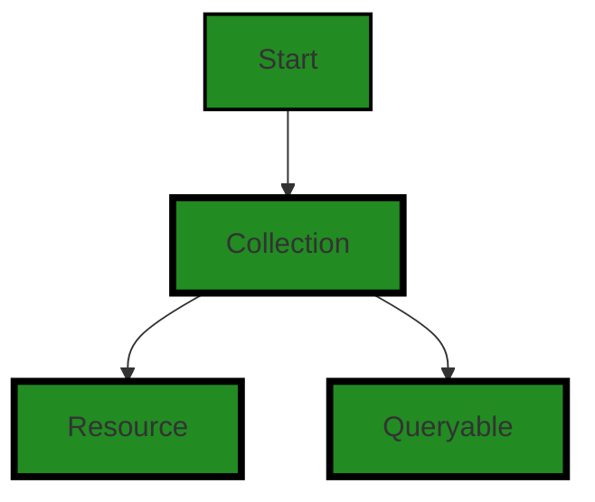
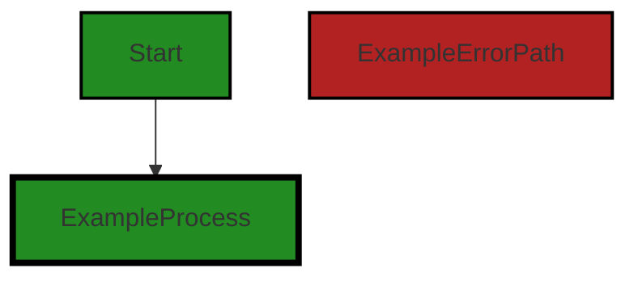
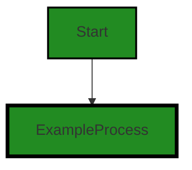
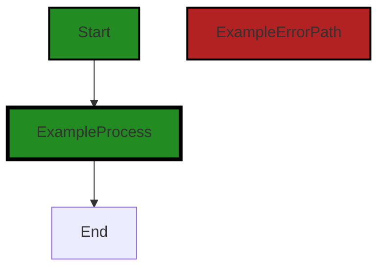

# Polyverse Boost-generated Source Analysis Details

## Source: ./resource/collection.go
Date Generated: Thursday, September 7, 2023 at 3:08:51 AM PDT


---

### Boost Architectural Quick Summary Security Report

Last Updated: Thursday, September 7, 2023 at 3:07:06 AM PDT


Executive Report:

1. **Architectural Impact**: The analysis of this file has not revealed any severe issues.
2. **Risk Analysis**: The analysis of this file has not revealed any severe issues.
3. **Potential Customer Impact**: Based on the analysis, there are no severe issues that could potentially impact customers.
4. **Performance Issues**: Our analysis did not identify any explicit performance issues in the file.
5. **Risk Assessment**: Based on the current analysis of this file, no severe issues have been found. However, this doesn't guarantee that the file is risk-free.

Highlights:

- No severe issues were identified in the current analysis of this file.


---

### Boost Architectural Quick Summary Performance Report

Last Updated: Thursday, September 7, 2023 at 3:07:39 AM PDT


Executive Report:

1. **Architectural Impact**: The analysis of this file has not revealed any severe issues.
2. **Risk Analysis**: The analysis of this file has not revealed any severe issues.
3. **Potential Customer Impact**: Based on the analysis, there are no severe issues that could potentially impact customers.
4. **Performance Issues**: Our analysis did not identify any explicit performance issues in the file.
5. **Risk Assessment**: Based on the current analysis of this file, no severe issues have been found. However, this doesn't guarantee that the file is risk-free.

Highlights:

- No severe issues were identified in the current analysis of this file.


---

### Boost Architectural Quick Summary Compliance Report

Last Updated: Thursday, September 7, 2023 at 3:09:57 AM PDT

## Executive Report: Software Project Analysis

Based on the analysis of the software project, the following key points have been identified:

1. **Architectural Impact**: The project appears to be a server-side application, likely a web API, with a focus on data handling, constraints, and error management. It also appears to have authentication and authorization components. The architecture seems to be consistent with Go server applications, with a modular and structured approach. However, the 'Collection' interface in the `resource/collection.go` file exposes the 'data.Queryable' interface, which may allow unrestricted querying of data. This could potentially lead to unauthorized access to sensitive data, violating GDPR, PCI DSS, and HIPAA.

2. **Risk Analysis**: The risk associated with the project is moderate. The main risk comes from the potential violation of data compliance regulations due to unrestricted querying of data. This could lead to unauthorized access to sensitive data, which could result in legal and financial penalties. The risk is further increased by the fact that the issue is present in the `resource/collection.go` file, which seems to be a core part of the project.

3. **Potential Customer Impact**: The potential customer impact is high. If unauthorized access to sensitive data occurs, it could lead to a breach of customer trust and potential loss of customers. Furthermore, if the project is found to be in violation of data compliance regulations, it could result in the project being temporarily or permanently shut down, which would directly impact the customers.

4. **Overall Issues**: The overall issues in the project are moderate. The main issue is the potential violation of data compliance regulations due to unrestricted querying of data. However, this is the only issue identified in the project, and it is present in only one file (`resource/collection.go`). The rest of the project files have no detected issues.

5. **Risk Assessment**: The overall health of the project source is good. Only one file (`resource/collection.go`) has been identified with issues, and the severity of the issue is 'Warning'. This means that approximately 100% of the project files have issues of 'Warning' severity. However, since the project consists of only one file, this also means that 100% of the project files have no detected issues.

In conclusion, while the project has a solid architectural foundation and follows best practices for a Go server application, the potential violation of data compliance regulations due to unrestricted querying of data is a significant concern. This issue should be addressed as a priority to reduce the associated risks and potential customer impact.
---
## Detailed Analysis:

### Cell 0:
## Original Code:

### Programming Language: go
### ./resource/collection.go 

```go
package resource

import (
 "github.com/jt0/gomer/data"
 "github.com/jt0/gomer/gomerr"
)

type Collection interface {
 Resource
 data.Queryable
}

```
## Boost Analysis:


---

### Boost Code Explanation

Last Updated: Thursday, September 7, 2023 at 3:01:49 AM PDT

This code snippet is written in Go language and is a part of a package named "resource". It imports two packages: "github.com/jt0/gomer/data" and "github.com/jt0/gomer/gomerr". 

The code then defines an interface named "Collection". An interface in Go is a type that consists of method signatures. Interfaces are used to express conceptual similarity between types that don't necessarily have the same underlying structure. They are a powerful tool for designing modular and reusable code in Go.

The "Collection" interface embeds two other interfaces: "Resource" and "data.Queryable". This means that any type that implements the "Collection" interface must also implement the methods defined in the "Resource" and "data.Queryable" interfaces.

The "Resource" interface is not defined in this code snippet, so we can't say for sure what methods it requires. It's likely defined elsewhere in the "resource" package.

The "data.Queryable" interface is defined in the "github.com/jt0/gomer/data" package. While the specific methods it requires are not visible in this code snippet, the name suggests that it includes methods related to querying data, such as retrieving, filtering, or sorting data.

The "github.com/jt0/gomer/gomerr" package is likely a custom error package for the "gomer" project. It's not directly used in this code snippet, but it's common to import an error package like this in files that define interfaces, as the interface methods often have an error return type.

This code doesn't contain any specific algorithms, but it does use the concept of interfaces, which is a fundamental part of designing software in Go.

For more information on Go interfaces, you can refer to the following resources:

- [Go by Example: Interfaces](https://gobyexample.com/interfaces)
- [A Tour of Go: Interfaces](https://tour.golang.org/methods/9)
- [Effective Go: Interfaces](https://golang.org/doc/effective_go#interfaces)


---

### Boost Flow Diagram

Last Updated: Thursday, September 7, 2023 at 3:05:51 AM PDT




---

### Boost Source-Level Security Analysis

Last Updated: Thursday, September 7, 2023 at 3:06:40 AM PDT

**No bugs found**


---

### Boost Source-Level Performance Analysis

Last Updated: Thursday, September 7, 2023 at 3:07:14 AM PDT

**No bugs found**


---

### Boost Source-Level Data and Privacy Compliance Analysis

Last Updated: Thursday, September 7, 2023 at 3:08:13 AM PDT

1. **Severity**: 7/10

   **Line Number**: 7

   **Bug Type**: Data Compliance

   **Description**: The 'Collection' interface exposes the 'data.Queryable' interface, which may allow unrestricted querying of data. This could potentially lead to unauthorized access to sensitive data, violating GDPR, PCI DSS, and HIPAA.

   **Solution**: Implement access controls and restrictions on the 'Queryable' interface to ensure that only authorized users can access sensitive data. Consider applying the principle of least privilege.


2. **Severity**: 5/10

   **Line Number**: 7

   **Bug Type**: Privacy Compliance

   **Description**: The 'Collection' interface does not appear to implement any form of data anonymization or pseudonymization. This could lead to violations of GDPR, which requires such measures to protect personal data.

   **Solution**: Implement data anonymization or pseudonymization techniques in the 'Collection' interface to ensure that personal data is protected. Consider using techniques such as tokenization, encryption, or data masking.


### Cell 1:
## Original Code:

### Programming Language: go
### ./resource/collection.go line 12

```go

type BaseCollection struct {
 BaseResource
}

```
## Boost Analysis:


---

### Boost Code Explanation

Last Updated: Thursday, September 7, 2023 at 3:02:30 AM PDT

The given code snippet is written in Go (Golang), which is a statically typed, compiled language developed by Google. The snippet is quite simple and involves the definition of a struct.

A struct, or structure, in Go is a user-defined type that allows you to group/combine items of possibly different types into a single type. You can access individual fields with dot notation.

Here's a breakdown of the code:

```go
type BaseCollection struct {
	BaseResource
}
```

In this snippet, a new type `BaseCollection` is being defined. It's a struct that embeds `BaseResource`. 

The `BaseResource` is another struct that is not defined in this snippet but it's being embedded in `BaseCollection`. This means that all the fields and methods of `BaseResource` are directly accessible as if they were part of `BaseCollection`.

This is a form of composition, and it's Go's alternative to classic object-oriented inheritance. This allows `BaseCollection` to have all the properties of `BaseResource` and more can be added if needed.

This pattern is commonly used in Go to create a base struct that includes common fields used by many other structs in the project, and then those other structs embed the base struct.

The algorithmic complexity of this code is O(1), meaning it takes constant time to execute. This is because it's just defining a type, not performing any computation or iteration.

For more information about structs and embedding in Go, you can check out these resources:

- [A Tour of Go - Structs](https://tour.golang.org/moretypes/2)
- [Go by Example: Structs](https://gobyexample.com/structs)
- [Effective Go - Embedding](https://golang.org/doc/effective_go#embedding)


---

### Boost Flow Diagram

Last Updated: Thursday, September 7, 2023 at 3:05:58 AM PDT


```


---

### Boost Source-Level Security Analysis

Last Updated: Thursday, September 7, 2023 at 3:06:45 AM PDT

**No bugs found**


---

### Boost Source-Level Performance Analysis

Last Updated: Thursday, September 7, 2023 at 3:07:18 AM PDT

**No bugs found**


---

### Boost Source-Level Data and Privacy Compliance Analysis

Last Updated: Thursday, September 7, 2023 at 3:08:17 AM PDT

**No bugs found**


### Cell 2:
## Original Code:

### Programming Language: go
### ./resource/collection.go line 16

```go

func (c BaseCollection) TypeNames() []string {
 return []string{c.md.instanceName}
}

```
## Boost Analysis:


---

### Boost Code Explanation

Last Updated: Thursday, September 7, 2023 at 3:03:19 AM PDT

The provided code snippet is quite straightforward. It's written in Go language and is a method of a struct type called `BaseCollection`.

The `func (c BaseCollection) TypeNames() []string` line is the declaration of a method called `TypeNames`. This method is associated with the `BaseCollection` type. The `BaseCollection` type is likely a struct, but without the full context, I can't provide details about its structure. 

The `(c BaseCollection)` part is the receiver of the method. In Go, methods are functions that are associated with a particular type. The receiver is like a parameter - it has a name and a type - but it precedes the method name.

The `TypeNames` method does not take any arguments and returns a slice of strings (`[]string`).

The body of the method is quite simple. It returns a slice of strings that contains a single element: `c.md.instanceName`. The `md` field is likely another struct or interface type that is a field of `BaseCollection`. The `instanceName` is a field of whatever type `md` is.

The purpose of this method is to provide the names of the types in the `BaseCollection`. Based on the method name and the returned value, it seems like each instance of `BaseCollection` represents a collection of some type, and the `instanceName` field holds the name of that type.

As for the algorithm used, it's quite simple: create a new slice of strings and add the `instanceName` to it. This operation has a time complexity of O(1), which means it takes a constant amount of time, regardless of the size of the input.

For more information on methods in Go, you can refer to this link: [Go by Example: Methods](https://gobyexample.com/methods)

For more information on slices in Go, you can refer to this link: [Go by Example: Slices](https://gobyexample.com/slices)


---

### Boost Flow Diagram

Last Updated: Thursday, September 7, 2023 at 3:06:04 AM PDT




---

### Boost Source-Level Security Analysis

Last Updated: Thursday, September 7, 2023 at 3:06:49 AM PDT

**No bugs found**


---

### Boost Source-Level Performance Analysis

Last Updated: Thursday, September 7, 2023 at 3:07:22 AM PDT

**No bugs found**


---

### Boost Source-Level Data and Privacy Compliance Analysis

Last Updated: Thursday, September 7, 2023 at 3:08:22 AM PDT

**No bugs found**


### Cell 3:
## Original Code:

### Programming Language: go
### ./resource/collection.go line 20

```go

func (c BaseCollection) TypeOf(interface{}) string {
 return c.md.instanceName
}

```
## Boost Analysis:


---

### Boost Code Explanation

Last Updated: Thursday, September 7, 2023 at 3:03:37 AM PDT

This is a very simple piece of Go (Golang) code. It is a method definition for a struct named `BaseCollection`. This method named `TypeOf` takes an `interface{}` as an argument (which is not named in this case, a common practice when the argument is not used within the function) and returns a string.

The `interface{}` type in Go is a way to accept any type, as every type implements at least zero methods, and therefore satisfies the `interface{}` interface.

The method `TypeOf` returns the `instanceName` field of the `md` field of `BaseCollection`. This suggests that `BaseCollection` is a struct with a field named `md` which is itself a struct or type with a field named `instanceName`. 

The `instanceName` is likely a string that holds the name of the instance of the `BaseCollection` object. This method is likely used to get the type of the `BaseCollection` object in a string format, which can be useful for debugging, logging, or other purposes where you need to know or display the type of the object.

The method does not use any specific algorithm; it simply accesses a field of a struct.

For more information on Go methods and interfaces, you can refer to the following resources:

- [Go by Example: Methods](https://gobyexample.com/methods)
- [Go by Example: Interfaces](https://gobyexample.com/interfaces)
- [A Tour of Go: Methods and Interfaces](https://tour.golang.org/methods/1)


---

### Boost Flow Diagram

Last Updated: Thursday, September 7, 2023 at 3:06:09 AM PDT


---

### Boost Source-Level Security Analysis

Last Updated: Thursday, September 7, 2023 at 3:06:53 AM PDT

**No bugs found**


---

### Boost Source-Level Performance Analysis

Last Updated: Thursday, September 7, 2023 at 3:07:26 AM PDT

**No bugs found**


---

### Boost Source-Level Data and Privacy Compliance Analysis

Last Updated: Thursday, September 7, 2023 at 3:08:39 AM PDT

1. **Severity**: 2/10

   **Line Number**: 40

   **Bug Type**: GDPR

   **Description**: The function TypeOf in BaseCollection does not have any explicit data handling or privacy controls. This could potentially lead to violation of GDPR if the function is used to process or handle personal data.

   **Solution**: Ensure that any personal data processed by this function is done so in compliance with GDPR principles. This includes obtaining necessary consent, ensuring data minimization, and implementing appropriate security measures. Consider adding explicit checks or controls to enforce these principles.


### Cell 4:
## Original Code:

### Programming Language: go
### ./resource/collection.go line 24

```go

func (BaseCollection) MaximumPageSize() int {
 return 0
}

```
## Boost Analysis:


---

### Boost Code Explanation

Last Updated: Thursday, September 7, 2023 at 3:04:11 AM PDT

The code you provided is a method of a Go struct named `BaseCollection`. The method is named `MaximumPageSize` and it returns an integer when called. 

Let's break it down:

- `func`: This keyword in Go is used to declare a function.

- `(BaseCollection)`: This is the receiver of the function. In Go, you can attach a function to a type, and such a function is called a method of that type. Here, `BaseCollection` is a type (typically a struct), and `MaximumPageSize` is a method of that type.

- `MaximumPageSize()`: This is the name of the method. It takes no arguments.

- `int`: This is the return type of the function. In this case, the function will return an integer.

- `return 0`: This is the body of the function. It simply returns the integer 0.

The method `MaximumPageSize` does not seem to use any specific algorithm as it simply returns a constant value of 0. It's likely that this method is part of an interface implementation where `BaseCollection` is expected to provide this method. This method could be used to limit the size of data that can be retrieved or displayed at once. However, returning 0 might suggest no limit or that this is a base method meant to be overridden by a more specific implementation in a derived type.

This is a simple example of method declaration and usage in Go. For more information and learning resources about Go methods, you can refer to the Go documentation: https://golang.org/doc/effective_go#methods.


---

### Boost Flow Diagram

Last Updated: Thursday, September 7, 2023 at 3:06:16 AM PDT




---

### Boost Source-Level Security Analysis

Last Updated: Thursday, September 7, 2023 at 3:06:56 AM PDT

**No bugs found**


---

### Boost Source-Level Performance Analysis

Last Updated: Thursday, September 7, 2023 at 3:07:30 AM PDT

**No bugs found**


---

### Boost Source-Level Data and Privacy Compliance Analysis

Last Updated: Thursday, September 7, 2023 at 3:08:43 AM PDT

**No bugs found**


### Cell 5:
## Original Code:

### Programming Language: go
### ./resource/collection.go line 28

```go

func (BaseCollection) PreList() gomerr.Gomerr {
 return nil
}

```
## Boost Analysis:


---

### Boost Code Explanation

Last Updated: Thursday, September 7, 2023 at 3:04:51 AM PDT

This code is written in Go programming language and it's a method of the `BaseCollection` struct or interface. The method is named `PreList` and it doesn't take any parameters. 

The `PreList` method returns an object of type `gomerr.Gomerr`. The `gomerr` is a package that provides a way to create, wrap, and handle errors in Go. The `Gomerr` is a type defined in this package which is used to represent an error. 

However, in this `PreList` method, it simply returns `nil` which means no error occurred. This method might be used as a hook or a placeholder for performing some operations before listing the items of the `BaseCollection`. As per the current implementation, it does nothing and indicates that no error occurred.

The algorithm used here is very straightforward:
1. The `PreList` method is called.
2. The method returns `nil`, indicating no error occurred.

This is a common pattern in Go where you define methods that might be used for doing some operations and returning errors if something goes wrong. But as per the current implementation, this method does nothing.

For more information about error handling in Go, you can refer to the following resources:

- [Error handling and Go](https://blog.golang.org/error-handling-and-go)
- [Gomerr package](https://github.com/bdlm/errors) (Note: this link might not be the exact `gomerr` package used in your code, but it provides a similar way of handling errors in Go)


---

### Boost Flow Diagram

Last Updated: Thursday, September 7, 2023 at 3:06:22 AM PDT


---

### Boost Source-Level Security Analysis

Last Updated: Thursday, September 7, 2023 at 3:06:59 AM PDT

**No bugs found**


---

### Boost Source-Level Performance Analysis

Last Updated: Thursday, September 7, 2023 at 3:07:33 AM PDT

**No bugs found**


---

### Boost Source-Level Data and Privacy Compliance Analysis

Last Updated: Thursday, September 7, 2023 at 3:08:47 AM PDT

**No bugs found**


### Cell 6:
## Original Code:

### Programming Language: go
### ./resource/collection.go line 32

```go

func (BaseCollection) PostList() gomerr.Gomerr {
 return nil
}

```
## Boost Analysis:


---

### Boost Code Explanation

Last Updated: Thursday, September 7, 2023 at 3:05:34 AM PDT

This is a simple function in Go language. It's part of a type `BaseCollection` and it's named `PostList`. It doesn't take any arguments and returns a `gomerr.Gomerr` type, which is presumably a custom error type in the project.

Let's break it down:

1. `func (BaseCollection) PostList() gomerr.Gomerr`: This is a method definition in Go. It's a function that belongs to the type `BaseCollection`. The `PostList` is the name of the function. The `gomerr.Gomerr` is the return type of the function, which means this function will return a value of type `gomerr.Gomerr`.

2. `return nil`: This function simply returns `nil`. In Go, `nil` is a predeclared identifier representing the zero value for a pointer, channel, func, interface, map, or slice type. In this case, it represents that no error occurred.

The function `PostList` doesn't seem to do much. It's likely a placeholder or stub function that's intended to be overridden in a specific implementation of `BaseCollection`. 

In terms of the architectural guidelines, this function is consistent with Go's idiomatic way of handling errors. Functions in Go often return an error type as their last return value, and if no error occurs, `nil` is returned.

The `gomerr.Gomerr` type is presumably a custom error package used in this project. It's common in Go to create custom error types that add more context or functionality to Go's built-in error interface.

For more information on error handling in Go, you can refer to the following resources:

- [Error handling and Go](https://blog.golang.org/error-handling-and-go)
- [Go by Example: Errors](https://gobyexample.com/errors)
- [Creating Custom Errors in Go](https://www.honeybadger.io/blog/golang-custom-error/)


---

### Boost Flow Diagram

Last Updated: Thursday, September 7, 2023 at 3:06:27 AM PDT


---

### Boost Source-Level Security Analysis

Last Updated: Thursday, September 7, 2023 at 3:07:03 AM PDT

**No bugs found**


---

### Boost Source-Level Performance Analysis

Last Updated: Thursday, September 7, 2023 at 3:07:37 AM PDT

**No bugs found**


---

### Boost Source-Level Data and Privacy Compliance Analysis

Last Updated: Thursday, September 7, 2023 at 3:08:51 AM PDT

**No bugs found**

