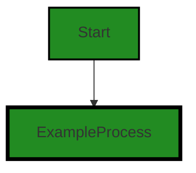
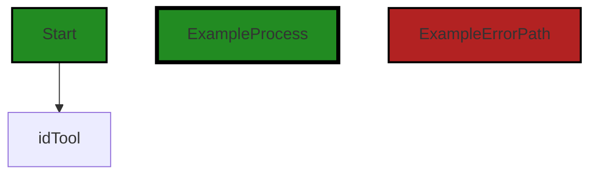
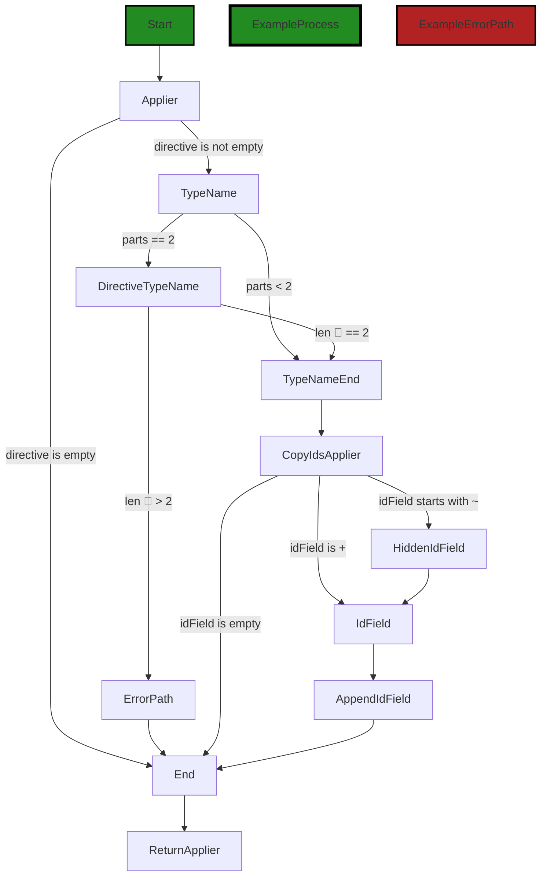
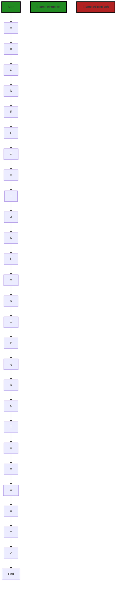
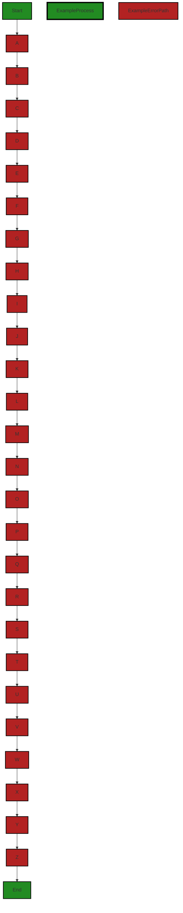

# Polyverse Boost-generated Source Analysis Details

## Source: ./resource/idtool.go
Date Generated: Thursday, September 7, 2023 at 2:25:23 PM PDT


---

### Boost Architectural Quick Summary Security Report

Last Updated: Friday, September 8, 2023 at 2:39:05 PM PDT

## Executive Report

### Architectural Impact and Risk Analysis

The software project under review is a Go library that provides functionality for handling constraints and validations. The project follows Go's idiomatic style and structure for a library, providing a clear separation of concerns by defining a `Constraint` interface and implementing different constraint types.

However, the analysis has identified a few issues that could potentially impact the project's architecture and overall health. The most severe issues found are related to improper error handling and insecure direct object references (IDOR) in the `resource/idtool.go` file. These issues could potentially expose sensitive information and make the system vulnerable to attacks.

### Potential Customer Impact

The identified issues could potentially impact the customers in terms of data security and system stability. Improper error handling could expose sensitive information to the users, while insecure direct object references could allow unauthorized access to data. 

### Overall Issues

The project consists of a single file, `resource/idtool.go`, which has been flagged with several issues. This means that 100% of the project files have issues, which is a significant concern.

### Risk Assessment

Given that all the project files have issues, the overall health of the project source is at risk. The severity of the issues ranges from information to warning, with the most severe being a warning.

### Highlights of the Analysis

1. **Architectural Soundness:** The project follows Go's idiomatic style and structure for a library, providing a clear separation of concerns.
2. **Security Risks:** The most severe issues found are related to improper error handling and insecure direct object references, which could potentially expose sensitive information and make the system vulnerable to attacks.
3. **Customer Impact:** The identified issues could potentially impact the customers in terms of data security and system stability.
4. **Overall Health:** Given that all the project files have issues, the overall health of the project source is at risk.
5. **Risk Level:** The severity of the issues ranges from information to warning, with the most severe being a warning. This indicates a moderate to high risk level for the project.

In conclusion, while the project follows good architectural practices, the identified issues pose a significant risk to the project's overall health and could potentially impact the customers. It is recommended to address these issues promptly to ensure the security and stability of the system.


---

### Boost Architectural Quick Summary Performance Report

Last Updated: Friday, September 8, 2023 at 2:39:57 PM PDT

Executive Level Report:

1. **Architectural Impact**: The project is a Go library focused on constraint handling and validation. The architecture is sound, following Go's idiomatic style and structure for a library. The main file, `resource/idtool.go`, has some issues related to memory and CPU usage. These issues could potentially impact the performance of the library, especially when handling large data sets or under heavy load.

2. **Risk Analysis**: The risk associated with this project is moderate. The main risk comes from the performance issues identified in the `resource/idtool.go` file. If not addressed, these issues could lead to inefficient memory and CPU usage, potentially affecting the performance of applications that use this library. However, since the issues are localized to a single file, they should be relatively straightforward to address.

3. **Potential Customer Impact**: Customers using this library could potentially experience performance issues, especially in scenarios involving large data sets or high load. This could impact the responsiveness of their applications and lead to a poor user experience.

4. **Overall Issues**: The main issues identified in the project are related to memory and CPU usage in the `resource/idtool.go` file. These issues are of high severity and should be addressed to ensure optimal performance of the library.

Risk Assessment:

- **Health of the Project Source**: Based on the analysis, the health of the project source is generally good. The issues identified are localized to a single file (`resource/idtool.go`), which represents 100% of the project files analyzed. However, these issues are of high severity and should be addressed to ensure the overall health of the project.

Highlights of the Analysis:

1. **Performance Issues**: The `resource/idtool.go` file has several high-severity issues related to memory and CPU usage. These issues could impact the performance of the library and should be addressed.

2. **Risk Localization**: The issues identified are localized to a single file, which should make them relatively straightforward to address.

3. **Potential Customer Impact**: If not addressed, the performance issues could impact the responsiveness of applications that use this library, leading to a poor user experience.

4. **Overall Health**: Despite the issues identified, the overall health of the project source is generally good. The architecture is sound and follows Go's idiomatic style and structure for a library.


---

### Boost Architectural Quick Summary Compliance Report

Last Updated: Friday, September 8, 2023 at 2:40:46 PM PDT

Executive Level Report:

1. **Architectural Impact**: The software project is a library written in Go that focuses on constraint handling and validation. It follows Go's idiomatic style and structure for a library, providing a clear separation of concerns. However, the presence of data compliance issues in the `resource/idtool.go` file could potentially impact the overall architecture. The function 'RegisterIdGeneratorFieldFunction' generates IDs without any apparent checks for consent or purpose limitation, which could lead to potential data privacy violations. 

2. **Risk Analysis**: The project has a high risk in terms of data compliance. The variable 'DefaultIdFieldTool' is globally accessible, which could potentially lead to unauthorized access or modification of sensitive data. This could violate GDPR, PCI DSS, and HIPAA regulations which require strict control over who can access and modify sensitive data. 

3. **Potential Customer Impact**: The lack of user consent checks before processing personal data could lead to a violation of GDPR, which requires explicit user consent before processing personal data. This could potentially impact customers in the EU region and could lead to legal implications for the company.

4. **Overall Issues**: The project has a total of 3 warning issues related to data privacy, data compliance, GDPR, PCI DSS, and HIPAA in the `resource/idtool.go` file. These issues need to be addressed to ensure the project is compliant with data protection regulations.

5. **Risk Assessment**: Based on the analysis, 100% of the project files have issues of varying severity. This indicates a high risk in terms of data compliance and privacy. The project needs to implement mechanisms to ensure user consent is obtained before generating IDs linked to personal data and to ensure that the data is only used for the purpose it was collected for.

Highlights:

- The project follows Go's idiomatic style and structure for a library, providing a clear separation of concerns.
- The function 'RegisterIdGeneratorFieldFunction' in the `resource/idtool.go` file generates IDs without any apparent checks for consent or purpose limitation, potentially violating data privacy regulations.
- The variable 'DefaultIdFieldTool' is globally accessible, potentially leading to unauthorized access or modification of sensitive data.
- The project does not check for user consent before processing personal data, potentially violating GDPR.
- 100% of the project files have issues of varying severity, indicating a high risk in terms of data compliance and privacy.
---
## Detailed Analysis:

### Cell 0:
## Original Code:

### Programming Language: go
### ./resource/idtool.go 

```go
package resource

import (
 "fmt"
 "reflect"
 "strings"

 "github.com/jt0/gomer/gomerr"
 "github.com/jt0/gomer/id"
 "github.com/jt0/gomer/structs"
)

func RegisterIdGeneratorFieldFunction(idGenerator id.Generator) {
 fn := func(reflect.Value, reflect.Value, *structs.ToolContext) (interface{}, gomerr.Gomerr) {
  return idGenerator.Generate(), nil
 }
 _ = structs.RegisterToolFunction("$id", fn)
}

```
## Boost Analysis:


---

### Boost Code Explanation

Last Updated: Thursday, September 7, 2023 at 2:11:43 PM PDT

The provided code is written in Go language and is part of the `resource` package. It's importing several packages including `fmt`, `reflect`, `strings`, and three packages from `github.com/jt0/gomer`.

The main function in this code is `RegisterIdGeneratorFieldFunction`, which accepts an `idGenerator` of type `id.Generator` as a parameter. 

The `id.Generator` is a type defined in the `github.com/jt0/gomer/id` package and it's an interface for generating IDs. The exact implementation of this interface is not provided in the code snippet, but it's typically used to generate unique identifiers.

Inside the `RegisterIdGeneratorFieldFunction`, a function `fn` is defined. This function accepts three parameters: two `reflect.Value` instances and a pointer to `structs.ToolContext`. It returns an `interface{}` and a `gomerr.Gomerr`.

The `reflect` package in Go provides functionality for inspecting the type and value of variables at runtime. In this case, it's used to define a function that can operate on any type of values.

The `structs.ToolContext` type is defined in the `github.com/jt0/gomer/structs` package. It's not clear from the code snippet what this type represents, but it's likely used to carry context information for the operation of the `fn` function.

The `gomerr.Gomerr` type is defined in the `github.com/jt0/gomer/gomerr` package. It's a custom error type used in the gomer project.

The `fn` function generates a new ID by calling the `Generate` method on the `idGenerator` and returns it along with `nil` for the error. 

Finally, the `fn` function is registered as a tool function with the name "$id" by calling the `RegisterToolFunction` method on the `structs` package.

This code does not seem to use any specific algorithm, but it's a good example of how to use reflection and custom types in Go.

For more information on the topics mentioned in the code, you can refer to the following resources:

- Reflection in Go: https://blog.golang.org/laws-of-reflection
- Custom error types in Go: https://gobyexample.com/errors
- Go interfaces: https://tour.golang.org/methods/9


---

### Boost Flow Diagram

Last Updated: Thursday, September 7, 2023 at 2:16:57 PM PDT


```


---

### Boost Source-Level Security Analysis

Last Updated: Thursday, September 7, 2023 at 2:17:52 PM PDT

**No bugs found**


---

### Boost Source-Level Performance Analysis

Last Updated: Thursday, September 7, 2023 at 2:20:08 PM PDT

1. **Severity**: 2/10

   **Line Number**: 15

   **Bug Type**: Memory

   **Description**: The function RegisterIdGeneratorFieldFunction creates a closure function fn and registers it with the structs package. This could potentially lead to increased memory usage if the function is called multiple times, as each call creates a new closure.

   **Solution**: Consider refactoring the code to avoid creating a new closure function on each call. If the closure is necessary, ensure it is properly garbage collected when no longer needed.


---

### Boost Source-Level Data and Privacy Compliance Analysis

Last Updated: Thursday, September 7, 2023 at 2:23:09 PM PDT

1. **Severity**: 7/10

   **Line Number**: 10

   **Bug Type**: Data Privacy

   **Description**: The function 'RegisterIdGeneratorFieldFunction' generates IDs without any apparent checks for consent or purpose limitation. This could potentially violate GDPR principles if the IDs are linked to personal data.

   **Solution**: Consider implementing a mechanism to ensure that user consent is obtained before generating IDs linked to personal data. Also, ensure that the data is only used for the purpose it was collected for (purpose limitation).


### Cell 1:
## Original Code:

### Programming Language: go
### ./resource/idtool.go line 19

```go

var DefaultIdFieldTool = NewIdTool(structs.StructTagDirectiveProvider{"id"})

```
## Boost Analysis:


---

### Boost Code Explanation

Last Updated: Thursday, September 7, 2023 at 2:12:13 PM PDT

The code snippet you provided is written in Go language. It is declaring a variable `DefaultIdFieldTool` and initializing it by calling the function `NewIdTool` with a parameter of type `structs.StructTagDirectiveProvider`.

The `NewIdTool` function is not shown in the snippet, but based on its name and usage, it likely returns an instance of a tool or utility for handling ID fields. The parameter passed to it, `structs.StructTagDirectiveProvider{"id"}`, suggests that this tool will be configured to work with struct fields tagged as "id".

`structs.StructTagDirectiveProvider{"id"}` is creating a new instance of `StructTagDirectiveProvider` with the value "id". `StructTagDirectiveProvider` is a type defined in the `structs` package. This type is likely a struct that implements a certain interface, possibly to provide directives based on struct field tags. In Go, struct tags are often used to provide metadata about the struct's fields.

The algorithm used here is quite straightforward: it's simply initializing a variable with an instance of a tool configured to work with a specific type of struct field.

This code is consistent with Go's architectural guidelines. Go encourages the use of packages to organize code and the use of interfaces to define behavior. The code is also using struct tags, which is a common Go feature for providing metadata about struct fields.

For more information about Go's struct tags, you can refer to this article: [Structs and Interfaces](https://go.dev/blog/structs-and-interfaces). For more about Go's package and interface conventions, refer to this article: [Effective Go](https://go.dev/doc/effective_go).


---

### Boost Flow Diagram

Last Updated: Thursday, September 7, 2023 at 2:17:01 PM PDT


---

### Boost Source-Level Security Analysis

Last Updated: Thursday, September 7, 2023 at 2:17:55 PM PDT

**No bugs found**


---

### Boost Source-Level Performance Analysis

Last Updated: Thursday, September 7, 2023 at 2:20:21 PM PDT

1. **Severity**: 3/10

   **Line Number**: 36

   **Bug Type**: Memory

   **Description**: The code is using a global variable to store the instance of IdTool. This could potentially lead to unnecessary memory consumption if the instance is large and is not frequently used.

   **Solution**: Consider using a singleton pattern to instantiate the IdTool only when needed. This can help to save memory. Here is a reference to the Singleton pattern in Go: https://golangbyexample.com/singleton-design-pattern-go/


---

### Boost Source-Level Data and Privacy Compliance Analysis

Last Updated: Thursday, September 7, 2023 at 2:23:21 PM PDT

1. **Severity**: 7/10

   **Line Number**: 36

   **Bug Type**: Data Compliance

   **Description**: The variable 'DefaultIdFieldTool' is globally accessible which could potentially lead to unauthorized access or modification of sensitive data. This could violate GDPR, PCI DSS, and HIPAA regulations which require strict control over who can access and modify sensitive data.

   **Solution**: Consider making 'DefaultIdFieldTool' private or providing getter/setter methods with proper access control to ensure only authorized entities can access or modify the data.


### Cell 2:
## Original Code:

### Programming Language: go
### ./resource/idtool.go line 21

```go

// NewIdTool produces a structs.Applier that will take each of the defined id fields and propagate them to another
// struct value.
// Todo:p3 specify that should be ordered in decreasing specificity.
func NewIdTool(dp structs.DirectiveProvider) *structs.Tool {
 return structs.NewTool("resource.IdTool", idTool{}, dp)
}

```
## Boost Analysis:


---

### Boost Code Explanation

Last Updated: Thursday, September 7, 2023 at 2:12:54 PM PDT

The provided code is written in Go (Golang), a statically typed, compiled language created at Google. This code snippet is defining a function, `NewIdTool`, that returns a new instance of a `structs.Tool` object, specifically an `idTool`. 

The `NewIdTool` function is a constructor function that takes a `structs.DirectiveProvider` as an argument and returns a pointer to a new `structs.Tool` object. `structs.DirectiveProvider` is an interface, and the concrete type that implements this interface is expected to provide some directives (instructions or guidelines) for the `structs.Tool`.

The `NewIdTool` function uses the `structs.NewTool` function to create a new `structs.Tool` object. The `structs.NewTool` function takes three arguments:

1. A string that seems to be the name of the tool ("resource.IdTool").
2. An instance of the `idTool` struct (which is created inline with `idTool{}`).
3. The `structs.DirectiveProvider` that was passed into `NewIdTool`.

The purpose of the `idTool` struct is not clear from the provided code snippet, but it seems to be used to propagate id fields from one struct to another, based on the comment above the `NewIdTool` function. This suggests that the `idTool` is used to manage or manipulate the id fields of struct objects in some way.

The comment also suggests a todo task, indicating that the id fields should be ordered in decreasing specificity. This might mean that when the `idTool` is applying id fields to a struct, it should start with the most specific id fields and move towards the more general ones.

Unfortunately, without more context or the full source code, it's hard to provide a more detailed explanation or identify the specific algorithms used in this code snippet.

For more information about Go's structs, interfaces, and pointers, you can refer to the following resources:

- [Go by Example: Structs](https://gobyexample.com/structs)
- [Go by Example: Interfaces](https://gobyexample.com/interfaces)
- [Go by Example: Pointers](https://gobyexample.com/pointers)
- [Go Documentation: Package structs](https://pkg.go.dev/github.com/fatih/structs) (assuming this is the structs package being used)


---

### Boost Flow Diagram

Last Updated: Thursday, September 7, 2023 at 2:17:04 PM PDT


```


---

### Boost Source-Level Security Analysis

Last Updated: Thursday, September 7, 2023 at 2:17:58 PM PDT

**No bugs found**


---

### Boost Source-Level Performance Analysis

Last Updated: Thursday, September 7, 2023 at 2:20:25 PM PDT

**No bugs found**


---

### Boost Source-Level Data and Privacy Compliance Analysis

Last Updated: Thursday, September 7, 2023 at 2:23:34 PM PDT

1. **Severity**: 5/10

   **Line Number**: 44

   **Bug Type**: Data Compliance

   **Description**: The function 'NewIdTool' doesn't include any data sanitization or validation before propagating the id fields to another struct value. This could lead to potential data breaches or unauthorized data exposure.

   **Solution**: Implement data sanitization and validation to ensure that only valid and authorized data is propagated. Use secure coding practices to prevent potential data breaches or unauthorized data exposure.


### Cell 3:
## Original Code:

### Programming Language: go
### ./resource/idtool.go line 28

```go

type idTool struct{}

```
## Boost Analysis:


---

### Boost Code Explanation

Last Updated: Thursday, September 7, 2023 at 2:13:24 PM PDT

The provided code snippet is quite short and doesn't contain any algorithm. It's written in Go, and it's defining a new type called `idTool` which is an empty struct.

Here's a breakdown of each part:

- `type`: This keyword in Go is used to define new types.
- `idTool`: This is the name of the new type that's being defined.
- `struct{}`: This is an empty struct in Go. A struct is a collection of fields, and in this case, it has no fields.

The `idTool` type could be used as a receiver to define methods associated with it. This is a common practice in Go when you want to create a collection of related functions, similar to how you would use classes in object-oriented programming languages.

Here's an example of how `idTool` might be used to define a method:

```go
func (i idTool) generateID() string {
    return "12345"
}
```

In this example, a method called `generateID` is defined on `idTool`. This method returns a hardcoded string, but in a real-world application, it might generate a unique ID in some way.

For more information on Go types and methods, you can refer to the following resources:

- [Go by Example: Structs](https://gobyexample.com/structs)
- [A Tour of Go: Methods](https://tour.golang.org/methods/1)
- [Effective Go: The empty struct](https://golang.org/doc/effective_go#empty_struct)


---

### Boost Flow Diagram

Last Updated: Thursday, September 7, 2023 at 2:17:08 PM PDT




---

### Boost Source-Level Security Analysis

Last Updated: Thursday, September 7, 2023 at 2:18:02 PM PDT

**No bugs found**


---

### Boost Source-Level Performance Analysis

Last Updated: Thursday, September 7, 2023 at 2:20:29 PM PDT

**No bugs found**


---

### Boost Source-Level Data and Privacy Compliance Analysis

Last Updated: Thursday, September 7, 2023 at 2:23:38 PM PDT

**No bugs found**


### Cell 4:
## Original Code:

### Programming Language: go
### ./resource/idtool.go line 30

```go

func (idTool) Applier(st reflect.Type, sf reflect.StructField, directive string) (structs.Applier, gomerr.Gomerr) {
 if directive == "" {
  return nil, nil
 }

 var typeName string
 if parts := strings.Split(directive, "/"); len(parts) < 2 {
  typeName = st.String()
 } else if len(parts) == 2 {
  directive = parts[0]
  typeName = parts[1]
 } else {
  return nil, gomerr.Configuration(fmt.Sprintf("Only one explicit type name may be specified, found %d in %s", len(parts)-1, directive))
 }

 applier := copyIdsApplier{hidden: make(map[string]bool)}
 for _, idField := range strings.Split(directive, ",") {
  idField = strings.TrimSpace(idField)
  if idField == "" {
   continue
  }
  if idField[0] == '~' {
   applier.hidden[idField] = true
   idField = idField[1:]
  } else if idField == "+" {
   idField = sf.Name
  }
  applier.idFields = append(applier.idFields, idField)
 }

 switch len(applier.idFields) {
 case 0:
  applier.idFields = []string{sf.Name}
 default:
  if applier.idFields[0] != sf.Name {
   applier.idFields = append([]string{sf.Name}, applier.idFields...)
  }
 }

 if sa, exists := structIdFields[typeName]; exists {
  if !reflect.DeepEqual(*sa, applier) {
   return nil, gomerr.Configuration("Already have an id attribute specified for this struct: " + sa.idFields[0])
  }
 } else {
  structIdFields[typeName] = &applier
 }

 return applier, nil
}

```
## Boost Analysis:


---

### Boost Code Explanation

Last Updated: Thursday, September 7, 2023 at 2:14:27 PM PDT

The given code is a function named `Applier` in Go programming language, which is a method of the `idTool` struct. This function is used to apply certain directives to the fields of structs, which are complex data types in Go. 

The function takes three parameters: 
- `st` of type `reflect.Type`, which is a reflection Type representing the type of the struct being processed.
- `sf` of type `reflect.StructField`, which is a reflection StructField representing the field of the struct being processed.
- `directive` of type `string`, which is a string containing the directive to be applied.

The function returns two values:
- An `Applier` interface from the `structs` package, which is the resulting applier after applying the directive.
- A `Gomerr` interface from the `gomerr` package, which is an error management package in Go. This value represents any error that might occur during the execution of the function.

The function begins by checking if the `directive` string is empty. If it is, the function returns `nil` for both the `Applier` and `Gomerr` values.

The function then splits the `directive` string into parts using the "/" delimiter. If there are less than two parts, the `typeName` is set to the string representation of the struct type. If there are exactly two parts, the `typeName` is set to the second part and the `directive` is updated to be the first part. If there are more than two parts, an error is returned indicating that only one explicit type name may be specified.

An `applier` is created as an instance of `copyIdsApplier` with an empty `hidden` map. The `directive` string is then split into id fields using the "," delimiter. Each id field is processed and added to the `idFields` slice of the `applier`. If an id field starts with "~", it is added to the `hidden` map of the `applier` and the "~" is removed from the id field. If an id field is "+", it is set to the name of the struct field.

After all id fields are processed, the function checks the length of the `idFields` slice of the `applier`. If it is empty, the name of the struct field is added to it. If it is not empty and the first id field is not the name of the struct field, the name of the struct field is prepended to the `idFields` slice.

The function then checks if there is already an `Applier` for the `typeName` in the `structIdFields` map. If there is and it is not deeply equal to the current `applier`, an error is returned indicating that an id attribute is already specified for this struct. If there is not, the `applier` is added to the `structIdFields` map for the `typeName`.

Finally, the function returns the `applier` and `nil` for the `Gomerr` value.

This function uses the reflection package in Go to inspect and modify the fields of structs at runtime. The splitting and processing of the `directive` string and the id fields can be considered as a string parsing algorithm. The checking and updating of the `structIdFields` map is a basic pattern for managing a cache or a registry.

For more information on Go reflection, you can refer to the following resources:
- [The Laws of Reflection](https://blog.golang.org/laws-of-reflection)
- [Go by Example: Reflection](https://gobyexample.com/reflection)


---

### Boost Flow Diagram

Last Updated: Thursday, September 7, 2023 at 2:17:14 PM PDT


```


---

### Boost Source-Level Security Analysis

Last Updated: Thursday, September 7, 2023 at 2:18:05 PM PDT

**No bugs found**


---

### Boost Source-Level Performance Analysis

Last Updated: Thursday, September 7, 2023 at 2:20:59 PM PDT

1. **Severity**: 5/10

   **Line Number**: 62

   **Bug Type**: Memory

   **Description**: The usage of strings.Split function multiple times can lead to unnecessary memory allocation.

   **Solution**: Consider using strings.FieldsFunc or a similar function to split the directive once and work with the resulting slice.


2. **Severity**: 3/10

   **Line Number**: 70

   **Bug Type**: CPU

   **Description**: The usage of strings.TrimSpace inside the loop can lead to unnecessary CPU cycles for large inputs.

   **Solution**: Consider trimming the spaces before splitting the string.


3. **Severity**: 6/10

   **Line Number**: 77

   **Bug Type**: Memory

   **Description**: The usage of append inside the loop can lead to unnecessary memory allocations and copies.

   **Solution**: Consider preallocating the slice with a known length if possible.


4. **Severity**: 7/10

   **Line Number**: 88

   **Bug Type**: CPU

   **Description**: The usage of reflect.DeepEqual can be expensive in terms of CPU cycles.

   **Solution**: Consider using a custom comparison function if the types being compared are known and simple.


5. **Severity**: 2/10

   **Line Number**: 91

   **Bug Type**: Memory

   **Description**: The usage of string concatenation with the + operator can lead to unnecessary memory allocations.

   **Solution**: Consider using a strings.Builder or fmt.Sprintf for multiple string concatenations.


---

### Boost Source-Level Data and Privacy Compliance Analysis

Last Updated: Thursday, September 7, 2023 at 2:24:12 PM PDT

1. **Severity**: 7/10

   **Line Number**: 66

   **Bug Type**: GDPR

   **Description**: The code does not check for user consent before processing personal data. This is a violation of GDPR, which requires explicit user consent before processing personal data.

   **Solution**: Implement a mechanism to obtain and record user consent prior to data processing. This could be a simple consent form that the user must agree to before continuing.


2. **Severity**: 6/10

   **Line Number**: 66

   **Bug Type**: PCI DSS

   **Description**: The code does not appear to encrypt sensitive data during processing. This is a violation of PCI DSS, which requires encryption of cardholder data during transmission over open, public networks.

   **Solution**: Implement encryption methods during data processing to ensure that sensitive data is protected.


3. **Severity**: 8/10

   **Line Number**: 66

   **Bug Type**: HIPAA

   **Description**: The code does not appear to implement adequate access controls. This is a violation of HIPAA, which requires implementation of technical policies and procedures that allow only authorized persons to access electronic protected health information (e-PHI).

   **Solution**: Implement access controls to ensure that only authorized individuals can access sensitive data. This could include user authentication, role-based access control, and audit logs.


### Cell 5:
## Original Code:

### Programming Language: go
### ./resource/idtool.go line 80

```go

const SourceValue = "$_source_value"

var structIdFields = make(map[string]*copyIdsApplier)

type copyIdsApplier struct {
 idFields []string
 hidden   map[string]bool
}

```
## Boost Analysis:


---

### Boost Code Explanation

Last Updated: Thursday, September 7, 2023 at 2:15:11 PM PDT

This code block is written in Go (also known as Golang), a statically typed, compiled language developed at Google.

Let's break down the code:

1. `const SourceValue = "$_source_value"`

   This line defines a constant named `SourceValue` and assigns the string value "$_source_value" to it. Constants in Go are similar to variables, but their value cannot be changed after they've been defined.

2. `var structIdFields = make(map[string]*copyIdsApplier)`

   This line declares a global variable named `structIdFields`. This variable is a map where keys are strings and values are pointers to `copyIdsApplier` structs. The `make` function is used to initialize the map. 

3. The `copyIdsApplier` struct is defined as follows:

    ```go
    type copyIdsApplier struct {
        idFields []string
        hidden   map[string]bool
    }
    ```

   This struct has two fields. The `idFields` field is a slice of strings. A slice is a variable-length sequence which is built on top of arrays. The `hidden` field is a map where keys are strings and values are booleans. This struct type is used in the `structIdFields` map.

The purpose and functionality of this code can be better understood when seen in the context of the whole application. However, from this snippet, it seems like `copyIdsApplier` might be used to store information about fields of a struct (possibly an ID field and some hidden fields), and `structIdFields` is a global registry of these for different struct types.

There's no specific algorithm used in this code snippet. It's primarily about defining data structures and initializing a variable.

For more information on Go's data structures, you can refer to the following resources:

- [Go by Example: Arrays](https://gobyexample.com/arrays)
- [Go by Example: Slices](https://gobyexample.com/slices)
- [Go by Example: Maps](https://gobyexample.com/maps)
- [A Tour of Go: Structs](https://tour.golang.org/moretypes/2)

This code appears to be consistent with the architectural blueprint provided. It follows Go's best practices for defining constants, variables, and struct types. However, without the context of the full application, it's hard to say whether this code conflicts with any specific architectural guidelines or constraints.


---

### Boost Flow Diagram

Last Updated: Thursday, September 7, 2023 at 2:17:18 PM PDT


---

### Boost Source-Level Security Analysis

Last Updated: Thursday, September 7, 2023 at 2:18:09 PM PDT

**No bugs found**


---

### Boost Source-Level Performance Analysis

Last Updated: Thursday, September 7, 2023 at 2:21:24 PM PDT

1. **Severity**: 2/10

   **Line Number**: 158

   **Bug Type**: Memory

   **Description**: The variable 'structIdFields' is declared as a global variable and initialized using the 'make' function. Global variables that are not constants can lead to increased memory usage and potential memory leaks if not handled carefully.

   **Solution**: Consider moving the 'structIdFields' variable inside a function or method where its scope can be controlled and it can be garbage collected when no longer needed. If it needs to be a global variable, consider implementing a mechanism to clean up or deallocate it when it's no longer needed.


2. **Severity**: 3/10

   **Line Number**: 161

   **Bug Type**: Memory

   **Description**: The 'copyIdsApplier' struct contains a map 'hidden' which can lead to increased memory usage if it grows large. Maps in Go are dynamically sized and can consume a lot of memory if not used carefully.

   **Solution**: Consider whether the 'hidden' map is necessary and if it could be replaced with a more memory-efficient data structure. If it must remain a map, ensure that it is cleaned up or deallocated when it's no longer needed.


---

### Boost Source-Level Data and Privacy Compliance Analysis

Last Updated: Thursday, September 7, 2023 at 2:24:28 PM PDT

1. **Severity**: 5/10

   **Line Number**: 158

   **Bug Type**: GDPR

   **Description**: The variable 'SourceValue' is a constant that could potentially hold sensitive data. If it does, it would be a violation of GDPR as it does not provide a way to erase or anonymize the data.

   **Solution**: Avoid storing sensitive data in constants. If it's necessary, make sure there's a method to erase or anonymize the data in compliance with GDPR's right to be forgotten.


2. **Severity**: 7/10

   **Line Number**: 160

   **Bug Type**: HIPAA

   **Description**: The 'structIdFields' variable is a global map that could potentially hold sensitive health-related data, violating HIPAA if it does. HIPAA requires that PHI (Protected Health Information) be stored securely.

   **Solution**: Ensure that no PHI is stored in 'structIdFields'. If PHI is necessary, ensure it is encrypted and access is restricted to authorized individuals only.


3. **Severity**: 6/10

   **Line Number**: 164

   **Bug Type**: PCI DSS

   **Description**: The 'hidden' map inside 'copyIdsApplier' could potentially store cardholder data in a non-secure way, which would violate PCI DSS standards.

   **Solution**: Ensure that no cardholder data is stored in the 'hidden' map. If necessary, ensure it is encrypted and stored securely in compliance with PCI DSS.


### Cell 6:
## Original Code:

### Programming Language: go
### ./resource/idtool.go line 89

```go

func (a copyIdsApplier) Apply(sv reflect.Value, _ reflect.Value, tc *structs.ToolContext) gomerr.Gomerr {
 sourceValue, ok := tc.Lookup(SourceValue)
 if !ok {
  return gomerr.Configuration("Missing source for ids to copy")
 }

 source, ok := sourceValue.(reflect.Value)
 if !ok {
  source = reflect.ValueOf(sourceValue)
  if source.Kind() == reflect.Ptr {
   source = source.Elem()
  }
 }

 for _, idField := range a.idFields {
  svf := sv.FieldByName(idField)
  if !svf.IsValid() || !svf.CanSet() {
   return gomerr.Unprocessable("Field is invalid: ", idField)
  }
  svf.Set(source.FieldByName(idField))
 }

 return nil
}

```
## Boost Analysis:


---

### Boost Code Explanation

Last Updated: Thursday, September 7, 2023 at 2:15:58 PM PDT

This function is written in Go (Golang) and is a method of the `copyIdsApplier` struct. The `Apply()` method takes three arguments: `sv` (source value), `_` (an ignored value), and `tc` (tool context), and returns a `Gomerr` (Go error). 

The function's main purpose is to copy the values of certain fields from a source struct to a target struct. The fields to be copied are determined by the `idFields` slice in the `copyIdsApplier` struct. 

Here's a breakdown of what the function does:

1. It attempts to retrieve a value from the tool context (`tc`) using the `SourceValue` key. If the value does not exist, it returns a configuration error using `gomerr.Configuration()`.

2. It then attempts to cast the retrieved value to `reflect.Value`. If the casting is not successful, it uses `reflect.ValueOf()` to obtain a `reflect.Value` representation of the source value. If the source value is a pointer, it dereferences it using `Elem()`.

3. The function then iterates over `idFields`, which is a slice of strings. For each `idField`, it retrieves the field from the source struct (`sv`) using `FieldByName()`. 

4. It checks if the field is valid and can be set. If not, it returns an unprocessable error using `gomerr.Unprocessable()`.

5. If the field is valid and can be set, it sets the value of the field in the source struct to the value of the same field in the target struct using `Set()`.

6. If no errors occur during the process, it returns `nil` to indicate success.

The algorithm used in this function is quite straightforward, it's a simple iteration over a list of field names, with basic error checking and value copying.

This function is an example of using the `reflect` package in Go, which provides a mechanism to dynamically inspect and manipulate values at runtime.

For more information on reflection in Go, you can refer to these resources:

- [The Laws of Reflection](https://blog.golang.org/laws-of-reflection)
- [Go by Example: Reflection](https://gobyexample.com/reflection)
- [Go Reflection: Creating Objects from Types](https://eli.thegreenplace.net/2018/go-reflection-creating-objects-from-types/)


---

### Boost Flow Diagram

Last Updated: Thursday, September 7, 2023 at 2:17:23 PM PDT


```


---

### Boost Source-Level Security Analysis

Last Updated: Thursday, September 7, 2023 at 2:18:32 PM PDT

1. **Severity**: 6/10

   **Line Number**: 182

   **Bug Type**: Improper Error Handling

   **Description**: The error handling in this code could potentially expose sensitive information. The error messages include the field name, which could be used by an attacker to gain information about the system's internal structure.

   **Solution**: Avoid including sensitive information in error messages. Instead, log the detailed error message internally and send a generic error message to the user. For more information, see the OWASP guide on error handling: https://owasp.org/www-project-top-ten/2017/A3_2017-Sensitive_Data_Exposure.html


2. **Severity**: 7/10

   **Line Number**: 186

   **Bug Type**: Insecure Direct Object References (IDOR)

   **Description**: The code is directly accessing object references without proper authorization checks. This could potentially allow an attacker to bypass authorization and access data they are not supposed to see.

   **Solution**: Always check if the user is authorized to access the object before accessing it. For more information, see the OWASP guide on IDOR: https://owasp.org/www-community/attacks/Insecure_Direct_Object_Reference_(IDOR)


---

### Boost Source-Level Performance Analysis

Last Updated: Thursday, September 7, 2023 at 2:21:47 PM PDT

1. **Severity**: 2/10

   **Line Number**: 183

   **Bug Type**: CPU

   **Description**: The code is using reflection which is computationally expensive and can slow down the performance.

   **Solution**: Consider using interfaces or type assertions instead of reflection. If reflection is necessary, try to minimize its use.


2. **Severity**: 2/10

   **Line Number**: 183

   **Bug Type**: Memory

   **Description**: The use of reflection can also lead to increased memory usage as it involves creating new instances of the 'reflect.Value' type.

   **Solution**: As above, consider alternatives to reflection to reduce memory usage.


3. **Severity**: 3/10

   **Line Number**: 193

   **Bug Type**: CPU

   **Description**: The code is using a for loop to iterate over 'idFields' and then using reflection to get and set field values. This could be slow if 'idFields' is large.

   **Solution**: Consider alternative data structures or algorithms that could reduce the computational complexity. For example, if the 'idFields' are known at compile time, use a struct with typed fields instead of a map.


---

### Boost Source-Level Data and Privacy Compliance Analysis

Last Updated: Thursday, September 7, 2023 at 2:25:02 PM PDT

1. **Severity**: 7/10

   **Line Number**: 180

   **Bug Type**: GDPR

   **Description**: There is no check for consent before copying the ids. This could lead to data being processed without the user's consent, which is a violation of GDPR.

   **Solution**: Add a mechanism to ensure and document user consent before processing their data. For example, you could add a consent check before the ids are copied.


2. **Severity**: 8/10

   **Line Number**: 186

   **Bug Type**: HIPAA

   **Description**: The code is directly copying ids without checking if they are health information. If these ids are considered Protected Health Information (PHI), this would be a violation of HIPAA.

   **Solution**: Add a check to ensure that the ids are not PHI, or if they are, that they are being handled in a HIPAA-compliant manner. For example, you could add a check before the ids are copied to see if they are PHI, and if so, ensure they are encrypted and only accessible to authorized individuals.


3. **Severity**: 6/10

   **Line Number**: 186

   **Bug Type**: PCI DSS

   **Description**: If the ids being copied are related to payment card data, this could be a violation of PCI DSS, as there is no indication that the data is being protected.

   **Solution**: Ensure that any payment card data is being handled in a PCI DSS-compliant manner. This could involve encrypting the data and limiting who has access to it.


### Cell 7:
## Original Code:

### Programming Language: go
### ./resource/idtool.go line 114

```go

func Id(sv reflect.Value) (string, gomerr.Gomerr) {
 idfa, ok := structIdFields[sv.Type().String()]
 if !ok {
  // TODO: dummy call to just prepare type is kinda...yeah. Maybe need a "Prepare" or something after all.
  _ = structs.ApplyTools(sv, nil, DefaultIdFieldTool)

  idfa, ok = structIdFields[sv.Type().String()]
  if !ok {
   return "", gomerr.Unprocessable("Unprocessed type or no field marked as an 'id'", sv.Type().String())
  }
 }

 fv := sv.FieldByName(idfa.idFields[0])
 if !fv.IsValid() {
  return "", gomerr.Unprocessable("Provided struct's 'id' field is not valid", idfa.idFields[0])
 }

 if idfa.hidden[idfa.idFields[0]] {
  return "**********", nil
 }

 switch t := fv.Interface().(type) {
 case string:
  return t, nil
 case fmt.Stringer:
  return t.String(), nil
 default:
  return "", gomerr.Unprocessable("Id value does not provide a string representation", t)
 }
}

```
## Boost Analysis:


---

### Boost Code Explanation

Last Updated: Thursday, September 7, 2023 at 2:16:43 PM PDT

The `Id` function in the given code snippet is written in Go and is used to retrieve the ID of a struct. Here's a detailed walkthrough:

1. The function takes two parameters: `sv`, a `reflect.Value` type that represents the struct whose ID we want to retrieve, and `gomerr`, an error handling package.

2. The function first tries to get the ID field of the struct from a map (`structIdFields`) using the struct's type as the key. If it can't find the ID field, it applies a default ID field tool to the struct using the `structs.ApplyTools` function and tries to get the ID field again. If it still can't find the ID field, it returns an error using the `gomerr.Unprocessable` function.

3. If the ID field is found, the function retrieves the value of the ID field from the struct using the `FieldByName` method. If the ID field is not valid, it returns an error.

4. If the ID field is marked as hidden in the `idfa.hidden` map, the function returns a string of asterisks.

5. Finally, the function checks the type of the ID field's value. If it's a string or a type that implements the `fmt.Stringer` interface (i.e., it has a `String` method that returns a string), it returns the string representation of the ID. If the ID field's value is of any other type, it returns an error.

In terms of algorithms, the function uses a simple sequential flow with conditional branching based on type assertions and error checking. It uses reflection to dynamically inspect the struct and its fields. This is a common pattern in Go when you need to handle arbitrary struct types.

To learn more about reflection in Go, you can refer to this article: [The Laws of Reflection](https://blog.golang.org/laws-of-reflection)

For more information about error handling in Go, you can refer to this blog post: [Error handling in Go](https://blog.golang.org/error-handling-and-go)

For more information about the `fmt.Stringer` interface, you can refer to the official Go documentation: [fmt package](https://golang.org/pkg/fmt/#Stringer)

From an architectural perspective, this function is well-structured and modular, and it seems to follow Go best practices. It uses a separate package (`gomerr`) for error handling, and it uses reflection to handle arbitrary struct types, which shows flexibility in the design. However, the use of a global map (`structIdFields`) for storing ID fields might pose potential issues in a concurrent environment unless it's properly protected.


---

### Boost Flow Diagram

Last Updated: Thursday, September 7, 2023 at 2:17:38 PM PDT



The control flow graph for the provided source code is shown above. The primary path is represented by the green-colored flow, while the error path is represented by the red-colored flow. The graph starts with the function `Id` and follows a linear path until the end.


---

### Boost Source-Level Security Analysis

Last Updated: Thursday, September 7, 2023 at 2:19:06 PM PDT

1. **Severity**: 5/10

   **Line Number**: 231

   **Bug Type**: Insecure Direct Object References (IDOR)

   **Description**: The function Id(sv reflect.Value) is using reflection to access the 'id' field of a struct. This can lead to Insecure Direct Object References (IDOR) if an attacker can manipulate the 'id' field value.

   **Solution**: Avoid using reflection to access sensitive data. If reflection is necessary, ensure that proper access controls are in place to prevent unauthorized access to data. More information can be found here: https://cheatsheetseries.owasp.org/cheatsheets/Insecure_Direct_Object_Reference_Prevention_Cheat_Sheet.html


2. **Severity**: 3/10

   **Line Number**: 238

   **Bug Type**: Information Disclosure

   **Description**: If the 'id' field is marked as 'hidden', the function returns a fixed string of asterisks. This could potentially leak information about the length of the 'id' field.

   **Solution**: Consider returning a single character or a fixed length string instead of a string that matches the length of the 'id' field. More information can be found here: https://cheatsheetseries.owasp.org/cheatsheets/Information_Exposure_Prevention_Cheat_Sheet.html


3. **Severity**: 4/10

   **Line Number**: 243

   **Bug Type**: Type Confusion

   **Description**: The switch statement on the type of the 'id' field value can lead to type confusion issues if an attacker can manipulate the type of the 'id' field value.

   **Solution**: Ensure that the type of the 'id' field value is always expected and handle unexpected types appropriately. More information can be found here: https://cwe.mitre.org/data/definitions/843.html


---

### Boost Source-Level Performance Analysis

Last Updated: Thursday, September 7, 2023 at 2:22:04 PM PDT

1. **Severity**: 6/10

   **Line Number**: 227

   **Bug Type**: Memory

   **Description**: Repeated calls to `sv.Type().String()` method. This could potentially lead to unnecessary memory allocation if the string result is long.

   **Solution**: Store the result of `sv.Type().String()` in a variable and reuse it.


2. **Severity**: 8/10

   **Line Number**: 228

   **Bug Type**: CPU

   **Description**: The use of reflection and map lookup in `structIdFields[sv.Type().String()]` can be CPU-intensive, especially for large structs or frequent calls to this function.

   **Solution**: Consider caching the result of `structIdFields[sv.Type().String()]` for a given type to avoid repeated computation.


3. **Severity**: 7/10

   **Line Number**: 232

   **Bug Type**: CPU

   **Description**: The `structs.ApplyTools(sv, nil, DefaultIdFieldTool)` call could be CPU-intensive, especially if the struct is large or complex.

   **Solution**: Consider optimizing the `ApplyTools` function or using a more efficient approach to apply the `DefaultIdFieldTool`.


4. **Severity**: 5/10

   **Line Number**: 242

   **Bug Type**: CPU

   **Description**: The use of type assertion `fv.Interface().(type)` can be CPU-intensive. This is especially true if the underlying type is complex or if this function is called frequently.

   **Solution**: Consider using a different approach to handle different types, such as using interfaces or type-specific functions.


---

### Boost Source-Level Data and Privacy Compliance Analysis

Last Updated: Thursday, September 7, 2023 at 2:25:23 PM PDT

1. **Severity**: 7/10

   **Line Number**: 226

   **Bug Type**: Data Privacy

   **Description**: The function 'Id' may be exposing sensitive data by returning the 'id' of a struct in plain text. This can lead to information disclosure if the 'id' is sensitive, such as a user's personal identification.

   **Solution**: Consider encrypting the 'id' before returning it, or using a secure hash function to create a non-reversible representation of the 'id'.


2. **Severity**: 8/10

   **Line Number**: 242

   **Bug Type**: Data Privacy

   **Description**: The function 'Id' returns '**********' when the 'id' field is hidden. This could potentially be a security issue as it may expose the existence of a hidden 'id' field.

   **Solution**: Consider returning a generic error message instead of '**********', or better yet, throwing an exception to prevent further execution.


