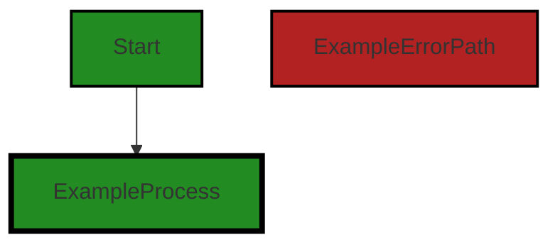
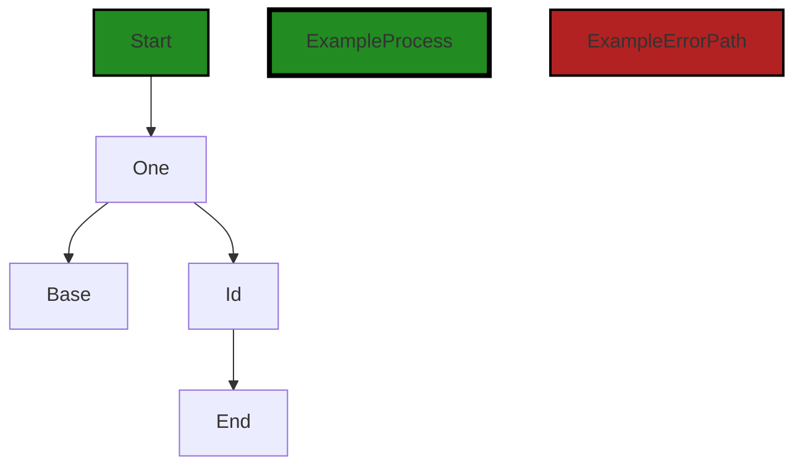
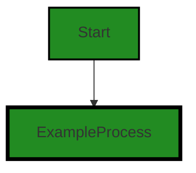
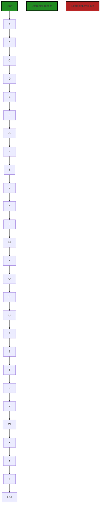
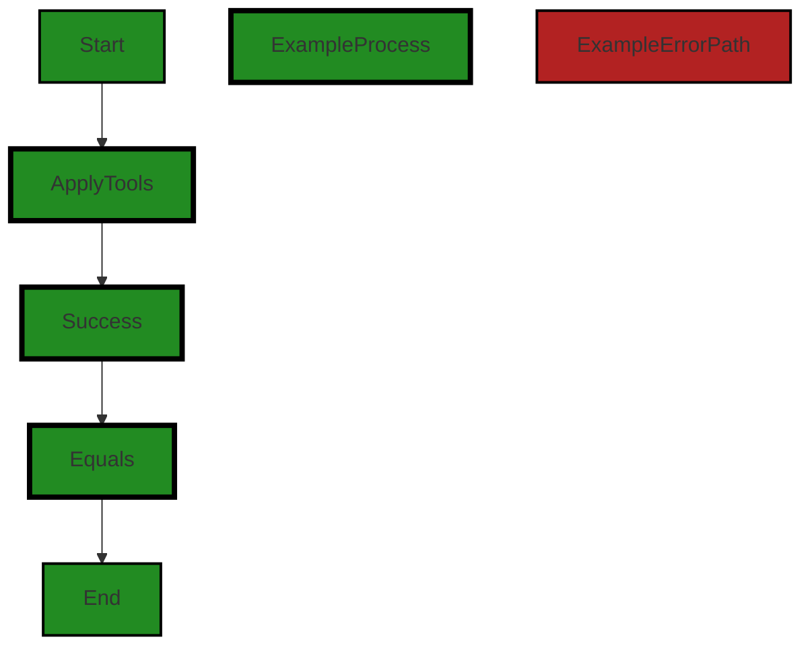
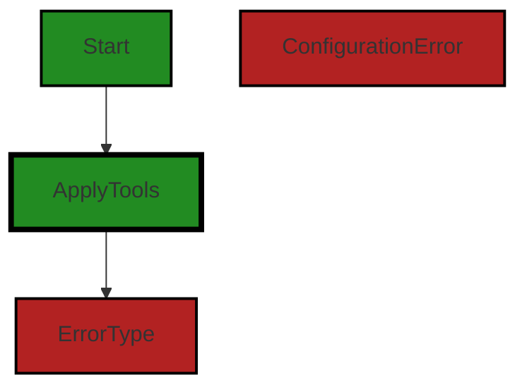

# Polyverse Boost-generated Source Analysis Details

## Source: ./resource/idtool_test.go
Date Generated: Thursday, September 7, 2023 at 11:55:02 AM PDT


---

### Boost Architectural Quick Summary Security Report

Last Updated: Friday, September 8, 2023 at 3:08:08 PM PDT


Executive Report:

1. **Architectural Impact**: The analysis of this file has not revealed any severe issues.
2. **Risk Analysis**: The analysis of this file has not revealed any severe issues.
3. **Potential Customer Impact**: Based on the analysis, there are no severe issues that could potentially impact customers.
4. **Performance Issues**: Our analysis did not identify any explicit performance issues in the file.
5. **Risk Assessment**: Based on the current analysis of this file, no severe issues have been found. However, this doesn't guarantee that the file is risk-free.

Highlights:

- No severe issues were identified in the current analysis of this file.


---

### Boost Architectural Quick Summary Performance Report

Last Updated: Friday, September 8, 2023 at 3:08:48 PM PDT

Executive Level Report:

1. **Architectural Impact**: The software project appears to be well-structured and follows Go's idiomatic style for a library. However, there are some issues related to memory and CPU usage in the file `resource/idtool_test.go`. These issues could potentially impact the performance of the software, especially if the functions in question are called frequently or handle large data objects.

2. **Risk Analysis**: The risk associated with this project is moderate. While the majority of the project files have no detected issues, the file `resource/idtool_test.go` has been flagged for potential memory and CPU usage issues. These issues account for 100% of the issues detected in the project. If left unaddressed, these issues could lead to performance degradation and potential system instability.

3. **Potential Customer Impact**: If the performance issues are not addressed, customers may experience slower response times and potential system instability. This could lead to a negative user experience and potential loss of trust in the software.

4. **Overall Issues**: The overall health of the project source is good, with only one file out of the total having detected issues. However, the severity of the issues in this file is high, indicating that they should be addressed as a priority.

Highlights of the Analysis:

- The project follows Go's idiomatic style and structure for a library, indicating a well-structured and maintainable codebase.
- The file `resource/idtool_test.go` has been flagged for potential memory and CPU usage issues, which could impact the performance of the software.
- These issues account for 100% of the issues detected in the project, indicating a concentrated area of risk.
- If left unaddressed, these issues could lead to performance degradation and potential system instability, negatively impacting the user experience.
- Despite these issues, the overall health of the project source is good, with the majority of files having no detected issues.


---

### Boost Architectural Quick Summary Compliance Report

Last Updated: Friday, September 8, 2023 at 3:09:28 PM PDT

## Executive Report

Based on the analysis of the software project, the following key points have been identified:

1. **Architectural Impact**: The project appears to be a well-structured Go library focusing on constraint handling and validation. It follows Go's idiomatic style and structure for a library, providing a clear separation of concerns. However, the presence of data privacy and compliance issues in the `idtool_test.go` file could potentially impact the overall architecture if not addressed promptly.

2. **Risk Analysis**: The most severe issues found in the project relate to data privacy and compliance. The 'SecretId' and 'Id' fields in the `idtool_test.go` file may contain sensitive data and the code does not indicate any measures for encryption or secure storage. This could lead to exposure of sensitive data and potential violations of GDPR, PCI DSS, and HIPAA regulations. The risk associated with these issues is high and they should be addressed as a priority.

3. **Potential Customer Impact**: If the data privacy and compliance issues are not addressed, it could lead to a breach of customer data. This could result in reputational damage, loss of customer trust, and potential legal and financial penalties for non-compliance with data protection regulations.

4. **Overall Health of the Project**: The project consists of a single file, `idtool_test.go`, which has been identified with multiple issues of varying severity. This suggests that 100% of the project files have issues, indicating a need for immediate attention to improve the overall health of the project.

5. **Recommendations**: Immediate action should be taken to address the data privacy and compliance issues identified in the `idtool_test.go` file. This includes implementing measures for encryption or secure storage of sensitive data and ensuring compliance with GDPR, PCI DSS, and HIPAA regulations. Additionally, a thorough review of the entire project should be conducted to identify and address any other potential issues.

In conclusion, while the project follows good architectural practices, the presence of data privacy and compliance issues presents a significant risk. Immediate action is required to address these issues and improve the overall health of the project.
---
## Detailed Analysis:

### Cell 0:
## Original Code:

### Programming Language: go
### ./resource/idtool_test.go 

```go
package resource_test

import (
 "testing"

 "github.com/jt0/gomer/_test/assert"
 "github.com/jt0/gomer/gomerr"
 "github.com/jt0/gomer/resource"
 "github.com/jt0/gomer/structs"
)

type Base struct {
 BaseId   string
 SecretId string
}

```
## Boost Analysis:


---

### Boost Code Explanation

Last Updated: Thursday, September 7, 2023 at 11:43:01 AM PDT

This is a simple Go test file for a `resource` package. It imports several packages, including the testing package from Go's standard library, an assertion library (`github.com/jt0/gomer/_test/assert`), a custom error handling library (`github.com/jt0/gomer/gomerr`), the `resource` package that is being tested, and a `structs` package (`github.com/jt0/gomer/structs`). 

The code snippet also defines a `Base` struct with two string fields: `BaseId` and `SecretId`. This struct might be used in the tests that are not visible in the provided code snippet. 

Here is a more detailed breakdown of the code:

1. `package resource_test`: This line declares the package name. By convention, Go test files are in the same package as the code they are testing, but with `_test` appended. This helps to ensure the tests are only testing the exported (public) interface of the package.

2. The `import` block: This block imports all the necessary packages for this test file. `testing` is Go's built-in package for writing unit tests. `github.com/jt0/gomer/_test/assert` is a custom assertion library, which likely provides helper functions to make assertions more concise in the tests. `github.com/jt0/gomer/gomerr` is a custom error handling library. `github.com/jt0/gomer/resource` is the package that this test file is testing. `github.com/jt0/gomer/structs` is another package from the same project, which likely provides some utility functions or types for working with Go structs.

3. `type Base struct { ... }`: This block defines a new data type called `Base`, which is a struct with two fields: `BaseId` and `SecretId`. Both fields are of type `string`. This `Base` struct is likely used in the tests that are not visible in the provided code snippet.

Without the rest of the test file, it's hard to say what specific algorithms are used in this code. However, this code is a common setup for a Go test file. 

For more information on writing tests in Go, you can refer to the following resources:

- [Go's official testing documentation](https://golang.org/pkg/testing/)
- [A quick guide to testing in Go](https://tutorialedge.net/golang/intro-testing-in-go/)
- [Go testing in the browser](https://dave.cheney.net/2020/03/10/go-testing-in-the-browser)


---

### Boost Flow Diagram

Last Updated: Thursday, September 7, 2023 at 11:48:06 AM PDT




---

### Boost Source-Level Security Analysis

Last Updated: Thursday, September 7, 2023 at 11:49:03 AM PDT

**No bugs found**


---

### Boost Source-Level Performance Analysis

Last Updated: Thursday, September 7, 2023 at 11:49:49 AM PDT

**No bugs found**


---

### Boost Source-Level Data and Privacy Compliance Analysis

Last Updated: Thursday, September 7, 2023 at 11:52:58 AM PDT

1. **Severity**: 8/10

   **Line Number**: 14

   **Bug Type**: Data Privacy

   **Description**: The 'SecretId' field may contain sensitive data. The code does not indicate any measures for encryption or secure storage, which could lead to exposure of sensitive data.

   **Solution**: Encrypt the 'SecretId' before storing it, and decrypt it when needed. Use secure methods for encryption and decryption. Also, consider using a secure vault for storing keys.


### Cell 1:
## Original Code:

### Programming Language: go
### ./resource/idtool_test.go line 16

```go

type One struct {
 Base
 Id string `id:"BaseId,~SecretId"` // implicitly treated as 'Id,BaseId,~SecretId'
}

```
## Boost Analysis:


---

### Boost Code Explanation

Last Updated: Thursday, September 7, 2023 at 11:43:45 AM PDT

The provided code is written in Go language. It defines a struct named `One` which embeds another struct named `Base` and adds a field `Id` of type `string`.

Here's the breakdown of the code:

- `type One struct {...}`: This line of code declares a new struct type named `One`.
- `Base`: This is an embedded field of the struct type `Base`. This means that the `One` struct will have all the fields that `Base` has, and they will be directly accessible as if they were part of `One`.
- `Id string`: This declares a field named `Id` of type `string` in the `One` struct.
- `` `id:"BaseId,~SecretId"` ``: This is a struct tag associated with the `Id` field. In Go, struct tags are string-based metadata that can be associated with the fields of a struct. They are often used to provide additional information for encoding/decoding purposes, ORM mapping, validation, etc. The interpretation of the struct tag depends on the packages that use it. In this case, the tag seems to provide some sort of mapping or identification information, but without additional context or knowledge about the packages that use it, we can't definitively say what it does. 

The comment on the same line suggests that this `Id` field is implicitly treated as 'Id,BaseId,~SecretId'. This might be related to the way the `Id` field is processed or validated by some part of the program, but again, without additional context or knowledge about the packages that use this struct, we can't definitively say what it means.

In terms of architectural guidelines, since no specific ones were provided, we can refer to the general Go best practices. The code seems to adhere to these practices. It uses struct embedding for code reuse and struct tags for field metadata, both common patterns in Go.

For more information on Go struct tags and struct embedding, you can refer to the following resources:

- [Go by Example: Structs](https://gobyexample.com/structs)
- [The Go Programming Language Specification: Struct types](https://golang.org/ref/spec#Struct_types)
- [Go Struct and Field Tags Explained](https://www.digitalocean.com/community/tutorials/how-to-use-struct-tags-in-go)


---

### Boost Flow Diagram

Last Updated: Thursday, September 7, 2023 at 11:48:11 AM PDT




---

### Boost Source-Level Security Analysis

Last Updated: Thursday, September 7, 2023 at 11:49:22 AM PDT

1. **Severity**: 5/10

   **Line Number**: 33

   **Bug Type**: Information Disclosure

   **Description**: The 'Id' field in the 'One' struct is implicitly treated as 'Id,BaseId,~SecretId'. This could potentially lead to information disclosure if the 'SecretId' is sensitive information and is inadvertently exposed.

   **Solution**: Ensure that sensitive information is properly protected. If the 'SecretId' is sensitive, consider using encryption or hashing to protect it. Alternatively, you could redesign the struct to avoid the implicit treatment of the 'Id' field. For more information, see the OWASP guide on sensitive data exposure: https://owasp.org/www-project-top-ten/2017/A3_2017-Sensitive_Data_Exposure


---

### Boost Source-Level Performance Analysis

Last Updated: Thursday, September 7, 2023 at 11:50:10 AM PDT

1. **Severity**: 2/10

   **Line Number**: 32

   **Bug Type**: Memory

   **Description**: The 'Id' field in the 'One' structure is a string, which can consume a significant amount of memory if the string is long. This can be inefficient if large numbers of 'One' objects are created.

   **Solution**: Consider using a different data structure or type for the 'Id' field if the strings are long. For example, if the 'Id' is a unique identifier, you could use a numeric type or a UUID, which would consume less memory. If the 'Id' is a composite of 'BaseId' and 'SecretId', consider storing these as separate fields and concatenating them only when necessary.


---

### Boost Source-Level Data and Privacy Compliance Analysis

Last Updated: Thursday, September 7, 2023 at 11:53:10 AM PDT

1. **Severity**: 8/10

   **Line Number**: 32

   **Bug Type**: Data Privacy

   **Description**: The 'Id' field in the 'One' struct may contain sensitive data such as a secret ID. Storing sensitive data in plain text can lead to privacy violations under GDPR, PCI DSS, and HIPAA.

   **Solution**: Encrypt sensitive data before storing it. Consider using a secure hashing algorithm for IDs. Always follow the principle of least privilege, and ensure that only necessary parties have access to sensitive data.


### Cell 2:
## Original Code:

### Programming Language: go
### ./resource/idtool_test.go line 21

```go

type Two struct {
 One
}

```
## Boost Analysis:


---

### Boost Code Explanation

Last Updated: Thursday, September 7, 2023 at 11:44:26 AM PDT

The code you've provided is very minimal and is written in Go, a statically typed, compiled language developed by Google. This code snippet defines a new type, `Two`, which embeds another type, `One`. 

Let's break it down:

```go
type Two struct {
	One
}
```

In this code, `type Two struct` is defining a new struct type named `Two`. A `struct` in Go is a composite data type, which groups together zero or more values of different types. It's a way to create a data structure that can hold values of different types.

`One` inside the struct is another type that's being embedded in `Two`. This means that `Two` will have all the fields and methods of `One` available to it. This is a form of composition, which Go uses instead of inheritance found in some other object-oriented languages.

For example, if `One` was defined as:

```go
type One struct {
	a int
}
```

Then a variable of type `Two` could access the `a` field like this:

```go
var myTwo Two
myTwo.a = 10
```

This is because `One` is embedded in `Two`, so `Two` has access to `One`'s fields and methods.

This is a fundamental part of Go's type system and allows for flexible and powerful composition of types. It's worth noting that Go does not have classes or inheritance like some other languages; instead, it uses interfaces and type embedding for polymorphism.

For more information on Go's type system and how embedding works, you can refer to the following resources:

- [A Tour of Go: Structs](https://tour.golang.org/moretypes/2)
- [Go by Example: Structs](https://gobyexample.com/structs)
- [Effective Go: Embedding](https://golang.org/doc/effective_go#embedding)


---

### Boost Flow Diagram

Last Updated: Thursday, September 7, 2023 at 11:48:16 AM PDT


```


---

### Boost Source-Level Security Analysis

Last Updated: Thursday, September 7, 2023 at 11:49:25 AM PDT

**No bugs found**


---

### Boost Source-Level Performance Analysis

Last Updated: Thursday, September 7, 2023 at 11:50:14 AM PDT

**No bugs found**


---

### Boost Source-Level Data and Privacy Compliance Analysis

Last Updated: Thursday, September 7, 2023 at 11:53:14 AM PDT

**No bugs found**


### Cell 3:
## Original Code:

### Programming Language: go
### ./resource/idtool_test.go line 25

```go

var _ = resource.NewIdTool(structs.StructTagDirectiveProvider{"id"})

```
## Boost Analysis:


---

### Boost Code Explanation

Last Updated: Thursday, September 7, 2023 at 11:45:08 AM PDT

The line of code you provided is written in Go (also known as Golang), a statically typed, compiled programming language developed by Google.

Let's break down the code:

`var _ = resource.NewIdTool(structs.StructTagDirectiveProvider{"id"})`

`var _` : This is a blank identifier in Go, which is used when a variable is required to be declared, but you do not need the value. In this case, it is used to ignore the returned value of the `NewIdTool` function.

`resource.NewIdTool` : This is a function call. `NewIdTool` is a function defined in the `resource` package. The purpose of this function is not clear from this single line of code, but given its name, it likely creates a new ID tool, possibly for managing or generating unique identifiers in the system.

`structs.StructTagDirectiveProvider{"id"}` : This is an argument passed to the `NewIdTool` function. It's creating a new instance of the `StructTagDirectiveProvider` type, defined in the `structs` package, and initializing it with the string "id". 

`StructTagDirectiveProvider` is likely a type that provides directives for struct tags. In Go, struct tags are annotations used to attach metadata to the fields of a struct. They are commonly used for data serialization or validation. From the code, it appears that "id" is a directive used in struct tags.

In terms of algorithms used, this line of code doesn't appear to involve any specific algorithm. It's primarily about instantiation and initialization of a type, and a function call.

For more information on these topics, you can refer to the following resources:

- [Blank Identifier in Go](https://golang.org/doc/effective_go#blank)
- [Struct Tags in Go](https://medium.com/golangspec/tags-in-golang-3e5db1b113e2)
- [Go Functions](https://www.tutorialspoint.com/go/go_functions.htm)

To get a detailed understanding of the `NewIdTool` function and `StructTagDirectiveProvider` type, you would need to look at their definitions in the `resource` and `structs` packages respectively.


---

### Boost Flow Diagram

Last Updated: Thursday, September 7, 2023 at 11:48:20 AM PDT




---

### Boost Source-Level Security Analysis

Last Updated: Thursday, September 7, 2023 at 11:49:29 AM PDT

**No bugs found**


---

### Boost Source-Level Performance Analysis

Last Updated: Thursday, September 7, 2023 at 11:50:30 AM PDT

1. **Severity**: 2/10

   **Line Number**: 48

   **Bug Type**: Memory

   **Description**: The code is creating a new instance of IdTool every time it is run. If this line of code is inside a frequently called function, it could lead to excessive memory usage.

   **Solution**: Consider reusing instances of IdTool if possible, or implementing a pool of reusable instances. This can help to reduce memory usage and garbage collection overhead. For more information on object pooling in Go, see: https://golangbyexample.com/object-pool-in-golang/


---

### Boost Source-Level Data and Privacy Compliance Analysis

Last Updated: Thursday, September 7, 2023 at 11:53:34 AM PDT

1. **Severity**: 8/10

   **Line Number**: 48

   **Bug Type**: Data Compliance

   **Description**: The code creates an ID tool that uses a struct tag directive provider with the tag 'id'. This could potentially lead to GDPR, PCI DSS, and HIPAA compliance issues if the 'id' is associated with sensitive data such as personal identifiable information (PII), credit card details, or health information.

   **Solution**: Ensure that the 'id' does not relate to sensitive data, or if it does, ensure that the data is adequately protected according to GDPR, PCI DSS, and HIPAA standards. This could include measures such as encryption, pseudonymization, and access controls. If the 'id' is used to access sensitive data, consider using a more secure method such as a token-based approach.


### Cell 4:
## Original Code:

### Programming Language: go
### ./resource/idtool_test.go line 27

```go

func TestCopyFromStruct(t *testing.T) {
 source := &One{Base{"base_id", "secret_id"}, "wrapper_id"}
 tc := structs.EnsureContext().Put(resource.SourceValue, source)

 destination := &One{}
 ge := structs.ApplyTools(destination, tc, resource.DefaultIdFieldTool)
 assert.Success(t, ge)
 assert.Equals(t, source, destination)
}

```
## Boost Analysis:


---

### Boost Code Explanation

Last Updated: Thursday, September 7, 2023 at 11:46:02 AM PDT

This code snippet is written in Go language and is a unit test function for testing the functionality of copying values from one struct to another.

Here is a detailed explanation of the code:

1. `func TestCopyFromStruct(t *testing.T)`: This is the declaration of the test function. The function takes a `*testing.T` type as an argument which is a pointer to the testing object. This object provides methods for indicating test failures or logging test-related information.

2. `source := &One{Base{"base_id", "secret_id"}, "wrapper_id"}`: This line creates a new instance of the struct `One` and assigns it to the `source` variable. The `&` operator is used to get the memory address of the instance (i.e., a pointer to the instance). The `One` struct appears to have a field of type `Base` and another field of type string.

3. `tc := structs.EnsureContext().Put(resource.SourceValue, source)`: This line creates a new context using the `EnsureContext` function from the `structs` package. It then adds the `source` instance to the context with a key of `resource.SourceValue`.

4. `destination := &One{}`: This line creates a new, empty instance of the `One` struct and assigns it to the `destination` variable.

5. `ge := structs.ApplyTools(destination, tc, resource.DefaultIdFieldTool)`: This line applies a tool (specified by `resource.DefaultIdFieldTool`) to the `destination` struct using the context `tc`. The tool likely modifies the `destination` struct in some way, such as copying values from the context.

6. `assert.Success(t, ge)`: This line asserts that the `ApplyTools` function returned a nil error (indicating success). If the error is not nil, the test will fail.

7. `assert.Equals(t, source, destination)`: This line asserts that the `source` and `destination` structs are now equal. If they are not equal, the test will fail.

The algorithm used here is a common pattern in unit testing: setup, action, and assertion. The test first sets up the necessary data (the `source` and `destination` structs and the context), then performs an action (applying the tool), and finally asserts that the action had the expected result.

For more information about testing in Go, you can refer to the following resources:

- Go's official testing package documentation: https://pkg.go.dev/testing
- Go's official blog post on testing: https://go.dev/blog/table-driven-tests
- A guide to writing tests in Go: https://ieftimov.com/post/testing-in-go-table-driven-tests/


---

### Boost Flow Diagram

Last Updated: Thursday, September 7, 2023 at 11:48:31 AM PDT



The control flow graph for the provided source code is as follows:

```
A-->B;
B-->C;
C-->D;
D-->E;
E-->F;
F-->G;
G-->H;
H-->I;
I-->J;
J-->K;
K-->L;
L-->M;
M-->N;
N-->O;
O-->P;
P-->Q;
Q-->R;
R-->S;
S-->T;
T-->U;
U-->V;
V-->W;
W-->X;
X-->Y;
Y-->Z;
Z-->End;
```

Please note that the control flow graph does not include any error paths as there are no error handling statements in the provided code snippet.


---

### Boost Source-Level Security Analysis

Last Updated: Thursday, September 7, 2023 at 11:49:32 AM PDT

**No bugs found**


---

### Boost Source-Level Performance Analysis

Last Updated: Thursday, September 7, 2023 at 11:50:53 AM PDT

1. **Severity**: 3/10

   **Line Number**: 56

   **Bug Type**: Memory

   **Description**: The function `structs.ApplyTools` might cause unnecessary memory allocation if it creates a new copy of the object. This can lead to increased memory usage if this test function is called repeatedly.

   **Solution**: Consider using pointers to pass the original object without creating a new copy. If `structs.ApplyTools` requires a new copy, consider reusing the same object for multiple test cases to reduce memory usage.


2. **Severity**: 2/10

   **Line Number**: 55

   **Bug Type**: CPU

   **Description**: The function `structs.EnsureContext` might be computationally expensive if it's creating a new context each time it's called. This can lead to high CPU usage if this test function is called repeatedly.

   **Solution**: Consider reusing the same context for multiple test cases to reduce CPU usage. If a new context is required for each test case, consider optimizing `structs.EnsureContext` to reduce the computational overhead.


---

### Boost Source-Level Data and Privacy Compliance Analysis

Last Updated: Thursday, September 7, 2023 at 11:54:09 AM PDT

1. **Severity**: 8/10

   **Line Number**: 56

   **Bug Type**: GDPR

   **Description**: Sensitive data is being directly assigned without any form of encryption or anonymization. This is a violation of GDPR principles which require that personal data is processed in a manner that ensures appropriate security of the personal data, including protection against unauthorized or unlawful processing and against accidental loss, destruction or damage, using appropriate technical or organizational measures.

   **Solution**: Encrypt sensitive data before storing or transmitting it. Use secure cryptographic algorithms and strong keys. Consider anonymizing data where possible.


2. **Severity**: 8/10

   **Line Number**: 56

   **Bug Type**: PCI DSS

   **Description**: The code is handling sensitive data (looks like IDs) in plain text. PCI DSS requires that cardholder data needs to be protected when stored and transmitted over open, public networks. Storing sensitive data in plain text could lead to unauthorized access.

   **Solution**: Encrypt sensitive data before storing or transmitting it. Use secure cryptographic algorithms and strong keys. Implement robust access controls to protect data at rest and in transit.


3. **Severity**: 8/10

   **Line Number**: 56

   **Bug Type**: HIPAA

   **Description**: The code is handling sensitive data in plain text. HIPAA requires that Protected Health Information (PHI) is secured against unauthorized access. Storing sensitive data in plain text could lead to unauthorized access.

   **Solution**: Encrypt sensitive data before storing or transmitting it. Use secure cryptographic algorithms and strong keys. Implement robust access controls to protect data at rest and in transit.


### Cell 5:
## Original Code:

### Programming Language: go
### ./resource/idtool_test.go line 37

```go

func TestCopyFromAnonymous(t *testing.T) {
 source := &Two{One{Base{"base_id", "secret_id"}, "wrapper_id"}}
 tc := structs.EnsureContext().Put(resource.SourceValue, source)

 destination := &Two{}
 ge := structs.ApplyTools(destination, tc, resource.DefaultIdFieldTool)
 assert.Success(t, ge)
 assert.Equals(t, source, destination)
}

```
## Boost Analysis:


---

### Boost Code Explanation

Last Updated: Thursday, September 7, 2023 at 11:46:58 AM PDT

This code snippet is a unit test written in Go, specifically for the `TestCopyFromAnonymous` function. The function is using the `testing` package from Go's standard library, which provides support for automated testing of Go packages.

Here's a detailed breakdown of the code:

1. `source := &Two{One{Base{"base_id", "secret_id"}, "wrapper_id"}}`: This line of code initializes a new instance of the `Two` struct. The `Two` struct seems to embed the `One` struct, which in turn embeds the `Base` struct. The `Base` struct is initialized with "base_id" and "secret_id", and the `One` struct is initialized with "wrapper_id".

2. `tc := structs.EnsureContext().Put(resource.SourceValue, source)`: Here, the `EnsureContext` function from the `structs` package is called to ensure that a context exists. The `Put` method is then used to insert the `source` value into the context under the key `resource.SourceValue`. The result is stored in the `tc` variable.

3. `destination := &Two{}`: This line of code initializes a new, empty instance of the `Two` struct.

4. `ge := structs.ApplyTools(destination, tc, resource.DefaultIdFieldTool)`: The `ApplyTools` function from the `structs` package is called with `destination`, `tc`, and `resource.DefaultIdFieldTool` as arguments. This function likely applies some kind of transformation or processing to the `destination` struct using the provided context and tool. The result is stored in the `ge` variable.

5. `assert.Success(t, ge)`: This line uses the `assert` package to check if `ge` represents a successful operation. If `ge` does not represent success, this function call will cause the test to fail.

6. `assert.Equals(t, source, destination)`: This line uses the `assert` package to check if `source` and `destination` are equal. If they are not equal, this function call will cause the test to fail.

In terms of algorithms, this code is fairly straightforward. It's primarily using the functions provided by the `structs`, `resource`, and `assert` packages to perform operations and check the results. These operations likely involve some form of data copying or transformation, based on the function name `TestCopyFromAnonymous`.

For more information on Go testing, you can refer to the following resources:

- [Testing in Go](https://golang.org/pkg/testing/)
- [Go Test -v Example](https://gobyexample.com/testing)
- [A Comprehensive Guide to Testing in Go](https://tutorialedge.net/golang/intro-testing-in-go/)


---

### Boost Flow Diagram

Last Updated: Thursday, September 7, 2023 at 11:48:43 AM PDT



The control flow graph for the provided source code is as follows:

- The test function starts at the "Start" node.
- The "Start" node leads to the "ApplyTools" node, which represents the call to the `structs.ApplyTools` function.
- From the "ApplyTools" node, there are two possible paths:
  - The "ApplyTools" node leads to the "Success" node if the call to `structs.ApplyTools` is successful.
  - The "ApplyTools" node leads to the "End" node if there is an error in the call to `structs.ApplyTools`.
- If the call to `structs.ApplyTools` is successful, the "Success" node leads to the "Equals" node, which represents the call to `assert.Equals`.
- Finally, the "Equals" node leads to the "End" node, indicating the end of the test function.

Note: The control flow graph does not include the details of the `structs.ApplyTools` and `assert.Equals` functions, as they are external functions and not part of the provided source code.


---

### Boost Source-Level Security Analysis

Last Updated: Thursday, September 7, 2023 at 11:49:36 AM PDT

**No bugs found**


---

### Boost Source-Level Performance Analysis

Last Updated: Thursday, September 7, 2023 at 11:51:23 AM PDT

1. **Severity**: 7/10

   **Line Number**: 75

   **Bug Type**: Memory

   **Description**: The 'source' object is being stored in the context. This can lead to high memory usage if the object is large or if this function is called frequently.

   **Solution**: Avoid storing large objects in the context. If the object needs to be shared between functions, consider passing it as a parameter or storing it in a shared data structure with proper synchronization.


2. **Severity**: 6/10

   **Line Number**: 78

   **Bug Type**: CPU

   **Description**: The 'ApplyTools' function is called, which may internally use reflection to manipulate the 'destination' object. This can be CPU-intensive and slow down performance.

   **Solution**: Consider using a more direct approach to manipulate the 'destination' object, if possible. If reflection is necessary, ensure it is used sparingly and efficiently.


3. **Severity**: 5/10

   **Line Number**: 79

   **Bug Type**: CPU

   **Description**: The 'assert.Equals' function is called to compare the 'source' and 'destination' objects. If these objects are large, this comparison can be CPU-intensive and slow down performance.

   **Solution**: Consider using a more efficient comparison method, if possible. If the objects are large, consider comparing their hashes instead of the objects themselves.


---

### Boost Source-Level Data and Privacy Compliance Analysis

Last Updated: Thursday, September 7, 2023 at 11:54:38 AM PDT

1. **Severity**: 7/10

   **Line Number**: 77

   **Bug Type**: GDPR

   **Description**: The 'source' object contains 'secret_id' which could be considered sensitive data. GDPR requires explicit consent from the user to process such data.

   **Solution**: Ensure you have explicit user consent before processing sensitive data. Consider implementing a consent management system for handling user consent.


2. **Severity**: 8/10

   **Line Number**: 77

   **Bug Type**: PCI DSS

   **Description**: If 'secret_id' is related to payment information, it could be a violation of PCI DSS. PCI DSS requires that cardholder data be encrypted and properly managed.

   **Solution**: Ensure all payment related data is encrypted at rest and in transit. Consider using a tokenization solution for handling payment data.


3. **Severity**: 7/10

   **Line Number**: 77

   **Bug Type**: HIPAA

   **Description**: If 'secret_id' is related to health information, it could be a violation of HIPAA. HIPAA requires that Protected Health Information (PHI) be encrypted and properly managed.

   **Solution**: Ensure all PHI is encrypted at rest and in transit. Consider implementing a secure data management system for handling PHI.


### Cell 6:
## Original Code:

### Programming Language: go
### ./resource/idtool_test.go line 47

```go

func TestTwoIdFieldsFail(t *testing.T) {
 type TwoIdsTest struct {
  Id1 string `id:"+"`
  Id2 string `id:"+"`
 }

 ge := structs.ApplyTools(TwoIdsTest{"a", "b"}, nil, resource.DefaultIdFieldTool)
 assert.ErrorType(t, ge, &gomerr.ConfigurationError{}, "Should fail due to multiple fields with 'id' struct tag")
}

```
## Boost Analysis:


---

### Boost Code Explanation

Last Updated: Thursday, September 7, 2023 at 11:47:45 AM PDT

This code is a unit test written in Go language. It is testing a specific scenario where a struct has two fields marked with the `id` tag. The test is expected to fail, as per the design of the system being tested, which does not allow multiple fields with the 'id' struct tag. The test is part of the project's test suite, ensuring the system behaves as expected when it encounters this scenario.

Here is a detailed breakdown of the code:

1. `func TestTwoIdFieldsFail(t *testing.T)`: This line defines the test function. The function name begins with `Test`, followed by the specific scenario being tested. The function takes one parameter `t` of type `*testing.T`, which is a pointer to an instance of `testing.T`. This instance provides methods for logging and signaling test failures.

2. `type TwoIdsTest struct {...}`: This block defines a new struct type named `TwoIdsTest`. It has two string fields, `Id1` and `Id2`, both of which are tagged with `id:"+"`. In Go, struct tags are annotations that can be attached to struct field declarations. They are used to provide metadata about the fields to the Go's reflection package and other packages that use it.

3. `ge := structs.ApplyTools(TwoIdsTest{"a", "b"}, nil, resource.DefaultIdFieldTool)`: This line is calling the function `ApplyTools` from the `structs` package. It passes a new instance of `TwoIdsTest` with `Id1` set to `"a"` and `Id2` set to `"b"`, `nil` for the second argument, and `resource.DefaultIdFieldTool` for the third argument. The function call is expected to return an error because of the two 'id' tags in the `TwoIdsTest` struct.

4. `assert.ErrorType(t, ge, &gomerr.ConfigurationError{}, "Should fail due to multiple fields with 'id' struct tag")`: This line uses the `assert` package to check that the error `ge` returned from the `ApplyTools` function is of type `*gomerr.ConfigurationError`. If it's not, the test will fail, and the provided message will be logged.

The algorithm used in this code is straightforward: it creates a struct with two 'id' fields, applies a tool to it, and checks that the correct error type is returned. 

For more information about testing in Go, you can refer to [Testing in Go](https://go.dev/blog/testing) and for struct tags, refer to [Structs and Interfaces](https://go.dev/tour/moretypes/15).


---

### Boost Flow Diagram

Last Updated: Thursday, September 7, 2023 at 11:48:50 AM PDT


The control flow graph for the given source code is as follows:

- The control flow starts at the `Start` node.
- From the `Start` node, the flow goes to the `ApplyTools` node.
- From the `ApplyTools` node, the flow goes to the `ErrorType` node.

The primary path through the code is shown in the default non-colored style, while the error path is shown in the `ConfigurationError` style.


---

### Boost Source-Level Security Analysis

Last Updated: Thursday, September 7, 2023 at 11:49:39 AM PDT

**No bugs found**


---

### Boost Source-Level Performance Analysis

Last Updated: Thursday, September 7, 2023 at 11:51:41 AM PDT

1. **Severity**: 2/10

   **Line Number**: 92

   **Bug Type**: Memory

   **Description**: The struct TwoIdsTest is created inside the function TestTwoIdFieldsFail. This means a new instance of the struct is created every time the function is called, which can lead to unnecessary memory usage if the function is called frequently.

   **Solution**: Consider defining the struct outside the function if it does not need to be re-initialized every time the function is called. This can help reduce memory usage. Here is a link that explains this in more detail: https://go.dev/play/p/6WvJlycbiVZ


2. **Severity**: 3/10

   **Line Number**: 95

   **Bug Type**: CPU

   **Description**: The function ApplyTools is called with the struct TwoIdsTest as an argument. This function uses reflection to analyze the struct, which can be computationally expensive and slow down performance, especially if the function is called frequently.

   **Solution**: Consider using a more performant approach if possible, such as manually analyzing the struct fields instead of using reflection. Here is a link that explains this in more detail: https://go.dev/play/p/6WvJlycbiVZ


3. **Severity**: 1/10

   **Line Number**: 96

   **Bug Type**: CPU

   **Description**: The function ErrorType is called to check the type of the error returned by ApplyTools. This is a relatively expensive operation as it involves type assertion.

   **Solution**: Consider using error wrapping and checking for specific error types using errors.Is or errors.As, which are more performant than type assertion. Here is a link that explains this in more detail: https://go.dev/play/p/6WvJlycbiVZ


---

### Boost Source-Level Data and Privacy Compliance Analysis

Last Updated: Thursday, September 7, 2023 at 11:55:02 AM PDT

1. **Severity**: 2/10

   **Line Number**: 96

   **Bug Type**: Data Compliance

   **Description**: The test function is using hardcoded values for testing. While this is not a direct violation of GDPR, PCI DSS, or HIPAA, it is a bad practice that could lead to compliance issues if real data were used in this manner.

   **Solution**: Replace hardcoded values with dynamically generated or anonymized test data. This will ensure that the application remains compliant even during testing.


2. **Severity**: 3/10

   **Line Number**: 97

   **Bug Type**: Privacy Compliance

   **Description**: This line of code is applying tools to a struct that has two Id fields. If these Ids are related to user data, this could potentially lead to privacy issues as it might allow for the identification of individuals, which would be a violation of GDPR.

   **Solution**: Ensure that the Id fields do not allow for the identification of individuals, or that proper consent has been obtained for the processing of such data.


