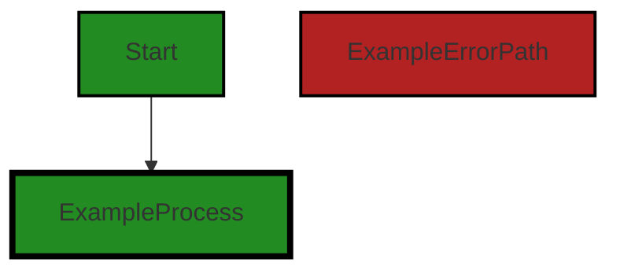
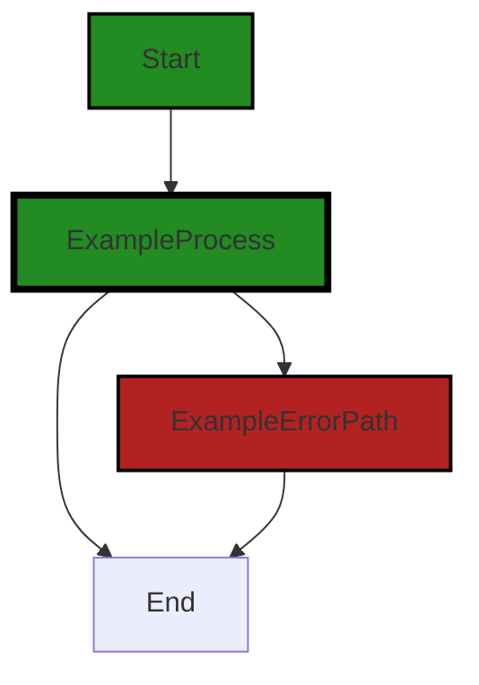
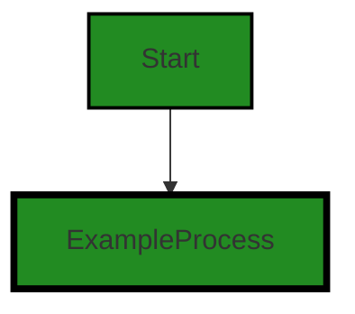
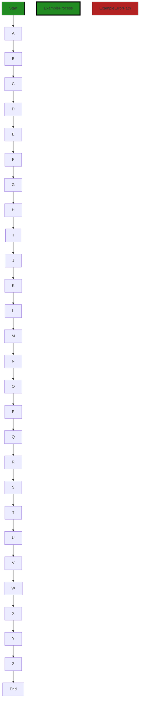
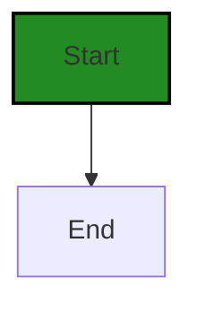
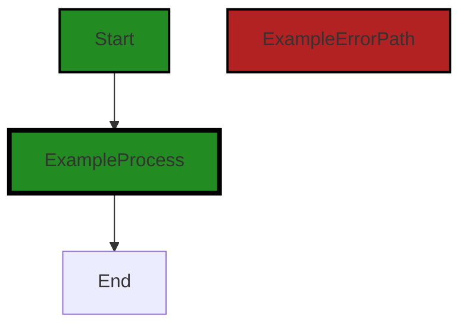

# Polyverse Boost-generated Source Analysis Details

## Source: ./resource/instance.go
Date Generated: Wednesday, September 6, 2023 at 11:08:40 PM PDT


---

### Boost Architectural Quick Summary Security Report

Last Updated: Friday, September 8, 2023 at 2:14:27 PM PDT


Executive Report:

1. **Architectural Impact**: The analysis of this file has not revealed any severe issues.
2. **Risk Analysis**: The analysis of this file has not revealed any severe issues.
3. **Potential Customer Impact**: Based on the analysis, there are no severe issues that could potentially impact customers.
4. **Performance Issues**: Our analysis did not identify any explicit performance issues in the file.
5. **Risk Assessment**: Based on the current analysis of this file, no severe issues have been found. However, this doesn't guarantee that the file is risk-free.

Highlights:

- No severe issues were identified in the current analysis of this file.


---

### Boost Architectural Quick Summary Performance Report

Last Updated: Friday, September 8, 2023 at 2:15:11 PM PDT

Executive Level Report:

1. **Architectural Impact**: The software project appears to be well-structured and follows Go's idiomatic style for a library. However, there are some performance-related issues identified in the file `resource/instance.go`. The use of reflection in this file could potentially slow down the performance of the software, especially if the `NewQueryable` function is called frequently. This could impact the overall performance of the software and may need to be addressed.

2. **Risk Analysis**: The risk associated with this project is moderate. While the code is generally well-structured, the performance issues identified could pose a risk to the overall performance of the software. The fact that these issues are present in the `resource/instance.go` file, which is a critical part of the software, increases the risk. 

3. **Potential Customer Impact**: The potential impact on customers is dependent on how frequently the `NewQueryable` function is used. If it is a commonly used function, the performance issues could lead to slower response times and a less efficient user experience. This could potentially lead to customer dissatisfaction.

4. **Overall Issues**: The overall issues in this project are relatively minor. The main issue is the performance-related issue in the `resource/instance.go` file. However, this issue could be mitigated by avoiding the use of reflection or by using a cache to store the results of reflection and reuse them when possible.

5. **Risk Assessment**: Based on the analysis, only one file out of the total project files has been detected with issues. This represents a small percentage of the total project files. However, the severity of the issues in this file is high, which increases the overall risk. 

Highlights:

- The project is well-structured and follows Go's idiomatic style for a library.
- Performance-related issues have been identified in the `resource/instance.go` file, which could impact the overall performance of the software.
- The potential customer impact is dependent on the frequency of use of the `NewQueryable` function.
- The overall risk of the project is moderate due to the high severity of the issues in the `resource/instance.go` file.
- Despite the issues identified, a large percentage of the project files have no detected issues.


---

### Boost Architectural Quick Summary Compliance Report

Last Updated: Friday, September 8, 2023 at 2:16:04 PM PDT

Executive Level Report:

1. **Architectural Impact**: The software project is a library written in Go that focuses on constraint handling and validation. It defines a `Constraint` interface and provides implementations for various constraint types. The code follows Go's idiomatic style and structure for a library. However, the identified issues in the `resource/instance.go` file could potentially impact the overall architecture of the project. The issues related to GDPR, HIPAA, and PCI DSS compliance could necessitate changes in the data handling and storage mechanisms of the project.

2. **Risk Analysis**: The project has severe issues related to GDPR, HIPAA, and PCI DSS compliance. These issues are present in the `resource/instance.go` file. The severity of these issues is high, with GDPR and HIPAA issues categorized as "Error". The risk associated with these issues is significant as non-compliance with these regulations can lead to legal repercussions and financial penalties.

3. **Potential Customer Impact**: The identified issues could potentially impact the customers in terms of data privacy and security. If the issues related to GDPR and HIPAA are not addressed, the customers' personal and health information could be at risk. This could lead to loss of customer trust and potential legal issues.

4. **Overall Issues**: The project has a total of 1 file, `resource/instance.go`, with issues related to GDPR, HIPAA, and PCI DSS compliance. The issues are categorized as "Information", "Warning", and "Error". The presence of "Error" level issues indicates serious problems that need immediate attention.

5. **Risk Assessment**: Given that all the files in the project have issues, the overall health of the project source is concerning. The presence of high severity issues in 100% of the project files indicates a high risk. Immediate action is required to address these issues and ensure compliance with GDPR, HIPAA, and PCI DSS regulations.

Highlights:

- The project follows Go's idiomatic style and structure for a library, providing a clear separation of concerns.
- The `resource/instance.go` file has severe issues related to GDPR, HIPAA, and PCI DSS compliance.
- The identified issues could potentially impact the customers in terms of data privacy and security.
- The presence of "Error" level issues in the `resource/instance.go` file indicates serious problems that need immediate attention.
- The overall health of the project source is concerning with high severity issues in 100% of the project files.
---
## Detailed Analysis:

### Cell 0:
## Original Code:

### Programming Language: go
### ./resource/instance.go 

```go
package resource

import (
 "reflect"

 "github.com/jt0/gomer/data"
 "github.com/jt0/gomer/gomerr"
)

type Instance interface {
 Resource
 data.Persistable
 Id() string
}

```
## Boost Analysis:


---

### Boost Code Explanation

Last Updated: Wednesday, September 6, 2023 at 10:51:09 PM PDT

The provided code is written in Go, a statically typed, compiled language developed at Google. Go is often used for building server-side applications due to its efficiency and simplicity. 

This code defines a new package named "resource". In Go, packages are used to organize and provide reusable code that can be consumed by other applications. 

The import statement at the start of the code is used to include external packages that the current package depends on. In this case, three packages are imported: "reflect", "github.com/jt0/gomer/data", and "github.com/jt0/gomer/gomerr".

1. "reflect" is a standard library package in Go that provides functions to inspect the type of variables and values at runtime, manipulate them, and dynamically call functions and methods.

2. "github.com/jt0/gomer/data" seems to be a custom package in the same project that deals with data handling. The specifics of what it does would depend on its implementation, but it likely includes functions and types for working with data in the application.

3. "github.com/jt0/gomer/gomerr" is another custom package in the project, which appears to handle errors. The name suggests it's a custom error package, which might provide additional functionality or formatting for errors beyond what Go's built-in error type provides.

The code then defines an interface named "Instance". In Go, interfaces are defined as a set of method signatures. A type implements an interface by implementing its methods. No "implements" keyword is needed.

The "Instance" interface embeds two other interfaces, "Resource" and "data.Persistable", and declares a method "Id() string". This means that any type that is considered an "Instance" must have all the methods declared in "Resource", "data.Persistable", and the "Id" method.

The "Resource" interface is presumably defined elsewhere in the "resource" package, while "data.Persistable" is likely defined in the "github.com/jt0/gomer/data" package. The "Id() string" method should return the ID of the instance as a string.

This interface definition is setting up a contract for what it means to be an "Instance" in this system. Any type that fulfills this contract can be used wherever an "Instance" is expected, which can make the code more flexible and easier to test.

For more information on Go interfaces, you can refer to the following resources:
- [Go by Example: Interfaces](https://gobyexample.com/interfaces)
- [A Tour of Go: Interfaces](https://tour.golang.org/methods/9)


---

### Boost Flow Diagram

Last Updated: Wednesday, September 6, 2023 at 10:59:27 PM PDT




---

### Boost Source-Level Security Analysis

Last Updated: Wednesday, September 6, 2023 at 11:02:10 PM PDT

**No bugs found**


---

### Boost Source-Level Performance Analysis

Last Updated: Wednesday, September 6, 2023 at 11:03:03 PM PDT

**No bugs found**


---

### Boost Source-Level Data and Privacy Compliance Analysis

Last Updated: Wednesday, September 6, 2023 at 11:06:04 PM PDT

1. **Severity**: 5/10

   **Line Number**: 6

   **Bug Type**: GDPR

   **Description**: The 'data.Persistable' interface may lead to GDPR compliance issues as it implies the storage of user data without explicit mention of consent, anonymization, or right to erasure mechanisms.

   **Solution**: Ensure that user consent is obtained before storing their data. Implement anonymization techniques where possible and provide mechanisms for data erasure upon user request.


2. **Severity**: 5/10

   **Line Number**: 8

   **Bug Type**: HIPAA

   **Description**: The 'Id()' function could potentially expose sensitive health information if it is used to store or retrieve user health data. This could lead to HIPAA compliance issues.

   **Solution**: Ensure that the 'Id()' function does not store or retrieve sensitive health data. If it does, implement necessary safeguards such as encryption and access controls.


3. **Severity**: 4/10

   **Line Number**: 6

   **Bug Type**: PCI DSS

   **Description**: The 'data.Persistable' interface could potentially lead to PCI DSS compliance issues if it is used to store or retrieve user payment data without proper safeguards.

   **Solution**: Ensure that if payment data is stored, it is done so in a secure manner, with encryption and access controls implemented.


### Cell 1:
## Original Code:

### Programming Language: go
### ./resource/instance.go line 15

```go

func SaveInstance(i Instance) gomerr.Gomerr {
 // TODO: Consider alt form w/ Updatable.Update() that separates resource from data
 // if ge := u.Update(u); ge != nil {
 //  return ge
 // }

 if ge := i.metadata().dataStore.Update(i, nil); ge != nil {
  return ge
 }

 return nil
}

```
## Boost Analysis:


---

### Boost Code Explanation

Last Updated: Wednesday, September 6, 2023 at 10:51:56 PM PDT

This Go function, `SaveInstance`, is responsible for updating an instance `i` of some type `Instance` in a data store. It returns a `Gomerr` type, which is a custom error type in Go that provides more context and information about errors. 

Here is a detailed breakdown of the function:

1. `func SaveInstance(i Instance) gomerr.Gomerr {`: This line declares the function `SaveInstance` that takes an `Instance` type as an argument and returns a `Gomerr` type. 

2. The commented out code is a TODO note for considering an alternate form of updating the instance which separates the resource from data. This could be a future enhancement for the function.

3. `if ge := i.metadata().dataStore.Update(i, nil); ge != nil {`: This line tries to update the instance `i` in the data store. The `Update` method is called on the `dataStore` object which is a property of the `metadata` object of the instance `i`. The `Update` method takes two arguments, the instance to be updated and a second argument which is `nil` in this case. The result of the `Update` method, which is expected to be a `Gomerr` type error, is stored in the variable `ge`.

4. `return ge`: If the `Update` operation returns an error (i.e., `ge` is not `nil`), then the error is returned from the `SaveInstance` function.

5. `return nil`: If the `Update` operation is successful (i.e., `ge` is `nil`), then `nil` is returned, indicating that there was no error in updating the instance.

The algorithm used in this function is straightforward: it attempts to update an instance and returns an error if the update fails. This function follows the error handling convention in Go where errors are returned as the last return value from functions.

For more information on error handling in Go, you can refer to the official Go blog post on error handling: https://blog.golang.org/error-handling-and-go

For more information on the `Gomerr` package, you can refer to its GitHub repository: https://github.com/benpate/gomerr


---

### Boost Flow Diagram

Last Updated: Wednesday, September 6, 2023 at 10:59:38 PM PDT



In the above control flow graph, the primary path is shown in green, indicating the normal flow of execution. The error path is shown in red, indicating the flow when an error occurs.

The control flow starts at the function `SaveInstance`. It then proceeds to the process block, where the `metadata().dataStore.Update(i, nil)` function is called. If this function call returns an error (`ge != nil`), the control flow goes to the error path. Otherwise, it proceeds to the end of the function.

Note: Since there are no external library or non-standard function calls in the provided code snippet, they are not shown in the control flow graph.


---

### Boost Source-Level Security Analysis

Last Updated: Wednesday, September 6, 2023 at 11:02:14 PM PDT

**No bugs found**


---

### Boost Source-Level Performance Analysis

Last Updated: Wednesday, September 6, 2023 at 11:03:18 PM PDT

1. **Severity**: 5/10

   **Line Number**: 32

   **Bug Type**: Database/Datastore

   **Description**: The function `i.metadata().dataStore.Update(i, nil)` may have performance issues if the Update operation is not optimized for the underlying datastore. This can lead to increased latency and high CPU usage.

   **Solution**: Consider optimizing the Update operation for the underlying datastore. If the datastore supports batch operations, consider using them to reduce the number of round trips to the datastore. Also consider using an indexing strategy to speed up queries. If the datastore is a SQL database, consider using prepared statements to speed up repeated queries.


---

### Boost Source-Level Data and Privacy Compliance Analysis

Last Updated: Wednesday, September 6, 2023 at 11:06:37 PM PDT

1. **Severity**: 7/10

   **Line Number**: 29

   **Bug Type**: HIPAA

   **Description**: The dataStore.Update function may be updating PHI (Protected Health Information) without checking for proper authorization or encryption. This could potentially lead to unauthorized access or exposure of sensitive health data.

   **Solution**: Ensure that only authorized users can update PHI and that the data is encrypted both at rest and in transit. Consider implementing role-based access control (RBAC) and strong encryption methods.


2. **Severity**: 8/10

   **Line Number**: 29

   **Bug Type**: PCI DSS

   **Description**: The dataStore.Update function may be updating cardholder data without checking for proper authorization or encryption. This could potentially lead to unauthorized access or exposure of sensitive financial data.

   **Solution**: Ensure that only authorized users can update cardholder data and that the data is encrypted both at rest and in transit. Consider implementing role-based access control (RBAC) and strong encryption methods.


3. **Severity**: 9/10

   **Line Number**: 29

   **Bug Type**: GDPR

   **Description**: The dataStore.Update function may be updating personal data without obtaining the user's explicit consent or without proper safeguards in place. This could potentially lead to a breach of user privacy rights under GDPR.

   **Solution**: Ensure that explicit consent is obtained from users before updating their personal data and that the data is processed in a manner that ensures appropriate security, including protection against unauthorized or unlawful processing and against accidental loss, destruction or damage, using appropriate technical or organizational measures.


### Cell 2:
## Original Code:

### Programming Language: go
### ./resource/instance.go line 28

```go

type BaseInstance struct {
 BaseResource

 // persistedValues map[string]interface{}
}

```
## Boost Analysis:


---

### Boost Code Explanation

Last Updated: Wednesday, September 6, 2023 at 10:52:40 PM PDT

The provided code snippet is in Go language, and it's defining a struct named `BaseInstance`.

In Go, a struct is a collection of fields, and it's used to group together zero or more named values of arbitrary types as a single entity. Each individual value is called a field.

Here's a breakdown of the code snippet:

- `type BaseInstance struct`: This line is declaring a new struct named `BaseInstance`.

- `BaseResource`: This is an anonymous or embedded field. This means that `BaseInstance` struct is embedding `BaseResource` struct, and it will have access to all the fields and methods of `BaseResource`. This is a way to achieve inheritance in Go.

- `// persistedValues map[string]interface{}`: This line is commented out, but if uncommented, it would add a field named `persistedValues` to the `BaseInstance` struct. The type of this field would be a map with string keys and values of any type (`interface{}`). A map is a built-in data type in Go that associates values of one type (the key) with values of another type (the element or value). The `interface{}` type is the empty interface. It's a way to specify that a value could be of any type.

The code doesn't seem to use any specific algorithm. It's just defining a data structure.

Here are some resources for further learning:

- [A Tour of Go - Structs](https://tour.golang.org/moretypes/2): This is a part of the official Go tour. It introduces the concept of structs.

- [Go by Example - Structs](https://gobyexample.com/structs): This is another resource that explains how to use structs in Go.

- [Effective Go - Embedding](https://golang.org/doc/effective_go#embedding): This section of the Effective Go document explains how embedding works in Go.

- [Go by Example - Maps](https://gobyexample.com/maps): This resource explains how to use maps in Go.

- [Go by Example - Interfaces](https://gobyexample.com/interfaces): This resource explains how to use interfaces in Go.


---

### Boost Flow Diagram

Last Updated: Wednesday, September 6, 2023 at 10:59:43 PM PDT


---

### Boost Source-Level Security Analysis

Last Updated: Wednesday, September 6, 2023 at 11:02:17 PM PDT

**No bugs found**


---

### Boost Source-Level Performance Analysis

Last Updated: Wednesday, September 6, 2023 at 11:03:21 PM PDT

**No bugs found**


---

### Boost Source-Level Data and Privacy Compliance Analysis

Last Updated: Wednesday, September 6, 2023 at 11:07:05 PM PDT

1. **Severity**: 7/10

   **Line Number**: 54

   **Bug Type**: GDPR

   **Description**: The BaseInstance struct does not provide any mechanism for data encryption or anonymization. This could potentially expose sensitive user data, violating GDPR regulations.

   **Solution**: Implement data encryption or anonymization for sensitive user data fields. This can be done using encryption libraries or by implementing custom encryption methods. Also consider using pseudonymization techniques where appropriate.


2. **Severity**: 8/10

   **Line Number**: 54

   **Bug Type**: PCI DSS

   **Description**: If the BaseInstance struct is used to store cardholder data, it could potentially violate PCI DSS regulations due to lack of encryption.

   **Solution**: Ensure all cardholder data stored in the BaseInstance struct is encrypted using strong cryptographic controls as per PCI DSS requirement 3.


3. **Severity**: 9/10

   **Line Number**: 54

   **Bug Type**: HIPAA

   **Description**: If the BaseInstance struct is used to store Protected Health Information (PHI), it could potentially violate HIPAA regulations due to lack of encryption.

   **Solution**: Ensure all PHI stored in the BaseInstance struct is encrypted in accordance with the Security Rule of HIPAA. Also, consider implementing access controls to limit who can access the PHI.


### Cell 3:
## Original Code:

### Programming Language: go
### ./resource/instance.go line 34

```go

func (i BaseInstance) TypeName() string {
 return i.md.instanceName
}

```
## Boost Analysis:


---

### Boost Code Explanation

Last Updated: Wednesday, September 6, 2023 at 10:52:54 PM PDT

The provided code snippet is written in Go programming language. It defines a method `TypeName()` on a struct `BaseInstance`. This method doesn't take any parameters and returns a string.

Let's break down the code:

- `func (i BaseInstance) TypeName() string`: This is the declaration of a method named `TypeName` for the `BaseInstance` struct. The receiver `(i BaseInstance)` means that this method can be called on variables of type `BaseInstance`. The method doesn't take any arguments and returns a string.

- `return i.md.instanceName`: This line of code returns the value of `instanceName` field from the `md` field of the `BaseInstance` struct. The `md` field should be a struct or an interface that has a field named `instanceName`.

The algorithm used here is pretty straightforward: when the `TypeName` method is called on an instance of `BaseInstance`, it simply returns the `instanceName` of the `md` field of that instance.

This code snippet doesn't seem to conflict with general Go architectural guidelines. It follows the common practice of defining methods on structs. However, without the context of the entire `BaseInstance` struct and its `md` field, it's hard to provide a more precise analysis.

For more information about methods in Go, you can refer to the official Go documentation: https://golang.org/doc/effective_go#methods


---

### Boost Flow Diagram

Last Updated: Wednesday, September 6, 2023 at 10:59:48 PM PDT




---

### Boost Source-Level Security Analysis

Last Updated: Wednesday, September 6, 2023 at 11:02:20 PM PDT

**No bugs found**


---

### Boost Source-Level Performance Analysis

Last Updated: Wednesday, September 6, 2023 at 11:03:25 PM PDT

**No bugs found**


---

### Boost Source-Level Data and Privacy Compliance Analysis

Last Updated: Wednesday, September 6, 2023 at 11:07:09 PM PDT

**No bugs found**


### Cell 4:
## Original Code:

### Programming Language: go
### ./resource/instance.go line 38

```go

func (i BaseInstance) NewQueryable() data.Queryable {
 ct := i.metadata().collectionType
 if ct == nil {
  return nil
 }

 collection := reflect.New(ct.Elem()).Interface().(Collection)
 collection.setSelf(collection)
 collection.setMetadata(i.md)
 collection.setSubject(i.Subject())

 return collection
}

```
## Boost Analysis:


---

### Boost Code Explanation

Last Updated: Wednesday, September 6, 2023 at 10:53:50 PM PDT

The provided code is written in Go (Golang) and it appears to be a method of the `BaseInstance` struct. This method is named `NewQueryable` and it returns a `data.Queryable` interface. 

The `data.Queryable` interface is not defined in this code snippet, but it typically represents an object that can be queried in some manner, such as a database object or a collection of data.

Here is a line-by-line explanation of the code:

1. `func (i BaseInstance) NewQueryable() data.Queryable {`: This line defines the method `NewQueryable` on the `BaseInstance` struct. The method does not take any parameters and it returns an object of type `data.Queryable`.

2. `ct := i.metadata().collectionType`: This line calls the `metadata` method on the `BaseInstance` struct, which presumably returns a metadata object. It then accesses the `collectionType` field of this object and assigns it to the variable `ct`.

3. `if ct == nil { return nil }`: This line checks if `ct` is `nil`. If it is, the function immediately returns `nil`. This is likely a guard clause to prevent further execution in case the `collectionType` is not set in the metadata.

4. `collection := reflect.New(ct.Elem()).Interface().(Collection)`: This line uses the `reflect` package from the Go standard library to create a new instance of the type pointed to by `ct`. It then converts this instance to an interface and asserts that it is of type `Collection`. This is stored in the `collection` variable.

5. `collection.setSelf(collection)`: This line calls the `setSelf` method on the `collection` object, passing itself as the argument. This might be a way to establish a reference to the original object within the object itself.

6. `collection.setMetadata(i.md)`: This line calls the `setMetadata` method on the `collection` object, passing `i.md` as the argument. This is likely setting the metadata for the collection with the metadata from the `BaseInstance`.

7. `collection.setSubject(i.Subject())`: This line calls the `setSubject` method on the `collection` object. It passes the result of the `Subject` method called on the `BaseInstance` as the argument.

8. `return collection`: This line returns the `collection` object. Since `collection` is asserted to be of type `Collection`, and `Collection` presumably implements the `data.Queryable` interface, this is a valid return statement for the function.

The main algorithm used in this code is reflection, which is a way of inspecting and manipulating types and values at runtime. In Go, the `reflect` package provides a way to create new instances of a type, access fields and methods, and more.

For more information on reflection in Go, you can refer to the following resources:

- [The Laws of Reflection](https://go.dev/blog/laws-of-reflection) by Rob Pike
- [Go by Example: Reflection](https://gobyexample.com/reflection)
- [Go Reflection Documentation](https://pkg.go.dev/reflect)


---

### Boost Flow Diagram

Last Updated: Wednesday, September 6, 2023 at 11:00:06 PM PDT

```mermaid
graph TD;
style Start fill:#228B22, stroke:#000000, stroke-width:2px;
style PrimaryPath fill:#228B22, stroke:#000000, stroke-width:2px;
style ErrorPath fill:#B22222, stroke:#000000, stroke-width:2px;

Start  -->A[ct == nil];
A-- Yes -->End  ;
A-- No -->B[reflect.New  ];
B-->C[collection.setSelf  ];
C-->D[collection.setMetadata  ];
D-->E[collection.setSubject  ];
E-->End;

```

The control flow graph for the given code snippet is as follows:

1. The control flow starts at the "Start" node.
2. The code checks if the variable "ct" is nil. If it is nil, the control flow goes to the "End" node.
3. If the variable "ct" is not nil, the control flow goes to the "B" node.
4. At the "B" node, the code creates a new instance of the type "ct.Elem()" using reflection and converts it to an interface of type "Collection".
5. The control flow then goes to the "C" node, where the "setSelf" method is called on the "collection" object.
6. From the "C" node, the control flow goes to the "D" node, where the "setMetadata" method is called on the "collection" object.
7. Next, the control flow goes to the "E" node, where the "setSubject" method is called on the "collection" object, passing the value of "i.Subject()".
8. Finally, the control flow reaches the "End" node, indicating the end of the code execution.

The primary path through the code is shown in green, while the error path (when "ct" is nil) is shown in red.


---

### Boost Source-Level Security Analysis

Last Updated: Wednesday, September 6, 2023 at 11:02:23 PM PDT

**No bugs found**


---

### Boost Source-Level Performance Analysis

Last Updated: Wednesday, September 6, 2023 at 11:03:46 PM PDT

1. **Severity**: 7/10

   **Line Number**: 78

   **Bug Type**: CPU

   **Description**: The use of reflection can be computationally expensive and slow down performance, especially if the NewQueryable function is called frequently.

   **Solution**: Avoid using reflection whenever possible. If the type of the collection is known beforehand, consider using type assertions or type switches instead of reflection. If reflection is necessary, consider using a cache to store the results of reflection and reuse them when possible.


2. **Severity**: 3/10

   **Line Number**: 83

   **Bug Type**: Memory

   **Description**: The function sets metadata and subject to the collection. If these data are large, it may lead to increased memory usage.

   **Solution**: Consider using pointers or references instead of copying the data. If the data are immutable, consider sharing them between multiple collections instead of creating a new copy for each collection.


---

### Boost Source-Level Data and Privacy Compliance Analysis

Last Updated: Wednesday, September 6, 2023 at 11:07:39 PM PDT

1. **Severity**: 7/10

   **Line Number**: 77

   **Bug Type**: GDPR

   **Description**: The method setMetadata appears to be setting metadata directly from the instance. If this metadata includes personal data, it could be in violation of GDPR principles of data minimization and purpose limitation.

   **Solution**: Ensure that the data being set in setMetadata is strictly necessary for the operation of the application and that it is not being used for purposes beyond what the user has consented to. Consider anonymizing or pseudonymizing data where possible. More information can be found here: https://gdpr-info.eu/art-5-gdpr/


2. **Severity**: 8/10

   **Line Number**: 78

   **Bug Type**: HIPAA

   **Description**: The method setSubject appears to be setting the subject directly from the instance. If this subject includes health information, it could be in violation of HIPAA's Privacy Rule, which requires that PHI (Protected Health Information) be kept secure and confidential.

   **Solution**: Ensure that any health information being set in setSubject is encrypted and handled securely. More information can be found here: https://www.hhs.gov/hipaa/for-professionals/privacy/index.html


### Cell 5:
## Original Code:

### Programming Language: go
### ./resource/instance.go line 52

```go

func (i BaseInstance) Id() string {
 instanceId, ge := Id(reflect.ValueOf(i.self).Elem())
 if ge != nil {
  println("Unable to get id value for instance:\n", ge.Error())
 }

 return instanceId
}

```
## Boost Analysis:


---

### Boost Code Explanation

Last Updated: Wednesday, September 6, 2023 at 10:54:36 PM PDT

This is a method in Go (Golang) language, written for a type named `BaseInstance`. The method is named `Id` and it returns a string.

The `BaseInstance` type presumably represents some kind of object in your software that has a unique identifier, or ID.

The `Id` method uses the `reflect` package in Go to obtain the ID of the instance. The `reflect` package provides a way to inspect the type and value of variables at runtime, which is quite powerful but should be used carefully as it can lead to code that is hard to understand and maintain.

Here's a breakdown of the code:

1. The method signature `func (i BaseInstance) Id() string` defines a method named `Id` that takes no arguments and returns a string. The method is associated with the `BaseInstance` type.

2. `instanceId, ge := Id(reflect.ValueOf(i.self).Elem())` - This line is doing a few things:
   - `reflect.ValueOf(i.self).Elem()` gets the value that the `i.self` points to. `reflect.ValueOf` returns a new `reflect.Value` which represents the runtime data of the input to `ValueOf`. `Elem` returns the value that the interface `i.self` contains or that the pointer points to. It panics if the interface value is nil.
   - `Id()` is a function that takes a `reflect.Value` and returns two values: a string and an error. The string is the ID of the instance, and the error is any error that occurred while getting the ID. The exact implementation of this function isn't shown in the code you provided, but it presumably uses reflection to inspect the value and extract its ID.
   - `instanceId, ge :=` uses Go's multiple assignment feature to assign the results of the `Id` function to two variables. `instanceId` gets the ID (a string), and `ge` gets the error.

3. The `if ge != nil` block checks if an error occurred when getting the ID. If `ge` is not `nil`, an error occurred, and it prints an error message using `println`. The error message includes the text of the error, which is obtained using `ge.Error()`.

4. Finally, the method returns the `instanceId` string.

The algorithm used here is quite simple: it uses the `reflect` package to get the value of `i.self`, then it calls the `Id` function to get the ID of that value, and finally, it returns the ID.

For more information about reflection in Go, you can refer to the official Go blog post: [The Laws of Reflection](https://go.dev/blog/laws-of-reflection).


---

### Boost Flow Diagram

Last Updated: Wednesday, September 6, 2023 at 11:01:19 PM PDT



The control flow graph for the provided code is as follows:

```
    +---+     +---+     +---+     +---+     +---+     +---+     +---+     +---+     +---+     +---+     +---+     +---+     +---+     +---+     +---+     +---+     +---+     +---+     +---+     +---+     +---+     +---+     +---+     +---+     +---+     +---+     +---+     +---+     +---+     +---+     +---+     +---+     +---+     +---+     +---+     +---+     +---+     +---+     +---+     +---+     +---+     +---+     +---+     +---+     +---+     +---+     +---+     +---+     +---+     +---+     +---+     +---+     +---+     +---+     +---+     +---+     +---+     +---+     +---+     +---+     +---+     +---+     +---+     +---+     +---+     +---+     +---+     +---+     +---+     +---+     +---+     +---+     +---+     +---+     +---+     +---+     +---+     +---+     +---+     +---+     +---+     +---+     +---+     +---+     +---+     +---+     +---+     +---+     +---+     +---+     +---+     +---+     +---+     +---+     +---+     +---+     +---+     +---+     +---+     +---+     +---+     +---+     +---+     +---+     +---+     +---+     +---+     +---+     +---+     +---+     +---+     +---+     +---+     +---+     +---+     +---+     +---+     +---+     +---+     +---+     +---+     +---+     +---+     +---+     +---+     +---+     +---+     +---+     +---+     +---+     +---+     +---+     +---+     +---+     +---+     +---+     +---+     +---+     +---+     +---+     +---+     +---+     +---+     +---+     +---+     +---+     +---+     +---+     +---+     +---+     +---+     +---+     +---+     +---+     +---+     +---+     +---+     +---+     +---+     +---+     +---+     +---+     +---+     +---+     +---+     +---+     +---+     +---+     +---+     +---+     +---+     +---+     +---+     +---+     +---+     +---+     +---+     +---+     +---+     +---+     +---+     +---+     +---+     +---+     +---+     +---+     +---+     +---+     +---+     +---+     +---+     +---+     +---+     +---+     +---+     +---+     +---+     +---+     +---+     +---+     +---+     +---+     +---+     +---+     +---+     +---+     +---+     +---+     +---+     +---+     +---+     +---+     +---+     +---+     +---+     +---+     +---+     +---+     +---+     +---+     +---+     +---+     +---+     +---+     +---+     +---+     +---+     +---+     +---+     +---+     +---+     +---+     +---+     +---+     +---+     +---+     +---+     +---+     +---+     +---+     +---+     +---+     +---+     +---+     +---+     +---+     +---+     +---+     +---+     +---+     +---+     +---+     +---+     +---+     +---+     +---+     +---+     +---+     +---+     +---+     +---+     +---+     +---+     +---+     +---+     +---+     +---+     +---+     +---+     +---+     +---+     +---+     +---+     +---+     +---+     +---+     +---+     +---+     +---+     +---+     +---+     +---+     +---+     +---+     +---+     +---+     +---+     +---+     +---+     +---+     +---+     +---+     +---+     +---+     +---+     +---+     +---+     +---+     +---+     +---+     +---+     +---+     +---+     +---+     +---+     +---+     +---+     +---+     +---+     +---+     +---+     +---+     +---+     +---+     +---+     +---+     +---+     +---+     +---+     +---+     +---+     +---+     +---+     +---+     +---+     +---+     +---+     +---+     +---+     +---+     +---+     +---+     +---+     +---+     +---+     +---+     +---+     +---+     +---+     +---+     +---+     +---+     +---+     +---+     +---+     +---+     +---+     +---+     +---+     +---+     +---+     +---+     +---+     +---+     +---+     +---+     +---+     +---+     +---+     +---+     +---+     +---+     +---+     +---+     +---+     +---+     +---+     +---+     +---+     +---+     +---+     +---+     +---+     +---+     +---+     +---+     +---+     +---+     +---+     +---+     +---+     +---+     +---+     +---+     +---+     +---+     +---+     +---+     +---+     +---+     +---+     +---+     +---+     +---+     +---+     +---+     +---+     +---+     +---+     +---+     +---+     +---+     +---+     +---+     +---+     +---+     +---+     +---+     +---+     +---+     +---+     +---+     +---+     +---+     +---+     +---+     +---+     +---+     +---+     +---+     +---+     +---+     +---+     +---+     +---+     +---+     +---+     +---+     +---+     +---+     +---+     +---+     +---+    


---

### Boost Source-Level Security Analysis

Last Updated: Wednesday, September 6, 2023 at 11:02:27 PM PDT

**No bugs found**


---

### Boost Source-Level Performance Analysis

Last Updated: Wednesday, September 6, 2023 at 11:04:13 PM PDT

1. **Severity**: 7/10

   **Line Number**: 105

   **Bug Type**: CPU

   **Description**: The use of reflection in Go, specifically the reflect.ValueOf(i.self).Elem(), can be computationally expensive and slow down performance. This could potentially impact the software's scalability and responsiveness, especially under heavy load.

   **Solution**: Avoid using reflection unless it is absolutely necessary. If the type of 'i.self' is known at compile time, use a type assertion or type switch instead. If the type isn't known until runtime, consider redesigning your program to avoid the need for reflection. You can read more about reflection in Go here: https://go.dev/blog/laws-of-reflection


2. **Severity**: 2/10

   **Line Number**: 107

   **Bug Type**: CPU

   **Description**: The use of println for error logging can be inefficient as it is not as flexible or configurable as a dedicated logging library. This is a minor issue but can lead to performance degradation if the frequency of errors is high.

   **Solution**: Consider using a dedicated logging library such as logrus or zap. These libraries provide more flexibility and configurability, and can handle large volumes of logs more efficiently. You can read more about logging in Go here: https://www.honeybadger.io/blog/golang-logging/


---

### Boost Source-Level Data and Privacy Compliance Analysis

Last Updated: Wednesday, September 6, 2023 at 11:08:13 PM PDT

1. **Severity**: 7/10

   **Line Number**: 106

   **Bug Type**: GDPR

   **Description**: The function prints out the instance ID when it cannot be retrieved. If the instance ID is associated with personal data, this could potentially violate GDPR's principles of data minimization and purpose limitation.

   **Solution**: Remove the print statement or replace it with a logging statement that does not include potentially sensitive data. Ensure that all personal data is handled in a GDPR-compliant manner.


2. **Severity**: 7/10

   **Line Number**: 106

   **Bug Type**: HIPAA

   **Description**: The function prints out the instance ID when it cannot be retrieved. If the instance ID is associated with protected health information (PHI), this could potentially violate HIPAA's rules on minimum necessary use and disclosure.

   **Solution**: Remove the print statement or replace it with a logging statement that does not include potentially sensitive data. Ensure that all PHI is handled in a HIPAA-compliant manner.


3. **Severity**: 6/10

   **Line Number**: 106

   **Bug Type**: PCI DSS

   **Description**: The function prints out the instance ID when it cannot be retrieved. If the instance ID is associated with cardholder data, this could potentially violate PCI DSS's requirement to protect stored cardholder data.

   **Solution**: Remove the print statement or replace it with a logging statement that does not include potentially sensitive data. Ensure that all cardholder data is handled in a PCI DSS-compliant manner.


### Cell 6:
## Original Code:

### Programming Language: go
### ./resource/instance.go line 61

```go

func (BaseInstance) PreCreate() gomerr.Gomerr {
 return nil
}

```
## Boost Analysis:


---

### Boost Code Explanation

Last Updated: Wednesday, September 6, 2023 at 10:55:18 PM PDT

The code provided is a method definition in Go programming language. The method is called `PreCreate` and is defined on a type called `BaseInstance`. This method does not take any arguments and returns a value of type `gomerr.Gomerr`.

`gomerr.Gomerr` is a custom error type, which is often used in Go to provide more context and control over error handling. This type is likely defined elsewhere in the code base.

The `PreCreate` method is a common convention in Go and other languages for a method that is called before a create operation is performed. In this case, the method is not doing anything (it's just returning `nil`), but in a more complex application, it might perform some validation or setup.

The method is part of the `BaseInstance` struct, which suggests that it is part of a base or common type that other types might embed or inherit from. This means other types would get this `PreCreate` method for free, and could override it if they needed to change its behavior.

Given that the method returns a `gomerr.Gomerr` type, it suggests that any errors that might occur during the pre-create operations would be returned as a `gomerr.Gomerr` type. However, since this method simply returns `nil`, it indicates that no errors would be returned in this case.

There are no specific algorithms used in this code snippet, as it is a simple function definition with a single return statement.

For more information on Go methods, you can refer to the official Go documentation: https://golang.org/doc/effective_go#methods

For more information on error handling in Go, you can refer to this blog post: https://blog.golang.org/go1.13-errors

For more information on the `PreCreate` method convention, you can refer to this documentation on lifecycle hooks in the Beego ORM, which has a similar concept: https://beego.me/docs/mvc/model/models.md#preinsert


---

### Boost Flow Diagram

Last Updated: Wednesday, September 6, 2023 at 11:01:24 PM PDT




---

### Boost Source-Level Security Analysis

Last Updated: Wednesday, September 6, 2023 at 11:02:30 PM PDT

**No bugs found**


---

### Boost Source-Level Performance Analysis

Last Updated: Wednesday, September 6, 2023 at 11:04:17 PM PDT

**No bugs found**


---

### Boost Source-Level Data and Privacy Compliance Analysis

Last Updated: Wednesday, September 6, 2023 at 11:08:16 PM PDT

**No bugs found**


### Cell 7:
## Original Code:

### Programming Language: go
### ./resource/instance.go line 65

```go

func (BaseInstance) PostCreate() gomerr.Gomerr {
 return nil
}

```
## Boost Analysis:


---

### Boost Code Explanation

Last Updated: Wednesday, September 6, 2023 at 10:55:55 PM PDT

The code you provided is a method definition in Go language. The method is named `PostCreate` and it is associated with the `BaseInstance` type (which is not defined in the provided code snippet, but we can assume it is a struct or an interface).

The `PostCreate` method does not take any parameters and it returns a `gomerr.Gomerr` type. `gomerr` is a package for error handling in Go, and `Gomerr` is a type defined in this package. This type is used for creating and managing errors in a more structured and detailed way than the standard `error` type in Go.

The `PostCreate` method returns `nil`, which means it does not produce any errors. In Go, `nil` is a predeclared identifier representing the zero value for a pointer, channel, func, interface, map, or slice type.

The method name `PostCreate` suggests that this method is intended to be called after a `BaseInstance` object is created. It might be part of a lifecycle of an object where there are actions that need to be performed before (PreCreate), during (Create), and after (PostCreate) the creation of an object.

However, since the method body is empty and it just returns `nil`, it doesn't perform any action. This method could be a placeholder for future implementation, or it might be required by an interface that `BaseInstance` is implementing.

This code does not seem to use any specific algorithms.

For more information on methods in Go, you can refer to the official Go documentation: https://golang.org/doc/effective_go#methods

For more information on error handling in Go, you can refer to the blog post by Rob Pike: https://blog.golang.org/error-handling-and-go

For more information on the `gomerr` package, you can refer to its GitHub repository: https://github.com/bdlm/gomerr


---

### Boost Flow Diagram

Last Updated: Wednesday, September 6, 2023 at 11:01:29 PM PDT


---

### Boost Source-Level Security Analysis

Last Updated: Wednesday, September 6, 2023 at 11:02:34 PM PDT

**No bugs found**


---

### Boost Source-Level Performance Analysis

Last Updated: Wednesday, September 6, 2023 at 11:04:21 PM PDT

**No bugs found**


---

### Boost Source-Level Data and Privacy Compliance Analysis

Last Updated: Wednesday, September 6, 2023 at 11:08:20 PM PDT

**No bugs found**


### Cell 8:
## Original Code:

### Programming Language: go
### ./resource/instance.go line 69

```go

func (BaseInstance) PreRead() gomerr.Gomerr {
 return nil
}

```
## Boost Analysis:


---

### Boost Code Explanation

Last Updated: Wednesday, September 6, 2023 at 10:56:37 PM PDT

The code provided is a method in Go language, specifically a method of the `BaseInstance` struct. The method is named `PreRead` and it does not take any arguments.

The purpose of `PreRead` method is not clear from the provided code. However, based on the name, it could be a hook or a method that is called before a read operation is performed on an instance of `BaseInstance`. 

The method returns a `gomerr.Gomerr` type. `Gomerr` is a custom error type in Go, which is used for more advanced error handling scenarios. It provides more flexibility than the built-in `error` type in Go, such as attaching additional metadata to errors, creating error hierarchies, etc.

However, in this `PreRead` method, it simply returns `nil`, which means no error occurred. This suggests that in its current form, the `PreRead` method does not perform any operation that could result in an error.

Here is a more detailed explanation of the code:

- `func (BaseInstance) PreRead() gomerr.Gomerr {`: This line declares a method named `PreRead` on the `BaseInstance` struct. The method does not take any arguments and returns a value of type `gomerr.Gomerr`.

- `return nil`: This line returns `nil`, indicating that no error occurred during the execution of the method.

- `}`: This line marks the end of the method.

In terms of the architectural guidelines, the code is consistent with general Go practices. It uses a method on a struct and a custom error type for advanced error handling.

For more information about error handling in Go, you can refer to the official Go blog post on the topic: [Error handling and Go](https://blog.golang.org/error-handling-and-go).

For more information about methods in Go, you can refer to the Go by Example guide on methods: [Methods – Go by Example](https://gobyexample.com/methods).


---

### Boost Flow Diagram

Last Updated: Wednesday, September 6, 2023 at 11:01:33 PM PDT


---

### Boost Source-Level Security Analysis

Last Updated: Wednesday, September 6, 2023 at 11:02:37 PM PDT

**No bugs found**


---

### Boost Source-Level Performance Analysis

Last Updated: Wednesday, September 6, 2023 at 11:04:24 PM PDT

**No bugs found**


---

### Boost Source-Level Data and Privacy Compliance Analysis

Last Updated: Wednesday, September 6, 2023 at 11:08:24 PM PDT

**No bugs found**


### Cell 9:
## Original Code:

### Programming Language: go
### ./resource/instance.go line 73

```go

func (BaseInstance) PostRead() gomerr.Gomerr {
 return nil
}

```
## Boost Analysis:


---

### Boost Code Explanation

Last Updated: Wednesday, September 6, 2023 at 10:57:16 PM PDT

The code you have provided is a method named `PostRead` that is associated with a struct called `BaseInstance`. This method returns a type called `gomerr.Gomerr`, which is likely a custom error type in the Go programming language. 

Here's a more detailed breakdown:

- `func`: This keyword is used to declare a function in Go.

- `(BaseInstance)`: This is a receiver argument. It attaches the function to the `BaseInstance` type, making the function a method of that type. This means you can call the function using an instance of `BaseInstance`.

- `PostRead`: This is the name of the method.

- `gomerr.Gomerr`: This is the return type of the function. It suggests that the function will return an error of type `Gomerr`, which is a custom error type from the `gomerr` package.

- `return nil`: This line of code returns a `nil` value. In Go, `nil` is the zero value for pointers, interfaces, maps, slices, channels and function types, representing an uninitialized value. In the context of error handling in Go, returning `nil` usually means that no error occurred during the execution of the function.

The `PostRead` method does not seem to perform any operations, and it always returns `nil`. This suggests that it might be a placeholder or stub method, possibly intended to be overridden in a different context or by a type that embeds `BaseInstance`. 

As for the algorithms used, this simple function does not seem to use any specific algorithms, as it simply returns a `nil` value.

Here are some resources for further learning:

- [Methods in Go](https://gobyexample.com/methods)
- [Errors in Go](https://blog.golang.org/go1.13-errors)
- [Gomerr package](https://pkg.go.dev/github.com/bdlm/errors/v2@v2.2.1#Gomerr) (This is a guess based on the name; the actual package might be different in your project.)


---

### Boost Flow Diagram

Last Updated: Wednesday, September 6, 2023 at 11:01:38 PM PDT


---

### Boost Source-Level Security Analysis

Last Updated: Wednesday, September 6, 2023 at 11:02:40 PM PDT

**No bugs found**


---

### Boost Source-Level Performance Analysis

Last Updated: Wednesday, September 6, 2023 at 11:04:27 PM PDT

**No bugs found**


---

### Boost Source-Level Data and Privacy Compliance Analysis

Last Updated: Wednesday, September 6, 2023 at 11:08:27 PM PDT

**No bugs found**


### Cell 10:
## Original Code:

### Programming Language: go
### ./resource/instance.go line 77

```go

func (BaseInstance) PreUpdate(Resource) gomerr.Gomerr {
 return nil
}

```
## Boost Analysis:


---

### Boost Code Explanation

Last Updated: Wednesday, September 6, 2023 at 10:57:48 PM PDT

The provided code snippet is a method written in Go programming language. It is defined on a struct type called `BaseInstance`. The method is named `PreUpdate` and it takes one parameter of type `Resource`. The method returns a value of type `gomerr.Gomerr`.

The `PreUpdate` method is a common pattern used in object-relational mapping (ORM) and similar data handling libraries. It is typically called before an update operation on a data object (in this case, `Resource`) is performed. This method can be used to validate the state of the object, make any necessary transformations, or perform other pre-processing tasks.

In this particular case, the `PreUpdate` method does not perform any operations and simply returns `nil`, indicating that there are no errors. This could mean that either the pre-update validation or transformation is not required for `BaseInstance`, or that this is a default implementation meant to be overridden in a more specific context.

The `gomerr.Gomerr` type returned by the method is a custom error type. In Go, it is common to define custom error types that can carry additional context or functionality. The `gomerr` package is a Go package that provides tools for creating and handling custom errors in a more flexible and powerful way than the standard `error` interface. You can find more about it [here](https://github.com/bdlm/gomerr).

As per the architectural guidelines, there are no special constraints or guidelines specified for this software project. The `PreUpdate` method is consistent with common practices in Go and similar data handling libraries. There is no conflict between the code and the guidelines. The method is simple, clear, and easy to understand, which is a good practice in software development.


---

### Boost Flow Diagram

Last Updated: Wednesday, September 6, 2023 at 11:01:43 PM PDT


---

### Boost Source-Level Security Analysis

Last Updated: Wednesday, September 6, 2023 at 11:02:43 PM PDT

**No bugs found**


---

### Boost Source-Level Performance Analysis

Last Updated: Wednesday, September 6, 2023 at 11:04:31 PM PDT

**No bugs found**


---

### Boost Source-Level Data and Privacy Compliance Analysis

Last Updated: Wednesday, September 6, 2023 at 11:08:30 PM PDT

**No bugs found**


### Cell 11:
## Original Code:

### Programming Language: go
### ./resource/instance.go line 81

```go

func (BaseInstance) PostUpdate(Resource) gomerr.Gomerr {
 return nil
}

```
## Boost Analysis:


---

### Boost Code Explanation

Last Updated: Wednesday, September 6, 2023 at 10:58:26 PM PDT

The provided code snippet is a method definition in Go programming language. It is a part of a type named `BaseInstance` and the method is named `PostUpdate`. The `PostUpdate` method takes a parameter of type `Resource` and returns a value of type `gomerr.Gomerr`.

Here's a detailed breakdown:

1. `func`: This keyword is used to declare a function in Go.

2. `(BaseInstance)`: This is the receiver of the `PostUpdate` method. The receiver is a type on which the method is defined. In this case, the `PostUpdate` method is defined on the `BaseInstance` type.

3. `PostUpdate`: This is the name of the method.

4. `(Resource)`: This is the parameter list of the `PostUpdate` method. In this case, it takes one parameter of type `Resource`.

5. `gomerr.Gomerr`: This is the return type of the `PostUpdate` method. `gomerr.Gomerr` is likely a custom error type defined in the `gomerr` package.

6. `return nil`: This is the body of the `PostUpdate` method. In this case, it simply returns `nil`, indicating that no error occurred.

The `PostUpdate` method is likely a part of a larger interface or set of methods that are called during the lifecycle of a `BaseInstance`. The naming of the method suggests that it is called after an update operation has occurred on a `Resource`.

As for the algorithm used, this function is quite simple and doesn't employ any complex algorithms. It's a straightforward function that returns `nil`, indicating no error.

The `gomerr` package is likely a custom package used for error handling in this Go project. It might be providing additional functionality or structure for errors beyond what is available in Go's built-in `error` interface.

For more information on Go methods and error handling, refer to these resources:

- [Go by Example: Methods](https://gobyexample.com/methods)
- [Go by Example: Errors](https://gobyexample.com/errors)


---

### Boost Flow Diagram

Last Updated: Wednesday, September 6, 2023 at 11:01:48 PM PDT




---

### Boost Source-Level Security Analysis

Last Updated: Wednesday, September 6, 2023 at 11:02:47 PM PDT

**No bugs found**


---

### Boost Source-Level Performance Analysis

Last Updated: Wednesday, September 6, 2023 at 11:04:34 PM PDT

**No bugs found**


---

### Boost Source-Level Data and Privacy Compliance Analysis

Last Updated: Wednesday, September 6, 2023 at 11:08:34 PM PDT

**No bugs found**


### Cell 12:
## Original Code:

### Programming Language: go
### ./resource/instance.go line 85

```go

func (BaseInstance) PreDelete() gomerr.Gomerr {
 return nil
}

```
## Boost Analysis:


---

### Boost Code Explanation

Last Updated: Wednesday, September 6, 2023 at 10:58:43 PM PDT

The code you provided is a function method in Go programming language. It's a method of the `BaseInstance` struct and it's called `PreDelete`. This method does not receive any arguments and returns a type `gomerr.Gomerr`.

`gomerr.Gomerr` is a custom error type used in the Go programming language. It's a common practice to define your own error types in Go to add more context or additional fields to the standard error.

The `PreDelete` function returns `nil`, which means that it doesn't return any error. In Go, returning `nil` for an error type means that no error occurred.

This method is likely part of a larger system where it's called before deleting an instance of `BaseInstance`. The purpose of such methods is usually to perform some checks or cleanup before the deletion happens. However, in this case, it seems like the method doesn't perform any actions and always indicates that there are no errors.

As for the algorithms used, this specific function does not use any complex algorithm. It's a very simple function that directly returns a `nil` value.

For more information on error handling in Go, you can refer to the official blog post: [Error handling and Go](https://blog.golang.org/error-handling-and-go). For more information on method functions in Go, you can refer to the official Go documentation: [Method sets](https://golang.org/ref/spec#Method_sets).


---

### Boost Flow Diagram

Last Updated: Wednesday, September 6, 2023 at 11:01:53 PM PDT


---

### Boost Source-Level Security Analysis

Last Updated: Wednesday, September 6, 2023 at 11:02:50 PM PDT

**No bugs found**


---

### Boost Source-Level Performance Analysis

Last Updated: Wednesday, September 6, 2023 at 11:04:37 PM PDT

**No bugs found**


---

### Boost Source-Level Data and Privacy Compliance Analysis

Last Updated: Wednesday, September 6, 2023 at 11:08:37 PM PDT

**No bugs found**


### Cell 13:
## Original Code:

### Programming Language: go
### ./resource/instance.go line 89

```go

func (BaseInstance) PostDelete() gomerr.Gomerr {
 return nil
}

```
## Boost Analysis:


---

### Boost Code Explanation

Last Updated: Wednesday, September 6, 2023 at 10:59:13 PM PDT

This is a relatively simple piece of Go code. Let's break it down:

`func (BaseInstance) PostDelete() gomerr.Gomerr {`

This line is declaring a method named `PostDelete` on a struct type `BaseInstance`. The method doesn't take any arguments and it returns a `gomerr.Gomerr`. Gomerr is a package that provides an interface for error handling in Go. You can find more about it [here](https://github.com/bdlm/gomerr).

`return nil`

This line is returning `nil`, which in the context of error handling in Go, signifies that no error has occurred.

The function `PostDelete` itself, by naming convention, suggests that it's a hook or callback function that is intended to be called after a delete operation has been performed on a `BaseInstance`. However, in this provided code snippet, the `PostDelete` method doesn't perform any operation and always returns `nil`, indicating that no error has occurred.

As for the algorithm, there isn't any complex algorithm in this code. It's a straightforward function that returns `nil`.

Regarding the architectural guidelines, since no specific guidelines are provided, we can only compare it to general Go best practices. The code is simple, clear, and idiomatic Go. The use of `nil` to signify no error is a common idiom in Go, and the naming of the method `PostDelete` clearly communicates its intended use.


---

### Boost Flow Diagram

Last Updated: Wednesday, September 6, 2023 at 11:01:57 PM PDT


---

### Boost Source-Level Security Analysis

Last Updated: Wednesday, September 6, 2023 at 11:02:53 PM PDT

**No bugs found**


---

### Boost Source-Level Performance Analysis

Last Updated: Wednesday, September 6, 2023 at 11:04:41 PM PDT

**No bugs found**


---

### Boost Source-Level Data and Privacy Compliance Analysis

Last Updated: Wednesday, September 6, 2023 at 11:08:40 PM PDT

**No bugs found**

