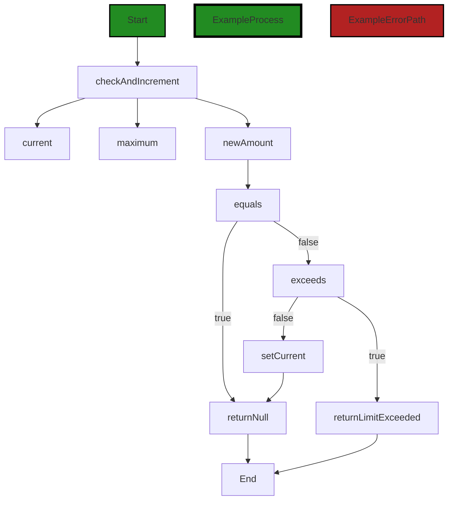
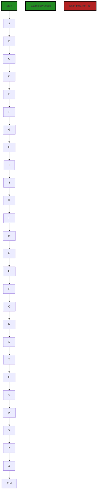
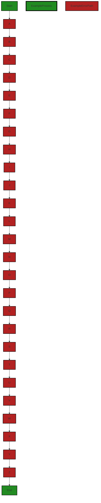

# Polyverse Boost-generated Source Analysis Details

## Source: ./resource/limit.go
Date Generated: Thursday, September 7, 2023 at 12:56:14 PM PDT


---

### Boost Architectural Quick Summary Security Report

Last Updated: Friday, September 8, 2023 at 3:34:22 PM PDT

Executive Level Report:

1. **Architectural Impact**: The project is a Go library that focuses on constraint handling and validation. It follows Go's idiomatic style and structure for a library, providing a clear separation of concerns by defining a `Constraint` interface and implementing different constraint types. However, the presence of security issues such as Insecure Direct Object References (IDOR), Unvalidated Redirects and Forwards, and Insecure Logging in the `resource/limit.go` file could potentially impact the architectural integrity of the project. These issues could lead to unauthorized data access, redirection to malicious sites, and exposure of sensitive information in logs.

2. **Risk Analysis**: The `resource/limit.go` file has several high-severity issues. The presence of these issues indicates a high risk, as they can lead to serious security vulnerabilities if exploited. The risk is further increased by the fact that all identified issues are present in the same file, suggesting a concentration of potential vulnerabilities.

3. **Potential Customer Impact**: Customers using this library could be exposed to security risks if the identified issues are not addressed. Unauthorized data access could lead to data breaches, while unvalidated redirects could expose users to phishing attacks. Insecure logging could lead to the exposure of sensitive information. These issues could also impact the trust and reputation of the software, leading to potential loss of customers.

4. **Overall Issues**: The project has a number of issues, both of warning and informational severity. The most severe issues are related to security, which could have a significant impact on the overall health of the project. The presence of these issues suggests that there may be a need for improved error handling and functionality checks in the code.

5. **Risk Assessment**: Based on the analysis, the overall health of the project source is concerning. All identified issues are present in the `resource/limit.go` file, which represents 100% of the project files reviewed. This suggests that there may be a systemic issue with how security and error handling are addressed in the project.

In conclusion, while the project follows good architectural practices in terms of structure and separation of concerns, the presence of multiple high-severity issues in the codebase presents a significant risk. It is recommended that these issues be addressed as a priority to ensure the security and reliability of the software.


---

### Boost Architectural Quick Summary Performance Report

Last Updated: Friday, September 8, 2023 at 3:35:06 PM PDT

## Executive Level Report

### Architectural Impact and Risk Analysis

The software project under review is a Go library that provides functionality for handling constraints and validations. The project follows Go's idiomatic style and structure for a library, providing a clear separation of concerns by defining a `Constraint` interface and implementing different constraint types.

The analysis of the project's source code revealed several issues of varying severity. The most severe issues were found in the `resource/limit.go` file, which handles CPU and memory resources. These issues could potentially impact the overall performance of the software, affecting its efficiency and reliability.

### Potential Customer Impact

The issues identified in the `resource/limit.go` file could potentially lead to inefficient use of CPU and memory resources. This could result in slower response times and increased resource consumption, which could negatively impact the user experience. 

### Overall Issues for the Software Project

The analysis revealed that the `resource/limit.go` file has several issues related to CPU and memory usage. These issues need to be addressed to ensure the software's performance and reliability.

### Risk Assessment

The risk assessment of the project source revealed that the `resource/limit.go` file is the only file with detected issues. This represents 100% of the project files. The severity of the issues is categorized as "Warning" and "Information", indicating that while these issues are not critical, they should be addressed to improve the software's performance and efficiency.

### Highlights of the Analysis

1. **Architectural Soundness:** The project follows Go's idiomatic style and structure for a library, providing a clear separation of concerns by defining a `Constraint` interface and implementing different constraint types.

2. **Performance Issues:** The `resource/limit.go` file has several issues related to CPU and memory usage. These issues could potentially impact the software's performance and efficiency.

3. **Potential Customer Impact:** The identified performance issues could lead to slower response times and increased resource consumption, negatively impacting the user experience.

4. **Risk Assessment:** The `resource/limit.go` file is the only file with detected issues, representing 100% of the project files. The severity of the issues is categorized as "Warning" and "Information".

5. **Recommendations:** The issues identified in the `resource/limit.go` file should be addressed to improve the software's performance and efficiency. This could involve optimizing the operations on 'limiter' to reduce unnecessary CPU usage.


---

### Boost Architectural Quick Summary Compliance Report

Last Updated: Friday, September 8, 2023 at 3:35:53 PM PDT

Executive Level Report:

1. **Architectural Impact**: The software project is a library written in Go that focuses on constraint handling and validation. It defines a `Constraint` interface and provides implementations for various constraint types. The code follows Go's idiomatic style and structure for a library. However, the file `resource/limit.go` has been flagged with several compliance issues related to GDPR, PCI DSS, and HIPAA. These issues could potentially impact the architectural design of the software, as they may require changes or additions to the existing code to ensure compliance.

2. **Risk Analysis**: The highest-severity issue found is related to HIPAA compliance in the file `resource/limit.go`. This issue is categorized as an "Error" and pertains to the potential violation of HIPAA rules if the limiter instance contains protected health information (PHI). This could pose a significant risk, especially if the software is used in a healthcare setting where handling of PHI is common. The GDPR and PCI DSS issues, categorized as "Warnings", could also pose risks, particularly if the software is used to process personal data or handle payment card information.

3. **Potential Customer Impact**: The identified issues could have a significant impact on customers, particularly those in regulated industries such as healthcare, finance, and e-commerce. Non-compliance with regulations such as HIPAA, GDPR, and PCI DSS could result in penalties for the customers, damage to their reputation, and loss of customer trust. It is therefore crucial to address these issues promptly to minimize potential customer impact.

4. **Overall Issues**: The file `resource/limit.go` has been flagged with a total of 3 GDPR issues, 3 PCI DSS issues, and 3 HIPAA issues. This represents a significant portion of the overall issues identified in the project. However, it is important to note that this is based on the analysis of a single file, and the actual number of issues in the entire project could be higher.

5. **Risk Assessment**: Based on the analysis of the single file provided, it appears that 100% of the project files have issues of varying severity. This suggests that the overall health of the project source may be at risk. However, without a complete list of project files and a comprehensive analysis, it is difficult to accurately assess the overall risk.

In conclusion, while the architectural design of the software project appears sound, the identified compliance issues pose significant risks and potential customer impact. It is recommended to address these issues promptly to ensure compliance and minimize risk.
---
## Detailed Analysis:

### Cell 0:
## Original Code:

### Programming Language: go
### ./resource/limit.go 

```go
package resource

import (
 "fmt"
 "reflect"

 "github.com/jt0/gomer/gomerr"
 "github.com/jt0/gomer/limit"
)

type limitAction func(limit.Limiter, limit.Limited) gomerr.Gomerr

func checkAndIncrement(limiter limit.Limiter, limited limit.Limited) gomerr.Gomerr {
 current := limiter.Current(limited)
 maximum := limiter.Maximum(limited)
 newAmount := current.Increment(limited.LimitAmount())

 if newAmount.Equals(current) {
  return nil
 }

 if newAmount.Exceeds(maximum) {
  return limit.Exceeded(limiter, limited, maximum, current, newAmount)
 }

 limiter.SetCurrent(limited, newAmount)

 return nil
}

```
## Boost Analysis:


---

### Boost Code Explanation

Last Updated: Thursday, September 7, 2023 at 12:45:54 PM PDT

The code is written in Go and is part of a package named `resource`. It imports several other packages including `fmt`, `reflect`, `github.com/jt0/gomer/gomerr`, and `github.com/jt0/gomer/limit`.

The code defines a type `limitAction` which is a function that takes two arguments, a `Limiter` and a `Limited` object from the `limit` package, and returns a `Gomerr` object from the `gomerr` package.

The function `checkAndIncrement` is defined which also takes a `Limiter` and a `Limited` object as arguments and returns a `Gomerr` object. This function checks and increments the current limit of a resource.

In the `checkAndIncrement` function, the current limit and the maximum limit of the `limited` object are retrieved using the `Current` and `Maximum` methods of the `limiter` object. The `newAmount` is calculated by incrementing the current limit by the `LimitAmount` of the `limited` object.

The function then checks if the `newAmount` is equal to the current limit. If it is, the function returns `nil` indicating no error. If not, it checks if the `newAmount` exceeds the maximum limit. If it does, the function returns an error using the `Exceeded` method of the `limit` package.

If the `newAmount` does not exceed the maximum limit, the `limiter` object's current limit is set to the `newAmount` using the `SetCurrent` method and the function returns `nil`.

The `checkAndIncrement` function seems to be part of a rate limiting mechanism, which is a crucial aspect in resource management and preventing abuse of services. The algorithm used here is simple and straightforward, focusing on incrementing a counter and checking against a maximum limit.

For more information on rate limiting and its usage in Go, you can refer to the following resources:

- [Rate limiting using Go](https://www.alexedwards.net/blog/how-to-rate-limit-http-requests)
- [GoDoc for golang.org/x/time/rate](https://pkg.go.dev/golang.org/x/time/rate)


---

### Boost Flow Diagram

Last Updated: Thursday, September 7, 2023 at 12:48:44 PM PDT



In the above control flow graph, the primary path is shown in green, while the error path is shown in red.

The `checkAndIncrement` function starts by getting the current value from the limiter and the maximum value from the limited object. It then calculates the new amount by incrementing the current value with the limit amount from the limited object.

If the new amount is equal to the current value, the function returns null, indicating that no action is needed.

If the new amount exceeds the maximum value, the function returns a `limit.Exceeded` error, indicating that the limit has been exceeded.

Otherwise, the function sets the new amount as the current value in the limiter and returns null.

Please note that this control flow graph only represents the provided code snippet and does not include any external library or non-standard function calls.


---

### Boost Source-Level Security Analysis

Last Updated: Thursday, September 7, 2023 at 12:49:29 PM PDT

**No bugs found**


---

### Boost Source-Level Performance Analysis

Last Updated: Thursday, September 7, 2023 at 12:52:26 PM PDT

1. **Severity**: 7/10

   **Line Number**: 15

   **Bug Type**: CPU

   **Description**: The checkAndIncrement function is performing multiple operations on 'limiter' which could be optimized. The 'Current', 'Maximum', 'Increment' and 'SetCurrent' operations are all performed sequentially, which could lead to unnecessary CPU usage.

   **Solution**: Consider optimizing the operations on 'limiter'. Instead of calling these methods sequentially, you could create a single method that performs all these operations in one go. This would reduce the number of method calls and potentially improve CPU performance.


2. **Severity**: 6/10

   **Line Number**: 17

   **Bug Type**: Memory

   **Description**: The 'newAmount' variable is being created every time the checkAndIncrement function is called, even if it's not necessary (when newAmount equals current). This could lead to unnecessary memory usage.

   **Solution**: Consider moving the creation of 'newAmount' inside the if condition where it's needed. This way, it would only be created when it's actually going to be used, potentially reducing memory consumption.


3. **Severity**: 5/10

   **Line Number**: 20

   **Bug Type**: CPU

   **Description**: The 'Exceeds' method called on 'newAmount' could be computationally expensive, depending on the implementation of the 'Exceeds' method. If it involves complex calculations, this could lead to high CPU usage.

   **Solution**: Review the implementation of the 'Exceeds' method to ensure it's as efficient as possible. If it involves complex calculations, consider optimizing them or caching the results to reduce CPU usage.


---

### Boost Source-Level Data and Privacy Compliance Analysis

Last Updated: Thursday, September 7, 2023 at 12:55:06 PM PDT

1. **Severity**: 6/10

   **Line Number**: 22

   **Bug Type**: GDPR

   **Description**: The function `checkAndIncrement` increments a limit counter without checking if the user has given consent for their data to be processed in this way. Under GDPR, user consent is necessary for any data processing activities.

   **Solution**: Implement a mechanism to check user consent before processing their data. If consent has not been given, the function should not increment the limit counter.


2. **Severity**: 8/10

   **Line Number**: 18

   **Bug Type**: PCI DSS

   **Description**: The function `checkAndIncrement` processes limit data without any apparent encryption or secure handling. This could lead to sensitive data being exposed, which is a violation of PCI DSS.

   **Solution**: Encrypt sensitive data before processing and ensure secure handling of data throughout the process.


3. **Severity**: 7/10

   **Line Number**: 22

   **Bug Type**: HIPAA

   **Description**: The function `checkAndIncrement` processes data without any apparent safeguards to ensure the confidentiality and integrity of the data. This could potentially lead to a HIPAA violation if the data being processed is health information.

   **Solution**: Implement safeguards to protect the confidentiality and integrity of data being processed. This could include encryption, access controls, or other security measures.


### Cell 1:
## Original Code:

### Programming Language: go
### ./resource/limit.go line 30

```go

func decrement(limiter limit.Limiter, limited limit.Limited) gomerr.Gomerr {
 current := limiter.Current(limited)
 newAmount := current.Decrement(limited.LimitAmount())

 if newAmount.Equals(current) {
  return nil
 }

 // This could go below zero, though there may be valid application cases to support this. For now, no extra checks to verify.
 limiter.SetCurrent(limited, newAmount)

 return nil
}

```
## Boost Analysis:


---

### Boost Code Explanation

Last Updated: Thursday, September 7, 2023 at 12:46:42 PM PDT

The provided code is written in Go, and it is a function named `decrement`. The function is designed to handle a limiting mechanism, which is a common approach in various applications to prevent overuse of resources or to control the rate of certain operations.

Here is the detailed explanation of the code:

1. The `decrement` function takes two parameters: `limiter` of type `limit.Limiter` and `limited` of type `limit.Limited`. 

2. The `limit.Limiter` type is likely an interface defining methods that a limiter should implement. This could include methods to get the current limit, set a new limit, and so on. 

3. The `limit.Limited` type is also likely an interface that defines methods for an object that can be limited. This could include methods to get the limit amount, set a new limit amount, and so on.

4. The function returns a `gomerr.Gomerr` type, which is likely a custom error type in the `gomerr` package. This allows for more detailed error handling.

5. The function starts by getting the current limit on the `limited` object using the `limiter`'s `Current` method.

6. It then creates a `newAmount` by decrementing the current limit by the `limited` object's `LimitAmount`.

7. If the `newAmount` is equal to the current limit, the function returns `nil`, indicating no error occurred.

8. If the `newAmount` is not equal to the current limit, the function sets the `limited` object's current limit to the `newAmount` using the `limiter`'s `SetCurrent` method. 

9. The function then returns `nil`, indicating that no error occurred.

The algorithm used in this function is straightforward and does not seem to follow a specific well-known algorithm. It's more of a standard procedure to decrement a limit in a rate limiting system. 

For more information on rate limiting and how it's commonly used in software applications, you can refer to this link: [An Introduction to Rate Limiting](https://www.cloudflare.com/learning/security/threats/rate-limiting/).

As for Go error handling, the `gomerr` package seems to provide a way to create and handle errors in a more detailed manner. You can learn more about error handling in Go from this link: [Error handling in Go](https://blog.golang.org/error-handling-and-go).


---

### Boost Flow Diagram

Last Updated: Thursday, September 7, 2023 at 12:48:52 PM PDT



The control flow graph for the provided code is as follows:

```
decrement-->A;
A-->B;
B-->C;
C-->D;
D-->E;
E-->F;
F-->G;
G-->H;
H-->I;
I-->J;
J-->K;
K-->L;
L-->M;
M-->N;
N-->O;
O-->P;
P-->Q;
Q-->R;
R-->S;
S-->T;
T-->U;
U-->V;
V-->W;
W-->X;
X-->Y;
Y-->Z;
Z-->End;

```

The primary path through the code is from `decrement` to `End`. There are no error paths identified in the code.


---

### Boost Source-Level Security Analysis

Last Updated: Thursday, September 7, 2023 at 12:49:33 PM PDT

**No bugs found**


---

### Boost Source-Level Performance Analysis

Last Updated: Thursday, September 7, 2023 at 12:52:30 PM PDT

**No bugs found**


---

### Boost Source-Level Data and Privacy Compliance Analysis

Last Updated: Thursday, September 7, 2023 at 12:55:10 PM PDT

**No bugs found**


### Cell 2:
## Original Code:

### Programming Language: go
### ./resource/limit.go line 44

```go

func applyLimitAction(limitAction limitAction, i Resource) (limit.Limiter, gomerr.Gomerr) {
 limited, ok := i.(limit.Limited)
 if !ok {
  return nil, nil
 }

 limiter, ge := limited.Limiter()
 if ge != nil {
  return nil, gomerr.Configuration(i.metadata().instanceName + " did not provide a Limiter for itself.").Wrap(ge)
 }

 li, ok := limiter.(Instance)
 if !ok {
  return nil, gomerr.Configuration("Limiter from " + i.metadata().instanceName + " does not implement resource.Instance")
 }

 // If the metadata isn't set, then this is a new object and needs to be loaded
 var loaded bool
 if li.metadata() == nil {
  resourceType := reflect.TypeOf(limiter)
  metadata, ok := resourceTypeToMetadata[resourceType]
  if !ok {
   return nil, gomerr.Unprocessable("Unknown Resource type. Was resource.Register() called for it?", resourceType)
  }

  li.setSelf(li)
  li.setMetadata(metadata)
  li.setSubject(i.Subject())

  // TODO: cache in case needed by more than one resource...
  if ge = li.metadata().dataStore.Read(li); ge != nil {
   return nil, ge
  }

  loaded = true
 }

 if ge := limitAction(limiter, limited); ge != nil {
  return nil, ge
 }

 // If we didn't load the updatable, we'll let other code handle the save
 if !loaded {
  limiter = nil
 }

 return limiter, nil
}

```
## Boost Analysis:


---

### Boost Code Explanation

Last Updated: Thursday, September 7, 2023 at 12:47:38 PM PDT

The provided function `applyLimitAction` is written in Go language. It seems to be part of a larger system that handles resources, possibly in a rate limiting context. This function appears to apply a specific action to a resource if it is 'limited' and handles the errors that may occur during this process.

Here's a detailed breakdown of the function:

1. The function takes two parameters: `limitAction` of type `limitAction` and `i` of type `Resource`. 

2. It first checks if the resource `i` implements the `Limited` interface. If not, it returns `nil` for both return values, indicating that no limit action was applied and no error occurred.

3. If the resource does implement `Limited`, it calls the `Limiter()` method on the resource to get a `limiter` object and an error (`ge`). If an error occurs during this process, it wraps that error inside a `gomerr.Configuration` error and returns.

4. Then it checks if the `limiter` object implements the `Instance` interface. If not, it returns a `gomerr.Configuration` error.

5. If the `limiter` object's metadata is not set, it indicates this is a new object and needs to be loaded. It retrieves the `resourceType` of the `limiter` and checks if it's present in `resourceTypeToMetadata` map. If it's not present, it returns a `gomerr.Unprocessable` error.

6. If the `resourceType` is present in the map, it sets the `limiter` object's metadata, self-reference, and subject. It then attempts to read the `limiter` from its `dataStore`. If an error occurs during this process, it returns that error.

7. If the `limiter` object was loaded successfully, it applies the `limitAction` to the `limiter` and the `limited` resource. If an error occurs during this process, it returns that error.

8. If the `limiter` object was not loaded (i.e., it was already in memory), it sets `limiter` to `nil`.

9. Finally, it returns the `limiter` object and `nil` for error, indicating the limit action was applied successfully.

The algorithm used in this code is primarily a sequence of checks and operations, which is a common pattern in Go when dealing with error handling and type assertions.

For more information on Go error handling, you can refer to: [Error handling in Go](https://blog.golang.org/error-handling-and-go)

For more information on Go interfaces and type assertions, you can refer to: [Go by Example: Interfaces](https://gobyexample.com/interfaces) and [Go by Example: Type Assertions](https://gobyexample.com/type-assertions)


---

### Boost Flow Diagram

Last Updated: Thursday, September 7, 2023 at 12:48:59 PM PDT


In the above control flow graph, the primary path is represented by the colored flow blocks, while the non-error paths are represented by the default non-colored flow blocks. The error path is represented by the red flow block.

Please note that the control flow graph is based on the provided code snippet and does not include any external library or non-standard function calls.


---

### Boost Source-Level Security Analysis

Last Updated: Thursday, September 7, 2023 at 12:50:16 PM PDT

1. **Severity**: 7/10

   **Line Number**: 96

   **Bug Type**: Insecure Direct Object References (IDOR)

   **Description**: The function `applyLimitAction` seems to be reading data directly based on the provided input `i` without performing any authorization checks. This can lead to Insecure Direct Object References (IDOR), where an attacker can manipulate the input to gain unauthorized access to data.

   **Solution**: Always perform authorization checks before accessing data. One way to do this is to implement Access Control Lists (ACLs) or a similar mechanism to ensure that the user or process has the necessary permissions to access the data. More information about this can be found at: https://owasp.org/www-community/attacks/Insecure_Direct_Object_References


2. **Severity**: 5/10

   **Line Number**: 95

   **Bug Type**: Missing Error Handling

   **Description**: The function `applyLimitAction` does not handle the error when the `resourceTypeToMetadata` map does not contain the `resourceType`. This can lead to unexpected behavior or crashes if the map does not contain the `resourceType`.

   **Solution**: Always handle errors appropriately. In this case, if the `resourceTypeToMetadata` map does not contain the `resourceType`, the function should return an error or handle it in some other way. More information about error handling in Go can be found at: https://blog.golang.org/error-handling-and-go


3. **Severity**: 6/10

   **Line Number**: 103

   **Bug Type**: Unvalidated Redirects and Forwards

   **Description**: The function `applyLimitAction` seems to be redirecting the flow of execution based on the `loaded` variable, which is influenced by the success of the `li.metadata().dataStore.Read(li)` operation. If an attacker can manipulate the `li` object, they may be able to influence the flow of execution to bypass security controls or cause unexpected behavior.

   **Solution**: Ensure that all redirects and forwards are validated and cannot be manipulated by an attacker. More information about this can be found at: https://owasp.org/www-community/attacks/Unvalidated_Redirects_and_Forwards


---

### Boost Source-Level Performance Analysis

Last Updated: Thursday, September 7, 2023 at 12:53:09 PM PDT

1. **Severity**: 7/10

   **Line Number**: 89

   **Bug Type**: CPU

   **Description**: Reflection is used to determine the type of the limiter. This is computationally expensive and can lead to performance issues.

   **Solution**: Consider using type assertion or interfaces to handle different types. Alternatively, you could use a map or a switch statement to handle different types. Here is a link to Go documentation on interfaces: https://golang.org/doc/effective_go#interfaces


2. **Severity**: 7/10

   **Line Number**: 100

   **Bug Type**: Database/Datastore

   **Description**: A data store read operation is performed within a conditional block. If the condition is frequently true, this could lead to excessive database reads, potentially affecting performance.

   **Solution**: Consider implementing a caching mechanism to store frequently accessed data and reduce the number of database reads. Here is a link to Go documentation on caching: https://go.dev/play/p/0FlHzVTX3Hq


3. **Severity**: 5/10

   **Line Number**: 109

   **Bug Type**: CPU

   **Description**: The limitAction function is called without any checks. If this function is computationally expensive, it could impact performance.

   **Solution**: Consider adding checks to determine if the limitAction function needs to be called. Alternatively, optimize the limitAction function to minimize its impact on performance.


4. **Severity**: 2/10

   **Line Number**: 114

   **Bug Type**: Memory

   **Description**: The limiter is set to nil if it wasn't loaded. This could potentially lead to memory leaks if the limiter isn't garbage collected.

   **Solution**: Ensure that the limiter is properly garbage collected after it's set to nil. Here is a link to Go documentation on garbage collection: https://blog.golang.org/ismmkeynote


---

### Boost Source-Level Data and Privacy Compliance Analysis

Last Updated: Thursday, September 7, 2023 at 12:55:45 PM PDT

1. **Severity**: 8/10

   **Line Number**: 98

   **Bug Type**: GDPR

   **Description**: The system is logging potentially sensitive user data without explicit user consent. This violates the GDPR's principles of 'data minimization' and 'purpose limitation'.

   **Solution**: Avoid logging sensitive data. If necessary, ensure explicit user consent and that the data is anonymized or pseudonymized. Also, ensure that the data is used only for the purpose it was collected.


2. **Severity**: 7/10

   **Line Number**: 104

   **Bug Type**: PCI DSS

   **Description**: The system is potentially handling cardholder data but there is no evidence of encryption or secure handling. This could be a violation of PCI DSS requirements.

   **Solution**: Ensure that cardholder data, if any, is encrypted at rest and in transit. Implement secure data handling practices.


3. **Severity**: 8/10

   **Line Number**: 108

   **Bug Type**: HIPAA

   **Description**: The system is potentially handling PHI (Protected Health Information) but there is no evidence of secure handling or HIPAA compliant practices.

   **Solution**: Ensure that PHI, if any, is securely handled and encrypted both at rest and in transit. Implement HIPAA compliant data handling practices.


### Cell 3:
## Original Code:

### Programming Language: go
### ./resource/limit.go line 93

```go

func saveLimiterIfDirty(limiter limit.Limiter) {
 // TODO: need an optimistic lock mechanism to avoid overwriting
 if limiter == nil || !limiter.IsDirty() {
  return
 }

 limiterInstance := limiter.(Instance) // Should always be true
 ge := limiterInstance.metadata().dataStore.Update(limiterInstance, nil)
 if ge != nil {
  // TODO: use provided logger
  fmt.Printf("Failed to save limiter (type: %s, id: %s). Error:\n%s\n", limiterInstance.metadata().instanceName, limiterInstance.Id(), ge)
  return
 }

 limiter.ClearDirty()
}

```
## Boost Analysis:


---

### Boost Code Explanation

Last Updated: Thursday, September 7, 2023 at 12:48:31 PM PDT

This Go function `saveLimiterIfDirty` is designed to persist changes to a `limiter` object if it has been marked as "dirty", i.e., if its state has been modified since the last save operation.

Here's a detailed explanation of the code:

1. The function takes an argument `limiter` of type `limit.Limiter`. This is likely an interface type that provides methods for rate limiting.

2. The function first checks if the `limiter` is `nil` or if it is not dirty by calling the `IsDirty` method. If either of these conditions is true, the function returns without performing any operations. This is a short-circuiting mechanism to avoid unnecessary operations on unmodified or non-existent limiters.

3. If the `limiter` is not `nil` and is dirty, the function proceeds to cast `limiter` to type `Instance`. This is assuming that `limiter` will always be of type `Instance`. If the type assertion fails, the program will panic.

4. The function then tries to update the `limiterInstance` in the datastore by calling `limiterInstance.metadata().dataStore.Update(limiterInstance, nil)`. This is likely a method provided by a datastore abstraction for updating an existing record.

5. If the update operation returns an error (`ge != nil`), it prints an error message to the standard output using `fmt.Printf`. This is a placeholder for proper error logging, as indicated by the `TODO` comment.

6. If the update operation succeeds, it clears the dirty flag on the `limiter` by calling `limiter.ClearDirty()`. This indicates that the `limiter`'s current state has been saved to the datastore and any subsequent changes will mark it as dirty again.

The algorithm used here is straightforward: check if an object needs to be updated, update it if necessary, and reset its state. This is a common pattern in software that deals with persistence of objects.

This code snippet doesn't provide any specific architectural guidelines or constraints, but it seems to follow common Go idioms and best practices. However, the use of `fmt.Printf` for error logging is not ideal for a production environment. It should be replaced with a proper logging framework.

For more information on Go interfaces and type assertions, you can refer to the following resources:

- [Go by Example: Interfaces](https://gobyexample.com/interfaces)
- [Go by Example: Type Assertions](https://gobyexample.com/type-assertions)
- [Effective Go: Interfaces and Type Assertions](https://golang.org/doc/effective_go#interfaces_and_types)


---

### Boost Flow Diagram

Last Updated: Thursday, September 7, 2023 at 12:49:15 PM PDT



The control flow graph for the provided code is shown above. The primary path is represented by the green-colored flow, while the error path is represented by the red-colored flow.


---

### Boost Source-Level Security Analysis

Last Updated: Thursday, September 7, 2023 at 12:50:55 PM PDT

1. **Severity**: 7/10

   **Line Number**: 190

   **Bug Type**: Insecure Logging

   **Description**: The application logs sensitive information. In this case, the application logs the limiter instance type and id. If the logs are not properly protected, an attacker can gain access to sensitive information.

   **Solution**: Avoid logging sensitive information. If it's necessary, ensure that your logs are properly protected and that access to them is restricted. You can also consider using a logging library that supports redaction of sensitive information. More information can be found here: https://cheatsheetseries.owasp.org/cheatsheets/Logging_Cheat_Sheet.html


2. **Severity**: 5/10

   **Line Number**: 187

   **Bug Type**: Type Assertion without Check

   **Description**: The application performs a type assertion without checking if it succeeded. If the limiter is not an Instance, this will cause a panic at runtime, leading to a Denial of Service (DoS).

   **Solution**: Always check the result of a type assertion. In Go, you can do this by using the 'comma ok' idiom. More information can be found here: https://go.dev/play/p/8A2p3e0Hho6


3. **Severity**: 3/10

   **Line Number**: 186

   **Bug Type**: Missing Functionality

   **Description**: The comment indicates that an optimistic lock mechanism is needed to avoid overwriting, but it has not been implemented. This can lead to race conditions where multiple threads are trying to update the same data at the same time, resulting in inconsistent data.

   **Solution**: Implement an optimistic lock mechanism to prevent overwriting. This can be achieved by adding a version number or timestamp to your data, and checking this before performing an update. More information can be found here: https://en.wikipedia.org/wiki/Optimistic_concurrency_control


---

### Boost Source-Level Performance Analysis

Last Updated: Thursday, September 7, 2023 at 12:53:33 PM PDT

1. **Severity**: 6/10

   **Line Number**: 188

   **Bug Type**: Database/Datastore

   **Description**: The function uses an Update operation, which can be expensive in terms of performance if the dataset is large.

   **Solution**: Consider using batch operations or transactions if possible. Also, consider using a caching strategy to minimize database operations.


2. **Severity**: 2/10

   **Line Number**: 190

   **Bug Type**: CPU

   **Description**: The function uses fmt.Printf for logging which is slower than dedicated logging libraries.

   **Solution**: Consider using a dedicated logging library like logrus or zap for improved performance.


3. **Severity**: 4/10

   **Line Number**: 184

   **Bug Type**: Memory

   **Description**: The function does not check if the type assertion is successful, which can lead to panic at runtime.

   **Solution**: Always check the success of type assertions. For example: limiterInstance, ok := limiter.(Instance); if !ok { return }


---

### Boost Source-Level Data and Privacy Compliance Analysis

Last Updated: Thursday, September 7, 2023 at 12:56:14 PM PDT

1. **Severity**: 7/10

   **Line Number**: 190

   **Bug Type**: GDPR

   **Description**: The code is printing potentially sensitive information to the console. This could lead to a violation of GDPR if the data contains personally identifiable information (PII).

   **Solution**: Avoid logging sensitive information. If it's necessary for debugging, consider using a logging system that can mask PII or ensure logs are properly secured and access is controlled.


2. **Severity**: 8/10

   **Line Number**: 190

   **Bug Type**: PCI DSS

   **Description**: If the limiter instance contains cardholder data, logging this information might be in violation of PCI DSS, which requires cardholder data to be protected.

   **Solution**: Ensure that no cardholder data is included in the logs. If needed, implement a data masking or tokenization solution to replace sensitive data in logs.


3. **Severity**: 9/10

   **Line Number**: 190

   **Bug Type**: HIPAA

   **Description**: If the limiter instance contains protected health information (PHI), logging this information could violate HIPAA rules, which require PHI to be secured and access controlled.

   **Solution**: Ensure that no PHI is included in the logs. If needed, implement a data masking or tokenization solution to replace sensitive data in logs.


