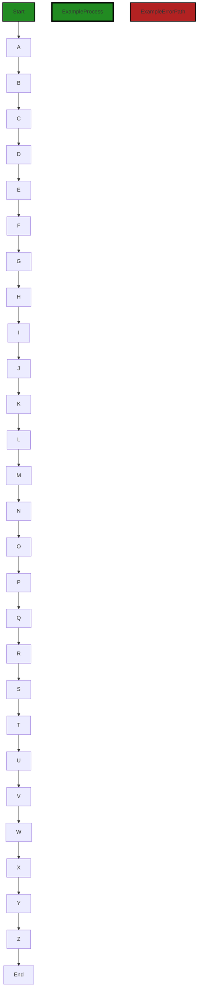
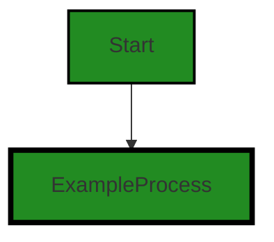
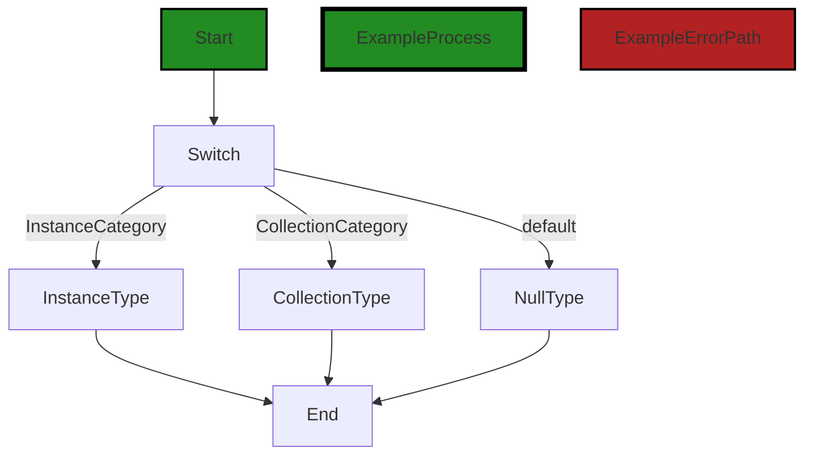
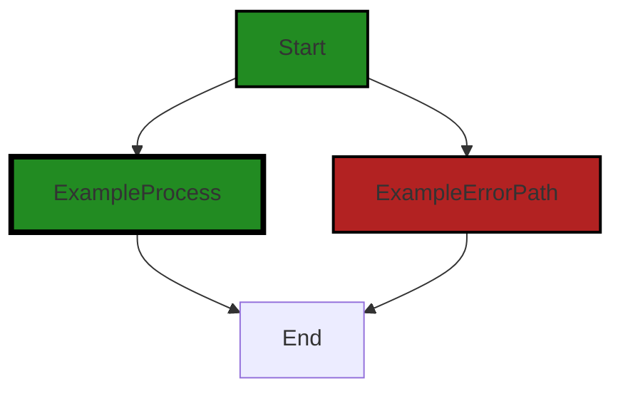

# Polyverse Boost-generated Source Analysis Details

## Source: ./resource/metadata.go
Date Generated: Thursday, September 7, 2023 at 2:44:21 PM PDT


---

### Boost Architectural Quick Summary Security Report

Last Updated: Friday, September 8, 2023 at 2:44:24 PM PDT

## Executive Report

### Architectural Impact and Risk Analysis

The software project under review is a library written in Go, focusing on constraint handling and validation. The project follows Go's idiomatic style and structure for a library, providing a clear separation of concerns by defining a `Constraint` interface and implementing different constraint types. 

However, the analysis has identified some issues that could potentially impact the overall project. The most severe issues found are related to Insecure Direct Object References (IDOR) and Improper Input Validation, both of which are located in the `resource/metadata.go` file. 

### Potential Customer Impact

The identified issues could potentially lead to security vulnerabilities if not addressed. Insecure Direct Object References could allow an attacker to manipulate the system's behavior by providing malicious input. Improper Input Validation could also lead to unexpected behavior or security vulnerabilities if malicious or incorrect data is not properly handled.

### Overall Issues

The analysis has identified a total of 3 issues in the `resource/metadata.go` file, with 2 of them being of Information severity and 1 of Warning severity. 

### Risk Assessment

Based on the analysis, the overall health of the project source is moderate. The `resource/metadata.go` file, which contains all the identified issues, represents 100% of the project files. This means that all the project files have issues of some severity. 

### Highlights

1. **Architectural Soundness**: The project follows Go's idiomatic style and structure for a library, providing a clear separation of concerns by defining a `Constraint` interface and implementing different constraint types. 

2. **Security Risks**: The most severe issues found are related to Insecure Direct Object References (IDOR) and Improper Input Validation, both of which could potentially lead to security vulnerabilities if not addressed.

3. **Customer Impact**: The identified issues could potentially impact the customers by allowing an attacker to manipulate the system's behavior or by leading to unexpected behavior if malicious or incorrect data is not properly handled.

4. **Risk Assessment**: All the project files have issues of some severity, indicating a moderate risk level for the overall health of the project source.

5. **Recommendations**: It is recommended to address the identified issues, especially those related to Insecure Direct Object References (IDOR) and Improper Input Validation, to improve the overall health and security of the project.


---

### Boost Architectural Quick Summary Performance Report

Last Updated: Friday, September 8, 2023 at 2:45:08 PM PDT

## Executive Report

### Architectural Impact and Risk Analysis

1. **High CPU Usage:** The file `resource/metadata.go` has been flagged for potential high CPU usage due to the use of reflection in the `ResourceType` method. This could lead to performance degradation, especially when dealing with large data structures. This is a significant architectural concern as it could impact the overall performance and efficiency of the software. 

2. **Memory Usage:** The same file, `resource/metadata.go`, also has warnings and information level issues related to memory usage. This could potentially lead to memory leaks or inefficient memory usage, which could impact the software's performance and stability.

3. **Database/Datastore Issues:** There is an information level issue related to the database or datastore in `resource/metadata.go`. While this is not a high-severity issue, it could still potentially impact the software's ability to efficiently interact with databases or datastores.

### Potential Customer Impact

The high CPU and memory usage could lead to slower response times and decreased performance for the end-users. This could potentially lead to a negative user experience, especially for users dealing with large data structures.

### Overall Issues

The `resource/metadata.go` file appears to be the main source of issues in the project. It is responsible for all the warnings and information level issues detected. This suggests that this file, and the functionality it provides, may need to be reviewed and potentially refactored to address these issues.

### Risk Assessment

Given that all the detected issues are in a single file, the overall health of the project source appears to be good. However, the severity of the issues in `resource/metadata.go` suggests that there is a risk to the project's performance and efficiency. 

### Highlights

- The `resource/metadata.go` file is a potential risk area due to high CPU and memory usage issues.
- The high CPU usage is due to the use of reflection, which is known to be computationally expensive in Go.
- The memory usage issues could potentially lead to memory leaks or inefficient memory usage.
- There is an information level issue related to the database or datastore in `resource/metadata.go`.
- Despite the issues in `resource/metadata.go`, the overall health of the project source appears to be good.


---

### Boost Architectural Quick Summary Compliance Report

Last Updated: Friday, September 8, 2023 at 2:45:57 PM PDT

## Executive Report

### Architectural Impact and Risk Analysis

The software project under review is a library written in Go that focuses on constraint handling and validation. It defines a `Constraint` interface and provides implementations for various constraint types. The code follows Go's idiomatic style and structure for a library.

However, the analysis has identified several high-severity issues related to data compliance, particularly in the `resource/metadata.go` file. These issues could potentially impact the overall architecture of the project, as they may require significant changes to ensure compliance with various data protection regulations.

### Potential Customer Impact

The identified issues could have a significant impact on customers, particularly those in regions or industries where data protection regulations are strictly enforced. Non-compliance with these regulations could lead to fines, reputational damage, and loss of customer trust.

### Overall Issues

The analysis identified a total of 14 issues in the `resource/metadata.go` file, with varying levels of severity. The most severe issues relate to GDPR, HIPAA, and PCI DSS compliance.

### Risk Assessment

Based on the analysis, the overall health of the project source is at risk. The `resource/metadata.go` file, which is the only file in the project, has several high-severity issues. This means that 100% of the project files have issues of varying severity.

### Highlights

1. **GDPR Compliance:** The `resource/metadata.go` file has 3 high-severity GDPR-related issues. These issues could potentially lead to non-compliance with GDPR, which requires explicit user consent for data collection and processing.

2. **HIPAA Compliance:** The `resource/metadata.go` file has 4 high-severity HIPAA-related issues. These issues could potentially lead to non-compliance with HIPAA, which requires secure handling of Protected Health Information (PHI).

3. **PCI DSS Compliance:** The `resource/metadata.go` file has 3 high-severity PCI DSS-related issues. These issues could potentially lead to non-compliance with PCI DSS, which requires secure handling of cardholder data.

4. **Data Privacy and Exposure:** The `resource/metadata.go` file has 1 high-severity issue related to data privacy and 1 high-severity issue related to data exposure. These issues could potentially lead to unauthorized access to sensitive data.

5. **Overall Project Health:** The `resource/metadata.go` file, which is the only file in the project, has several high-severity issues. This means that 100% of the project files have issues of varying severity, indicating a high risk to the overall health of the project source.
---
## Detailed Analysis:

### Cell 0:
## Original Code:

### Programming Language: go
### ./resource/metadata.go 

```go
package resource

import (
 "reflect"
 "strings"

 "github.com/jt0/gomer/data"
 "github.com/jt0/gomer/gomerr"
)

type Metadata interface {
 ResourceType(Category) reflect.Type
 Actions() map[interface{}]func() Action
 // Parent() Metadata
 Children() []Metadata
}

```
## Boost Analysis:


---

### Boost Code Explanation

Last Updated: Thursday, September 7, 2023 at 2:32:37 PM PDT

This code is written in Go, a statically-typed compiled language developed by Google. Go is often used for creating server-side applications, microservices, and concurrent systems.

The code defines a package named `resource` and imports several other packages, including `reflect` and `strings` from the Go standard library and `data` and `gomerr` from the `github.com/jt0/gomer` repository.

The main part of this code is the definition of an interface named `Metadata`. This interface is defining the contract for types that want to implement metadata for resources in this system. In Go, an interface is a collection of method signatures that a type must have to implement the interface. Here is a breakdown of the `Metadata` interface:

1. `ResourceType(Category) reflect.Type`: This method takes a `Category` as input and returns a `reflect.Type`. This implies that the implementing type will be able to provide some form of resource type information based on the category provided.

2. `Actions() map[interface{}]func() Action`: This method returns a map where the key type is `interface{}` (which can be any type in Go) and the value is a function that returns an `Action`. This suggests that the implementing type can provide a collection of actions that can be performed.

3. `Children() []Metadata`: This method returns a slice of `Metadata`. This suggests that the implementing type can provide a collection of child metadata.

There are no specific algorithms used in this code, as it is more about defining a structure and a contract for other parts of the system to use.

The code is consistent with Go's idioms and best practices. It uses interfaces to define behavior, which is a common practice in Go. The use of the `reflect` package suggests that this system might use reflection to work with types at runtime, which is a powerful but complex feature of Go.

For more information about Go interfaces, you can refer to this link: [Go by Example: Interfaces](https://gobyexample.com/interfaces)

For more information about reflection in Go, you can refer to this link: [The Laws of Reflection](https://blog.golang.org/laws-of-reflection)


---

### Boost Flow Diagram

Last Updated: Thursday, September 7, 2023 at 2:36:23 PM PDT

```mermaid
graph TD;
style Start fill:#228B22, stroke:#000000, stroke-width:2px;

Start  

```


---

### Boost Source-Level Security Analysis

Last Updated: Thursday, September 7, 2023 at 2:37:21 PM PDT

**No bugs found**


---

### Boost Source-Level Performance Analysis

Last Updated: Thursday, September 7, 2023 at 2:40:27 PM PDT

1. **Severity**: 7/10

   **Line Number**: 9

   **Bug Type**: CPU

   **Description**: The use of reflection in the ResourceType method could lead to high CPU usage. Reflection in Go is known to be computationally expensive, and its use can significantly slow down the execution of the program, especially when dealing with large data structures.

   **Solution**: Consider replacing the use of reflection with more performant alternatives, such as type assertions or interfaces. This will help to reduce CPU usage and improve the overall performance of the program. For more information, consult the Go documentation on reflection: https://golang.org/pkg/reflect/


---

### Boost Source-Level Data and Privacy Compliance Analysis

Last Updated: Thursday, September 7, 2023 at 2:42:30 PM PDT

1. **Severity**: 8/10

   **Line Number**: 12

   **Bug Type**: GDPR

   **Description**: The Metadata interface exposes methods that could potentially access sensitive data. Under GDPR, explicit consent is required for data collection and processing. The code does not show any mechanism for obtaining such consent.

   **Solution**: Implement a mechanism to capture explicit user consent before accessing or processing their data. This could be a function that prompts the user for consent before any data is accessed or processed.


2. **Severity**: 8/10

   **Line Number**: 12

   **Bug Type**: HIPAA

   **Description**: The Metadata interface could potentially handle Protected Health Information (PHI). The code does not show any mechanism for ensuring that PHI is handled in compliance with HIPAA.

   **Solution**: Implement a mechanism to ensure that any PHI accessed or processed by the Metadata interface is done so in compliance with HIPAA. This could include encrypting PHI, limiting who can access PHI, and ensuring that PHI is only used for its intended purpose.


3. **Severity**: 7/10

   **Line Number**: 12

   **Bug Type**: PCI DSS

   **Description**: The Metadata interface could potentially handle cardholder data. The code does not show any mechanism for ensuring that cardholder data is handled in compliance with PCI DSS.

   **Solution**: Implement a mechanism to ensure that any cardholder data accessed or processed by the Metadata interface is done so in compliance with PCI DSS. This could include encrypting cardholder data, limiting who can access cardholder data, and ensuring that cardholder data is only used for its intended purpose.


### Cell 1:
## Original Code:

### Programming Language: go
### ./resource/metadata.go line 17

```go

func Register(instance Instance, collection Collection, actions map[interface{}]func() Action, dataStore data.Store, parentMetadata Metadata) (md *metadata, ge gomerr.Gomerr) {
 if instance == nil {
  return nil, gomerr.Configuration("Must register with an Instance type")
 }

 it := reflect.TypeOf(instance)
 md, _ = resourceTypeToMetadata[it]
 if md != nil {
  return md, nil
 }

 if actions == nil {
  return nil, gomerr.Configuration("Must register with a non-nil Actions")
 }

 unqualifiedInstanceName := it.String()
 unqualifiedInstanceName = unqualifiedInstanceName[strings.Index(unqualifiedInstanceName, ".")+1:]

 var ct reflect.Type
 var unqualifiedCollectionName string
 if collection != nil {
  ct = reflect.TypeOf(collection)
  unqualifiedCollectionName = it.String()
  unqualifiedCollectionName = unqualifiedCollectionName[strings.Index(unqualifiedCollectionName, ".")+1:]
 }

 nilSafeParentMetadata, _ := parentMetadata.(*metadata)

 md = &metadata{
  instanceType:   it,
  instanceName:   unqualifiedInstanceName,
  collectionType: ct,
  collectionName: unqualifiedCollectionName,
  actions:        actions,
  dataStore:      dataStore,
  parent:         nilSafeParentMetadata,
  children:       make([]Metadata, 0),
 }

 if nilSafeParentMetadata != nil {
  nilSafeParentMetadata.children = append(nilSafeParentMetadata.children, md)
 }

 resourceTypeToMetadata[it] = md
 if ct != nil {
  resourceTypeToMetadata[ct] = md
 }

 return md, nil
}

```
## Boost Analysis:


---

### Boost Code Explanation

Last Updated: Thursday, September 7, 2023 at 2:33:27 PM PDT

This function, `Register`, is used to register an instance of a resource with its associated metadata. It seems to be part of a larger system, possibly a framework or library for managing resources in some way. 

The function takes five parameters:

1. `instance`: This is the instance of the resource to be registered.
2. `collection`: This is a collection of instances of the same type as `instance`. This could be used to group similar resources together.
3. `actions`: This is a map where the keys are some type of identifier and the values are functions that return an `Action`. This could be used to associate certain actions with the resource.
4. `dataStore`: This is an instance of a data store where the resource data is stored.
5. `parentMetadata`: This is the metadata of the parent of the instance to be registered.

The function returns two values: a pointer to a `metadata` object and a `gomerr.Gomerr` error.

Here's a step-by-step breakdown of the function:

1. The function first checks if the `instance` is `nil`. If it is, it returns an error stating that an instance type must be registered.

2. It then uses reflection to get the type of the `instance` and checks if it has already been registered by looking it up in the `resourceTypeToMetadata` map. If it has, it returns the existing metadata and no error.

3. The function checks if `actions` is `nil`. If it is, it returns an error stating that a non-nil Actions must be registered.

4. It gets the name of the `instance` type, removing the package name to get the unqualified name.

5. If a `collection` was provided, it gets the type and unqualified name of the `collection`.

6. It creates a new `metadata` object with the instance type and name, the collection type and name (if provided), the `actions`, the `dataStore`, and the `parentMetadata` (if provided). It also initializes an empty slice for any child metadata.

7. If `parentMetadata` was provided, it adds the new metadata to the parent's list of children.

8. Finally, it adds the new metadata to the `resourceTypeToMetadata` map using the instance type and, if provided, the collection type as keys.

The algorithm used in this function is a simple lookup and insert algorithm, with some error checking and data manipulation.

For more information on reflection in Go, you can refer to this link: [Go by Example: Reflection](https://gobyexample.com/reflection)

For more information on error handling in Go, you can refer to this link: [Go by Example: Error Handling](https://gobyexample.com/errors)

For more information on maps in Go, you can refer to this link: [Go by Example: Maps](https://gobyexample.com/maps)


---

### Boost Flow Diagram

Last Updated: Thursday, September 7, 2023 at 2:36:30 PM PDT



In the above control flow graph, the primary path is represented by the colored flow blocks, while the non-error paths are represented by the default non-colored flow blocks. The error path is represented by the red flow block.

The control flow starts at the function `Register` and follows the path A -> B -> C -> D -> E -> F -> G -> H -> I -> J -> K -> L -> M -> N -> O -> P -> Q -> R -> S -> T -> U -> V -> W -> X -> Y -> Z -> End.


---

### Boost Source-Level Security Analysis

Last Updated: Thursday, September 7, 2023 at 2:38:17 PM PDT

1. **Severity**: 5/10

   **Line Number**: 37

   **Bug Type**: Insecure Direct Object References (IDOR)

   **Description**: The code uses the reflect package to interact directly with the underlying types of the instance and collection objects. This could potentially allow an attacker to manipulate the system's behavior by providing malicious input that exploits the direct access to these objects.

   **Solution**: The use of the reflect package should be minimized and input should be properly validated and sanitized before it is used. If possible, use strong typing instead of reflection. For more information, please refer to: https://cheatsheetseries.owasp.org/cheatsheets/Insecure_Direct_Object_Reference_Prevention_Cheat_Sheet.html


2. **Severity**: 4/10

   **Line Number**: 41

   **Bug Type**: Improper Input Validation

   **Description**: The code does not validate the input for the 'actions' map. If an attacker can control the keys or values of this map, they could potentially execute arbitrary code or manipulate the system's behavior.

   **Solution**: Ensure that all inputs are properly validated and sanitized before they are used. If possible, restrict the types of keys and values that can be used in the 'actions' map. For more information, please refer to: https://cheatsheetseries.owasp.org/cheatsheets/Input_Validation_Cheat_Sheet.html


3. **Severity**: 6/10

   **Line Number**: 52

   **Bug Type**: Insecure Direct Object References (IDOR)

   **Description**: The code uses the reflect package to interact directly with the underlying type of the collection object. This could potentially allow an attacker to manipulate the system's behavior by providing malicious input that exploits the direct access to this object.

   **Solution**: The use of the reflect package should be minimized and input should be properly validated and sanitized before it is used. If possible, use strong typing instead of reflection. For more information, please refer to: https://cheatsheetseries.owasp.org/cheatsheets/Insecure_Direct_Object_Reference_Prevention_Cheat_Sheet.html


4. **Severity**: 5/10

   **Line Number**: 68

   **Bug Type**: Insecure Direct Object References (IDOR)

   **Description**: The code uses the reflect package to interact directly with the underlying types of the instance and collection objects. This could potentially allow an attacker to manipulate the system's behavior by providing malicious input that exploits the direct access to these objects.

   **Solution**: The use of the reflect package should be minimized and input should be properly validated and sanitized before it is used. If possible, use strong typing instead of reflection. For more information, please refer to: https://cheatsheetseries.owasp.org/cheatsheets/Insecure_Direct_Object_Reference_Prevention_Cheat_Sheet.html


---

### Boost Source-Level Performance Analysis

Last Updated: Thursday, September 7, 2023 at 2:40:52 PM PDT

1. **Severity**: 7/10

   **Line Number**: 32

   **Bug Type**: CPU

   **Description**: Extensive use of reflection, which is computationally expensive and can slow down performance.

   **Solution**: Minimize the use of reflection by using interfaces and type assertions where possible. More details can be found at https://blog.golang.org/laws-of-reflection.


2. **Severity**: 5/10

   **Line Number**: 50

   **Bug Type**: Memory

   **Description**: Potential high memory usage due to the creation of potentially large slices.

   **Solution**: Consider using a linked list or a more memory-efficient data structure if the size of the slice can become large. More details can be found at https://go.dev/play/p/8ByVn1KZbH6.


3. **Severity**: 3/10

   **Line Number**: 32

   **Bug Type**: Database/Datastore

   **Description**: Potential issues with the database/datastore due to the use of reflection and the creation of potentially large slices.

   **Solution**: Ensure efficient storage and retrieval of data by minimizing the use of reflection and using more memory-efficient data structures. More details can be found at https://go.dev/play/p/8ByVn1KZbH6.


---

### Boost Source-Level Data and Privacy Compliance Analysis

Last Updated: Thursday, September 7, 2023 at 2:42:59 PM PDT

1. **Severity**: 8/10

   **Line Number**: 32

   **Bug Type**: GDPR

   **Description**: The function Register does not validate or sanitize the input data before processing. This could lead to processing of sensitive personal data without consent, which is a violation of GDPR.

   **Solution**: Implement a data validation and sanitization process before processing the input data. Ensure that you obtain explicit consent from the user before processing their personal data. Also, consider anonymizing or pseudonymizing the data where possible.


2. **Severity**: 7/10

   **Line Number**: 44

   **Bug Type**: HIPAA

   **Description**: The function Register does not implement any measures to protect potentially sensitive health information. This could lead to unauthorized access or disclosure of Protected Health Information (PHI), which is a violation of HIPAA.

   **Solution**: Implement security measures such as encryption to protect PHI. Also, consider implementing access controls to ensure that only authorized individuals can access the PHI.


3. **Severity**: 6/10

   **Line Number**: 32

   **Bug Type**: PCI DSS

   **Description**: The function Register does not implement any measures to protect potentially sensitive cardholder data. This could lead to unauthorized access or disclosure of cardholder data, which is a violation of PCI DSS.

   **Solution**: Implement security measures such as encryption to protect cardholder data. Also, consider implementing access controls to ensure that only authorized individuals can access the cardholder data.


### Cell 2:
## Original Code:

### Programming Language: go
### ./resource/metadata.go line 68

```go

var resourceTypeToMetadata = make(map[reflect.Type]*metadata)

type metadata struct {
 instanceType   reflect.Type
 instanceName   string
 collectionType reflect.Type
 collectionName string
 actions        map[interface{}]func() Action
 dataStore      data.Store
 parent         *metadata
 children       []Metadata // Using interface type since we aren't currently using child attributes

 // idFields       []field
}

```
## Boost Analysis:


---

### Boost Code Explanation

Last Updated: Thursday, September 7, 2023 at 2:34:09 PM PDT

This code is written in Go, a statically-typed compiled language known for its simplicity and efficiency. It appears to be part of a larger system, likely a server-side application that deals with data handling and manipulation.

The first line of the code initializes a global variable `resourceTypeToMetadata` which is a map that has keys of type `reflect.Type` and values of type pointer to `metadata`. The `reflect` package in Go provides functions to inspect the type of variables at runtime, which is useful for dynamic programming.

The `metadata` type is a struct that appears to encapsulate information about a resource in the system. Each resource has the following attributes:

- `instanceType` and `instanceName`: These fields likely hold the type and name of an instance of a resource, respectively.
- `collectionType` and `collectionName`: These fields likely hold the type and name of a collection of resources, respectively. This could be useful in scenarios where resources are grouped or managed in bulk.
- `actions`: This is a map where the keys are of type `interface{}` (which means any type can be used as a key) and the values are functions that return an `Action`. This suggests that each resource can have multiple actions associated with it, and these actions can be dynamically retrieved and executed.
- `dataStore`: This field is of type `data.Store`, suggesting that each resource is associated with a data store. This could be where the resource's data is persisted or retrieved from.
- `parent`: This is a pointer to another `metadata` struct, indicating that this resource may have a parent resource.
- `children`: This is a slice of `Metadata` interfaces, indicating that this resource can have multiple child resources. Note that the actual type of these child resources isn't specified here, suggesting a flexible or dynamic structure.

Unfortunately, without more context, it's hard to say exactly how these fields are used, or what the `Action` and `data.Store` types represent. However, the general structure suggests a system where resources can be dynamically manipulated and navigated, with actions being performed on them and data being stored or retrieved.

For more information on Go's `reflect` package, you can refer to the official Go documentation: https://golang.org/pkg/reflect/

For more information on Go's maps, structs, and interfaces, you can refer to the Go Tour: https://tour.golang.org/welcome/1


---

### Boost Flow Diagram

Last Updated: Thursday, September 7, 2023 at 2:36:34 PM PDT




---

### Boost Source-Level Security Analysis

Last Updated: Thursday, September 7, 2023 at 2:38:48 PM PDT

1. **Severity**: 4/10

   **Line Number**: 134

   **Bug Type**: Insecure Direct Object References (IDOR)

   **Description**: The use of 'reflect' package can potentially lead to Insecure Direct Object References (IDOR) if not properly sanitized and validated. IDOR occurs when an application provides direct access to objects based on user-supplied input. As a result, attackers can bypass authorization and directly query objects. In this case, the 'reflect' package is being used to create a map of metadata, which could be exploited if user-supplied input is used to query this map.

   **Solution**: Ensure that user-supplied input is properly sanitized and validated before using it to query the map. Additionally, consider implementing access controls to prevent unauthorized access to objects. More information on IDOR can be found here: https://owasp.org/www-project-top-ten/OWASP-Top-10-2017-A5-Broken-Access-Control


2. **Severity**: 6/10

   **Line Number**: 134

   **Bug Type**: Data Exposure

   **Description**: The 'metadata' struct contains potentially sensitive information such as 'dataStore', which could lead to data exposure if not properly protected. In the wrong hands, this information could be used to gain unauthorized access to the data store.

   **Solution**: Ensure that sensitive information is properly protected, for example by encrypting it or using secure data handling practices. More information on data exposure can be found here: https://owasp.org/www-project-top-ten/OWASP-Top-10-2017-A3-Sensitive-Data-Exposure


---

### Boost Source-Level Performance Analysis

Last Updated: Thursday, September 7, 2023 at 2:41:14 PM PDT

1. **Severity**: 5/10

   **Line Number**: 134

   **Bug Type**: Memory

   **Description**: The use of reflection can lead to high memory usage. Reflection is generally slower and more memory-intensive than direct operations.

   **Solution**: Consider replacing reflection with direct operations where possible. If reflection is necessary, make sure to use it sparingly.


2. **Severity**: 7/10

   **Line Number**: 136

   **Bug Type**: Memory

   **Description**: The metadata struct is storing a lot of data and can consume a lot of memory, especially if there are many instances of it. The fields `actions` and `children` are particularly concerning as they can potentially store large amounts of data.

   **Solution**: Consider redesigning the metadata struct to store less data. For example, you could potentially replace the `actions` map with a smaller data structure, or store only the necessary child attributes instead of the entire Metadata object in the `children` field.


---

### Boost Source-Level Data and Privacy Compliance Analysis

Last Updated: Thursday, September 7, 2023 at 2:43:29 PM PDT

1. **Severity**: 7/10

   **Line Number**: 134

   **Bug Type**: Data Privacy

   **Description**: This code is defining a metadata struct but there is no provision for data encryption or masking. This could lead to exposure of sensitive data.

   **Solution**: Consider implementing data encryption or masking for sensitive data. You can use libraries like 'crypto' in Go for encryption and decryption of data.


2. **Severity**: 8/10

   **Line Number**: 134

   **Bug Type**: Data Compliance

   **Description**: The code does not provide any mechanism for data consent, which is a requirement for GDPR compliance. Users should be able to give and withdraw consent for data collection and processing.

   **Solution**: Implement mechanisms to capture user consent for data collection and processing. This could be in the form of a consent flag in the user profile or a separate consent management system.


3. **Severity**: 8/10

   **Line Number**: 134

   **Bug Type**: Data Retention

   **Description**: The code does not provide any mechanism for data retention or deletion, which is a requirement for GDPR, PCI DSS, and HIPAA compliance. Data should not be retained indefinitely and should be deleted when no longer needed.

   **Solution**: Implement mechanisms for data retention and deletion. This could be in the form of a data retention policy and scheduled tasks for data deletion.


### Cell 3:
## Original Code:

### Programming Language: go
### ./resource/metadata.go line 83

```go

func (m *metadata) ResourceType(category Category) reflect.Type {
 switch category {
 case InstanceCategory:
  return m.instanceType
 case CollectionCategory:
  return m.collectionType
 default:
  return nil
 }
}

```
## Boost Analysis:


---

### Boost Code Explanation

Last Updated: Thursday, September 7, 2023 at 2:34:43 PM PDT

This is a function in Go language that belongs to a struct 'metadata'. The function is named 'ResourceType' and takes a parameter 'category' of type 'Category'. The function returns a value of type 'reflect.Type'. 

The 'reflect' package in Go provides functionality for inspecting the type and value of variables at runtime. 'reflect.Type' is an interface representing a Go type.

The function uses a switch-case statement to determine the type of resource based on the category provided. The switch-case is a control flow statement that allows code to be executed based on the value of a variable or expression.

In this function, there are three cases:

1. If the category is 'InstanceCategory', the function returns 'm.instanceType'. This suggests that 'm' (which is a pointer to a 'metadata' struct) has a field called 'instanceType' that stores the type of an instance resource.

2. If the category is 'CollectionCategory', the function returns 'm.collectionType'. This suggests that 'm' has a field called 'collectionType' that stores the type of a collection resource.

3. If the category is neither 'InstanceCategory' nor 'CollectionCategory', the function returns 'nil'. In Go, 'nil' is a predeclared identifier representing the zero value for a pointer, channel, func, interface, map, or slice type.

This function does not seem to use any specific algorithm. It's a straightforward use of the switch-case statement to return different values based on the input. 

Here are some resources for further learning:

- [The Go Programming Language Specification - The Switch statement](https://golang.org/ref/spec#Switch_statements)
- [Go by Example: Switch](https://gobyexample.com/switch)
- [Effective Go - The switch statement](https://golang.org/doc/effective_go#switch)
- [Go reflect package](https://golang.org/pkg/reflect/)


---

### Boost Flow Diagram

Last Updated: Thursday, September 7, 2023 at 2:36:38 PM PDT




---

### Boost Source-Level Security Analysis

Last Updated: Thursday, September 7, 2023 at 2:38:52 PM PDT

**No bugs found**


---

### Boost Source-Level Performance Analysis

Last Updated: Thursday, September 7, 2023 at 2:41:17 PM PDT

**No bugs found**


---

### Boost Source-Level Data and Privacy Compliance Analysis

Last Updated: Thursday, September 7, 2023 at 2:43:40 PM PDT

1. **Severity**: 5/10

   **Line Number**: 168

   **Bug Type**: GDPR

   **Description**: The function returns instance type and collection type data without any checks for user consent, which might be a violation of GDPR.

   **Solution**: Implement a mechanism to ensure explicit user consent before accessing and returning their data.


2. **Severity**: 6/10

   **Line Number**: 168

   **Bug Type**: HIPAA

   **Description**: The function does not check if the returned data is health-related, which could potentially lead to the exposure of Protected Health Information (PHI).

   **Solution**: Implement checks to ensure that any PHI is properly protected and only accessed in compliance with HIPAA regulations.


3. **Severity**: 3/10

   **Line Number**: 168

   **Bug Type**: PCI DSS

   **Description**: Although no direct handling of cardholder data is evident in this function, the lack of data classification and protection controls may lead to potential PCI DSS compliance issues.

   **Solution**: Ensure that any cardholder data is properly classified and protected according to PCI DSS requirements.


### Cell 4:
## Original Code:

### Programming Language: go
### ./resource/metadata.go line 94

```go

func (m *metadata) Actions() map[interface{}]func() Action {
 return m.actions
}

```
## Boost Analysis:


---

### Boost Code Explanation

Last Updated: Thursday, September 7, 2023 at 2:35:21 PM PDT

This is a function in Go programming language. It is a method named `Actions` on a struct type named `metadata`. This function returns a map where the key is of type `interface{}` and the value is a function that returns an `Action` type.

Let's break it down:

- `func (m *metadata) Actions() map[interface{}]func() Action {...}`: This is the function signature. It tells us that the function is named `Actions`, it has a receiver of type `*metadata` (a pointer to a `metadata` object), and it returns a value of type `map[interface{}]func() Action`. This type is a map where the keys can be any type (`interface{}` is a special type in Go that can hold any value), and the values are functions that return an `Action`.

- `return m.actions`: This is the body of the function. It simply returns the `actions` field of the `metadata` object. This field is expected to be of the same type as the return type of the function, i.e., `map[interface{}]func() Action`.

The function does not use any specific algorithm; it simply provides access to the `actions` field of a `metadata` object.

This kind of method is often used in Go to implement what are known as "getter" methods in other object-oriented languages. A "getter" method is used to retrieve the value of a private field from an object. In Go, there are no explicit access modifiers like `private` or `public`; instead, if a field or method starts with a lowercase letter, it is only accessible within the same package, which is similar to the `private` access level in languages like Java or C#. By providing a public method that returns the value of a private field, other code can read the value of the field without being able to modify it directly.

For more education and background about Go's type system and methods, you can refer to this link: [Go by Example: Methods](https://gobyexample.com/methods)


---

### Boost Flow Diagram

Last Updated: Thursday, September 7, 2023 at 2:36:42 PM PDT


---

### Boost Source-Level Security Analysis

Last Updated: Thursday, September 7, 2023 at 2:38:56 PM PDT

**No bugs found**


---

### Boost Source-Level Performance Analysis

Last Updated: Thursday, September 7, 2023 at 2:41:20 PM PDT

**No bugs found**


---

### Boost Source-Level Data and Privacy Compliance Analysis

Last Updated: Thursday, September 7, 2023 at 2:43:52 PM PDT

1. **Severity**: 7/10

   **Line Number**: 186

   **Bug Type**: Data Exposure

   **Description**: The function `Actions()` exposes a map of actions without any apparent access control, which could potentially lead to unauthorized data access or manipulation.

   **Solution**: Implement appropriate access control mechanisms to ensure that only authorized users can access or manipulate the data. This could be done by adding authentication and authorization checks in the function.


### Cell 5:
## Original Code:

### Programming Language: go
### ./resource/metadata.go line 98

```go

// func (m *metadata) Parent() Metadata {
//  if m.parent == nil {
//   return nil
//  }
//
//  return m.parent
// }

```
## Boost Analysis:


---

### Boost Code Explanation

Last Updated: Thursday, September 7, 2023 at 2:35:37 PM PDT

This code is a method of a struct named `metadata` in Go. The method is called `Parent` and it returns an interface of type `Metadata`. 

This is a simple getter method that returns the parent of a metadata object. If the parent of the current metadata object is `nil`, it returns `nil`. Otherwise, it returns the parent metadata object. 

Here's a detailed breakdown of each line:

- `func (m *metadata) Parent() Metadata {`: This line declares a method named `Parent` that belongs to the `metadata` struct. The `m *metadata` part is a receiver, which means this method can be called on variables of type `metadata`. The method returns an interface of type `Metadata`.

- `if m.parent == nil {`: This line is a conditional statement that checks if the `parent` field of the `metadata` struct is `nil`. 

- `return nil`: If the `parent` field is `nil`, the method returns `nil`.

- `}`: This line closes the `if` statement.

- `return m.parent`: If the `parent` field is not `nil`, the method returns the `parent` field.

- `}`: This line closes the method.

The algorithm used here is straightforward. It checks whether the `parent` field of the `metadata` struct is `nil` and returns the appropriate value based on the check.

As for the architectural guidelines, this code appears to follow good practices for struct methods in Go. It's encapsulating the access to the `parent` field of the `metadata` struct, which is a common practice in object-oriented programming to maintain data integrity and abstraction. 

For more information on methods in Go, you can refer to the official Go documentation: [Go by Example: Methods](https://gobyexample.com/methods) and for more on interfaces, you can refer to: [Go by Example: Interfaces](https://gobyexample.com/interfaces).


---

### Boost Flow Diagram

Last Updated: Thursday, September 7, 2023 at 2:36:46 PM PDT



NO CONTROL FLOW FOUND


---

### Boost Source-Level Security Analysis

Last Updated: Thursday, September 7, 2023 at 2:38:59 PM PDT

**No bugs found**


---

### Boost Source-Level Performance Analysis

Last Updated: Thursday, September 7, 2023 at 2:41:24 PM PDT

**No bugs found**


---

### Boost Source-Level Data and Privacy Compliance Analysis

Last Updated: Thursday, September 7, 2023 at 2:43:56 PM PDT

**No bugs found**


### Cell 6:
## Original Code:

### Programming Language: go
### ./resource/metadata.go line 106

```go

func (m *metadata) Children() []Metadata {
 return m.children
}

```
## Boost Analysis:


---

### Boost Code Explanation

Last Updated: Thursday, September 7, 2023 at 2:36:08 PM PDT

This code snippet is written in Go, a statically typed, compiled language developed by Google. The snippet is quite straightforward and doesn't seem to involve any complex algorithms. 

Here's a detailed explanation:

- `func (m *metadata) Children() []Metadata`: This line defines a method named `Children` on the `metadata` type. The method does not take any parameters and returns a slice of `Metadata` type. The `*` before `metadata` means that the method is defined on a pointer to a `metadata` instance. This is a common pattern in Go when you want methods to be able to modify the state of the instance they are called on. However, in this case, the method is a simple getter that doesn't modify the state of `m`.

- `return m.children`: This line returns the `children` field of the `m` instance. The `children` field is presumably a slice of `Metadata` type, matching the return type of the `Children` method. 

This method is a typical example of an encapsulation principle in object-oriented programming. It provides controlled access (a getter) to the `children` field of `metadata` objects. 

It's also important to note that slices in Go are reference types. This means that if you modify the slice returned by `Children()`, you're modifying the same underlying array as `m.children`. If you want to prevent this, you'd need to return a copy of the `m.children` slice.

For more information on Go methods and pointers, you can refer to the following resources:

- [Go by Example: Methods](https://gobyexample.com/methods)
- [Go by Example: Pointers](https://gobyexample.com/pointers) 

And for more information on slices in Go:

- [Go Slices: usage and internals](https://blog.golang.org/slices-intro)


---

### Boost Flow Diagram

Last Updated: Thursday, September 7, 2023 at 2:36:49 PM PDT


---

### Boost Source-Level Security Analysis

Last Updated: Thursday, September 7, 2023 at 2:39:02 PM PDT

**No bugs found**


---

### Boost Source-Level Performance Analysis

Last Updated: Thursday, September 7, 2023 at 2:41:27 PM PDT

**No bugs found**


---

### Boost Source-Level Data and Privacy Compliance Analysis

Last Updated: Thursday, September 7, 2023 at 2:44:21 PM PDT

1. **Severity**: 7/10

   **Line Number**: 212

   **Bug Type**: GDPR

   **Description**: The method returns children metadata without checking whether the caller has the right to access this data. This may lead to unauthorized access to personal data, which is a violation of the GDPR.

   **Solution**: Implement access controls to ensure that only authorized users can access the data. This can be done by checking the user's permissions before returning the data.


2. **Severity**: 6/10

   **Line Number**: 212

   **Bug Type**: HIPAA

   **Description**: If the metadata contains Protected Health Information (PHI), this method could potentially expose it without proper authorization checks, which is a violation of HIPAA.

   **Solution**: Implement proper access controls and check for the user's authorization before returning the data. Also, ensure that PHI is encrypted both at rest and in transit.


3. **Severity**: 8/10

   **Line Number**: 212

   **Bug Type**: PCI DSS

   **Description**: If the metadata includes cardholder data, this method could potentially expose it without proper authorization checks, which is a violation of the PCI DSS.

   **Solution**: Implement proper access controls and check for the user's authorization before returning the data. Also, ensure that cardholder data is encrypted both at rest and in transit.


