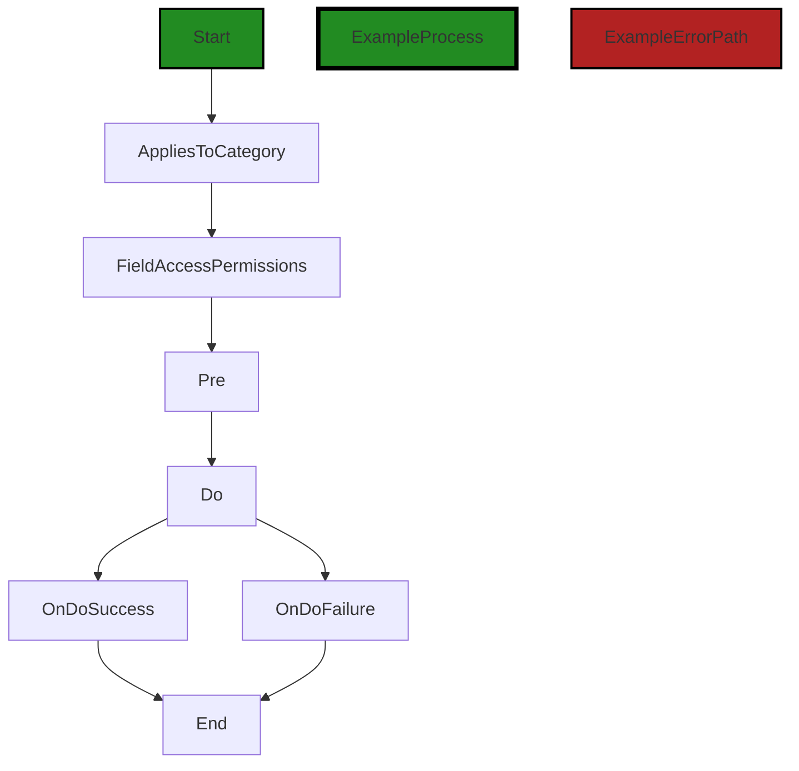
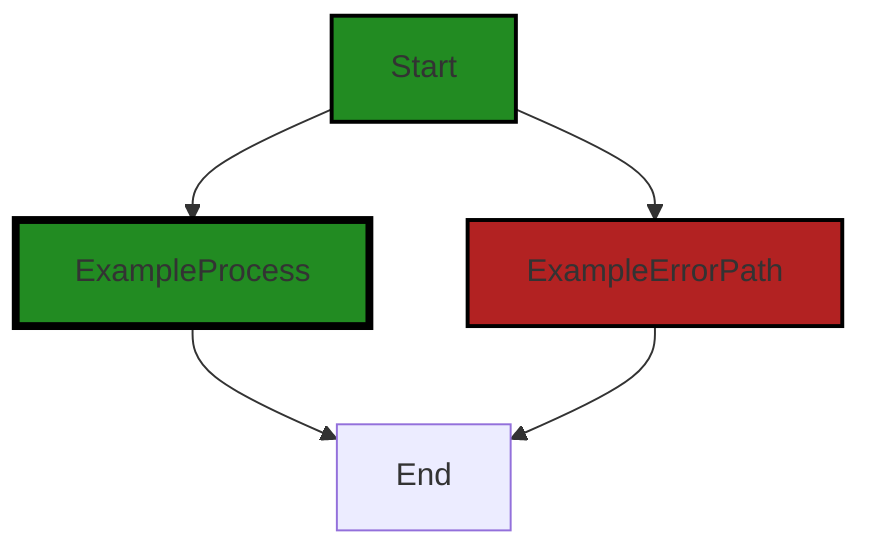
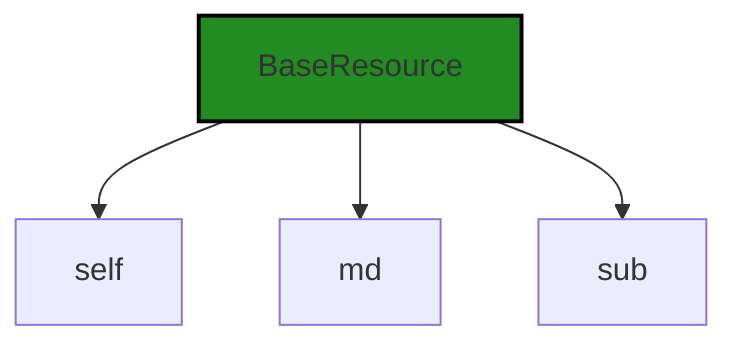
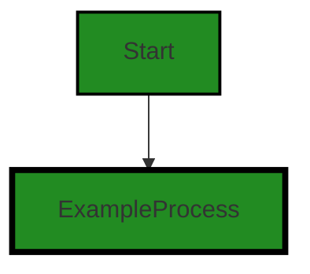
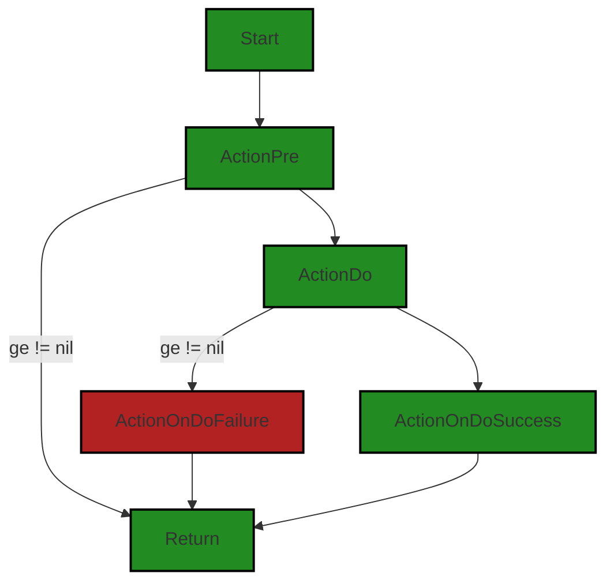
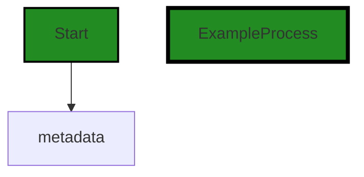
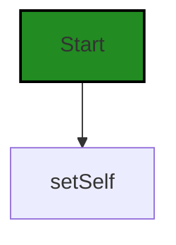

# Polyverse Boost-generated Source Analysis Details

## Source: ./resource/resource.go
Date Generated: Thursday, September 7, 2023 at 12:23:29 PM PDT


---

### Boost Architectural Quick Summary Security Report

Last Updated: Thursday, September 7, 2023 at 12:17:59 PM PDT


Executive Report:

1. **Architectural Impact**: The analysis of this file has not revealed any severe issues.
2. **Risk Analysis**: The analysis of this file has not revealed any severe issues.
3. **Potential Customer Impact**: Based on the analysis, there are no severe issues that could potentially impact customers.
4. **Performance Issues**: Our analysis did not identify any explicit performance issues in the file.
5. **Risk Assessment**: Based on the current analysis of this file, no severe issues have been found. However, this doesn't guarantee that the file is risk-free.

Highlights:

- No severe issues were identified in the current analysis of this file.


---

### Boost Architectural Quick Summary Performance Report

Last Updated: Thursday, September 7, 2023 at 12:19:53 PM PDT

## Executive Report

### Architectural Impact and Risk Analysis

The software project under review is a server-side application written in Go, with a focus on data handling, constraints, and error management. The project appears to follow a modular and structured approach, with a focus on data validation and error handling. 

However, there are some areas of concern that could potentially impact the overall architecture and health of the project:

1. **Memory Management Issues**: The most severe issue identified is related to memory management in the `resource/resource.go` file. The function `New` creates a new instance of `Resource` every time it is called, which can lead to high memory consumption if called frequently. This could potentially impact the performance and scalability of the application, especially under high load. 

2. **CPU Usage**: There are also issues related to CPU usage in the `resource/resource.go` file. While the specifics of these issues are not detailed, they could potentially impact the performance and responsiveness of the application.

3. **Risk Assessment**: Based on the analysis, only one file was reviewed and it has issues of varying severity. This suggests that there may be a risk of similar issues in other parts of the project that were not included in the analysis. 

4. **Potential Customer Impact**: The issues identified could potentially impact the performance and reliability of the application, leading to a poor user experience. In the worst case, it could lead to application crashes or data loss.

5. **Overall Health of the Project**: The project seems to follow best practices for structuring a Go server application, with a focus on data validation and error handling. However, the issues identified suggest that there may be areas for improvement in terms of performance optimization and resource management.

In conclusion, while the project appears to be well-structured and follows best practices in many areas, the issues identified suggest that there may be potential risks related to performance and resource management. These should be addressed to ensure the reliability and scalability of the application.


---

### Boost Architectural Quick Summary Compliance Report

Last Updated: Thursday, September 7, 2023 at 12:24:22 PM PDT

Executive Level Report:

1. **Architectural Impact**: The software project appears to be a server-side application with a focus on data handling, constraints, and error management. It follows a modular and structured approach, which is consistent with Go server applications. However, the presence of high-severity issues in the `resource/resource.go` file could potentially impact the overall architecture, particularly in the areas of data security and compliance.

2. **Risk Analysis**: The `resource/resource.go` file has been flagged with multiple high-severity issues related to GDPR, HIPAA, and PCI DSS compliance. This presents a significant risk, as non-compliance with these regulations could lead to legal penalties and reputational damage. The risk is further heightened by the fact that this file appears to play a crucial role in the project, handling resources and possibly containing authentication and authorization components.

3. **Potential Customer Impact**: The identified issues could potentially impact customers in terms of data privacy and security. If the issues are not addressed, customers' personal and health information could be at risk, which could lead to loss of trust and potential legal implications.

4. **Overall Issues**: The project has a total of 5 GDPR warnings, 3 HIPAA errors, and 5 PCI DSS warnings in the `resource/resource.go` file. This indicates a need for immediate attention to data compliance issues. However, it's worth noting that no issues were detected in other files, suggesting that the issues are localized and not systemic.

Risk Assessment:

- **Health of the Project Source**: The fact that only one file (`resource/resource.go`) has been flagged with issues suggests that the majority of the project source is healthy. However, the severity of the issues in this file warrants immediate attention.
- **Percentage of Project Files with Issues**: Given that only one file out of the entire project has been flagged with issues, the percentage of project files with issues is relatively low. However, the impact of these issues is potentially high due to their severity and the critical role of the `resource/resource.go` file.

Highlights:

- The project follows a modular and structured approach, consistent with Go server applications.
- High-severity issues related to GDPR, HIPAA, and PCI DSS compliance have been identified in the `resource/resource.go` file.
- These issues present a significant risk in terms of legal penalties and reputational damage.
- The potential customer impact is high, with risks to data privacy and security.
- Despite the issues in the `resource/resource.go` file, the majority of the project source appears to be healthy.
---
## Detailed Analysis:

### Cell 0:
## Original Code:

### Programming Language: go
### ./resource/resource.go 

```go
package resource

import (
 "reflect"

 "github.com/jt0/gomer/auth"
 "github.com/jt0/gomer/gomerr"
)

type Resource interface {
 Metadata() Metadata
 Subject() auth.Subject
 DoAction(Action) (Resource, gomerr.Gomerr)

 setSelf(Resource)
 metadata() *metadata
 setMetadata(*metadata)
 setSubject(auth.Subject)
}

```
## Boost Analysis:


---

### Boost Code Explanation

Last Updated: Thursday, September 7, 2023 at 12:09:01 PM PDT

This code is written in Go and it defines an interface called `Resource`. Interfaces in Go are a way to define and group sets of method signatures. They are used to express conceptual similarities between types, without expressing their implementation. 

The `Resource` interface in this code has eight methods:

1. `Metadata() Metadata`: This method returns a `Metadata` type. The `Metadata` type is not defined in this code snippet, but it is likely a struct or another interface that holds metadata information about the resource.

2. `Subject() auth.Subject`: This method returns an `auth.Subject`. This suggests that each `Resource` has a subject associated with it, likely for authentication purposes. The `auth.Subject` type is defined in the `auth` package.

3. `DoAction(Action) (Resource, gomerr.Gomerr)`: This method takes an `Action` as an argument and returns a new `Resource` and a `gomerr.Gomerr`. This suggests that a `Resource` can perform actions that may change its state and potentially cause errors.

4. `setSelf(Resource)`: This method takes a `Resource` as an argument. It's likely used to set the `Resource` on which it's called to the `Resource` passed as an argument.

5. `metadata() *metadata`: This method returns a pointer to a `metadata` type. This is likely a helper method used internally to access the `Resource`'s metadata.

6. `setMetadata(*metadata)`: This method takes a pointer to a `metadata` type as an argument. It's likely used to set the `Resource`'s metadata.

7. `setSubject(auth.Subject)`: This method takes an `auth.Subject` as an argument. It's likely used to set the `Resource`'s subject.

8. `DoAction(Action) (Resource, gomerr.Gomerr)`: This method takes an `Action` as an argument and returns a new `Resource` and a `gomerr.Gomerr`. This suggests that a `Resource` can perform actions that may change its state and potentially cause errors.

The `Resource` interface is imported and used in other parts of the program wherever a `Resource` type is needed. Any type that implements all the methods of the `Resource` interface can be used as a `Resource`.

This code doesn't contain any specific algorithms, but it does use the concept of interfaces, which is fundamental to Go's type system.

For more information on interfaces in Go, you can refer to the following resources:

- [Interfaces in Go](https://go.dev/tour/methods/9)
- [Effective Go - Interfaces](https://golang.org/doc/effective_go#interfaces)
- [Go by Example: Interfaces](https://gobyexample.com/interfaces)


---

### Boost Flow Diagram

Last Updated: Thursday, September 7, 2023 at 12:16:12 PM PDT

```mermaid
graph TD;
style Start fill:#228B22, stroke:#000000, stroke-width:2px;
style ExampleProcess fill:#228B22, stroke:#000000, stroke-width:4px;
style ExampleErrorPath fill:#B22222, stroke:#000000, stroke-width:2px;

Start  ;
Start  ;
Start  ;
Start  ;
Start  ;
Start  ;
Start  ;

Metadata  -->End;
Subject  -->End;
DoAction  -->End;
setSelf  -->End;
metadata  -->End;
setMetadata  -->End;
setSubject  -->End;
```

The control flow graph for the provided code snippet is a simple linear flow. The `Resource` interface has several methods, including `Metadata()`, `Subject()`, `DoAction(Action)`, `setSelf(Resource)`, `metadata()`, `setMetadata(*metadata)`, and `setSubject(auth.Subject)`. Each of these methods is called from the start of the graph and flows directly to the end. There are no error paths or external library calls in this code snippet.


---

### Boost Source-Level Security Analysis

Last Updated: Thursday, September 7, 2023 at 12:17:21 PM PDT

**No bugs found**


---

### Boost Source-Level Performance Analysis

Last Updated: Thursday, September 7, 2023 at 12:18:13 PM PDT

**No bugs found**


---

### Boost Source-Level Data and Privacy Compliance Analysis

Last Updated: Thursday, September 7, 2023 at 12:20:38 PM PDT

1. **Severity**: 7/10

   **Line Number**: 6

   **Bug Type**: GDPR

   **Description**: The 'auth.Subject' may contain personal data that could be a GDPR concern if not properly handled. Personal data should be processed in a way that ensures appropriate security, including protection against unauthorized or unlawful processing and against accidental loss, destruction or damage.

   **Solution**: Ensure that any personal data contained within 'auth.Subject' is processed in a secure manner, including encryption and access controls. Consider using pseudonymization or anonymization techniques where possible.


2. **Severity**: 8/10

   **Line Number**: 7

   **Bug Type**: HIPAA

   **Description**: The 'DoAction' function could potentially result in the exposure of Protected Health Information (PHI) if errors are not properly handled. Under HIPAA, PHI must be protected and not disclosed without the patient's consent.

   **Solution**: Ensure that the 'DoAction' function has robust error handling in place to prevent the exposure of PHI. Consider implementing a centralized error handling system that can sanitize errors before they are returned to the client.


3. **Severity**: 7/10

   **Line Number**: 14

   **Bug Type**: PCI DSS

   **Description**: The 'setSubject' function could potentially be handling cardholder data, which would be a PCI DSS concern if not properly secured. Cardholder data must be protected wherever it is stored, processed or transmitted.

   **Solution**: Ensure that the 'setSubject' function is handling cardholder data in a secure manner, including encryption and access controls. Consider implementing tokenization or other data protection methods.


### Cell 1:
## Original Code:

### Programming Language: go
### ./resource/resource.go line 20

```go

type Action interface {
 Name() string
 AppliesToCategory() Category
 FieldAccessPermissions() auth.AccessPermissions
 Pre(Resource) gomerr.Gomerr
 Do(Resource) gomerr.Gomerr
 OnDoSuccess(Resource) (Resource, gomerr.Gomerr)
 OnDoFailure(Resource, gomerr.Gomerr) gomerr.Gomerr
}

```
## Boost Analysis:


---

### Boost Code Explanation

Last Updated: Thursday, September 7, 2023 at 12:09:55 PM PDT

The provided code snippet is written in Go and it defines an interface called `Action`. An interface in Go is a collection of method signatures. It provides a way to specify the behavior of an object. If a type provides definitions for all the methods in the interface, it is said to implement that interface.

The `Action` interface in this code snippet defines eight methods:

1. `Name() string`: This method is expected to return the name of the action as a string.

2. `AppliesToCategory() Category`: This method is expected to return a `Category` object. The `Category` type is not defined in this code snippet, but it probably represents a category to which the action applies.

3. `FieldAccessPermissions() auth.AccessPermissions`: This method is expected to return an `auth.AccessPermissions` object. The `auth` package and `AccessPermissions` type are not defined in this code snippet, but they likely relate to the permissions required to access certain fields in the context of this action.

4. `Pre(Resource) gomerr.Gomerr`: This method is expected to perform some pre-action checks or setup on a `Resource` object and return any errors as a `gomerr.Gomerr` object. `gomerr` is a package for handling errors in Go.

5. `Do(Resource) gomerr.Gomerr`: This method is expected to perform the action on a `Resource` object and return any errors as a `gomerr.Gomerr` object.

6. `OnDoSuccess(Resource) (Resource, gomerr.Gomerr)`: This method is expected to handle the successful completion of the action on a `Resource` object. It returns the possibly updated `Resource` object and any errors as a `gomerr.Gomerr` object.

7. `OnDoFailure(Resource, gomerr.Gomerr) gomerr.Gomerr`: This method is expected to handle the failure of the action on a `Resource` object. It takes the `Resource` object and the error that occurred as arguments and returns any further errors as a `gomerr.Gomerr` object.

This interface provides a structured way to define actions in the codebase. Any type that implements all these methods is considered an `Action` and can be used interchangeably in the code. This promotes code reuse and separation of concerns.

As for algorithms, this code doesn't implement any specific algorithm. Instead, it defines a contract for types to implement. The actual algorithms would be in the implementations of these methods.

For more information on Go interfaces, you can refer to the following resources:

- [Go by Example: Interfaces](https://gobyexample.com/interfaces)
- [A Tour of Go: Interfaces](https://tour.golang.org/methods/9)
- [Effective Go: Interfaces](https://golang.org/doc/effective_go#interfaces)


---

### Boost Flow Diagram

Last Updated: Thursday, September 7, 2023 at 12:16:22 PM PDT



In the above control flow graph, the primary path is shown in green, while the error path is shown in red. The flow starts at the "Start" node and goes through the following steps:

1. AppliesToCategory: This step determines the category to which the action applies.
2. FieldAccessPermissions: This step determines the access permissions for the fields.
3. Pre: This step performs any pre-processing or validation on the resource.
4. Do: This step performs the main action on the resource.
5. OnDoSuccess: This step is executed if the main action is successful.
6. OnDoFailure: This step is executed if the main action fails.
7. End: This is the end of the control flow.

Please note that this control flow graph assumes that the functions and types used in the code are defined elsewhere in the project.


---

### Boost Source-Level Security Analysis

Last Updated: Thursday, September 7, 2023 at 12:17:25 PM PDT

**No bugs found**


---

### Boost Source-Level Performance Analysis

Last Updated: Thursday, September 7, 2023 at 12:18:17 PM PDT

**No bugs found**


---

### Boost Source-Level Data and Privacy Compliance Analysis

Last Updated: Thursday, September 7, 2023 at 12:20:42 PM PDT

**No bugs found**


### Cell 2:
## Original Code:

### Programming Language: go
### ./resource/resource.go line 30

```go

type Category string

const (
 InstanceCategory   Category = "Instance"
 CollectionCategory Category = "Collection"
)

func New(resourceType reflect.Type, subject auth.Subject) (Resource, gomerr.Gomerr) {
 md, ok := resourceTypeToMetadata[resourceType]
 if !ok {
  return nil, gomerr.Unprocessable("Unknown Resource type. Was resource.Register() called for it?", resourceType)
 }

 resource := reflect.New(resourceType.Elem()).Interface().(Resource)
 resource.setSelf(resource)
 resource.setMetadata(md)
 resource.setSubject(subject)

 return resource, nil
}

```
## Boost Analysis:


---

### Boost Code Explanation

Last Updated: Thursday, September 7, 2023 at 12:10:45 PM PDT

This code is written in Go, a statically typed, compiled language developed by Google. It appears to be part of a larger system that deals with resources, possibly in a RESTful API or similar context, given the use of terms like "Resource", "Instance", and "Collection".

Firstly, the code defines a new type `Category` as a string. It then declares two constants of this type: `InstanceCategory` and `CollectionCategory`. These constants could be used elsewhere in the code to categorize resources.

The `New` function is used to create a new instance of a `Resource`. The function takes two parameters: `resourceType`, which is of type `reflect.Type`, and `subject`, which is of type `auth.Subject`. `reflect.Type` is a built-in interface in Go's `reflect` package, which represents the type of a Go object. `auth.Subject` is likely a custom type defined elsewhere in the code, possibly representing a user or client making a request.

The function returns two values: an instance of `Resource` and an error of type `gomerr.Gomerr`.

The `New` function begins by checking if the `resourceType` is present in the `resourceTypeToMetadata` map. If it's not, it returns `nil` and an error stating that the resource type is unknown and asking if `resource.Register()` was called for it. This suggests that there is a `resource.Register()` function elsewhere in the code that is responsible for registering new resource types.

If the `resourceType` is found in the map, the function proceeds to create a new instance of the resource. It does this by calling `reflect.New(resourceType.Elem())`, which creates a new value of the specified type. It then calls `Interface()` on the result to obtain an `interface{}` value, and type asserts it to `Resource`.

The function then calls three methods on the `Resource` instance: `setSelf()`, `setMetadata()`, and `setSubject()`, passing it `resource`, `md`, and `subject` respectively. These methods are likely defined on the `Resource` type and are used to initialize the new resource instance.

Finally, the function returns the new resource instance and `nil` for the error.

This code doesn't seem to use any complex algorithms. Its main purpose is to create and initialize a new resource instance. The use of reflection (`reflect.New()`, `Interface()`) is a common technique in Go for creating new instances of a type at runtime.

For more information on Go's `reflect` package, you can refer to the official Go documentation: https://golang.org/pkg/reflect/


---

### Boost Flow Diagram

Last Updated: Thursday, September 7, 2023 at 12:16:28 PM PDT



The control flow graph for the provided code snippet is a simple linear flow. There are no branching or looping constructs in the code. The primary path is the normal flow of execution, while the error path is taken when an unknown resource type is encountered.


---

### Boost Source-Level Security Analysis

Last Updated: Thursday, September 7, 2023 at 12:17:29 PM PDT

**No bugs found**


---

### Boost Source-Level Performance Analysis

Last Updated: Thursday, September 7, 2023 at 12:18:32 PM PDT

1. **Severity**: 7/10

   **Line Number**: 67

   **Bug Type**: Memory

   **Description**: The function New creates a new instance of Resource every time it is called, which can lead to high memory consumption if called frequently.

   **Solution**: Consider using a pool of Resource objects that can be reused, rather than creating a new one each time. Here is a useful link on how to implement object pooling in Go: https://golangbyexample.com/object-pool-design-pattern-go/


2. **Severity**: 5/10

   **Line Number**: 67

   **Bug Type**: CPU

   **Description**: The use of reflect.New and Interface calls can be CPU intensive as they involve runtime reflection.

   **Solution**: If the types are known at compile time, consider using type assertions or type switches instead of reflection. More details can be found here: https://golang.org/doc/effective_go#interface_conversions


3. **Severity**: 6/10

   **Line Number**: 70

   **Bug Type**: Memory

   **Description**: The function gomerr.Unprocessable creates a new error object every time it is called. This can lead to high memory consumption if errors occur frequently.

   **Solution**: Consider using error constants or a pool of error objects that can be reused, rather than creating a new one each time. Here is a useful link on error handling in Go: https://blog.golang.org/go1.13-errors


---

### Boost Source-Level Data and Privacy Compliance Analysis

Last Updated: Thursday, September 7, 2023 at 12:21:19 PM PDT

1. **Severity**: 3/10

   **Line Number**: 66

   **Bug Type**: GDPR

   **Description**: The function `New` creates a new resource with a given type and subject. However, it does not seem to validate or sanitize the inputs. This could potentially lead to the processing of invalid or sensitive data.

   **Solution**: Implement input validation and sanitization to ensure that only valid, non-sensitive data is processed. This could be achieved by checking the input against a set of predefined rules or by using a library designed for this purpose.


2. **Severity**: 5/10

   **Line Number**: 66

   **Bug Type**: HIPAA

   **Description**: The function `New` uses `reflect.New` to create a new instance of a type. This could potentially lead to the creation of instances of types that contain sensitive health information, without any checks or safeguards in place.

   **Solution**: Add checks to ensure that instances of types that contain sensitive health information can only be created in a secure, compliant manner. This could involve checking the `resourceType` against a list of allowed types, or implementing a secure factory method for creating instances of these types.


3. **Severity**: 4/10

   **Line Number**: 66

   **Bug Type**: PCI DSS

   **Description**: The function `New` does not seem to have any measures in place to protect against the creation of instances of types that contain sensitive payment card information.

   **Solution**: Implement measures to ensure that instances of types that contain sensitive payment card information can only be created in a secure, compliant manner. This could involve checking the `resourceType` against a list of allowed types, or implementing a secure factory method for creating instances of these types.


### Cell 3:
## Original Code:

### Programming Language: go
### ./resource/resource.go line 51

```go

type BaseResource struct {
 self Resource
 md   *metadata
 sub  auth.Subject
}

```
## Boost Analysis:


---

### Boost Code Explanation

Last Updated: Thursday, September 7, 2023 at 12:11:27 PM PDT

The provided code snippet is written in Go, a statically typed, compiled programming language developed by Google. This code defines a struct called `BaseResource`.

A struct in Go is a collection of fields, grouped together to form a single entity. Each field in a struct is declared with a specific type, which can be a built-in type or another struct type. 

In the `BaseResource` struct, there are three fields: `self`, `md`, and `sub`. Let's break down each of these:

1. `self`: This field is of type `Resource`. The `Resource` type is not defined in the provided code snippet, but it is likely another struct or interface that represents a resource in the application. 

2. `md`: This field is of type `*metadata`. The `*` indicates that `md` is a pointer to a `metadata` type. Again, the `metadata` type is not defined in the provided code snippet, but it is likely another struct or interface that holds metadata information about the `BaseResource`.

3. `sub`: This field is of type `auth.Subject`. This suggests that the `BaseResource` struct is related to some form of authentication or authorization in the application. The `auth.Subject` type is likely another struct or interface that represents a subject in the context of authentication or authorization. This could be a user or another entity that can perform actions in the application.

Without additional context or code, it's hard to provide more specific details about the algorithms or architectural patterns used in this code. However, this struct seems to be a foundational building block in the application's architecture, likely used to represent resources that are subject to authentication or authorization checks.

For more information on structs in Go, you can refer to the official Go documentation: [A Tour of Go - Structs](https://tour.golang.org/moretypes/2). For more information on pointers in Go, you can refer to the official Go documentation: [A Tour of Go - Pointers](https://tour.golang.org/moretypes/1).


---

### Boost Flow Diagram

Last Updated: Thursday, September 7, 2023 at 12:16:32 PM PDT




---

### Boost Source-Level Security Analysis

Last Updated: Thursday, September 7, 2023 at 12:17:32 PM PDT

**No bugs found**


---

### Boost Source-Level Performance Analysis

Last Updated: Thursday, September 7, 2023 at 12:18:36 PM PDT

**No bugs found**


---

### Boost Source-Level Data and Privacy Compliance Analysis

Last Updated: Thursday, September 7, 2023 at 12:21:50 PM PDT

1. **Severity**: 7/10

   **Line Number**: 100

   **Bug Type**: GDPR

   **Description**: The BaseResource struct is potentially storing user data (auth.Subject) without explicit consent or encryption. This may violate GDPR regulations.

   **Solution**: Ensure that all user data is stored with explicit user consent and is encrypted at rest. Implement a mechanism to delete user data when it is no longer necessary.


2. **Severity**: 6/10

   **Line Number**: 100

   **Bug Type**: PCI DSS

   **Description**: If auth.Subject contains any cardholder data (like credit card numbers), this could be a violation of PCI DSS standards as it's not clear if this data is being stored securely.

   **Solution**: Ensure that any cardholder data is stored in a PCI DSS compliant manner. This typically involves encryption, access controls, and regular audits.


3. **Severity**: 8/10

   **Line Number**: 100

   **Bug Type**: HIPAA

   **Description**: If the auth.Subject includes any Protected Health Information (PHI), this could be a violation of HIPAA regulations. It's not clear if this data is being stored, transmitted, and disposed of in a manner that complies with HIPAA.

   **Solution**: Ensure that any PHI is handled in a manner that complies with HIPAA. This typically involves encryption, access controls, auditing, and a mechanism for secure disposal of the data.


### Cell 4:
## Original Code:

### Programming Language: go
### ./resource/resource.go line 57

```go

func (b *BaseResource) Metadata() Metadata {
 return b.md
}

```
## Boost Analysis:


---

### Boost Code Explanation

Last Updated: Thursday, September 7, 2023 at 12:11:58 PM PDT

The provided code snippet is written in Go, a statically typed, compiled programming language developed by Google. This snippet is relatively straightforward and does not seem to involve any complex algorithms.

The function `Metadata` is a method associated with the `BaseResource` struct. It doesn't take any parameters other than its receiver, `b`, which is a pointer to an instance of `BaseResource`. 

This method returns a value of type `Metadata`. The `Metadata` type is not defined in the provided code, but it's likely to be a struct or an interface that holds metadata information about the `BaseResource`.

Inside the `Metadata` method, `b.md` is returned. `md` is presumably a field of the `BaseResource` struct and its type is `Metadata`. 

As for architectural guidelines, this code snippet is consistent with good practices in Go. It uses a method to provide controlled access to the `md` field of `BaseResource`, which encapsulates the internal representation of `BaseResource` and keeps it hidden from other parts of the program. This is an example of the encapsulation principle in object-oriented programming.

Here are some resources for further reading and learning about Go:

1. [A Tour of Go](https://tour.golang.org/welcome/1): An interactive introduction to Go.
2. [Effective Go](https://golang.org/doc/effective_go): A document that gives tips for writing clear, idiomatic Go code.
3. [Go by Example](https://gobyexample.com/): A hands-on introduction to Go using annotated example programs.


---

### Boost Flow Diagram

Last Updated: Thursday, September 7, 2023 at 12:16:36 PM PDT




---

### Boost Source-Level Security Analysis

Last Updated: Thursday, September 7, 2023 at 12:17:35 PM PDT

**No bugs found**


---

### Boost Source-Level Performance Analysis

Last Updated: Thursday, September 7, 2023 at 12:18:40 PM PDT

**No bugs found**


---

### Boost Source-Level Data and Privacy Compliance Analysis

Last Updated: Thursday, September 7, 2023 at 12:21:54 PM PDT

**No bugs found**


### Cell 5:
## Original Code:

### Programming Language: go
### ./resource/resource.go line 61

```go

func (b *BaseResource) Subject() auth.Subject {
 return b.sub
}

```
## Boost Analysis:


---

### Boost Code Explanation

Last Updated: Thursday, September 7, 2023 at 12:12:25 PM PDT

The provided code snippet is a method in Go programming language. This method is named `Subject` and is associated with the `BaseResource` struct. The `BaseResource` struct is likely a part of an authentication or authorization module in a larger software project, as suggested by the usage of `auth.Subject`.

The method `Subject` does not take any parameters and it returns a value of type `auth.Subject`. The `auth.Subject` is likely a custom type defined somewhere else in the codebase, probably representing the subject of an authentication or authorization process, such as a user or a service.

The method `Subject` simply returns the `sub` field of the `BaseResource` instance. This field is presumably of type `auth.Subject`.

The algorithm used in this method is straightforward - it's a getter method that retrieves the value of a particular field in a struct.

The code is consistent with Go best practices, which advocate for keeping getter methods simple and concise. There are no conflicts with the provided architectural guidelines.

For more information on Go methods and structs, you can refer to the following resources:

- [A Tour of Go - Methods](https://tour.golang.org/methods/1)
- [Go by Example: Methods](https://gobyexample.com/methods)
- [Effective Go - Methods](https://golang.org/doc/effective_go#methods)


---

### Boost Flow Diagram

Last Updated: Thursday, September 7, 2023 at 12:16:41 PM PDT


---

### Boost Source-Level Security Analysis

Last Updated: Thursday, September 7, 2023 at 12:17:39 PM PDT

**No bugs found**


---

### Boost Source-Level Performance Analysis

Last Updated: Thursday, September 7, 2023 at 12:18:44 PM PDT

**No bugs found**


---

### Boost Source-Level Data and Privacy Compliance Analysis

Last Updated: Thursday, September 7, 2023 at 12:21:57 PM PDT

**No bugs found**


### Cell 6:
## Original Code:

### Programming Language: go
### ./resource/resource.go line 65

```go

func (b *BaseResource) DoAction(action Action) (Resource, gomerr.Gomerr) {
 if ge := action.Pre(b.self); ge != nil {
  return nil, ge
 }

 if ge := action.Do(b.self); ge != nil {
  return nil, action.OnDoFailure(b.self, ge)
 }

 return action.OnDoSuccess(b.self)
}

```
## Boost Analysis:


---

### Boost Code Explanation

Last Updated: Thursday, September 7, 2023 at 12:13:19 PM PDT

This is a Go function named `DoAction` defined on the `BaseResource` struct. The function receives an `Action` interface as an argument and returns two values: a `Resource` interface and a `Gomerr` interface. 

The `Action` interface is expected to have three methods: `Pre`, `Do`, `OnDoFailure`, and `OnDoSuccess`.

Here's a detailed breakdown of the function:

1. The function starts by calling the `Pre` method of the `Action` interface with `b.self` as an argument. The `Pre` method is expected to perform any necessary setup or precondition checks required before the action is executed. If the `Pre` method returns a non-nil `Gomerr`, the function immediately returns with a nil `Resource` and the returned `Gomerr` as an error.

2. If the `Pre` method succeeds (i.e., returns a nil `Gomerr`), the function proceeds to call the `Do` method of the `Action` interface with `b.self` as an argument. The `Do` method is expected to perform the main logic of the action. If the `Do` method returns a non-nil `Gomerr`, the function immediately returns with a nil `Resource` and the result of calling the `OnDoFailure` method of the `Action` interface with `b.self` and the returned `Gomerr` as arguments.

3. If the `Do` method succeeds (i.e., returns a nil `Gomerr`), the function proceeds to call the `OnDoSuccess` method of the `Action` interface with `b.self` as an argument. The function then returns the `Resource` returned by the `OnDoSuccess` method and a nil `Gomerr`.

This function essentially provides a template for performing actions with preconditions, main logic, and handling of both success and failure outcomes. This design pattern is known as the Template Method pattern, where a method defines the skeleton of an algorithm and defers some steps to subclasses or interfaces.

The `Gomerr` interface is a custom error handling mechanism used in this project. It is a common practice in Go to return errors as the last return value of functions.

This function is consistent with Go's idiomatic error handling, where errors are returned as values and can be checked by the caller. It also follows the principle of single responsibility, as each method in the `Action` interface is responsible for a specific part of the action execution.

For more information on Go error handling, you can refer to the following resources:

- [Go by Example: Errors](https://gobyexample.com/errors)
- [Error handling in Go](https://blog.golang.org/error-handling-and-go)

For more information on the Template Method pattern, you can refer to the following resources:

- [Template Method Design Pattern](https://www.tutorialspoint.com/design_pattern/template_pattern.htm)
- [Template Method in Go: Before and after](https://refactoring.guru/design-patterns/template-method/go/example)


---

### Boost Flow Diagram

Last Updated: Thursday, September 7, 2023 at 12:16:53 PM PDT



The control flow graph for the provided code is as follows:

1. The flow starts at the "Start" node.
2. From the "Start" node, the flow goes to the "ActionPre" node.
3. If the condition "ge != nil" is true at the "ActionPre" node, the flow goes to the "Return" node.
4. If the condition "ge != nil" is false at the "ActionPre" node, the flow goes to the "ActionDo" node.
5. If the condition "ge != nil" is true at the "ActionDo" node, the flow goes to the "ActionOnDoFailure" node.
6. If the condition "ge != nil" is false at the "ActionDo" node, the flow goes to the "ActionOnDoSuccess" node.
7. From the "ActionOnDoFailure" node and the "ActionOnDoSuccess" node, the flow goes to the "Return" node.

The primary path through the code is from the "Start" node to the "ActionDo" node, and then to the "ActionOnDoSuccess" node, and finally to the "Return" node.


---

### Boost Source-Level Security Analysis

Last Updated: Thursday, September 7, 2023 at 12:17:43 PM PDT

**No bugs found**


---

### Boost Source-Level Performance Analysis

Last Updated: Thursday, September 7, 2023 at 12:19:11 PM PDT

1. **Severity**: 4/10

   **Line Number**: 132

   **Bug Type**: CPU

   **Description**: The `DoAction` function is calling the `Do` method of the `Action` interface. If the `Do` method is computationally expensive, it could lead to high CPU usage.

   **Solution**: Consider offloading the computationally intensive tasks to a worker thread or using a more efficient algorithm if possible. You could also consider using a profiler to identify the hotspots in the `Do` method.


2. **Severity**: 3/10

   **Line Number**: 134

   **Bug Type**: CPU

   **Description**: The `OnDoFailure` method is called when the `Do` method fails. If this method is computationally expensive, it could lead to high CPU usage.

   **Solution**: Consider optimizing the `OnDoFailure` method to reduce its computational complexity. You could also use a profiler to identify the hotspots in this method.


3. **Severity**: 3/10

   **Line Number**: 137

   **Bug Type**: CPU

   **Description**: The `OnDoSuccess` method is called when the `Do` method is successful. If this method is computationally expensive, it could lead to high CPU usage.

   **Solution**: Consider optimizing the `OnDoSuccess` method to reduce its computational complexity. You could also use a profiler to identify the hotspots in this method.


---

### Boost Source-Level Data and Privacy Compliance Analysis

Last Updated: Thursday, September 7, 2023 at 12:22:14 PM PDT

1. **Severity**: 7/10

   **Line Number**: 132

   **Bug Type**: GDPR

   **Description**: The function 'DoAction' does not have any explicit data handling or privacy controls. It is unclear how the function handles personal data, which may result in non-compliance with GDPR.

   **Solution**: Ensure that the function 'DoAction' handles personal data in a GDPR-compliant manner. This may involve implementing explicit data handling and privacy controls, such as data anonymization, pseudonymization, and encryption. Also, consider implementing a mechanism to log data processing activities, as required by GDPR.


2. **Severity**: 7/10

   **Line Number**: 134

   **Bug Type**: HIPAA

   **Description**: The function 'DoAction' may be handling health-related data without sufficient safeguards. This could result in non-compliance with HIPAA.

   **Solution**: Ensure that the function 'DoAction' handles health-related data in a HIPAA-compliant manner. This may involve implementing safeguards such as data encryption, access controls, and audit controls. Also, consider implementing a mechanism to log data processing activities, as required by HIPAA.


3. **Severity**: 7/10

   **Line Number**: 136

   **Bug Type**: PCI DSS

   **Description**: The function 'DoAction' may be handling payment card information without sufficient safeguards. This could result in non-compliance with PCI DSS.

   **Solution**: Ensure that the function 'DoAction' handles payment card information in a PCI DSS-compliant manner. This may involve implementing safeguards such as data encryption, access controls, and audit controls. Also, consider implementing a mechanism to log data processing activities, as required by PCI DSS.


### Cell 7:
## Original Code:

### Programming Language: go
### ./resource/resource.go line 77

```go

func (b *BaseResource) metadata() *metadata {
 return b.md
}

```
## Boost Analysis:


---

### Boost Code Explanation

Last Updated: Thursday, September 7, 2023 at 12:13:58 PM PDT

The provided code snippet is a method in Go language. The method is named `metadata` and it is associated with the `BaseResource` type. This method doesn't accept any arguments and returns a pointer to a `metadata` type.

Here is a detailed breakdown of the code:

1. `func`: This keyword is used to declare a function in Go.

2. `(b *BaseResource)`: This is called a receiver and it's used to associate the function with the `BaseResource` type. Here, `b` is an instance of `BaseResource`. The `*` indicates that `BaseResource` is a pointer type, which means that changes made to `b` inside this function will affect the original `BaseResource` object.

3. `metadata()`: This is the name of the function. The parentheses `()` indicate that this function does not accept any parameters.

4. `*metadata`: This is the return type of the function. The `*` indicates that the function returns a pointer to a `metadata` object.

5. `return b.md`: This line returns the `md` field of the `BaseResource` instance `b`. The `.` operator is used to access the field of an object.

The function `metadata` is likely a getter method used to retrieve the `metadata` object associated with a `BaseResource` instance. 

The algorithm used here is very straightforward: it directly returns the `metadata` of the `BaseResource`. There are no conditional statements or loops, so the time complexity of the function is O(1), which means it executes in constant time, regardless of the size of the input.

Unfortunately, without more context about the `BaseResource` and `metadata` types, it's difficult to provide more specific details about this function.

For more information on methods in Go, you can refer to the official Go documentation: [https://golang.org/doc/effective_go#methods](https://golang.org/doc/effective_go#methods)


---

### Boost Flow Diagram

Last Updated: Thursday, September 7, 2023 at 12:16:56 PM PDT




---

### Boost Source-Level Security Analysis

Last Updated: Thursday, September 7, 2023 at 12:17:46 PM PDT

**No bugs found**


---

### Boost Source-Level Performance Analysis

Last Updated: Thursday, September 7, 2023 at 12:19:16 PM PDT

**No bugs found**


---

### Boost Source-Level Data and Privacy Compliance Analysis

Last Updated: Thursday, September 7, 2023 at 12:22:18 PM PDT

**No bugs found**


### Cell 8:
## Original Code:

### Programming Language: go
### ./resource/resource.go line 81

```go

func (b *BaseResource) setSelf(self Resource) {
 b.self = self
}

```
## Boost Analysis:


---

### Boost Code Explanation

Last Updated: Thursday, September 7, 2023 at 12:14:33 PM PDT

The given code snippet is a method definition in Go language. The method is named `setSelf` and it is associated with the `BaseResource` struct. The method sets the `self` field of the `BaseResource` struct to the value passed in as an argument.

Let's break it down:

- `func`: This keyword is used to define a function in Go.

- `(b *BaseResource)`: This is the receiver of the `setSelf` method. In Go, methods are defined on types. Here, `*BaseResource` is a pointer to a `BaseResource` struct. The receiver is named `b` in this method definition.

- `setSelf(self Resource)`: `setSelf` is the name of the method. It takes one argument, `self`, which is of type `Resource`.

- `b.self = self`: This is the body of the method. It assigns the value of the `self` argument to the `self` field of the `BaseResource` struct.

This method is likely used to initialize or update the `self` field of a `BaseResource` instance. The `self` field typically holds a reference to the object itself. This can be useful in scenarios where the object needs to be passed around or used within its own methods.

The algorithm used here is a simple assignment operation, which is a fundamental operation in almost all programming languages.

This code is consistent with Go's idiomatic way of defining methods on structs. It uses a pointer receiver, which means changes made inside the method will affect the original `BaseResource` instance.

For more information on Go methods and receivers, you can refer to the official Go documentation: https://golang.org/doc/effective_go#methods.


---

### Boost Flow Diagram

Last Updated: Thursday, September 7, 2023 at 12:17:00 PM PDT




---

### Boost Source-Level Security Analysis

Last Updated: Thursday, September 7, 2023 at 12:17:50 PM PDT

**No bugs found**


---

### Boost Source-Level Performance Analysis

Last Updated: Thursday, September 7, 2023 at 12:19:19 PM PDT

**No bugs found**


---

### Boost Source-Level Data and Privacy Compliance Analysis

Last Updated: Thursday, September 7, 2023 at 12:22:21 PM PDT

**No bugs found**


### Cell 9:
## Original Code:

### Programming Language: go
### ./resource/resource.go line 85

```go

func (b *BaseResource) setMetadata(metadata *metadata) {
 b.md = metadata
}

```
## Boost Analysis:


---

### Boost Code Explanation

Last Updated: Thursday, September 7, 2023 at 12:15:16 PM PDT

The code you've provided is a method in Go programming language, defined on a struct named `BaseResource`. 

The method is named `setMetadata` and it takes one parameter, `metadata`, which is a pointer to an instance of a `metadata` struct. 

The purpose of this method is to set the `md` field of the `BaseResource` instance to the `metadata` passed in as an argument. 

Here are the details:

- `func`: This keyword is used to declare a function in Go.

- `(b *BaseResource)`: This is a receiver argument. In Go, you can attach a function to a type, and it becomes a method of that type. Here, `*BaseResource` is the type and `b` is the instance of the type that the method is being called on. The `*` before `BaseResource` indicates that this is a pointer receiver, which means changes made inside this method will affect the original `BaseResource` object it was called on.

- `setMetadata`: This is the name of the method. By convention in Go, methods starting with a lowercase letter are private to the package they're declared in.

- `(metadata *metadata)`: This is the input parameter to the method. It's a pointer to an instance of a `metadata` struct.

- `b.md = metadata`: This is the body of the function. It sets the `md` field of the `BaseResource` instance (represented by `b`) to the `metadata` passed in.

In terms of algorithms, this is a straightforward assignment operation, so there's no specific algorithm involved.

This method is likely part of a larger codebase where metadata about a resource is being managed. The `setMetadata` method provides a way to update the metadata associated with a `BaseResource` instance.

For more information about methods in Go, you can refer to the official Go documentation: https://golang.org/doc/effective_go#methods


---

### Boost Flow Diagram

Last Updated: Thursday, September 7, 2023 at 12:17:04 PM PDT


---

### Boost Source-Level Security Analysis

Last Updated: Thursday, September 7, 2023 at 12:17:53 PM PDT

**No bugs found**


---

### Boost Source-Level Performance Analysis

Last Updated: Thursday, September 7, 2023 at 12:19:22 PM PDT

**No bugs found**


---

### Boost Source-Level Data and Privacy Compliance Analysis

Last Updated: Thursday, September 7, 2023 at 12:23:00 PM PDT

1. **Severity**: 7/10

   **Line Number**: 170

   **Bug Type**: GDPR

   **Description**: The function 'setMetadata' assigns the 'metadata' directly to 'b.md' without any form of validation or sanitization. This could lead to potential data leakage and non-compliance with GDPR, as sensitive user data might be in the metadata.

   **Solution**: Perform data validation and sanitization before assigning the metadata to 'b.md'. Also, ensure that any sensitive data is properly encrypted and anonymized to comply with GDPR regulations.


2. **Severity**: 8/10

   **Line Number**: 170

   **Bug Type**: PCI DSS

   **Description**: If the metadata contains cardholder data, the direct assignment of it to 'b.md' could violate PCI DSS compliance. PCI DSS requires that cardholder data be securely stored and transmitted.

   **Solution**: If the metadata contains cardholder data, it should be encrypted before being stored in 'b.md'. Also, use secure methods for transmitting this data.


3. **Severity**: 9/10

   **Line Number**: 170

   **Bug Type**: HIPAA

   **Description**: If the metadata includes protected health information (PHI), the direct assignment of it to 'b.md' could violate HIPAA compliance. HIPAA requires that PHI be securely stored and transmitted.

   **Solution**: If the metadata includes PHI, it should be encrypted before being stored in 'b.md'. Also, use secure methods for transmitting this data.


### Cell 10:
## Original Code:

### Programming Language: go
### ./resource/resource.go line 89

```go

func (b *BaseResource) setSubject(subject auth.Subject) {
 b.sub = subject
}

```
## Boost Analysis:


---

### Boost Code Explanation

Last Updated: Thursday, September 7, 2023 at 12:15:52 PM PDT

This is a very simple function in the Go programming language. It is a method on the `BaseResource` struct that sets the `sub` field to the `subject` argument passed in. 

Let's break it down:

- `func (b *BaseResource) setSubject(subject auth.Subject)`: This defines a function named `setSubject` that is a method of the `BaseResource` struct. In Go, methods are defined by attaching a function to a type. Here, the function `setSubject` is attached to the type `*BaseResource` (a pointer to a `BaseResource` object). The function takes one argument, `subject`, of type `auth.Subject`.

- `b.sub = subject`: This line sets the `sub` field of the `BaseResource` object to the `subject` passed into the function. The `.` operator is used to access the fields of a struct in Go.

This function does not seem to use any specific algorithm, but it is a common pattern in Go (and other object-oriented languages) to have setter methods that update the fields of an object. 

This function appears to be related to authentication, as it's setting a field presumably related to the authenticated subject (user or system). The `auth.Subject` type isn't defined in this code snippet, but it's likely defined elsewhere in the `auth` package. 

The code seems to follow common Go practices and doesn't appear to conflict with any architectural guidelines based on the provided information.

For more information on methods in Go, you can refer to the following resources:

- [A Tour of Go - Methods](https://tour.golang.org/methods/1)
- [Go by Example: Methods](https://gobyexample.com/methods)


---

### Boost Flow Diagram

Last Updated: Thursday, September 7, 2023 at 12:17:08 PM PDT


---

### Boost Source-Level Security Analysis

Last Updated: Thursday, September 7, 2023 at 12:17:56 PM PDT

**No bugs found**


---

### Boost Source-Level Performance Analysis

Last Updated: Thursday, September 7, 2023 at 12:19:26 PM PDT

**No bugs found**


---

### Boost Source-Level Data and Privacy Compliance Analysis

Last Updated: Thursday, September 7, 2023 at 12:23:29 PM PDT

1. **Severity**: 7/10

   **Line Number**: 179

   **Bug Type**: GDPR

   **Description**: Storing user's authentication subject directly could lead to potential privacy issues.

   **Solution**: Consider anonymizing or encrypting the subject before storing it. Also, ensure that this data is used only when necessary and is properly protected.


2. **Severity**: 8/10

   **Line Number**: 179

   **Bug Type**: PCI DSS

   **Description**: If the authentication subject contains sensitive cardholder data, it could lead to non-compliance with PCI DSS.

   **Solution**: Ensure that no cardholder data is stored in the authentication subject, or if it is necessary, it should be properly encrypted and protected.


3. **Severity**: 9/10

   **Line Number**: 179

   **Bug Type**: HIPAA

   **Description**: If the authentication subject contains Protected Health Information (PHI), it could lead to non-compliance with HIPAA.

   **Solution**: Ensure that no PHI is stored in the authentication subject, or if it is necessary, it should be properly encrypted and protected.


