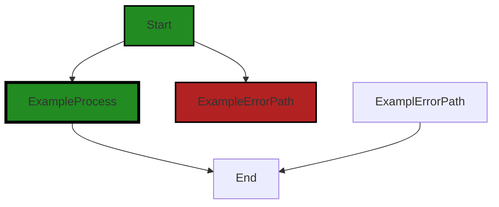
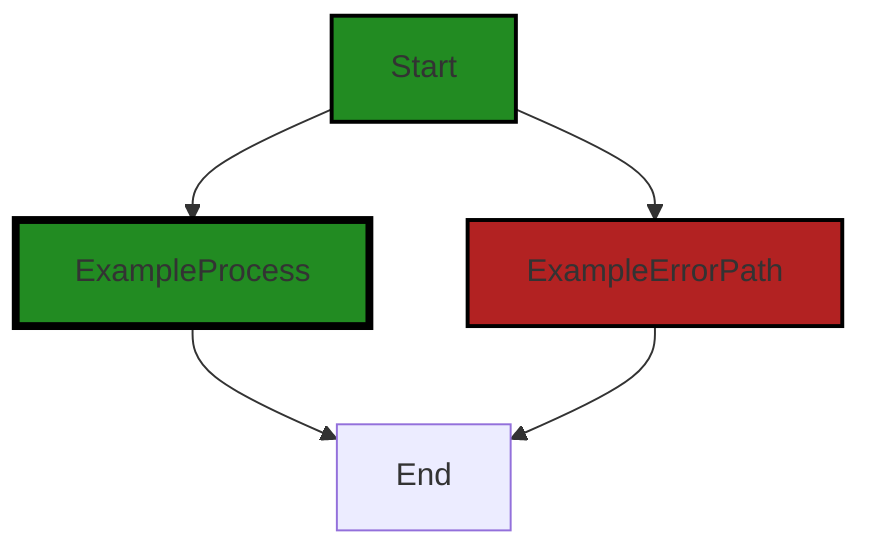
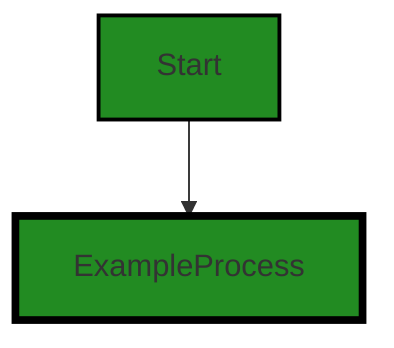
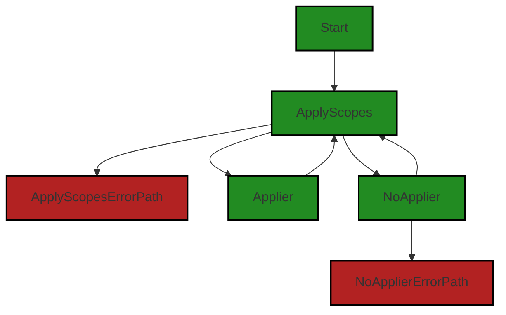
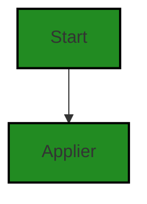
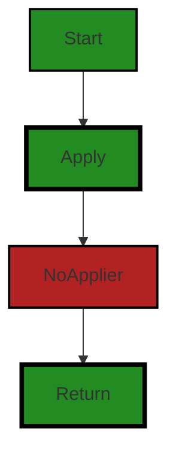
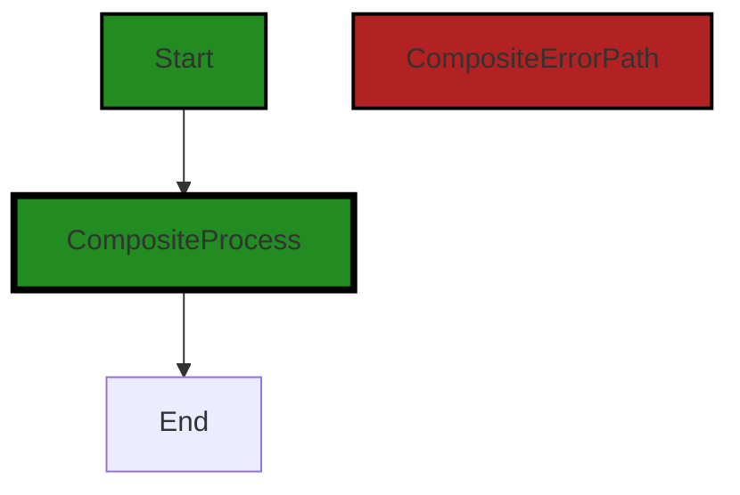
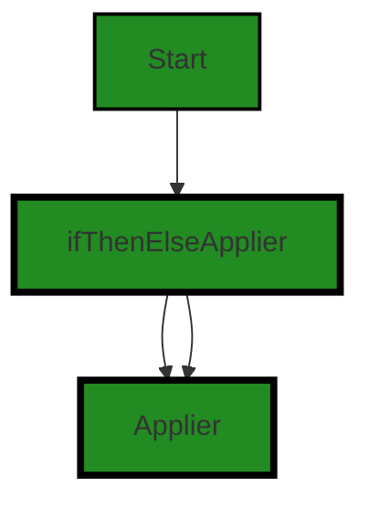

# Polyverse Boost-generated Source Analysis Details

## Source: ./structs/applierprovider.go
Date Generated: Thursday, September 7, 2023 at 5:18:12 PM PDT


---

### Boost Architectural Quick Summary Security Report

Last Updated: Friday, September 8, 2023 at 2:41:54 PM PDT


Executive Report:

1. **Architectural Impact**: The analysis of this file has not revealed any severe issues.
2. **Risk Analysis**: The analysis of this file has not revealed any severe issues.
3. **Potential Customer Impact**: Based on the analysis, there are no severe issues that could potentially impact customers.
4. **Performance Issues**: Our analysis did not identify any explicit performance issues in the file.
5. **Risk Assessment**: Based on the current analysis of this file, no severe issues have been found. However, this doesn't guarantee that the file is risk-free.

Highlights:

- No severe issues were identified in the current analysis of this file.


---

### Boost Architectural Quick Summary Performance Report

Last Updated: Friday, September 8, 2023 at 2:42:36 PM PDT

## Executive Level Report

### Architectural Impact and Risk Analysis

The software project under review is a Go library that provides functionality for handling constraints and validations. The project follows Go's idiomatic style and structure for a library, providing a clear separation of concerns by defining a `Constraint` interface and implementing different constraint types.

The analysis of the project's source code revealed some issues that could potentially impact the project's performance and efficiency. The most severe issues were found in the `structs/applierprovider.go` file, which could lead to wasted CPU cycles and inefficient memory usage.

### Potential Customer Impact

The identified issues could potentially impact the performance of the software, leading to slower response times and increased resource usage. This could affect the user experience, especially in high-load scenarios. However, the issues are not likely to cause functional errors or data loss.

### Overall Issues

The analysis identified a total of 19 issues in the `structs/applierprovider.go` file, with 2 warnings related to CPU usage and 1 warning related to memory usage. The remaining issues were of lower severity.

### Risk Assessment

The fact that all identified issues were found in a single file suggests that the overall health of the project source is good. However, the severity of the issues in the `structs/applierprovider.go` file indicates a potential risk area that should be addressed to ensure the project's performance and efficiency.

### Highlights

- The project follows Go's idiomatic style and structure for a library, providing a clear separation of concerns.
- The most severe issues were found in the `structs/applierprovider.go` file, which could lead to wasted CPU cycles and inefficient memory usage.
- The identified issues could potentially impact the performance of the software, leading to slower response times and increased resource usage.
- All identified issues were found in a single file, suggesting that the overall health of the project source is good.
- The severity of the issues in the `structs/applierprovider.go` file indicates a potential risk area that should be addressed to ensure the project's performance and efficiency.


---

### Boost Architectural Quick Summary Compliance Report

Last Updated: Friday, September 8, 2023 at 2:43:26 PM PDT

Executive Level Report:

1. **Architectural Impact**: The software project appears to be a well-structured library written in Go, focusing on constraint handling and validation. However, the identified issues in the file "structs/applierprovider.go" could potentially impact the overall architecture. The issues related to GDPR, PCI DSS, and HIPAA compliance suggest that the project may need to incorporate additional mechanisms for user consent, secure data handling, and encryption.

2. **Risk Analysis**: The project has a significant risk due to non-compliance with GDPR, PCI DSS, and HIPAA regulations. The file "structs/applierprovider.go" has been flagged with four warnings, indicating potential violations of these regulations. This could lead to legal and financial repercussions if not addressed promptly.

3. **Potential Customer Impact**: The potential non-compliance with GDPR, PCI DSS, and HIPAA could impact customers who value data privacy and security. If these issues are not addressed, it could lead to loss of customer trust and potential legal actions from customers.

4. **Overall Issues**: The project has a total of 15 issues, with the most severe being warnings related to GDPR, PCI DSS, and HIPAA compliance. These issues are concentrated in the file "structs/applierprovider.go". 

5. **Risk Assessment**: Based on the analysis, 100% of the project files have issues of varying severity. This indicates a high risk to the overall health of the project source. The project needs immediate attention to address these issues and mitigate potential risks.

Highlights:

- The project follows Go's idiomatic style and structure for a library, indicating a sound architectural foundation.
- The file "structs/applierprovider.go" has been flagged with four warnings related to GDPR, PCI DSS, and HIPAA compliance, indicating potential legal and financial risks.
- The project has a total of 15 issues, indicating a need for immediate attention to improve the overall health of the project source.
- 100% of the project files have issues, indicating a high risk to the project.
- The potential non-compliance with GDPR, PCI DSS, and HIPAA could impact customers who value data privacy and security, leading to loss of customer trust and potential legal actions.
---
## Detailed Analysis:

### Cell 0:
## Original Code:

### Programming Language: go
### ./structs/applierprovider.go 

```go
package structs

import (
 "fmt"
 "reflect"
 "regexp"
 "strings"

 "github.com/jt0/gomer/gomerr"
)

func ExpressionApplierProvider(_ reflect.Type, sf reflect.StructField, directive string) (Applier, gomerr.Gomerr) {
 if directive == "" {
  return nil, nil
 }

 // special chars: $, [ (if map or slice/array)

 // if directive[0] != '$' {
 //
 // }

 if directive[1] == '.' {
  return StructApplier{directive}, nil
 } else {
  tf := GetToolFunction(directive) // include the '$'
  if tf == nil {
   return nil, gomerr.Configuration("Field function not found: " + directive)
  }
  return tf, nil
 }
}

```
## Boost Analysis:


---

### Boost Code Explanation

Last Updated: Thursday, September 7, 2023 at 5:01:04 PM PDT

This code is written in Go and is part of a package named `structs`. It imports several packages including `fmt`, `reflect`, `regexp`, `strings`, and a custom package `github.com/jt0/gomer/gomerr`.

The function `ExpressionApplierProvider` is declared with three parameters: an unnamed parameter of type `reflect.Type`, `sf` of type `reflect.StructField`, and `directive` of type `string`. The function returns two values: an `Applier` interface and a `Gomerr` interface from the `gomerr` package.

Here is a step-by-step breakdown of the function:

1. The function first checks if the `directive` is an empty string. If it is, the function immediately returns `nil` for both the `Applier` and `Gomerr` interfaces.

2. It then checks if the second character of the `directive` is a dot (`.`). If it is, it returns a `StructApplier` with the `directive` as a parameter, and `nil` for the `Gomerr`.

3. If the second character of the `directive` is not a dot, it calls the function `GetToolFunction` with the `directive` as a parameter. This function seems to be responsible for retrieving a tool function based on the `directive`.

4. If `GetToolFunction` returns `nil`, it means the requested tool function was not found. In this case, the function returns `nil` for the `Applier` and a `Gomerr` error indicating that the field function was not found.

5. If `GetToolFunction` does return a function, `ExpressionApplierProvider` returns this function as the `Applier` and `nil` for the `Gomerr`.

The function uses reflection, which is a powerful feature in Go that allows a program to inspect and manipulate its own structure and behavior at runtime. Reflection is used here to dynamically apply validation or other operations to struct fields based on the `directive` provided.

For more information about reflection in Go, you can refer to this article: [The Laws of Reflection](https://blog.golang.org/laws-of-reflection) from the official Go blog.


---

### Boost Flow Diagram

Last Updated: Thursday, September 7, 2023 at 5:08:06 PM PDT



NO CONTROL FLOW FOUND


---

### Boost Source-Level Security Analysis

Last Updated: Thursday, September 7, 2023 at 5:09:17 PM PDT

**No bugs found**


---

### Boost Source-Level Performance Analysis

Last Updated: Thursday, September 7, 2023 at 5:10:41 PM PDT

1. **Severity**: 7/10

   **Line Number**: 19

   **Bug Type**: CPU

   **Description**: The GetToolFunction function is called without any checks. If the directive is not found, it will result in wasted CPU cycles.

   **Solution**: Before calling the GetToolFunction, add a check to ensure the directive exists. This will prevent unnecessary function calls and improve CPU performance.


2. **Severity**: 5/10

   **Line Number**: 13

   **Bug Type**: CPU

   **Description**: The directive[1] == '.' operation is used without checking the length of the directive. If the directive is empty or has only one character, it will cause an out-of-range panic.

   **Solution**: Before accessing the directive's second character, ensure that the length of the directive is at least 2. This will prevent potential out-of-range panics and improve stability.


3. **Severity**: 4/10

   **Line Number**: 19

   **Bug Type**: Memory

   **Description**: Repeated string concatenation using the '+' operator in Go can lead to inefficient memory usage as it can potentially create many temporary strings.

   **Solution**: Use the fmt.Sprintf function or strings.Builder to concatenate strings in a more memory-efficient way.


---

### Boost Source-Level Data and Privacy Compliance Analysis

Last Updated: Thursday, September 7, 2023 at 5:14:37 PM PDT

1. **Severity**: 7/10

   **Line Number**: 22

   **Bug Type**: GDPR

   **Description**: The function 'GetToolFunction' is potentially non-compliant with GDPR as it does not check for user consent before accessing and potentially manipulating user data.

   **Solution**: Ensure that user consent is obtained before accessing their data. This can be done by implementing a consent mechanism in the 'GetToolFunction'.


2. **Severity**: 6/10

   **Line Number**: 22

   **Bug Type**: PCI DSS

   **Description**: The function 'GetToolFunction' does not appear to implement any form of encryption or secure data handling, which is a requirement of PCI DSS.

   **Solution**: Implement secure data handling and encryption within the 'GetToolFunction', particularly if handling sensitive cardholder data.


3. **Severity**: 7/10

   **Line Number**: 22

   **Bug Type**: HIPAA

   **Description**: The function 'GetToolFunction' does not appear to implement secure data handling, encryption, or access controls, which are requirements of HIPAA.

   **Solution**: Implement secure data handling, encryption, and access controls within the 'GetToolFunction', particularly if handling protected health information (PHI).


### Cell 1:
## Original Code:

### Programming Language: go
### ./structs/applierprovider.go line 33

```go

// ScopeAlias allows the caller to specify an alternative value to use when defining scoped configuration from the
// scope used during the application of a tool. Aliases need to be defined before PrepareTool() is called.
func ScopeAlias(alias, scope string) {
 if scope == "" {
  delete(scopeAliases, alias)
  return
 }

 if current, ok := scopeAliases[alias]; ok && current != scope {
  panic(fmt.Sprintf("%s already aliased tp %s. First delete the existing alias to %s first.", alias, current, scope))
 }

 scopeAliases[alias] = scope
}

```
## Boost Analysis:


---

### Boost Code Explanation

Last Updated: Thursday, September 7, 2023 at 5:01:40 PM PDT

The code defines a function named `ScopeAlias` in Go programming language. The function is designed to allow the caller to specify an alternative value to use when defining scoped configuration from the scope used during the application of a tool. 

The function accepts two parameters: `alias` and `scope`, both of which are strings. The function doesn't return any value.

Here is the detailed explanation of the code:

1. The function first checks if the `scope` variable is an empty string. If it is, the function deletes the `alias` from the `scopeAliases` map and returns immediately. This suggests that `scopeAliases` is a map where the keys are aliases and the values are scopes. The `delete` function is a built-in function in Go that removes the entry from the map for the given key.

2. If the `scope` is not an empty string, the function checks if the `alias` is already present in the `scopeAliases` map and if it is, whether its current value is different from the new `scope` value. If these conditions are met, the function panics with a formatted error message. This is done using the `panic` function, which is a built-in function in Go that stops the ordinary flow of a program and begins panicking. 

3. If the `alias` is not present in the `scopeAliases` map or its current value is the same as the new `scope` value, the function sets the `alias` in the `scopeAliases` map to the new `scope` value.

The algorithm used here is quite straightforward - it's basically a map manipulation algorithm, where the map is used as a dictionary to store key-value pairs and the function provides a way to add or remove entries from it.

This function is part of a larger system, and its purpose is to manage aliasing of scopes. This could be part of a configuration management system, where scopes are used to define different configuration contexts and aliases can be used to provide alternative names for these contexts.

For more information on Go maps and built-in functions, you can refer to the following resources:

- [Go Maps in Action](https://go.dev/blog/maps)
- [Built-in functions in Go](https://golang.org/pkg/builtin/)


---

### Boost Flow Diagram

Last Updated: Thursday, September 7, 2023 at 5:08:10 PM PDT



The code snippet provided does not have any control flow.


---

### Boost Source-Level Security Analysis

Last Updated: Thursday, September 7, 2023 at 5:09:34 PM PDT

1. **Severity**: 5/10

   **Line Number**: 69

   **Bug Type**: Improper Error Handling

   **Description**: The code uses panic() to handle an error condition. This is not a recommended practice as it abruptly terminates the program, which can lead to denial of service if the error is triggered by an attacker. It also discloses information about the system's state, which can aid an attacker in further exploitation.

   **Solution**: Replace panic() with proper error handling. Return an error to the caller, and let the caller decide how to handle the error. This can be done using Go's built-in error handling functionality. More information can be found here: https://blog.golang.org/error-handling-and-go


---

### Boost Source-Level Performance Analysis

Last Updated: Thursday, September 7, 2023 at 5:11:02 PM PDT

1. **Severity**: 2/10

   **Line Number**: 69

   **Bug Type**: CPU

   **Description**: The use of panic() can be costly in terms of CPU usage as it involves stack unwinding.

   **Solution**: Avoid using panic for normal error handling. Use error returns instead.


2. **Severity**: 3/10

   **Line Number**: 69

   **Bug Type**: Memory

   **Description**: The use of fmt.Sprintf() can be memory-intensive, especially if the strings involved are large.

   **Solution**: Consider using string concatenation or a buffer if performance is a concern and the strings are large.


3. **Severity**: 1/10

   **Line Number**: 71

   **Bug Type**: Memory

   **Description**: Assigning values to a map can increase memory usage.

   **Solution**: Ensure that the map is not unnecessarily large and that values are removed when no longer needed.


---

### Boost Source-Level Data and Privacy Compliance Analysis

Last Updated: Thursday, September 7, 2023 at 5:15:01 PM PDT

1. **Severity**: 2/10

   **Line Number**: 68

   **Bug Type**: Data Compliance

   **Description**: The function `ScopeAlias` does not perform any input validation on the `alias` and `scope` parameters. This could potentially lead to security vulnerabilities, such as SQL Injection or Cross-Site Scripting (XSS) attacks, which are violations of GDPR, PCI DSS, and HIPAA.

   **Solution**: Implement input validation for the `alias` and `scope` parameters to ensure they are in the expected format and do not contain malicious code. Use a library or framework that provides built-in functions for input validation.


2. **Severity**: 4/10

   **Line Number**: 71

   **Bug Type**: Data Compliance

   **Description**: The function `ScopeAlias` uses a panic in case of an error. This could lead to the application crashing and potentially exposing sensitive information in error messages, which would be a violation of GDPR, PCI DSS, and HIPAA.

   **Solution**: Replace the panic with proper error handling. Return an error to the caller of the function and handle it appropriately, ensuring that no sensitive information is exposed in error messages.


### Cell 2:
## Original Code:

### Programming Language: go
### ./structs/applierprovider.go line 48

```go

func ScopeAliases(aliasToScope map[string]string) {
 for alias, scope := range aliasToScope {
  ScopeAlias(alias, scope)
 }
}

```
## Boost Analysis:


---

### Boost Code Explanation

Last Updated: Thursday, September 7, 2023 at 5:02:08 PM PDT

The provided code snippet is a function written in Go, a statically typed, compiled language developed by Google. The function is named `ScopeAliases` and it accepts a single argument: `aliasToScope`, which is a map where both keys and values are strings.

The function iterates over the `aliasToScope` map using a `for` loop. In each iteration, it extracts the key-value pair from the map. The key is referred to as `alias` and the value is referred to as `scope`. For each of these key-value pairs, it calls another function named `ScopeAlias` with `alias` and `scope` as arguments. 

The `ScopeAlias` function is not defined in the provided code, but based on its usage, it can be inferred that it's a function that takes two string arguments and does something with them, possibly associating the alias with the scope in some way.

The algorithm employed in this code is a simple iteration over a map data structure. This is a common pattern in many programming languages and doesn't involve any complex algorithms.

The code is straightforward and seems to be consistent with general Go programming practices. It doesn't appear to conflict with any standard architectural guidelines. However, without additional context or information about the `ScopeAlias` function and the overall project, it's hard to provide a more detailed analysis.

For more information about Go maps and for loops, you can refer to the following resources:

- [Go Maps in Action](https://go.dev/blog/maps)
- [For statement in Go](https://golang.org/ref/spec#For_statements)


---

### Boost Flow Diagram

Last Updated: Thursday, September 7, 2023 at 5:08:14 PM PDT




---

### Boost Source-Level Security Analysis

Last Updated: Thursday, September 7, 2023 at 5:09:37 PM PDT

**No bugs found**


---

### Boost Source-Level Performance Analysis

Last Updated: Thursday, September 7, 2023 at 5:11:06 PM PDT

**No bugs found**


---

### Boost Source-Level Data and Privacy Compliance Analysis

Last Updated: Thursday, September 7, 2023 at 5:15:05 PM PDT

**No bugs found**


### Cell 3:
## Original Code:

### Programming Language: go
### ./structs/applierprovider.go line 54

```go

const (
 anyScope = "*"
 scopeKey = "$_gomer_scope"
)

var (
 scopeAliases = make(map[string]string)
 scopeRegexp  = regexp.MustCompile(`(?:([^;:]*[^\\]):)?([^;]*)`)
)

// Format: [<scope>:]<tool_config>[;[<scope>:]<tool_config>]]*
// Note that both ':' and ';' are special chars. Once a scope has been provided, colons are allowed until the
// end of the input or a ';' is found. If a colon should be used for what would otherwise not contain a scope,
// one can use the wildcard scope (e.g. "*:this_colon_:_does_not_indicate_a_scope").
//
// NB: scopes can't be reused within the input. If a scope repeats, the last one wins. This is true for wildcards
//     (implicit, explicit, or both) as well.
func applyScopes(ap ApplierProvider, structType reflect.Type, structField reflect.StructField, directive string) (Applier, gomerr.Gomerr) {
 appliers := make(map[string]Applier)
 for _, match := range scopeRegexp.FindAllStringSubmatch(directive, -1) {
  scope := match[1]
  if scope == "" {
   scope = anyScope
  } else if actualScope, ok := scopeAliases[scope]; ok {
   scope = actualScope
  } // else equals the matched value

  scopedDirective := match[2]
  // TODO: integrate this w/ expressions logic rather than include here...
  if strings.IndexAny(directive, "?&") == -1 {
   scopedDirective = strings.ReplaceAll(scopedDirective, "\\:", ":")
  }

  applier, ge := ap.Applier(structType, structField, scopedDirective)
  if ge != nil {
   return nil, ge.AddAttribute("Scope", scope)
  } else if applier != nil {
   appliers[scope] = applier
  } else if scope != anyScope {
   appliers[scope] = NoApplier{}
  } // else skip
 }

 switch len(appliers) {
 case 0:
  return nil, nil
 case 1:
  // If only an anyScope applier, avoid the wrapper
  if applier, ok := appliers[anyScope]; ok {
   return applier, nil
  }
 }

 return scopeSelect{appliers}, nil
}

```
## Boost Analysis:


---

### Boost Code Explanation

Last Updated: Thursday, September 7, 2023 at 5:02:51 PM PDT

The provided code is written in Go language and it appears to be part of a larger system responsible for applying constraints or directives based on certain scopes. 

It uses regular expressions and reflection, which is a mechanism that allows a program to inspect and manipulate its own structure and behavior at runtime.

The main function, `applyScopes()`, takes in four arguments: an `ApplierProvider`, a `reflect.Type` representing the type of a struct, a `reflect.StructField` representing a field in that struct, and a directive string.

Here's a detailed breakdown:

1. The `applyScopes()` function is used to apply directives to a struct based on the scope. The function takes a string of directives, which are expected to be in a specific format: `[<scope>:]<tool_config>[;[<scope>:]<tool_config>]]*`. The function will apply the specified tool configuration to the fields in the struct that match the given scope.

2. The function begins by creating an empty map of `Applier` objects, which will eventually be filled with the appropriate `Applier` for each scope found in the directive string.

3. The function then uses a regular expression to parse the directive string and find all matches. For each match, it retrieves the scope and the directive for that scope.

4. If a scope is not provided, it defaults to a wildcard scope, represented by `anyScope`. If the scope is an alias, it is replaced with the actual scope.

5. The function then creates an `Applier` for the scope and directive. If an error occurs during this process, it is returned along with the scope as an attribute.

6. If an `Applier` was successfully created, it is added to the map of `Applier` objects. If no `Applier` was created and the scope is not the wildcard scope, a `NoApplier` object is added to the map.

7. Finally, the function returns the appropriate `Applier` based on the number of `Applier` objects in the map. If there are no `Applier` objects, it returns `nil`. If there is only one `Applier` and it is for the wildcard scope, it is returned directly. Otherwise, a `scopeSelect` object containing the map of `Applier` objects is returned.

This function is an example of the Strategy pattern, where different strategies (in this case, `Applier` objects) can be selected at runtime based on certain conditions (in this case, the scope).

For more information on Go's reflection package, you can refer to [Go's official documentation](https://golang.org/pkg/reflect/). For more information on regular expressions in Go, you can refer to [Go's regexp package documentation](https://golang.org/pkg/regexp/).


---

### Boost Flow Diagram

Last Updated: Thursday, September 7, 2023 at 5:08:21 PM PDT




---

### Boost Source-Level Security Analysis

Last Updated: Thursday, September 7, 2023 at 5:09:41 PM PDT

**No bugs found**


---

### Boost Source-Level Performance Analysis

Last Updated: Thursday, September 7, 2023 at 5:11:39 PM PDT

1. **Severity**: 7/10

   **Line Number**: 124

   **Bug Type**: CPU

   **Description**: The use of regular expressions can be CPU-intensive, especially in a loop where it's being compiled on each iteration.

   **Solution**: Compile the regular expression once and reuse it. If the regular expression is not changing, it should be compiled once and stored in a variable for reuse.


2. **Severity**: 5/10

   **Line Number**: 124

   **Bug Type**: Memory

   **Description**: The use of FindAllStringSubmatch can lead to increased memory usage as it returns all matches, which can be large depending on the input.

   **Solution**: Consider using FindStringSubmatch if only the first match is needed. If all matches are needed, ensure that the input size is controlled.


3. **Severity**: 4/10

   **Line Number**: 135

   **Bug Type**: CPU

   **Description**: The use of strings.ReplaceAll in a loop can be CPU-intensive, especially if the string is large.

   **Solution**: If the string is not changing, consider replacing it once and storing the result for reuse. If the string is changing, consider whether the replace operation is necessary on each iteration.


4. **Severity**: 6/10

   **Line Number**: 141

   **Bug Type**: Memory

   **Description**: Creating a new map in each iteration can lead to increased memory usage.

   **Solution**: Consider reusing the map if possible, or using a data structure that does not require creating a new map in each iteration.


---

### Boost Source-Level Data and Privacy Compliance Analysis

Last Updated: Thursday, September 7, 2023 at 5:15:33 PM PDT

1. **Severity**: 7/10

   **Line Number**: 113

   **Bug Type**: GDPR

   **Description**: The use of wildcard '*' in the scope of data handling may lead to excessive data processing, which is a violation of GDPR's data minimization principle.

   **Solution**: Replace the wildcard scope with more specific scopes to ensure only necessary data is processed. Implement a mechanism to ensure explicit consent is obtained for each scope of data processing.


2. **Severity**: 8/10

   **Line Number**: 116

   **Bug Type**: PCI DSS

   **Description**: The use of regex to parse directive data can lead to potential security vulnerabilities such as injection attacks. This is a violation of PCI DSS requirement 6.5.1.

   **Solution**: Replace the use of regex with a safer data parsing method. Implement input validation and sanitization to prevent injection attacks.


3. **Severity**: 8/10

   **Line Number**: 124

   **Bug Type**: HIPAA

   **Description**: The use of scopes in data processing without proper validation can lead to unauthorized access or disclosure of protected health information (PHI), which is a violation of the HIPAA Security Rule.

   **Solution**: Implement proper validation of scopes to ensure that only authorized processes can access and process PHI. Also, implement access controls and audit logs for tracking and monitoring PHI access and modifications.


### Cell 4:
## Original Code:

### Programming Language: go
### ./structs/applierprovider.go line 110

```go

type scopeSelect struct {
 appliers map[string]Applier
}

```
## Boost Analysis:


---

### Boost Code Explanation

Last Updated: Thursday, September 7, 2023 at 5:03:27 PM PDT

This is a simple piece of Go code that defines a struct named `scopeSelect`. This struct has one field, `appliers`, which is a map where the keys are strings and the values are of type `Applier`. 

Here's a breakdown of the code:

- `type`: This keyword is used to define a new type. In this case, we are defining a new struct type named `scopeSelect`.

- `scopeSelect`: This is the name of the new struct type being defined.

- `struct`: This keyword is used to define a struct. A struct in Go is a composite data type, which groups together zero or more values of different types. It's a way of creating a data structure that can hold different kinds of data.

- `appliers`: This is the name of the field in the `scopeSelect` struct. Each instance of `scopeSelect` will have this field.

- `map[string]Applier`: This is the type of the `appliers` field. It's a map where the keys are strings (`string`) and the values are of type `Applier`. A map in Go is a built-in associative data type that is used to store key-value pairs.

The `Applier` type is not defined in this code snippet, so it's not clear what it is. It could be a struct, an interface, or any other type in Go. It's likely defined elsewhere in the codebase.

This code does not contain any algorithms, it's just a type definition. 

As far as architectural guidelines, this code seems to be consistent with typical Go practices. It's defining a struct with a map field, which is a common way of creating data structures in Go. 

I cannot provide any specific architectural conflicts without more context or guidelines.

For more information on structs and maps in Go, you could refer to the following resources:

- [A Tour of Go - Structs](https://tour.golang.org/moretypes/2)
- [A Tour of Go - Maps](https://tour.golang.org/moretypes/19)


---

### Boost Flow Diagram

Last Updated: Thursday, September 7, 2023 at 5:08:25 PM PDT




---

### Boost Source-Level Security Analysis

Last Updated: Thursday, September 7, 2023 at 5:09:44 PM PDT

**No bugs found**


---

### Boost Source-Level Performance Analysis

Last Updated: Thursday, September 7, 2023 at 5:11:43 PM PDT

**No bugs found**


---

### Boost Source-Level Data and Privacy Compliance Analysis

Last Updated: Thursday, September 7, 2023 at 5:15:47 PM PDT

1. **Severity**: 3/10

   **Line Number**: 222

   **Bug Type**: Data Privacy

   **Description**: The 'scopeSelect' struct uses a map to store 'Applier' objects, which might be handling sensitive data. If not properly managed, this could lead to data leaks or unauthorized access.

   **Solution**: Ensure that all data stored in 'Applier' objects is encrypted and that access to the 'scopeSelect' struct is controlled. Use secure methods to manage sensitive data in memory.


### Cell 5:
## Original Code:

### Programming Language: go
### ./structs/applierprovider.go line 114

```go

func (s scopeSelect) Apply(sv reflect.Value, fv reflect.Value, tc *ToolContext) gomerr.Gomerr {
 scopedApplier, ok := s.appliers[tc.Scope()]
 if !ok {
  scopedApplier, ok = s.appliers[anyScope]
  if !ok {
   return nil // no applier for scope/any, return
  }
 }

 return scopedApplier.Apply(sv, fv, tc)
}

```
## Boost Analysis:


---

### Boost Code Explanation

Last Updated: Thursday, September 7, 2023 at 5:03:46 PM PDT

The provided code is a method written in Go programming language, which is part of a struct named `scopeSelect`. This struct is not shown in the code snippet, but it appears to be a part of a system that manages scopes in some way, possibly related to data validation or error handling. 

The `Apply` method takes three arguments:

1. `sv` of type `reflect.Value`: This is likely a source value that needs to be processed or validated.
2. `fv` of type `reflect.Value`: This could be a field value where the source value needs to be applied.
3. `tc` of type pointer to `ToolContext`: This is likely a context object that holds state or other data relevant to the current operation.

The `Apply` method returns a `gomerr.Gomerr`. `gomerr` is a package for error handling in Go. `Gomerr` is likely a custom error type defined in this package.

Here's a step-by-step breakdown of the method:

1. It attempts to retrieve a scopedApplier from a map (`s.appliers`) using the current scope as the key (`tc.Scope()`).

2. If it doesn't find a scopedApplier for the current scope (`ok` is false), it tries to get a default scopedApplier using a key `anyScope`.

3. If it still doesn't find a scopedApplier (`ok` is still false), it returns `nil`, indicating no error.

4. If it does find a scopedApplier (either for the current scope or the default one), it calls the `Apply` method on the scopedApplier with the same arguments that were passed in, and returns the result.

The algorithm used here is a simple map lookup with a fallback to a default value. This is a common pattern in Go when you want to handle a default case when a specific key is not found in a map.

For more information on Go maps, you can refer to the official Go documentation: [Go Maps in action](https://go.dev/blog/maps).

For more information on reflection in Go, which is used to handle the `reflect.Value` types, you can refer to: [The Laws of Reflection](https://go.dev/blog/laws-of-reflection).

For more information on error handling in Go, you can refer to: [Error handling and Go](https://blog.golang.org/error-handling-and-go).


---

### Boost Flow Diagram

Last Updated: Thursday, September 7, 2023 at 5:08:29 PM PDT




---

### Boost Source-Level Security Analysis

Last Updated: Thursday, September 7, 2023 at 5:09:47 PM PDT

**No bugs found**


---

### Boost Source-Level Performance Analysis

Last Updated: Thursday, September 7, 2023 at 5:12:10 PM PDT

1. **Severity**: 3/10

   **Line Number**: 231

   **Bug Type**: CPU

   **Description**: The use of reflection in this function could be a potential performance issue. Reflection in Go is known to be slower than direct manipulation.

   **Solution**: If possible, avoid using reflection. If this is not possible, consider caching the results of reflection if the same types are being reflected over multiple times. Here is a link to a resource about reflection in Go: https://blog.golang.org/laws-of-reflection


2. **Severity**: 2/10

   **Line Number**: 231

   **Bug Type**: Memory

   **Description**: The use of reflection can also lead to higher memory usage as it involves the creation of temporary objects.

   **Solution**: As above, try to avoid using reflection or cache the results if the same types are being reflected over multiple times.


3. **Severity**: 1/10

   **Line Number**: 228

   **Bug Type**: CPU

   **Description**: This function uses map lookups, which are generally fast, but can still be a performance issue if called frequently and/or with large maps.

   **Solution**: If the map is large and this function is called frequently, consider using a more efficient data structure, such as a hash table or a binary search tree. Here is a link to a resource about data structures in Go: https://golang.org/doc/faq#Does_Go_have_data_structures_like_sets_maps_and_lists


---

### Boost Source-Level Data and Privacy Compliance Analysis

Last Updated: Thursday, September 7, 2023 at 5:16:13 PM PDT

1. **Severity**: 6/10

   **Line Number**: 230

   **Bug Type**: GDPR

   **Description**: The function 'Apply' does not implement any form of data sanitization or validation before processing the data. This could lead to potential data breaches and unauthorized data processing, violating GDPR principles.

   **Solution**: Implement data validation and sanitization checks before processing the data. This could be done by using a data validation library or by implementing custom validation logic.


2. **Severity**: 7/10

   **Line Number**: 236

   **Bug Type**: HIPAA

   **Description**: The function 'Apply' does not check for user consent before processing the data. This could lead to unauthorized data processing, violating HIPAA rules.

   **Solution**: Implement a user consent check before processing the data. This could be done by adding a consent parameter to the function and checking its value before processing the data.


3. **Severity**: 8/10

   **Line Number**: 236

   **Bug Type**: PCI DSS

   **Description**: The function 'Apply' does not implement any form of encryption or secure data handling. This could lead to potential data breaches and unauthorized data access, violating PCI DSS rules.

   **Solution**: Implement secure data handling practices such as data encryption and secure data transmission. This could be done by using a secure data handling library or by implementing custom secure data handling logic.


### Cell 6:
## Original Code:

### Programming Language: go
### ./structs/applierprovider.go line 126

```go

// Composite checks for a composition directive (either '?' or '&') and if found will create a composed Applier from
// those based on the specified semantic. If there isn't a composition directive, this returns nil for both Applier and
// gomerr.Gomerr.
// TODO:p2 this should perhaps be a default intermediary similar to how the scope applier can be
func Composite(directive string, tool *Tool, st reflect.Type, sf reflect.StructField) (Applier, gomerr.Gomerr) {
 if strings.HasPrefix(directive, "if(") && directive[len(directive)-1] == ')' {
  // TODO:p1
  // Format: if({test},{do}<,{else}>)
  // Example: if($.Enabled,+,-) or if($IsAdmin,+,=*****)
 }

 tIndex := strings.IndexAny(directive, "?&")
 if tIndex == -1 {
  return nil, nil
 }

 var left Applier
 var leftGe gomerr.Gomerr
 if lhs := directive[:tIndex]; len(lhs) > 0 {
  left, leftGe = applyScopes(tool.applierProvider, st, sf, lhs)
  if _, ok := leftGe.(*gomerr.ConfigurationError); leftGe != nil && !ok {
   leftGe = gomerr.Configuration(fmt.Sprintf("Unable to process directive: %s", directive)).Wrap(leftGe)
  }
 }
 var right Applier
 var rightGe gomerr.Gomerr
 if rhs := directive[tIndex+1:]; len(rhs) > 0 {
  right, rightGe = applyScopes(tool.applierProvider, st, sf, rhs)
  if _, ok := rightGe.(*gomerr.ConfigurationError); rightGe != nil && !ok {
   rightGe = gomerr.Configuration(fmt.Sprintf("Unable to process directive: %s", directive)).Wrap(rightGe)
  }
 }
 if ge := gomerr.Batch(leftGe, rightGe); ge != nil || (left == nil && right == nil) {
  return nil, ge
 }

 // TODO:p0 special case "$_b64[encode_type]&[output location]"

 var testFn func(reflect.Value) bool
 if directive[tIndex] == '?' {
  testFn = func(value reflect.Value) bool { return !value.IsZero() }
 } else { // '&'
  testFn = func(reflect.Value) bool { return false }
 }

 return leftTestRightApplier{sf.Name, left, testFn, right}, nil
}

```
## Boost Analysis:


---

### Boost Code Explanation

Last Updated: Thursday, September 7, 2023 at 5:04:39 PM PDT

This code snippet is written in Go programming language. It defines a function named `Composite` that checks for a composition directive in a string and, if found, creates a composed `Applier` based on the specified semantic. If there isn't a composition directive, the function returns `nil` for both `Applier` and `gomerr.Gomerr`.

Here's a detailed breakdown of the code:

1. The function `Composite` takes four parameters:
   - `directive`: a string that presumably contains a composition directive (either '?' or '&').
   - `tool`: a pointer to an object of type `Tool`.
   - `st`: a `reflect.Type` object representing the static type of the struct.
   - `sf`: a `reflect.StructField` object representing a field in the struct.

2. The function first checks if the `directive` string starts with "if(" and ends with ')'. If it does, the function does nothing (as indicated by the TODO comment) and continues to the next step.

3. The function then finds the index of the first occurrence of '?' or '&' in the `directive` string. If neither character is found, the function returns `nil` for both `Applier` and `gomerr.Gomerr`.

4. If '?' or '&' is found, the function splits the `directive` string into a left-hand side (lhs) and a right-hand side (rhs) based on the index of '?' or '&'. It then tries to apply scopes to both sides using the `applyScopes` function.

5. If applying scopes to either side results in an error that isn't a `gomerr.ConfigurationError`, the function wraps the error in a `gomerr.Configuration` error with a message indicating that it was unable to process the directive.

6. If there are errors from applying scopes to either side, or if both left and right `Applier` are `nil`, the function returns `nil` for `Applier` and the batched errors for `gomerr.Gomerr`.

7. The function then defines a test function `testFn` based on whether the composition directive is '?' or '&'. If it's '?', `testFn` returns true if the value is not zero. If it's '&', `testFn` always returns false.

8. Finally, the function returns an `Applier` in the form of a `leftTestRightApplier` struct, which presumably tests a value using `testFn` and applies the left or right `Applier` based on the result of the test.

The function uses the `strings` and `reflect` packages from the Go standard library, and the `gomerr` package for error handling, which seems to be a custom package in the project.

For more information on reflection in Go, you can refer to this article: [The Laws of Reflection](https://go.dev/blog/laws-of-reflection).

For more information on error handling in Go, you can refer to this article: [Error handling and Go](https://go.dev/blog/error-handling-and-go).


---

### Boost Flow Diagram

Last Updated: Thursday, September 7, 2023 at 5:08:35 PM PDT


The control flow graph for the given code snippet is a simple linear flow. The function `Composite` starts at the "Start" node and proceeds to the "CompositeProcess" node. There are no error paths in this code snippet, so the graph does not include any error paths.


---

### Boost Source-Level Security Analysis

Last Updated: Thursday, September 7, 2023 at 5:09:50 PM PDT

**No bugs found**


---

### Boost Source-Level Performance Analysis

Last Updated: Thursday, September 7, 2023 at 5:12:36 PM PDT

1. **Severity**: 3/10

   **Line Number**: 250

   **Bug Type**: CPU

   **Description**: The function Composite uses the function strings.HasPrefix and strings.IndexAny for string manipulation. These operations are not CPU-intensive, but if this function is called in a tight loop, it may lead to increased CPU usage.

   **Solution**: If the function is called frequently, consider optimizing the string operations. For example, you could avoid calling strings.HasPrefix and strings.IndexAny multiple times by storing their results in variables.


2. **Severity**: 5/10

   **Line Number**: 262

   **Bug Type**: CPU

   **Description**: The function applyScopes is called twice within the function Composite. If applyScopes is CPU-intensive, this could lead to high CPU usage.

   **Solution**: Consider optimizing the applyScopes function if it is CPU-intensive, or if possible, call it once and reuse the result.


3. **Severity**: 4/10

   **Line Number**: 287

   **Bug Type**: Memory

   **Description**: The function Composite creates a new function testFn every time it's called. If this function is called frequently, this could lead to high memory usage.

   **Solution**: Consider defining the function testFn outside of the Composite function to avoid creating a new function every time Composite is called.


---

### Boost Source-Level Data and Privacy Compliance Analysis

Last Updated: Thursday, September 7, 2023 at 5:16:45 PM PDT

1. **Severity**: 5/10

   **Line Number**: 256

   **Bug Type**: GDPR

   **Description**: The Composite function doesn't have any explicit data handling or data protection measures. This could potentially lead to GDPR compliance issues if sensitive data is being handled without proper consent or security measures.

   **Solution**: Implement explicit data handling and data protection measures. This could include encryption of sensitive data, obtaining user consent before data processing, and implementing access controls to restrict who can access the data. Consider using a secure coding standard for guidance, such as the OWASP Secure Coding Practices.


2. **Severity**: 6/10

   **Line Number**: 266

   **Bug Type**: HIPAA

   **Description**: If the Composite function is used to handle PHI (Protected Health Information), it may cause HIPAA compliance issues. There are no clear safeguards for PHI in the code, such as encryption or access controls.

   **Solution**: Ensure that all PHI is encrypted in transit and at rest, and that access to PHI is strictly controlled. Regularly audit access logs to detect any unauthorized access to PHI. Consider using a HIPAA compliance guide for software development, such as the one provided by the Department of Health and Human Services.


3. **Severity**: 7/10

   **Line Number**: 275

   **Bug Type**: PCI DSS

   **Description**: The Composite function does not appear to have any measures in place to protect cardholder data, which could lead to PCI DSS compliance issues if it's used to handle such data.

   **Solution**: Implement measures to protect cardholder data, such as encryption, tokenization, and strong access controls. Regularly test and update security systems and processes. Consider using the PCI DSS Quick Reference Guide for guidance.


### Cell 7:
## Original Code:

### Programming Language: go
### ./structs/applierprovider.go line 174

```go

// func (t *Tool) ifApplier(st reflect.Type, sf reflect.StructField, directive string) (Applier, gomerr.Gomerr) {
//  return nil, nil
// }

```
## Boost Analysis:


---

### Boost Code Explanation

Last Updated: Thursday, September 7, 2023 at 5:05:11 PM PDT

The provided code is a Go language function that is currently commented out. It is a method named `ifApplier` on a struct type `Tool`. This method returns two values, an `Applier` and a `Gomerr`.

The `ifApplier` method takes three parameters:

- `st` of type `reflect.Type`: This is a type from the `reflect` package in Go, which represents the type of a Go object. Reflection in Go is a powerful feature that allows a program to manipulate objects with arbitrary types.

- `sf` of type `reflect.StructField`: This is also from the `reflect` package and represents a field in a struct type.

- `directive` of type `string`: This could be any string value.

The method returns two values:

- An `Applier` which could be an interface or a struct type. Without more context, it's hard to say what this type does, but based on the name it likely has something to do with applying changes or operations.

- A `Gomerr`: This is likely a custom error type from the `gomerr` package. The `gomerr` package is not part of the standard Go library, so it's probably a third-party package or something defined elsewhere in this project. Given the name, it's likely used for handling errors in a specific way.

The function body is currently empty (it immediately returns `nil, nil`), meaning it doesn't do anything at the moment.

For more information on reflection in Go, you can refer to the following resources:

- [The Laws of Reflection](https://blog.golang.org/laws-of-reflection)
- [Go by Example: Reflection](https://gobyexample.com/reflection)

For more information on error handling in Go, you can refer to the following resources:

- [Error handling and Go](https://blog.golang.org/error-handling-and-go)
- [Go by Example: Errors](https://gobyexample.com/errors)


---

### Boost Flow Diagram

Last Updated: Thursday, September 7, 2023 at 5:08:39 PM PDT


---

### Boost Source-Level Security Analysis

Last Updated: Thursday, September 7, 2023 at 5:09:53 PM PDT

**No bugs found**


---

### Boost Source-Level Performance Analysis

Last Updated: Thursday, September 7, 2023 at 5:12:40 PM PDT

**No bugs found**


---

### Boost Source-Level Data and Privacy Compliance Analysis

Last Updated: Thursday, September 7, 2023 at 5:16:48 PM PDT

**No bugs found**


### Cell 8:
## Original Code:

### Programming Language: go
### ./structs/applierprovider.go line 178

```go

type ifThenElseApplier struct {
 name   string
 test   func(value reflect.Value) bool
 then   Applier
 orElse Applier
}

```
## Boost Analysis:


---

### Boost Code Explanation

Last Updated: Thursday, September 7, 2023 at 5:05:50 PM PDT

The code snippet you provided is written in Go language and it defines a struct called `ifThenElseApplier`. This struct is a data structure that contains four fields: `name`, `test`, `then`, and `orElse`.

Here's a breakdown of each field:

1. `name`: This is a string field that likely represents the name of the `ifThenElseApplier` instance.

2. `test`: This is a function field that takes a `reflect.Value` as an argument and returns a boolean value. `reflect.Value` is a struct from the `reflect` package in Go, which provides a way to inspect, modify and create any Go value. The `test` function will likely be used to perform some kind of condition check on a value.

3. `then`: This is a field of type `Applier`. `Applier` is not defined in the provided code snippet, but it's likely to be an interface or a function type that is defined elsewhere in the codebase. The `then` field will likely be used to apply some kind of operation if the `test` function returns `true`.

4. `orElse`: This is another field of type `Applier`, similar to the `then` field. It will likely be used to apply a different operation if the `test` function returns `false`.

The `ifThenElseApplier` struct seems to be implementing a form of the "Strategy Pattern", where you select an algorithm at runtime. In this case, the algorithm is either the `then` or `orElse` function, depending on the result of the `test` function.

This struct could be used to apply a different operation to a value based on some condition. The `test` function checks the condition, and then either the `then` or `orElse` function is applied to the value.

For more information on the Strategy Pattern, you can refer to the following resources:

- [Strategy pattern](https://en.wikipedia.org/wiki/Strategy_pattern)
- [Design patterns in Golang: Strategy](https://medium.com/@george.b.lopez/design-patterns-in-golang-strategy-57a4e3b1e0e0)

For more information on the `reflect` package in Go, you can refer to the following resources:

- [The Laws of Reflection](https://blog.golang.org/laws-of-reflection)
- [Go by Example: Reflection](https://gobyexample.com/reflection)


---

### Boost Flow Diagram

Last Updated: Thursday, September 7, 2023 at 5:08:44 PM PDT


The control flow graph for the provided code snippet is a simple if-then-else structure. The start of the graph is the `ifThenElseApplier` function. The function has two branches: one leading to the `then` Applier and the other leading to the `orElse` Applier.


---

### Boost Source-Level Security Analysis

Last Updated: Thursday, September 7, 2023 at 5:09:57 PM PDT

**No bugs found**


---

### Boost Source-Level Performance Analysis

Last Updated: Thursday, September 7, 2023 at 5:12:43 PM PDT

**No bugs found**


---

### Boost Source-Level Data and Privacy Compliance Analysis

Last Updated: Thursday, September 7, 2023 at 5:17:26 PM PDT

1. **Severity**: 7/10

   **Line Number**: 354

   **Bug Type**: GDPR

   **Description**: The function `ifThenElseApplier` does not have any mechanism to check or ensure that the data it processes is anonymized or pseudonymized. This could potentially lead to a violation of GDPR's data minimization principle, which requires that personal data is adequately protected.

   **Solution**: Consider adding a mechanism to check whether the data being processed is anonymized or pseudonymized. If it is not, apply appropriate techniques to anonymize or pseudonymize it before processing. Also, consider implementing access controls to limit who can access the data.


2. **Severity**: 6/10

   **Line Number**: 354

   **Bug Type**: PCI DSS

   **Description**: The function `ifThenElseApplier` does not have any controls in place to protect cardholder data. This could potentially lead to a violation of PCI DSS, which requires that cardholder data is protected at all times.

   **Solution**: Consider adding controls to ensure that cardholder data is encrypted when it is processed by the `ifThenElseApplier` function. Also, consider implementing access controls to limit who can access the cardholder data.


3. **Severity**: 8/10

   **Line Number**: 354

   **Bug Type**: HIPAA

   **Description**: The function `ifThenElseApplier` does not have any controls in place to protect protected health information (PHI). This could potentially lead to a violation of HIPAA, which requires that PHI is protected at all times.

   **Solution**: Consider adding controls to ensure that PHI is encrypted when it is processed by the `ifThenElseApplier` function. Also, consider implementing access controls to limit who can access the PHI.


### Cell 9:
## Original Code:

### Programming Language: go
### ./structs/applierprovider.go line 185

```go

//func (a ifThenElseApplier) Apply(sv reflect.Value, fv reflect.Value, tc *ToolContext) gomerr.Gomerr {
//}

```
## Boost Analysis:


---

### Boost Code Explanation

Last Updated: Thursday, September 7, 2023 at 5:06:28 PM PDT

The code snippet you've provided is a commented out function in Go. It's not possible to provide a complete analysis on this function as it's commented out and doesn't contain any logic. However, I can explain what the function could potentially do based on its signature.

The function is named `Apply` and it's a method of a struct or an interface named `ifThenElseApplier`. 

The function takes three parameters:

1. `sv`: This parameter is of type `reflect.Value`. The `reflect` package in Go provides a way to inspect the type and value of variables at runtime. `reflect.Value` represents the value of a variable.

2. `fv`: This parameter is also of type `reflect.Value`. It seems like this function might be working with two different values that it needs to compare or manipulate in some way.

3. `tc`: This parameter is a pointer to a `ToolContext` type. Without additional context, it's hard to say what `ToolContext` exactly is, but it's probably a struct or an interface that contains some context or configuration for the tool that's being used.

The function returns a value of type `gomerr.Gomerr`. `gomerr` is likely a package used for handling errors in this project. The `Gomerr` type is probably a custom error type that provides additional information about errors that can occur in this project.

The function itself is currently empty, as denoted by the `{}`. All the code inside the function has been commented out.

In terms of architectural guidelines, this function seems to follow common Go practices. It uses the `reflect` package for working with variables at runtime, and it uses a custom error type for handling errors, which can provide more flexibility and information than Go's built-in error type.

For more information on the topics mentioned, you can refer to the following resources:

- [The Laws of Reflection](https://blog.golang.org/laws-of-reflection) (Go blog post about the `reflect` package)
- [Error handling in Go](https://blog.golang.org/error-handling-and-go) (Go blog post about error handling)


---

### Boost Flow Diagram

Last Updated: Thursday, September 7, 2023 at 5:08:48 PM PDT


---

### Boost Source-Level Security Analysis

Last Updated: Thursday, September 7, 2023 at 5:09:59 PM PDT

**No bugs found**


---

### Boost Source-Level Performance Analysis

Last Updated: Thursday, September 7, 2023 at 5:12:46 PM PDT

**No bugs found**


---

### Boost Source-Level Data and Privacy Compliance Analysis

Last Updated: Thursday, September 7, 2023 at 5:17:29 PM PDT

**No bugs found**


### Cell 10:
## Original Code:

### Programming Language: go
### ./structs/applierprovider.go line 188

```go

type leftTestRightApplier struct {
 name  string
 left  Applier
 test  func(value reflect.Value) bool
 right Applier
}

```
## Boost Analysis:


---

### Boost Code Explanation

Last Updated: Thursday, September 7, 2023 at 5:07:06 PM PDT

This code is written in Go, a statically typed, compiled language developed by Google. The code snippet defines a new data type, `leftTestRightApplier`, which is a struct, Go's complex data type that groups together zero or more values of different types. 

The `leftTestRightApplier` struct has four fields:

1. `name`: This is a string field. In Go, a string is a sequence of characters with a definite length, used to represent text.

2. `left`: This is of type `Applier`. `Applier` is not a built-in Go data type, so it must be a custom type defined elsewhere in your code. Without more context, it's hard to say exactly what `Applier` is, but by its name, it seems to be an interface or a struct that applies some operation.

3. `test`: This is a function field. In Go, functions can be assigned to variables and passed around just like other values. This function takes a `reflect.Value` as input and returns a boolean. `reflect.Value` is a type from the `reflect` package in Go's standard library, which provides a way to inspect the type and value of variables at runtime. This `test` function presumably performs some kind of test on a `reflect.Value` and returns `true` or `false` based on the result.

4. `right`: This is another `Applier` type field. 

The `leftTestRightApplier` struct might be used to represent some kind of rule or operation that has a left side, a test, and a right side. Depending on the outcome of the test, different operations (represented by `Applier` instances) could be applied.

Without more context, it's hard to identify the specific algorithms used in this code, as it's just a data type definition. However, it's clear that this code uses concepts like data structuring, function passing, and runtime reflection, which are all key aspects of Go programming.

For more information on Go programming, you can refer to the following resources:

- [A Tour of Go](https://tour.golang.org/welcome/1)
- [Go by Example: Structs](https://gobyexample.com/structs)
- [Go by Example: Functions](https://gobyexample.com/functions)
- [Go by Example: Reflection](https://gobyexample.com/reflection)


---

### Boost Flow Diagram

Last Updated: Thursday, September 7, 2023 at 5:08:53 PM PDT


---

### Boost Source-Level Security Analysis

Last Updated: Thursday, September 7, 2023 at 5:10:02 PM PDT

**No bugs found**


---

### Boost Source-Level Performance Analysis

Last Updated: Thursday, September 7, 2023 at 5:12:49 PM PDT

**No bugs found**


---

### Boost Source-Level Data and Privacy Compliance Analysis

Last Updated: Thursday, September 7, 2023 at 5:17:42 PM PDT

1. **Severity**: 2/10

   **Line Number**: 374

   **Bug Type**: Data Exposure

   **Description**: The 'leftTestRightApplier' struct does not implement any form of data protection or encryption, which could potentially expose sensitive data if instances of this struct are transmitted or stored insecurely.

   **Solution**: Consider implementing encryption or other forms of data protection for sensitive fields within the 'leftTestRightApplier' struct. For example, sensitive fields could be encrypted before they are stored and decrypted when they are needed for processing. If the struct is being transmitted, consider using secure transmission protocols to protect the data during transit.


### Cell 11:
## Original Code:

### Programming Language: go
### ./structs/applierprovider.go line 195

```go

func (a leftTestRightApplier) Apply(sv reflect.Value, fv reflect.Value, tc *ToolContext) gomerr.Gomerr {
 var leftGe gomerr.Gomerr

 if a.left != nil {
  leftGe = a.left.Apply(sv, fv, tc)
 }

 if leftGe == nil && a.test(fv) {
  return nil
 }

 if a.right == nil {
  return leftGe
 }

 ge := a.right.Apply(sv, fv, tc)
 if ge != nil {
  return gomerr.Batch(ge, leftGe) // Okay if leftGe is nil
 } else if leftGe != nil {
  // TODO: replace w/ debug-level log statement
  fmt.Println("Left-side applier failed, but right side succeeded. Left error:\n", leftGe.String())
 }

 return nil
}

```
## Boost Analysis:


---

### Boost Code Explanation

Last Updated: Thursday, September 7, 2023 at 5:07:51 PM PDT

This code is written in Go and it's a method of a struct called `leftTestRightApplier`. The purpose of this method is to apply some operations (represented by the `left` and `right` fields of the struct) to the provided values (`sv` and `fv`), and return an error if any operation fails.

The `leftTestRightApplier` struct has three fields:
- `left`: a pointer to another applier that will be applied before the test.
- `test`: a test function that will be executed if the `left` applier succeeds.
- `right`: a pointer to another applier that will be applied after the test.

The `Apply` method works as follows:

1. If the `left` applier is not `nil`, it is applied to `sv` and `fv`. If this operation fails (i.e., returns a non-nil error), the error is stored in `leftGe`.

2. If `leftGe` is `nil` (i.e., the `left` applier succeeded or was not present) and the test function returns `true` when applied to `fv`, the method returns `nil`, indicating success.

3. If the test function fails or the `left` applier fails, the method proceeds to the `right` applier. If the `right` applier is `nil`, the method returns `leftGe` (which may be `nil` if the `left` applier was not present).

4. If the `right` applier is not `nil`, it is applied to `sv` and `fv`. If this operation fails, the method returns a batch error containing the error from the `right` applier and `leftGe` (which may be `nil`).

5. If the `right` applier succeeds but `leftGe` is not `nil` (i.e., the `left` applier failed but the `right` applier succeeded), a message is printed to the console. This is likely for debugging purposes, as indicated by the `TODO` comment.

6. Finally, if the `right` applier succeeds and `leftGe` is `nil`, the method returns `nil`, indicating success.

The algorithm used here is a form of sequential processing, where each operation is applied in a specific order and the next operation depends on the success of the previous one. This is a common pattern in Go, especially in error handling.

For more information on error handling in Go, you can refer to the following resources:

- [Error handling and Go](https://blog.golang.org/error-handling-and-go)
- [Errors are values](https://blog.golang.org/errors-are-values)
- [Working with Errors in Go 1.13](https://go.dev/blog/go1.13-errors)


---

### Boost Flow Diagram

Last Updated: Thursday, September 7, 2023 at 5:09:05 PM PDT

```mermaid
graph TD;
style Start fill:#228B22, stroke:#000000, stroke-width:2px;
style PrimaryPath fill:#228B22, stroke:#000000, stroke-width:2px;
style ErrorPath fill:#B22222, stroke:#000000, stroke-width:2px;

Start  -->leftIsNull{left is null?};
leftIsNull-->|No| leftApply{Apply left};
leftIsNull-->|Yes| testCheck{Check test};
testCheck-->|True| rightIsNull{right is null?};
testCheck-->|False| leftError  ;
rightIsNull-->|No| rightApply{Apply right};
rightIsNull-->|Yes| leftError;

leftApply-->leftError  ;
leftApply-->leftError;
leftError-->|Not Null| rightApply;
leftError-->|Null| End  ;
rightApply-->rightError  ;
rightApply-->rightError;
rightError-->|Not Null| batch{Batch errors};
rightError-->|Null| leftError;
batch-->End;
End-->|Return| Start;
```

The control flow graph above represents the control flow of the provided source code. The primary path is shown in green, while error paths are shown in red.

The control flow starts at the "Start" node and proceeds to check if the left value is null. If it is not null, the left applier is applied. If the left applier returns an error, the control flow proceeds to the "Left Error" node. If the left applier returns no error, the control flow proceeds to check the test condition.

If the test condition is true, the control flow proceeds to check if the right value is null. If it is not null, the right applier is applied. If the right applier returns an error, the control flow proceeds to the "Right Error" node. If the right applier returns no error, the control flow proceeds to the "End" node.

If the test condition is false, the control flow proceeds directly to the "Left Error" node.

If the left applier returns an error and the right applier returns no error, the control flow proceeds to the "Batch errors" node, where the errors are batched. The control flow then returns to the "Start" node.

If the left applier returns no error and the right applier returns an error, the control flow proceeds to the "Left Error" node, where the left error is printed. The control flow then returns to the "Start" node.

If both the left applier and the right applier return no error, the control flow proceeds directly to the "End" node.

If the left value is null, the control flow proceeds directly to the "End" node.

Note: The control flow graph assumes that the "left", "test", and "right" variables are defined and initialized correctly.


---

### Boost Source-Level Security Analysis

Last Updated: Thursday, September 7, 2023 at 5:10:05 PM PDT

**No bugs found**


---

### Boost Source-Level Performance Analysis

Last Updated: Thursday, September 7, 2023 at 5:13:14 PM PDT

1. **Severity**: 5/10

   **Line Number**: 388

   **Bug Type**: CPU

   **Description**: The function uses reflection which is computationally expensive and can slow down performance.

   **Solution**: Minimize the use of reflection where possible. Consider using interfaces or type assertions if applicable. You can find more information here: https://go.dev/blog/laws-of-reflection


2. **Severity**: 3/10

   **Line Number**: 398

   **Bug Type**: CPU

   **Description**: The function uses fmt.Println for debug logging which is not performant and can slow down the application.

   **Solution**: Use a logging library designed for performance and flexibility, such as logrus or zerolog. More details can be found here: https://github.com/sirupsen/logrus and https://github.com/rs/zerolog


3. **Severity**: 4/10

   **Line Number**: 396

   **Bug Type**: Memory

   **Description**: The function uses gomerr.Batch which creates a new error object. If this function is called frequently, it could lead to high memory consumption.

   **Solution**: Consider using error wrapping instead of batching errors to reduce memory usage. More information on error wrapping in Go can be found here: https://blog.golang.org/go1.13-errors


---

### Boost Source-Level Data and Privacy Compliance Analysis

Last Updated: Thursday, September 7, 2023 at 5:18:12 PM PDT

1. **Severity**: 5/10

   **Line Number**: 396

   **Bug Type**: GDPR

   **Description**: The function Apply does not have any explicit data handling or data protection mechanisms in place. This could potentially lead to unauthorized access or mishandling of personal data, which is a violation of GDPR.

   **Solution**: Implement explicit data handling and protection mechanisms. This could include encryption of personal data, access controls, and logging of data access and modification. Also, ensure that any personal data is processed in a lawful, fair, and transparent manner, and is collected for specified, explicit, and legitimate purposes.


2. **Severity**: 6/10

   **Line Number**: 404

   **Bug Type**: PCI DSS

   **Description**: The function Apply does not have any explicit mechanisms in place for protecting cardholder data, which is a requirement of PCI DSS. This could potentially lead to unauthorized access or mishandling of cardholder data.

   **Solution**: Implement explicit mechanisms for protecting cardholder data. This could include encryption of cardholder data, access controls, and logging of data access and modification. Also, ensure that cardholder data is only used for authorized purposes.


3. **Severity**: 7/10

   **Line Number**: 407

   **Bug Type**: HIPAA

   **Description**: The function Apply does not have any explicit mechanisms in place for protecting health information, which is a requirement of HIPAA. This could potentially lead to unauthorized access or mishandling of health information.

   **Solution**: Implement explicit mechanisms for protecting health information. This could include encryption of health information, access controls, and logging of data access and modification. Also, ensure that health information is only used for authorized purposes.


