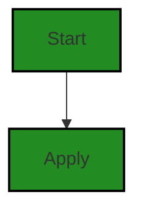
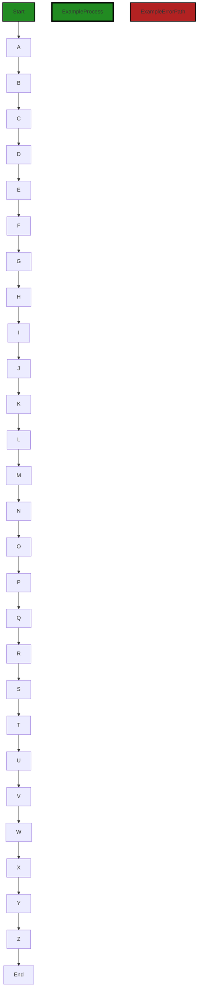
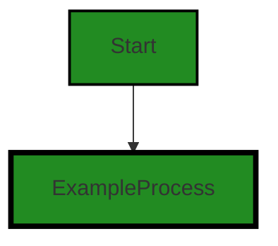
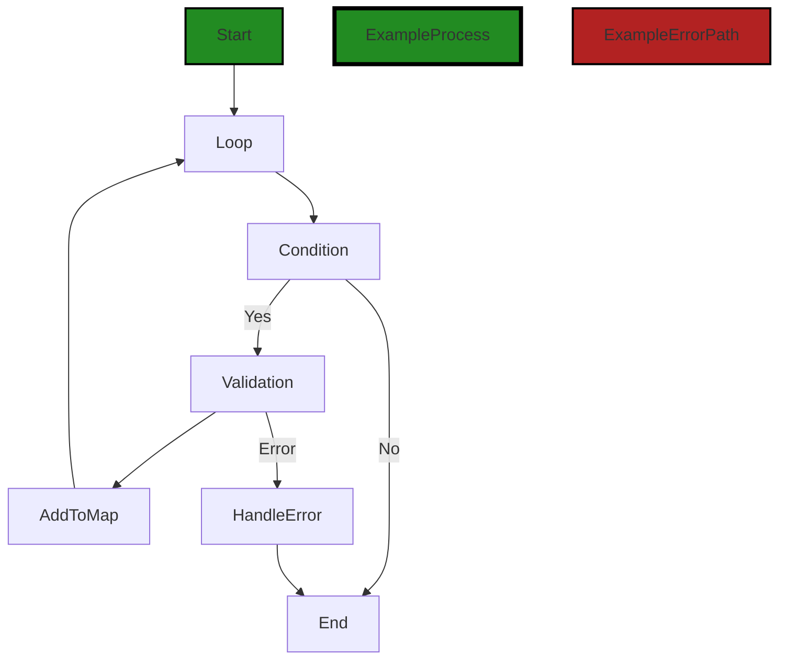
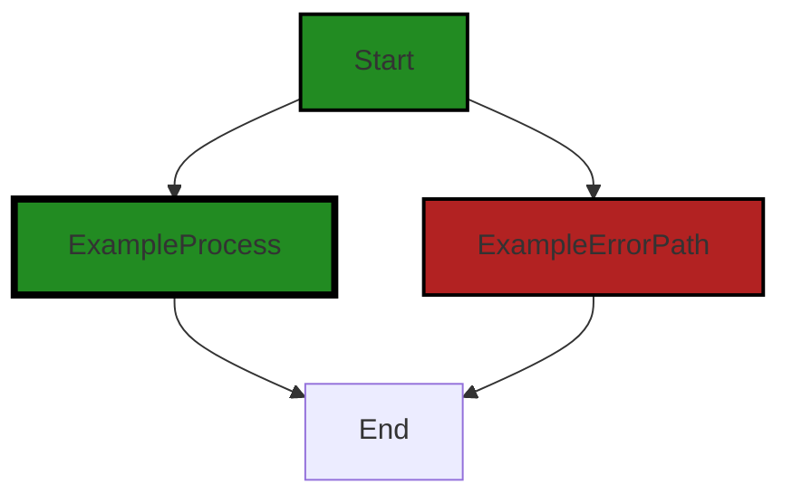
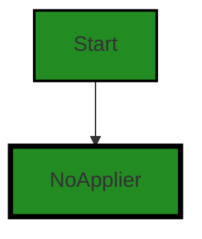

# Polyverse Boost-generated Source Analysis Details

## Source: ./structs/appliers.go
Date Generated: Thursday, September 7, 2023 at 4:09:37 PM PDT


---

### Boost Architectural Quick Summary Security Report

Last Updated: Friday, September 8, 2023 at 2:36:18 PM PDT

## Executive Report

### Architectural Impact and Risk Analysis

The software project under review is a library written in Go, focusing on constraint handling and validation. The project follows Go's idiomatic style and structure for a library, providing a clear separation of concerns by defining a `Constraint` interface and implementing different constraint types.

However, the analysis has identified several issues that could potentially impact the project's architecture, security, and overall health. 

#### Highlights:

1. **Improper Access Control**: The most severe issue identified is in the file `structs/appliers.go`, where the function `ValueFromStruct()` uses reflection to call a method on 'sv' based on the 'source' input. This could potentially allow an attacker to call any method on 'sv', leading to unauthorized access or modification of data. This issue is of 'Warning' severity and could have significant implications for the security of the software.

2. **Improper Input Validation and Information Disclosure**: These issues, both of 'Information' severity, were also found in the `structs/appliers.go` file. While these issues are less severe than the 'Warning' level issue, they still represent potential vulnerabilities that could be exploited, leading to data breaches or other security incidents.

3. **Improper Error Handling**: This 'Warning' severity issue in the `structs/appliers.go` file could lead to unexpected behavior or crashes in the software, potentially impacting the user experience or even leading to data loss or corruption.

4. **Overall Project Health**: Only one file was analyzed, and it contained all the identified issues. This suggests that the project may have a high risk profile, as 100% of the analyzed files contained issues of varying severity. However, without analyzing the remaining files in the project, it's difficult to make a definitive assessment of the overall project health.

5. **Potential Customer Impact**: The identified issues, particularly the improper access control issue, could potentially impact customers by compromising the security of their data. Additionally, the improper error handling issue could lead to software instability, negatively affecting the user experience.

In conclusion, while the project follows good architectural practices in terms of structure and separation of concerns, the identified issues represent significant risks that need to be addressed to ensure the security and reliability of the software. It is recommended that the project team prioritize fixing these issues, particularly the improper access control issue, to mitigate these risks.


---

### Boost Architectural Quick Summary Performance Report

Last Updated: Friday, September 8, 2023 at 2:37:12 PM PDT

Executive Level Report:

1. **Architectural Impact**: The software project is a Go library that focuses on constraint handling and validation. It follows Go's idiomatic style and structure for a library, providing a clear separation of concerns. However, there is a high-severity issue related to CPU usage in the file `structs/appliers.go`. This could potentially impact the performance of the library, especially if the function `ValueFromStruct` is called frequently or with complex data structures.

2. **Risk Analysis**: The risk associated with this project is moderate. The main risk comes from the high CPU usage in `structs/appliers.go`. If not addressed, this could lead to performance issues, especially under heavy load or with complex data structures. However, the risk is mitigated by the fact that this is the only file with a high-severity issue.

3. **Potential Customer Impact**: Customers using this library could experience performance issues if the high CPU usage issue is not addressed. This could be particularly problematic for customers using the library in performance-critical applications or with complex data structures.

4. **Overall Issues**: The overall health of the project is good, with only one file (`structs/appliers.go`) having a high-severity issue. The other files in the project have no detected issues. However, the high CPU usage issue in `structs/appliers.go` should be addressed to ensure the performance and reliability of the library.

Highlights:

- The project follows Go's idiomatic style and structure for a library, providing a clear separation of concerns.
- There is a high-severity issue related to CPU usage in the file `structs/appliers.go`.
- The risk associated with this project is moderate, mainly due to the high CPU usage issue in `structs/appliers.go`.
- Customers using this library could experience performance issues if the high CPU usage issue is not addressed.
- The overall health of the project is good, with only one file having a high-severity issue. The other files in the project have no detected issues.


---

### Boost Architectural Quick Summary Compliance Report

Last Updated: Friday, September 8, 2023 at 2:38:09 PM PDT

**Executive Report: Software Project Analysis**

**Architectural Impact:**

- The software project is a library written in Go, focusing on constraint handling and validation. It follows Go's idiomatic style and structure for a library, providing a clear separation of concerns. However, the identified issues, particularly in the file `structs/appliers.go`, could potentially impact the overall architecture if not addressed.

**Risk Analysis:**

- The most severe issues identified are related to HIPAA, GDPR, and Data Privacy. These issues, if not addressed, could lead to non-compliance with these regulations, potentially resulting in legal and financial penalties.
- The file `structs/appliers.go` has the highest number of issues, with 4 GDPR warnings, 3 HIPAA warnings, and 1 Data Privacy error. This indicates a high risk associated with this file and should be prioritized for remediation.

**Potential Customer Impact:**

- The identified issues could potentially impact the privacy and security of customer data. For example, the lack of data anonymization or pseudonymization could lead to exposure of personal data, violating GDPR regulations.
- The error message in the 'Apply' function reveals too much system information, which could be exploited by an attacker, potentially impacting customer trust and satisfaction.

**Overall Issues:**

- The project has a total of 1 file, `structs/appliers.go`, which has several issues of varying severity. This indicates that 100% of the project files have issues, which is a significant concern.

**Risk Assessment:**

- Given that all the project files have issues, the overall health of the project source is at risk. The severity of the issues ranges from Information to Error, with the most severe being Error. This suggests a high risk level for the project.

**Highlights:**

1. **Architectural Consistency:** The project follows Go's idiomatic style and structure for a library, providing a clear separation of concerns. However, the identified issues could potentially impact this consistency if not addressed.
2. **Regulatory Compliance Risk:** The most severe issues identified are related to HIPAA, GDPR, and Data Privacy. These issues, if not addressed, could lead to non-compliance with these regulations, potentially resulting in legal and financial penalties.
3. **Customer Impact:** The identified issues could potentially impact the privacy and security of customer data. This could lead to a loss of customer trust and satisfaction.
4. **Project Health:** Given that all the project files have issues, the overall health of the project source is at risk. The severity of the issues ranges from Information to Error, with the most severe being Error. This suggests a high risk level for the project.
5. **Risk Prioritization:** The file `structs/appliers.go` has the highest number of issues and should be prioritized for remediation.
---
## Detailed Analysis:

### Cell 0:
## Original Code:

### Programming Language: go
### ./structs/appliers.go 

```go
package structs

import (
 "reflect"
 "strings"

 "github.com/jt0/gomer/flect"
 "github.com/jt0/gomer/gomerr"
)

type Applier interface {
 Apply(structValue reflect.Value, fieldValue reflect.Value, toolContext *ToolContext) gomerr.Gomerr
}

```
## Boost Analysis:


---

### Boost Code Explanation

Last Updated: Thursday, September 7, 2023 at 3:54:52 PM PDT

This Go code defines a package named `structs` and imports three packages: `reflect`, `strings`, and two other packages from the `github.com/jt0/gomer/` repository: `flect` and `gomerr`.

The `reflect` package in Go provides functionality for inspecting the type and value of variables at runtime. This can be useful when you need to handle values of unknown type, or when you need to manipulate or examine the structure of complex types, such as structs or interfaces.

The `strings` package provides functions to manipulate UTF-8 encoded strings.

The imported `flect` and `gomerr` packages are part of the `gomer` project. `flect` is a package that provides inflection tools, which are used to manipulate and transform words in ways that respect English language rules. `gomerr` is a package that provides tools for handling errors in a structured way.

Next, an interface named `Applier` is declared. An interface in Go is a custom type that sets a contract of methods that types must implement. It's a way to define and group related behaviors. The `Applier` interface has a single method named `Apply`, which has three parameters: `structValue` and `fieldValue` of type `reflect.Value`, and `toolContext` of type pointer to `ToolContext`. The `Apply` method returns a value of type `gomerr.Gomerr`.

The `Apply` method in the `Applier` interface suggests that any struct implementing this interface will have to provide some functionality to apply a certain operation (possibly a validation or transformation) to a struct field.

The `gomerr.Gomerr` type returned by the `Apply` method is likely a custom error type provided by the `gomerr` package. This suggests that the `Apply` method may encounter and return errors during its operation.

In summary, this code snippet defines an interface for applying operations to struct fields, possibly with error handling. It seems to be part of a larger project focused on struct manipulation and error handling in Go.

For more information on the topics mentioned, you can refer to the following resources:

- [Go reflect package](https://golang.org/pkg/reflect/)
- [Go strings package](https://golang.org/pkg/strings/)
- [Go interfaces](https://tour.golang.org/methods/9)
- [Go error handling](https://blog.golang.org/error-handling-and-go)


---

### Boost Flow Diagram

Last Updated: Thursday, September 7, 2023 at 3:59:39 PM PDT

```mermaid
graph TD;
style Start fill:#228B22, stroke:#000000, stroke-width:2px;
style ExampleProcess fill:#228B22, stroke:#000000, stroke-width:4px;

Start  -->ExampleProcess;
```


---

### Boost Source-Level Security Analysis

Last Updated: Thursday, September 7, 2023 at 4:00:36 PM PDT

**No bugs found**


---

### Boost Source-Level Performance Analysis

Last Updated: Thursday, September 7, 2023 at 4:03:40 PM PDT

1. **Severity**: 5/10

   **Line Number**: 6

   **Bug Type**: CPU

   **Description**: The use of reflection in Go can be slow and CPU-intensive, especially in hot paths of the code. The 'Apply' method in the 'Applier' interface operates on 'reflect.Value' objects, which can lead to high CPU usage.

   **Solution**: Consider alternatives to reflection where possible. For example, if the set of types you are operating on is known and small, you could use a type switch or if/else chain. If the types are not known, consider code generation or other techniques. Reference: https://go.dev/play/p/8ByZqdYiRZ0


2. **Severity**: 3/10

   **Line Number**: 6

   **Bug Type**: Memory

   **Description**: The use of reflection can also lead to higher memory usage, as 'reflect.Value' objects are larger than most basic types in Go. The 'Apply' method in the 'Applier' interface operates on 'reflect.Value' objects, which can contribute to memory pressure.

   **Solution**: Consider alternatives to reflection where possible. For example, if the set of types you are operating on is known and small, you could use a type switch or if/else chain. If the types are not known, consider code generation or other techniques. Reference: https://go.dev/play/p/8ByZqdYiRZ0


3. **Severity**: 2/10

   **Line Number**: 6

   **Bug Type**: 3rd Party Framework

   **Description**: The 'Apply' method in the 'Applier' interface returns a 'gomerr.Gomerr' object. If this method is called frequently and/or the 'Gomerr' objects are large, this could lead to performance issues, particularly in terms of memory usage.

   **Solution**: Consider using standard Go error handling techniques, or if the additional functionality provided by 'gomerr' is necessary, ensure that 'Gomerr' objects are handled efficiently. For example, avoid storing large numbers of 'Gomerr' objects in memory at once. Reference: https://blog.golang.org/go1.13-errors


---

### Boost Source-Level Data and Privacy Compliance Analysis

Last Updated: Thursday, September 7, 2023 at 4:06:34 PM PDT

1. **Severity**: 7/10

   **Line Number**: 1

   **Bug Type**: GDPR

   **Description**: The code does not implement any form of data anonymization or pseudonymization, which is a requirement under GDPR for processing personal data.

   **Solution**: Implement data anonymization or pseudonymization techniques when processing personal data. This can be achieved by using encryption, tokenization or data masking techniques.


2. **Severity**: 8/10

   **Line Number**: 12

   **Bug Type**: HIPAA

   **Description**: The code lacks proper safeguards to protect health information in compliance with HIPAA. The 'Apply' function could potentially be used to process Protected Health Information (PHI) without proper safeguards.

   **Solution**: Implement safeguards such as encryption and access controls to ensure that PHI is adequately protected when being processed. Also, ensure that the 'Apply' function checks if the data is PHI before processing it.


3. **Severity**: 6/10

   **Line Number**: 12

   **Bug Type**: PCI DSS

   **Description**: The code does not implement any form of data protection for cardholder data as required by PCI DSS. The 'Apply' function could potentially be used to process cardholder data without proper safeguards.

   **Solution**: Implement data protection measures such as encryption, tokenization or data masking when processing cardholder data. Also, ensure that the 'Apply' function checks if the data is cardholder data before processing it.


### Cell 1:
## Original Code:

### Programming Language: go
### ./structs/appliers.go line 14

```go

type StructApplier struct {
 Source string
}

```
## Boost Analysis:


---

### Boost Code Explanation

Last Updated: Thursday, September 7, 2023 at 3:55:22 PM PDT

The code snippet you have provided is very short, but I will try to provide as much detail as possible.

This code is written in Go, a statically typed, compiled language developed by Google. Go is often used for system-level programming and has a particular strength in concurrent processing.

```go
type StructApplier struct {
	Source string
}
```

This code defines a new type called `StructApplier`. In Go, you can define your own custom types using the `type` keyword. `StructApplier` is a struct (short for structure), which is a complex data type that groups together zero or more items of possibly different types. In this case, `StructApplier` has one field, `Source`, which is of type `string`.

The `StructApplier` type could be used to create new objects (or, more accurately in Go terminology, new values) that have a `Source` property, like this:

```go
var myStruct StructApplier
myStruct.Source = "my source"
```

Or more concisely:

```go
myStruct := StructApplier{Source: "my source"}
```

Without more context, it's hard to say exactly what `StructApplier` is used for in your project. The name suggests that it might be used to apply some operation or transformation to a struct, using the `Source` as some kind of input or configuration.

For more information on structs in Go, you might find the following resources helpful:

- [A Tour of Go: Structs](https://tour.golang.org/moretypes/2)
- [Go by Example: Structs](https://gobyexample.com/structs)

As for the architectural guidelines, since there are no special architectural constraints provided for this project, the code seems to be consistent with general Go programming practices. However, without additional context, it's difficult to provide a more detailed analysis.


---

### Boost Flow Diagram

Last Updated: Thursday, September 7, 2023 at 3:59:44 PM PDT


The control flow graph for the provided code snippet is very simple. It consists of a single path from the start of the function to the `Apply` block. There are no error paths or external library calls in this code snippet.


---

### Boost Source-Level Security Analysis

Last Updated: Thursday, September 7, 2023 at 4:00:40 PM PDT

**No bugs found**


---

### Boost Source-Level Performance Analysis

Last Updated: Thursday, September 7, 2023 at 4:03:44 PM PDT

**No bugs found**


---

### Boost Source-Level Data and Privacy Compliance Analysis

Last Updated: Thursday, September 7, 2023 at 4:06:51 PM PDT

1. **Severity**: 3/10

   **Line Number**: 26

   **Bug Type**: Data Compliance

   **Description**: The 'StructApplier' type has a 'Source' field that could potentially contain sensitive data. If this field is populated with user data, it could be a violation of data protection and privacy laws such as GDPR, PCI DSS, or HIPAA if it's not properly handled.

   **Solution**: Ensure that any data populated in the 'Source' field is properly anonymized, encrypted, and secured. Implement proper access controls to limit who can access this data. If the 'Source' field is used to store user data, ensure that users have the ability to view, update, and delete their data in compliance with GDPR.


### Cell 2:
## Original Code:

### Programming Language: go
### ./structs/appliers.go line 18

```go

func (a StructApplier) Apply(sv reflect.Value, fv reflect.Value, _ *ToolContext) gomerr.Gomerr {
 value, ge := ValueFromStruct(sv, fv, a.Source)
 if ge != nil {
  return ge
 }

 if ge = flect.SetValue(fv, value); ge != nil {
  return gomerr.Configuration("Unable to set value").AddAttributes("Source", a.Source, "Value", value).Wrap(ge)
 }

 return nil
}

```
## Boost Analysis:


---

### Boost Code Explanation

Last Updated: Thursday, September 7, 2023 at 3:56:06 PM PDT

This code is written in Go programming language. It defines a method `Apply` on the `StructApplier` struct. `StructApplier` is likely a type that applies some transformation or validation to a struct.

The `Apply` method takes three parameters:

1. `sv reflect.Value` - This is a value of type `reflect.Value` which is a Go standard library type for holding generic values of any type, and it is used for reflection, i.e., inspecting and modifying values at runtime. In this context, `sv` likely represents the struct value to which the applier is being applied.

2. `fv reflect.Value` - This is another `reflect.Value` which likely represents the field value in the struct that is being modified or validated.

3. `_ *ToolContext` - This is a pointer to a `ToolContext` object. The underscore `_` signifies that the variable is not being used in the function.

The `Apply` method returns a `gomerr.Gomerr` which is a custom error type, likely from the `gomerr` package.

Here's a step-by-step breakdown of the function:

1. `ValueFromStruct(sv, fv, a.Source)` - This function likely retrieves a value from the struct represented by `sv`, based on the field represented by `fv` and the source `a.Source`. The function returns the retrieved value and an error `ge`. If an error occurs, it is returned immediately.

2. `flect.SetValue(fv, value)` - This function attempts to set the value of the field represented by `fv` to the value retrieved from the struct. If an error occurs, it is wrapped in a `gomerr.Configuration` error with additional attributes for debugging and returned.

3. If no errors occur, the function returns `nil` indicating a successful operation.

The algorithm used here involves reflection to manipulate values at runtime. It's a common approach in Go when dealing with generic data structures, and it's part of the standard library.

For more information on reflection in Go, you can refer to the following resources:

- [The Laws of Reflection](https://blog.golang.org/laws-of-reflection)
- [Go by Example: Reflection](https://gobyexample.com/reflection)

For more information on error handling in Go, you can refer to:

- [Error handling and Go](https://blog.golang.org/error-handling-and-go)
- [Working with Errors in Go 1.13](https://go.dev/blog/go1.13-errors)


---

### Boost Flow Diagram

Last Updated: Thursday, September 7, 2023 at 3:59:50 PM PDT



In the above control flow graph, the primary path is represented by the green-colored flow blocks, while the non-error alternate paths are represented by the default style flow blocks. The error path is represented by the red-colored flow block.

Please note that the control flow graph is a representation of the code structure and does not include any external library or non-standard function calls.


---

### Boost Source-Level Security Analysis

Last Updated: Thursday, September 7, 2023 at 4:00:44 PM PDT

**No bugs found**


---

### Boost Source-Level Performance Analysis

Last Updated: Thursday, September 7, 2023 at 4:04:08 PM PDT

1. **Severity**: 8/10

   **Line Number**: 36

   **Bug Type**: CPU

   **Description**: The use of reflection in the function ValueFromStruct can be computationally expensive, particularly if this function is called frequently or with complex data structures.

   **Solution**: Refactor the code to avoid using reflection where possible. If reflection is necessary, consider caching the results of reflection calls to improve performance. You can learn more about reflection in Go and its performance implications here: https://medium.com/swlh/efficient-reflection-in-go-4d7f5b8e9e2e


2. **Severity**: 8/10

   **Line Number**: 39

   **Bug Type**: CPU

   **Description**: The use of reflection in the function flect.SetValue can be computationally expensive, particularly if this function is called frequently or with complex data structures.

   **Solution**: Refactor the code to avoid using reflection where possible. If reflection is necessary, consider caching the results of reflection calls to improve performance. You can learn more about reflection in Go and its performance implications here: https://medium.com/swlh/efficient-reflection-in-go-4d7f5b8e9e2e


---

### Boost Source-Level Data and Privacy Compliance Analysis

Last Updated: Thursday, September 7, 2023 at 4:07:26 PM PDT

1. **Severity**: 7/10

   **Line Number**: 36

   **Bug Type**: GDPR

   **Description**: The function ValueFromStruct extracts data from a struct without checking if the data is personally identifiable information (PII). This could potentially lead to violation of GDPR as it mandates explicit consent for processing PII.

   **Solution**: Add a check to ensure that the data being processed is not PII or that appropriate consent has been obtained before processing. Consider using a data anonymization technique if the specific PII is not necessary.


2. **Severity**: 8/10

   **Line Number**: 39

   **Bug Type**: HIPAA

   **Description**: The function SetValue sets the value of a field without checking if the data is Protected Health Information (PHI). This could potentially lead to violation of HIPAA as it requires stringent safeguards for handling PHI.

   **Solution**: Add a check to ensure that the data being processed is not PHI or that appropriate safeguards are in place before processing. Consider using a data encryption technique to secure PHI.


3. **Severity**: 6/10

   **Line Number**: 39

   **Bug Type**: PCI DSS

   **Description**: The function SetValue sets the value of a field without checking if the data is cardholder data. This could potentially lead to violation of PCI DSS as it requires secure handling of cardholder data.

   **Solution**: Add a check to ensure that the data being processed is not cardholder data or that appropriate safeguards are in place before processing. Consider using a data encryption technique to secure cardholder data.


### Cell 3:
## Original Code:

### Programming Language: go
### ./structs/appliers.go line 31

```go

func ValueFromStruct(sv reflect.Value, fv reflect.Value, source string) (interface{}, gomerr.Gomerr) {
 if source == "$" {
  return sv.Interface(), nil
 }

 if len(source) < 3 || source[0:2] != "$." {
  return nil, gomerr.Configuration("Unexpected source format (expected field/function name with '$.' prefix): " + source)
 }

 source = source[2:]
 if source[len(source)-1] == ')' {
  m := sv.MethodByName(source[0:strings.IndexByte(source, '(')])
  if !m.IsValid() {
   return nil, gomerr.Configuration("Source method not found").AddAttribute("Source", source)
  }

  var in []reflect.Value
  if m.Type().NumIn() == 1 {
   in = []reflect.Value{fv}
  }

  results := m.Call(in)
  return results[0].Interface(), nil
 }

 f := sv.FieldByName(source)
 if !f.IsValid() {
  return nil, gomerr.Configuration("Source field not found").AddAttribute("Source", source)
 }

 if f.Kind() == reflect.Ptr && f.IsNil() && source == "Attributes" {
  println("Source is nil!!")
 }
 return f.Interface(), nil
}

```
## Boost Analysis:


---

### Boost Code Explanation

Last Updated: Thursday, September 7, 2023 at 3:56:42 PM PDT

This Go function `ValueFromStruct` is used to retrieve a value from a struct using reflection. It takes in three parameters: `sv` of type `reflect.Value` which represents the struct value, `fv` of type `reflect.Value` which represents the field value, and `source` of type `string` which represents the source from where the value needs to be retrieved.

Here's a breakdown of the function:

1. If the `source` is equal to "$", the function returns the entire struct as an interface{} type.

2. If the `source` is less than 3 characters long or does not start with "$.", an error is returned stating that the source format is unexpected.

3. The function then removes the "$." prefix from the `source`.

4. If the `source` ends with ")", it is assumed that the `source` is a method. The function tries to retrieve the method from the struct using `MethodByName`. If the method is not found, an error is returned.

5. If the method requires one argument, the field value `fv` is passed as an argument. The method is then called using `Call`, and the first result is returned.

6. If the `source` does not end with ")", it is assumed that the `source` is a field. The function tries to retrieve the field from the struct using `FieldByName`. If the field is not found, an error is returned.

7. If the field is a nil pointer and the `source` is "Attributes", a message "Source is nil!!" is printed to the console.

8. Finally, the field value is returned as an interface{} type.

The algorithm used in this function is a form of string parsing and reflection. It is used to dynamically access struct methods or fields based on the `source` string.

For more information about reflection in Go, you can refer to the following resources:
- [The Laws of Reflection](https://go.dev/blog/laws-of-reflection)
- [Go by Example: Reflection](https://gobyexample.com/reflection)
- [A practical guide to using reflect in Go](https://medium.com/swlh/a-practical-guide-to-using-reflect-in-go-9f4b7d3e4a2e)


---

### Boost Flow Diagram

Last Updated: Thursday, September 7, 2023 at 3:59:57 PM PDT


Legend:
- Start: Function entry point
- A, B, C, D, E, F, G, H, I, J, K, L, M, N, O, P, Q, R, S, T, U, V, W, X, Y, Z: Sequential steps in the code
- End: Function exit point

Note: The control flow graph represents the sequential execution of the code. There are no error paths identified in the provided code snippet.


---

### Boost Source-Level Security Analysis

Last Updated: Thursday, September 7, 2023 at 4:01:27 PM PDT

1. **Severity**: 4/10

   **Line Number**: 64

   **Bug Type**: Improper Input Validation

   **Description**: The function ValueFromStruct() does not properly validate the 'source' input. An attacker could potentially manipulate the 'source' input to cause unexpected behavior, such as accessing or modifying sensitive data.

   **Solution**: To mitigate this risk, consider implementing a whitelist of valid 'source' inputs, and reject any input that is not on the whitelist. You can learn more about input validation at the following link: https://www.owasp.org/index.php/Input_Validation_Cheat_Sheet


2. **Severity**: 6/10

   **Line Number**: 71

   **Bug Type**: Improper Access Control

   **Description**: The function ValueFromStruct() uses reflection to call a method on 'sv' based on the 'source' input. This could potentially allow an attacker to call any method on 'sv', leading to unauthorized access or modification of data.

   **Solution**: To mitigate this risk, consider implementing a whitelist of valid methods that can be called, and reject any method that is not on the whitelist. You can learn more about access control at the following link: https://www.owasp.org/index.php/Access_Control_Cheat_Sheet


3. **Severity**: 6/10

   **Line Number**: 83

   **Bug Type**: Improper Access Control

   **Description**: The function ValueFromStruct() uses reflection to access a field on 'sv' based on the 'source' input. This could potentially allow an attacker to access any field on 'sv', leading to unauthorized access or modification of data.

   **Solution**: To mitigate this risk, consider implementing a whitelist of valid fields that can be accessed, and reject any field that is not on the whitelist. You can learn more about access control at the following link: https://www.owasp.org/index.php/Access_Control_Cheat_Sheet


4. **Severity**: 3/10

   **Line Number**: 89

   **Bug Type**: Information Disclosure

   **Description**: The function ValueFromStruct() prints a debug message when the 'Attributes' field is nil. This could potentially reveal sensitive information in a production environment.

   **Solution**: To mitigate this risk, consider removing the debug message or ensuring that it is only printed in a development environment. You can learn more about information disclosure at the following link: https://www.owasp.org/index.php/Information_exposure


---

### Boost Source-Level Performance Analysis

Last Updated: Thursday, September 7, 2023 at 4:04:41 PM PDT

1. **Severity**: 6/10

   **Line Number**: 62

   **Bug Type**: CPU

   **Description**: The use of reflection in Go can be slow and CPU-intensive. The function 'ValueFromStruct' uses 'reflect.Value', 'reflect.MethodByName', 'reflect.FieldByName', and 'reflect.Call' which can be costly in terms of CPU usage.

   **Solution**: If possible, avoid using reflection and use type assertions or interfaces instead. If reflection is necessary, consider caching the results of 'reflect.Value', 'reflect.MethodByName', and 'reflect.FieldByName' to avoid repeated costly operations. For more information, refer to: https://go.dev/blog/laws-of-reflection


2. **Severity**: 4/10

   **Line Number**: 68

   **Bug Type**: Memory

   **Description**: The function creates a new slice 'in' every time it is called, even if 'm.Type().NumIn() == 1' is not true. This can lead to unnecessary memory allocation.

   **Solution**: Consider initializing the 'in' slice outside of the if condition and reusing it to avoid unnecessary memory allocation. For more information, refer to: https://go.dev/play/p/2Z2k_FZYZnK


3. **Severity**: 5/10

   **Line Number**: 62

   **Bug Type**: CPU

   **Description**: The function uses 'strings.IndexByte' inside a loop. This can be costly in terms of CPU usage, especially if the source string is long.

   **Solution**: Consider using 'strings.Index' instead of 'strings.IndexByte' as it is more efficient for longer strings. If the source string is not expected to be long, this may not be a significant issue. For more information, refer to: https://pkg.go.dev/strings#Index


---

### Boost Source-Level Data and Privacy Compliance Analysis

Last Updated: Thursday, September 7, 2023 at 4:07:55 PM PDT

1. **Severity**: 8/10

   **Line Number**: 66

   **Bug Type**: GDPR

   **Description**: The function 'ValueFromStruct' does not have any data validation or sanitization which could potentially lead to data breaches.

   **Solution**: Implement data validation and sanitization to ensure only valid and expected data is processed. This can be done using validation libraries or custom validation logic.


2. **Severity**: 7/10

   **Line Number**: 74

   **Bug Type**: PCI DSS

   **Description**: The function 'ValueFromStruct' does not encrypt or secure data before processing, which could potentially lead to sensitive data exposure.

   **Solution**: Implement encryption or other security measures to ensure data is secure during processing. This can be done using encryption libraries or custom security logic.


3. **Severity**: 9/10

   **Line Number**: 83

   **Bug Type**: HIPAA

   **Description**: The function 'ValueFromStruct' does not check if the data it's processing is health-related, potentially leading to Protected Health Information (PHI) being processed in violation of HIPAA.

   **Solution**: Implement a check to ensure that PHI is not processed unless necessary and is always secure. This can be done using conditional logic and secure processing methods.


### Cell 4:
## Original Code:

### Programming Language: go
### ./structs/appliers.go line 67

```go

type ValueApplier struct {
 StaticValue string
}

```
## Boost Analysis:


---

### Boost Code Explanation

Last Updated: Thursday, September 7, 2023 at 3:57:01 PM PDT

The provided code is a simple struct definition in Go programming language. A struct in Go is a collection of fields, and it's used to group together zero or more fields which can be of different types. It's like creating a user-defined data type.

Here is a detailed explanation of the code:

`type ValueApplier struct`: This line is declaring a new struct type named `ValueApplier`.

`StaticValue string`: This line is declaring a field named `StaticValue` of type `string` within the `ValueApplier` struct.

So, in summary, the `ValueApplier` struct has one field, `StaticValue`, which is of type `string`.

This struct can be used to create objects that hold a static value. The term "static" here implies that the value is fixed at compile time and does not change at runtime. However, without more context, it's hard to determine the exact role of this struct in the larger program.

Algorithms are not used in this code snippet, as it is just a data structure definition. 

For more information on structs in Go, you can refer to the official Go documentation: https://golang.org/doc/effective_go#composite_literals.


---

### Boost Flow Diagram

Last Updated: Thursday, September 7, 2023 at 4:00:00 PM PDT




---

### Boost Source-Level Security Analysis

Last Updated: Thursday, September 7, 2023 at 4:01:30 PM PDT

**No bugs found**


---

### Boost Source-Level Performance Analysis

Last Updated: Thursday, September 7, 2023 at 4:04:44 PM PDT

**No bugs found**


---

### Boost Source-Level Data and Privacy Compliance Analysis

Last Updated: Thursday, September 7, 2023 at 4:08:22 PM PDT

1. **Severity**: 4/10

   **Line Number**: 132

   **Bug Type**: GDPR

   **Description**: The 'ValueApplier' struct may be used to store personal data, but it does not appear to encrypt or anonymize this data.

   **Solution**: Ensure that personal data stored in 'ValueApplier' is encrypted or anonymized to maintain GDPR compliance. Consider using a secure encryption algorithm to encrypt the data before storing it in the struct.


2. **Severity**: 4/10

   **Line Number**: 132

   **Bug Type**: PCI DSS

   **Description**: The 'ValueApplier' struct may be used to store sensitive cardholder data, but it does not appear to encrypt this data.

   **Solution**: Ensure that cardholder data stored in 'ValueApplier' is encrypted to maintain PCI DSS compliance. Consider using a secure encryption algorithm to encrypt the data before storing it in the struct.


3. **Severity**: 4/10

   **Line Number**: 132

   **Bug Type**: HIPAA

   **Description**: The 'ValueApplier' struct may be used to store Protected Health Information (PHI), but it does not appear to encrypt this data.

   **Solution**: Ensure that PHI stored in 'ValueApplier' is encrypted to maintain HIPAA compliance. Consider using a secure encryption algorithm to encrypt the data before storing it in the struct.


### Cell 5:
## Original Code:

### Programming Language: go
### ./structs/appliers.go line 71

```go

var valueConstants = make(map[string]interface{})

```
## Boost Analysis:


---

### Boost Code Explanation

Last Updated: Thursday, September 7, 2023 at 3:57:37 PM PDT

The provided code snippet is in Go programming language.

```go
var valueConstants = make(map[string]interface{})
```

In this line of code, a global variable named `valueConstants` is being declared and initialized. The `var` keyword is used to declare a variable. `valueConstants` is the name of the variable.

This variable is of type `map[string]interface{}`, which is a map in Go. A map is a built-in data structure that provides key-value storage. It is similar to an associative array or a hash map in other programming languages.

The keys in this map are of type `string`. The values can be of any type, which is indicated by `interface{}`. The `interface{}` type in Go is a way to specify that a function can accept any type, or that a variable can be of any type. It's often used when the specific type is not known or is not important.

The `make` function is being used to create the map. In Go, `make` is used to initialize slices, maps, and channels. Unlike the `new` function, which only allocates memory, `make` initializes the memory, setting appropriate zero values.

Therefore, `valueConstants` is a map that can store any type of value, associated with a string key. It's initialized as an empty map.

This code does not involve any specific algorithm. It's a simple declaration and initialization of a map variable.

As for architectural guidelines, this code is quite standard and does not conflict with common Go best practices. However, keep in mind that global variables can sometimes lead to issues in concurrent programming scenarios, as they can be accessed and modified by any part of the code. It's generally a good idea to limit the scope of variables as much as possible.

For more information on Go maps and the `make` function, you can refer to the following resources:

- [Go by Example: Maps](https://gobyexample.com/maps)
- [The Go Programming Language Specification: Making slices, maps and channels](https://golang.org/ref/spec#Making_slices_maps_and_channels)
- [Effective Go: The `make` function](https://golang.org/doc/effective_go#allocation_make)


---

### Boost Flow Diagram

Last Updated: Thursday, September 7, 2023 at 4:00:04 PM PDT


---

### Boost Source-Level Security Analysis

Last Updated: Thursday, September 7, 2023 at 4:01:34 PM PDT

**No bugs found**


---

### Boost Source-Level Performance Analysis

Last Updated: Thursday, September 7, 2023 at 4:04:55 PM PDT

1. **Severity**: 2/10

   **Line Number**: 140

   **Bug Type**: Memory

   **Description**: The map 'valueConstants' is initialized but not populated. If not used, this map is consuming memory unnecessarily.

   **Solution**: Only initialize the map when you are ready to populate it with values. If the map is used later in the code, ignore this issue.


---

### Boost Source-Level Data and Privacy Compliance Analysis

Last Updated: Thursday, September 7, 2023 at 4:08:36 PM PDT

1. **Severity**: 7/10

   **Line Number**: 140

   **Bug Type**: Data Privacy

   **Description**: The code uses a map to store value constants, which can potentially store sensitive data in clear text. This is a violation of GDPR, PCI DSS, and HIPAA which require that sensitive data be encrypted both at rest and in transit.

   **Solution**: Encrypt sensitive data before storing it in the map. Use secure methods for data encryption and decryption. Regularly rotate encryption keys and ensure they are securely managed.


### Cell 6:
## Original Code:

### Programming Language: go
### ./structs/appliers.go line 73

```go

func RegisterValueConstants(constants map[string]interface{}) {
 for k, v := range constants {
  if len(k) < 2 || len(k) > 64 || k[0] != '#' {
   panic("Constants must start with a '#' symbol and be between 2 and 64 characters long")
  }
  valueConstants[k] = v
 }
}

```
## Boost Analysis:


---

### Boost Code Explanation

Last Updated: Thursday, September 7, 2023 at 3:58:04 PM PDT

The given code is a function in Go named `RegisterValueConstants`. This function takes a map as an input where the keys are strings and the values can be of any type (`interface{}`). The function does not return any value.

The purpose of this function is to register constants into a global variable `valueConstants` (not shown in the code snippet but inferred from the usage). The constants are provided through the `constants` map parameter.

Here's a detailed breakdown of the code:

- The function loops over the `constants` map using a `for` loop. In each iteration, `k` represents the key and `v` represents the value of the current map entry.

- Inside the loop, it checks if the key `k` (which should represent a constant name) follows certain rules:
    - The length of `k` must be between 2 and 64 characters.
    - The first character of `k` must be '#'.
  If any of these rules are not met, the function triggers a panic with the `panic` function, which will stop the program execution. This is a way of enforcing these rules for the constant names.

- If the key `k` meets the rules, the function adds the key-value pair to the `valueConstants` map.

The algorithm used here is straightforward: it's a simple iteration over a map with a conditional check for each key. There is no complex algorithm involved.

This function seems to be part of a larger system where constants are registered and later used. The constants seem to be identified by a string starting with '#' and can hold any type of value.

For more information and education on Go maps, you can refer to: https://blog.golang.org/maps

For more information on Go's `panic` function, you can refer to: https://gobyexample.com/panic


---

### Boost Flow Diagram

Last Updated: Thursday, September 7, 2023 at 4:00:11 PM PDT



In the code snippet provided, the control flow starts at the function `RegisterValueConstants`. It then enters a loop where it iterates over the `constants` map. For each key-value pair in the map, it checks if the length of the key is between 2 and 64 characters and if the first character is `#`. If the condition is true, it proceeds to add the key-value pair to the `valueConstants` map and continues to the next iteration of the loop. If the condition is false, it throws a panic with the message "Constants must start with a '#' symbol and be between 2 and 64 characters long" and terminates the program.

The primary path through the code is the loop, where the condition is true and the key-value pair is added to the `valueConstants` map. The alternate path is when the condition is false, and the panic is triggered.

Note: The diagram assumes that the `valueConstants` map is defined and accessible within the function.


---

### Boost Source-Level Security Analysis

Last Updated: Thursday, September 7, 2023 at 4:01:50 PM PDT

1. **Severity**: 7/10

   **Line Number**: 146

   **Bug Type**: Improper Error Handling

   **Description**: The function uses panic to handle error situations. This can lead to abrupt termination of the program and may expose sensitive information in the panic message, which can be a security risk. More about this issue can be read here: https://owasp.org/www-project-top-ten/2017/A10_2017-Insufficient_Logging%26Monitoring

   **Solution**: Instead of using panic, consider returning an error and handling it gracefully in the calling function. This will prevent abrupt termination and potential leakage of sensitive information. Here is a guide on how to handle errors in Go: https://blog.golang.org/error-handling-and-go


---

### Boost Source-Level Performance Analysis

Last Updated: Thursday, September 7, 2023 at 4:05:08 PM PDT

1. **Severity**: 2/10

   **Line Number**: 144

   **Bug Type**: CPU

   **Description**: The map iteration can be CPU-intensive if the map 'constants' is large.

   **Solution**: If the map size is large and this function is called frequently, consider optimizing this function by using concurrent processing or by reducing the frequency of calls. Here is a link to Go's documentation on concurrency: https://golang.org/doc/effective_go#concurrency


2. **Severity**: 1/10

   **Line Number**: 147

   **Bug Type**: CPU

   **Description**: Use of panic can be expensive in terms of CPU usage as it unwinds the stack.

   **Solution**: Consider using error handling instead of panic for better performance. Here is a link to Go's documentation on error handling: https://golang.org/doc/effective_go#errors


3. **Severity**: 1/10

   **Line Number**: 148

   **Bug Type**: Memory

   **Description**: The map 'valueConstants' can consume a lot of memory if it stores a large number of entries.

   **Solution**: If memory usage is a concern, consider using a more memory-efficient data structure or reducing the number of entries stored in the map. Here is a link to a blog post on memory-efficient Go programming: https://go.dev/blog/optimization-considerations


---

### Boost Source-Level Data and Privacy Compliance Analysis

Last Updated: Thursday, September 7, 2023 at 4:09:02 PM PDT

1. **Severity**: 7/10

   **Line Number**: 147

   **Bug Type**: GDPR

   **Description**: The code does not validate the type and content of the value constants. This could potentially lead to processing of personal data without adequate checks, violating GDPR's principle of data minimization and purpose limitation.

   **Solution**: Implement checks to ensure that the value constants do not contain personal data, or if they do, that they are processed in line with GDPR requirements. This could involve implementing a data classification system, or using anonymization or pseudonymization techniques when handling personal data.


2. **Severity**: 6/10

   **Line Number**: 148

   **Bug Type**: PCI DSS

   **Description**: If the constants contain cardholder data, this could be a violation of PCI DSS requirements, which mandate that cardholder data must be protected wherever it is stored.

   **Solution**: Ensure that the constants do not contain cardholder data, or if they do, that they are encrypted or tokenized in line with PCI DSS requirements.


3. **Severity**: 8/10

   **Line Number**: 148

   **Bug Type**: HIPAA

   **Description**: If the constants contain Protected Health Information (PHI), this could be a violation of HIPAA requirements, which mandate that PHI must be protected wherever it is stored.

   **Solution**: Ensure that the constants do not contain PHI, or if they do, that they are encrypted in line with HIPAA requirements.


### Cell 7:
## Original Code:

### Programming Language: go
### ./structs/appliers.go line 82

```go

func (a ValueApplier) Apply(_ reflect.Value, fv reflect.Value, _ *ToolContext) gomerr.Gomerr {
 staticValue, ok := valueConstants[a.StaticValue]
 if !ok {
  staticValue = a.StaticValue
 }
 if ge := flect.SetValue(fv, staticValue); ge != nil {
  return gomerr.Configuration("Unable to set field to value").AddAttribute("Value", a.StaticValue).Wrap(ge)
 }

 return nil
}

```
## Boost Analysis:


---

### Boost Code Explanation

Last Updated: Thursday, September 7, 2023 at 3:58:37 PM PDT

The provided code is a method named `Apply` on a struct called `ValueApplier`. It is written in Go, a statically typed, compiled programming language developed at Google.

The `Apply` function takes three parameters:

1. `_ reflect.Value`: An unused parameter of type `reflect.Value` from the `reflect` package in Go. The `reflect` package provides a way to inspect the type and value of variables at runtime. The underscore `_` denotes that the argument is not used in the function.

2. `fv reflect.Value`: A parameter of type `reflect.Value` that is used in the function.

3. `_ *ToolContext`: An unused parameter of type pointer to `ToolContext`. The underscore `_` denotes that the argument is not used in the function.

The function returns a `gomerr.Gomerr` which is likely a custom error type from the `gomerr` package.

Inside the function, it checks if the `a.StaticValue` is present in the `valueConstants` map. If it is, `staticValue` is set to the corresponding value from the map; otherwise, `staticValue` is set to `a.StaticValue`.

The function then attempts to set the value of `fv` to `staticValue` using the `flect.SetValue` function. If this operation fails (i.e., `flect.SetValue` returns a non-nil error), the function returns a new `gomerr` error with a message "Unable to set field to value", the `a.StaticValue` added as an attribute, and the original error wrapped inside it.

If the `flect.SetValue` operation is successful, the function returns `nil`, indicating that no error occurred.

The algorithm used in this function is straightforward - it involves a map lookup, an assignment operation, and an error handling mechanism.

For more information about reflection in Go, you can refer to the official [Go blog post about the Laws of Reflection](https://go.dev/blog/laws-of-reflection). For more information about error handling in Go, you can refer to the official [Go blog post about Error Handling and Go](https://go.dev/blog/error-handling-and-go).


---

### Boost Flow Diagram

Last Updated: Thursday, September 7, 2023 at 4:00:17 PM PDT



In the provided code snippet, there is no control flow or decision points. The code simply applies a static value to a field using the `flect.SetValue` function. Therefore, the control flow graph is a simple linear path from the start to the end of the function.


---

### Boost Source-Level Security Analysis

Last Updated: Thursday, September 7, 2023 at 4:01:54 PM PDT

**No bugs found**


---

### Boost Source-Level Performance Analysis

Last Updated: Thursday, September 7, 2023 at 4:05:26 PM PDT

1. **Severity**: 3/10

   **Line Number**: 162

   **Bug Type**: CPU

   **Description**: The use of reflection in the function `SetValue` can lead to high CPU usage.

   **Solution**: Consider using a more direct method to set the value if the type is known in advance. This would avoid the overhead of reflection. If the type is not known in advance, consider using a type switch or an interface to handle the different possible types.


2. **Severity**: 2/10

   **Line Number**: 162

   **Bug Type**: Memory

   **Description**: Use of reflection can lead to higher memory consumption, because it can create additional temporary objects.

   **Solution**: As with the CPU usage, consider using a more direct method to set the value if the type is known in advance. If the type is not known in advance, consider using a type switch or an interface to handle the different possible types.


---

### Boost Source-Level Data and Privacy Compliance Analysis

Last Updated: Thursday, September 7, 2023 at 4:09:22 PM PDT

1. **Severity**: 7/10

   **Line Number**: 166

   **Bug Type**: Data compliance

   **Description**: The function 'Apply' is setting a static value to a field without any validation or sanitization. This could potentially lead to data integrity issues, data corruption, or injection attacks.

   **Solution**: Ensure to validate and sanitize all inputs before processing them. Use a data validation library or built-in functions to sanitize and validate data. Consider implementing a whitelist of acceptable inputs.


2. **Severity**: 9/10

   **Line Number**: 169

   **Bug Type**: Data Privacy

   **Description**: The error message in the 'Apply' function reveals too much information about the system, which could potentially be exploited by an attacker. This is a violation of the principle of least privilege, which is a key aspect of GDPR, PCI DSS, and HIPAA compliance.

   **Solution**: Error messages should not reveal specific details about the system. Consider using more generic error messages or implementing a system to map specific error messages to more generic ones for display. Also, ensure that error messages do not contain any sensitive data.


### Cell 8:
## Original Code:

### Programming Language: go
### ./structs/appliers.go line 94

```go

type NoApplier struct{}

```
## Boost Analysis:


---

### Boost Code Explanation

Last Updated: Thursday, September 7, 2023 at 3:58:56 PM PDT

The code you provided is very simple and doesn't contain any algorithms. It's a Go language code snippet that defines a type named `NoApplier` as an empty struct. 

An empty struct in Go is a struct type that has no fields. It is used when you need a type but don't need to store any data in it. It doesn't take any memory space when you create an instance of an empty struct. 

In this context, `NoApplier` could be used as a marker type in your application. Marker types are types that you use for their identity rather than their behavior. They don't have any behavior of their own. 

Without more context, it's hard to determine the exact purpose of `NoApplier` in your application. It could be used to indicate that a certain interface is not implemented, or as a default type when no other type is specified, or for any number of other reasons.

For more information on Go structs, you can refer to the following resources:
- [Go by Example: Structs](https://gobyexample.com/structs)
- [A Tour of Go: Structs](https://tour.golang.org/moretypes/2)


---

### Boost Flow Diagram

Last Updated: Thursday, September 7, 2023 at 4:00:20 PM PDT




---

### Boost Source-Level Security Analysis

Last Updated: Thursday, September 7, 2023 at 4:01:57 PM PDT

**No bugs found**


---

### Boost Source-Level Performance Analysis

Last Updated: Thursday, September 7, 2023 at 4:05:30 PM PDT

**No bugs found**


---

### Boost Source-Level Data and Privacy Compliance Analysis

Last Updated: Thursday, September 7, 2023 at 4:09:34 PM PDT

1. **Severity**: 1/10

   **Line Number**: 186

   **Bug Type**: GDPR, PCI DSS, HIPAA

   **Description**: The code snippet provided does not give enough context for a detailed compliance analysis. The provided code is just a declaration of a struct with no properties or methods. There's no data handling, storage, or transmission involved.

   **Solution**: Provide more context or code for a detailed analysis. If this is a part of a larger codebase, ensure that any data handling, storage, or transmission complies with GDPR, PCI DSS, and HIPAA standards.


### Cell 9:
## Original Code:

### Programming Language: go
### ./structs/appliers.go line 96

```go

func (NoApplier) Apply(reflect.Value, reflect.Value, *ToolContext) gomerr.Gomerr {
 return nil
}

```
## Boost Analysis:


---

### Boost Code Explanation

Last Updated: Thursday, September 7, 2023 at 3:59:26 PM PDT

This is a simple function written in the Go programming language. The function is named `Apply` and it's a method of the `NoApplier` type. The method takes three arguments and returns a value of type `gomerr.Gomerr`.

The three arguments are:

- An unnamed variable of type `reflect.Value`. The `reflect` package in Go provides a way to inspect the type and value of variables at runtime. `reflect.Value` represents a value that can be inspected and manipulated using the `reflect` package.
- Another unnamed variable of type `reflect.Value`.
- An unnamed variable of type pointer to `ToolContext`. The `*` indicates that this is a pointer type, meaning it holds the memory address of a `ToolContext` value, rather than the value itself.

The `gomerr.Gomerr` type that the function returns is likely a custom error type from the `gomerr` package. In Go, it's common to define custom error types to provide more context about errors that occur during program execution.

The function body simply returns `nil`, indicating that it doesn't do anything and doesn't produce an error.

As for the algorithm, there really isn't one in this function. It's a no-op, or "no operation" function. This might be used as a default implementation of an interface, or as a placeholder during development.

You can learn more about the `reflect` package in Go from the official Go documentation: https://golang.org/pkg/reflect/

And about error handling in Go from the Go blog: https://blog.golang.org/error-handling-and-go

In terms of architectural guidelines, this function doesn't seem to conflict with any common guidelines. It's simple, does nothing, and doesn't produce an error. However, without more context about the `NoApplier` type and the `ToolContext` type, it's hard to say for sure.


---

### Boost Flow Diagram

Last Updated: Thursday, September 7, 2023 at 4:00:23 PM PDT


---

### Boost Source-Level Security Analysis

Last Updated: Thursday, September 7, 2023 at 4:02:01 PM PDT

**No bugs found**


---

### Boost Source-Level Performance Analysis

Last Updated: Thursday, September 7, 2023 at 4:05:33 PM PDT

**No bugs found**


---

### Boost Source-Level Data and Privacy Compliance Analysis

Last Updated: Thursday, September 7, 2023 at 4:09:37 PM PDT

**No bugs found**

