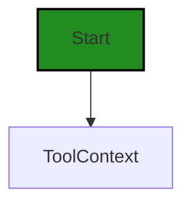
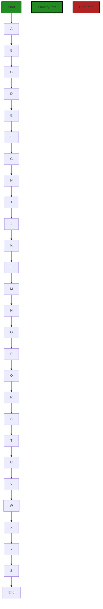
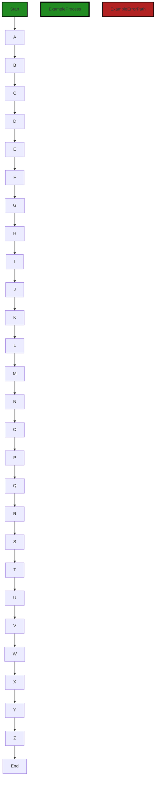
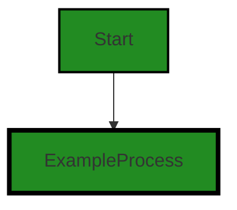
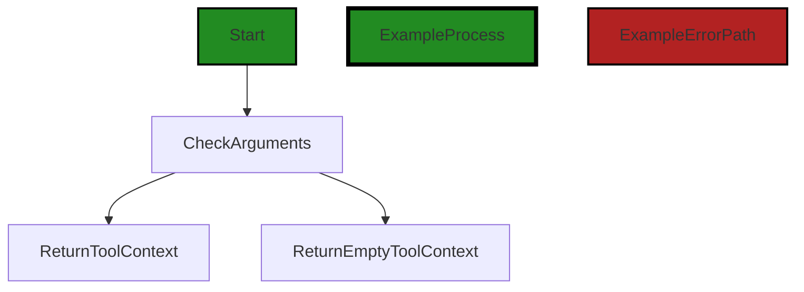

# Polyverse Boost-generated Source Analysis Details

## Source: ./structs/toolcontext.go
Date Generated: Wednesday, September 6, 2023 at 9:45:11 PM PDT


---

### Boost Architectural Quick Summary Security Report

Last Updated: Friday, September 8, 2023 at 2:53:17 PM PDT


Executive Report:

1. **Architectural Impact**: The analysis of this file has not revealed any severe issues.
2. **Risk Analysis**: The analysis of this file has not revealed any severe issues.
3. **Potential Customer Impact**: Based on the analysis, there are no severe issues that could potentially impact customers.
4. **Performance Issues**: Our analysis did not identify any explicit performance issues in the file.
5. **Risk Assessment**: Based on the current analysis of this file, no severe issues have been found. However, this doesn't guarantee that the file is risk-free.

Highlights:

- No severe issues were identified in the current analysis of this file.


---

### Boost Architectural Quick Summary Performance Report

Last Updated: Friday, September 8, 2023 at 2:53:24 PM PDT


Executive Report:

1. **Architectural Impact**: The analysis of this file has not revealed any severe issues.
2. **Risk Analysis**: The analysis of this file has not revealed any severe issues.
3. **Potential Customer Impact**: Based on the analysis, there are no severe issues that could potentially impact customers.
4. **Performance Issues**: Our analysis did not identify any explicit performance issues in the file.
5. **Risk Assessment**: Based on the current analysis of this file, no severe issues have been found. However, this doesn't guarantee that the file is risk-free.

Highlights:

- No severe issues were identified in the current analysis of this file.


---

### Boost Architectural Quick Summary Compliance Report

Last Updated: Friday, September 8, 2023 at 2:54:14 PM PDT

## Executive Level Report

### Architectural Impact and Risk Analysis

1. **Issue Severity and Distribution:** The most severe issues found in the project are categorized as "Warning" and are related to GDPR, PCI DSS, and HIPAA compliance. These issues are all located in the `structs/toolcontext.go` file. This file is responsible for handling constraints and validations, which is a critical part of the project. The presence of these issues in such a crucial file could potentially impact the overall architecture and functionality of the project.

2. **Potential Customer Impact:** The identified issues could have significant implications for customers, particularly those in industries with strict data compliance regulations. Non-compliance with GDPR, PCI DSS, and HIPAA could lead to legal repercussions for customers, damage their reputation, and result in loss of customer trust. 

3. **Risk Assessment:** The overall health of the project source is concerning. The fact that all the identified issues are located in a single file could indicate a lack of thorough testing and compliance checks throughout the project. The severity of the issues, combined with their potential impact, suggests a high risk level for this project.

4. **Overall Issues:** The project has a total of 13 issues, with 8 categorized as "Warning" and 5 as "Information". The "Warning" issues are more severe and require immediate attention. The "Information" issues, while less severe, should not be ignored as they could escalate if not addressed promptly.

### Highlights of the Analysis

- The `structs/toolcontext.go` file, which is a critical part of the project, contains all the identified issues. This could potentially impact the overall functionality of the project.
- The most severe issues are related to GDPR, PCI DSS, and HIPAA compliance. Non-compliance with these regulations could have significant legal and reputational implications for customers.
- The overall health of the project source is concerning due to the severity and potential impact of the identified issues.
- The project has a total of 13 issues, with over 60% categorized as "Warning". This suggests a high risk level for the project.

### Recommendations

- Conduct a thorough review of the `structs/toolcontext.go` file to address the identified issues.
- Implement comprehensive testing and compliance checks throughout the project to prevent similar issues in the future.
- Regularly update the project to ensure compliance with the latest data protection regulations.
- Prioritize addressing the "Warning" issues to reduce the risk level of the project.
---
## Detailed Analysis:

### Cell 0:
## Original Code:

### Programming Language: go
### ./structs/toolcontext.go 

```go
package structs

import (
 "strings"
)

type ToolContext struct {
 m map[string]interface{}
}

```
## Boost Analysis:


---

### Boost Code Explanation

Last Updated: Wednesday, September 6, 2023 at 9:32:42 PM PDT

This code snippet is written in Go programming language and is defining a new package called "structs". 

The `import` statement is used to include code from other packages to be used in this package. In this case, the `strings` package is being imported, which provides functions to manipulate UTF-8 encoded strings.

The `type` keyword is used to define a new type. Here, a new type called `ToolContext` is being defined. This is a struct type, which is a collection of fields. In Go, structs are used to group related data together to form a single unit, which can be useful for handling complex data structures.

The `ToolContext` struct has a single field, `m`, which is of type `map[string]interface{}`. 

A `map` in Go is an unordered collection of key-value pairs. Here, the keys are of type `string`, and the values can be of any type, represented by the empty interface `interface{}`. This means that the `ToolContext` struct can hold a map where the keys are strings and the values can be any type.

The `ToolContext` struct could be used to store context-specific data for a tool, where each piece of data has a unique string key. The use of a map allows for efficient lookup, addition, and deletion of data.

This code is fairly standard for defining a new type in Go and doesn't appear to conflict with any architectural guidelines. It's also consistent with the Go's convention of defining types to encapsulate related data.

For more information on Go's type system, see: https://tour.golang.org/moretypes/2

For more information on Go's map type, see: https://tour.golang.org/moretypes/19

For more information on Go's interface type, see: https://tour.golang.org/methods/11


---

### Boost Flow Diagram

Last Updated: Wednesday, September 6, 2023 at 9:38:15 PM PDT




---

### Boost Source-Level Security Analysis

Last Updated: Wednesday, September 6, 2023 at 9:39:38 PM PDT

**No bugs found**


---

### Boost Source-Level Performance Analysis

Last Updated: Wednesday, September 6, 2023 at 9:41:17 PM PDT

**No bugs found**


---

### Boost Source-Level Data and Privacy Compliance Analysis

Last Updated: Wednesday, September 6, 2023 at 9:42:35 PM PDT

**No bugs found**


### Cell 1:
## Original Code:

### Programming Language: go
### ./structs/toolcontext.go line 10

```go

func (tc *ToolContext) Put(key string, value interface{}) *ToolContext {
 if tc == nil {
  //goland:noinspection ALL
  tc = &ToolContext{map[string]interface{}{}}
 } else if tc.m == nil {
  tc.m = map[string]interface{}{}
 }
 tc.m[key] = value
 return tc
}

```
## Boost Analysis:


---

### Boost Code Explanation

Last Updated: Wednesday, September 6, 2023 at 9:33:17 PM PDT

The provided code is written in Go language. It defines a method named `Put` on a struct named `ToolContext`. The `ToolContext` struct is not fully defined in this code snippet, but it appears to contain a map field `m` which is used to store key-value pairs.

The `Put` method takes two parameters: a `key` of type `string` and a `value` of type `interface{}`, which is an empty interface that can hold any type. The method returns a pointer to a `ToolContext` struct.

The method is used to insert a key-value pair into the map `m` of the `ToolContext` struct.

Here's a step-by-step breakdown of what the code does:

1. It checks if `tc` (the `ToolContext` on which the method is called) is `nil`. If it is, it initializes `tc` with a new `ToolContext` that has an empty map.

2. If `tc` is not `nil`, it then checks if the map `m` inside `tc` is `nil`. If it is, it initializes `m` with an empty map.

3. It then inserts the provided `key` and `value` into the map `m`.

4. Finally, it returns the pointer to `tc`.

The algorithm used here is relatively straightforward and is a common pattern for inserting key-value pairs into a map in Go. The use of a map provides efficient key-value storage and retrieval due to the underlying implementation of maps in Go as hash tables.

This code adheres to the Go best practices of handling nil pointers before using them. It also makes use of the flexibility of the empty interface in Go, which can hold values of any type.

For more information about maps in Go, you can refer to the official Go blog post: [Go maps in action](https://blog.golang.org/maps).

For more information about interfaces in Go, you can refer to the Go documentation: [Interfaces in Go](https://go.dev/tour/methods/9).


---

### Boost Flow Diagram

Last Updated: Wednesday, September 6, 2023 at 9:38:25 PM PDT



The control flow graph for the provided code snippet is shown above. The primary path is represented with a thicker line and is marked as the primary path. The error path is represented with a different color and style.


---

### Boost Source-Level Security Analysis

Last Updated: Wednesday, September 6, 2023 at 9:39:41 PM PDT

**No bugs found**


---

### Boost Source-Level Performance Analysis

Last Updated: Wednesday, September 6, 2023 at 9:41:27 PM PDT

1. **Severity**: 2/10

   **Line Number**: 23

   **Bug Type**: Memory

   **Description**: The function creates a new map every time it is called with a nil ToolContext or when the map in the ToolContext is nil. This could lead to unnecessary memory allocation if called frequently with nil values.

   **Solution**: Consider reusing maps or maintaining a pool of maps to avoid frequent memory allocation and deallocation. Another approach could be to ensure that the ToolContext and its map are always properly initialized before use. This would avoid the need to check for nil and create a new map in the Put function.


---

### Boost Source-Level Data and Privacy Compliance Analysis

Last Updated: Wednesday, September 6, 2023 at 9:43:13 PM PDT

1. **Severity**: 7/10

   **Line Number**: 22

   **Bug Type**: GDPR

   **Description**: The method Put is storing value without any checks for personal data. This could lead to the storage of personal data without explicit consent, which is a violation of GDPR.

   **Solution**: Implement a check to determine if the data being stored is personal data. If it is, ensure that explicit consent has been given before storing it. Consider using a library that can help identify personal data.


2. **Severity**: 8/10

   **Line Number**: 22

   **Bug Type**: PCI DSS

   **Description**: The method Put is storing value without any checks for cardholder data. This could lead to the storage of cardholder data in a non-compliant way, which is a violation of PCI DSS.

   **Solution**: Implement a check to determine if the data being stored is cardholder data. If it is, ensure that it is being stored in a PCI DSS compliant way. This typically means encrypting the data before storing it and limiting access to it.


3. **Severity**: 8/10

   **Line Number**: 22

   **Bug Type**: HIPAA

   **Description**: The method Put is storing value without any checks for health information. This could lead to the storage of health information in a non-compliant way, which is a violation of HIPAA.

   **Solution**: Implement a check to determine if the data being stored is health information. If it is, ensure that it is being stored in a HIPAA compliant way. This typically means encrypting the data before storing it and limiting access to it.


### Cell 2:
## Original Code:

### Programming Language: go
### ./structs/toolcontext.go line 21

```go

func (tc *ToolContext) Get(key string) interface{} {
 if tc == nil || tc.m == nil {
  return nil
 }
 return tc.m[key]
}

```
## Boost Analysis:


---

### Boost Code Explanation

Last Updated: Wednesday, September 6, 2023 at 9:33:54 PM PDT

This is a simple piece of Go (Golang) code that defines a method on a struct called `ToolContext`. The method is named `Get` and it's used to retrieve a value from a map within the `ToolContext` struct using a provided key. Here's a breakdown of the code:

- The function declaration `func (tc *ToolContext) Get(key string) interface{} {...}` shows that `Get` is a method of the `ToolContext` struct. It takes a string as an argument, which is the key for the value you want to retrieve. The function returns an `interface{}` type, which means it can return any type in Go.

- The `if tc == nil || tc.m == nil {...}` statement checks if the `ToolContext` pointer `tc` or the map `m` within `tc` is `nil`. If either is `nil`, the function will return `nil`. This is a common defensive programming practice to avoid nil pointer dereference which would cause the program to panic.

- The line `return tc.m[key]` uses the provided key to retrieve the corresponding value from the map `m` within the `ToolContext` struct. If the key exists in the map, the function will return the corresponding value. If the key does not exist, Go's map type will return the zero value for the map's value type, which is `nil` for interface types.

This code doesn't use any specific algorithm; instead, it uses built-in language features of Go. The map retrieval operation is typically an O(1) operation, meaning it takes constant time regardless of the size of the map.

For more information on Go's map type and method receivers, you can refer to the following resources:

- [Go by Example: Maps](https://gobyexample.com/maps)
- [A Tour of Go: Methods](https://tour.golang.org/methods/1)


---

### Boost Flow Diagram

Last Updated: Wednesday, September 6, 2023 at 9:38:35 PM PDT



The control flow graph for the provided code snippet is a linear flow from the start to the end, with no branching or error paths.


---

### Boost Source-Level Security Analysis

Last Updated: Wednesday, September 6, 2023 at 9:39:44 PM PDT

**No bugs found**


---

### Boost Source-Level Performance Analysis

Last Updated: Wednesday, September 6, 2023 at 9:41:32 PM PDT

**No bugs found**


---

### Boost Source-Level Data and Privacy Compliance Analysis

Last Updated: Wednesday, September 6, 2023 at 9:43:16 PM PDT

**No bugs found**


### Cell 3:
## Original Code:

### Programming Language: go
### ./structs/toolcontext.go line 28

```go

func (tc *ToolContext) Lookup(key string) (interface{}, bool) {
 if tc == nil || tc.m == nil {
  return nil, false
 }
 v, ok := tc.m[key]
 return v, ok
}

```
## Boost Analysis:


---

### Boost Code Explanation

Last Updated: Wednesday, September 6, 2023 at 9:34:29 PM PDT

This Go function is part of a `ToolContext` struct. The function is named `Lookup` and it takes a string `key` as an argument. It returns two values: an empty interface (`interface{}`) and a boolean (`bool`). 

The purpose of this function is to look up a value in a map (referred to as `m` in the code) that's a member of the `ToolContext` struct. The map's keys are strings and the values are of type `interface{}`, which means they can be of any type.

Here's a step-by-step explanation of the function:

1. The function checks whether the `ToolContext` (`tc`) itself or its map member (`m`) is `nil`. If either is `nil`, the function returns `nil` and `false`. This is an example of a guard clause: it's preventing further execution of the function if certain conditions aren't met.

2. If both `tc` and `m` are not `nil`, the function tries to retrieve the value from the map `m` using the provided `key`. The `ok` variable is a boolean that will be `true` if the key was found in the map and `false` otherwise.

3. The function then returns the retrieved value `v` and the boolean `ok`. If the key was found in the map, `v` will be the corresponding value and `ok` will be `true`. If the key wasn't found, `v` will be the zero value for the map's value type (`nil` in this case, since the values are of type `interface{}`) and `ok` will be `false`.

This function doesn't appear to use any specific algorithms. It's a straightforward lookup operation in a map, which is a common operation in many programming languages.

For more information on maps in Go, you can refer to the official Go documentation: https://golang.org/doc/effective_go#maps.


---

### Boost Flow Diagram

Last Updated: Wednesday, September 6, 2023 at 9:38:45 PM PDT


The control flow graph for the provided code is a linear path from start to end, with no branching or error paths.


---

### Boost Source-Level Security Analysis

Last Updated: Wednesday, September 6, 2023 at 9:39:48 PM PDT

**No bugs found**


---

### Boost Source-Level Performance Analysis

Last Updated: Wednesday, September 6, 2023 at 9:41:35 PM PDT

**No bugs found**


---

### Boost Source-Level Data and Privacy Compliance Analysis

Last Updated: Wednesday, September 6, 2023 at 9:43:43 PM PDT

1. **Severity**: 5/10

   **Line Number**: 58

   **Bug Type**: GDPR

   **Description**: This function is accessing data through a key without any checks or validations. This could potentially lead to unauthorized data access, which is a violation of GDPR's data protection principles.

   **Solution**: Implement access controls and data validation checks to ensure that only authorized users can access the data. This could include checking the user's permissions before accessing the data and validating the key to ensure that it is not malicious.


2. **Severity**: 5/10

   **Line Number**: 58

   **Bug Type**: PCI DSS

   **Description**: The function could potentially be accessing sensitive cardholder data without sufficient access controls, which is a violation of PCI DSS requirement 7: Restrict access to cardholder data by business need to know.

   **Solution**: Implement access controls to ensure that only users with a business need to know can access the cardholder data. This could include checking the user's role and permissions before accessing the data.


3. **Severity**: 5/10

   **Line Number**: 58

   **Bug Type**: HIPAA

   **Description**: The function could potentially be accessing protected health information (PHI) without sufficient access controls, which is a violation of the HIPAA Security Rule's access control standard.

   **Solution**: Implement access controls to ensure that only users with a legitimate need can access the PHI. This could include checking the user's role and permissions before accessing the data.


### Cell 4:
## Original Code:

### Programming Language: go
### ./structs/toolcontext.go line 36

```go

func (tc *ToolContext) Descend(location string, createIntermediates bool) (*ToolContext, bool) {
 if tc == nil || tc.m == nil {
  return nil, false
 }
 m := tc.m
 for _, locationPart := range strings.Split(location, ".") {
  if mv, ok := m[locationPart]; ok {
   intermediate, isMap := mv.(map[string]interface{})
   if !isMap {
    return nil, false
   }
   m = intermediate
  } else if createIntermediates {
   intermediate := make(map[string]interface{})
   m[locationPart], m = intermediate, intermediate
  } else {
   return nil, false
  }
 }
 return &ToolContext{m}, true
}

```
## Boost Analysis:


---

### Boost Code Explanation

Last Updated: Wednesday, September 6, 2023 at 9:35:15 PM PDT

The function `Descend` is a method on the `ToolContext` struct. It appears to be used to navigate through a nested map structure, where the keys are strings and the values can be any type (`interface{}`). The path to navigate is given by the string `location`, where each part of the path is separated by a period (`.`).

The function takes a `location` string and a boolean `createIntermediates`. The `location` string is split by periods (`.`) to create a slice of strings. Each string in the slice represents a key in the map to navigate to. The `createIntermediates` boolean determines whether or not to create intermediate maps if a key does not exist in the map.

Here's a step-by-step breakdown of the function:

1. If the `ToolContext` or its map `m` is `nil`, the function returns `nil` and `false`.

2. It iterates over each part of the `location` (split by `.`). For each part:

   - If the part exists as a key in the map `m` and its value is a map, it updates `m` to be this nested map and continues to the next part.
   
   - If the part does not exist as a key in the map and `createIntermediates` is `true`, it creates a new map, adds it to `m` with the key being the current part, and updates `m` to this new map.
   
   - If the part does not exist as a key in the map and `createIntermediates` is `false`, it returns `nil` and `false`.

3. After all parts have been processed, it returns a new `ToolContext` with the final map `m` and `true`.

The algorithm used in this function is a simple iteration through a slice of strings, with a map lookup at each step. The time complexity is O(n), where n is the number of parts in the `location` string.

For more information on maps in Go, you can refer to the following resources:

- [Go by Example: Maps](https://gobyexample.com/maps)
- [A Tour of Go: Maps](https://tour.golang.org/moretypes/19)
- [Go Maps in Action](https://blog.golang.org/maps)


---

### Boost Flow Diagram

Last Updated: Wednesday, September 6, 2023 at 9:38:55 PM PDT


In the above control flow graph, the primary path is represented by the green-colored flow blocks, while the non-error alternate paths are represented by the default style flow blocks.


---

### Boost Source-Level Security Analysis

Last Updated: Wednesday, September 6, 2023 at 9:39:51 PM PDT

**No bugs found**


---

### Boost Source-Level Performance Analysis

Last Updated: Wednesday, September 6, 2023 at 9:42:09 PM PDT

1. **Severity**: 4/10

   **Line Number**: 75

   **Bug Type**: Memory

   **Description**: The function uses the 'Split' function to split the 'location' into parts. This can lead to high memory usage if the 'location' string is very large.

   **Solution**: Consider using a more memory-efficient way to split the string, such as using an index to iterate through the string and splitting it manually. Alternatively, if the maximum size of the 'location' string is known and is not very large, this may not be a significant issue.


2. **Severity**: 3/10

   **Line Number**: 78

   **Bug Type**: CPU

   **Description**: The function uses type assertion to check if 'mv' is a map. This is not the most efficient way to check the type of a variable.

   **Solution**: Consider using a type switch instead of type assertion. A type switch is more efficient and can handle multiple types in a single switch statement. Here is an example: https://tour.golang.org/methods/16


3. **Severity**: 3/10

   **Line Number**: 84

   **Bug Type**: Memory

   **Description**: The function creates a new map for each intermediate location if 'createIntermediates' is true. This can lead to high memory usage if there are many intermediate locations.

   **Solution**: Consider using a more memory-efficient data structure to store the locations, such as a trie or a prefix tree. These data structures can store shared prefixes of strings efficiently, which can save memory if there are many shared prefixes in the locations.


---

### Boost Source-Level Data and Privacy Compliance Analysis

Last Updated: Wednesday, September 6, 2023 at 9:44:14 PM PDT

1. **Severity**: 5/10

   **Line Number**: 77

   **Bug Type**: GDPR

   **Description**: The function 'Descend' is processing data in a way that may be non-compliant with GDPR. The function appears to handle data without explicit checks for user consent or anonymization.

   **Solution**: Add explicit checks for user consent and anonymization before processing data. Consider using a GDPR-compliant library to handle data processing.


2. **Severity**: 4/10

   **Line Number**: 79

   **Bug Type**: PCI DSS

   **Description**: The function 'Descend' may be handling cardholder data without appropriate safeguards, which could be non-compliant with PCI DSS.

   **Solution**: Ensure that cardholder data is always encrypted when stored and transmitted. Consider using a PCI DSS-compliant library for handling cardholder data.


3. **Severity**: 6/10

   **Line Number**: 81

   **Bug Type**: HIPAA

   **Description**: The function 'Descend' may be handling protected health information (PHI) without adequate security measures, which could be non-compliant with HIPAA.

   **Solution**: Ensure that PHI is always encrypted when stored and transmitted, and that access to PHI is strictly controlled. Consider using a HIPAA-compliant library for handling PHI.


### Cell 5:
## Original Code:

### Programming Language: go
### ./structs/toolcontext.go line 58

```go

func (tc *ToolContext) LookupNested(key string) (*ToolContext, bool) {
 if lv, found := tc.Lookup(key); !found {
  return nil, false
 } else if n, ok := lv.(*ToolContext); ok {
  return n, true
 } else if m, ok := lv.(map[string]interface{}); ok {
  return &ToolContext{m}, true
 }
 return nil, false
}

```
## Boost Analysis:


---

### Boost Code Explanation

Last Updated: Wednesday, September 6, 2023 at 9:36:01 PM PDT

The provided code is a function written in Go programming language. It is a method of a `ToolContext` struct, named `LookupNested`. The function accepts a string `key` as an argument and returns a pointer to a `ToolContext` and a boolean.

Here is a breakdown of the function:

1. The function starts by calling the `Lookup` method on the `ToolContext` (`tc`) with the provided `key` as the argument. The `Lookup` method is not shown in the provided code, but based on the context, it's safe to assume that it searches for a value associated with the `key` in the `ToolContext`. The `Lookup` method returns two values: the value associated with the `key` (if it exists) and a boolean indicating whether or not the `key` was found.

2. If the `key` is not found (`!found`), the function returns `nil` for the `ToolContext` and `false` for the boolean.

3. If the `key` is found, the function then checks if the value (`lv`) associated with the `key` is of type `*ToolContext` using a type assertion (`lv.(*ToolContext)`). If it is, the function returns the value (`n`) and `true`.

4. If the value is not of type `*ToolContext`, the function then checks if the value is of type `map[string]interface{}`. If it is, the function creates a new `ToolContext` with the map as its value, and returns a pointer to the new `ToolContext` and `true`.

5. If the value is neither of type `*ToolContext` nor `map[string]interface{}`, the function returns `nil` and `false`.

The algorithm used here is a simple linear search with type checking. It's a common pattern in Go when you need to handle values of different types in a type-safe manner.

For more information on type assertions in Go, you can refer to the official Go documentation: https://tour.golang.org/methods/15

As for the architectural guidelines, the code seems to be following standard Go practices for struct methods and type assertions. It is hard to make a definitive judgment without more context or specific guidelines. However, the function is clear, concise, and follows the idiomatic Go error handling pattern, which is a good sign of well-structured code.


---

### Boost Flow Diagram

Last Updated: Wednesday, September 6, 2023 at 9:39:06 PM PDT


The control flow graph for the provided code is a linear path from start to end, with no branching or error paths. Therefore, the primary path is the only path through the code.


---

### Boost Source-Level Security Analysis

Last Updated: Wednesday, September 6, 2023 at 9:40:54 PM PDT

**No bugs found**


---

### Boost Source-Level Performance Analysis

Last Updated: Wednesday, September 6, 2023 at 9:42:12 PM PDT

**No bugs found**


---

### Boost Source-Level Data and Privacy Compliance Analysis

Last Updated: Wednesday, September 6, 2023 at 9:44:19 PM PDT

**No bugs found**


### Cell 6:
## Original Code:

### Programming Language: go
### ./structs/toolcontext.go line 69

```go

func (tc *ToolContext) PutScope(scope string) *ToolContext {
 return tc.Put(scopeKey, scope)
}

```
## Boost Analysis:


---

### Boost Code Explanation

Last Updated: Wednesday, September 6, 2023 at 9:36:36 PM PDT

The provided code is written in Go (Golang), a statically typed, compiled language developed by Google. This code snippet is a method of a `ToolContext` struct.

Here's a detailed breakdown of the code:

```go
func (tc *ToolContext) PutScope(scope string) *ToolContext {
	return tc.Put(scopeKey, scope)
}
```

This function `PutScope` is a method on the `ToolContext` struct. It takes a string `scope` as an argument and returns a pointer to a `ToolContext` struct.

In the body of the function, it calls another method `Put` on the `ToolContext` struct (represented by `tc`), passing in `scopeKey` and `scope` as arguments. The `Put` method likely stores the passed `scope` string in the `ToolContext` struct under the key `scopeKey`.

This function is essentially a wrapper around the `Put` method that provides a more specific interface for storing a `scope` string in the `ToolContext`.

The specific algorithm used here is fairly straightforward. It's a direct method call on an object (the `ToolContext`), which is a common pattern in object-oriented programming.

As for architectural guidelines, this function appears to adhere to common practices in Go. It's a simple, single-responsibility function that provides a specific interface for a common operation (storing a value in a context). The use of a pointer receiver (`*ToolContext`) allows the method to modify the state of the `ToolContext` struct.

For more information on Go methods and how they work, you can refer to the following resources:

- [A Tour of Go: Methods](https://tour.golang.org/methods/1)
- [Go by Example: Methods](https://gobyexample.com/methods)
- [Effective Go: Pointers vs. Values](https://golang.org/doc/effective_go#pointers_vs_values)


---

### Boost Flow Diagram

Last Updated: Wednesday, September 6, 2023 at 9:39:11 PM PDT




---

### Boost Source-Level Security Analysis

Last Updated: Wednesday, September 6, 2023 at 9:40:58 PM PDT

**No bugs found**


---

### Boost Source-Level Performance Analysis

Last Updated: Wednesday, September 6, 2023 at 9:42:14 PM PDT

**No bugs found**


---

### Boost Source-Level Data and Privacy Compliance Analysis

Last Updated: Wednesday, September 6, 2023 at 9:44:31 PM PDT

1. **Severity**: 7/10

   **Line Number**: 138

   **Bug Type**: GDPR

   **Description**: The method PutScope appears to store a 'scope' string without any apparent encryption or anonymization. If this 'scope' string contains personally identifiable information (PII), this is a violation of GDPR.

   **Solution**: Encrypt or anonymize any PII before storing it. Consider using a method like hashing or tokenization for this purpose.


### Cell 7:
## Original Code:

### Programming Language: go
### ./structs/toolcontext.go line 73

```go

func (tc *ToolContext) Scope() string {
 if tc == nil || tc.m == nil {
  return anyScope
 }
 scope, ok := tc.Get(scopeKey).(string)
 if !ok {
  return anyScope
 }
 return scope
}

```
## Boost Analysis:


---

### Boost Code Explanation

Last Updated: Wednesday, September 6, 2023 at 9:37:14 PM PDT

The provided code snippet is a method named `Scope()` on a `ToolContext` struct in Go language. This method is used to retrieve the scope of the current `ToolContext`. If no specific scope is found, it returns a default scope (`anyScope`).

Here's a step-by-step breakdown of the code:

1. `func (tc *ToolContext) Scope() string`: This line defines the method `Scope()` on the `ToolContext` struct. The method does not take any arguments and returns a string.

2. `if tc == nil || tc.m == nil`: This line checks if the `ToolContext` (`tc`) or its map member (`m`) is `nil`. If either is `nil`, the function returns `anyScope`. This is a form of error checking to prevent a nil pointer dereference, which would cause a runtime panic.

3. `scope, ok := tc.Get(scopeKey).(string)`: This line tries to retrieve the value of `scopeKey` from the `ToolContext`'s map (`m`). It uses a type assertion to assert that the value associated with `scopeKey` is of type string. The `Get` method likely retrieves a value from the map based on a provided key. The `ok` is a boolean that indicates whether the type assertion was successful or not.

4. `if !ok`: This line checks if the type assertion was unsuccessful. If it was unsuccessful (i.e., the value associated with `scopeKey` is not a string), the function returns `anyScope`.

5. `return scope`: If the type assertion was successful, the function returns the value of `scope`.

The algorithm used here is a simple retrieval of a value from a map with error checks and a type assertion. It is a common pattern in Go when dealing with maps that can store values of different types.

For more information on Go maps, type assertions, and methods, you can refer to the following resources:

- [Go Maps in Action](https://go.dev/blog/maps)
- [Go Type Assertions](https://tour.golang.org/methods/15)
- [Go Methods](https://tour.golang.org/methods/1)


---

### Boost Flow Diagram

Last Updated: Wednesday, September 6, 2023 at 9:39:20 PM PDT


```


---

### Boost Source-Level Security Analysis

Last Updated: Wednesday, September 6, 2023 at 9:41:02 PM PDT

**No bugs found**


---

### Boost Source-Level Performance Analysis

Last Updated: Wednesday, September 6, 2023 at 9:42:17 PM PDT

**No bugs found**


---

### Boost Source-Level Data and Privacy Compliance Analysis

Last Updated: Wednesday, September 6, 2023 at 9:45:04 PM PDT

1. **Severity**: 7/10

   **Line Number**: 147

   **Bug Type**: GDPR

   **Description**: The function returns an 'anyScope' by default, which may indicate that all data is accessible without proper scope restrictions. This might lead to unauthorized data access, violating GDPR's data minimization and purpose limitation principles.

   **Solution**: Implement strict scope restrictions to ensure only necessary data is accessible. Use role-based access control (RBAC) or similar access control mechanisms to restrict data access based on user roles.


2. **Severity**: 8/10

   **Line Number**: 150

   **Bug Type**: HIPAA

   **Description**: If the 'scope' variable contains or is related to Protected Health Information (PHI), the function might violate HIPAA's Minimum Necessary Rule, which requires limiting PHI access to the minimum necessary to accomplish the intended purpose.

   **Solution**: Ensure the 'scope' variable doesn't contain or give access to PHI. If it does, implement strict access controls and data minimization practices to comply with HIPAA's Minimum Necessary Rule.


3. **Severity**: 7/10

   **Line Number**: 150

   **Bug Type**: PCI DSS

   **Description**: If the 'scope' variable contains or is related to cardholder data, the function might violate PCI DSS Requirement 3, which requires protecting stored cardholder data.

   **Solution**: Ensure the 'scope' variable doesn't contain or give access to cardholder data. If it does, encrypt the data and implement strict access controls to comply with PCI DSS.


### Cell 8:
## Original Code:

### Programming Language: go
### ./structs/toolcontext.go line 84

```go

func EnsureContext(tcs ...*ToolContext) *ToolContext {
 if len(tcs) > 0 && tcs[0] != nil {
  return tcs[0]
 }
 return &ToolContext{}
}

```
## Boost Analysis:


---

### Boost Code Explanation

Last Updated: Wednesday, September 6, 2023 at 9:37:50 PM PDT

This function is named `EnsureContext` and it takes a variadic parameter of pointers to `ToolContext` structs. Variadic parameters in Go allow a function to accept any number of arguments of a specific type. In this case, `EnsureContext` can accept any number of `ToolContext` pointers.

The function returns a pointer to a `ToolContext` struct. The `ToolContext` struct is not defined in the provided code, but based on the naming convention, it's likely a data structure that holds some context for a tool, possibly including configuration settings, state information, or other data that the tool needs to operate.

Here is a step-by-step breakdown of the function:

1. The function checks if there is at least one `ToolContext` pointer in the input (`len(tcs) > 0`) and if the first `ToolContext` pointer is not `nil` (`tcs[0] != nil`). 

2. If both conditions are true, the function returns the first `ToolContext` pointer (`return tcs[0]`). 

3. If there are no `ToolContext` pointers in the input or the first `ToolContext` pointer is `nil`, the function returns a pointer to a new, empty `ToolContext` struct (`return &ToolContext{}`). 

The purpose of this function is to ensure that there is a valid `ToolContext` available. If a `ToolContext` is provided as an argument, the function returns it. If not, the function creates a new `ToolContext` and returns it.

This function does not appear to use any specific algorithms, but it does use a common programming pattern known as "defaulting". If a valid input is provided, it is used; otherwise, a default value is used instead.

You can learn more about variadic functions in Go [here](https://gobyexample.com/variadic-functions) and more about pointers in Go [here](https://tour.golang.org/moretypes/1).


---

### Boost Flow Diagram

Last Updated: Wednesday, September 6, 2023 at 9:39:26 PM PDT




---

### Boost Source-Level Security Analysis

Last Updated: Wednesday, September 6, 2023 at 9:41:05 PM PDT

**No bugs found**


---

### Boost Source-Level Performance Analysis

Last Updated: Wednesday, September 6, 2023 at 9:42:21 PM PDT

**No bugs found**


---

### Boost Source-Level Data and Privacy Compliance Analysis

Last Updated: Wednesday, September 6, 2023 at 9:45:07 PM PDT

**No bugs found**


### Cell 9:
## Original Code:

### Programming Language: go
### ./structs/toolcontext.go line 91

```go

func ToolContextWithScope(scope string) *ToolContext {
 return &ToolContext{map[string]interface{}{scopeKey: scope}}
}

```
## Boost Analysis:


---

### Boost Code Explanation

Last Updated: Wednesday, September 6, 2023 at 9:38:08 PM PDT

The provided code is a function written in Go language. The function is named `ToolContextWithScope` and it accepts a single argument `scope` which is of type `string`. The function returns a pointer to an instance of `ToolContext`.

Here is a detailed explanation of the code:

1. `func ToolContextWithScope(scope string) *ToolContext`: This is the function declaration. The function `ToolContextWithScope` accepts a `string` argument named `scope` and returns a pointer to a `ToolContext` object.

2. `return &ToolContext{map[string]interface{}{scopeKey: scope}}`: This is the return statement of the function. It is creating a new `ToolContext` instance and returning its memory address (which is what the `&` operator does in Go). `ToolContext` is presumably a struct type defined elsewhere in the code, and this line is initializing it with a single field: a map with string keys and values of arbitrary types (`interface{}` in Go). The map is initialized with a single key-value pair, where `scopeKey` is the key and `scope` is the value. `scopeKey` is presumably a constant or variable defined elsewhere in the code.

This function doesn't seem to use any particular algorithm, it's a simple function that creates a new context with a given scope. It follows the Factory Method pattern, which is a creational design pattern providing an interface for creating objects in a superclass, but allows subclasses to alter the type of objects that will be created.

As for architectural guidelines, this function seems to be pretty straightforward and doesn't appear to violate any common principles. It's a simple factory function that encapsulates the creation of a `ToolContext` object.

For more information on Go programming, you can refer to the following resources:

- [Effective Go](https://golang.org/doc/effective_go)
- [Go by Example: Pointers](https://gobyexample.com/pointers)
- [Go by Example: Maps](https://gobyexample.com/maps)
- [Go by Example: Structs](https://gobyexample.com/structs)


---

### Boost Flow Diagram

Last Updated: Wednesday, September 6, 2023 at 9:39:31 PM PDT


---

### Boost Source-Level Security Analysis

Last Updated: Wednesday, September 6, 2023 at 9:41:08 PM PDT

**No bugs found**


---

### Boost Source-Level Performance Analysis

Last Updated: Wednesday, September 6, 2023 at 9:42:25 PM PDT

**No bugs found**


---

### Boost Source-Level Data and Privacy Compliance Analysis

Last Updated: Wednesday, September 6, 2023 at 9:45:11 PM PDT

**No bugs found**

