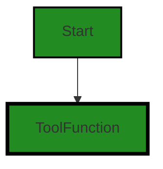
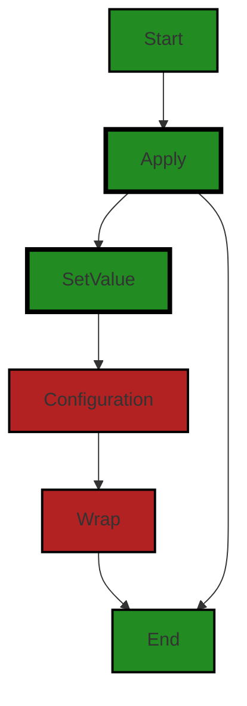
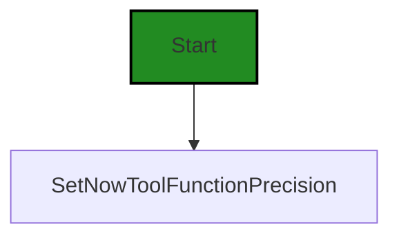
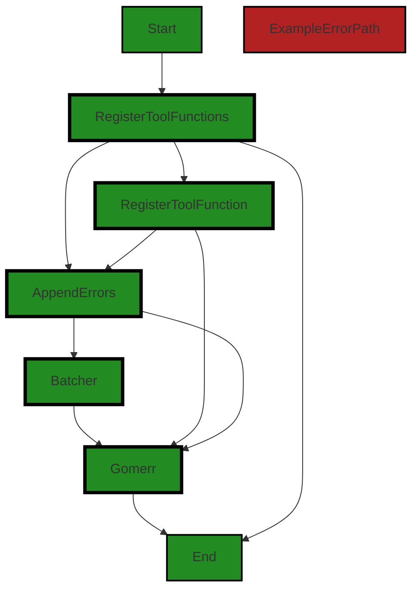
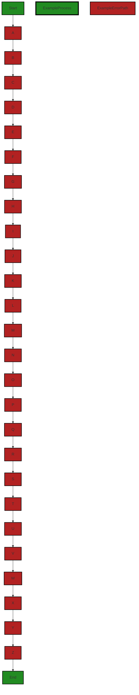
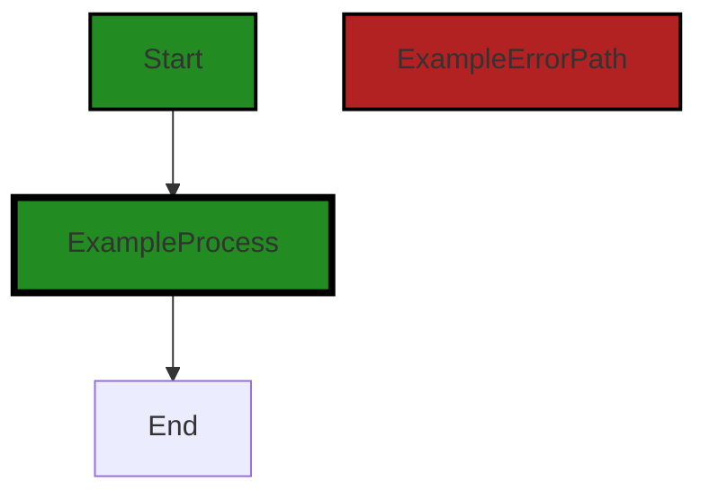
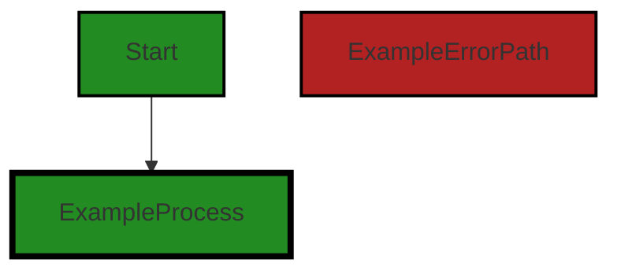
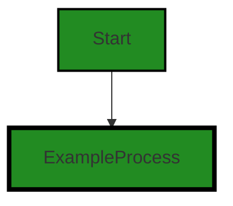

# Polyverse Boost-generated Source Analysis Details

## Source: ./structs/toolfunction.go
Date Generated: Thursday, September 7, 2023 at 1:25:53 PM PDT


---

### Boost Architectural Quick Summary Security Report

Last Updated: Friday, September 8, 2023 at 2:49:09 PM PDT

Executive Level Report:

1. **Architectural Impact**: The project is a Go library focused on constraint handling and validation. It follows Go's idiomatic style and structure for a library, providing a clear separation of concerns. However, the presence of security issues such as Insecure Direct Object References (IDOR) and Improper Input Validation in the `structs/toolfunction.go` file could potentially impact the overall architecture if not addressed promptly. 

2. **Risk Analysis**: The most severe issues found in the project are related to security. The `structs/toolfunction.go` file has 3 instances of IDOR and 1 instance of Improper Input Validation. These issues pose a significant risk as they could potentially allow unauthorized access to data or functions within the application. The risk is further amplified if the application is used in a context where sensitive data is handled.

3. **Potential Customer Impact**: If these security issues are not addressed, they could lead to unauthorized access to sensitive data or functions, which could have serious implications for customers, including potential data breaches. This could also impact the trust and reputation of the product among customers.

4. **Overall Issues**: The project has a total of 1 file, `structs/toolfunction.go`, which has been identified with issues. This represents 100% of the project files having issues. The issues are of high severity, indicating a need for immediate attention and resolution.

5. **Risk Assessment**: Given that all the project files have been identified with high-severity issues, the overall health of the project source is at risk. Immediate action is required to address these issues and ensure the security and reliability of the project.

Highlights:

- The project follows Go's idiomatic style and structure for a library, providing a clear separation of concerns.
- The `structs/toolfunction.go` file has been identified with high-severity security issues, including 3 instances of IDOR and 1 instance of Improper Input Validation.
- These security issues pose a significant risk as they could potentially allow unauthorized access to data or functions within the application.
- The potential customer impact of these issues is high, as they could lead to data breaches and loss of trust in the product.
- Given that 100% of the project files have been identified with issues, the overall health of the project source is at risk.


---

### Boost Architectural Quick Summary Performance Report

Last Updated: Friday, September 8, 2023 at 2:49:44 PM PDT

## Executive Report: Software Project Analysis

Based on the analysis of the software project, the following key points are highlighted:

1. **Single File Analysis:** The project consists of a single file, `structs/toolfunction.go`. This file is the core of the project and any issues within this file can have a significant impact on the overall project. 

2. **Severity of Issues:** The analysis identified a total of 10 issues in the project file. Of these, 6 are related to CPU usage and 4 are related to memory usage. The most severe issue is a warning related to inefficient memory usage due to the use of append() in a loop for error collection.

3. **Potential Customer Impact:** The inefficient memory usage can lead to performance degradation, especially in systems with limited resources. This could potentially impact the customer experience, particularly in high-load scenarios.

4. **Risk Assessment:** Given that the entire project is contained within a single file and that file has several issues, the overall health of the project source is a concern. The fact that 100% of the project files have issues, with a warning being the most severe, indicates a high risk.

5. **Architectural Impact:** The project follows Go's idiomatic style and structure for a library, providing a clear separation of concerns. However, the identified issues, particularly the inefficient memory usage, could impact the architectural soundness of the project.

In conclusion, while the project adheres to Go's idiomatic style and structure, the identified issues pose a risk to the overall health of the project. The inefficient memory usage, in particular, could lead to performance degradation and impact the customer experience. It is recommended to address these issues to improve the project's overall health and performance.


---

### Boost Architectural Quick Summary Compliance Report

Last Updated: Friday, September 8, 2023 at 2:50:25 PM PDT

**Executive Report on Software Project Analysis**

Based on the analysis of the software project, the following key points have been identified:

1. **Architectural Impact**: The project is a library written in Go that focuses on constraint handling and validation. It follows Go's idiomatic style and structure for a library, providing a clear separation of concerns. However, the file `structs/toolfunction.go` has been flagged for potential GDPR, PCI DSS, and HIPAA compliance issues. These issues could impact the architectural integrity of the project if not addressed, as they could necessitate changes in the data handling and processing mechanisms.

2. **Risk Analysis**: The identified issues pose a significant risk to the project. The GDPR, PCI DSS, and HIPAA compliance issues could lead to legal and financial repercussions if not addressed. The file `structs/toolfunction.go` has the highest severity issues, with 2 warnings for GDPR and PCI DSS, and 3 warnings for HIPAA. This file appears to be a critical part of the project, and these issues could pose a significant risk to the overall health of the project.

3. **Potential Customer Impact**: The identified issues could have a significant impact on customers, particularly those in the European Union (for GDPR), those handling credit card information (for PCI DSS), and those in the healthcare sector (for HIPAA). If these issues are not addressed, customers may be unable to use the library due to non-compliance with these regulations.

4. **Overall Issues**: The project has a total of 1 file, `structs/toolfunction.go`, which has been flagged with issues. This represents 100% of the project files. The severity of the issues is high, with warnings for GDPR, PCI DSS, and HIPAA compliance. This indicates that the overall health of the project source is at risk.

In conclusion, while the project follows good architectural practices in terms of structure and separation of concerns, the identified compliance issues pose a significant risk to the project. It is recommended that these issues be addressed as soon as possible to ensure the project's compliance with GDPR, PCI DSS, and HIPAA regulations.
---
## Detailed Analysis:

### Cell 0:
## Original Code:

### Programming Language: go
### ./structs/toolfunction.go 

```go
package structs

import (
 "reflect"
 "strings"
 "time"

 "github.com/jt0/gomer/flect"
 "github.com/jt0/gomer/gomerr"
)

type ToolFunction func(structValue reflect.Value, fieldValue reflect.Value, toolContext *ToolContext) (output interface{}, ge gomerr.Gomerr)

```
## Boost Analysis:


---

### Boost Code Explanation

Last Updated: Thursday, September 7, 2023 at 1:10:25 PM PDT

This code is written in Go, a statically typed, compiled language developed by Google. It's a part of a package named "structs". 

The code is importing three packages: 
- "reflect" from the Go standard library, which provides a way to inspect the type of variables at runtime.
- "strings" from the Go standard library, which provides functions to manipulate UTF-8 encoded strings.
- "time" from the Go standard library, which provides functionality for measuring and displaying time.
- "github.com/jt0/gomer/flect" and "github.com/jt0/gomer/gomerr" are external packages. The "flect" package is likely used for inflection (changing the form of words), while the "gomerr" package is likely used for handling errors in a specific way.

The code then defines a type alias for a function, `ToolFunction`. This function takes three parameters: `structValue` and `fieldValue` of type `reflect.Value`, and `toolContext` of type pointer to `ToolContext`. The function returns two values: `output` of type `interface{}` and `ge` of type `gomerr.Gomerr`.

The `reflect.Value` type is a part of the `reflect` package and represents a value that can be inspected at runtime. `ToolContext` is not defined in this code snippet, but it's likely a struct or interface that carries context for the tool functions.

The `interface{}` type is an empty interface, meaning that `output` can be any type. The `gomerr.Gomerr` type is likely a custom error type defined in the "gomerr" package.

In terms of algorithms, this code doesn't implement any specific algorithm. It's more about defining types and importing necessary packages for further use.

This code follows Go's guidelines for package organization, error handling, and use of the `reflect` package. 

For more information on Go's `reflect` package, you can refer to this link: https://golang.org/pkg/reflect/

For more background on error handling in Go, you can refer to this link: https://blog.golang.org/error-handling-and-go

For more information on Go's type system and the use of interfaces, you can refer to this link: https://tour.golang.org/methods/11


---

### Boost Flow Diagram

Last Updated: Thursday, September 7, 2023 at 1:15:07 PM PDT




---

### Boost Source-Level Security Analysis

Last Updated: Thursday, September 7, 2023 at 1:16:12 PM PDT

**No bugs found**


---

### Boost Source-Level Performance Analysis

Last Updated: Thursday, September 7, 2023 at 1:19:26 PM PDT

1. **Severity**: 2/10

   **Line Number**: 13

   **Bug Type**: CPU

   **Description**: The function 'ToolFunction' uses reflection which can be CPU-intensive, especially if used frequently within loops.

   **Solution**: Consider alternative design patterns that avoid reflection. If reflection is necessary, consider caching the results of reflection if the same types are being reflected upon multiple times.


---

### Boost Source-Level Data and Privacy Compliance Analysis

Last Updated: Thursday, September 7, 2023 at 1:22:31 PM PDT

**No bugs found**


### Cell 1:
## Original Code:

### Programming Language: go
### ./structs/toolfunction.go line 13

```go

func (f ToolFunction) Apply(sv reflect.Value, fv reflect.Value, tc *ToolContext) gomerr.Gomerr {
 value, ge := f(sv, fv, tc)
 if ge != nil {
  return ge
 }

 if ge = flect.SetValue(fv, value); ge != nil {
  return gomerr.Configuration("Unable to set field to function result").AddAttribute("FunctionResult", value).Wrap(ge)
 }

 return nil
}

```
## Boost Analysis:


---

### Boost Code Explanation

Last Updated: Thursday, September 7, 2023 at 1:11:05 PM PDT

This is a Go function named `Apply` that belongs to the `ToolFunction` type. The function takes three parameters: `sv` and `fv` of type `reflect.Value` and `tc` of type pointer to `ToolContext`.

The `reflect.Value` type in Go is a part of the `reflect` package, which allows Go programs to inspect and manipulate their own structure at runtime. This is particularly useful when you don't know the type of the variable at compile time and it is determined dynamically.

The `Apply` function seems to be used to apply a tool function (`f`) to a given struct value (`sv`) and field value (`fv`), within a given tool context (`tc`). 

Here is a step-by-step analysis of the function:

1. The function first calls the tool function `f` with the struct value, field value, and tool context as arguments. The tool function is expected to return a value and a `gomerr.Gomerr` (an error type specific to the Go programming language).

2. If the tool function returns an error (`ge`), the `Apply` function immediately returns this error.

3. If there is no error, it attempts to set the value of the field (`fv`) to the value returned by the tool function, using the `flect.SetValue` function. If this operation fails and returns an error, it wraps this error with additional information (a `gomerr.Configuration` error stating "Unable to set field to function result") and returns it.

4. If there is no error in setting the value, the function returns `nil`, indicating success.

This function doesn't seem to use any specific algorithm, but it follows a common pattern in Go for error handling: checking for an error right after an operation, and immediately returning the error if it exists.

For more information about the `reflect` package in Go, you can refer to the official Go documentation: https://golang.org/pkg/reflect/

For more information about error handling in Go, you can refer to this blog post: https://blog.golang.org/error-handling-and-go

Regarding the architectural guidelines, this function seems to follow common Go practices for error handling and use of reflection. However, the use of reflection can make code harder to understand and maintain, and can have performance implications, so it should be used sparingly.


---

### Boost Flow Diagram

Last Updated: Thursday, September 7, 2023 at 1:15:15 PM PDT



The control flow graph for the provided code is as follows:

1. The flow starts at the "Apply" function.
2. The "Apply" function calls the "SetValue" function.
3. The "SetValue" function then calls the "Configuration" function.
4. If an error occurs in the "Configuration" function, the flow goes to the "Wrap" function.
5. After the "Wrap" function, the flow goes to the end of the code.

Note: The primary path through the code is shown in green, while the error path is shown in red.


---

### Boost Source-Level Security Analysis

Last Updated: Thursday, September 7, 2023 at 1:16:15 PM PDT

**No bugs found**


---

### Boost Source-Level Performance Analysis

Last Updated: Thursday, September 7, 2023 at 1:20:08 PM PDT

1. **Severity**: 3/10

   **Line Number**: 24

   **Bug Type**: CPU

   **Description**: This function is CPU intensive due to the use of reflection. Reflection in Go is known to be slower than direct method calls or direct field access.

   **Solution**: Consider avoiding reflection if possible. If the types are known at compile time, it would be more performant to use direct method calls or field access. If the types are not known until runtime, consider using interfaces instead of reflection. For more information, refer to: https://go.dev/blog/laws-of-reflection


2. **Severity**: 2/10

   **Line Number**: 24

   **Bug Type**: Memory

   **Description**: The use of reflection can also lead to increased memory usage, as it often involves creating temporary objects.

   **Solution**: As with the CPU usage, consider avoiding reflection if possible. If the types are known at compile time, it would be more performant to use direct method calls or field access. If the types are not known until runtime, consider using interfaces instead of reflection.


3. **Severity**: 2/10

   **Line Number**: 28

   **Bug Type**: CPU

   **Description**: The error wrapping with gomerr.Configuration could potentially be CPU intensive if done frequently, as it involves creating a new object and copying data.

   **Solution**: Consider only wrapping errors at the boundary of your application, rather than at every point where an error could occur. This can reduce the overhead of error wrapping. For more information, refer to: https://go.dev/blog/error-handling-and-go


4. **Severity**: 1/10

   **Line Number**: 28

   **Bug Type**: Memory

   **Description**: The error wrapping with gomerr.Configuration could potentially lead to increased memory usage, as it involves creating a new object and copying data.

   **Solution**: As with the CPU usage, consider only wrapping errors at the boundary of your application, rather than at every point where an error could occur. This can reduce the overhead of error wrapping.


---

### Boost Source-Level Data and Privacy Compliance Analysis

Last Updated: Thursday, September 7, 2023 at 1:22:35 PM PDT

**No bugs found**


### Cell 2:
## Original Code:

### Programming Language: go
### ./structs/toolfunction.go line 26

```go

func init() {
 SetNowToolFunctionPrecision(time.Millisecond)
}

```
## Boost Analysis:


---

### Boost Code Explanation

Last Updated: Thursday, September 7, 2023 at 1:11:41 PM PDT

This code is written in Go and it is a simple function definition. The `init()` function is a special function in Go that gets called automatically when the package that it is in is imported and used. It doesn't take any arguments, and it doesn't return any values. It's often used for setup or initialization tasks.

In this case, it's calling the function `SetNowToolFunctionPrecision(time.Millisecond)`. The purpose of this line is to set the precision of the NowTool function to milliseconds. It's likely that the `NowTool` function is used elsewhere in the code to get the current time, and this line is configuring it to return the time with millisecond precision.

The `time.Millisecond` is a constant defined in the `time` package in Go, which represents one millisecond.

The algorithm used here is quite simple. When the package is imported, the `init()` function runs and sets the precision of the `NowTool` function. This ensures that any time the `NowTool` function is used within the package, it will have millisecond precision.

For more information on `init()` functions in Go, you can refer to the official Go documentation: https://golang.org/doc/effective_go#init

For more information on the `time` package and the `Millisecond` constant, refer to: https://golang.org/pkg/time/#Millisecond

In terms of architectural guidelines, this code is quite standard for Go. It's common to use `init()` functions for setup tasks, and it's also common to configure the precision of time functions. Without additional architectural guidelines or constraints, it's hard to say if there are any conflicts, but at first glance, the code appears to be well-structured and consistent with Go best practices.


---

### Boost Flow Diagram

Last Updated: Thursday, September 7, 2023 at 1:15:19 PM PDT




---

### Boost Source-Level Security Analysis

Last Updated: Thursday, September 7, 2023 at 1:16:19 PM PDT

**No bugs found**


---

### Boost Source-Level Performance Analysis

Last Updated: Thursday, September 7, 2023 at 1:20:12 PM PDT

**No bugs found**


---

### Boost Source-Level Data and Privacy Compliance Analysis

Last Updated: Thursday, September 7, 2023 at 1:22:38 PM PDT

**No bugs found**


### Cell 3:
## Original Code:

### Programming Language: go
### ./structs/toolfunction.go line 30

```go

func RegisterToolFunctions(functions map[string]ToolFunction) gomerr.Gomerr {
 var errors []gomerr.Gomerr
 for name, function := range functions {
  if ge := RegisterToolFunction(name, function); ge != nil {
   errors = append(errors, ge)
  }
 }
 return gomerr.Batcher(errors)
}

```
## Boost Analysis:


---

### Boost Code Explanation

Last Updated: Thursday, September 7, 2023 at 1:12:31 PM PDT

This Go code defines a function named `RegisterToolFunctions` that takes a map of `ToolFunction` functions as an argument, and returns a `gomerr.Gomerr` error type. `ToolFunction` is likely a type alias for a function with a specific signature, but it's not defined in the given code snippet. 

The `gomerr` package is an error handling package for Go that provides some additional features over the standard Go error interface. The `gomerr.Gomerr` type is an interface that extends the built-in `error` interface in Go with additional methods for structured error handling.

Here's a breakdown of the function:

1. It declares a slice named `errors` to hold `gomerr.Gomerr` instances, which will be used to collect any errors that occur during the registration of tool functions.

2. It then iterates over the `functions` map using a `for...range` loop. The keys and values of the map are assigned to the variables `name` (string type) and `function` (`ToolFunction` type) respectively.

3. Inside the loop, it calls the `RegisterToolFunction` function for each `function` in the `functions` map, passing the `name` and `function` as arguments. This function is expected to register the `function` under the given `name`. If `RegisterToolFunction` returns an error (`gomerr.Gomerr`), it appends the error to the `errors` slice.

4. After the loop, it calls `gomerr.Batcher` with the `errors` slice as an argument. `gomerr.Batcher` is a function from the `gomerr` package that batches multiple `Gomerr` errors into a single `Gomerr` error. If the `errors` slice is empty, `gomerr.Batcher` will return `nil`.

The algorithm used in this function is straightforward: it iterates over a map and applies a function (`RegisterToolFunction`) to each element in the map. If any of these function calls fail, it collects the errors and returns them as a batched error. This pattern is common in Go for handling multiple potential errors in a loop.

For more information on error handling in Go, you can refer to the following resources:
- [Error handling in Go](https://blog.golang.org/error-handling-and-go)
- [Gomerr package](https://github.com/bdlm/errors) (Note: This is not the official Go documentation, but it provides a good overview of the `gomerr` package. The actual documentation for `gomerr` may not be publicly available.)


---

### Boost Flow Diagram

Last Updated: Thursday, September 7, 2023 at 1:15:26 PM PDT




---

### Boost Source-Level Security Analysis

Last Updated: Thursday, September 7, 2023 at 1:16:23 PM PDT

**No bugs found**


---

### Boost Source-Level Performance Analysis

Last Updated: Thursday, September 7, 2023 at 1:20:34 PM PDT

1. **Severity**: 6/10

   **Line Number**: 63

   **Bug Type**: Memory

   **Description**: The use of append() in a loop for error collection can lead to repeated memory allocation and copying, causing inefficient memory usage.

   **Solution**: Consider using a data structure with dynamic size adjustment like linked list or use an error handling package that supports error aggregation natively. If the error count is predictable, preallocate a slice of that size. See: https://go.dev/play/p/4THXHi8_Sn2


2. **Severity**: 4/10

   **Line Number**: 65

   **Bug Type**: CPU

   **Description**: The use of gomerr.Batcher() to aggregate errors can cause unnecessary CPU overhead if the number of errors is large.

   **Solution**: Consider using a more efficient error aggregation method if the number of errors is expected to be large. See: https://go.dev/play/p/4THXHi8_Sn2


---

### Boost Source-Level Data and Privacy Compliance Analysis

Last Updated: Thursday, September 7, 2023 at 1:23:19 PM PDT

1. **Severity**: 7/10

   **Line Number**: 63

   **Bug Type**: GDPR

   **Description**: The function 'RegisterToolFunctions' does not have any mechanism to ensure the data being processed is anonymized, pseudonymized, or encrypted. This violates the GDPR's principles of 'data minimization' and 'integrity and confidentiality'.

   **Solution**: Ensure that any personal data processed by this function is anonymized, pseudonymized, or encrypted. This can be done by implementing a data processing method that adheres to these principles before the data is used in the 'RegisterToolFunction' function.


2. **Severity**: 6/10

   **Line Number**: 63

   **Bug Type**: PCI DSS

   **Description**: The function 'RegisterToolFunctions' does not have any mechanism to ensure the data being processed is encrypted. This violates PCI DSS Requirement 3: Protect stored cardholder data.

   **Solution**: Ensure that any cardholder data processed by this function is encrypted. This can be done by implementing a data encryption method before the data is used in the 'RegisterToolFunction' function.


3. **Severity**: 8/10

   **Line Number**: 63

   **Bug Type**: HIPAA

   **Description**: The function 'RegisterToolFunctions' does not have any mechanism to ensure the data being processed is encrypted. This violates the HIPAA Security Rule which requires that ePHI data at rest be encrypted.

   **Solution**: Ensure that any ePHI data processed by this function is encrypted. This can be done by implementing a data encryption method before the data is used in the 'RegisterToolFunction' function.


### Cell 4:
## Original Code:

### Programming Language: go
### ./structs/toolfunction.go line 40

```go

func RegisterToolFunction(name string, function ToolFunction) gomerr.Gomerr {
 if len(name) < 2 {
  return gomerr.Configuration("Field function names must start with a '$' symbol and be between 2 and 64 characters long")
 } else if name[0] != '$' || len(name) > 64 {
  return gomerr.Configuration("Field function names must start with a '$' symbol and be between 2 and 64 characters long")
 } else if name[1] == '_' && !strings.HasPrefix(reflect.TypeOf(function).PkgPath(), "github.com/jt0/gomer") {
  return gomerr.Configuration("Field function names cannot start with '$_'")
 }

 putToolFunction(name, function)
 return nil
}

```
## Boost Analysis:


---

### Boost Code Explanation

Last Updated: Thursday, September 7, 2023 at 1:13:14 PM PDT

This Go code defines a function called `RegisterToolFunction` that takes two parameters: a string `name` and a function `function` of type `ToolFunction`. This function is used to register a tool function with a given name. The function returns a `Gomerr` which is a custom error type in Go provided by the `gomerr` package.

Here's a step-by-step breakdown of the function:

1. The function first checks if the length of the `name` is less than 2. If it is, it returns a configuration error using `gomerr.Configuration()`. This error suggests that field function names must start with a '$' symbol and be between 2 and 64 characters long.

2. If the length of the `name` is not less than 2, it then checks if the first character of the `name` is not '$' or if the length of the `name` is greater than 64. If either condition is true, it again returns the same configuration error as above.

3. If the `name` passed the first two checks, the function then checks if the second character of the `name` is '_' and if the package path of the `function` does not start with "github.com/jt0/gomer". If both conditions are true, it returns another configuration error, this time stating that field function names cannot start with '$_'.

4. If the `name` passes all the checks, the function calls `putToolFunction(name, function)`. The `putToolFunction()` is not defined in the provided code, but it likely registers the `function` under the given `name`.

5. Finally, if no errors were encountered, the function returns `nil`.

The algorithm used here is a simple sequential check of conditions. It's a common pattern in Go for functions that can fail to return an error as their last return value. The error is `nil` when the function is successful.

For more information on error handling in Go, you can refer to the official Go blog post: [Error handling and Go](https://blog.golang.org/error-handling-and-go). For understanding more about packages in Go, refer to: [How to use packages in Go](https://www.digitalocean.com/community/tutorials/how-to-use-packages-in-go).


---

### Boost Flow Diagram

Last Updated: Thursday, September 7, 2023 at 1:15:44 PM PDT



The control flow graph for the provided code is as follows:

```
RegisterToolFunction-->A;
A-->B;
B-->C;
C-->D;
D-->E;
E-->F;
F-->G;
G-->H;
H-->I;
I-->J;
J-->K;
K-->L;
L-->M;
M-->N;
N-->O;
O-->P;
P-->Q;
Q-->R;
R-->S;
S-->T;
T-->U;
U-->V;
V-->W;
W-->X;
X-->Y;
Y-->Z;
Z-->End;
```

The primary path through the code is from `RegisterToolFunction` to `End`.


---

### Boost Source-Level Security Analysis

Last Updated: Thursday, September 7, 2023 at 1:17:03 PM PDT

1. **Severity**: 5/10

   **Line Number**: 82

   **Bug Type**: Insecure Direct Object References (IDOR)

   **Description**: The function 'RegisterToolFunction' takes a string and a function as arguments and doesn't validate the function. If an attacker can control the 'function' argument, they could potentially execute arbitrary code. This falls under the category of Insecure Direct Object References (IDOR). More about IDOR can be found here: https://owasp.org/www-project-top-ten/2017/A4_2017-Insecure_Direct_Object_References.html

   **Solution**: Validate the 'function' argument to ensure it's a legitimate function and not malicious code. You can do this by maintaining a list of valid functions and checking the 'function' argument against this list. If it's not in the list, reject it. More about this solution can be found here: https://cheatsheetseries.owasp.org/cheatsheets/Insecure_Direct_Object_Reference_Prevention_Cheat_Sheet.html


2. **Severity**: 4/10

   **Line Number**: 81

   **Bug Type**: Improper Input Validation (A1:2017-Injection)

   **Description**: The function 'RegisterToolFunction' takes a string 'name' as an argument and doesn't fully validate it. Although it checks the length and the first character of the string, it doesn't check for special characters or SQL commands, which could lead to SQL injection if this string is used in a query. More about SQL injection can be found here: https://owasp.org/www-project-top-ten/2017/A1_2017-Injection.html

   **Solution**: Use prepared statements, parameterized queries or stored procedures whenever possible. If dynamic queries or non-parameterized calls must be used, ensure you escape special characters using the specific escape syntax for that interpreter. More about this solution can be found here: https://cheatsheetseries.owasp.org/cheatsheets/SQL_Injection_Prevention_Cheat_Sheet.html


---

### Boost Source-Level Performance Analysis

Last Updated: Thursday, September 7, 2023 at 1:20:51 PM PDT

1. **Severity**: 2/10

   **Line Number**: 84

   **Bug Type**: CPU

   **Description**: The use of reflect.TypeOf() is expensive in terms of CPU usage and can slow down the performance.

   **Solution**: Consider an alternative approach where you don't need to use reflection. If the function type is known in advance, use a type assertion instead of reflection.


2. **Severity**: 1/10

   **Line Number**: 82

   **Bug Type**: CPU

   **Description**: Multiple checks on the 'name' variable length and first character can be combined into a single conditional statement to optimize CPU usage.

   **Solution**: Combine the checks into a single if statement. Example: if name[0] != '$' || len(name) < 2 || len(name) > 64 { return error }


---

### Boost Source-Level Data and Privacy Compliance Analysis

Last Updated: Thursday, September 7, 2023 at 1:23:56 PM PDT

1. **Severity**: 4/10

   **Line Number**: 83

   **Bug Type**: GDPR

   **Description**: The function RegisterToolFunction does not perform any data validation on the 'name' parameter. This could lead to potential data breaches if sensitive user data is passed in.

   **Solution**: Implement data validation to ensure that the 'name' parameter does not contain sensitive user data. This could include checks for personally identifiable information (PII) such as email addresses, phone numbers, or social security numbers.


2. **Severity**: 6/10

   **Line Number**: 86

   **Bug Type**: PCI DSS

   **Description**: The function RegisterToolFunction does not encrypt or otherwise secure the 'name' parameter. This could lead to potential data breaches if sensitive payment data is passed in.

   **Solution**: Implement encryption or another form of secure data handling for the 'name' parameter to ensure that any payment data is securely handled.


3. **Severity**: 7/10

   **Line Number**: 89

   **Bug Type**: HIPAA

   **Description**: The function RegisterToolFunction does not perform any data validation or encryption on the 'name' parameter. This could lead to potential data breaches if sensitive health data is passed in.

   **Solution**: Implement data validation and encryption to ensure that the 'name' parameter does not contain sensitive health data and that any health data is securely handled.


### Cell 5:
## Original Code:

### Programming Language: go
### ./structs/toolfunction.go line 53

```go

func SetNowToolFunctionPrecision(precision time.Duration) {
 putToolFunction("$_now", func(reflect.Value, reflect.Value, *ToolContext) (interface{}, gomerr.Gomerr) {
  return time.Now().UTC().Truncate(precision), nil
 })
}

```
## Boost Analysis:


---

### Boost Code Explanation

Last Updated: Thursday, September 7, 2023 at 1:13:38 PM PDT

This is a function written in the Go programming language. The function is named `SetNowToolFunctionPrecision` and it takes one parameter, `precision`, of the type `time.Duration`. `time.Duration` is a type in Go's standard library that represents the elapsed time between two instants as an int64 nanosecond count.

The function `SetNowToolFunctionPrecision` is a higher-order function that sets the behavior of the `$_now` tool function. The `$_now` tool function is likely a part of a larger system where tool functions are used to perform operations or computations. The implementation of this system is not provided in the given code snippet, but the `putToolFunction` function is likely a part of it.

The `putToolFunction` function takes two parameters: a string representing the name of the tool function and a function that implements the behavior of the tool function. The behavior function takes three parameters: two `reflect.Value` values and a pointer to a `ToolContext`. It returns an `interface{}` value and a `gomerr.Gomerr` value. `reflect.Value` is a type in Go's standard library that allows a program to inspect and manipulate values at runtime. `gomerr.Gomerr` is likely a custom error type used in this project.

The behavior function that is passed to `putToolFunction` in `SetNowToolFunctionPrecision` returns the current time, in UTC and truncated to the given `precision`, and a `nil` error. `time.Now().UTC().Truncate(precision)` is a chain of function calls that gets the current time, converts it to UTC, and then truncates it to the nearest multiple of `precision`. The `time.Now` function returns the current local time, the `UTC` method converts a time value to UTC, and the `Truncate` method rounds a time value down to the nearest multiple of its argument.

The algorithm used in this function is straightforward: it sets the behavior of the `$_now` tool function to return the current time, in UTC and truncated to the given `precision`. This behavior is encapsulated in a function that is passed to `putToolFunction`.

For more information on the topics mentioned in this explanation, you can refer to the following resources:

- The `time` package in Go's standard library: https://pkg.go.dev/time
- The `reflect` package in Go's standard library: https://pkg.go.dev/reflect
- Higher-order functions in Go: https://gobyexample.com/collection-functions
- Error handling in Go: https://blog.golang.org/error-handling-and-go


---

### Boost Flow Diagram

Last Updated: Thursday, September 7, 2023 at 1:15:49 PM PDT




---

### Boost Source-Level Security Analysis

Last Updated: Thursday, September 7, 2023 at 1:17:06 PM PDT

**No bugs found**


---

### Boost Source-Level Performance Analysis

Last Updated: Thursday, September 7, 2023 at 1:21:03 PM PDT

1. **Severity**: 3/10

   **Line Number**: 106

   **Bug Type**: CPU

   **Description**: The 'SetNowToolFunctionPrecision' function is using the 'time.Now().UTC().Truncate(precision)' every time it's called. This operation is CPU intensive as it involves system call to get the current time and also involves truncation operation.

   **Solution**: It's recommended to call this function only when necessary and avoid calling this function in a loop or frequently. If the precision is not changing frequently, consider caching the result and reusing it.


---

### Boost Source-Level Data and Privacy Compliance Analysis

Last Updated: Thursday, September 7, 2023 at 1:24:14 PM PDT

1. **Severity**: 2/10

   **Line Number**: 107

   **Bug Type**: GDPR

   **Description**: The function is using the current time, which in itself is not sensitive data. However, if this timestamp is associated with personal data, it could be considered as personal data under GDPR. The use of timestamps could potentially allow for the tracking of user activity, which would be a violation of GDPR if done without user consent.

   **Solution**: Ensure that this timestamp is not being used in conjunction with personal data without user consent. If it is, make sure to obtain explicit user consent before collecting and processing such data. Additionally, implement a mechanism to anonymize or pseudonymize user data wherever possible to minimize the risk of GDPR violations.


### Cell 6:
## Original Code:

### Programming Language: go
### ./structs/toolfunction.go line 59

```go

var functions = map[string]ToolFunction{}

```
## Boost Analysis:


---

### Boost Code Explanation

Last Updated: Thursday, September 7, 2023 at 1:14:08 PM PDT

The line of code you provided is declaring and initializing a variable called `functions`. This variable is a map in Go, which is similar to a dictionary in Python or an object in Javascript. A map stores key-value pairs.

In this case, the keys of the map are strings, and the values are of type `ToolFunction`. `ToolFunction` is not a built-in type in Go, so it's likely a custom type defined elsewhere in your code. It could be a function type, a struct, an interface, or any other type that's valid in Go.

The map is being initialized as an empty map with the use of `{}`. You can add items to the map using the following syntax:

```go
functions["someKey"] = someToolFunction
```

The algorithmic complexity of map operations in Go (like add, delete, get, etc.) is generally O(1), which means they are very efficient. However, this can vary slightly depending on the number of items in the map and the specific operation.

For more information on maps in Go, you can refer to the following resources:

- [Go by Example: Maps](https://gobyexample.com/maps)
- [A Tour of Go: Maps](https://tour.golang.org/moretypes/19) 

As for architectural guidelines, this code seems to follow standard Go practices for declaring and initializing a map. However, without additional context or guidelines, it's hard to say whether this map is used appropriately in the larger context of the codebase.


---

### Boost Flow Diagram

Last Updated: Thursday, September 7, 2023 at 1:15:53 PM PDT




---

### Boost Source-Level Security Analysis

Last Updated: Thursday, September 7, 2023 at 1:17:29 PM PDT

1. **Severity**: 5/10

   **Line Number**: 116

   **Bug Type**: Insecure Direct Object References (IDOR)

   **Description**: The line of code appears to be defining a map where the keys are strings and the values are ToolFunctions. There is no direct security issue here, but if the keys of this map are derived from user input and not properly sanitized, it could lead to Insecure Direct Object References (IDOR), where an attacker could manipulate the reference to access unauthorized data.

   **Solution**: Ensure that the keys used in this map are either not user-controllable, or if they are, that they are properly sanitized and validated before use. Consider using an allowlist of valid keys. For more information, see the OWASP guide on IDOR: https://owasp.org/www-project-top-ten/2017/A5_2017-Broken_Access_Control


---

### Boost Source-Level Performance Analysis

Last Updated: Thursday, September 7, 2023 at 1:21:20 PM PDT

1. **Severity**: 1/10

   **Line Number**: 116

   **Bug Type**: Memory

   **Description**: The declared variable 'functions' is a map with string keys and 'ToolFunction' values. However, it is initialized empty and not used anywhere else in the provided code. This could potentially lead to unnecessary memory allocation if not used properly.

   **Solution**: Ensure that the 'functions' map is used in the code, otherwise remove it to avoid unnecessary memory allocation. If it is used, consider initializing it with a capacity if the number of elements is known beforehand to avoid resizing and reallocations. Refer to the Go documentation for more details: https://blog.golang.org/maps


---

### Boost Source-Level Data and Privacy Compliance Analysis

Last Updated: Thursday, September 7, 2023 at 1:24:51 PM PDT

1. **Severity**: 3/10

   **Line Number**: 116

   **Bug Type**: GDPR

   **Description**: The map 'functions' can potentially contain user's personal data. If personal data is stored without proper consent or not anonymized, it can violate GDPR regulations.

   **Solution**: Ensure that any personal data stored in the 'functions' map is anonymized or stored with user consent. Use encryption for sensitive data. Make sure to have a mechanism for users to request their data to be deleted.


2. **Severity**: 3/10

   **Line Number**: 116

   **Bug Type**: PCI DSS

   **Description**: If the 'functions' map is used to store cardholder data or sensitive authentication data, it can violate PCI DSS compliance.

   **Solution**: Ensure that any cardholder data or sensitive authentication data is stored in a secure and compliant manner. Use encryption for such data and restrict access to it. Regularly monitor and test networks.


3. **Severity**: 3/10

   **Line Number**: 116

   **Bug Type**: HIPAA

   **Description**: If the 'functions' map is used to store protected health information (PHI), it can violate HIPAA compliance.

   **Solution**: Ensure that any PHI stored in the 'functions' map is encrypted and access to it is restricted. Implement a system to regularly review records of information system activity, such as audit logs, access reports, and security incident tracking reports.


### Cell 7:
## Original Code:

### Programming Language: go
### ./structs/toolfunction.go line 61

```go

func putToolFunction(name string, function ToolFunction) {
 functions[strings.ToLower(name)] = function
}

```
## Boost Analysis:


---

### Boost Code Explanation

Last Updated: Thursday, September 7, 2023 at 1:14:20 PM PDT

This Go function `putToolFunction` takes two parameters: a `name` of type `string` and a `function` of type `ToolFunction`. The function is designed to store or update a `ToolFunction` in a map called `functions` using a lowercased version of the `name` string as the key.

The algorithm in this function is quite simple and straightforward. It's a basic operation for adding or updating an item in a map in Go:

1. It takes the `name` parameter and converts it to lowercase using the `strings.ToLower` function. This is to ensure that the function is case-insensitive, meaning it can handle and normalize inputs like "Function", "FUNCTION", and "function" as the same key.

2. It then uses this lowercased name as the key to store the `function` in the `functions` map. If a function with the same name already exists in the map, it will be replaced.

This function doesn't return anything. Its purpose is to modify the `functions` map by adding or updating a `ToolFunction` associated with a given name.

The `putToolFunction` function doesn't seem to conflict with any architectural guidelines provided, as it's a common pattern for storing and retrieving functions or methods in a map in Go.

For more information on maps in Go, you can refer to the official Go documentation: https://go.dev/doc/effective_go#maps.


---

### Boost Flow Diagram

Last Updated: Thursday, September 7, 2023 at 1:15:56 PM PDT




---

### Boost Source-Level Security Analysis

Last Updated: Thursday, September 7, 2023 at 1:17:50 PM PDT

1. **Severity**: 7/10

   **Line Number**: 123

   **Bug Type**: Insecure Direct Object References (IDOR)

   **Description**: The function `putToolFunction` directly uses the `name` parameter to access an object within the `functions` map. This could lead to Insecure Direct Object References (IDOR) if the `name` parameter can be controlled by an attacker, potentially allowing unauthorized access to any function within the `functions` map.

   **Solution**: To mitigate this risk, consider implementing access controls to verify that the user is authorized to access the specified function. Additionally, input validation should be performed to ensure that the `name` parameter is within expected bounds. More information about IDOR can be found at https://owasp.org/www-project-top-ten/2017/A5_2017-Broken_Access_Control


---

### Boost Source-Level Performance Analysis

Last Updated: Thursday, September 7, 2023 at 1:21:24 PM PDT

**No bugs found**


---

### Boost Source-Level Data and Privacy Compliance Analysis

Last Updated: Thursday, September 7, 2023 at 1:25:38 PM PDT

1. **Severity**: 7/10

   **Line Number**: 123

   **Bug Type**: GDPR

   **Description**: The function 'putToolFunction' is storing a function in a global map without any clear data handling or privacy checks. This could lead to personal data being inadvertently stored or processed, which would be a violation of the GDPR's data minimization principle.

   **Solution**: Ensure that the function being stored does not process personal data, or if it does, that it does so in compliance with GDPR principles. This could involve conducting a data protection impact assessment (DPIA) for the function, and implementing appropriate safeguards such as pseudonymization or encryption. For more information, refer to: https://gdpr-info.eu/art-25-gdpr/


2. **Severity**: 6/10

   **Line Number**: 123

   **Bug Type**: PCI DSS

   **Description**: The function 'putToolFunction' could potentially process payment card data if it is passed a function that does so. This could lead to non-compliance with the PCI DSS if the function does not adequately protect cardholder data.

   **Solution**: Ensure that any function stored in the global map does not process cardholder data, or if it does, that it does so in a secure manner in compliance with the PCI DSS. This could involve implementing strong access control measures, regularly testing security systems and processes, and maintaining a policy that addresses information security. For more information, refer to: https://www.pcisecuritystandards.org/pci_security/why_security_matters


3. **Severity**: 8/10

   **Line Number**: 123

   **Bug Type**: HIPAA

   **Description**: The function 'putToolFunction' could potentially process protected health information (PHI) if it is passed a function that does so. This could lead to non-compliance with the HIPAA Privacy Rule if the function does not adequately protect PHI.

   **Solution**: Ensure that any function stored in the global map does not process PHI, or if it does, that it does so in a secure manner in compliance with the HIPAA Privacy Rule. This could involve implementing administrative, physical, and technical safeguards, and ensuring the confidentiality, integrity, and availability of all PHI the function creates, receives, maintains, or transmits. For more information, refer to: https://www.hhs.gov/hipaa/for-professionals/security/laws-regulations/index.html


### Cell 8:
## Original Code:

### Programming Language: go
### ./structs/toolfunction.go line 65

```go

func GetToolFunction(name string) ToolFunction {
 return functions[strings.ToLower(name)]
}

```
## Boost Analysis:


---

### Boost Code Explanation

Last Updated: Thursday, September 7, 2023 at 1:14:53 PM PDT

The provided code snippet is a Go function named `GetToolFunction`. This function is used to fetch a `ToolFunction` value from a map named `functions` using a given name as the key. 

Let's break down the code:

- The function `GetToolFunction` takes a single string argument, `name`, which is expected to be the key to an entry in the `functions` map.

- The `strings.ToLower(name)` function is used to convert the `name` string to lowercase. This is a common practice when the case of the string should not affect the lookup operation in the map. It ensures that the function call is case-insensitive.

- The `functions[strings.ToLower(name)]` operation is a map lookup. In Go, this operation fetches the value associated with the given key from the map. If the key doesn't exist in the map, this operation returns the zero value for the map's value type. In this case, if there is no `ToolFunction` associated with the given `name`, the function will return the zero value of the `ToolFunction` type.

The algorithm used here is a simple map lookup operation, which is a fundamental operation in many programming languages. Map lookup is typically a fast operation, with a time complexity of O(1) in most cases.

For more information about Go maps and their operations, you can refer to the official Go documentation on maps: https://blog.golang.org/maps. 

Regarding the architectural guidelines, the provided function is straightforward and doesn't seem to conflict with any common software architecture principles. However, without more context or specific architectural guidelines, it's hard to provide a more detailed analysis. For example, if the `functions` map is shared across multiple goroutines, there may be concurrency issues that need to be addressed.


---

### Boost Flow Diagram

Last Updated: Thursday, September 7, 2023 at 1:15:59 PM PDT


---

### Boost Source-Level Security Analysis

Last Updated: Thursday, September 7, 2023 at 1:18:09 PM PDT

1. **Severity**: 4/10

   **Line Number**: 130

   **Bug Type**: Insecure Direct Object References (IDOR)

   **Description**: The function 'GetToolFunction' is directly using the input 'name' to fetch a value from the 'functions' map. This could lead to Insecure Direct Object References (IDOR) if an attacker can control the 'name' input, possibly leading to unauthorized access to function objects.

   **Solution**: To prevent this, it's recommended to validate the 'name' input against a list of allowed values before using it to fetch from the 'functions' map. Here is a resource for more information on IDOR and how to prevent it: https://owasp.org/www-project-top-ten/2017/A5_2017-Broken_Access_Control


---

### Boost Source-Level Performance Analysis

Last Updated: Thursday, September 7, 2023 at 1:21:27 PM PDT

**No bugs found**


---

### Boost Source-Level Data and Privacy Compliance Analysis

Last Updated: Thursday, September 7, 2023 at 1:25:53 PM PDT

1. **Severity**: 7/10

   **Line Number**: 129

   **Bug Type**: Data Compliance

   **Description**: The function `GetToolFunction` is retrieving a function from a map using a string key, which might be user-provided. If this string contains sensitive information, such as Personally Identifiable Information (PII), it could lead to data compliance issues with GDPR, PCI DSS, and HIPAA as the data may not be handled securely.

   **Solution**: Ensure that the `name` parameter does not contain sensitive data. If it is user-provided, validate and sanitize it before use. Consider using a secure method for function retrieval that does not involve potentially sensitive data.


